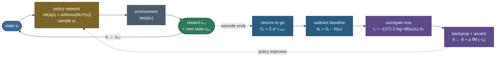

# Policy gradients (REINFORCE): learn the policy directly, then push up what worked

The [previous chapter](/ai-ml/ai-ml-learning-resources/core-machine-learning/reinforcement-learning/value-based-learning/q-learning/q-learning) taught an agent to act well *indirectly*: learn a **value** $Q(s,a)$ for every action, then behave by taking the $\arg\max_a Q(s,a)$. That worked beautifully on a frozen lake — but look closely at what it quietly assumed. To take the $\arg\max$ you need to *enumerate the actions and score each one*, so the action set must be **small and discrete**. Now put the agent in a body: a robot arm whose action is a real-valued torque on each of seven joints, a self-driving car whose action is a continuous $(\text{steer}, \text{throttle})$ pair. There is no finite list to argmax over — $\max_a Q(s,a)$ becomes its own optimization problem *at every single step*. And even in a discrete world, the greedy policy Q-learning produces is **deterministic**: in a state it always picks the same action. But some problems are only solvable by a *stochastic* policy — think rock-paper-scissors, or any partially-observed setting where two different situations look identical and the best you can do is randomize. A value-then-argmax method cannot represent "play left 60% of the time."

So ask the obvious question the whole chapter turns on: **why learn values at all?** The thing we actually want is the *policy* — the map from state to action. Q-learning treats the policy as a by-product of values. What if we **parameterize the policy directly** — a neural network $\pi_\theta(a\mid s)$ that reads the state and outputs a probability for each action — and then *adjust its parameters to make good actions more likely*? Run an episode; if it went well, reach into the network and nudge $\theta$ so that the actions we just took become more probable; if it went badly, make them less probable. No values, no argmax, no discreteness requirement. That single idea — **gradient ascent directly on the policy's expected reward** — is the policy-gradient method, and **REINFORCE** (Williams, 1992) is its simplest, purest instance.

Everything on this page is produced by a **real, runnable** pipeline — a from-scratch policy network trained by REINFORCE on the **real Gymnasium `CartPole-v1`** environment — and the two claims that matter are *proven*, not asserted by fiat. First, the central estimator: on a small tractable bandit we check with a hard `assert` that the REINFORCE **score-function gradient** matches *both* the exact analytic gradient *and* a numerical finite-difference — the policy-gradient theorem, verified end to end. Second, the central practical lesson: we *measure* that subtracting a **baseline** cuts the gradient's variance by roughly an order of magnitude (and prove numerically it adds no bias), which is exactly why the baselined agent learns faster and more reliably. Real training to the environment's solved threshold, real variance numbers, measured — and, because reinforcement learning is genuinely seed-sensitive, reported **honestly** across seeds. By the end you will be able to:

- state *why* a directly-parameterized policy handles continuous and stochastic actions where value-then-argmax cannot, and contrast policy-based with value-based control;
- **derive the policy-gradient theorem** from the **log-derivative (score-function) trick**, and explain precisely why the environment's transition dynamics *drop out* of the gradient;
- write the **REINFORCE update** from memory and connect every term — $\nabla_\theta \log \pi_\theta(a_t\mid s_t)$, the return $G_t$, the step size — to the intuition;
- explain why REINFORCE has **high variance**, why a **baseline** $b(s)$ reduces it *without adding bias* (and derive the unbiasedness), and why **reward-to-go** is the first variance cut;
- explain why REINFORCE is strictly **on-policy** and what that costs, and see how the learned-value baseline becomes the **critic** of the next chapter;
- run the whole thing yourself and reproduce every number, including the score-function proof and the baseline's measured variance reduction.

Intuition and pictures first, then the math (with sources), then the runnable, measured code.

> **Note:** this page assumes the [MDP](/ai-ml/ai-ml-learning-resources/core-machine-learning/reinforcement-learning/foundations/markov-decision-processes/markov-decision-processes) framing (states, actions, transitions, reward, discount $\gamma$, and the return $G_t$) and it is the **policy-based counterpart of value-based [Q-learning](/ai-ml/ai-ml-learning-resources/core-machine-learning/reinforcement-learning/value-based-learning/q-learning/q-learning)** — read that first for the contrast. The policy gradient is computed by ordinary [backpropagation](/ai-ml/ai-ml-learning-resources/deep-learning/neural-network-foundations/backpropagation-and-computational-graphs/backpropagation-and-computational-graphs) through $\log\pi_\theta$; we recap what we need but link out for the full treatment.

---

## The problem: value-then-argmax quietly needs a small, discrete action set

Make the limitation concrete. Q-learning's behaviour rule is $\pi(s) = \arg\max_a Q(s,a)$. Three things are hidden in that innocent $\arg\max$:

**It needs to enumerate actions.** Computing $\max_a Q(s,a)$ means scoring every action and taking the best. With four moves on a grid that is a trivial four-way comparison. With a *continuous* action — a torque $\tau \in \mathbb{R}$, a steering angle — there is no finite set to compare; the $\max$ over a continuous action space is itself a nonlinear optimization you would have to solve *inside every environment step*. Value-based control does not gracefully survive the jump to continuous control (it takes real machinery — [DDPG, SAC](/ai-ml/ai-ml-learning-resources/core-machine-learning/reinforcement-learning/policy-learning/continuous-control-ddpg-td3-sac/continuous-control-ddpg-td3-sac) — to drag it there).

**Its policy is deterministic.** $\arg\max$ returns one action. But the optimal policy for many problems is irreducibly *random*. In a game with a bluffing opponent, or any environment where distinct states produce identical observations (partial observability), a deterministic policy is exploitable or simply stuck; the best achievable behaviour is a *distribution* over actions ("go left with probability 0.6"). A value-then-argmax agent has no way to *represent*, let alone learn, such a policy.

**Its improvement is indirect.** Q-learning learns values and *hopes* the induced greedy policy is good. But the object we are graded on is the policy. Optimizing a proxy (values) and reading off the policy is a detour — and with function approximation the detour can diverge (the greedy step and the value-fitting step can fight each other).

> **Tip:** the interview one-liner for "why policy gradients over Q-learning?" — *"Policy gradients optimize the thing you actually deploy — the policy — directly, so they handle **continuous** and **stochastic** action spaces naturally and improve the policy by gradient ascent instead of via an argmax over values. The cost is higher variance and strict on-policy learning."*

What we want is a method that (a) represents the policy as a differentiable, possibly-stochastic function we can evaluate on any action space, (b) improves it by moving its parameters in the direction that increases expected reward, and (c) needs no model of the environment and no argmax. That is exactly policy gradients.

---

## Intuition first: a tunable action-chooser, and "trial, then reinforce what worked"

Forget the equations. Here is the whole idea in one move.

Picture the policy as a **box of knobs** — the network parameters $\theta$ — that reads the current state and lights up a probability for each action: "in *this* state, 70% push-right, 30% push-left." To *act*, you sample from those probabilities (so the policy explores *by its own randomness* — no bolted-on ε-greedy needed). To *learn*, you do the most natural thing imaginable: **run a full episode, see how much total reward it earned, and if it earned a lot, turn the knobs so that the exact actions you took become more likely next time; if it earned little, turn them the other way.** Trial, then reinforce what worked. That is literally where the name REINFORCE comes from.

The one subtlety — and the seed of the entire mathematics — is *how* you turn the knobs. You do not know which specific action was the good one (the credit-assignment problem again). REINFORCE's answer is beautifully blunt: **weight the "make-more-likely" nudge for each action by the return that followed it.** An action taken on a trajectory that ultimately scored $+500$ gets a big shove toward higher probability; an action on a trajectory that scored $+10$ gets a tiny one. Average this over many episodes and the noise washes out: actions that *genuinely* tend to precede high return drift up in probability, actions that tend to precede low return drift down. The policy climbs.

The analogy that holds up under pressure: **it is like training a dog with delayed treats, when you cannot explain *which* trick earned the treat.** You cannot tell the dog "the sit was good, the bark was irrelevant." All you can do is, after a good run, make the dog's *whole recent repertoire* a little more likely, and after a bad run, a little less. It looks hopelessly imprecise — you are rewarding the irrelevant barks too. But here is why it works: the irrelevant actions are just as likely to appear before *good* outcomes as before *bad* ones, so their up-nudges and down-nudges cancel in the average; only the actions that are *systematically* associated with reward accumulate a consistent push. The blunt instrument is *unbiased* — it points, on average, in exactly the right direction — even though any single episode's nudge is noisy. Hold onto both halves of that sentence: **unbiased but noisy** is the whole personality of REINFORCE, and everything that follows (baselines, actor-critic, PPO) is about keeping the unbiasedness while killing the noise.

Two dials matter, and they map one-to-one onto the theory:

- **How stochastic the policy is.** A freshly-initialized network is near-uniform (maximally exploratory); as it learns, the winning actions' probabilities sharpen toward 1. The *entropy* of $\pi_\theta$ is the exploration knob — and unlike ε-greedy, it is learned and state-dependent. Too sharp too early and the policy commits before it has explored (premature collapse); this is a real failure mode we will hit.
- **How much the noisy nudges are tamed.** Because a single episode's return is a wild estimate, the raw nudges jitter enormously. **Subtracting a baseline** — a running sense of "how much reward did I *expect* from here?" — recenters the weights so that only *better-than-expected* actions get pushed up. It changes nothing in expectation (we prove this) but slashes the variance. This is the single most important practical trick in the whole method.

---

## How it computes: the REINFORCE loop

The mechanism is a loop over whole **episodes** (not single steps — REINFORCE is Monte-Carlo, so it needs the completed return). Roll out a trajectory by sampling actions from the current policy; compute the discounted return-to-go at each step; form the gradient that pushes up the log-probability of each taken action, weighted by its (baseline-adjusted) return; take one ascent step; repeat.



Read the loop off the diagram. The **policy network** turns a state into action probabilities; we *sample* an action (this sampling is the exploration). The **environment** responds with a reward and next state — a black box we only sample, exactly as in Q-learning. Crucially, learning does **not** happen per step: we let the whole episode finish, then compute the **returns-to-go** $G_t$, subtract a **baseline** to get the advantage $A_t$, and assemble the **surrogate loss** whose gradient is the policy gradient. One `backward()` and one optimizer step nudge $\theta$; then we throw the trajectory away and roll a *fresh* one from the updated policy. That last point is not optional — the gradient is an expectation *under the current policy*, so old trajectories from an older policy are the wrong distribution. **REINFORCE is on-policy by construction**, and that is the property PPO later works so hard to relax.

The output space is worth stating precisely: a well-trained policy network maps each state to a distribution sharply peaked on a good action (near-deterministic where the task demands it, genuinely random where the task rewards randomness). A poorly-trained one is either still near-uniform (hasn't learned) or has **collapsed** — committed prematurely to a mediocre action with near-zero probability on everything else, so it can no longer explore its way out. Keep that failure mode in mind; it returns in the pitfalls.

---

## The math, derived

We build the estimator from the ground up, defining every symbol and connecting each term to the intuition. The MDP machinery is recapped, not re-derived — see [MDPs](/ai-ml/ai-ml-learning-resources/core-machine-learning/reinforcement-learning/foundations/markov-decision-processes/markov-decision-processes).

### Setup: the objective is expected return

A trajectory (episode) is $\tau = (s_0, a_0, r_1, s_1, a_1, r_2, \dots)$. Under a policy $\pi_\theta$ and the environment's dynamics, $\tau$ is random, and its probability factorizes into the parts we control and the parts we do not:

$$
p_\theta(\tau) \;=\; \underbrace{\rho(s_0)}_{\text{start dist.}} \prod_{t\ge 0} \underbrace{\pi_\theta(a_t \mid s_t)}_{\text{we control (}\theta\text{)}}\; \underbrace{P(s_{t+1}\mid s_t, a_t)}_{\text{environment (no }\theta\text{)}}.
$$

The **return** of a trajectory is its discounted reward sum $R(\tau) = \sum_{t\ge 0}\gamma^t r_{t+1}$, and the objective we want to *maximize* is the **expected return**:

$$
J(\theta) \;=\; \mathbb{E}_{\tau \sim p_\theta}\!\left[\, R(\tau) \,\right].
$$

This is the formal version of "how much reward does my policy earn on average." We will do gradient **ascent**: $\theta \leftarrow \theta + \alpha\, \nabla_\theta J(\theta)$. The entire problem is computing $\nabla_\theta J$ — and it looks impossible at first, because $\theta$ sits inside the distribution we are averaging over, and that distribution contains the unknown dynamics $P$.

### The log-derivative (score-function) trick

Here is the key manoeuvre, and it is worth savouring because the same trick reappears everywhere from variational inference to RLHF. We want the gradient of an expectation, $\nabla_\theta \mathbb{E}_{\tau\sim p_\theta}[R(\tau)] = \nabla_\theta \int p_\theta(\tau) R(\tau)\, d\tau$. Push the gradient inside the integral (the return $R(\tau)$ does not depend on $\theta$):

$$
\nabla_\theta J(\theta) \;=\; \int \nabla_\theta p_\theta(\tau)\; R(\tau)\, d\tau.
$$

We cannot sample from "$\nabla_\theta p_\theta$" — it is not a probability distribution. The trick is the identity $\nabla_\theta p_\theta = p_\theta \,\nabla_\theta \log p_\theta$ (which is just the chain rule for $\log$, rearranged: $\nabla \log p = \frac{\nabla p}{p}$). Substitute it:

$$
\nabla_\theta J(\theta) \;=\; \int p_\theta(\tau)\, \big[\nabla_\theta \log p_\theta(\tau)\big]\, R(\tau)\, d\tau \;=\; \mathbb{E}_{\tau\sim p_\theta}\!\Big[\, R(\tau)\, \nabla_\theta \log p_\theta(\tau) \,\Big].
$$

That is the **log-derivative trick**: it converts the *gradient of an expectation* (unsamplable) into an *expectation of a gradient* (samplable — just roll out trajectories and average). $\nabla_\theta \log p_\theta(\tau)$ is called the **score function**, hence "score-function estimator."

### The dynamics vanish — the policy-gradient theorem

Now watch the environment disappear. Take the log of the trajectory probability, turning the product into a sum:

$$
\log p_\theta(\tau) \;=\; \log \rho(s_0) + \sum_{t\ge 0} \log \pi_\theta(a_t\mid s_t) + \sum_{t\ge 0} \log P(s_{t+1}\mid s_t, a_t).
$$

Take the gradient with respect to $\theta$. The start-state term $\log\rho(s_0)$ and *every* transition term $\log P(s_{t+1}\mid s_t,a_t)$ **do not depend on $\theta$** — they are the environment, not the policy — so their gradients are exactly zero. Only the policy terms survive:

$$
\nabla_\theta \log p_\theta(\tau) \;=\; \sum_{t\ge 0} \nabla_\theta \log \pi_\theta(a_t \mid s_t).
$$

This is the crux of the whole method: **we can compute the gradient without ever knowing the dynamics $P$**, because $P$ has no $\theta$ in it and differentiates away. Substituting back gives the **policy-gradient theorem** in its trajectory form:

$$
\boxed{\;\nabla_\theta J(\theta) \;=\; \mathbb{E}_{\tau\sim p_\theta}\!\left[\, \left(\sum_{t\ge 0} \nabla_\theta \log \pi_\theta(a_t\mid s_t)\right) R(\tau) \,\right].\;}
$$

Read it against the intuition: for each action we took, $\nabla_\theta \log \pi_\theta(a_t\mid s_t)$ is the direction in parameter space that makes that action *more probable*; we sum those directions over the episode and scale the whole thing by the return $R(\tau)$. Good episodes ($R$ large) push their actions up hard; bad episodes push theirs down. Exactly "trial, then reinforce what worked."

> **Source / derivation:** the score-function estimator and the REINFORCE update are Williams, *Simple Statistical Gradient-Following Algorithms for Connectionist Reinforcement Learning* (1992); the **policy-gradient theorem** (with function approximation, and the compatible-features result) is Sutton, McAllester, Singh & Mansour, *Policy Gradient Methods for Reinforcement Learning with Function Approximation* (NeurIPS 2000); the modern textbook treatment is Sutton & Barto, *Reinforcement Learning: An Introduction* (2nd ed., 2018), Chapter 13. All in the [references](policy-gradients-reinforce.references.md).

### Reward-to-go: causality gives the first variance cut

The boxed form scales *every* action in the episode by the *whole-trajectory* return $R(\tau)$ — including rewards collected **before** that action was taken. But an action at time $t$ cannot influence the past. Formally, for $t' < t$, $\mathbb{E}[\nabla_\theta \log\pi_\theta(a_t\mid s_t)\, r_{t'+1}] = 0$, so those past-reward terms contribute nothing in expectation — they are **pure variance**. Dropping them replaces $R(\tau)$ on each action with the **reward-to-go** $G_t = \sum_{k\ge t}\gamma^{k-t} r_{k+1}$ (only the rewards that action could have affected):

$$
\nabla_\theta J(\theta) \;=\; \mathbb{E}_{\tau\sim p_\theta}\!\left[\, \sum_{t\ge 0} \nabla_\theta \log \pi_\theta(a_t\mid s_t)\; G_t \,\right].
$$

Same expectation, less noise — the first and cheapest variance reduction, and the form we actually implement.

### The baseline: less variance, provably no bias

REINFORCE's defining weakness is the **variance** of that estimator: a single episode's $G_t$ is a wildly noisy number, so the per-episode gradient jumps around and learning is slow and unstable. The fix that changes everything is to subtract a **baseline** $b(s_t)$ — a number that depends on the state but *not on the action* — from the return:

$$
\nabla_\theta J(\theta) \;=\; \mathbb{E}\!\left[\, \sum_{t} \nabla_\theta \log \pi_\theta(a_t\mid s_t)\, \big(G_t - b(s_t)\big) \,\right].
$$

The quantity $A_t = G_t - b(s_t)$ is an **advantage**: "how much better than expected was this action?" Intuitively, without a baseline every action on a positive-return episode gets pushed *up* (just by different amounts), which is a lot of wasted, noisy motion; subtracting a baseline makes only *better-than-baseline* actions go up and *worse-than-baseline* actions go down, which is both more sensible and far less jittery.

The critical property is that **this changes the variance but not the expectation** — the baseline adds *zero bias*. Here is the one-line proof, and it is worth doing because a wrong version of it is a classic interview trap. The extra term the baseline introduces has expectation zero at every state $s$:

$$
\mathbb{E}_{a\sim\pi_\theta(\cdot\mid s)}\!\big[\nabla_\theta \log\pi_\theta(a\mid s)\, b(s)\big]
= b(s)\sum_a \pi_\theta(a\mid s)\,\nabla_\theta \log\pi_\theta(a\mid s)
= b(s)\sum_a \nabla_\theta \pi_\theta(a\mid s)
= b(s)\,\nabla_\theta \underbrace{\sum_a \pi_\theta(a\mid s)}_{=\,1} = b(s)\cdot 0 = 0.
$$

The middle step uses the same log-derivative identity in reverse ($\pi\,\nabla\log\pi = \nabla\pi$); the last uses the fact that probabilities sum to one, so their gradient is the gradient of a constant. Because $b(s)$ can be pulled out of the action-sum (it does not depend on $a$), the whole term vanishes. **Any state-only baseline is unbiased** — you are free to choose it to minimize variance. The simplest useful choice is a running **mean return** (a constant baseline); the best simple choice is the **state value** $b(s)=V(s)$, since $G_t - V(s_t)$ is precisely "did this action beat the average outcome from here." Learning $V(s)$ with its own network turns the baseline into a **critic** — and REINFORCE-with-a-learned-baseline *is* the [actor-critic](/ai-ml/ai-ml-learning-resources/core-machine-learning/reinforcement-learning/policy-learning/actor-critic-a2c-a3c/actor-critic-a2c-a3c) method of the next chapter.

### From gradient to loss: backprop computes the policy gradient

In code we do not assemble the gradient by hand; we write a scalar **surrogate loss** whose gradient *is* the policy gradient, and let autograd do the rest:

$$
L(\theta) \;=\; -\,\frac{1}{T}\sum_{t=0}^{T-1} \log \pi_\theta(a_t\mid s_t)\, A_t, \qquad \nabla_\theta\big(-L\big) \;=\; \text{the policy-gradient estimate}.
$$

The minus sign converts gradient *descent* (what optimizers do) into gradient *ascent* on $J$. When you call `loss.backward()`, autograd runs [backpropagation](/ai-ml/ai-ml-learning-resources/deep-learning/neural-network-foundations/backpropagation-and-computational-graphs/backpropagation-and-computational-graphs) through $\log\pi_\theta(a_t\mid s_t)$ — the exact same chain-rule machinery that trains any neural network. The "policy gradient" is not a special new algorithm at the implementation level; it is ordinary backprop with the advantage $A_t$ as a per-step weight. One important subtlety: $A_t$ is treated as a **constant** (detached) — we differentiate through the log-probability, *not* through the returns, because the log-derivative trick already accounted for how $\theta$ affects the trajectory distribution.

---

## The build, proven

Everything above is executable. The companion module — **[reinforce.py](code/reinforce.py)** — and the step-by-step **[runnable notebook](code/policy-gradients-reinforce.ipynb)** train a from-scratch policy network with REINFORCE on real Gymnasium `CartPole-v1`, and make the two central claims *checkable* with hard `assert`s. Every number below is printed by that code, seeded and CPU-pinned for a reproducible trace.

### The proof: the score-function gradient equals the exact gradient

The claim "REINFORCE estimates the true policy gradient" is easy to say and easy to fake. We make it a hard `assert` on a case small enough to have a closed form: a **3-armed bandit** with fixed per-arm rewards $R = [1.0, 2.0, 0.5]$ and a softmax policy $\pi_\theta = \mathrm{softmax}(\theta)$, so the objective $J(\theta) = \sum_a \pi_\theta(a)\,R(a)$ is exact and differentiable. We compute its gradient three independent ways — **analytically** (autograd through the closed-form $J$), by the **REINFORCE** Monte-Carlo estimate $\frac{1}{N}\sum_i R(a_i)\,\nabla_\theta \log\pi_\theta(a_i)$ with $N=200{,}000$ samples, and by a central **finite-difference** of $J$ — and they agree: the analytic gradient is `[-0.0329, 0.2383, -0.2054]`, the REINFORCE estimate is `[-0.0329, 0.2389, -0.2059]`, and the finite-difference is `[-0.0329, 0.2383, -0.2054]`. The measured discrepancies are `max|MC − analytic| = 5.9e-04` (pure Monte-Carlo noise) and `max|finite-diff − analytic| = 1.3e-10` (numerically exact). The log-derivative trick is not a hand-wave — it is verified end to end.

![The policy-gradient theorem verified numerically on a tractable 3-armed bandit. Left: the gradient of the expected reward computed three independent ways — the exact analytic gradient (autograd of the closed-form J, blue), the REINFORCE score-function Monte-Carlo estimate over N = 200,000 samples (green), and a central finite-difference of J (amber) — overlap component for component; the residuals are max|MC − analytic| = 5.9e-04 (Monte-Carlo noise) and max|finite-diff − analytic| = 1.3e-10 (machine precision). Right: the REINFORCE estimate's error against the analytic gradient shrinks like 1/√N as the sample count grows (green markers tracking the dashed 1/√N reference), the signature of an unbiased Monte-Carlo estimator. This is the "real thing" proof: the estimator this whole chapter rests on computes exactly the gradient it claims to.](images/rl09_score_function.png)

The right panel is the honest fine print of "unbiased but noisy": the estimator is *correct in expectation*, and its error decays like $1/\sqrt{N}$ — so with enough samples it is arbitrarily accurate, but any single small-sample estimate (one episode!) is jittery. That jitter is precisely the variance we now attack.

### The key lesson, measured: a baseline cuts variance without bias

The baseline is the single most important practical idea in REINFORCE, so we prove *both* halves of the claim numerically. **Unbiased:** the Monte-Carlo estimate of $\mathbb{E}_a[\nabla_\theta\log\pi_\theta(a\mid s)\,b]$ for a constant baseline $b=5$ comes out to `2.7e-03` — zero up to sampling noise, exactly as the derivation demands. **Lower variance:** on a fixed, partially-trained policy we compute the single-episode gradient 200 times with $A_t=G_t$ and 200 times with $A_t = G_t - \bar{G}$, and the mean per-parameter variance falls from `0.085` to `0.012` — a **7.1× reduction** — for the same expected direction.

![The baseline lesson, measured. Left: mean learning curves (±1 std across 3 seeds) on real CartPole-v1 — REINFORCE with a mean-return baseline (green) climbs quickly and steadily to the solved threshold of 475, while plain REINFORCE with no baseline (red) is far noisier and never gets there in the same budget. Right: on a fixed partially-trained policy, subtracting the mean-return baseline cuts the mean per-parameter variance of the single-episode gradient estimate from 0.085 to 0.012 — a 7.1× reduction — with no change to the expected gradient (proven unbiased). Same direction, far less noise: that is why the baselined agent learns faster.](images/rl09_baseline_variance.png)

The left panel is the payoff in behaviour. Across three seeds, REINFORCE **with** the baseline reaches a final-100 mean return of **498.5 ± 2.1** (essentially the 500-step cap), while **without** the baseline it manages only **46.6 ± 52.6** in the same 1000-episode budget — a tenfold gap, from one line of code. This is not a knob to tune later; it is the difference between learning and thrashing.

### Real convergence: REINFORCE solves CartPole from scratch

With the baseline in place, a policy network trained from scratch reaches the environment's **solved** bar — a mean return $\ge 475$ over 100 consecutive episodes, against the 500-step cap. The learning curve climbs from the untrained policy's handful of steps to a balanced 500, and the return climbs there (with a temporary dip around episodes 600–800 that it recovers from — visible in the figure below).

![The real learning curve of REINFORCE-with-baseline on Gymnasium CartPole-v1 (headline seed): the faint grey trace is the raw per-episode return, the green line its 100-episode rolling mean, climbing from near zero to the environment cap of 500 and crossing the solved threshold of 475 (blue dashed) at episode 266 (amber). Note the honest wobble around episodes 600–800 — a temporary partial policy collapse that REINFORCE recovers from on its own; single-episode Monte-Carlo gradients are noisy enough that even a solved policy can slip and re-learn. Real training, measured: a policy network learns to balance the pole from reward alone, with no value function and no argmax.](images/rl09_learning_curve.png)

Reinforcement learning is genuinely **seed-sensitive**, and it would be dishonest to show one lucky run. With the baseline, all three seeds solve — but *when* they solve varies a lot: seed 0 first reaches the threshold at episode **266**, seed 2 at **559**, and seed 1 not until **914**, all finishing at essentially the cap (final-100 means 500.0, 495.6, 500.0). That spread in solve-time — same code, same hyperparameters, different RNG — is the honest face of policy-gradient variance, and it is exactly why the field's through-line is variance reduction (baselines → actor-critic → PPO). We report the spread rather than cherry-pick.

### What the learned policy does

Finally, the point of it all: the trained policy actually balances the pole. Rolling out the learned (seed-0) policy beside a freshly-initialized one makes the learning visible in the physical variable that matters — the pole angle.


### Reading the module's report

Running `python reinforce.py` prints the consolidated, reproducible report — every number this page quotes, each headline relationship guarded by a hard `assert`:

```
torch 2.12.0 | numpy 2.4.6 | gymnasium 1.3.0
(training on CPU for a reproducible trace; best available device = mps; seed=0; env: gymnasium)

=== 1. Score-function estimator is CORRECT (tractable 3-armed bandit, N=200000) ===
  analytic grad of J     : [-0.0329  0.2383 -0.2054]
  REINFORCE MC estimate  : [-0.0329  0.2389 -0.2059]
  central finite-diff    : [-0.0329  0.2383 -0.2054]
  max|MC - analytic|     = 5.86e-04
  max|finite-diff - anal|= 1.26e-10
  => the log-derivative trick grad E[R] = E[R grad log pi] is verified end to end

=== 2. A state-independent baseline is UNBIASED: E[b * grad log pi] = 0 ===
  max|MC estimate of E[b grad log pi]| = 2.73e-03  (=> ~0: no bias added)

=== 3. A baseline REDUCES gradient variance (fixed partially-trained policy, 200 rollouts) ===
  mean per-parameter grad variance  no baseline = 0.085
  mean per-parameter grad variance  mean-baseline = 0.012
  => variance reduced 7.1x by subtracting the mean return

=== 4. REINFORCE SOLVES CartPole-v1 (threshold 475, cap 500); RL is seed-sensitive — reported honestly ===
  [with baseline]  seed 0: final-100 mean =  500.0   (solved@266)
  [with baseline]  seed 1: final-100 mean =  500.0   (solved@914)
  [with baseline]  seed 2: final-100 mean =  495.6   (solved@559)
  [no baseline]    seed 0: final-100 mean =    9.3   (not solved in budget)
  [no baseline]    seed 1: final-100 mean =  121.0   (not solved in budget)
  [no baseline]    seed 2: final-100 mean =    9.4   (not solved in budget)
  mean final-100 return: with baseline = 498.5 +/- 2.1   vs no baseline = 46.6 +/- 52.6

All checks passed: ...
```

Read top to bottom, that is the page in numbers: the score-function estimator matches the exact gradient (the theorem holds); a constant baseline is unbiased and cuts gradient variance ~7×; and REINFORCE trains a policy from scratch to solve CartPole — dramatically better *with* the baseline than without, and seed-sensitive, reported honestly. Each headline relationship is a hard `assert` — if the score-function estimate stopped matching the analytic gradient, or the baseline stopped reducing variance, the module *raises*; it does not print a wrong number and exit 0.

> **Note on reproducibility and honesty.** Numbers are computed on **CPU** with fixed seeds (`torch.manual_seed` + NumPy + `env.reset(seed=...)`), so the bandit proof and the variance measurement are bit-reproducible on any machine. The CartPole solve-times are inherently seed-dependent — that variance *is the lesson*, and we report the full spread (solved at 266 / 559 / 914 across seeds) rather than a single lucky run. If **Gymnasium is not installed**, the module falls back to a real, fully-specified from-scratch corridor MDP with explicit dynamics and a DP-computable optimum — every training run still executes on real transition data; it never mocks a transition or fabricates a return, and the banner says which path it took. The score-function proof is environment-independent and always runs on the tractable bandit.

---

## Common pitfalls and failure modes

REINFORCE has a sharp set of traps, and every one shows up in interviews and in real code:

- **High variance is the defining problem — do not skip the baseline.** Plain REINFORCE ($A_t = G_t$) works on toy problems and thrashes on real ones; the single-episode gradient is so noisy that learning is slow or fails. The mean-return baseline is one line of code and buys roughly an order-of-magnitude variance reduction (measured above). Skipping it is the most common reason a from-scratch REINFORCE "doesn't learn."
- **Differentiating through the returns.** The advantage $A_t$ must be **detached** (a constant) in the loss. If $A_t$ carries a gradient (e.g. because you built it from the same network without `.detach()`), autograd will differentiate through it and you are no longer computing the policy gradient — you get a subtly wrong update that often looks like "training is unstable." In PyTorch: build the weights as a plain tensor, or call `.detach()`.
- **Reusing old trajectories (violating on-policy).** The gradient is an expectation *under the current policy*. Take a step, and every stored trajectory is now off-distribution; using it biases the gradient. Plain REINFORCE must throw each batch away after one update — which is exactly its **sample inefficiency**. If you want to reuse data you need importance sampling and a trust region — that is [PPO](/ai-ml/ai-ml-learning-resources/core-machine-learning/reinforcement-learning/policy-learning/proximal-policy-optimization-ppo/proximal-policy-optimization-ppo), not REINFORCE.
- **Premature policy collapse (entropy → 0).** If the policy sharpens too fast — often from too large a learning rate or unnormalized, large-magnitude returns — it commits to a mediocre action with near-zero probability elsewhere, and can no longer explore its way out. Symptoms: the return climbs then crashes to a floor and stays there. Fixes: lower the learning rate, standardize the advantages, or add an **entropy bonus** to the loss to keep the policy stochastic.
- **Reward scale and the missing baseline interact.** Because the update scales linearly with the return, an environment with large-magnitude rewards produces huge, destabilizing gradients. Centering with a baseline (and often normalizing the advantages) is what keeps the step sizes sane — another reason the baseline is not optional in practice.
- **Forgetting the discount / off-by-one in reward-to-go.** $G_t$ must sum rewards **from $t$ onward** ($r_{t+1}, r_{t+2}, \dots$), discounted from $t$. Including earlier rewards re-introduces the variance the reward-to-go form removed; misaligning the index by one silently corrupts the credit assignment. Compute it with a single reverse scan (as the module does) and check the first/last entries.
- **Confusing the *bias* of the baseline with the *bias* of bootstrapping.** A Monte-Carlo baseline ($G_t$-based) is unbiased. The moment you replace $G_t$ with a bootstrapped estimate $r + \gamma V(s')$ (actor-critic), you trade some **bias** for a large **variance** reduction — a different, deliberate trade. Know which one you are making.

---

## Where it is used and why it matters

- **REINFORCE is the root of the entire policy-based family.** Every modern policy-optimization algorithm is REINFORCE plus a variance-reduction or stability idea. Add a **learned value baseline** and bootstrap it and you get [**actor-critic / A2C / A3C**](/ai-ml/ai-ml-learning-resources/core-machine-learning/reinforcement-learning/policy-learning/actor-critic-a2c-a3c/actor-critic-a2c-a3c). Constrain the step so the policy cannot move too far in one update and you get [**TRPO**](/ai-ml/ai-ml-learning-resources/core-machine-learning/reinforcement-learning/policy-learning/trust-region-policy-optimization-trpo/trust-region-policy-optimization-trpo); replace the hard constraint with a clipped surrogate and let it reuse data for several epochs and you get [**PPO**](/ai-ml/ai-ml-learning-resources/core-machine-learning/reinforcement-learning/policy-learning/proximal-policy-optimization-ppo/proximal-policy-optimization-ppo), the workhorse of applied deep RL. If you understand the estimator on this page, you understand the beating heart of all of them.
- **Policy gradients are how we align large language models.** **RLHF** — the technique behind ChatGPT-style assistants — treats the language model as a policy $\pi_\theta(\text{token}\mid \text{context})$ and runs a policy-gradient method (PPO) to push up the log-probability of responses a reward model scores highly. It is the log-derivative trick of this page, applied to a policy with a vocabulary-sized action space; the KL-to-reference term is a trust region. The forward link is [RLHF in the LLMs track](/ai-ml/ai-ml-learning-resources/llms-applications-and-agents/readme).
- **They are the natural fit for continuous control and stochastic optimal policies.** Robotics (torques), locomotion, and any continuous-action problem use policy gradients (via [DDPG/TD3/SAC](/ai-ml/ai-ml-learning-resources/core-machine-learning/reinforcement-learning/policy-learning/continuous-control-ddpg-td3-sac/continuous-control-ddpg-td3-sac) and PPO) precisely because there is no argmax to take. And where the optimal policy is genuinely random (partial observability, games), only a policy-based method can represent it.
- **When *not* to reach for plain REINFORCE.** If your actions are few and discrete and you can afford off-policy data reuse, value-based [Q-learning / DQN](/ai-ml/ai-ml-learning-resources/core-machine-learning/reinforcement-learning/value-based-learning/q-learning/q-learning) is far more **sample-efficient** (it reuses every transition via replay; REINFORCE throws each episode away). If you need stable, data-efficient policy learning at scale, use **PPO**, not vanilla REINFORCE — REINFORCE is the right tool for *understanding* the gradient and for small problems, and the wrong tool when sample budget or stability matters.

> **Tip:** the practitioner's one-line recipe — *"build a policy net that outputs action logits; sample an action, store its log-prob; at episode end compute discounted reward-to-go, subtract a baseline, and take one Adam step on `-(logπ · advantage).mean()`; then discard the episode and repeat."* That sentence is the whole algorithm — and swapping the mean baseline for a learned value net is your first actor-critic.

> **Try it:** in the [notebook](code/policy-gradients-reinforce.ipynb), before you run anything, *predict the direction*. (1) Turn the baseline **off** (`baseline="none"`): will the learning curve get noisier, slower, or fail outright — and by how much does the measured gradient variance change? (2) Raise the learning rate 5× on CartPole: will it learn faster, or collapse (return climbs then crashes)? (3) On the tractable bandit, halve the Monte-Carlo sample count: does the score-function error grow like $1/\sqrt{N}$? Write your prediction down, change the one line, and check. Being *wrong* about the direction is where the learning is.

---

## Recap and rapid-fire

**If you remember nothing else:** REINFORCE optimizes the **policy directly**. It maximizes expected return $J(\theta)=\mathbb{E}_\tau[R(\tau)]$ by gradient ascent, using the **log-derivative trick** to get a samplable gradient $\nabla_\theta J = \mathbb{E}[\sum_t \nabla_\theta\log\pi_\theta(a_t\mid s_t)\,G_t]$. The environment's **dynamics drop out** (they carry no $\theta$), so it is model-free. It is **unbiased but high-variance**; a **baseline** $b(s)$ (mean return, or a learned $V(s)$ → actor-critic) cuts the variance *without adding bias* (because $\mathbb{E}[\nabla\log\pi\cdot b]=0$). It is strictly **on-policy** (throw each episode away after one update → sample-inefficient). We proved it: the score-function gradient matches the analytic and finite-difference gradients on a tractable bandit, and the baseline's measured variance reduction is real.

**Quick-fire — say these out loud:**

- *What does REINFORCE optimize, and how?* Expected return $J(\theta)=\mathbb{E}_\tau[R(\tau)]$, by gradient **ascent** on the policy parameters $\theta$.
- *State the policy-gradient theorem.* $\nabla_\theta J = \mathbb{E}_\tau[\sum_t \nabla_\theta \log\pi_\theta(a_t\mid s_t)\, G_t]$.
- *What is the log-derivative trick?* $\nabla_\theta \mathbb{E}_{p_\theta}[R] = \mathbb{E}_{p_\theta}[R\,\nabla_\theta\log p_\theta]$ — turns the gradient of an expectation into an expectation of a gradient (samplable).
- *Why do the dynamics vanish?* $\log p_\theta(\tau)$ splits into policy terms + transition terms; $P(s'\mid s,a)$ has no $\theta$, so $\nabla_\theta \log P = 0$. Model-free.
- *Why a baseline, and why is it unbiased?* It cuts variance; unbiased because $\mathbb{E}_a[\nabla\log\pi(a\mid s)\,b(s)] = b(s)\nabla_\theta\sum_a\pi(a\mid s) = b(s)\nabla 1 = 0$.
- *What is the advantage?* $A_t = G_t - b(s_t)$ — "how much better than expected." With $b=V$, it is the classic advantage $A(s,a)$.
- *Reward-to-go vs full return?* Use $G_t$ (rewards from $t$ onward), not $R(\tau)$: past rewards can't be caused by $a_t$, so they only add variance (causality).
- *Why is REINFORCE on-policy?* The gradient is an expectation under the *current* policy; a step makes stored trajectories off-distribution, so they can't be reused without importance sampling → PPO.
- *REINFORCE vs Q-learning?* Policy-based vs value-based; on-policy vs off-policy; handles continuous/stochastic actions vs needs a discrete argmax; higher variance vs more sample-efficient.
- *What is the loss you actually differentiate?* $L = -\frac{1}{T}\sum_t \log\pi_\theta(a_t\mid s_t)\,A_t$, with $A_t$ **detached**; `loss.backward()` is the policy gradient.
- *Where does the baseline become a critic?* Learn $b(s)=V_\phi(s)$ with its own network → actor-critic (chapter 10).

---

## References and further reading

The curated link library for this topic — the start-here path, videos, courses, articles, papers, and books, plus internal cross-links — lives in a companion file so it can be reused as a standalone reference list:

**→ [Policy Gradients (REINFORCE) — references and further reading](policy-gradients-reinforce.references.md)**
