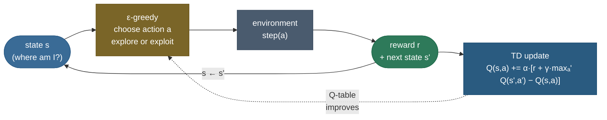

# Q-learning: learning to act well from reward alone, with no map of the world

Drop an agent onto a frozen lake. It cannot see a map. It does not know the rules of the ice — which way it will slide, where the holes are. And it receives **no reward at all** until, if it is lucky, it stumbles onto the goal and collects a single **+1**. Every other step pays nothing. From that one delayed, sparse signal — and nothing else — it must learn to walk *straight* to the goal, every time. This is the reinforcement-learning problem in its starkest form, and it is genuinely hard for a reason worth feeling before we solve it: **the action that mattered happened long before the reward arrived.** The agent stepped right, then down, then right again, and only *many* steps later did +1 appear. Which of those actions deserves the credit? This is the **credit-assignment problem**, and a learner with no model of the world cannot reason it out — it can only *learn* it, from experience.

The naive approaches all break. You cannot enumerate every path and pick the best — you do not know the transition rules ([the MDP's $P$](/ai-ml/ai-ml-learning-resources/core-machine-learning/reinforcement-learning/foundations/markov-decision-processes/markov-decision-processes)), so you cannot plan. You cannot wait for the full return of every trajectory and average (that is [Monte-Carlo](/ai-ml/ai-ml-learning-resources/core-machine-learning/reinforcement-learning/value-based-learning/monte-carlo-methods/monte-carlo-methods), and it needs episodes to finish and has high variance). And you certainly cannot hand-label "good" and "bad" states — the whole point is that the agent must *discover* which states are valuable. What you need is a way to learn, from single sampled transitions, a running estimate of *how good each action is in each state*, that (a) improves online without waiting for episodes to end, (b) requires no model of the environment, and (c) provably converges to the optimal way to act. That is exactly what **Q-learning** delivers.

Everything on this page is produced by a **real, runnable** pipeline — from-scratch tabular Q-learning on **real Gymnasium environments** (`FrozenLake-v1` and `CliffWalking-v1`), with the learned policy **proven optimal against a dynamic-programming ground truth**. We compute the exact optimum by [value iteration](/ai-ml/ai-ml-learning-resources/core-machine-learning/reinforcement-learning/foundations/dynamic-programming-value-and-policy-iteration/dynamic-programming-value-and-policy-iteration) on the environment's true dynamics, then check — with a hard `assert` — that Q-learning, *learning from sampled experience alone and never seeing those dynamics*, recovers it: an **optimality gap of exactly `0`** on FrozenLake, and a greedy return of exactly the optimal **`−13`** on CliffWalking. Real convergence, real optimum, measured. By the end you will be able to:

- state *why* an agent with no model and delayed reward needs action-values, and what $Q(s,a)$ means;
- write the **Q-learning update** from memory and explain each term against the intuition;
- derive it as a **sample-based stochastic approximation of the Bellman optimality equation**, and define the **TD error**;
- explain precisely why the `max` in the target makes Q-learning **off-policy**, and contrast it with [SARSA](/ai-ml/ai-ml-learning-resources/core-machine-learning/reinforcement-learning/value-based-learning/sarsa/sarsa);
- state the **convergence conditions** (visit every state-action infinitely often; decaying step sizes) and why ε-greedy with decay supplies them;
- run the whole thing yourself and get the same numbers, including the famous Q-learning-vs-SARSA cliff result.

Intuition and pictures first, then the math (with sources), then the runnable, measured code.

> **Note:** this page assumes the [MDP](/ai-ml/ai-ml-learning-resources/core-machine-learning/reinforcement-learning/foundations/markov-decision-processes/markov-decision-processes) framing (states, actions, transitions, reward, discount $\gamma$) and the [Bellman equations](/ai-ml/ai-ml-learning-resources/core-machine-learning/reinforcement-learning/foundations/bellman-equations/bellman-equations), and it *is* the control counterpart of [Temporal-Difference learning](/ai-ml/ai-ml-learning-resources/core-machine-learning/reinforcement-learning/value-based-learning/temporal-difference-learning/temporal-difference-learning) (TD estimates values; Q-learning uses a TD update to learn the *optimal* action-values). We recap what we need but link out for the full treatment.

---

## The problem: no model, delayed reward, and the credit-assignment trap

Make the difficulty concrete on the real 4×4 FrozenLake grid we will actually solve. **S**tart is top-left, the **G**oal is bottom-right worth +1, four tiles are **H**oles that end the episode with reward 0, and the rest are frozen tiles you can stand on. The agent picks one of four moves each step. The *only* non-zero reward in the entire task is the +1 at the goal.

Two things make this unlearnable by naive means:

**There is no model to plan with.** [Dynamic programming](/ai-ml/ai-ml-learning-resources/core-machine-learning/reinforcement-learning/foundations/dynamic-programming-value-and-policy-iteration/dynamic-programming-value-and-policy-iteration) — value iteration, policy iteration — solves an MDP *exactly*, but it needs the transition function $P(s' \mid s,a)$ and reward function $R$ in hand to compute expectations. Our agent does not have them. It only gets to *try* an action and *see* what happens. It must learn the *consequences* of acting, not look them up.

**The reward is delayed, so credit is ambiguous.** When +1 finally arrives, dozens of earlier actions contributed. A method that only knows "this whole trajectory got +1" (Monte-Carlo) must wait for the episode to end and then smears the credit across every action equally, with high variance. We want something that assigns credit *locally and online*: after a single step $s \xrightarrow{a} s'$, update our estimate of that one action using the value we already believe $s'$ has. That "bootstrapping from the next state's current estimate" is the TD idea, and it is what lets Q-learning learn from one transition at a time, before the episode is even over.

> **Tip:** the interview one-liner for "why not just use dynamic programming?" — *"DP needs the environment's transition and reward model to compute expectations; Q-learning is **model-free** — it replaces the expectation with sampled transitions and learns the same optimal action-values from experience alone."*

---

## Intuition first: learn a "quality" score for each action, then act greedily

Forget the equations. Here is the whole idea in one move.

Imagine that for every state you had a little scorecard: for each action available, a number saying **"how good is it to take this action here, if I then play as well as possible forever after?"** Call that number $Q(s,a)$ — the **quality**, or **action-value**, of action $a$ in state $s$. If you had the *correct* scorecard, acting optimally would be trivial: in each state, just read off the action with the highest score and take it. No planning, no model, no search — a lookup. The entire problem reduces to **learning the scorecard.**

So how do you learn it from experience without a model? By **bootstrapping** — improving each estimate using your *other* estimates. Suppose you are in state $s$, take action $a$, receive reward $r$, and land in $s'$. You now have a *better* opinion about $Q(s,a)$ than before, because you have new information: the reward you actually got, *plus* how good the best action in $s'$ looks according to your current scorecard. That combination, $r + \gamma \max_{a'} Q(s',a')$, is a one-step-improved estimate of $Q(s,a)$. You do not overwrite your old value with it (a single sample is noisy) — you nudge the old value a small fraction $\alpha$ of the way toward it. Do that over and over, across thousands of transitions, and the scorecard tightens toward the truth. The estimates lift themselves up by their own bootstraps — each one leaning on the next — until they settle at the optimal values.

The analogy that holds up: **it is like learning the value of chess positions by playing, not by calculating.** You do not compute the game tree; you keep a feel for how good each position-move is, and every time a move leads to a position you already rate highly (or to an immediate win), you bump up your rating of that move a little. Over many games the ratings converge to something that plays well — and crucially, you can *learn the ratings of good play while still playing exploratory, imperfect moves*. That last point is the seed of Q-learning's superpower (off-policy learning), and we will make it exact.

Two knobs make this work, and they are the only two you really tune:

- **How much to explore.** If you always take the current-best action you will never discover a better one — you would lock in the first mediocre route to the goal. So you must sometimes act randomly. **ε-greedy** does this: with probability $\varepsilon$ pick a random action, otherwise pick the greedy $\arg\max_a Q(s,a)$. Start with high $\varepsilon$ (explore boldly), then **decay** it (exploit what you have learned). This is the [exploration–exploitation trade-off](/ai-ml/ai-ml-learning-resources/core-machine-learning/reinforcement-learning/foundations/exploration-vs-exploitation/exploration-vs-exploitation) in its simplest form.
- **How big a nudge.** The step size $\alpha$ (learning rate) controls how far each update moves the estimate toward the new target. Too big and the noise never averages out; too small and learning crawls.

---

## How it computes: the agent–environment loop

The mechanism is a tight loop. Observe the state, choose an action with ε-greedy, let the environment respond with a reward and a next state, use that one transition to nudge $Q(s,a)$, then repeat — for thousands of episodes.



Read the loop off the diagram. The **Q-table** is the scorecard — a plain `[n_states × n_actions]` array, initialized to zero. The **ε-greedy** box turns that table into behaviour (mostly greedy, sometimes random). The **environment** is a black box we can only sample: give it an action, it returns a reward and the next state — we never see its internal transition rules. The **TD update** is the single line where learning happens: it folds the sampled $(s, a, r, s')$ into a better $Q(s,a)$. Then the state advances ($s \leftarrow s'$) and the loop turns again. Nothing here needs a model; everything is driven by sampled transitions.

The output space is worth stating precisely: a well-trained Q-table encodes, for every state, the optimal action-value of every action — so its **greedy policy** $\pi(s) = \arg\max_a Q(s,a)$ is an optimal policy. A poorly-trained one has garbage rows for states it rarely visited; keep that failure mode in mind — it returns at the end as a real, visible subtlety.

---

## The math, derived

We build the update from the ground up, defining every symbol and connecting each term to the intuition above. The MDP machinery is recapped, not re-derived — see [MDPs](/ai-ml/ai-ml-learning-resources/core-machine-learning/reinforcement-learning/foundations/markov-decision-processes/markov-decision-processes) and the [Bellman equations](/ai-ml/ai-ml-learning-resources/core-machine-learning/reinforcement-learning/foundations/bellman-equations/bellman-equations) for the full development.

### Setup: MDP, return, and action-value

A [Markov Decision Process](/ai-ml/ai-ml-learning-resources/core-machine-learning/reinforcement-learning/foundations/markov-decision-processes/markov-decision-processes) is a tuple $(\mathcal{S}, \mathcal{A}, P, R, \gamma)$: a set of states $\mathcal{S}$, actions $\mathcal{A}$, a transition kernel $P(s' \mid s,a)$, a reward function $R(s,a)$, and a **discount factor** $\gamma \in [0,1]$. The agent's goal is to maximize the **return** — the discounted sum of future rewards from time $t$:

$$
G_t \;=\; r_{t+1} + \gamma\, r_{t+2} + \gamma^2 r_{t+3} + \cdots \;=\; \sum_{k=0}^{\infty} \gamma^k\, r_{t+k+1}.
$$

The discount $\gamma$ does two jobs: it makes the infinite sum finite when $\gamma < 1$ (each future reward is worth a shrinking fraction), and it encodes "sooner is better." For a purely **episodic** task with a guaranteed terminal state (like reaching the goal), $\gamma = 1$ is also well-defined because the sum terminates; we use $\gamma = 0.99$ on FrozenLake and $\gamma = 1$ on CliffWalking.

The **action-value function** of a policy $\pi$ is the expected return from taking $a$ in $s$ and following $\pi$ thereafter:

$$
Q^{\pi}(s,a) \;=\; \mathbb{E}_{\pi}\!\left[\, G_t \,\middle|\, s_t = s,\, a_t = a \,\right].
$$

This is the formal version of the "scorecard." The **optimal** action-value is the best achievable over all policies,

$$
Q^{*}(s,a) \;=\; \max_{\pi} Q^{\pi}(s,a),
$$

and if we knew $Q^*$, the optimal policy is just to act greedily with respect to it: $\pi^*(s) = \arg\max_a Q^*(s,a)$. **Learning $Q^*$ is the entire task.**

### The Bellman optimality equation for $Q^*$

$Q^*$ satisfies a self-consistency condition — the **Bellman optimality equation** — that says the value of the best action now equals the immediate reward plus the discounted value of acting optimally next:

$$
Q^{*}(s,a) \;=\; \mathbb{E}\!\left[\, r + \gamma \max_{a'} Q^{*}(s',a') \,\middle|\, s,a \,\right]
\;=\; \sum_{s',\,r} P(s',r \mid s,a)\,\Big[\, r + \gamma \max_{a'} Q^{*}(s',a') \,\Big].
$$

Read the two pieces against the intuition. The **immediate reward** $r$ is what you collect on this step. The **$\gamma \max_{a'} Q^*(s',a')$** term is the discounted value of the *best* thing you can do from where you land — the bootstrap. The $\max_{a'}$ is the mathematical fingerprint of "then play as well as possible forever after." This equation has a unique solution $Q^*$; the trouble is the expectation $\sum_{s',r} P(\cdot)$ — computing it needs the model $P$, which model-free agents do not have.

> **Source / derivation:** the optimality principle and the Bellman optimality equation are Bellman's, *Dynamic Programming* (1957); the action-value ($Q$) formulation and its use for model-free control are developed in Sutton & Barto, *Reinforcement Learning: An Introduction* (2nd ed., 2018), Chapter 3 (value functions) and Chapter 6 (temporal-difference learning). Both in the [references](/ai-ml/ai-ml-learning-resources/core-machine-learning/reinforcement-learning/value-based-learning/q-learning/q-learning#references-further-reading).

### From Bellman to Q-learning: replace the expectation with a sample

Here is the key move. We cannot compute the expectation $\mathbb{E}[\,\cdot\,]$ because we lack $P$. But every time we act, the environment *hands us a sample* from that very distribution: we take $a$ in $s$ and observe an actual $(r, s')$ drawn from $P(\cdot \mid s,a)$. So we replace the intractable expectation with the single sample we just got. Define the **TD target** and **TD error**:

$$
\underbrace{y \;=\; r + \gamma \max_{a'} Q(s',a')}_{\text{TD target (sampled Bellman RHS)}}, \qquad
\underbrace{\delta \;=\; y - Q(s,a) \;=\; r + \gamma \max_{a'} Q(s',a') - Q(s,a)}_{\text{TD error}}.
$$

The TD error $\delta$ is the surprise: how far our current estimate $Q(s,a)$ is from the one-step-bootstrapped target. If $\delta > 0$, the action turned out better than we thought; if $\delta < 0$, worse. We move our estimate a fraction $\alpha$ of the way to correct that surprise — the **Q-learning update**:

$$
\boxed{\;Q(s,a) \;\leftarrow\; Q(s,a) \;+\; \alpha\,\big[\, r + \gamma \max_{a'} Q(s',a') - Q(s,a) \,\big]\;}
$$

That single line is Q-learning. Because $\mathbb{E}[y \mid s,a] = \sum_{s',r} P(s',r\mid s,a)[r + \gamma \max_{a'} Q(s',a')]$ is exactly the Bellman-optimality right-hand side, this update is a **stochastic-approximation** (Robbins–Monro) step that, in expectation, drives $Q$ toward the fixed point $Q^*$ — using sampled transitions in place of the model. It is TD control: a [TD update](/ai-ml/ai-ml-learning-resources/core-machine-learning/reinforcement-learning/value-based-learning/temporal-difference-learning/temporal-difference-learning) whose target uses the greedy $\max$, so it learns the *optimal* action-values, not the values of some fixed policy.

At a terminal transition (the episode ends at $s'$) there is no future, so the bootstrap term is dropped: the target is just $y = r$. This detail matters — getting it wrong (bootstrapping past the terminal) corrupts the values near the goal.

### Why Q-learning is *off-policy* — the crucial property

Look hard at the target: $r + \gamma \max_{a'} Q(s',a')$. It uses the **greedy** next value — the value of the *best* action in $s'$ — **regardless of which action the agent actually takes next.** The agent behaves with an *exploratory* ε-greedy policy (it might take a random action in $s'$), but the value it learns is the value of the *greedy* (optimal-target) policy. The policy being **learned** (greedy, optimal) is different from the policy being **followed** (ε-greedy). That decoupling is what "**off-policy**" means, and it is Q-learning's superpower: it can learn the optimal policy while exploring, or even from data logged by some *other* behaviour entirely (the foundation of [offline RL](/ai-ml/ai-ml-learning-resources/core-machine-learning/reinforcement-learning/offline-reinforcement-learning/offline-rl/offline-rl) and experience replay in [DQN](/ai-ml/ai-ml-learning-resources/core-machine-learning/reinforcement-learning/value-based-learning/deep-q-networks-dqn/deep-q-networks-dqn)).

The contrast is [SARSA](/ai-ml/ai-ml-learning-resources/core-machine-learning/reinforcement-learning/value-based-learning/sarsa/sarsa), the **on-policy** sibling, whose target uses the action actually taken next, $a' \sim \varepsilon\text{-greedy}$:

$$
\text{Q-learning (off-policy): } r + \gamma \max_{a'} Q(s',a'), \qquad
\text{SARSA (on-policy): } r + \gamma\, Q(s',a').
$$

One word — the $\max$ versus the sampled $a'$ — is the entire difference, and it produces strikingly different behaviour near danger. We *measure* that difference on the cliff below; it is one of the most instructive results in all of RL.

### Convergence conditions (what makes the guarantee hold)

Q-learning's convergence is not free — it is a theorem with hypotheses. Watkins & Dayan (1992) proved that the Q-table converges to $Q^*$ **with probability 1**, provided:

1. **Every state-action pair is visited infinitely often.** You cannot learn the value of an action you never try — hence exploration is not optional, it is a *precondition of the proof*. ε-greedy with $\varepsilon$ kept positive guarantees it (in the limit of infinite episodes).
2. **The step sizes satisfy the Robbins–Monro conditions:** $\sum_t \alpha_t = \infty$ (steps large enough to reach anywhere) and $\sum_t \alpha_t^2 < \infty$ (steps shrink enough to average out the sampling noise). A decaying $\alpha$ satisfies both; a small constant $\alpha$ (common in practice) converges to a bounded neighbourhood rather than exactly, which is usually fine.

Intuitively: **explore enough to see everything, and anneal the learning rate so the estimates stop bouncing and settle.** This is *why* we decay $\varepsilon$ (and can decay $\alpha$): the two knobs from the intuition section are exactly the two hypotheses of the convergence theorem. And it is honest to note the guarantee is **asymptotic** — it says the table converges eventually, not that it is optimal after any fixed budget.

> **Source / derivation:** the Q-learning algorithm and its convergence proof are Watkins, *Learning from Delayed Rewards* (PhD thesis, 1989), and Watkins & Dayan, *Q-learning*, Machine Learning 8 (1992); the stochastic-approximation view and the TD-control treatment are Sutton & Barto (2018), §6.5. All in the [references](/ai-ml/ai-ml-learning-resources/core-machine-learning/reinforcement-learning/value-based-learning/q-learning/q-learning#references-further-reading).

---

## The build, proven

Everything above is executable. The companion module — **[q_learning.py](code/q_learning.py)** — and the step-by-step **[runnable notebook](code/q-learning.ipynb)** run from-scratch tabular Q-learning on real Gymnasium environments and **prove** the result against a value-iteration ground truth. Every number below is printed by that code, seeded and CPU-pinned for a reproducible trace.

### The proof: Q-learning recovers the DP optimum on FrozenLake

The claim "Q-learning learns the optimal policy" is easy to say and easy to fake. We make it a hard `assert`. First, **value iteration** solves the true MDP exactly from its dynamics: on deterministic FrozenLake it returns $V^*(\text{start}) = 0.951$, corresponding to the shortest 6-step route to the goal ($\gamma^5 = 0.99^5 = 0.951$). Then we train Q-learning **from sampled transitions only — it never touches the dynamics** — and evaluate its greedy policy two ways: by rolling it out, and by computing its exact value on the true dynamics with policy evaluation. The learned greedy policy's start value is $0.951$, so the **optimality gap is exactly `0.00e+00`**, and it reaches the goal on **100%** of greedy episodes in a mean of **6.0 steps**. Q-learning, learning blind, found precisely what DP computed with full knowledge.

![On real deterministic FrozenLake, Q-learning's learned greedy policy (left: arrow = greedy action, colour = the agent's own learned state value V = maxₐ Q) placed beside the value-iteration ground truth (right: V* and the optimal policy). Along the route from start to goal the state values match exactly — V(start) = 0.951 for both — and the learned policy reaches the goal on 100% of greedy episodes in the optimal 6 steps. But look at the left column: state 4 keeps its arrow pointing ↑ (up, toward the start) and state 8's learned value sits stale at just ~0.11, far below its true value. Those states are never entered on the optimal trajectory from the start, so Q-learning rarely visits them once ε has decayed and their values do not converge — a direct, visible illustration of the "visit every state-action infinitely often" convergence condition.](images/rl06_policy_value.png)

That off-path detail in the caption is not a blemish to hide — it is the convergence theory made visible. The left panel plots the agent's *own* learned estimate $V(s) = \max_a Q(s,a)$, so the stale off-path values (state 8's ~0.11) are the agent's real, under-converged beliefs, not an artifact. Q-learning guarantees optimal values only for state-actions it samples often enough; states off the optimal path get few late-training visits (once $\varepsilon$ has decayed) and can retain a stale greedy action and value. Because the agent never *enters* those states when acting optimally from the start, the policy it actually executes is still optimal — which is why $V(\text{start}) = V^*$ and success is 100%. This is exactly the kind of honest subtlety that separates understanding from memorization, and you can watch it fail on purpose in the notebook's ["Try it" cell](code/q-learning.ipynb) (kill exploration early → state-space coverage collapses).

### Real convergence: the learning curve and the two knobs

Learning is not instant — you can watch it happen. Early on, with $\varepsilon$ high, the agent wanders and mostly gets 0; as $\varepsilon$ decays and the values sharpen, it reaches the goal ever more reliably until the return sits at 1.0 every episode.


The *mechanism* behind that curve is the two knobs from the intuition, now shown directly. On the left, the **ε schedule** decays from 1.0 (explore boldly) to a floor of 0.01 (exploit) — this is the annealing that both drives the learning curve and satisfies the convergence hypothesis. On the right, **bootstrapping in action**: the agent's estimate of its own starting value, $\max_a Q(\text{start}, a)$, climbs from 0 and locks onto the DP optimum $V^*(\text{start}) = 0.951$ — the estimates lifting themselves to the truth.


### Honest interlude: stochastic ice is harder

Real environments are noisy, and it would be dishonest to show only the clean deterministic case. With **slippery** ice (`is_slippery=True`), a chosen action only *usually* happens — the ice randomly slides you sideways. Value iteration on the true stochastic dynamics gives $V^*(\text{start}) = 0.542$: even the *optimal* policy cannot guarantee the goal, because you can be slipped into a hole through no fault of your own. Q-learning still converges toward that optimal policy, but its greedy success rate is **73.5%**, not 100% — and that ceiling is the environment's noise, not the algorithm's failure. Stochasticity also *slows* learning (we train 20,000 episodes here versus 2,000 deterministic), because each transition is a noisier sample of the underlying dynamics.

### The famous result: Q-learning vs SARSA on the cliff

Now the payoff — one of the most illuminating experiments in RL, Sutton & Barto's **Example 6.6**, measured on the real `CliffWalking-v1`. The agent starts bottom-left, must reach bottom-right, and a **cliff** runs along the entire bottom row between them: step into it and you get **−100** and are teleported back to start. Every ordinary step costs **−1**, so the agent wants the *shortest* safe route. Value iteration says the optimum is **−13** — the 13-step path that walks *right along the very edge of the cliff*, one row above the drop.

Here is the beautiful part. **Off-policy Q-learning learns exactly that optimal cliff-edge path** (greedy return **−13**, equal to the DP optimum — asserted). But **on-policy SARSA learns a different, safer path** that detours up and away from the cliff (greedy return **−17**). Why the difference? SARSA is on-policy: its target accounts for the fact that it *behaves* ε-greedily, so it knows that walking next to the cliff carries a real risk of a random exploratory step plunging off the edge — and it correctly values the risky edge lower. Q-learning's target uses the greedy $\max$, which assumes optimal play in the next state, so it happily learns the value of the razor's-edge optimal path regardless of the exploration that occasionally punishes it.

![Sutton & Barto Example 6.6 on real CliffWalking. Left: the two learned greedy paths — off-policy Q-learning (green) hugs the cliff edge (the optimal 13-step path, return −13); on-policy SARSA (amber) detours to the top row, away from the cliff (the safe path, return −17). Right: online return per episode during training (ε = 0.1 fixed): SARSA earns more (≈ −24) than Q-learning (≈ −50), because Q-learning keeps falling off the cliff it walks beside while exploring, even though its greedy policy is optimal. Off-policy learns the better target policy; on-policy performs better while behaving.](images/rl06_cliffwalking.png)

And there is a twist that makes the lesson land: **during training, SARSA earns more reward than Q-learning.** With exploration on ($\varepsilon = 0.1$ fixed), Q-learning's agent keeps taking the occasional random step off the cliff it walks beside, so its *online* return is worse (≈ **−50**) even though its *greedy* policy is optimal; SARSA's safe detour survives the same exploration, so it accumulates more online (≈ **−24**). This is the on-policy/off-policy trade-off in one picture: **off-policy learns the better target policy; on-policy behaves better while it learns.** If you deploy the learned greedy policy afterward, Q-learning wins (−13 vs −17); if the cost of mistakes *during* learning matters (a real robot near a real cliff), on-policy's caution is worth having.

### Reading the module's report

Running `python q_learning.py` prints the consolidated, reproducible report — every number this page quotes, each headline relationship guarded by a hard `assert`:

```
numpy 2.4.6 | gymnasium 1.3.0 (CPU, seed=0; envs: gymnasium)

=== FrozenLake deterministic [FrozenLake-v1 (deterministic)] — Q-learning vs the DP optimum ===
  value iteration (ground truth): V*(start) = 0.9510  (optimal path is 6 steps to the goal)
  Q-learning greedy policy value : V^pi(start) = 0.9510  (learned from sampled transitions only, never from P)
  -> optimality gap = 0.00e+00  (0 => the learned greedy policy IS optimal)
  greedy eval over 100 episodes: mean return = 1.000, success rate = 100.00%, mean length = 6.0 steps

=== FrozenLake slippery [gymnasium] — honest: stochastic ice is harder ===
  value iteration V*(start) = 0.5420 (best achievable under slipping)
  Q-learning greedy success rate over 200 episodes = 73.50%, mean return = 0.735
  (< 100%: the ice randomly overrides actions, so even the optimal policy sometimes fails)

=== CliffWalking [CliffWalking-v1] — off-policy Q-learning vs on-policy SARSA (Example 6.6) ===
  value iteration (ground truth): V*(start) = -13.0 (the optimal path length)
  Q-learning greedy return = -13.0  (= V*: the OPTIMAL path, hugging the cliff edge)
  SARSA      greedy return = -17.0  (the SAFE path, one row away from the cliff)
  online mean return over last 200 training episodes (ε=0.1 fixed):
    Q-learning = -49.5   (falls off the cliff while exploring the risky path)
    SARSA      = -24.1   (earns more online: its safe path survives exploration)
    Q-learning greedy path visits grid rows [2, 3] (row 3 = cliff edge)
    SARSA      greedy path visits grid rows [0, 1, 2, 3] (climbs higher, away from the cliff)

All checks passed: value iteration gives the ground-truth optimum; Q-learning learns it from samples
alone (0 optimality gap on FrozenLake, greedy return = -13 = V* on CliffWalking); and the measured
off-policy/on-policy contrast reproduces Sutton & Barto's Example 6.6.
```

Read top to bottom, that is the page in numbers: value iteration produces the exact optimum from the model; Q-learning, learning blind from samples, **matches it exactly** (0 optimality gap, greedy return −13 = V*); stochastic ice is honestly harder (73.5%, not 100%); and the off-policy/on-policy contrast reproduces the textbook cliff result. Each headline relationship is a hard `assert` — if Q-learning stopped matching the DP optimum, or SARSA's safe path stopped being safer, the module *raises*; it does not print a wrong number and exit 0.

> **Note on reproducibility and honesty.** Numbers are computed on **CPU** with a fixed seed (NumPy RNG + `env.reset(seed=...)`), so the deterministic-environment results are bit-reproducible on any machine. The stochastic FrozenLake success rate (73.5%) is inherently a sample statistic — it will wobble by a few points across seeds, which is *exactly* the variance you should expect from a stochastic environment, and we report it honestly rather than cherry-picking a lucky seed. If **Gymnasium is not installed**, the module falls back to a real, fully-specified from-scratch grid-world MDP with identical dynamics — every training run and every DP check still executes on real coordinate data; it never mocks a transition or fabricates a return, and the banner says which path it took.

---

## Common pitfalls and failure modes

Q-learning has a predictable set of traps, and every one shows up in interviews and in real code:

- **Maximization bias.** The $\max_{a'} Q(s',a')$ in the target is a *max over noisy estimates*, and the max of noisy estimates is biased **upward** — Q-learning systematically overestimates action-values, especially early when estimates are rough. This is not cosmetic: it can slow learning and distort policies. The fix is **Double Q-learning** (van Hasselt, 2010): keep two Q-tables and use one to *select* the max action and the other to *evaluate* it, decoupling selection from evaluation. This same idea becomes **Double DQN** in the deep setting.
- **Insufficient exploration → false convergence.** If $\varepsilon$ decays too fast (or is 0), the agent stops visiting some state-actions before their values converge, violating the "visit infinitely often" condition — it locks into a suboptimal policy and *looks* converged. Keep a positive ε floor, or use a slower decay. (This is also *why* the off-path FrozenLake states above kept stale arrows.)
- **Learning rate too large.** A big constant $\alpha$ makes each update overreact to the noisy single-sample target, so the Q-values oscillate and never settle. Anneal $\alpha$, or keep it small; if the values look like they are bouncing, this is usually the cause.
- **Forgetting to zero the bootstrap at terminal states.** The target at a terminal transition must be just $r$, not $r + \gamma \max_{a'} Q(s',a')$ — there is no future after the episode ends. Bootstrapping past the terminal leaks phantom value backward and corrupts the states near the goal. (In code: multiply the bootstrap term by `(not terminated)`.)
- **Confusing "terminated" with "truncated."** A time-limit cutoff (truncation) is *not* a real terminal — the value should still bootstrap, because the episode was stopped artificially, not because the world ended. Zeroing the bootstrap on a truncation underestimates values. Gymnasium separates the two flags precisely so you can handle them correctly.
- **The tabular assumption: it only works for small, discrete state spaces.** A Q-table has one row per state; with $10^{10}$ states (let alone continuous ones) you cannot store it, let alone visit each entry "infinitely often." Tabular Q-learning is the *right* tool for small MDPs and the *wrong* tool the moment states explode — which is the whole motivation for [DQN](/ai-ml/ai-ml-learning-resources/core-machine-learning/reinforcement-learning/value-based-learning/deep-q-networks-dqn/deep-q-networks-dqn).
- **The greedy target ignores exploration risk (by design).** As the cliff showed, Q-learning learns the value of the *optimal* next action, not the one you might actually take while exploring — so its learned policy can be risky to *execute during learning*. If mistakes during training are expensive, that is a feature of SARSA, not Q-learning; choose the algorithm to match whether you care about behaviour-while-learning or the final target policy.

---

## Where it is used and why it matters

- **Q-learning is the archetype of value-based control**, and the direct ancestor of the algorithms that put deep RL on the map. **DQN** (Mnih et al., 2015) is Q-learning with a neural network approximating $Q$, plus experience replay and a target network to stabilize it — and it learned to play Atari from pixels. Double DQN, Dueling DQN, Prioritized Replay, and Rainbow are all refinements of this same off-policy, value-based core. If you understand the update on this page, you understand the beating heart of that entire family.
- **The off-policy property is what makes modern RL practical.** Because Q-learning can learn the optimal policy from data generated by *other* behaviour, it can reuse past experience (**experience replay**), learn from logged data collected by a different or older policy (**[offline RL](/ai-ml/ai-ml-learning-resources/core-machine-learning/reinforcement-learning/offline-reinforcement-learning/offline-rl/offline-rl)**), and separate a cautious exploration policy from the greedy policy it is optimizing. On-policy methods cannot do this — every gradient must come from the current policy's own fresh rollouts.
- **Tabular Q-learning is genuinely deployed** wherever the state space is small and discrete: adaptive control, simple game AI, traffic-signal timing, inventory and pricing policies, dialog-state management, and as the exactly-solvable teaching baseline that every RL course (and this page) uses to make the ideas concrete before adding function approximation.
- **When *not* to reach for it.** If your states are high-dimensional or continuous, a table is hopeless — go to [DQN](/ai-ml/ai-ml-learning-resources/core-machine-learning/reinforcement-learning/value-based-learning/deep-q-networks-dqn/deep-q-networks-dqn) or, if the action space is also continuous, to policy-gradient / actor-critic methods ([REINFORCE](/ai-ml/ai-ml-learning-resources/core-machine-learning/reinforcement-learning/policy-learning/policy-gradients-reinforce/policy-gradients-reinforce), [PPO](/ai-ml/ai-ml-learning-resources/core-machine-learning/reinforcement-learning/policy-learning/proximal-policy-optimization-ppo/proximal-policy-optimization-ppo)), since a $\max_a$ over a continuous action set is itself an optimization. And if you actually *have* the model $P$, just plan with [dynamic programming](/ai-ml/ai-ml-learning-resources/core-machine-learning/reinforcement-learning/foundations/dynamic-programming-value-and-policy-iteration/dynamic-programming-value-and-policy-iteration) — Q-learning's whole reason for existing is the *absence* of a model.

> **Tip:** the practitioner's one-line recipe — *"initialize a Q-table to zero; loop episodes taking ε-greedy actions; after each step nudge Q(s,a) toward r + γ·maxₐ' Q(s',a'); decay ε; read off the greedy policy at the end."* That sentence is the whole algorithm, and it scales — swap the table for a network and you have DQN.

> **Try it:** in the [notebook](code/q-learning.ipynb), before you run anything, *predict the direction*. (1) Kill exploration early — ε floor 0 with a fast decay: will FrozenLake still reach 100% success, or will the state space stop converging? **This one is already wired up as the notebook's Step 14 "Try it" cell** — predict, then run it (the answer is subtle: success survives on this easy task, but state-space coverage collapses from ~11/16 to ~6/16 states learned). (2) On the cliff, switch SARSA to fixed ε = 0.5 (much more exploration) — will its safe path move *further* from the cliff or closer? (3) Raise the learning rate α to 0.9 on FrozenLake — will the Q(start) trace converge faster or start to oscillate? Write your prediction down, change the one line, and check. Being *wrong* about the direction is where the learning is.

---

## Recap and rapid-fire

**If you remember nothing else:** Q-learning learns the optimal **action-value** $Q^*(s,a)$ — "how good is action $a$ in state $s$ if I act optimally after" — from sampled experience with **no model**, using one update: $Q(s,a) \leftarrow Q(s,a) + \alpha[r + \gamma \max_{a'} Q(s',a') - Q(s,a)]$. The $\max$ target makes it a sample-based approximation of the **Bellman optimality equation** and makes it **off-policy** (learns the greedy policy while behaving ε-greedily). It converges to $Q^*$ if every state-action is visited infinitely often and step sizes decay (Robbins–Monro) — which is *why* ε-greedy with decay works. We proved it: on real FrozenLake it matches the value-iteration optimum exactly (gap 0), and on the cliff it learns the optimal risky path (−13) while SARSA learns the safe one (−17).

**Quick-fire — say these out loud:**

- *What is $Q(s,a)$?* The expected return from taking $a$ in $s$ then acting optimally — the "quality" of that action. The greedy policy is $\arg\max_a Q(s,a)$.
- *Write the update.* $Q(s,a) \leftarrow Q(s,a) + \alpha[\,r + \gamma \max_{a'} Q(s',a') - Q(s,a)\,]$.
- *What is the TD error?* $\delta = r + \gamma \max_{a'} Q(s',a') - Q(s,a)$ — the surprise between the current estimate and the one-step-bootstrapped target.
- *Why is it off-policy?* The target uses the greedy $\max$ over next actions, independent of the (ε-greedy) action actually taken — it learns the optimal policy while following an exploratory one.
- *Q-learning vs SARSA?* SARSA's target uses the action actually taken next, $Q(s',a')$ (on-policy); Q-learning uses $\max_{a'} Q(s',a')$ (off-policy). On the cliff, Q-learning learns the optimal risky path, SARSA the safe one.
- *Convergence conditions?* Visit every state-action infinitely often + Robbins–Monro step sizes ($\sum\alpha=\infty,\ \sum\alpha^2<\infty$) → $Q \to Q^*$ w.p.1 (Watkins & Dayan, 1992).
- *Why decay ε?* Early exploration satisfies "visit everything"; late exploitation lets the policy act on what it learned — the two convergence knobs in one schedule.
- *What is maximization bias?* The $\max$ over noisy estimates overestimates values; Double Q-learning fixes it by decoupling action selection from evaluation.
- *Why does $\gamma < 1$ matter?* It keeps the infinite-horizon return finite and encodes "sooner is better"; for episodic tasks with a terminal, $\gamma = 1$ is also fine.
- *When does tabular Q-learning break?* When the state space is too large or continuous to store/visit as a table — the cue to move to DQN (function approximation).

---

## References and further reading

The curated link library for this topic — the start-here path, videos, courses, articles, papers, and books, plus internal cross-links — lives in a companion file so it can be reused as a standalone reference list:

**→ [Q-Learning — references and further reading](/ai-ml/ai-ml-learning-resources/core-machine-learning/reinforcement-learning/value-based-learning/q-learning/q-learning#references-further-reading)**
