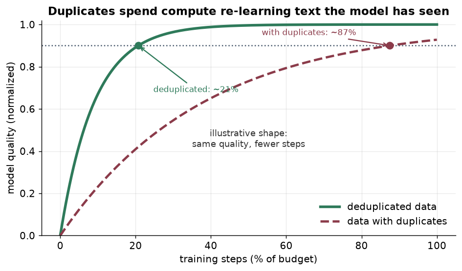
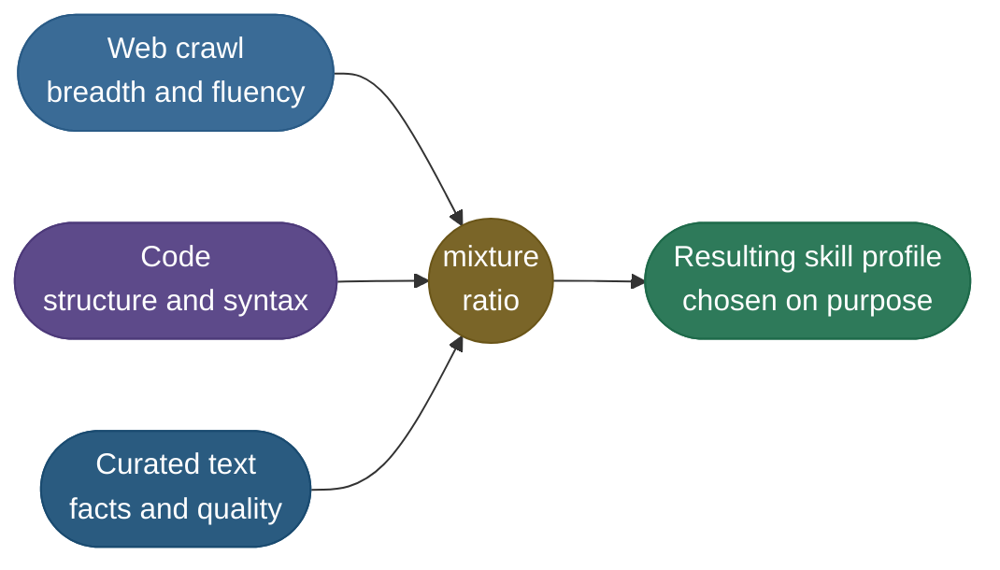
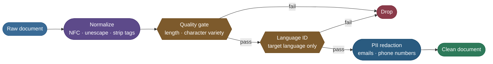
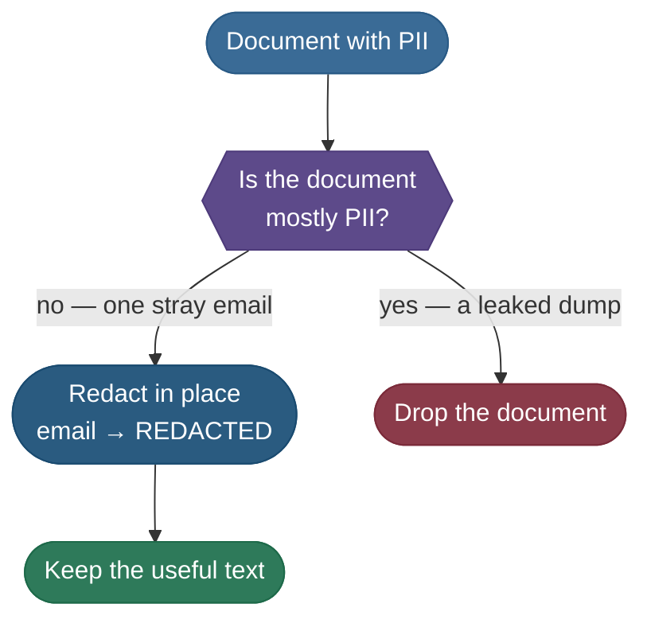
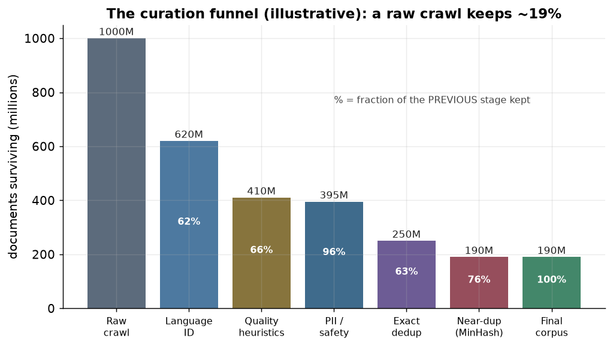
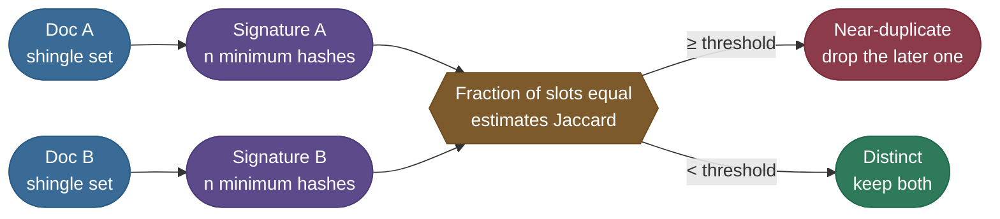
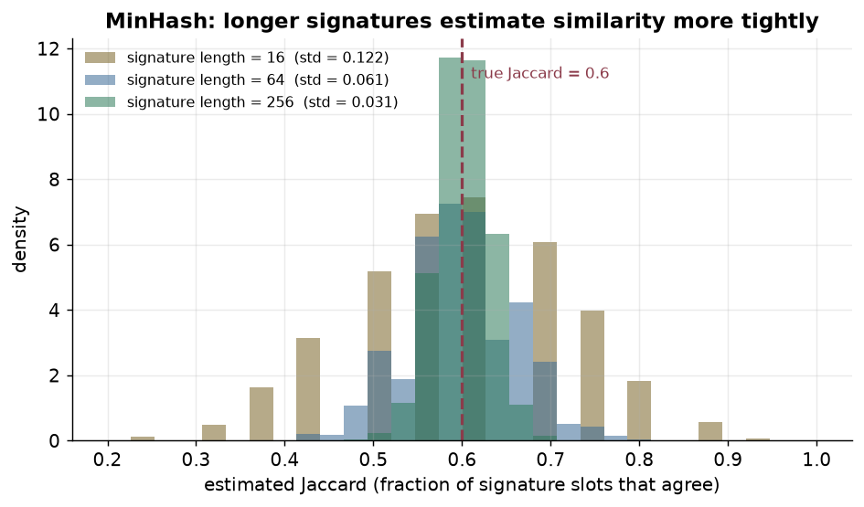
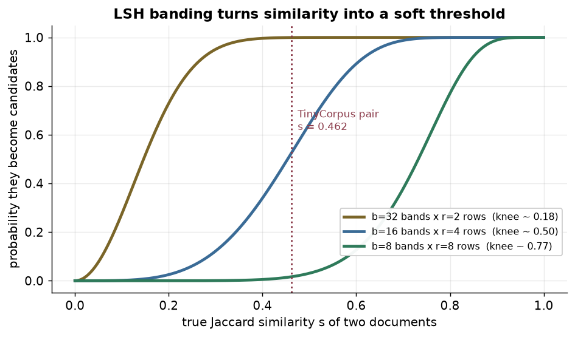
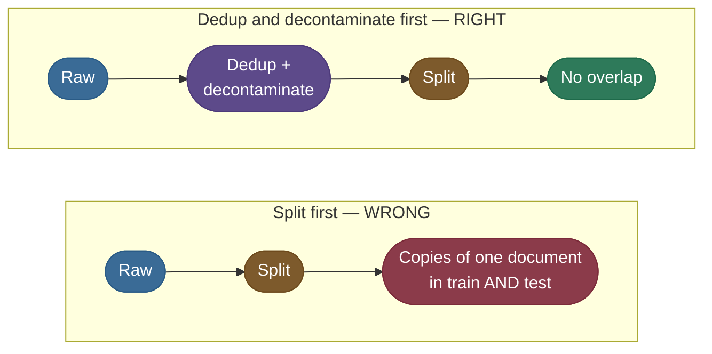

# Curating a web corpus: filter, deduplicate, decontaminate

The [main page](/ai-ml/ai-ml-learning-resources/data-and-representation/synthetic-data-and-curation/synthetic-data-and-curation) curates a *generated* set. This chapter curates the other kind: raw web text, at pretraining scale.

- **What it adds:** why each gate works, derived rather than asserted.
  - MinHash and its variance, locality-sensitive hashing (LSH) banding, n-gram decontamination.
- **The procedural twin:** [Clean, Deduplicate and Split](/ai-ml/ai-ml-learning-resources/model-building/build-a-small-language-model/clean-deduplicate-and-split) runs the same steps inside a model build; this chapter explains why each one works.

> **Note:** One corpus runs through every section — **TinyCorpus**, ten short documents about animals. Each one is salted with a defect a real crawl carries:
> - one **exact duplicate** and one **reworded near-duplicate** of the same cat sentence;
> - an email address, which is **personally identifiable information (PII)**;
> - a **junk string** and a **French sentence**;
> - a horse sentence that also appears, word for word, in an **evaluation set**.

The whole funnel on one map, each box a section below:

```mermaid
graph LR
    R(["Raw crawl<br/>TinyCorpus: 10 docs"]):::raw --> C(["Clean and filter<br/>quality · language · PII"]):::clean
    C --> E(["Exact dedup<br/>MD5 of normalized text"]):::exact
    E --> N(["Near-dup dedup<br/>shingles · MinHash · LSH"]):::near
    N --> D(["Decontaminate<br/>n-gram overlap with evals"]):::decon
    D --> S(["Split<br/>train / val / test"]):::split
    S --> OK(["Corpus<br/>leakage = 0"]):::ok

    classDef raw fill:#4A5B6E,stroke:#3A4B5E,color:#fff
    classDef clean fill:#5D4A8A,stroke:#4D3A7A,color:#fff
    classDef exact fill:#7A6528,stroke:#6A5518,color:#fff
    classDef near fill:#8B3B4A,stroke:#7B2B3A,color:#fff
    classDef decon fill:#7D5A2C,stroke:#6D4A1C,color:#fff
    classDef split fill:#2A5B80,stroke:#1A4B70,color:#fff
    classDef ok fill:#2E7A5A,stroke:#1E6A4A,color:#fff
```



The document count only ever falls: **10 → 8 → 7 → 6 → 5**, then split three, one and one.

---

## The problem: the model keeps what you forget to remove

A language model has no opinion about its training text. It fits **every** regularity in it, including the ones you would never choose to teach.

| If the corpus has… | The model learns… | The symptom you see |
|---|---|---|
| Duplicated documents | to **memorise** the repeated text | verbatim regurgitation; eval scores that look too good |
| Boilerplate and navigation text | that "accept all cookies" is likely text | bland, templated generations |
| Evaluation items | the answers, not the skill | great benchmark numbers, weak real behaviour |
| Personal data | to reproduce it on request | privacy and compliance incidents |

Two primary results make the stakes concrete:

- **Deduplication buys quality and privacy at once.** [Lee et al. (2021)](https://arxiv.org/abs/2107.06499) deduplicated common pretraining sets; the resulting models emitted memorised text **ten times less often** and needed fewer steps for the same accuracy.
- **Memorised text is extractable.** [Carlini et al. (2020)](https://arxiv.org/abs/2012.07805) recovered verbatim training sequences from GPT-2, **names and email addresses included**, some of which appeared only once.

The shape of the first result, drawn schematically — a repeat teaches nothing new, so the deduplicated corpus climbs faster per step:



*Illustrative curves, not measured data: they show the direction of the Lee et al. finding, not its magnitudes.*

---

## Two choices that set the cost of the whole run

Most of a curation pipeline is mechanics. Two choices are not, and they decide both the compute bill and what slips through.

| Decision | The cheap option | The thorough option | Choose thorough when… |
|---|---|---|---|
| **Deduplication** | exact hash — one pass, catches byte-identical copies | MinHash with LSH — catches rewordings | the data is web or syndicated text, which is almost always |
| **Quality filtering** | a few heuristic ratios (length, symbols, repetition) | heuristics, then a learned quality classifier | the source is a raw crawl rather than curated text |

> **Tip:** The modern default is **both thorough options, cheapest first**. Heuristics run before the classifier, and the exact hash runs before MinHash, so the expensive pass never pays for text a cheap one could have dropped.

The scale of the corpus changes which of those passes dominates. Order-of-magnitude ballparks:

| | **Instruction data** | **Domain corpus** | **Pretraining web corpus** |
|---|---|---|---|
| **Raw volume** | thousands to millions of examples | tens to hundreds of GB | tens to hundreds of TB |
| **Tokens out** | 1M–100M | 1B–50B | 100B–15T+ |
| **Deduplication cost** | seconds, in memory | minutes to hours with MinHash and LSH | the dominant cost of the pipeline |
| **Storage** | MBs | tens to hundreds of GB | petabytes, sharded and compressed |

> **Note:** Exact deduplication stays a cheap hash pass at any size. **Near-duplicate detection over trillions of tokens** is the expensive part, which is why LSH, later in this chapter, is not optional at scale.

---

## Sourcing: you are choosing a distribution

Before any filter runs, a decision about **which text goes in at all** sets the ceiling on everything after it.

| Source | Volume | Quality | The catch |
|---|---|---|---|
| **Web crawl** (Common Crawl) | enormous | low to medium | mostly junk; needs aggressive filtering |
| **Curated web** (Wikipedia, documentation) | medium | high | limited size; narrow domains |
| **Code** (public repositories) | large | mixed | licences, leaked secrets, generated files |
| **Your own** (tickets, manuals) | small | high | PII-heavy; needs redaction |
| **Synthetic** (model-generated) | on demand | variable | inherits the teacher's blind spots — the [main page](/ai-ml/ai-ml-learning-resources/data-and-representation/synthetic-data-and-curation/synthetic-data-and-curation) |

The blend of these sources is a knob, not an accident:



Two principles govern sourcing:

- **Mixture.** The ratio of code to prose to curated text shapes skills as much as the total token count. Decide it, rather than inheriting whatever the crawl happened to contain.
- **Provenance.** Record where every document came from. Licensing, debugging ("why does the model say this?") and every later deduplication and leakage check need it.

> **Note:** [FineWeb (Penedo et al., 2024)](https://arxiv.org/abs/2406.17557) ran controlled ablations for each filtering choice. Its central lesson is that **filtering quality, not raw size, separates a strong corpus from a mediocre one** — the gates below are that filtering.

---

## Cleaning and filtering: cheapest gates first

Raw web text carries markup, broken encodings, near-empty pages, the wrong language and personal data. Each gate removes **one class of harm**, and the cheap, high-yield ones run first.



What each gate checks, and why it is placed where it is:

- **Normalize.** Unicode NFC (one canonical byte form per character), HTML entities unescaped, tags stripped, whitespace collapsed.
  - It runs first because every later comparison — hashes, shingles, n-grams — needs two spellings of the same text to compare equal.
  - It also repairs **mojibake**, text garbled by a botched encoding round-trip (`’` where an apostrophe belongs).
- **Quality heuristics.** Simple ratios: too few words, too little character variety, too much repetition (`"buy now buy now…"`).
  - They cost almost nothing and remove most of the garbage.
  - A **learned quality classifier** (FineWeb-Edu's educational-value scorer, from the main page) runs after them, on what is left.
- **Language identification.** Keep the target languages. Production uses a fast classifier such as fastText; the demo uses a stopword count.
- **PII redaction.** Mask emails, phone numbers, keys and ID numbers in place.

Redaction versus dropping is the one cleaning decision that is easy to get wrong:



The rule is **proportion**: a normal page with one address is masked and kept, while a scraped credential list is mostly PII and goes.

On a raw crawl, these gates plus deduplication remove most of the corpus. An illustrative FineWeb-style funnel:



> **Warning:** On web scrapes, aggressive filtering often discards **80–95% of documents, and the model improves**. A collapse in document count is the expected outcome; a count that barely moves is the thing to investigate.

On TinyCorpus this stage drops two documents and edits one:

- `"aaaaaaaaaaaaaaaaaaaa"` has one word and one distinct character — **quality gate**.
- `"Le chat dort sur le canape toute la journee."` hits fewer than two English stopwords — **language ID**.
- `"Email the team at jane.doe@example.com for the report."` survives as `"Email the team at [REDACTED] for the report."`

**10 documents → 8.**

---

## Exact deduplication: one fingerprint per document

The cheap half of deduplication reduces each document to a **fingerprint** and keeps one document per fingerprint.

- **The key.** Lowercase and collapse whitespace first, so trivially different copies map to the same string.
- **The fingerprint.** An MD5 or SHA digest of that key. A hash set makes each lookup constant time, so the pass is **O(n)** in the number of documents.
- **Why it matters on the web.** Syndicated articles, mirrored pages and licence boilerplate appear in hundreds of byte-identical copies.

TinyCorpus has two identical cat sentences and one reworded one. The real digests:

```text
"Cats are wonderful pets that love to nap in the sun."        (both copies)
   → key: "cats are wonderful pets that love to nap in the sun."
   → md5 = e9a1ee80d91e49a14b5e6c928c47ec53    ← same digest twice, the second copy is dropped

"Cats are wonderful pets that love napping in the sunshine."  (the rewording)
   → md5 = 880aec89250eedc79e8ff31babe83847    ← unrelated digest, survives this pass
```

**8 documents → 7.** The rewording changes two words and the digest changes completely, so exact hashing cannot see it.

> **Note:** MD5 is broken as a *security* hash, but deduplication needs only a fingerprint that honest text rarely collides on. At billions of documents, prefer a longer digest so accidental collisions stay negligible.

---

## Near-duplicate detection: shingles, Jaccard, MinHash

Two documents can say the same thing with a word changed. Comparing every pair directly costs **O(n²)** comparisons: at a billion documents, that is about 5 × 10¹⁷ pairs.

The fix has three ideas, each solving one problem:

1. **Shingles** turn a document into a set, so that "similar" becomes measurable.
2. **MinHash** compresses that set into a short signature that still estimates similarity.
3. **LSH banding** finds likely-similar pairs without comparing all of them.

### Shingles and Jaccard: similarity you can count

A **shingle** is a window of *k* consecutive words; a document becomes the set of its shingles. **Jaccard similarity** is the size of the overlap divided by the size of the union.

- **Symbols.** For shingle sets *A* and *B*: `J(A, B) = |A ∩ B| / |A ∪ B|`, between 0 (nothing shared) and 1 (identical sets).
- **Why sets work.** A local rewording destroys only the few shingles that span the changed words; everything else still matches.

The TinyCorpus pair at *k* = 2:

```text
A = "Cats are wonderful pets that love to nap in the sun."
B = "Cats are wonderful pets that love napping in the sunshine."

shingles(A) = {cats are, are wonderful, wonderful pets, pets that, that love,
               love to, to nap, nap in, in the, the sun.}                  # |A| = 10
shingles(B) = {cats are, are wonderful, wonderful pets, pets that, that love,
               love napping, napping in, in the, the sunshine.}            # |B| = 9

A ∩ B = {cats are, are wonderful, wonderful pets, pets that, that love, in the}   # 6
A ∪ B = 10 + 9 − 6 = 13
J(A, B) = 6 / 13 = 0.462
```

The rewrite touched only `love to nap … the sun`, so the untouched front half keeps six shingles in common. Computing this exactly for every pair is still quadratic; that is what MinHash removes.

### Why a minimum hash estimates Jaccard

Pick one random hash function *h* and record, for each set, its **smallest** hash value. The claim is that two sets record the same minimum with probability exactly *J*.

The derivation, one step at a time:

- **Look at the union.** Let `U = A ∪ B`. Treat *h* as a random ordering of all shingles; exactly one element of *U* has the smallest hash.
- **That winner is uniform.** A random ordering favours no element, so each of the `|U|` shingles is equally likely to be the winner.
- **The minima agree only when the winner is shared.**
  - Winner in `A ∩ B`: it is the smallest element of *A* and of *B*, so `min h(A) = min h(B)`.
  - Winner only in *A*: *A*'s minimum is the winner, and *B*'s minimum is some larger value, so they differ. The same holds with *A* and *B* swapped.
- **Count.** `P[min h(A) = min h(B)] = |A ∩ B| / |U| = J(A, B)`.

A **signature** repeats this with *n* independent hash functions. Slot *k* holds the minimum under function *k*, and the estimate is the fraction of slots that agree:

```text
Ĵ = (1/n) · Σₖ 1[ sigₖ(A) = sigₖ(B) ]
```

- **Unbiased.** Each slot agrees with probability *J*, so `E[Ĵ] = J`.
- **Fixed size.** Every document becomes *n* integers, whatever its length.

> **Note:** Real hash functions only approximate random orderings, and two shingles can share a hash value. With a 128-bit digest such collisions are negligible; the demo simulates *n* functions by prefixing each shingle with a seed.



### Signature length is a variance dial

Unbiased is not the same as accurate. Each slot is a coin that lands "agree" with probability *J*, so the count of agreeing slots is binomial.

- **The spread.** `Var(Ĵ) = J(1 − J) / n`, so the standard deviation is `σ = √(J(1 − J)/n)`.
- **What it costs.** Halving the spread takes **four times** the hashes, because σ shrinks as `1/√n`.

The simulated picture for a pair with true *J* = 0.6:



The real TinyCorpus pair, one signature at each length, with *J* = 0.462:

| Signature length *n* | σ = √(0.462 · 0.538 / n) | Estimate from the demo | Distance from 0.462 |
|---|---|---|---|
| 16 | 0.125 | **0.250** | 1.7 σ low |
| 64 | 0.062 | **0.453** | 0.1 σ low |
| 256 | 0.031 | **0.430** | 1.0 σ low |

Two lessons sit in that table:

- **A single draw can miss badly.** At 16 hashes the pair scores 0.250, **below the 0.3 threshold**, so this near-duplicate would have survived.
- **Longer is tighter, not exact.** The 256-slot estimate is further from the truth than the 64-slot one, yet still well inside one σ of it.

> **Tip:** 64–128 hashes is the usual range: tight enough near a typical threshold, cheap enough to store per document. Below about 32, the verdict on a borderline pair is close to a coin flip.

With 64 hashes, the demo's estimate of 0.453 clears the **0.3** threshold, so B is dropped as a near-duplicate of A. **7 documents → 6.**

### LSH banding: finding candidates without comparing all pairs

Signatures make each comparison cheap, but there are still O(n²) comparisons. **Locality-sensitive hashing** avoids most of them: only pairs likely to be similar are ever compared.

The mechanism, on a 64-slot signature:

- **Cut the signature into bands.** *b* = 16 bands of *r* = 4 slots each, so `b · r = 64`.
- **Bucket by band.** Each band's four values form a key; documents sharing a key in **any** band become a **candidate pair**.
- **Compare candidates only.** The full signature comparison runs on candidates, not on every pair.

The probability follows from the slot-agreement result:

- **One band matches** when all *r* of its slots agree: probability `s^r`.
- **No band matches**: `(1 − s^r)^b`.
- **Candidate**: `P(candidate | s) = 1 − (1 − s^r)^b`.

That curve is an S-shape, and *b* and *r* place its knee near `(1/b)^(1/r)`:



The demo's numbers for the 16 × 4 layout:

| Similarity *s* | `P(candidate)` | Meaning |
|---|---|---|
| 0.200 | **0.025** | unrelated pairs are almost never compared |
| 0.462 | **0.524** | the TinyCorpus pair is a coin flip |
| 0.800 | **1.000** | clear near-duplicates are always found |

For this pair the coin landed well: the demo reports that A and B **share one whole band**, so they would be compared.

> **Warning:** The knee of 16 × 4 sits near **0.50**, above the demo's threshold of **0.3**. Pairs between the two are over the threshold yet only sometimes compared, so some are silently kept.
> - **The fix:** choose *b* and *r* so the knee falls *below* the threshold.
> - **The arithmetic:** 32 × 2 gives `1 − (1 − 0.462²)³² = 1 − 0.7866³² ≈ 0.9995` for this pair, at the price of more candidate comparisons.

> **Note:** At TinyCorpus scale the demo compares every surviving pair directly and reports the band check alongside. At corpus scale, only the banded candidates are compared.

---

## Decontamination: taking the benchmark out of the corpus

Deduplication removes repeats *within* the corpus. **Decontamination** removes overlap *between* the corpus and every evaluation set you will report.

- **Why it is separate.** An evaluation item is not a duplicate of any single training document; it is often a sentence buried inside one.
- **The standard check.** Word n-gram overlap: drop, or flag, any training document that shares an n-gram with any evaluation item. GPT-3's report used 13-grams.
- **The demo's choice.** TinyCorpus sentences are about ten words long, so it uses **6-grams**.

The real run against a two-item evaluation set:

```text
[decon]  dropped 'Horses are strong animals and enjoy running in the field.' via
         ['animals and enjoy running in the', 'are strong animals and enjoy running',
          'horses are strong animals and enjoy', 'strong animals and enjoy running in']
[decon]  6 -> 5 docs
```

The second evaluation item asks where birds go in winter. The corpus contains `"Birds can fly south for the winter when it gets cold."` — the same fact in different words.

- **No n-gram is shared,** so the check passes it.
- **This is the method's blind spot.** It catches copied text, not paraphrased knowledge.

> **Important:** Decontamination reduces contamination; it does not certify its absence. Keep a **private held-out set** that has never been published. Measuring contamination is covered in [Model Evaluation and Benchmarks](/ai-ml/ai-ml-learning-resources/evaluation/model-evaluation-and-benchmarks/model-evaluation-and-benchmarks).

**6 documents → 5.**

---

## Deduplicate and decontaminate before you split

The last gate decides whether the held-out numbers mean anything. **Data leakage** is information from validation or test reaching training, and in a text corpus its commonest cause is order.



The corpus-level rules:

- **Deduplicate before splitting.** Split first, and the two cat copies can land on opposite sides, where the model is tested on text it trained on.
- **Decontaminate before splitting too,** so no split is scored against a published benchmark's own text.
- **Verify with an assertion, not a glance.** The demo ends with `assert not leakage`, so a leak fails the run instead of inflating a metric.

> **Note:** Group-aware splits (one author or source per side) and time-based splits are general leakage rules, not corpus-specific ones. They are taught with the full leakage taxonomy in [Data Leakage](/ai-ml/ai-ml-learning-resources/data-and-representation/data-preparation/data-leakage/data-leakage).

TinyCorpus, split 60 / 20 / 20 with seed 0: **train = 3, val = 1, test = 1, leakage = 0.**

---

## The whole funnel, runnable

Every number in this chapter comes from one standard-library script: it runs offline in well under a second and needs no model. The complete program:

```python
"""Curate TinyCorpus: clean, exact-dedup, MinHash near-dedup, decontaminate, split.

A ten-document corpus salted with every defect a web crawl carries (an exact
duplicate, a reworded near-duplicate, an email address, a junk string, a French
sentence, and a sentence that also appears in an evaluation set) travels through
the curation funnel. Standard library only, deterministic, runs in well under a
second:

    uv run --python 3.12 python curate_tiny_corpus.py
"""

import hashlib
import html
import random
import re
import unicodedata

SPLIT_SEED = 0
SHINGLE_WORDS = 2
SIGNATURE_LENGTH = 64
NEAR_DUP_THRESHOLD = 0.3
LSH_BANDS = 16
LSH_ROWS_PER_BAND = SIGNATURE_LENGTH // LSH_BANDS
DECONTAMINATION_NGRAM = 6
MIN_WORDS = 4
MIN_DISTINCT_CHARS = 10
MIN_STOPWORD_HITS = 2
SPLIT_FRACTIONS = (0.6, 0.2)

ENGLISH_STOPWORDS = {
    "the", "a", "an", "is", "are", "to", "of", "in", "and", "for",
    "that", "can", "when", "it", "love", "enjoy",
}
PII_PATTERN = re.compile(r"[\w.+-]+@[\w-]+\.[\w.-]+|\b\d{3}[-.]?\d{3}[-.]?\d{4}\b")
HTML_TAG_PATTERN = re.compile(r"<[^>]+>")

RAW_CORPUS = [
    "Cats are wonderful pets that love to nap in the sun.",
    "Cats are wonderful pets that love to nap in the sun.",        # exact duplicate
    "Cats are wonderful pets that love napping in the sunshine.",  # reworded near-duplicate
    "Dogs are loyal companions and enjoy long walks outdoors.",
    "Birds can fly south for the winter when it gets cold.",
    "Fish are quiet pets that can live in a small glass tank.",
    "Horses are strong animals and enjoy running in the field.",   # also in the eval set
    "Email the team at jane.doe@example.com for the report.",      # English with PII
    "aaaaaaaaaaaaaaaaaaaa",                                        # low-quality junk
    "Le chat dort sur le canape toute la journee.",               # not English
]

EVAL_SET = [
    "Q: Complete the sentence: Horses are strong animals and enjoy running in the ___ A: field",
    "Q: Where do birds go in winter? A: They migrate to warmer places.",  # paraphrase: no n-gram hit
]


# ---------------------------------------------------------------- cleaning ---
def normalize_markup(text):
    """Unicode NFC, unescape entities, strip tags, collapse whitespace."""
    text = unicodedata.normalize("NFC", html.unescape(text))
    text = HTML_TAG_PATTERN.sub(" ", text)
    return re.sub(r"\s+", " ", text).strip()


def is_english(text):
    """Crude language ID: an English document hits several English stopwords."""
    words = set(re.findall(r"[a-z]+", text.lower()))
    return len(words & ENGLISH_STOPWORDS) >= MIN_STOPWORD_HITS


def passes_quality(text):
    """Reject documents that are too short or have too little character variety."""
    return len(text.split()) >= MIN_WORDS and len(set(text.lower())) >= MIN_DISTINCT_CHARS


def redact_pii(text):
    """Mask emails and phone numbers in place; the rest of the document is kept."""
    return PII_PATTERN.sub("[REDACTED]", text)


def clean_corpus(documents):
    kept = []
    for document in documents:
        document = normalize_markup(document)
        if not passes_quality(document) or not is_english(document):
            continue
        kept.append(redact_pii(document))
    return kept


# ------------------------------------------------------------ exact dedup ---
def dedup_key(text):
    """The comparison form: lowercase, whitespace collapsed."""
    return re.sub(r"\s+", " ", text.lower().strip())


def md5_of(text):
    return hashlib.md5(dedup_key(text).encode()).hexdigest()


def exact_dedup(documents):
    seen_hashes, unique = set(), []
    for document in documents:
        digest = md5_of(document)
        if digest not in seen_hashes:
            seen_hashes.add(digest)
            unique.append(document)
    return unique


# ------------------------------------------------------- near-dup (MinHash) ---
def shingles(text, width=SHINGLE_WORDS):
    words = dedup_key(text).split()
    return {" ".join(words[i:i + width]) for i in range(max(1, len(words) - width + 1))}


def jaccard(set_a, set_b):
    return len(set_a & set_b) / len(set_a | set_b)


def minhash_signature(shingle_set, length=SIGNATURE_LENGTH):
    """Slot k holds the minimum of hash function k over the set; seed k picks the function."""
    return [
        min(int(hashlib.md5(f"{seed}:{piece}".encode()).hexdigest(), 16) for piece in shingle_set)
        for seed in range(length)
    ]


def estimated_jaccard(signature_a, signature_b):
    return sum(a == b for a, b in zip(signature_a, signature_b)) / len(signature_a)


def lsh_candidate_probability(similarity, bands=LSH_BANDS, rows=LSH_ROWS_PER_BAND):
    """Chance that two documents share at least one whole band of their signatures."""
    return 1 - (1 - similarity ** rows) ** bands


def lsh_band_keys(signature, bands=LSH_BANDS, rows=LSH_ROWS_PER_BAND):
    return {(band, tuple(signature[band * rows:(band + 1) * rows])) for band in range(bands)}


def near_dedup(documents, threshold=NEAR_DUP_THRESHOLD):
    """Greedy first-wins: drop a document whose estimate against any kept one clears the bar."""
    signatures = [minhash_signature(shingles(d)) for d in documents]
    kept_indices = []
    for index in range(len(documents)):
        if any(estimated_jaccard(signatures[index], signatures[j]) >= threshold
               for j in kept_indices):
            continue
        kept_indices.append(index)
    return [documents[i] for i in kept_indices]


# ---------------------------------------------------------- decontamination ---
def word_ngrams(text, n=DECONTAMINATION_NGRAM):
    words = re.findall(r"[a-z]+", text.lower())
    return {" ".join(words[i:i + n]) for i in range(len(words) - n + 1)}


def decontaminate(documents, eval_items, n=DECONTAMINATION_NGRAM):
    """Drop any training document sharing a word n-gram with any evaluation item."""
    eval_ngrams = set().union(*(word_ngrams(item, n) for item in eval_items))
    kept, flagged = [], []
    for document in documents:
        overlap = word_ngrams(document, n) & eval_ngrams
        (flagged if overlap else kept).append((document, sorted(overlap)))
    return [d for d, _ in kept], flagged


# ---------------------------------------------------------------- splitting ---
def split_corpus(documents, seed=SPLIT_SEED):
    shuffled = documents[:]
    random.Random(seed).shuffle(shuffled)
    train_end = int(len(shuffled) * SPLIT_FRACTIONS[0])
    val_end = train_end + int(len(shuffled) * SPLIT_FRACTIONS[1])
    return shuffled[:train_end], shuffled[train_end:val_end], shuffled[val_end:]


def cross_split_overlap(train, val, test):
    train_keys = set(map(dedup_key, train))
    return (train_keys & set(map(dedup_key, val))) | (train_keys & set(map(dedup_key, test)))


# ------------------------------------------------------------------- report ---
def report_pair(doc_a, doc_b):
    shingles_a, shingles_b = shingles(doc_a), shingles(doc_b)
    shared, union = shingles_a & shingles_b, shingles_a | shingles_b
    true_similarity = jaccard(shingles_a, shingles_b)
    print(f"[pair]   |A|={len(shingles_a)} |B|={len(shingles_b)} shared={len(shared)} "
          f"union={len(union)} true Jaccard={true_similarity:.3f}")
    for length in (16, 64, 256):
        estimate = estimated_jaccard(minhash_signature(shingles_a, length),
                                     minhash_signature(shingles_b, length))
        print(f"[pair]   MinHash estimate, signature length {length:>3}: {estimate:.3f}")
    signature_a = minhash_signature(shingles_a)
    signature_b = minhash_signature(shingles_b)
    shared_bands = len(lsh_band_keys(signature_a) & lsh_band_keys(signature_b))
    print(f"[lsh]    {LSH_BANDS} bands x {LSH_ROWS_PER_BAND} rows: A and B share "
          f"{shared_bands} whole band(s) -> candidate={shared_bands > 0}")
    for similarity in (0.2, true_similarity, 0.8):
        print(f"[lsh]    P(candidate | s={similarity:.3f}) = "
              f"{lsh_candidate_probability(similarity):.3f}")


def main():
    cleaned = clean_corpus(RAW_CORPUS)
    print(f"[clean]  {len(RAW_CORPUS)} -> {len(cleaned)} docs")
    print(f"[clean]  redacted: '{next(d for d in cleaned if '[REDACTED]' in d)}'")

    for document in (RAW_CORPUS[0], RAW_CORPUS[2]):
        print(f"[md5]    {md5_of(document)}  '{document}'")
    unique = exact_dedup(cleaned)
    print(f"[exact]  {len(cleaned)} -> {len(unique)} docs")

    report_pair(RAW_CORPUS[0], RAW_CORPUS[2])
    distinct = near_dedup(unique)
    print(f"[near]   {len(unique)} -> {len(distinct)} docs (threshold {NEAR_DUP_THRESHOLD})")

    clean_for_training, flagged = decontaminate(distinct, EVAL_SET)
    for document, overlap in flagged:
        print(f"[decon]  dropped '{document}' via {overlap}")
    print(f"[decon]  {len(distinct)} -> {len(clean_for_training)} docs")

    train, val, test = split_corpus(clean_for_training)
    leakage = cross_split_overlap(train, val, test)
    assert not leakage, f"leakage across splits: {leakage}"
    print(f"[split]  train={len(train)} val={len(val)} test={len(test)} leakage={len(leakage)}")
    for name, split in (("train", train), ("val", val), ("test", test)):
        print(f"[split]  {name:<5} {split}")


if __name__ == "__main__":
    main()
```

Its real output:

```text
[clean]  10 -> 8 docs
[clean]  redacted: 'Email the team at [REDACTED] for the report.'
[md5]    e9a1ee80d91e49a14b5e6c928c47ec53  'Cats are wonderful pets that love to nap in the sun.'
[md5]    880aec89250eedc79e8ff31babe83847  'Cats are wonderful pets that love napping in the sunshine.'
[exact]  8 -> 7 docs
[pair]   |A|=10 |B|=9 shared=6 union=13 true Jaccard=0.462
[pair]   MinHash estimate, signature length  16: 0.250
[pair]   MinHash estimate, signature length  64: 0.453
[pair]   MinHash estimate, signature length 256: 0.430
[lsh]    16 bands x 4 rows: A and B share 1 whole band(s) -> candidate=True
[lsh]    P(candidate | s=0.200) = 0.025
[lsh]    P(candidate | s=0.462) = 0.524
[lsh]    P(candidate | s=0.800) = 1.000
[near]   7 -> 6 docs (threshold 0.3)
[decon]  dropped 'Horses are strong animals and enjoy running in the field.' via ['animals and enjoy running in the', 'are strong animals and enjoy running', 'horses are strong animals and enjoy', 'strong animals and enjoy running in']
[decon]  6 -> 5 docs
[split]  train=3 val=1 test=1 leakage=0
[split]  train ['Birds can fly south for the winter when it gets cold.', 'Dogs are loyal companions and enjoy long walks outdoors.', 'Cats are wonderful pets that love to nap in the sun.']
[split]  val   ['Email the team at [REDACTED] for the report.']
[split]  test  ['Fish are quiet pets that can live in a small glass tank.']
```

How to read it, one prefix per section:

- **`[clean]`** — junk and French gone, the email masked in place: **10 → 8**.
- **`[md5]` and `[exact]`** — the identical cat copies share a digest, the rewording does not: **8 → 7**.
- **`[pair]` and `[lsh]`** — *J* = 6/13, the three estimates, and the banding probabilities from the tables above.
- **`[near]`** — the rewording removed at an estimate of 0.453: **7 → 6**.
- **`[decon]`** — the horse sentence removed through four shared 6-grams: **6 → 5**.
- **`[split]`** — three, one and one, with the leakage assertion passing.

> **Tip:** Two edits make the chapter's warnings visible in the output.
> - Set `SIGNATURE_LENGTH = 16`: the near-duplicate is estimated at 0.250, so `[near]` reports **7 → 7** and keeps it. The bands shrink to 16 × 1, which makes even a pair at *s* = 0.2 a candidate with probability 0.972.
> - Move the `decontaminate` call after `split_corpus`: nothing fails, which is exactly the problem.

---

## One document through the funnel

The same run, followed for the cat sentence alone. It enters as three variants and leaves as one training document.

```text
RAW  (3 variants enter)
  A  "Cats are wonderful pets that love to nap in the sun."        (appears twice)
  B  "Cats are wonderful pets that love napping in the sunshine."
        │
   CLEAN AND FILTER
        │   quality:  11 words ≥ 4, many distinct characters ≥ 10        → pass
        │   language: stopwords are, that, love, to, in, the — 6 ≥ 2     → pass
        │   PII:      no email or phone match                           → unchanged
        ▼
   EXACT DEDUP
        │   md5(key of A) = e9a1ee80…  seen twice → keep one
        ▼   3 variants → 2  (A and the rewording B)
   NEAR-DUP DEDUP
        │   J(A, B) = 6/13 = 0.462;  64-slot MinHash estimate 0.453 ≥ 0.3
        │   LSH 16 × 4: one shared band → candidate
        ▼   B dropped as a near-duplicate of A  → 1 variant
   DECONTAMINATE
        │   no 6-gram of A appears in either evaluation item               → kept
        ▼
   SPLIT  (seed 0)
        ▼   lands in TRAIN;  no copy in val or test  → leakage = 0
```

Three copies of one sentence would have trained the model three times on the same fact. Deduplication is what turns that into **one**, and splitting afterwards is what keeps its twin out of the test set.

---

## Pitfalls

Curation bugs do not crash. They surface weeks later as a model that behaves oddly or an evaluation nobody can reproduce.

| Symptom | Likely cause | Fix |
|---|---|---|
| **Verbatim regurgitation; eval looks too good** | duplicates survived, exact or near | exact hash, then MinHash; deduplicate **before** splitting |
| **Near-duplicates slip through** | exact-only deduplication | add the MinHash stage after the hash pass |
| **Borderline duplicates survive at random** | signature too short, or the LSH knee sits above the threshold | 64–128 hashes; pick *b* and *r* so `(1/b)^(1/r)` falls below the threshold |
| **Great offline metrics, weak in production** | evaluation items or test documents in training | decontaminate against every reported set; `assert not leakage` |
| **Benchmark gains that a fresh test set erases** | paraphrased contamination that n-grams cannot see | keep a private, never-published held-out set |
| **Garbled characters in outputs** (`’`) | encoding never normalized | NFC normalization and encoding repair as the first gate |
| **Model reproduces emails or phone numbers** | PII redaction skipped or too narrow | widen the patterns; redact before deduplication, so masked copies still collapse |
| **Bland, templated outputs** | boilerplate and navigation text passed the filters | repetition and symbol-ratio heuristics, then a quality classifier |

> **Tip:** Most rows above are caught by one habit: **read a random sample of the finished corpus**. A redaction that never fired or a boilerplate block on every page is invisible in counts and obvious in text.

---

## Key takeaways

- **Order is the design.** Normalize → filter → exact dedup → near-dup dedup → decontaminate → split. Each step either makes the next comparable or makes it cheaper.
- **MinHash works because of one probability.** Under a random hash, two sets share a minimum with probability equal to their Jaccard similarity; averaging *n* slots gives an unbiased estimate with spread `√(J(1 − J)/n)`.
- **LSH turns similarity into a soft threshold** at roughly `(1/b)^(1/r)`; that knee belongs below the deduplication threshold.
- **Decontamination catches copies, not knowledge.** Pair n-gram checks with a private held-out set.
- **Deduplication and decontamination come before the split,** and a leakage assertion proves it on every run.

---

## References

Shared with the topic's companion file: [Synthetic Data and Data Curation — references](/ai-ml/ai-ml-learning-resources/data-and-representation/synthetic-data-and-curation/synthetic-data-and-curation-references).
