# Synthetic Data and Data Curation

> Modern model quality is decided by the dataset far more than by the architecture. Two levers do
> the work: **curation** — filtering, deduplicating and quality-classifying web text until what is
> left is worth training on — and **synthesis** — generating instructions, answers and textbook-style
> explanations with a strong model, then filtering those too.

**Why it matters:** every post-2023 open model that punches above its size (Phi, SmolLM, Nemotron,
Tülu, the R1 distills) got there through data work, not a new block.

- **What is probed:** the Self-Instruct loop and how Evol-Instruct deepens it; why an educational-quality classifier (FineWeb-Edu) beats bigger raw corpora; the deduplication and decontamination pipeline; who owns the licence to the generated data.
- **The trade-off:** synthetic data is cheap and targetable but inherits the teacher's blind spots, narrows diversity, and — unchecked — leaks the benchmark into training.
- **The failure mode:** a model that improves on every benchmark and on nothing real. **Contamination** is the default outcome of naive web-scale synthesis, not an edge case; decontaminate against your eval sets *and* keep a private held-out set.

You need a few thousand clean `(instruction → answer)` pairs to fine-tune a model, and you have… eleven. Hand-writing the rest would take weeks. **Synthetic data generation** is the shortcut: use a *strong* LLM to manufacture the training data for a *smaller* or *more specialized* one. By the end of this guide you'll be able to **bootstrap an instruction dataset yourself** — start from a handful of seed examples, expand them into thousands with a generator, then ruthlessly filter and dedup down to a clean set you'd actually trust to train on. We'll walk every stage with the *why* behind each filter, and runnable code you can execute today.

I'm going to walk this the way I'd actually do it on a real project: write a dozen good seed examples by hand, prompt a capable model to invent more like them, throw most of what comes back in the trash, and keep only the clean, diverse, non-duplicated remainder. Each stage hands the next one a concrete artifact — a seed file, then a raw candidate pool, then a filtered set, then a deduped dataset — so the whole thing reads as one continuous build rather than a bag of tricks. To keep it concrete, we'll carry **one task all the way through**: bootstrapping an instruction set for a **cooking-assistant** that answers questions like *"What can I use instead of eggs?"* — watch that single task travel from three seeds, through generation, through every filter, into a final dataset.

Here's the journey as a checklist before we zoom in — you'll be doing these in order:

1. **Decide if you even should** — synthetic data helps for *coverage and behavior*, hurts when it just echoes the teacher's blind spots; the choice sets everything.
2. **Pick a method** — simple prompting vs Self-Instruct vs Evol-Instruct vs distillation; the choice trades cost for diversity.
3. **Write seeds** — a dozen or two hand-crafted, high-quality `(instruction → answer)` pairs that define the target distribution.
4. **Generate** — prompt the teacher model to expand the seeds into a large raw candidate pool.
5. **Filter** — drop malformed rows (format) and off-topic/low-quality rows (an LLM judge or heuristics).
6. **Dedup** — collapse near-duplicate paraphrases so the set is *diverse*, not just *big*.
7. **Measure & use** — compute a diversity metric, check yield, then fine-tune on seeds + survivors.

**The whole journey on one map** — every box below is a section, in order:


Keep that left-to-right flow in mind: each box narrows the data — generate wide, then filter and dedup down — and the rest of the guide is just one section per box.

## Choosing Your Generation Approach

Before any code, the first question is whether synthetic data is even the right move — because it can quietly *hurt*. Synthetic data is excellent for **coverage** (filling gaps in your task distribution), **behavior/format** (teaching a consistent style or schema), and **bootstrapping** when you have almost no labeled data. It's a bad idea when you need **new factual knowledge** the teacher doesn't have (it will confidently invent it), when **the teacher shares your target model's blind spots** (you'll just amplify them), or when **a real labeled set already exists** and is cheap to get. **Synthetic data teaches patterns the teacher already knows; it cannot conjure facts the teacher lacks.**

| Situation | Synthetic data… | Why |
|---|---|---|
| You have ~no labeled data, need to bootstrap | **helps a lot** | a few seeds + a strong teacher beats hand-labeling thousands |
| You need consistent format/behavior (JSON, tone) | **helps** | the teacher demonstrates the pattern cheaply, at scale |
| You need to cover rare cases / edge inputs | **helps** | you can *prompt for* the long tail you can't easily collect |
| You need new factual knowledge | **hurts** | the teacher hallucinates facts it doesn't have — use RAG instead |
| A clean human-labeled set is cheap to obtain | **skip it** | real data is the gold standard; synthetic is the fallback |
| You'll train recursively on your own model's output | **dangerous** | risks **model collapse** (covered below) |

> **Tip:** Reach for synthetic data when you're **data-poor but pattern-rich** — you know exactly what good looks like but don't have enough examples. If you instead need *knowledge* the model lacks, retrieval (RAG) is the right tool, not generation; see [Retrieval-Augmented Generation (8.02)](/ai-ml/ai-ml-intuitions/memory-retrieval-context/rag-intuition). Generation is for *behavior*, retrieval is for *facts*.

The "helps vs hurts" split has a clean shape — synthetic data multiplies *patterns the teacher already has*, and amplifies *flaws it shares with you*:

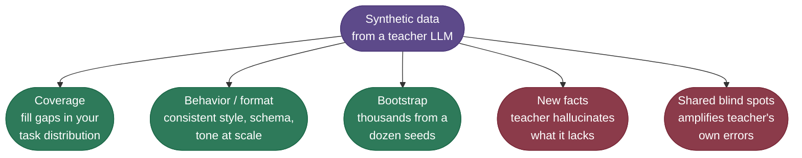

This decision flow is the whole "should I, and how" choice in one picture — walk it top to bottom:

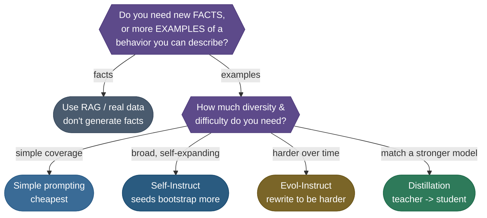

The four methods are points on one spectrum — more cost buys more diversity and difficulty:

- **Simple prompting** — just ask the model for N examples of a task. Cheapest, but the outputs cluster tightly (low diversity) and you hit repetition fast.
- **Self-Instruct** — start from a seed pool, ask the model to write *new* tasks similar to the seeds, filter, then *add the survivors back to the seed pool* and repeat. The dataset bootstraps itself outward. This is the path we'll walk in code.
- **Evol-Instruct** — take existing instructions and prompt the model to *rewrite them harder* (add constraints, deepen reasoning, increase steps). Raises difficulty rather than just count.
- **Distillation** — generate from a *stronger* model to train a *weaker/cheaper* one, transferring capability. Closely related to [Knowledge Distillation (7.04)](/ai-ml/ai-ml-intuitions/scaling-adaptation-efficiency/knowledge-distillation-intuition), but at the *data* level rather than the logit level.

The two workhorse methods grow the dataset along *different axes* — one adds breadth, the other adds depth:

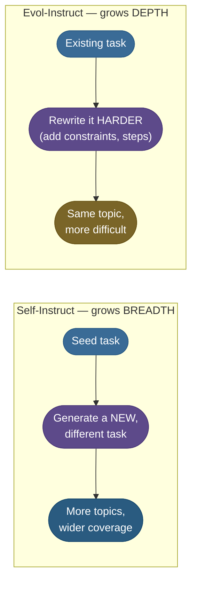

> **Note:** ***Self-Instruct*** (the seed→generate→filter→add-back loop) and ***Evol-Instruct*** (rewrite-to-harden) are complementary, not exclusive: a common recipe runs Self-Instruct to get *breadth* and then Evol-Instruct to add *depth* to the easy half. For a worked picture of the depth-vs-breadth evolution, see [Figure 1 of the Evol-Instruct / WizardLM paper](https://ar5iv.labs.arxiv.org/html/2304.12244#S2.F1) (Xu et al., 2023), which traces a single instruction through both in-depth and in-breadth rewrites. Both methods rest on the same prompting foundation — see [In-Context Learning & Prompting (8.01)](/ai-ml/ai-ml-intuitions/reasoning-agency/in-context-learning-and-prompting-intuition).

The cost/capability trade-off is direct — pick the cheapest method that reaches the diversity your task needs:

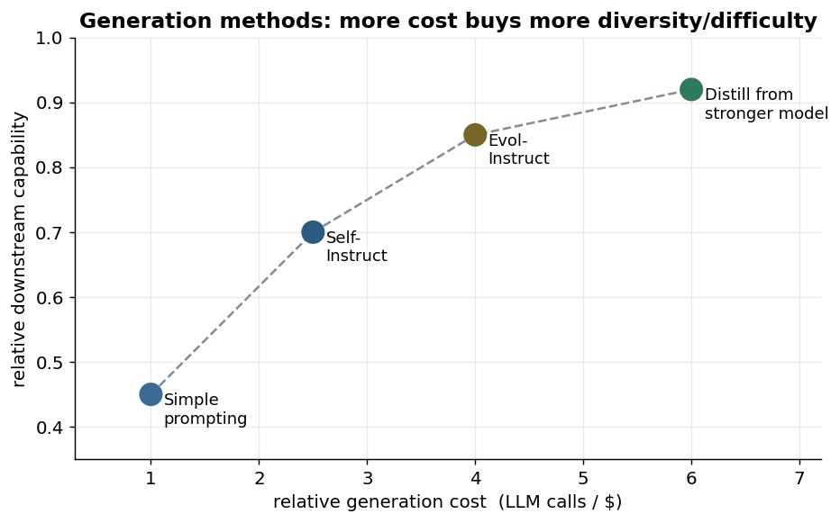

The curve climbs left to right with no shortcuts: every step up in capability costs more calls. For most bootstrapping work, **Self-Instruct sits at the sweet spot** — clearly better than plain prompting without distillation's teacher bill — which is why it's the method we'll build in code.

### Setup and what a real run costs

The runnable demo later needs nothing but the Python standard library and downloads nothing. For a real generation run you'll prompt a hosted or local model, so you'll want a client plus the curation stack:

```bash
uv pip install openai transformers datasets sentence-transformers
# plus a local-model option: uv pip install vllm   (for offline generation at scale)
# the CPU demo in this guide uses only the standard library; the rest is for real runs.
```

The cost here is **inference, not training** — every example is one (or more) LLM calls. Budget by the call:

| | **Simple prompting** | **Self-Instruct** | **Evol-Instruct** | **Distillation** |
|---|---|---|---|---|
| **LLM calls / example** | ~1 (batched) | ~1-2 (+ judge calls) | ~2-4 (each evolution = a call) | ~1-3 (teacher generations) |
| **Cost driver** | output tokens | generation + filtering | repeated rewrites | strong-teacher pricing |
| **Yield (kept / generated)** | low (~30-50%) | medium (filtering is heavy) | medium | higher (teacher is good) |
| **Reality** | a few dollars for thousands | tens of dollars, runs for hours | pricier per example | most expensive teacher tokens |

> **Warning:** The most expensive mistake isn't the API bill — it's **model collapse**: if you train a model on data generated by *that same model* (or its lineage), and repeat, each round loses diversity until the model produces bland, repetitive mush. **Always anchor synthetic data to real data; never train recursively on your own model's output** without a real-data floor. We return to this in the troubleshooting section with a plot.

## Seeds: Defining the Target Distribution

Everything downstream is shaped by a small set of hand-written examples called **seeds**. A *seed* is a single, high-quality `(instruction → response)` pair that exemplifies exactly the kind of data you want. The generator's whole job is to produce *more things like the seeds*, so the seeds are where you encode your standards: the format, the tone, the difficulty, the topic boundaries. **Garbage seeds produce garbage at scale** — this is the highest-leverage hour in the whole pipeline.

For our **cooking-assistant**, three seeds set the pattern: a substitution question, an ingredient swap, and a fix-this-dish question, each answered concisely and practically.

```json
[
  {"instruction": "How do I substitute butter in baking?",
   "response": "Use an equal amount of oil or mashed banana for moisture."},
  {"instruction": "What can I use instead of eggs?",
   "response": "Try a flax egg: 1 tbsp ground flax plus 3 tbsp water, rested 5 min."},
  {"instruction": "How do I make a dish less salty?",
   "response": "Add an unsalted bulk like potato, rice, or extra liquid to dilute it."}
]
```

Because every generation is an extrapolation *from* the seeds, their qualities propagate straight into the dataset — for better or worse:

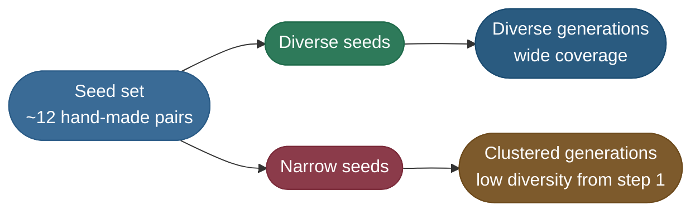

A few rules decide whether your seeds are any good:

| Rule | Why it matters |
|---|---|
| **Cover the real distribution** | The generator extrapolates from seeds; topics absent from seeds stay absent. |
| **Diverse across seeds** | If all seeds look alike, generations cluster — low diversity from the start. |
| **Exemplary format** | The generator copies structure; a sloppy seed teaches sloppy structure. |
| **~10-25 is plenty** | Self-Instruct grows the pool; you need *quality* seeds, not many. |
| **One clear task per seed** | Multi-part seeds produce confused, multi-topic generations. |

> **Note:** The seed set is your dataset's *DNA*. Spend real effort here: 15 carefully chosen, diverse, perfectly-formatted seeds will out-bootstrap 100 careless ones, because every generation is an extrapolation *from* them. The upstream curation that produces clean seeds (and later cleans the generated set) is the same machinery covered in [Curating a web corpus](/ai-ml/ai-ml-learning-resources/data-and-representation/synthetic-data-and-curation/synthetic-data-and-curation-curating-a-web-corpus).

## Generation: Expanding the Seeds

With seeds in hand, the **generation** step prompts a strong "teacher" model to invent new examples in the same spirit. The classic **Self-Instruct** loop is: sample a few seeds into the prompt as demonstrations, ask the model to write a *new* task (and its answer) like them, collect the output, and — crucially — feed the good survivors *back* into the seed pool so the next round draws on a richer base. The pool grows itself outward.

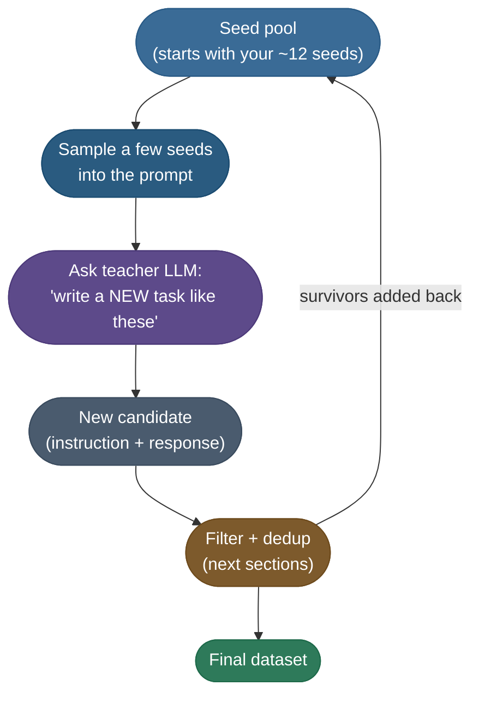

This is exactly the loop from the original Self-Instruct paper — the seed task pool feeds instruction generation, instance generation, and filtering, with survivors flowing back into the pool:

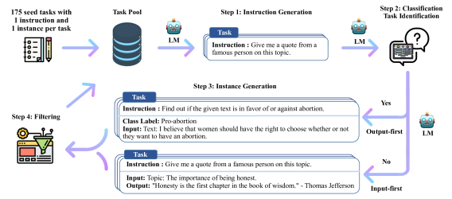

*Figure: the Self-Instruct bootstrapping loop, from [Wang et al., 2022](https://arxiv.org/abs/2212.10560) (Figure 2), licensed [CC BY 4.0](https://creativecommons.org/licenses/by/4.0/). Their full run grows ~175 seeds into ~52K instructions; our worked example uses the same loop at a tiny, traceable scale.*

The generation prompt itself is the lever. A workable template for our cooking-assistant looks like:

```text
Here are example cooking questions and concise answers:
1. Q: How do I substitute butter in baking?  A: Use an equal amount of oil ...
2. Q: What can I use instead of eggs?         A: Try a flax egg ...

Write 5 NEW, DIFFERENT cooking questions in the same style, each with a concise,
practical answer. Vary the ingredient and the type of question. Output as JSON.
```

A good generation prompt has four parts, each doing a job — drop one and the output suffers:

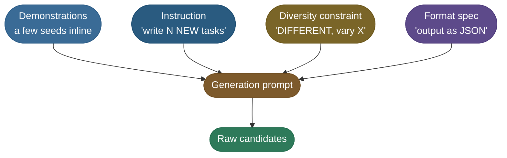

Two knobs control what comes back. **Temperature** (the randomness of sampling — higher means more varied, riskier output) should be *high* here, around 0.9-1.2: you *want* diversity at generation time and you'll clean up the mess later. And the prompt should explicitly demand *difference* ("NEW, DIFFERENT", "vary the ingredient"), because a model asked for "more examples" tends to paraphrase the seeds.

**Here's what one real turn looks like.** We hand the teacher this literal seed (one of our three):

```text
Q: What can I use instead of eggs?
A: Try a flax egg: 1 tbsp ground flax plus 3 tbsp water, rested 5 min.
```

and at temperature ≈1.0 it returns five candidates — some genuinely new, some quietly recycling the seeds:

```text
1. Q: How do I substitute milk in baking?              A: Replace milk with an equal amount of oat or soy milk.        [clean, new]
2. Q: What can I use instead of sugar in a sauce?       A: Try honey or maple syrup, using slightly less by volume.     [clean, new]
3. Q: How do I substitute milk in baking?              A: Use an equal amount of oat or soy milk instead.             [PARAPHRASE of #1]
4. Q: How do I                                          A: Use a substitute.                                            [TRUNCATED — model cut off]
5. Q: How do I store fresh basil?                       A: The capital of France is Paris and the sky is blue.          [FLUENT but OFF-TOPIC]
```

That single turn already shows all three failure modes the curation pass exists to catch: a near-duplicate paraphrase (#3), a malformed truncation (#4), and the dangerous one — a perfectly grammatical answer that simply ignores the question (#5). Run the prompt a few more times and you accumulate the full 13-row raw pool we trace below.

> **Tip:** Generate at **high temperature** (≈1.0) and filter hard, rather than generating at low temperature and keeping everything. **Diversity is cheap to create and expensive to recover** — a repetitive low-temperature pool can't be made diverse after the fact, but a noisy high-temperature pool can be filtered into a clean, diverse set. Push variety up front; enforce quality downstream.

What you get out of this stage is a **raw candidate pool**: large, varied, and *dirty* — full of malformed rows, off-topic answers, and near-duplicate paraphrases. That mess is expected and fine, because the next two stages exist precisely to clean it. Our worked example will generate **13 raw candidates** (small so we can watch every one); a real run produces thousands.

## Filtering: Format and Quality Gates

The raw pool is dirty by design. Filtering removes the unusable rows in two passes, cheapest-first: a **format gate** (mechanical checks — is it even well-formed?) then a **quality gate** (semantic checks — is the answer actually good?).

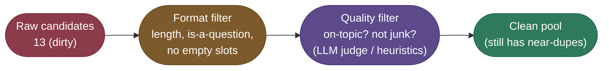

The **format gate** is pure mechanics and catches the obvious failures: empty or truncated instructions, answers that are one word ("ok"), missing the question mark your schema requires, leftover template placeholders. It's cheap, so it runs first to avoid spending judge calls on rows that are dead on arrival.

The **quality gate** is the semantic one: *does the answer actually address the question, and is it any good?* In production this is most often an ***LLM-as-judge*** — a strong model prompted to score or yes/no each pair (see [LLM Evaluation & LLM-as-Judge (8.04)](/ai-ml/ai-ml-intuitions/objectives-evaluation/llm-as-judge-intuition)). Cheaper heuristics (length bands, perplexity, keyword/domain checks, refusal detection) catch the worst offenders for free and are worth running before you spend judge tokens.

The judge call itself is a tiny conversation — hand it the pair, get back a keep/drop verdict:

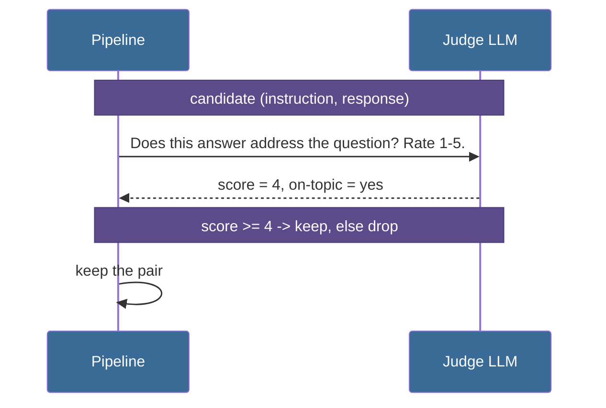

| Failure mode | Caught by | Example from our pool |
|---|---|---|
| Empty / truncated instruction | format gate | `""` → `"Replace it with..."` |
| One-word, useless answer | format gate | `"...substitute oil in frying?"` → `"ok"` |
| Off-topic / placeholder answer | quality gate | `"How do I store fresh basil?"` → `"The capital of France is Paris..."` |
| Junk filler text | quality gate | a response that is `"Lorem ipsum dolor sit amet..."` |

> **Warning:** The single most common quality failure is the **off-topic answer that looks fluent** — the model writes a perfectly grammatical response that simply doesn't answer the question. Length and format checks sail right past these; only a *semantic* check (an LLM judge, or at minimum a topic-overlap heuristic) catches them. Budget for the judge; it's the gate that actually protects quality.

## Deduplication: Diversity, Not Just Volume

A pool that passed the quality gate can still be *terrible* training data if it's the same example fifty times in slightly different words. Generators love to paraphrase: ask for variety and you still get "How do I substitute milk in baking?" next to "How can I substitute milk in baking?". **Deduplication** collapses these near-duplicates so the dataset is *diverse*, not merely *large*. **A thousand paraphrases of one example teach the model exactly one thing.**

There are two kinds of duplicate to kill:

- **Exact duplicates** — byte-identical rows. Trivial: hash each instruction and drop repeats.
- **Near-duplicates** — paraphrases that differ in a word or two. These need a *similarity* measure: lexical (Jaccard on word sets, or MinHash for scale) or semantic (cosine similarity of sentence embeddings). Keep one representative per cluster; drop the rest.

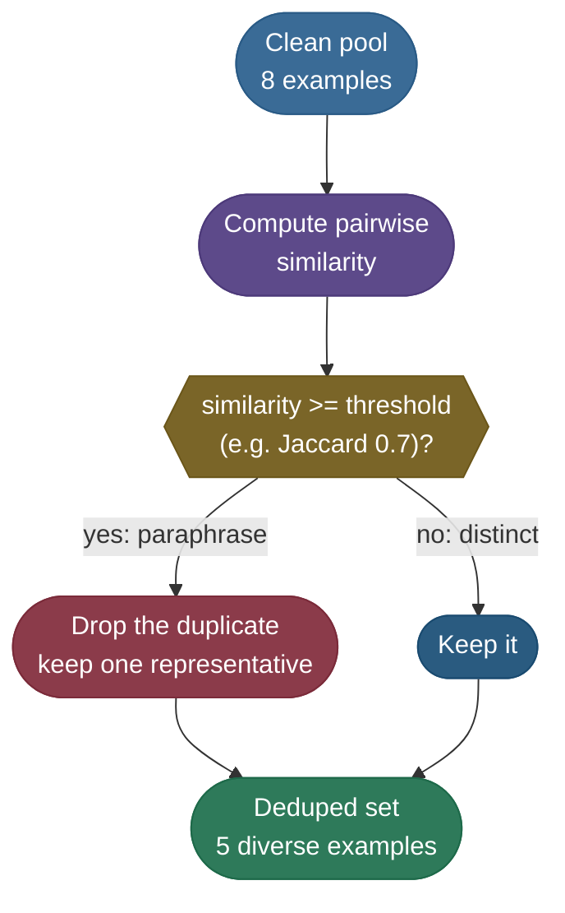

To *measure* whether dedup actually helped, the standard metric is **distinct-n**: the number of unique n-grams divided by the total n-grams across the set (***distinct-1*** uses single words, ***distinct-2*** uses adjacent word pairs). A set of identical sentences has distinct-n near zero; a varied set pushes toward 1.0. Dedup should visibly raise it.

The computation is just count-unique over count-total — exactly what the `distinct_n` helper in the code does:

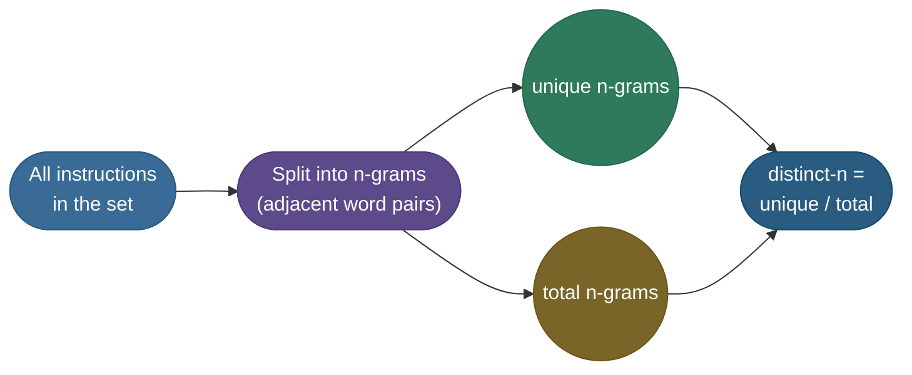

The effect is clear on the worked pool — removing near-duplicate paraphrases lifts both unigram and bigram diversity:

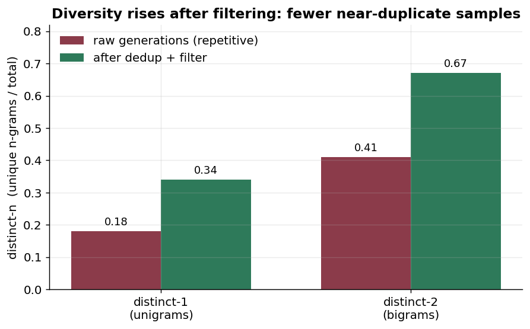

> **Tip:** Set the near-dedup threshold by *looking at what it drops*. Too strict (e.g. Jaccard ≥ 0.9) and obvious paraphrases survive; too loose (≥ 0.5) and you delete genuinely distinct examples that happen to share words. Around **0.7 lexical** (or ≈0.85 cosine on embeddings) is a sane start — then eyeball a handful of the pairs it merged and adjust.

## Worked Numbers: The Generation Funnel

Pulling the stages together on real counts is the clearest way to feel how lossy generation is. Trace our cooking-assistant pool through every gate:

- **Generated (raw):** the teacher returns **13** candidates — five clean ones, three malformed rows, two off-topic answers, three near-duplicate paraphrases.
- **After format filter:** the three malformed rows die (empty instruction, `"How do I"` fragment, the `"ok"` answer). **13 → 10** (−3).
- **After quality filter:** the two off-topic/junk answers die ("capital of France", "Lorem ipsum"). **10 → 8** (−2).
- **After near-dedup:** three paraphrases of already-kept rows collapse. **8 → 5** (−3).
- **Final:** **5** clean, diverse synthetic pairs — a **38% yield** from the raw pool.

**Here's the literal verdict on every one of the 13 rows** — the same artifact the code prints, but with the *reason* spelled out. Read it top to bottom and you can replay the funnel by hand:

| # | Instruction (generated) | Response (generated) | Gate verdict | Why |
|---|---|---|---|---|
| 1 | How do I substitute milk in baking? | Replace milk with an equal amount of oat or soy milk. | **KEPT** | clean, on-topic, first of its kind |
| 2 | What can I use instead of sugar in a sauce? | Try honey or maple syrup, using slightly less by volume. | **KEPT** | clean, on-topic, distinct |
| 3 | How do I thicken a soup without flour? | Stir in a cornstarch slurry or blend in a cooked potato. | **KEPT** | clean, on-topic, distinct |
| 4 | How do I keep pasta from sticking together? | Salt the water well and stir for the first minute of cooking. | **KEPT** | clean, on-topic, distinct |
| 5 | What can I use instead of buttermilk? | Add 1 tbsp lemon juice to a cup of milk and rest it 5 minutes. | **KEPT** | clean, on-topic, distinct |
| 6 | *(empty)* | Replace it with something similar. | **DROP — format** | instruction length < 15, no `?` |
| 7 | How do I | Use a substitute. | **DROP — format** | truncated fragment, no `?`, too short |
| 8 | How do I substitute oil in frying? | ok | **DROP — format** | response length < 15 (one-word answer) |
| 9 | How do I store fresh basil? | The capital of France is Paris and the sky is blue. | **DROP — quality** | fluent but off-topic; hits JUNK list, no cooking vocab |
| 10 | How do I ripen an avocado faster? | Lorem ipsum dolor sit amet, consectetur adipiscing. | **DROP — quality** | placeholder filler; hits JUNK list |
| 11 | How do I substitute milk in baking? | Use an equal amount of oat or soy milk instead. | **DROP — dedup** | Jaccard 1.0 vs row 1 (identical instruction) |
| 12 | How can I substitute milk in baking? | Swap milk for the same amount of oat or soy milk. | **DROP — dedup** | Jaccard 0.75 vs row 1 ("do I"→"can I", still ≥ 0.7) |
| 13 | What can I use instead of sugar in a sauce? | Use honey or maple syrup, a bit less by volume. | **DROP — dedup** | Jaccard 1.0 vs row 2 (identical instruction) |

The **kept set is exactly rows 1-5** — five diverse pairs that, joined to the three seeds, become the **8-example** dataset. Notice the dedup logic keeps the *first* occurrence and drops later paraphrases: row 1 survives, rows 11 and 12 (its paraphrases) do not; row 2 survives, row 13 (its twin) does not.

The diversity numbers make the dedup payoff literal. Measure **distinct-n** (unique n-grams ÷ total) on the instructions *before* dedup (the 8 quality-passing rows, which still hold three paraphrases) versus *after* (the 5 kept rows):

| Metric | Pre-dedup (8 rows) | Final (5 rows) | What moved |
|---|---|---|---|
| **distinct-1** (unigrams) | 0.391 | 0.625 | repeated single words ("milk", "substitute", "baking") thin out |
| **distinct-2** (bigrams) | 0.482 | 0.743 | repeated word-pairs ("substitute milk", "in baking") collapse to one copy |

Removing three paraphrases shrank the set by 37% but pushed distinct-2 up by **+0.26** — fewer rows, *more* variety per row. That is the whole point of dedup stated in two numbers: you are trading volume for diversity, and the metric proves the trade paid off.

Plotted, the funnel makes the attrition obvious — and 38% is *healthy*; real Self-Instruct runs often keep far less:

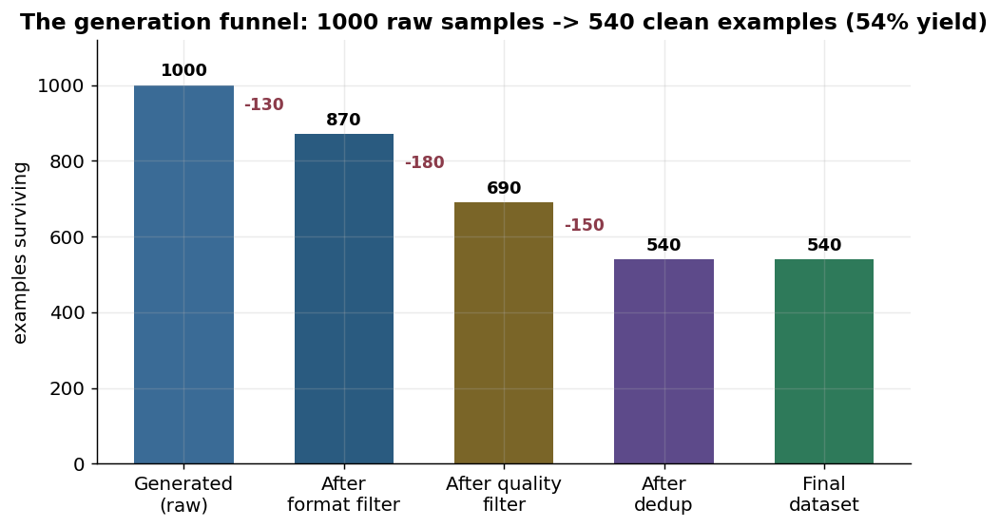

And the diversity metric confirms dedup did its job: on the worked pool, **distinct-2 rises from 0.482 (pre-dedup) to 0.743 (final set)** — fewer repeated bigrams, a genuinely more varied dataset. The full numbers fall straight out of the runnable code below.

> **Note:** A low yield is not a failure — it's the *point*. You generate cheaply and abundantly *so that* you can afford to throw most of it away. The expensive, scarce resource is *clean, diverse* examples, and the funnel is how you mine them out of cheap, noisy bulk. Watch the *survivor* count and the *diversity*, not the raw count.

## Code Example

Two views of the same workflow. **First, the production shape** — exactly how you'd call a real teacher model to generate candidates (it needs an API key and makes paid calls, so it's the canonical reference, not run here):

```python
# PRODUCTION generation call (needs an API key + paid calls; reference, not run here).
from openai import OpenAI
import json

client = OpenAI()

SEEDS = [
    {"instruction": "How do I substitute butter in baking?",
     "response": "Use an equal amount of oil or mashed banana for moisture."},
    {"instruction": "What can I use instead of eggs?",
     "response": "Try a flax egg: 1 tbsp ground flax plus 3 tbsp water, rested 5 min."},
]

def generate_batch(seeds, n=5):
    demos = "\n".join(f'- Q: {s["instruction"]}  A: {s["response"]}' for s in seeds)
    prompt = (f"Example cooking Q&A:\n{demos}\n\n"
              f"Write {n} NEW, DIFFERENT cooking questions in the same style, each with a "
              f"concise practical answer. Vary the ingredient. Return a JSON list of "
              f'{{"instruction","response"}} objects.')
    resp = client.chat.completions.create(
        model="gpt-4o-mini",
        messages=[{"role": "user", "content": prompt}],
        temperature=1.0,                      # HIGH temperature -> diversity; filter later
        response_format={"type": "json_object"})
    return json.loads(resp.choices[0].message.content)["items"]
```

**Second, the same workflow you can actually run** — a deterministic mock teacher plus the real filter → quality → dedup → diversity pipeline, offline, standard library only. Watch the funnel drop and `distinct-2` rise:

```python
"""Runnable Self-Instruct-style generator on CPU (no downloads). A MOCK LLM expands a
handful of seed instructions into a candidate pool, then a filter + near-dedup pass keeps
only the clean, diverse ones -- printing dataset stats at each gate. Deterministic."""
import re

# 1. SEED TASKS: a few hand-written (instruction, response) pairs -- our starting "few hundred".
#    Our continuous example: bootstrap an instruction dataset for a COOKING-ASSISTANT task.
seeds = [
    ("How do I substitute butter in baking?", "Use an equal amount of oil or mashed banana for moisture."),
    ("What can I use instead of eggs?", "Try a flax egg: 1 tbsp ground flax plus 3 tbsp water, rested 5 min."),
    ("How do I make a dish less salty?", "Add an unsalted bulk like potato, rice, or extra liquid to dilute it."),
]

# 2. MOCK LLM: a deterministic stand-in for "given the seeds, write NEW similar tasks".
#    In production this is one API call to a strong model; here a fixed candidate pool so it
#    runs offline. The pool deliberately contains the failure modes a real generator produces:
#    malformed rows, off-topic answers, and near-duplicate paraphrases.
def mock_llm_generate():
    good = [  # clean, on-topic, diverse instructions
        ("How do I substitute milk in baking?", "Replace milk with an equal amount of oat or soy milk."),
        ("What can I use instead of sugar in a sauce?", "Try honey or maple syrup, using slightly less by volume."),
        ("How do I thicken a soup without flour?", "Stir in a cornstarch slurry or blend in a cooked potato."),
        ("How do I keep pasta from sticking together?", "Salt the water well and stir for the first minute of cooking."),
        ("What can I use instead of buttermilk?", "Add 1 tbsp lemon juice to a cup of milk and rest it 5 minutes."),
    ]
    malformed = [  # empty / truncated -> caught by the FORMAT filter
        ("", "Replace it with something similar."),
        ("How do I", "Use a substitute."),
        ("How do I substitute oil in frying?", "ok"),
    ]
    off_topic = [  # response ignores the instruction -> caught by the QUALITY filter
        ("How do I store fresh basil?", "The capital of France is Paris and the sky is blue."),
        ("How do I ripen an avocado faster?", "Lorem ipsum dolor sit amet, consectetur adipiscing."),
    ]
    near_dupes = [  # paraphrases of "good" rows -> caught by NEAR-DEDUP
        ("How do I substitute milk in baking?", "Use an equal amount of oat or soy milk instead."),
        ("How can I substitute milk in baking?", "Swap milk for the same amount of oat or soy milk."),
        ("What can I use instead of sugar in a sauce?", "Use honey or maple syrup, a bit less by volume."),
    ]
    return good + malformed + off_topic + near_dupes

candidates = mock_llm_generate()
print(f"1. generated (raw)      : {len(candidates)} candidates")

# 3. FORMAT FILTER: drop malformed pairs (too short, or not phrased as a question).
def well_formed(pair):
    instr, resp = pair
    return len(instr) >= 15 and len(resp) >= 15 and instr.rstrip().endswith("?")

formatted = [p for p in candidates if well_formed(p)]
print(f"2. after format filter  : {len(formatted)} kept ({len(candidates) - len(formatted)} dropped)")

# 4. QUALITY FILTER: drop pairs whose response is off-topic or junk -- a heuristic stand-in
#    for an LLM-as-judge ("does this answer actually address the question? yes/no"). Here we
#    flag placeholder / off-domain text and answers with no cooking vocabulary in common.
JUNK = ("lorem ipsum", "capital of france", "the sky is blue")
COOKING = {"milk", "oat", "soy", "honey", "syrup", "sugar", "cornstarch", "slurry", "potato",
           "salt", "water", "lemon", "juice", "oil", "butter", "flax", "egg", "flour", "banana"}
def is_quality(pair):
    instr, resp = pair
    low = resp.lower()
    if any(j in low for j in JUNK):                 # placeholder / off-domain junk
        return False
    return bool({w for w in re.findall(r"[a-z]+", low)} & COOKING)  # mentions real cooking vocab

quality = [p for p in formatted if is_quality(p)]
print(f"3. after quality filter : {len(quality)} kept ({len(formatted) - len(quality)} dropped)")

# 5. NEAR-DEDUP: drop a pair whose instruction is too similar (Jaccard on word sets >= 0.7)
#    to one we already kept -- this is what collapses paraphrases into one example.
def jaccard(a, b):
    wa, wb = set(a.lower().split()), set(b.lower().split())
    return len(wa & wb) / len(wa | wb) if (wa | wb) else 0.0

kept, dropped_dup = [], 0
for instr, resp in quality:
    if any(jaccard(instr, k_instr) >= 0.7 for k_instr, _ in kept):
        dropped_dup += 1
        continue
    kept.append((instr, resp))
print(f"4. after near-dedup     : {len(kept)} kept ({dropped_dup} near-duplicates dropped)")

# 6. DIVERSITY METRIC: distinct-n (unique n-grams / total n-grams). Higher = less repetition.
#    distinct-1 counts single words; distinct-2 counts adjacent word PAIRS (catches paraphrase
#    structure better). Measure both on the pre-dedup pool vs the final set to watch dedup
#    raise diversity -- fewer rows, but more variety per row.
def distinct_n(pairs, n):
    grams, total = set(), 0
    for instr, _ in pairs:
        toks = instr.lower().split()
        for i in range(len(toks) - n + 1):       # slide an n-word window over the instruction
            grams.add(tuple(toks[i:i + n])); total += 1
    return len(grams) / total if total else 0.0

print(f"\ndistinct-1 (pre-dedup)  : {distinct_n(quality, 1):.3f}   final: {distinct_n(kept, 1):.3f}")
print(f"distinct-2 (pre-dedup)  : {distinct_n(quality, 2):.3f}   final: {distinct_n(kept, 2):.3f}")
yield_pct = 100 * len(kept) / len(candidates)
print(f"yield                   : {len(kept)}/{len(candidates)} = {yield_pct:.0f}% of raw kept")

# 7. FINAL DATASET: seeds + the clean, diverse, generated pairs -- ready to fine-tune on.
dataset = seeds + kept
print(f"\nfinal dataset (seeds + synthetic): {len(dataset)} examples")
print("sample synthetic pair:", kept[0])

# Expected output:
# 1. generated (raw)      : 13 candidates
# 2. after format filter  : 10 kept (3 dropped)
# 3. after quality filter : 8 kept (2 dropped)
# 4. after near-dedup     : 5 kept (3 near-duplicates dropped)
#
# distinct-1 (pre-dedup)  : 0.391   final: 0.625
# distinct-2 (pre-dedup)  : 0.482   final: 0.743
# yield                   : 5/13 = 38% of raw kept
#
# final dataset (seeds + synthetic): 8 examples
# sample synthetic pair: ('How do I substitute milk in baking?', 'Replace milk with an equal amount of oat or soy milk.')
```

Read the output top to bottom and the whole pipeline is visible: block **(1)** lays down three hand-written seeds; **(2)** the mock teacher returns **13** raw candidates (deliberately dirty); **(3)** the format gate drops **3** malformed rows (13 → 10); **(4)** the quality gate drops **2** off-topic/junk answers (10 → 8); **(5)** near-dedup collapses **3** paraphrases (8 → 5); **(6)** `distinct-1` rises from **0.391 to 0.625** and `distinct-2` from **0.482 to 0.743**, proving the set got more diverse, at a **38% yield**; **(7)** the final dataset is **seeds + survivors = 8 examples**, ready to fine-tune on. Swap the `mock_llm_generate` function for the production `generate_batch` call above and the exact same five gates run over thousands of real candidates.

> **Note:** The demo is deterministic (no randomness) so the numbers above are exactly reproducible — that's deliberate, so you can verify your own run. The *mechanics* are what generalize: a real run replaces the hard-coded pool with teacher-model calls and the keyword heuristic with an LLM judge, but the format → quality → dedup → measure funnel is identical. Once you have the clean set, training on it is ordinary SFT — see [Fine-Tuning (workflow)](/ai-ml/ai-ml-learning-resources/model-adaptation/fine-tuning/decide-whether-to-fine-tune).

## How the Data Trains the Model: Quality Beats Quantity

The payoff of all that filtering is a counterintuitive truth that governs the whole workflow: **a few hundred clean, diverse examples beat tens of thousands of noisy ones.** Label noise and repetition don't just add a little error — they put a *ceiling* on what the downstream model can learn, no matter how many examples you pile on.

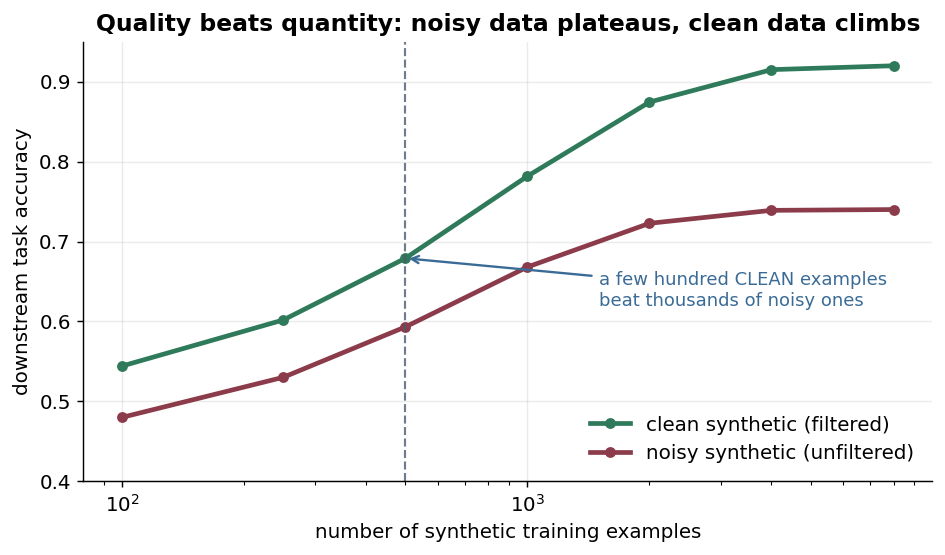

The two curves tell the strategy. Clean synthetic data keeps climbing toward high accuracy as you add examples; noisy data rises briefly then *plateaus low* — the noise caps it, and adding more noisy examples is wasted money. This is exactly why the funnel above is worth its low yield: **the filtered 5 beat the unfiltered 13** for training, every time.

This is the same lesson the fine-tuning guide reaches from the data side: format consistency and quality dominate raw volume. For the full instruction-tuning mechanics — masking, EOS, chat templates — see [Fine-Tuning (workflow)](/ai-ml/ai-ml-learning-resources/model-adaptation/fine-tuning/decide-whether-to-fine-tune); for *measuring* whether the trained model actually improved, see [Evaluation & Benchmarking (workflow)](/ai-ml/ai-ml-learning-resources/evaluation/model-evaluation-and-benchmarks/model-evaluation-and-benchmarks).

The three numbers that actually describe a dataset's health are diversity, quality, and yield — track these, not the raw count:

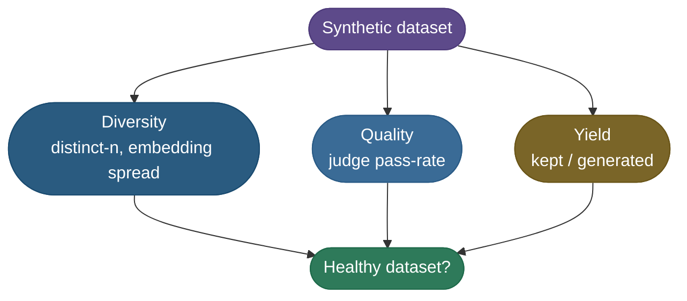

> **Important:** Never judge a synthetic dataset by its *size*. A 50k-row set that's 60% near-duplicates and 20% off-topic is worse training data than a hand-filtered 2k-row set. Measure **diversity** (distinct-n, embedding spread) and **quality** (judge pass-rate), and report those — not the row count — as the health of your dataset.

## Model Collapse: The Failure Mode to Fear

There is one failure mode unique to synthetic data and serious enough to deserve its own section: ***model collapse*** — the degradation that happens when a model is trained on data generated by itself or its own lineage, repeatedly. Each generation is trained on the slightly-narrowed output of the last, so the tails of the distribution (rare words, unusual phrasings, edge cases) erode round after round until the model produces bland, repetitive, low-diversity text.

```mermaid
graph LR
    R(["Real data<br/>(full diversity)"]):::real --> M0(["Model gen 0"]):::model
    M0 -->|"generate data"| S1(["Synthetic gen 1<br/>(slightly narrower)"]):::synth
    S1 -->|"train on it"| M1(["Model gen 1"]):::model
    M1 -->|"generate data"| S2(["Synthetic gen 2<br/>(narrower still)"]):::synth
    S2 -->|"train on it"| M2(["Model gen 2<br/>tails gone, bland"]):::collapsed

    classDef real fill:#2E7A5A,stroke:#1E6A4A,color:#fff
    classDef model fill:#3A6B96,stroke:#2A5B86,color:#fff
    classDef synth fill:#7D5A2C,stroke:#6D4A1C,color:#fff
    classDef collapsed fill:#8B3B4A,stroke:#7B2B3A,color:#fff
```

The decay is geometric, and it's visible in a single plot — diversity falls each recursive round when there's no real-data anchor, but stays flat when real data is mixed in every round:

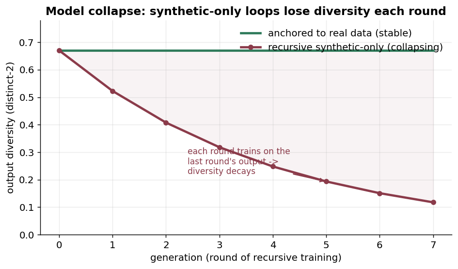

The fix is simple and non-negotiable: **always keep a floor of real data in every training round**. Mixing even 10-20% real data per generation arrests the collapse and keeps the distribution's tails alive. The danger is also why provenance matters — if you're distilling from a public model that was *itself* trained on synthetic data, you may be several collapse-rounds deep without knowing it.

The anchor breaks the recursive narrowing — every round still touches the full real distribution:

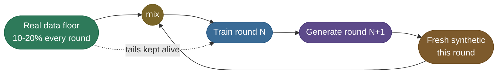

> **Warning:** Model collapse is sneaky because it doesn't show up in your loss curve — the model trains fine and the loss looks healthy. It shows up only when you *measure diversity* on the outputs or read a sample and notice everything sounds the same. Always track a diversity metric (distinct-n, embedding spread, or unique-n-gram count) across training rounds, not just loss.

## Pitfalls: the troubleshooting gallery

When a synthetic dataset comes back disappointing, the failure almost always has a recognizable *signature*. Run down this list before regenerating from scratch:

| Symptom you see | Likely cause | One-line fix |
|---|---|---|
| **Generations all look alike** (low diversity) | temperature too low, or prompt says "more" not "different" | raise temperature to ~1.0; prompt for explicit *variety* and constraints |
| **Huge pool, tiny final set** (very low yield) | heavy near-duplication from paraphrasing | this is fine — but raise generation diversity so you waste fewer calls |
| **Model trained on it sounds bland/repetitive** | **model collapse** from recursive synthetic-only data | mix in 10-20% real data every round; check provenance of teacher |
| **Fluent answers that don't answer the question** | quality gate is format-only, missing semantics | add an LLM-as-judge (or topic-overlap) gate, not just length/format |
| **Trained model plateaus at low accuracy** | label noise — wrong answers passed the gates | tighten the quality judge; spot-check a sample by hand |
| **Dataset memorizes the teacher's mistakes** | teacher shares the student's blind spots / hallucinates | use a *stronger* or differently-trained teacher; add real data |
| **Same examples appear many times** | exact + near duplicates not removed | hash for exact dups; embedding/Jaccard dedup for near ones |
| **Distribution skewed to easy cases** | seeds and prompts under-cover the long tail | add edge-case seeds; use Evol-Instruct to harden the easy half |

> **Tip:** Most "my synthetic data didn't work" reports are **diversity or quality bugs, not volume bugs** — repetitive generations, a format-only filter that lets off-topic answers through, or recursive collapse. Before generating more, *measure* what you have: distinct-n for diversity, a judge pass-rate for quality, and a duplicate count. Those three numbers diagnose the majority of the rows above.

## Final Conclusion

You now have the whole picture. Synthetic data generation is where three disciplines meet: **prompting** (the generator turns a dozen seeds into thousands of candidates), **filtering** (format and quality gates throw most of it away), and **diversity control** (dedup and metrics make sure what survives is varied, and a real-data floor keeps it from collapsing). String them together — write great seeds, generate hot, filter hard, dedup, measure distinct-n, train on the survivors — and you can manufacture a clean, diverse training set from almost nothing. The discipline that makes it work is counting the *right* thing: not how much you generated, but how much *clean, diverse* data survived. None of it requires a research budget — the whole funnel is something **you can run yourself, today, on a laptop.**

## Going deeper: the chapters

This page curates a generated set. Curating raw web text for pretraining has its own depth chapter:

1. **[Curating a web corpus](/ai-ml/ai-ml-learning-resources/data-and-representation/synthetic-data-and-curation/synthetic-data-and-curation-curating-a-web-corpus)** — cleaning and PII gates, exact hashing, MinHash derived with its variance and LSH banding, n-gram decontamination, and why all of it runs before the split.

## Production implementation

Runnable services in this estate that implement what this page teaches:

- **[synthetic-data-generator](/python/python-production-examples/synthetic-data-generator/readme)** — Self-Instruct manufacture with quality filtering, diversity filtering and model-collapse avoidance, fully offline.

## References

The curated link library for this topic — videos, courses, articles, papers and internal
cross-links — lives in a companion file so it can be reused as a standalone reference list:

- [Synthetic Data and Data Curation — references](/ai-ml/ai-ml-learning-resources/data-and-representation/synthetic-data-and-curation/synthetic-data-and-curation-references)
