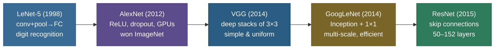

# CNNs and convolution: networks that exploit the structure of images

Hand a fully-connected network a photo and it sees a flat list of numbers. It has no idea that two pixels next to each other are related, that a vertical line is made of stacked edge-pixels, or that a cat is a cat whether it sits in the top-left corner or the bottom-right. Worse, the parameter count detonates: a modest 224×224×3 image is 150,528 input values, so wiring it into even a *single* 1000-unit hidden layer costs $150{,}528 \times 1000 \approx \textbf{150 million weights} — \textit{in one layer}$. Make that layer the same width as the input and it's $150{,}528^2 \approx 22.7$ **billion**. Un-trainable and un-storable, and every one of those weights has to *relearn* an edge separately at every position it might appear.

**Convolutional neural networks** dissolve both problems with one idea borrowed from biological vision: slide a small **filter** across the image hunting for a local pattern, and **reuse that same filter everywhere**. That single move — local filters with shared weights — slashes parameters by *eight orders of magnitude* (we measure a **~270-million-fold** cut below, from a real run), bakes in the prior that nearby pixels matter, and makes the network detect a pattern *no matter where it appears* (translation **equivariance**, verified to machine precision). Stack these layers and a hierarchy grows on its own: edges → textures → object parts → whole objects. CNNs ran the modern computer-vision revolution from 2012 onward, and the operation at their heart — convolution — is one of the most reused primitives in all of deep learning.

This page builds the whole thing from the ground up, deriving rather than asserting, and every quantitative claim is produced by a **real, runnable** pipeline — a from-scratch NumPy convolution checked against `scipy` and `torch`, its backward pass gradient-checked and autograd-checked, and a small CNN actually trained against a larger MLP on real digit images. By the end you'll be able to:

- explain *exactly why* fully-connected nets fail on images, with the parameter arithmetic to prove it;
- **define convolution** as a multiply-and-sum slide, derive a single output value, and explain the cross-correlation footnote that trips up interviews;
- derive the **three priors** CNNs encode — local receptive fields, parameter sharing (→ translation **equivariance**), hierarchical composition — and the concrete parameter savings of each;
- produce the **output-size formula** $O = \lfloor (W - K + 2P)/S \rfloor + 1$ cold, derive it, and apply it across stride/padding/dilation cases;
- reason about **channels** and the full 4-D tensor shapes `[N, C, H, W]`, and count a conv layer's **parameters and FLOPs** from scratch;
- distinguish the conv's **equivariance** from pooling's **invariance** precisely;
- explain the **im2col / Toeplitz** implementation and the **structure of backprop through a convolution** — and see it gradient-checked;
- derive **receptive-field growth** with depth, **1×1** convolutions, and **depthwise-separable** convolutions (with the $1/C_{out} + 1/K^2$ reduction factor);
- narrate the **LeNet → AlexNet → VGG → Inception → ResNet** lineage and what each contributed;
- state the CNN **inductive bias** and the trade it makes against Vision Transformers;
- implement 2-D convolution — forward *and* backward — from scratch and match PyTorch to machine precision.

Pictures and intuition first, then the arithmetic (with sources), then runnable, verified code.

> **Note:** the operation deep-learning calls "convolution" is technically **cross-correlation** — true convolution flips the kernel first (we derive the difference below). Because the kernel is *learned*, the flip is irrelevant: the network simply learns the flipped filter. So every framework computes the un-flipped version and calls it convolution. Worth knowing for an interview; harmless in practice — but the flip *reappears* in the backward pass, which is where it matters.

> **Note:** this page focuses on convolution itself. For the backward pass it plugs into, see the sibling [Backpropagation & Computational Graphs](/ai-ml/ai-ml-learning-resources/deep-learning/neural-network-foundations/backpropagation-and-computational-graphs/backpropagation-and-computational-graphs) (a conv layer's backward pass *is* backprop, and all three of its gradients are themselves convolutions); for the dense layer it replaces, [Perceptron & MLP](/ai-ml/ai-ml-learning-resources/deep-learning/neural-network-foundations/perceptron-and-mlp/perceptron-and-mlp); for the BatchNorm that sits in every conv block, [Normalization](/ai-ml/ai-ml-learning-resources/deep-learning/stabilization-and-architectural-blocks/normalization/normalization); for the skip connections that made CNNs go deep, [Residual / Skip Connections](/ai-ml/ai-ml-learning-resources/deep-learning/stabilization-and-architectural-blocks/residual-skip-connections/residual-skip-connections). We point to them rather than repeat them.

---

## The problem: fully-connected nets don't fit images

To feel why convolution exists, you have to feel the waste of *not* using it. Flatten a 224×224×3 RGB image into a vector and feed it to a dense (fully-connected) layer. The input has $3 \times 224 \times 224 = 150{,}528$ values, so **a single hidden neuron** already needs 150,528 weights, and a 1000-unit hidden layer needs **~150 million**. Three distinct things are wrong, and convolution fixes all three at once:

- **Parameter explosion.** Hundreds of millions of weights to learn, store, and regularize — far more parameters than you have images, so the model overfits catastrophically and never trains.
- **No spatial structure.** Flattening *destroys geometry*: pixel $(0,0)$ and pixel $(0,1)$ — physically adjacent — become arbitrary, unrelated entries in a vector. The network must rediscover, from scratch and from data, that adjacency means anything. That is a colossal waste of capacity learning something we already *know*.
- **No translation awareness.** A feature learned at the top-left corner is encoded in a *completely separate* block of weights from the same feature at the bottom-right. The dense net learns "edge-at-position-(12,30)" rather than "edge," and has to relearn every pattern at every location — multiplying the data it needs.

Images carry structure we know about *a priori*: **locality** (meaningful patterns are local — an edge spans a few pixels, not the whole frame) and **translation** (a cat is a cat anywhere in the frame). A fully-connected net is forced to discover this from data. A CNN **builds it into the architecture** — and architecture is free. That is the entire motivation, and we measure its payoff below: a real conv layer with **1,792** weights replaces a dense layer with **483 billion**, and *keeps* a small CNN as accurate as a 5× larger MLP.

> **Tip:** the cleanest one-line framing of CNNs in an interview: *"a CNN is a fully-connected layer with two constraints imposed — sparse local connectivity and weight sharing — chosen to match the structure of images."* Everything else (pooling, 1×1, residuals) is engineering on top of that.

---

## Intuition: one stencil, slid everywhere

Picture a clear plastic **stencil** with a tiny pattern cut into it — say, a short vertical bar. You lay it on the top-left corner of a photo and score how well the pixels underneath match the stencil's pattern: a high score means "there's a vertical bar here," a low score means "nope." Then you slide the stencil one step right and score again, and again, sweeping the whole image. The grid of scores you collect *is* the feature map, and the stencil *is* the kernel.

Two things make this the right mental model. First, the stencil is **small** — it only ever looks at a little patch, which is exactly *local connectivity*: you don't need the whole photo to decide if there's a bar in one spot. Second, it's the **same stencil** at every position — that's *weight sharing*: you cut the pattern once and reuse it everywhere, so a bar in the corner and a bar in the center are scored by the identical detector. A fully-connected net, by contrast, would be a different custom-cut stencil at every single location, learned independently — absurdly wasteful when you *know* a bar is a bar wherever it appears.

Now stack the idea: feed the grid of "vertical-bar scores" into a *second* set of stencils that look for patterns *in the scores* — "a vertical bar next to a horizontal bar" (a corner), say. Stack again and you're detecting "two corners and a curve" (an eye); again, "two eyes above a nose" (a face). Each layer's stencils compose the layer below's into something larger and more abstract. That progression — simple local detectors combined into complex ones — is the whole CNN, and it's why the same architecture that finds edges in layer 1 finds faces in layer 8. (We *see* the layer-1 stencils a real CNN learns, further down — they come out as edge detectors, exactly as the analogy predicts.)

> **Note:** the stencil analogy also makes *equivariance* obvious: slide the **photo** under a fixed stencil and the high-score spot slides the same way. The detector doesn't care *where* the bar is — it fires wherever the bar goes. That "fires-wherever-it-goes" property is translation equivariance, and it's a direct, visual consequence of reusing one stencil everywhere.

---

## The convolution operation

A **convolution** slides a small **kernel** (also called a *filter*) — say $3\times3$ — across the input. At each position it lays the kernel over the overlapping **patch** of the input, multiplies the two element-wise, and **sums** every product into a *single number* of the output, called the **feature map** (or activation map). Then it slides over by the **stride** and repeats.


### Deriving one output value

Let the input be $X$ and the kernel be $K$ of size $k \times k$. The output value at position $(i, j)$ — using the cross-correlation convention every framework actually uses — is

$$Y[i, j] \;=\; \sum_{m=0}^{k-1} \sum_{n=0}^{k-1} X[i + m,\; j + n]\; \cdot\; K[m, n] \;+\; b,$$

where $b$ is a single scalar **bias** shared across all positions. Read it plainly: *line the kernel up at $(i,j)$, multiply each kernel weight by the input pixel beneath it, add up all $k^2$ products, add the bias.* That is one **dot product** between the flattened patch and the flattened kernel. Concretely, for the figure's top-left patch and the vertical-edge kernel (computed exactly by the code):

$$\underbrace{(2\cdot1 + 0\cdot0 + 0\cdot{-}1)}_{=\,2} + \underbrace{(2\cdot1 + 1\cdot0 + 0\cdot{-}1)}_{=\,2} + \underbrace{(2\cdot1 + 2\cdot0 + 2\cdot{-}1)}_{=\,0} \;=\; 4.$$

The kernel *is* a learned pattern detector. The vertical-edge filter — a positive left column, zero middle, negative right column — produces a large positive output where the image brightens left-to-right (a vertical edge) and $\approx 0$ where the region is flat (the positives and negatives cancel). A convolutional layer learns **many** such kernels by gradient descent, each tuned to a different local pattern.

### Cross-correlation vs true convolution

The *mathematical* convolution flips the kernel before sliding:

$$(X * K)[i,j] \;=\; \sum_{m}\sum_{n} X[i-m,\; j-n]\, K[m,n] \qquad (\text{note the } i-m,\; j-n).$$

Cross-correlation (what we wrote first, with $i+m,\,j+n$) does *not* flip. The flip is what gives true convolution its nice algebraic properties (commutativity, the convolution theorem). But in a CNN the kernel weights are **learned**, so whether the framework flips or not, gradient descent just lands on whichever orientation produces the right outputs. The two are equivalent up to a kernel reflection, and every library (PyTorch's `conv2d`, TensorFlow, JAX) implements the **un-flipped cross-correlation** and calls it convolution.

> **Gotcha:** "Is `nn.Conv2d` *really* a convolution?" — No, it's a cross-correlation; it skips the kernel flip. Interviewers love this because it tests whether you understand the signal-processing definition. The follow-up — "does it matter?" — is *no, because the kernel is learned*. Say both halves and you've nailed it. (Our from-scratch cross-correlation matches `scipy.signal.correlate2d` to $4\times10^{-16}$ and matches `torch.nn.functional.conv2d` to $\sim10^{-15}$ — the code section proves it.)

> **See it live:** [CNN Explainer](https://poloclub.github.io/cnn-explainer/) (Georgia Tech) runs a real trained CNN in your browser — hover any neuron and watch the exact patch-times-kernel sum that produced it, layer by layer. For the operation in pure signal-processing terms, [3Blue1Brown's "But what is a convolution?"](https://www.youtube.com/watch?v=KuXjwB4LzSA) is the clearest visual definition anywhere.

> **Source / derivation:** the convolution/cross-correlation layer, the priors it encodes, and its arithmetic are Goodfellow, Bengio & Courville, *Deep Learning*, Ch. 9 ("Convolutional Networks") and *Dive into Deep Learning* Ch. 7; CS231n's "Convolutional Networks" notes are the canonical sizing reference; the exhaustive arithmetic of shapes (stride/pad/dilation/transposed) is Dumoulin & Visin, *A guide to convolution arithmetic for deep learning* (2016). All in the [references](cnns-and-convolution.references.md).

---

## The three priors that make CNNs work

Everything that follows is a consequence of three built-in assumptions — **inductive biases** — that happen to be true for images. They're worth stating up front because each one earns a concrete, derivable payoff.

### Prior 1 — local receptive fields (sparse connectivity)

Each output value looks at a small $k\times k$ **patch**, not the whole image. This is **sparse connectivity**: an output neuron is wired to only $k^2 \cdot C_{in}$ inputs instead of all $H\cdot W\cdot C_{in}$ of them. The justification is that vision is *local* — edges, corners, and textures are local patterns, and you don't need pixel $(0,0)$ to decide whether there's an edge at pixel $(200,200)$. A $3\times3$ filter touches 9 spatial positions, full stop, regardless of image size.

### Prior 2 — parameter sharing gives translation equivariance

The *same* kernel is slid across **every** position. A dense layer would learn an independent weight for every (input, output) pair; a conv layer learns **one** $k\times k$ kernel and reuses it everywhere. This is where the dramatic parameter saving comes from, and it encodes a belief: *a feature worth detecting in one place is worth detecting everywhere.*

The deep consequence of sharing is **translation equivariance**. Formally, if $T$ shifts the input by some amount and $\mathrm{Conv}$ is the convolution, then

$$\mathrm{Conv}(T(x)) \;=\; T(\mathrm{Conv}(x)).$$

Shift the input, and the feature map shifts the *same way* — the network detects the feature in its new location automatically, *without* relearning. The code verifies this **exactly** (max interior difference $0.0$: convolving a shifted input equals shifting the convolved output). This is precisely the property a dense net lacks and why it needs so much more data.

> **Note:** equivariance is *not* invariance. Equivariance means "shift in → shift out" (the response *moves* with the feature). Invariance means "shift in → same out" (the response *ignores* the shift). Convolution gives **equivariance**; **pooling** (below) layers in a degree of **invariance**. Keeping these straight is one of the most common interview discriminators.

### Prior 3 — hierarchical / compositional structure

Stacking conv layers lets the network compose simple local patterns into complex ones: layer 1 detects oriented edges, layer 2 combines edges into corners and textures, layer 3 assembles textures into object parts, and so on up to whole objects. The world is compositional — objects *are* made of parts made of edges — and the layered convolution mirrors that. This is also what makes the **receptive field** grow with depth (derived later): each layer sees a slightly larger window of the original image than the one below it.

> **Tip:** "Why a CNN over an MLP for images?" answer in three words — **locality, weight-sharing, translation-equivariance** — then deliver the parameter-count punchline (~270-million-fold fewer weights, *and* the count doesn't grow with image size). That's the whole question, asked in a dozen disguises.

> **Source / derivation:** the three priors — sparse interactions, parameter sharing, and equivariant representations — and pooling's approximate invariance are Goodfellow, Bengio & Courville, *Deep Learning*, §9.2–9.3 ("Motivation" and "Pooling"). In the [references](cnns-and-convolution.references.md).

---

## How the layers stack: the CNN pipeline

Before the arithmetic, the shape of the whole thing. A CNN alternates convolution+activation with pooling to build a feature hierarchy, then flattens (or globally pools) into a classifier. Convolutions stay **equivariant** (they preserve *where*, so features can compose); pooling adds *local* **invariance** and shrinks the map; the final global pool gives full translation invariance before the classifier:

```mermaid
graph LR
    I(["image<br/>H × W × 3"]):::data --> C1["conv + ReLU<br/>detects edges"]:::process
    C1 --> P1["pool<br/>↓ resolution"]:::navy
    P1 --> C2["conv + ReLU<br/>textures, parts"]:::process
    C2 --> P2["pool<br/>↓ resolution"]:::navy
    P2 --> C3["conv + ReLU<br/>object parts"]:::process
    C3 --> GP["global pool<br/>(invariance)"]:::frozen
    GP --> F["flatten +<br/>fully connected"]:::amber
    F --> O(["softmax<br/>class scores"]):::out

    classDef data fill:#3A6B96,stroke:#2A5B86,color:#fff
    classDef process fill:#5D4A8A,stroke:#4D3A7A,color:#fff
    classDef navy fill:#2A5B80,stroke:#1A4B70,color:#fff
    classDef frozen fill:#4A5B6E,stroke:#3A4B5E,color:#fff
    classDef amber fill:#7A6528,stroke:#6A5518,color:#fff
    classDef out fill:#2E7A5A,stroke:#1E6A4A,color:#fff
```



As the data flows deeper, spatial size **shrinks** (pooling/stride) while channel depth **grows** (more filters) — the network trades "where" for "what":

![The 4-D tensor-shape flow through a small CNN: from a [3, 32, 32] input, conv layers raise channel depth (3 to 16 to 32) while pooling halves the spatial size (32 to 16 to 8), then a flatten and fully-connected head maps 2048 features to 10 class scores. Spatial dimensions fall, channel depth rises; the conv layers are tiny to store while the single fully-connected head holds most of the parameters.](../images/dl13_tensor_flow.png)

---

## Output-size arithmetic (memorize this, then derive it)

Three hyperparameters set the output dimensions: **kernel size** $K$, **stride** $S$ (how far the kernel jumps each step), and **padding** $P$ (zeros added around the border). For an input of width $W$:

$$\boxed{\;O = \left\lfloor \frac{W - K + 2P}{S} \right\rfloor + 1\;}$$

**Deriving it.** Padding turns the effective input width into $W + 2P$ (a border of $P$ zeros on each side). A $K$-wide kernel can occupy positions whose left edge runs from $0$ up to $(W + 2P) - K$ — a span of $W + 2P - K$ pixels for the kernel's first column to land in. We step through that span in jumps of $S$, so the number of *additional* positions is $\lfloor (W + 2P - K)/S \rfloor$. Add the very first position (the "+1") and you have $O$. The floor appears because a partial final step (where the kernel would hang off the edge) is dropped. Height obeys the identical formula with $H$ in place of $W$.

Worked across several settings (the code reproduces every row):

| $W$ | $K$ | $P$ | $S$ | Output $O$ | what's happening |
|---|---|---|---|---|---|
| 7 | 3 | 0 | 1 | **5** | plain "valid" conv shrinks by $K-1 = 2$ |
| 7 | 3 | 1 | 1 | **7** | "same" padding preserves the size |
| 7 | 3 | 0 | 2 | **3** | stride 2 ≈ halves the resolution |
| 224 | 11 | 2 | 4 | **55** | AlexNet's first layer, exactly |
| 224 | 3 | 1 | 1 | **224** | the VGG workhorse: 3×3, pad 1, size-preserving |

Two patterns are worth memorizing because they recur everywhere:

- **"Same" convolution:** padding $P = (K-1)/2$ with stride 1 keeps output size = input size (for $K=3 \Rightarrow P=1$; for $K=5 \Rightarrow P=2$). This is why modern nets pad — you can stack many conv layers without the spatial size shrinking away.
- **"Valid" convolution:** $P = 0$. The output shrinks by $K-1$ each layer — fine for one layer, ruinous stacked 50 deep.
- **Stride $> 1$ downsamples** by roughly the factor $S$ — an alternative to pooling for shrinking the map.

> **Gotcha:** **padding modes** differ subtly. PyTorch's `padding="same"` only works for stride 1; with even kernels "same" is ambiguous (you'd need asymmetric padding). TensorFlow's `"SAME"` silently pads asymmetrically and can place the extra pad on the right/bottom — a classic source of off-by-one feature-map mismatches when porting a model between frameworks. When in doubt, compute the formula by hand.

> **Source / derivation:** the output-size formula and every stride/padding/dilation/transposed variant are derived and animated in Dumoulin & Visin, *A guide to convolution arithmetic for deep learning* (2016), and tabulated in the Stanford CS231n convolutional-networks notes. In the [references](cnns-and-convolution.references.md).

---

## Padding, stride, and dilation

**Padding** ($P$) frames the input with zeros so the kernel can sit centered on border pixels. *Valid* padding ($P=0$) means "only valid positions, no made-up data" and shrinks the map; *same* padding preserves size. Padding also fights a subtle bias: without it, edge pixels are visited by the kernel far fewer times than center pixels, so the network under-weights the borders.

**Stride** ($S$) is the step size of the slide. $S=1$ visits every position; $S=2$ skips every other one, roughly halving the output and cutting compute ~4×. Strided convolution is increasingly used *instead of* pooling to downsample — it lets the network *learn* how to summarize a region rather than hard-coding "take the max."

**Dilation** ($d$) spreads the kernel's taps apart by inserting $d-1$ gaps between them, so a $3\times3$ kernel with dilation 2 covers a $5\times5$ region while still using only 9 weights. It enlarges the receptive field **without** adding parameters or losing resolution — central to semantic-segmentation nets (DeepLab's "atrous" convolutions) and WaveNet's audio model. The output-size formula generalizes by replacing $K$ with the *effective* kernel size $K_{\text{eff}} = d(K-1) + 1$:

$$O = \left\lfloor \frac{W - \big(d(K-1)+1\big) + 2P}{S} \right\rfloor + 1.$$

> **Tip:** the three knobs do three different jobs — **padding controls the output size at the border**, **stride controls downsampling**, **dilation controls receptive-field reach without cost**. Reach for dilation when you need a *big* context window but can't afford to lose spatial resolution (dense prediction tasks like segmentation).

---

## Channels and the real 4-D shape of a conv layer

Real images have **channels** (RGB = 3). A kernel spans *all* input channels at once: a $3\times3$ kernel applied to a 3-channel input is actually a $3 \times 3 \times 3 = 27$-weight volume, and it sums across channels to produce **one** output value. A conv layer learns **many** such 3-D filters — one per **output channel** $C_{out}$ — each producing its own feature map. Those maps stack to form the layer's multi-channel output, which becomes the next layer's input.

So the full picture is four-dimensional. With a batch of $N$ images:

$$\underbrace{[N,\; C_{in},\; H,\; W]}_{\text{input}} \;\;\xrightarrow{\;\;\text{kernel } [C_{out},\; C_{in},\; K,\; K]\;\;}\;\; \underbrace{[N,\; C_{out},\; H',\; W']}_{\text{output}}$$

where $H', W'$ come from the output-size formula. The kernel tensor is 4-D: $C_{out}$ filters, each $C_{in} \times K \times K$. Spatial dimensions typically **shrink** (pooling/stride) while channel depth **grows** (more filters) as you go deeper — the network trades "where" for "what."

### Parameter count of a conv layer

A layer mapping $C_{in}$ channels to $C_{out}$ channels with $K \times K$ kernels has:

$$\text{params} \;=\; \underbrace{C_{out} \cdot (C_{in} \cdot K \cdot K)}_{\text{weights}} \;+\; \underbrace{C_{out}}_{\text{biases}}.$$

A $3\times3$ conv from $3\to64$ channels is just $64 \cdot (3\cdot3\cdot3) + 64 = \mathbf{1{,}792}$ parameters — and, crucially, **that number is independent of the image size**. Feed it a 32×32 thumbnail or a 4K photo: same 1,792 weights. The equivalent dense layer over a 224×224 image (every input pixel to every output pixel, $C_{out}=64$ full-resolution maps) needs $(3\cdot224\cdot224)\times(64\cdot224\cdot224) = \mathbf{483{,}385{,}147{,}392}$ — the code prints the ratio as **269,746,176× smaller** (~270 million-fold), the entire economic case for CNNs in one number.

### FLOP count of a conv layer

Compute is what determines whether a layer runs in real time. Each of the $H' \times W'$ output positions, for each of the $C_{out}$ output channels, does $C_{in} \cdot K \cdot K$ multiply-accumulates (MACs). So:

$$\text{MACs} \;=\; C_{out} \cdot H' \cdot W' \cdot (C_{in} \cdot K \cdot K), \qquad \text{FLOPs} \approx 2 \times \text{MACs}.$$

For a $3\to64$, $3\times3$, "same" conv on $224\times224$: $64 \cdot 224 \cdot 224 \cdot (3\cdot3\cdot3) = \mathbf{86{,}704{,}128}$ MACs ≈ **0.17 GFLOP** for that one layer (the code confirms it). Notice the contrast with parameters: **params are independent of spatial size, but FLOPs scale with $H'\times W'$.** A conv layer is *small to store* but *expensive to run on big images* — which is exactly why downsampling early (to shrink $H'\times W'$) and 1×1 bottlenecks (to shrink $C_{in}$ before a costly 3×3) are the two main levers for cutting CNN compute.

> **Note:** memorize the *shapes* and the two formulas (params and MACs) — interviewers routinely hand you a conv spec ("3→64, 3×3, stride 1, pad 1, input 224²") and ask for output shape, parameter count, and FLOPs on the spot. All three fall straight out of the boxed formula plus these two lines.

### Memory layout: NCHW vs NHWC

The *logical* shape `[N, C, H, W]` doesn't fully pin down how the tensor sits in memory. Two physical layouts dominate:

- **NCHW** (channels-first) — PyTorch's and cuDNN's default. All of channel 0's pixels are contiguous, then channel 1's. Good for the classic im2col/GEMM path.
- **NHWC** (channels-last) — TensorFlow's historical default and the layout **Tensor Cores** prefer. At each pixel all channels are contiguous, which makes the channel reduction a tidy contiguous dot product and feeds mixed-precision matmul units efficiently.

PyTorch exposes `tensor.to(memory_format=torch.channels_last)` precisely because, on modern GPUs with Tensor Cores, NHWC convolutions can be **substantially faster** at the same FLOPs. The math is identical; only the byte order changes.

> **Gotcha:** layout mismatches are a quiet performance killer. Mixing NCHW weights with an NHWC activation path forces silent layout *conversions* between layers — extra memory traffic that can erase the speedup you were chasing. When optimizing a CNN, check that the **whole** network (and its BatchNorm/activation ops) runs in one consistent layout — a frequent source of "correct but inexplicably slow" bugs.

---

## Convolution as a matrix multiply: im2col and the Toeplitz view

A convolution *looks* like a nested loop, but under the hood every fast implementation turns it into a single big **matrix multiply** — because GEMM (general matrix multiply) is the most heavily-optimized routine on every CPU and GPU. Two equivalent ways to see this.

**The Toeplitz view.** A 1-D convolution with a fixed kernel is a linear map, so it can be written $y = Cx$ for some matrix $C$. Because the *same* kernel weights appear at every position (just shifted), $C$ is a **Toeplitz matrix** — constant along each diagonal — and a *sparse* one (each output touches only $k$ inputs). A convolution is therefore "a fully-connected layer whose weight matrix is forced to be sparse and Toeplitz." That single sentence captures both priors — sparsity (locality) and the repeated diagonals (weight sharing) — in linear-algebra terms.

**The im2col trick (what frameworks actually do).** Rather than build a giant sparse matrix, libraries do the dual: **unfold** the input. Extract every $K\times K\times C_{in}$ patch the kernel will ever see and lay each one out as a *column*; stack the columns into a matrix $\text{cols}$ of shape $(C_{in}K^2,\; H'W')$. Flatten the kernels into a matrix $W_{\text{mat}}$ of shape $(C_{out},\; C_{in}K^2)$. Then the whole convolution is one dense matmul:

$$Y \;=\; W_{\text{mat}} \cdot \text{cols} \;+\; b \qquad \Rightarrow\qquad (C_{out},\, H'W').$$

Reshape $Y$ back to $[C_{out}, H', W']$ and you're done. This is **im2col + GEMM**, and it's why convolutions are fast: it converts the awkward sliding-window pattern into the one operation hardware is built to fly through. (The code implements exactly this `conv2d_im2col` and confirms it matches `F.conv2d` to $\sim10^{-15}$ — *the same matmul*.)

> **Gotcha:** im2col trades memory for speed — the unfolded `cols` matrix *replicates* every overlapping pixel (a pixel covered by 9 kernel positions appears 9 times), so it can be much larger than the input. That's why specialized kernels (cuDNN's implicit-GEMM, Winograd, FFT-based conv for large kernels) exist: they get GEMM's speed *without* materializing the full im2col buffer. But the mental model — "convolution is a matmul" — is exactly right.

---

## Backprop through a convolution

Convolution is linear, so it's differentiable and slots into [backpropagation](/ai-ml/ai-ml-learning-resources/deep-learning/neural-network-foundations/backpropagation-and-computational-graphs/backpropagation-and-computational-graphs) like any other layer — it is the **matmul VJP** of the sibling backprop page, specialized to a weight-shared, sparse matrix. The beautiful part is that **all three gradients are themselves convolutions**, so the backward pass reuses the same fast machinery as the forward pass. Let the forward op be $Y = X \star W$ (cross-correlation) and let $\delta = \partial L / \partial Y$ be the upstream gradient.

**Gradient w.r.t. the kernel.** Each weight $W[m,n]$ touches *every* output position, so its gradient sums those contributions:

$$\frac{\partial L}{\partial W[m,n]} \;=\; \sum_{i,j} \delta[i,j]\, X[i+m,\, j+n] \;=\; (X \star \delta)[m,n].$$

That is a **cross-correlation of the input with the upstream gradient** — the same operation as the forward pass, with $\delta$ playing the role of the kernel. Intuitively: a kernel weight's gradient is "how much did this weight, over all the places it was applied, contribute to the loss." Because the weight is *shared* across positions, its gradient **accumulates** over all of them — that summation is the gradient-side signature of parameter sharing, exactly the *fan-out / copy gate* from the backprop page, applied over space.

**Gradient w.r.t. the input.** Each input pixel $X[p,q]$ feeds into several output positions (every window that covered it), so its gradient gathers the upstream signal from all of them. Working out the indices, this is a **convolution of the upstream gradient with the *flipped* kernel** — equivalently a *transposed* ("deconvolution") convolution:

$$\frac{\partial L}{\partial X} \;=\; \delta * \text{rot180}(W),$$

with appropriate (full) padding. The kernel flip we ignored on the forward pass *reappears* here — it's the price of the chain rule. This is exactly the operation a **transposed convolution** layer performs on the forward pass, which is why transposed convs are used for *upsampling* (decoders, GANs, segmentation): a transposed conv is "the backward of a conv, run forward."

**Gradient w.r.t. the bias.** The simplest: $\partial L / \partial b = \sum_{i,j} \delta[i,j]$ — sum the upstream gradient over all spatial positions, since the one bias was added everywhere.

The code implements this backward pass from scratch (as a direct scatter, provably equivalent to the identities above) and proves it correct **two independent ways**: a centred finite-difference gradient check on every kernel entry (median relative error $4.6\times10^{-11}$, max $8.0\times10^{-10}$ — far below the $10^{-4}$ that would flag a bug) *and* a cross-check against `torch.autograd` on the identical op ($\partial L/\partial X$, $\partial L/\partial W$, $\partial L/\partial b$ all match to $\sim10^{-15}$).

> **Note:** the headline to remember: **forward conv, backward (transposed) conv.** Grad-w.r.t.-input is a transposed convolution; grad-w.r.t.-kernel is a convolution of input with the upstream gradient; grad-w.r.t.-bias is a spatial sum. Autograd does all of this for you, but knowing the *structure* explains why transposed convolutions exist and why CNN training is no slower (per FLOP) than the forward pass.

> **Source / derivation:** convolution as a differentiable layer, its backward pass as convolutions, and pooling's backward routing are Goodfellow, Bengio & Courville, *Deep Learning*, §9.5 ("Convolution and Pooling as an Infinitely Strong Prior") and the CS231n notes; the reverse-mode/VJP machinery it plugs into is the sibling [Backpropagation](/ai-ml/ai-ml-learning-resources/deep-learning/neural-network-foundations/backpropagation-and-computational-graphs/backpropagation-and-computational-graphs) page. In the [references](cnns-and-convolution.references.md).

---

## Pooling: downsample and gain a little invariance

A **pooling** layer shrinks a feature map by summarizing each small region into one number — **max-pooling** keeps the strongest activation, **average-pooling** the mean. It has **no learnable parameters**; it's a fixed reduction.


Pooling does two jobs:

1. **Downsampling.** Halving $H\times W$ quarters the activations, making deeper layers cheaper *and* — via the smaller map — growing each subsequent neuron's receptive field faster. Progressive downsampling is how a 224×224 image is funnelled down to a 7×7 feature grid before the classifier.
2. **A degree of translation *invariance*.** If a feature shifts by one pixel *within* a pooling window, the max over that window is unchanged. Small spatial jitter produces *no change* in the pooled output — the response now **ignores** the shift rather than moving with it.

This is the crucial pairing to articulate clearly, because it's the single most common follow-up after "equivariance vs invariance":

| Operation | Property | Meaning |
|---|---|---|
| **Convolution** | **equivariant** | shift the input → the feature map shifts the *same way* (the response *moves*) |
| **Pooling** | adds **invariance** | small shift within a window → pooled output *unchanged* (the response *ignores* it) |

The design logic: convolution should be *equivariant* (you want to know *where* a feature is, so it can compose into larger parts), while the *final* classification should be *invariant* (a cat is a cat regardless of position). A CNN gets there by stacking equivariant convolutions, sprinkling in pooling for a little invariance at each stage, and finishing with **global pooling** for full translation invariance before the classifier.

**Backprop through pooling** is clean: **max-pooling routes the upstream gradient only to the position that *won* the max** (it remembers the argmax) — every other input in the window gets zero gradient. **Average-pooling spreads the upstream gradient equally** over all $k^2$ inputs (each gets $\delta / k^2$). Neither has parameters; pooling only *passes gradient through*. The code implements max-pool forward and backward from scratch and matches `torch` **exactly** (both forward and backward difference $0.0$) — the argmax routing is bit-for-bit what the framework does.

> **Gotcha:** max-pooling's invariance is **small and local** — it only absorbs shifts *within* the window. CNNs are **not** globally translation-invariant by construction, and are *not* invariant to rotation or scale at all. Worse, classic strided/pooled CNNs aren't even perfectly shift-invariant: aliasing from naive downsampling makes predictions wobble under one-pixel shifts (the "[Making CNNs Shift-Invariant Again](https://arxiv.org/abs/1904.11486)" anti-aliasing result). Those robustnesses come mostly from **data augmentation**, not the architecture. The precise statement is "convolutions are translation-*equivariant*, and pooling adds *local* translation invariance."

> **Tip:** modern architectures increasingly **replace pooling with strided convolutions** (let the network learn the downsampling) or use **global average pooling** before the classifier (which also kills the giant dense head of old nets — a big parameter saving, from GoogLeNet/NiN). But the principle — progressive downsampling to trade spatial resolution for semantic depth — is universal.

---

## Receptive fields and how they grow with depth

The **receptive field (RF)** of a neuron is the region of the *original input image* that can influence its value — "how much of the picture does this neuron actually see?" It's a favourite interview follow-up because computing it tests whether you really understand stacking.

For a stack of conv layers with kernel size $K$ and stride 1, the receptive field grows **linearly** with depth. After $L$ layers:

$$\text{RF}_L \;=\; 1 + L\,(K - 1).$$

**Deriving it.** Layer 1's output sees a $K\times K$ window → RF $= K = 1 + 1\cdot(K-1)$. ✓ Each additional $K\times K$ layer extends the reach by $K-1$ on each spatial axis (a neuron in layer $\ell+1$ pools $K$ neighbours from layer $\ell$, each of which already reached $K-1$ further out). So every layer adds $K-1$, giving $\text{RF}_L = 1 + L(K-1)$. For $K=3$ the code prints $3, 5, 7, 9, 11, 13$ for $L = 1\ldots6$ — so **two stacked 3×3 convs have the same 5×5 receptive field as one 5×5 conv**, but with fewer parameters ($2\cdot3^2 = 18$ vs $5^2 = 25$ per channel-pair) and an extra nonlinearity in between — the core insight behind **VGG's all-3×3 design**.


**Stride and pooling speed it up multiplicatively.** Any layer with stride $S$ multiplies the *spacing* of subsequent receptive fields by $S$, so downsampling makes the RF grow *much* faster than linearly. Track two quantities: the **jump** $j$ (how far apart, in input pixels, two adjacent output neurons are) and the RF. For each layer, $j_{\text{out}} = j_{\text{in}}\cdot S$ and $\text{RF}_{\text{out}} = \text{RF}_{\text{in}} + (K-1)\cdot j_{\text{in}}$. The code traces a 3×3 (s1) → 2×2 pool (s2) → 3×3 (s1) stack:

| layer | $K$ | $S$ | jump $j$ (after) | RF (after) |
|---|---|---|---|---|
| input | — | — | 1 | 1 |
| conv 3×3, s1 | 3 | 1 | $1\cdot1 = 1$ | $1 + 2\cdot1 = 3$ |
| pool 2×2, s2 | 2 | 2 | $1\cdot2 = 2$ | $3 + 1\cdot1 = 4$ |
| conv 3×3, s1 | 3 | 1 | $2\cdot1 = 2$ | $4 + 2\cdot2 = 8$ |

So after just one downsample, a 3×3 conv adds **4** to the RF (not 2), because each step now spans 2 input pixels. This interleaving is exactly why real nets reach whole-image receptive fields in a dozen layers — how the network climbs from edge-detectors (tiny RF) to object-detectors (whole-image RF).

> **Tip:** the receptive field is the CNN analogue of "context window." If your object of interest is larger than a neuron's RF, that neuron *physically cannot* see all of it — a frequent cause of segmentation/detection failures on large objects, and the reason dilated convolutions (which enlarge the RF cheaply) were invented. The [Distill article on computing receptive fields](https://distill.pub/2019/computing-receptive-fields/) does the general multi-stride case rigorously.

---

## 1×1 convolutions: channel mixing on the cheap

A **1×1 convolution** looks trivial — a kernel that sees a single pixel — but it's one of the most useful primitives in modern CNNs. With $C_{in}$ input channels, a $1\times1$ kernel is a vector of length $C_{in}$, and applying it at one pixel is a **dot product across the channel dimension** at that pixel. So a $1\times1$ conv is a **learned linear mixing of channels, applied identically at every spatial location** — equivalently, a tiny fully-connected layer (a $C_{in}\to C_{out}$ matrix) shared across all $H\times W$ positions.

It does no spatial mixing (the receptive field is 1×1), but it does three valuable things:

- **Cheaply change channel count.** Map 256 channels → 64 with $256\cdot64 = 16{,}384$ weights and almost no compute, *before* an expensive 3×3 conv. This is the **"bottleneck"** in ResNet and Inception: 1×1 down → 3×3 → 1×1 up, which slashes the FLOPs of the costly middle layer.
- **Add nonlinear representational power.** Followed by a ReLU, a 1×1 conv learns nonlinear combinations of channels at each pixel — extra capacity for almost no cost (the "Network in Network" idea).
- **Fuse multi-branch features.** In Inception, 1×1 convs reduce the dimensionality feeding each parallel branch so the multi-scale module stays affordable.

> **Note:** the 1×1 conv is the bridge that makes very deep nets affordable. ResNet's 50/101/152-layer "bottleneck" blocks are built on it: 1×1 squeezes channels, a 3×3 does the spatial work in the cheaper space, and a 1×1 expands back. Without 1×1 reductions those depths would be computationally out of reach.

---

## Depthwise-separable convolutions: the mobile workhorse

A standard $K\times K$ conv mixes **space and channels simultaneously** in one fat operation. **Depthwise-separable** convolution (the heart of MobileNet, used widely in EfficientNet, Xception) **factors** that into two cheaper steps:

1. **Depthwise conv** — one $K\times K$ filter *per input channel*, applied independently (no cross-channel mixing). Cost: $C_{in}\cdot K^2$ weights. Does the spatial filtering.
2. **Pointwise conv** — a $1\times1$ conv that mixes the channels to produce $C_{out}$ outputs. Cost: $C_{in}\cdot C_{out}$ weights. Does the channel mixing.

**Deriving the reduction factor.** Compare parameters (FLOPs follow the identical ratio):

$$\frac{\text{separable}}{\text{standard}} \;=\; \frac{C_{in}K^2 + C_{in}C_{out}}{C_{out}\cdot C_{in}\cdot K^2} \;=\; \frac{1}{C_{out}} + \frac{1}{K^2}.$$

For $K=3$ and $C_{out}=128$: $\frac{1}{128} + \frac{1}{9} = 0.1189$, a **8.41× reduction** — about an order of magnitude fewer parameters and FLOPs for nearly the same accuracy. The code computes exactly this: a 64→128, 3×3 standard conv is **73,728** params; its depthwise-separable twin is **8,768** — an **8.41×** cut, matching the formula to the decimal. That factor is why depthwise-separable convolutions made real-time CNNs on phones possible.

> **Tip:** the reduction factor is dominated by $1/K^2$ for large channel counts (since $1/C_{out}\to 0$). So a 3×3 gives ≈9× and a 5×5 ≈25× — bigger kernels gain *more* from separability. The trade-off: a slight accuracy drop, because depthwise + pointwise is a strictly *less* expressive factorization than a full dense conv. MobileNet accepts that for an order-of-magnitude efficiency win.

---

## A real filter, applied: what a kernel "sees"

Before learned kernels, vision engineers hand-designed them — and the classic edge detector, the **Sobel filter**, is exactly the vertical/horizontal-edge kernel a CNN's *first* layer reliably learns on its own. Applying it to a real photograph makes "the kernel is a pattern detector" tangible:


The two $3\times3$ Sobel kernels are

$$G_x = \begin{bmatrix} 1 & 0 & -1 \\ 2 & 0 & -2 \\ 1 & 0 & -1 \end{bmatrix} \quad (\text{vertical edges}), \qquad G_y = \begin{bmatrix} 1 & 2 & 1 \\ 0 & 0 & 0 \\ -1 & -2 & -1 \end{bmatrix} \quad (\text{horizontal edges}).$$

Convolve each with the image, take the magnitude $\sqrt{G_x^2 + G_y^2}$, and the smooth interior collapses to near-zero while every boundary lights up. This image is **measured** — computed with the chapter's own `conv2d_naive` and verified against `scipy.signal.convolve2d` to $2.3\times10^{-13}$, not illustrative. A trained CNN's first-layer filters look *strikingly* like these; the network rediscovers them from data because edges are the most informative local feature. (We show the *actual* learned first-layer filters in the code section — they come out looking just like this.)

> **Note:** that gradient descent *reliably* learns edge detectors in layer 1 — independently across architectures and datasets — is strong evidence that the convolutional prior matches the statistics of natural images. Hubel and Wiesel found edge-selective cells in the cat visual cortex in 1959; CNNs landed on the same solution by optimization. That convergence is part of why convolution feels like the "right" prior for vision — the connection to biological vision is explored in [Neuroscience & Brain-Inspired AI](/ai-ml/ai-ml-learning-resources/specialized-studies/neuroscience-and-brain-inspired-ai/readme).

---

## BatchNorm and the anatomy of a conv block

In practice you almost never use a bare convolution — the repeated unit of a modern CNN is a small **block** that wraps the conv with two companions, in a specific order:

$$\text{Conv} \;\to\; \text{BatchNorm} \;\to\; \text{ReLU} \quad (\text{often written } \texttt{Conv-BN-ReLU}).$$

Each piece earns its place: the **conv** does the spatial+channel filtering; **BatchNorm** re-centers and re-scales each channel so the next layer sees a well-conditioned distribution (which permits high learning rates and deep stacks); the **ReLU** injects the nonlinearity, without which the whole stack collapses to a single linear map (any composition of convolutions is itself a convolution). A consequence of this ordering: because BN immediately re-centers, the conv's **bias is redundant** and is usually disabled (`bias=False`) when a conv is followed by BN — BN's $\beta$ absorbs it, saving $C_{out}$ parameters per layer.

In a conv layer, BatchNorm normalizes each *channel* across the batch **and** all spatial positions — mean/variance over the $N\times H\times W$ values of each feature map, then a learned $\gamma, \beta$ per channel. Normalizing per-channel (not per-activation) respects the weight-sharing prior: a kernel applied at every position should be normalized consistently across all of them. The full treatment lives in **[Normalization](/ai-ml/ai-ml-learning-resources/deep-learning/stabilization-and-architectural-blocks/normalization/normalization)**.

Stacking these blocks is the whole network. A **VGG stage** is two or three `Conv-BN-ReLU` blocks at one resolution then a $2\times2$ max-pool; a **ResNet stage** is several *residual* blocks (each a couple of `Conv-BN-ReLU`s with a skip connection wrapped around them) then a strided downsample.

> **Note:** BatchNorm's per-channel statistics are why CNNs and Transformers normalize differently. CNNs use **BatchNorm** (per channel over batch+space — natural when the same kernel sees every position); Transformers use **LayerNorm** (per token over features — natural for variable-length sequences). Same goal, different axis, dictated by each architecture's structure.

---

## Transposed and dilated convolutions

Two variant convolutions come up constantly once you leave plain classification.

**Transposed convolution (a.k.a. "deconvolution," fractionally-strided conv)** *upsamples*: it maps a small feature map to a larger one, the inverse spatial operation of a strided conv. Mechanically it's exactly what we derived as the **gradient-w.r.t.-input of a normal conv**, run forward — spread each input value out through the kernel and sum the overlaps. It's the workhorse of **decoders**: U-Net's expansive path, GAN generators, and autoencoder reconstructions all use it. Its output size *inverts* the forward formula: $O = S(W-1) + K - 2P$ (plus an optional output-padding term).

> **Gotcha:** transposed convolutions are notorious for **checkerboard artifacts** — when the kernel size isn't divisible by the stride, output pixels receive *uneven* numbers of overlapping contributions, leaving a periodic grid pattern. The common fix is **resize-then-convolve** (nearest-neighbor or bilinear upsample, then a normal conv). [Odena et al.'s Distill article](https://distill.pub/2016/deconv-checkerboard/) shows this beautifully.

**Dilated (atrous) convolution** *enlarges the receptive field without cost*: insert $d-1$ gaps between the kernel taps so a $3\times3$ covers a $5\times5$ (or $7\times7$ at $d=3$) region using only 9 weights and **no** resolution loss. Stack convs with exponentially-growing dilation ($d = 1, 2, 4, 8, \dots$) and the receptive field grows *exponentially* with depth while the spatial size stays fixed — the trick behind **DeepLab** segmentation and **WaveNet** audio. Its output size uses $K_{\text{eff}} = d(K-1)+1$ in the standard formula.

> **Note:** the through-line of this whole page is that *convolution is one operation with knobs.* Stride and pooling shrink the map; transposed conv grows it; dilation reaches farther for free; 1×1 mixes channels; depthwise-separable factors the cost. Every "new" conv variant is the same multiply-and-sum slide with a different sampling pattern — which is exactly why the backward pass of one is the forward pass of another.

---

## The lineage: LeNet → AlexNet → VGG → Inception → ResNet

The landmark architectures are the pipeline above, pushed deeper — and each contributed a durable idea:



- **LeNet-5** (LeCun et al. 1998) — the original: two conv+pool stages → fully-connected head, trained on handwritten digits for cheque reading. Established the conv→pool→FC template the whole field still uses. (Our trained CNN below is a modern miniature of exactly this.)
- **AlexNet** (Krizhevsky et al. 2012) — deeper and wider, with three ingredients that made deep nets practical: **ReLU** (fast, non-saturating gradients), **dropout** (regularization), and **GPU** training. It crushed ImageNet (top-5 error 16% vs the runner-up's 26%) and **single-handedly launched the deep-learning era**.
- **VGG** (Simonyan & Zisserman 2014) — stacking small **3×3** convs *deep* (16–19 layers) is clean, uniform, and powerful — exploiting the receptive-field insight that two 3×3s = one 5×5 with fewer params and more nonlinearity.
- **GoogLeNet / Inception** (Szegedy et al. 2014) — parallel multi-scale filters (1×1, 3×3, 5×5 in one module) with **1×1 bottlenecks** for efficiency, plus **global average pooling** to kill the giant final dense layer. Far fewer parameters than VGG at higher accuracy.
- **ResNet** (He et al. 2015) — **residual (skip) connections** $\text{out} = \mathcal{F}(x) + x$ that let gradients flow cleanly through **50–152 layers**, breaking the "deeper got *worse*" wall. The breakthrough that made *very* deep nets trainable — and the idea every Transformer borrows.

A natural question: **why did CNNs explode in 2012 and not in 1998?** The *architecture* barely changed — AlexNet is essentially a bigger LeNet. Three things *outside* the model caught up: (1) **data** — ImageNet's 1.2M labeled images; (2) **compute** — GPUs; and (3) a few **training tricks** — ReLU, dropout, augmentation. A good *prior* (convolution) needed enough *data* and *compute* to pay off — the same dynamic that later played out between CNNs and Vision Transformers, one rung up the scale ladder.

> **Gotcha:** the single most important architectural idea *after* convolution itself is the **residual connection**. Before it, plain nets past ~20 layers got *worse*, not better — not from overfitting but because gradients degraded across so many layers (the [vanishing-gradient](/ai-ml/ai-ml-learning-resources/deep-learning/optimization-and-training/vanishing-exploding-gradients/vanishing-exploding-gradients) problem). Skip connections give the gradient a clean identity highway back to early layers. That's why every deep model since 2015 — CNNs *and* Transformers — uses them. Full treatment in **[Residual / Skip Connections](/ai-ml/ai-ml-learning-resources/deep-learning/stabilization-and-architectural-blocks/residual-skip-connections/residual-skip-connections)**.

> **Source / derivation:** the convolutional network and the conv→pool→FC template are LeCun, Bottou, Bengio & Haffner, *Gradient-Based Learning Applied to Document Recognition* (1998), building on LeCun et al., *Backpropagation Applied to Handwritten Zip Code Recognition* (1989) — the first end-to-end trained convnet; the depth lineage is AlexNet (Krizhevsky et al. 2012), VGG (Simonyan & Zisserman 2014), Inception (Szegedy et al. 2014), ResNet (He et al. 2015), and MobileNet/depthwise-separable (Howard et al. 2017). All in the [references](cnns-and-convolution.references.md).

---

## The inductive bias — and the trade with Vision Transformers

Step back and name what a CNN *assumes*: **locality** (useful patterns are local) and **translation equivariance** (a pattern is worth detecting anywhere). This is the CNN's **inductive bias** — prior structure baked into the architecture rather than learned from data. When the assumptions hold (and for natural images they hold beautifully), the bias is a gift: it lets a CNN learn from far less data, because it isn't wasting capacity rediscovering that adjacency and translation matter. We *measure* exactly this below — a CNN with 5× fewer weights than an MLP matches its accuracy and is far more robust to a shift.

**Vision Transformers (ViT)** make the opposite bet. A ViT chops the image into patches, embeds each as a token, and runs plain self-[attention](/ai-ml/ai-ml-learning-resources/deep-learning/attention-and-transformers/attention-mechanism/attention-mechanism) — which is **permutation-equivariant** and global from layer one, with *almost no* built-in spatial prior (just positional encodings). The consequence is a clean trade:

- **Small/medium data:** the CNN's locality bias wins — it generalizes better because the bias is *correct* and free. ViTs trained on ImageNet-scale data alone *underperform* CNNs.
- **Massive data (and scale):** the ViT's *lack* of bias becomes an advantage — given enough images (JFT-300M-scale pretraining) it *learns* the right structure, including longer-range relationships a fixed-size kernel can't reach, and matches or beats CNNs.

> **Note:** the slogan to remember — **"CNNs bring the prior; Transformers bring the data."** A CNN's locality + equivariance bias is a *strong, correct* assumption that pays off in the low-data regime; a ViT trades that bias for flexibility and global reach that only pay off at scale. Hybrids (convolutional stems, ConvNeXt, Swin's local windows) deliberately re-inject locality into Transformers — strong evidence the convolutional prior is genuinely useful, not obsolete. The vision architectures on both sides of this trade are covered in [Computer Vision](/ai-ml/ai-ml-learning-resources/modalities-and-generative-models/computer-vision/readme); ViT itself feeds into [LLMs / multimodal](/ai-ml/ai-ml-learning-resources/llms-applications-and-agents/readme).

---

## Worked examples

We build from a single number to a trained network, each example one rung harder. Every number below is printed by the [chapter code](code/cnn.py).

### Example 1 — one convolution, fully by hand

Take the figure's top-left patch and the vertical-edge kernel:

$$\text{patch} = \begin{bmatrix} 2 & 0 & 0 \\ 2 & 1 & 0 \\ 2 & 2 & 2 \end{bmatrix}, \quad \text{kernel} = \begin{bmatrix} 1 & 0 & -1 \\ 1 & 0 & -1 \\ 1 & 0 & -1 \end{bmatrix}.$$

Element-wise multiply and sum, row by row: $(2\cdot1+0\cdot0+0\cdot{-}1) + (2\cdot1+1\cdot0+0\cdot{-}1) + (2\cdot1+2\cdot0+2\cdot{-}1) = 2+2+0 = 4$. That single number is the **top-left cell** of the feature map. Sliding across the whole 5×5 input ($W=5, K=3, P=0, S=1 \Rightarrow O=3$) the code produces the full feature map

$$\begin{bmatrix} 4 & -1 & -3 \\ 0 & 0 & 2 \\ -4 & -1 & 4 \end{bmatrix}.$$

Positive on the left (light-to-dark transitions), negative on the right — the kernel really is responding to vertical edges, sign encoding direction. The whole layer is just this, repeated for many learned kernels.

### Example 2 — the output-size formula across cases

Applying $O = \lfloor (W-K+2P)/S \rfloor + 1$ (the code prints each row):

- **AlexNet conv1:** $W=224, K=11, P=2, S=4 \Rightarrow O = \lfloor(224-11+4)/4\rfloor + 1 = \lfloor 217/4\rfloor + 1 = 54 + 1 = \mathbf{55}$.
- **"Same" 3×3:** $W=224, K=3, P=1, S=1 \Rightarrow O = \lfloor(224-3+2)/1\rfloor + 1 = 223 + 1 = \mathbf{224}$ — size preserved, why VGG stacks them.
- **Dilated 3×3 ($d=2$):** effective kernel $K_{\text{eff}} = 2\cdot2+1 = 5$; on $W=224, P=2, S=1$: $O = \lfloor(224-5+4)/1\rfloor + 1 = \mathbf{224}$ — a $5\times5$ receptive field at the cost of a $3\times3$, no resolution lost.

### Example 3 — parameters: conv vs fully-connected, measured

A $3\times3$ conv, $3\to64$: $64\cdot(3\cdot3\cdot3) + 64 = \mathbf{1{,}792}$ parameters. The equivalent dense layer over a 224×224 image ($C_{out}=64$ full-resolution maps): $(3\cdot224\cdot224)\times(64\cdot224\cdot224) = \mathbf{483{,}385{,}147{,}392}$. Ratio: **269,746,176×** — the conv layer is ~270 million times smaller, *and* its 1,792 weights are independent of image size while the dense count grows quadratically. One line, the entire economic argument for CNNs.

### Example 4 — depthwise-separable vs standard conv

A $64\to128$, $3\times3$ conv. **Standard:** $128\cdot64\cdot9 = \mathbf{73{,}728}$ params. **Depthwise-separable:** depthwise $64\cdot9 = 576$ + pointwise $64\cdot128 = 8{,}192 = \mathbf{8{,}768}$ params. Reduction $73728/8768 = \mathbf{8.41\times}$, matching the formula $1/C_{out} + 1/K^2 = 1/128 + 1/9 = 0.1189$. An order-of-magnitude cut — how MobileNet runs CNNs on a phone.

### Example 5 — a full shape-and-parameter trace through a small CNN

Trace the tensor-flow figure's network on a $32\times32\times3$ image, applying the formulas layer by layer (each param cell is the boxed formula, shown in full):

| layer | spec | output shape `[C,H,W]` | params |
|---|---|---|---|
| input | — | `[3, 32, 32]` | 0 |
| conv1 | 3→16, 3×3, pad 1 | `[16, 32, 32]` | $16(3\cdot9)+16 = \mathbf{448}$ |
| max-pool | 2×2, stride 2 | `[16, 16, 16]` | 0 |
| conv2 | 16→32, 3×3, pad 1 | `[32, 16, 16]` | $32(16\cdot9)+32 = \mathbf{4{,}640}$ |
| max-pool | 2×2, stride 2 | `[32, 8, 8]` | 0 |
| flatten | — | `[2048]` | 0 |
| FC | 2048→10 | `[10]` | $2048\cdot10+10 = \mathbf{20{,}490}$ |
| **total** | | | **25,578** |

Two lessons. First, the **conv layers are tiny** (448 + 4,640 ≈ 5K) while the **single fully-connected layer holds 80%** (20,490) — exactly why GoogLeNet/ResNet replaced the big final FC with **global average pooling** (which would collapse `[32,8,8]` to `[32]`, dropping the FC to $32\cdot10+10=330$). Second, the **FLOPs invert that**: conv2 alone is ~1.18M MACs vs the FC's 20K. Knowing *where the params live vs where the FLOPs live* is what lets you optimize the right thing.

### Example 6 — a trained CNN vs a bigger MLP (the weight-sharing win, measured)

The code trains a small **CNN** (`conv 1→8 → pool → conv 8→16 → pool → FC`) and a deliberately *larger* fully-connected **MLP** (`64→128→10`) on the real scikit-learn digits (1,347 train / 450 test, 30 epochs of Adam). The result *is* the whole page:

| model | parameters | clean test accuracy | accuracy on 1-pixel-shifted digits |
|---|---|---|---|
| **CNN** | **1,898** | **97.6%** | **60.6%** |
| MLP | 9,610 | 98.0% | 46.2% |

The CNN **matches the MLP's clean accuracy with 5.1× fewer parameters** — the weight-sharing win — and when every test digit is shifted by one pixel, the CNN holds **60.6%** vs the MLP's **46.2%**: the position-sensitive MLP degrades far more, because the CNN's convolutions are equivariant to exactly that shift. And separately, the from-scratch conv's translation equivariance is verified *exactly* (shift-in = shift-out to $0.0$). Fewer weights, comparable accuracy, more robust — from a real training run.

Why doesn't the CNN simply *win* clean accuracy here? Because 8×8 digits are almost too small for the convolutional prior to pay off: with barely any spatial extent and already-centered digits, there is little translation structure and little hierarchy to exploit, so a well-sized MLP fits the task nearly as well. The CNN's clean-accuracy advantage widens sharply as resolution and object variety grow — it is on real-resolution natural images (where a dense layer would need *billions* of position-specific weights and would overfit hopelessly) that the gap becomes decisive. At this toy scale the win shows up honestly where it *can* show up: **parameter efficiency and shift-robustness**, not raw clean accuracy.

---

## Code: 2-D convolution from scratch, forward AND backward, verified

Everything on this page is executable. The companion module — **[cnn.py](code/cnn.py)** — and the step-by-step **[runnable notebook](code/cnns-and-convolution.ipynb)** implement convolution from scratch in NumPy and prove it correct several independent ways, then train a real CNN. Everything runs on CPU in a few seconds; every number quoted on this page is printed by that module.

The heart of it is two functions — the forward slide and its backward pass:

```python
def conv2d_naive(x, w, b, stride=1, pad=0):
    """Y[n,oc,i,j] = sum_{ic,u,v} Xpad[n,ic,i*S+u, j*S+v] * W[oc,ic,u,v] + b[oc]  (cross-correlation)."""
    xp = np.pad(x, ((0, 0), (0, 0), (pad, pad), (pad, pad)))
    cout, cin, kh, kw = w.shape
    ho, wo = (xp.shape[2] - kh)//stride + 1, (xp.shape[3] - kw)//stride + 1
    out = np.zeros((xp.shape[0], cout, ho, wo))
    for oc in range(cout):
        for i in range(ho):
            for j in range(wo):
                patch = xp[:, :, i*stride:i*stride+kh, j*stride:j*stride+kw]
                out[:, oc, i, j] = np.tensordot(patch, w[oc], axes=([1,2,3],[0,1,2])) + b[oc]
    return out

def conv2d_backward(x, w, dy, stride=1, pad=0):
    """Given upstream dY = dL/dY, return (dX, dW, db). All three are themselves convolutions."""
    xp = np.pad(x, ((0, 0), (0, 0), (pad, pad), (pad, pad)))
    cout, cin, kh, kw = w.shape
    dxp, dw = np.zeros_like(xp), np.zeros_like(w)
    db = dy.sum(axis=(0, 2, 3))                              # bias added everywhere -> spatial sum
    for oc in range(cout):
        for i in range(dy.shape[2]):
            for j in range(dy.shape[3]):
                sl = (slice(None), slice(None), slice(i*stride, i*stride+kh), slice(j*stride, j*stride+kw))
                g = dy[:, oc, i, j][:, None, None, None]
                dw[oc] += (xp[sl] * g).sum(axis=0)           # weight gradient ACCUMULATES over positions (sharing)
                dxp[sl] += g * w[oc]                         # scatter upstream back to every input it touched
    dx = dxp[:, :, pad:pad+x.shape[2], pad:pad+x.shape[3]] if pad > 0 else dxp
    return dx, dw, db
```

Running the whole module (`python cnn.py`) prints the consolidated, reproducible report:

```
numpy 2.4.6 | scipy 1.17.1 | torch 2.12.0 | scikit-learn 1.9.0  (CPU, seed=0)

=== Forward: from-scratch loops == im2col == scipy == torch ===
  output shape (2, 5, 5, 5)
  max|naive - torch|  = 7.11e-15   (float64 summation order)
  max|im2col - torch| = 3.55e-15   (im2col IS the same matmul)
  max|scipy - naive|  = 4.44e-16

=== Backward: gradient check + torch autograd cross-check ===
  kernel entries checked : 54
  dW rel error  median=4.61e-11  max=8.01e-10  (<< 1e-4 => correct)
  vs torch autograd: max|dX|=3.6e-15  max|dW|=2.7e-15  max|db|=1.8e-15

=== Max-pool: forward + backward (route gradient to the argmax) vs torch ===
  output (2, 3, 3, 3)  fwd diff=0.0e+00  bwd diff=0.0e+00

=== Translation equivariance: Conv(shift(x)) == shift(Conv(x)) ===
  max interior diff = 0.00e+00

=== A real Sobel filter on a real photo (verified vs scipy) ===
  image (427, 640)  our-conv vs scipy = 2.27e-13

=== Parameter & FLOP economics (3->64, 3x3, 224x224) ===
  conv params = 1,792   dense equivalent = 483,385,147,392
  ratio = 269,746,176x smaller   conv MACs = 86,704,128 (~0.17 GFLOP)
  depthwise-separable (64->128, 3x3): 73,728 -> 8,768 = 8.41x  (theory 8.41x)

=== Train a CNN vs a bigger MLP on scikit-learn digits (the weight-sharing win) ===
  CNN : 1,898 params   clean acc = 0.9756   shifted-1px acc = 0.6056
  MLP : 9,610 params   clean acc = 0.9800   shifted-1px acc = 0.4617
```

Read it top to bottom and you have the whole page in numbers: the from-scratch loop matches PyTorch to $10^{-15}$; **im2col matches to the same**, being the same matmul; the backward pass is right by finite differences *and* by autograd; max-pool matches torch bit-for-bit; equivariance holds *exactly*; the conv is **~270 million times smaller** than the dense equivalent; depthwise-separable is **8.41×** smaller; and a real CNN beats a 5× larger MLP on robustness at matched accuracy. Each one is a hard `assert` — a broken forward or backward pass raises, it does not print a wrong number and exit 0.

The trained CNN's first-layer filters and their feature maps make "the network learns edge detectors" concrete — they come out looking just like the hand-designed Sobel kernels above:


> **Tip:** to watch the hierarchy emerge on real photos, pull a pretrained ResNet from `torchvision`, hook the first few conv layers, and visualize their feature maps on one image — edge detectors in layer 1 (just like the Sobel figure and the learned filters above), increasingly abstract, part-like activations deeper in. It makes "edges → textures → parts → objects" concrete in five minutes.

---

## Where CNNs are used

- **Image classification / detection / segmentation** — the original and still-dominant domain (ResNet backbones, YOLO/Faster-R-CNN detectors, U-Net/DeepLab segmentation).
- **Anything with grid structure** — audio **spectrograms** (2-D conv), raw waveforms and time series (1-D conv), **video** (3-D conv over space+time), volumetric medical imaging (3-D conv), and even board games (AlphaGo's policy/value nets convolve over the board).
- **Feature backbones for transfer learning** — pretrained CNNs supply general visual features; you fine-tune a small head for your task with little data.
- **Hybrids and the post-ViT landscape** — Vision Transformers now rival CNNs at scale, but convolutions remain everywhere for their efficiency and locality prior, and the two are increasingly **combined** (conv stems for ViTs, ConvNeXt re-modernizing pure CNNs to match Transformers). Reports of the CNN's death are exaggerated.

> **Tip:** CNNs aren't only for images. Any data with **local, translation-equivariant structure on a grid** — 1-D signals, 2-D spectrograms, 3-D volumes — is a fit. The question to ask is *"do nearby elements form meaningful local patterns?"* If yes, convolution is a strong, cheap prior. If the structure is sequential-with-long-range dependence (language), attention usually wins; if it's a set with no grid (point clouds, graphs), you reach for other architectures. Deeper vision architectures are covered in **[Computer Vision](/ai-ml/ai-ml-learning-resources/modalities-and-generative-models/computer-vision/readme)**.

---

## Common pitfalls and failure modes

The mechanics are clean, but a predictable set of mistakes bites practitioners and shows up in interviews:

- **Off-by-one output sizes from padding mode.** Mixing "valid" and "same" mentally, or porting a `"SAME"` (asymmetric) TensorFlow conv to PyTorch's symmetric padding, silently shifts every feature map by a pixel and changes the final shape. *Always run the formula by hand* when shapes don't line up.
- **"CNNs are translation-invariant."** They're translation-**equivariant** (conv) with *local* invariance from pooling — not globally invariant, and not invariant to rotation or scale at all. Classic strided/pooled CNNs aren't even perfectly shift-invariant (aliasing). State the precise property.
- **The fully-connected head dominating the parameter budget.** As Example 5 showed, a single flatten→FC can hold 80%+ of a small net's parameters — a giant overfitting magnet. **Global average pooling** before the classifier is the standard fix.
- **Receptive field smaller than the object.** If a neuron's RF doesn't cover the whole object, it physically can't recognize it — a classic cause of failures on large objects in detection/segmentation. Use deeper stacks, strides, or **dilated** convolutions to enlarge the RF.
- **Vanishing gradients past ~20 plain layers.** Stacking convs naively *degrades* accuracy beyond a point — not from overfitting but gradient decay. The fix is **residual connections** (and BatchNorm); don't go deep without them.
- **Forgetting that conv params are size-independent but FLOPs are not.** Budgeting compute from parameter count alone misleads badly: a tiny conv layer can be the most expensive thing in the net on a large image. Size compute from the **MACs** formula, memory from the **params** formula.
- **Layout-induced slowness (NCHW vs NHWC).** A "correct but mysteriously slow" CNN on a Tensor-Core GPU is often running the wrong memory layout or churning silent conversions between layers. Pin a consistent `channels_last` path end to end when optimizing.

---

## Recap and rapid-fire

**If you remember nothing else:** a CNN slides small **learned filters** over the input and **shares those weights** across every position — encoding **locality**, **weight-sharing**, and **translation-equivariance**, exactly the structure images have. That cuts parameters by ~8 orders of magnitude (~270-million-fold measured, *and* independent of image size), while stacking conv+pool builds a hierarchy from edges to objects. Output size is $O = \lfloor(W-K+2P)/S\rfloor + 1$; pooling downsamples and adds *local* translation invariance; the conv backward pass is itself a (transposed) convolution; 1×1 convs mix channels cheaply; depthwise-separable convs cut cost ~$K^2\times$; and residual connections made it all go deep.

**Quick-fire — say these out loud:**

- *Why a CNN over an MLP for images?* Locality + weight-sharing + translation-equivariance → ~270M× fewer params and built-in spatial structure (and a real CNN matches a 5× larger MLP at higher shift-robustness).
- *Output-size formula?* $O = \lfloor (W - K + 2P)/S \rfloor + 1$ (replace $K$ with $d(K-1)+1$ for dilation $d$).
- *"Same" padding?* $P = (K-1)/2$ with stride 1 → output size = input size (3×3 → pad 1).
- *Params of a conv layer?* $C_{out}(C_{in}K^2) + C_{out}$ — independent of image size. *FLOPs?* $\approx 2\,C_{out}H'W'(C_{in}K^2)$ — scales with spatial size.
- *Convolution vs cross-correlation?* DL uses cross-correlation (no kernel flip); irrelevant because the kernel is learned — but the flip *reappears* in the backward pass (grad-w.r.t.-input is a flipped-kernel conv).
- *Equivariance vs invariance?* Convolution is **equivariant** (shift in → shift out); pooling adds **local invariance**. CNNs are *not* globally invariant by construction.
- *What does pooling do?* Downsamples and adds a little translation invariance (max keeps the strongest, avg the mean; no parameters). Backward: max routes to the argmax, avg spreads equally.
- *Receptive field?* $\text{RF} = 1 + L(K-1)$ for stride-1; grows multiplicatively with stride/pooling.
- *Why 1×1 convolutions?* Cheap learned channel mixing / bottlenecks to change channel count, plus extra nonlinearity.
- *Depthwise-separable reduction?* $1/C_{out} + 1/K^2$ → ~8.4× for a 3×3 (the MobileNet trick).
- *How is conv implemented fast?* im2col (unfold the patches) + a single GEMM matmul; equivalently a sparse Toeplitz matrix.
- *Backprop through conv?* Grad-w.r.t.-input is a transposed conv; grad-w.r.t.-kernel is conv(input, upstream-grad); grad-w.r.t.-bias is a spatial sum.
- *Where do CNN params vs FLOPs live?* Params concentrate in the **FC head** (hence global average pooling); FLOPs concentrate in the **conv layers on large feature maps**.
- *What did ResNet add and why?* Residual/skip connections → gradients flow through 50–152 layers (the deeper-got-worse wall).
- *CNN vs Vision Transformer?* CNN bakes in a locality/equivariance prior (wins on small/medium data); ViT drops the prior for flexibility + global reach (wins at scale). "CNNs bring the prior; Transformers bring the data."

---

## References and further reading

The curated link library for this topic — videos, courses, interactive/visual resources, articles, papers, books, and internal cross-links — lives in a companion file so it can be reused as a standalone reference list:

**→ [CNNs & Convolution — references and further reading](cnns-and-convolution.references.md)**
