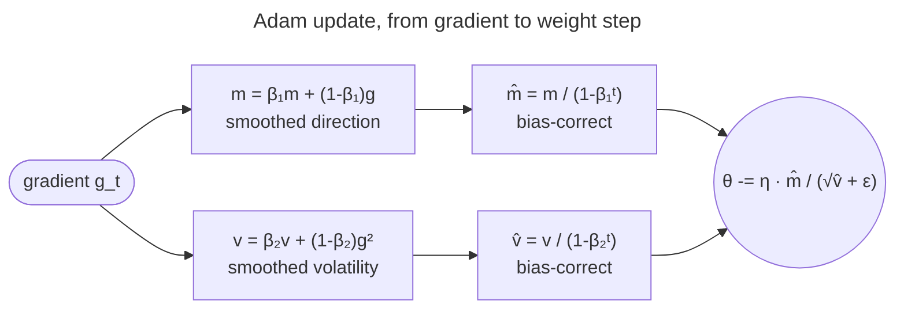

# Adam and AdamW: both ideas at once, then weight decay done right

Adam combines the two previous pages — [momentum](/ai-ml/ai-ml-learning-resources/deep-learning/optimization-and-training/optimizers/momentum-and-nesterov) for direction, [adaptive rates](/ai-ml/ai-ml-learning-resources/deep-learning/optimization-and-training/optimizers/adaptive-learning-rates) for size — and AdamW fixes how it regularizes.

The pictures before the algebra are the [Adam intuition](/ai-ml/ai-ml-intuitions/learning-and-optimization/adaptive-optimization/adam-intuition) and the [AdamW intuition](/ai-ml/ai-ml-intuitions/learning-and-optimization/adaptive-optimization/adamw-intuition).

## Adam, derived fully

**Adam** (Kingma & Ba 2015) — "adaptive moment estimation" — is just **momentum + RMSprop** (root-mean-square propagation), made rigorous with a bias correction. It maintains *two* exponential moving averages (EMAs) per parameter:

- the first moment (mean of gradients = smoothed *direction*, the momentum part);
- the second moment (mean of squared gradients = *volatility*, the RMSprop part).

$$m_t = \beta_1 m_{t-1} + (1-\beta_1) g_t \quad\text{(1st moment, direction)}$$
$$v_t = \beta_2 v_{t-1} + (1-\beta_2) g_t^2 \quad\text{(2nd moment, volatility)}$$

with $m_0=v_0=0$ and defaults $\beta_1=0.9,\ \beta_2=0.999$.

**The bias-correction problem — derive *why* it's needed.** Both EMAs start at **zero**, which biases the early estimates *toward zero*. Make this exact. Unroll the second-moment EMA:

$$v_t = (1-\beta_2)\sum_{\tau=1}^{t} \beta_2^{\,t-\tau}\, g_\tau^2.$$

Take expectations, assuming the true second moment $\mathbb{E}[g_\tau^2]\approx \mathbb{E}[g^2]$ is roughly stationary over the window, so it pulls out of the sum:

$$\mathbb{E}[v_t] = (1-\beta_2)\,\mathbb{E}[g^2]\sum_{\tau=1}^{t}\beta_2^{\,t-\tau} = \mathbb{E}[g^2]\,(1-\beta_2)\cdot\frac{1-\beta_2^{\,t}}{1-\beta_2} = \mathbb{E}[g^2]\,\big(1-\beta_2^{\,t}\big),$$

using the finite geometric series $\sum_{k=0}^{t-1}\beta_2^k = \frac{1-\beta_2^{\,t}}{1-\beta_2}$.

- So $\mathbb{E}[v_t]$ is **too small by exactly the factor $(1-\beta_2^{\,t})$**.
- On early steps that factor is tiny (at $t=1$, $1-\beta_2 = 0.001$, so $v_1$ underestimates by **1000×**).
- The identical algebra gives $\mathbb{E}[m_t] = (1-\beta_1^{\,t})\,\mathbb{E}[g]$.

**The fix is to divide out that factor** — the bias correction:

$$\hat m_t = \frac{m_t}{1-\beta_1^{\,t}}, \qquad \hat v_t = \frac{v_t}{1-\beta_2^{\,t}}, \qquad \boxed{\;\theta_t = \theta_{t-1} - \eta\,\frac{\hat m_t}{\sqrt{\hat v_t}+\epsilon}\;}$$

After dividing, $\mathbb{E}[\hat m_t]=\mathbb{E}[g]$ and $\mathbb{E}[\hat v_t]=\mathbb{E}[g^2]$ — *unbiased*.

- As $t\to\infty$ the factor $\to1$ and the correction vanishes.
- It matters **only at the start**, where it matters enormously.


**Why skipping it is catastrophic.** Without correction, step 1 is a huge, destabilizing jump exactly when the model is most fragile.

- The *uncorrected* $v_1=(1-\beta_2)g_1^2 = 0.001\,g_1^2$ is a thousand times too small.
- So $\sqrt{v_1}\approx 0.0316\,|g_1|$ is ~30× too small, and the step $\eta\,m_1/\sqrt{v_1}$ is ~30× too big.
- The correction also makes the *first* step interpretable: $\hat m_1 = m_1/(1-\beta_1)=(1-\beta_1)g_1/(1-\beta_1)=g_1$ and likewise $\hat v_1=g_1^2$.
- So step 1 is just $-\eta\,g_1/(|g_1|+\epsilon)\approx -\eta\,\operatorname{sign}(g_1)$ — a clean unit-scaled step. (The code below prints exactly this.)



The whole update reads as **direction ÷ volatility**: $\hat m$ is *where to go*, $\sqrt{\hat v}$ is *how unreliable that direction has been*.

- A parameter whose gradient is steady gets $\hat m/\sqrt{\hat v}\approx \pm1$ — a full, confident step.
- A parameter whose gradient thrashes has large $\hat v$ and gets throttled.
- That self-normalization is why Adam is so **forgiving about the global learning rate** — each parameter's step is already rescaled to roughly unit size before $\eta$ multiplies it.

**Scale-invariance — derive it.** Suppose you rescale a parameter's gradient by any constant $c$ (say its loss term is weighted $c\times$ heavier). Then $m_t\to c\,m_t$ and $v_t\to c^2 v_t$, so the *ratio* is

$$\frac{\hat m_t}{\sqrt{\hat v_t}} \;\to\; \frac{c\,\hat m_t}{\sqrt{c^2\,\hat v_t}} = \frac{c\,\hat m_t}{|c|\sqrt{\hat v_t}} = \frac{\hat m_t}{\sqrt{\hat v_t}}$$

— **unchanged.** Adam's step magnitude is invariant to any constant rescaling of the gradient (and approximately to the loss scale).

- This is why it copes with transformers' wildly different per-tensor gradient scales: a layer whose gradients are 100× larger doesn't get a 100× bigger step, because the $\sqrt{\hat v}$ in the denominator divides it back out.
- Plain stochastic gradient descent (SGD) has no such invariance — rescale a gradient and its step scales right along with it.
- That is why SGD needs careful per-layer tuning (or normalization) where Adam just works.

> [!NOTE]
> **One optimizer, all three problems.** The "$\sqrt{\hat v}$" is per-parameter, so Adam effectively gives the steep ravine axis a small rate and the shallow axis a large one *automatically*.
> - It solves the conditioning problem without you ever computing a Hessian.
> - The momentum $\hat m$ simultaneously handles the noise and saddles.
>
> **But not guaranteed to converge.** Adam can still fail on some problems.
> - Reddi et al. (2018) built convex cases where the EMA of $v$ "forgets" a rare but informative large gradient and the step *grows* when it should shrink, causing divergence.
> - **AMSGrad** patches this by using the running **max** of $\hat v$ (instead of the current $\hat v$), forcing a non-increasing per-parameter step.
> - Plain Adam/AdamW is fine in practice, but naming AMSGrad and *why* it exists is interview gold.

---

## AdamW: why L2 ≠ weight decay for adaptive optimizers (derived)

This is the single most important refinement on top of Adam, and the reason **AdamW** — not Adam — is the default for transformers and large language models (LLMs). The subtlety: two things people treat as identical, **L2 regularization** and **weight decay**, are *not* the same once the optimizer is adaptive.

**They're identical for plain SGD.** L2 regularization adds $\tfrac{\lambda}{2}\lVert\theta\rVert^2$ to the loss, so the gradient gains a $\lambda\theta$ term: $\nabla(L + \tfrac\lambda2\lVert\theta\rVert^2)=g+\lambda\theta$. Plug into the SGD update:

$$\theta \leftarrow \theta - \eta(g+\lambda\theta) = (1-\eta\lambda)\,\theta - \eta g.$$

That $(1-\eta\lambda)\theta$ is *literally* "shrink every weight by a constant factor each step" — i.e. weight decay. For SGD, **L2 and weight decay are the same operation.**

**They diverge for Adam.** With Adam, the L2 term rides *inside* the gradient, so it flows *through the adaptive denominator*. The gradient becomes $g+\lambda\theta$, and the update divides the *whole thing* by $\sqrt{\hat v}$:

$$\theta_t \leftarrow \theta_{t-1} - \eta\,\frac{\widehat{(g+\lambda\theta)}}{\sqrt{\hat v_t}+\epsilon}.$$

Now the decay a weight receives is $\propto \lambda\theta/\sqrt{\hat v}$ — **inversely scaled by its gradient history.**

- A parameter with *large* gradients (big $\hat v$) gets its decay *divided down* — it is **under-regularized**, exactly the high-gradient weights you'd most want to keep in check.
- The intended uniform shrinkage is corrupted by the per-parameter scaling.

**AdamW's fix (Loshchilov & Hutter 2017/2019): decouple the decay** — apply it straight to the weights, *outside* the adaptive term:

$$\boxed{\;\theta_t \leftarrow \theta_{t-1} - \eta\left(\frac{\hat m_t}{\sqrt{\hat v_t}+\epsilon} + \lambda\,\theta_{t-1}\right)\;}$$

Now **every** weight is decayed by the same factor $\eta\lambda$ regardless of its gradient size, while the *gradient* still gets the adaptive treatment. What the decoupling buys:

- It **measurably improves generalization**.
- The best $\lambda$ **no longer moves with the learning rate**, so the two are tuned independently.
- It is why AdamW is the default for transformers, LLMs, and diffusion models.

> [!WARNING]
> Because of this, the `weight_decay` argument means *different things* in two optimizers.
> - In `torch.optim.Adam` it is the broken coupled L2 — `weight_decay` is added to the gradient.
> - In `torch.optim.AdamW` it is the decoupled decay.
> - If you copy a `weight_decay` value from an SGD recipe into `Adam`, you are not getting the regularization you think you are.
> - For transformers, **use `AdamW`.**

> [!TIP]
> **Don't decay everything.**
> - Bias terms and LayerNorm/RMSNorm gains are typically *excluded* from weight decay (decaying a normalization scale toward 0 just fights the norm).
> - Most LLM training scripts build two parameter groups — "decay" (weight matrices) and "no-decay" (biases + norm params) — and pass `weight_decay=0` to the second.

---

## Worked example: Adam's m, v and bias correction for the first three steps

Single parameter, constant gradient $g=0.1$ every step, $\beta_1=0.9,\ \beta_2=0.999,\ \eta=0.001,\ \epsilon=10^{-8}$. Trace the EMAs and corrections.

| $t$ | $m_t=0.9m+0.1g$ | $v_t=0.999v+0.001g^2$ | $\hat m_t=m/(1-0.9^t)$ | $\hat v_t=v/(1-0.999^t)$ | step $=\eta\,\hat m/(\sqrt{\hat v}+\epsilon)$ |
|---|---|---|---|---|---|
| 1 | $0.0100$ | $1.00\times10^{-5}$ | $0.1000$ | $0.0100$ | $0.001\cdot0.1/0.1 = 1.00\times10^{-3}$ |
| 2 | $0.0190$ | $2.00\times10^{-5}$ | $0.1000$ | $0.0100$ | $1.00\times10^{-3}$ |
| 3 | $0.0271$ | $3.00\times10^{-5}$ | $0.1000$ | $0.0100$ | $1.00\times10^{-3}$ |

Two things to see.

- **Bias correction works.** The *raw* $m_1=0.01$ is 10× too small, but $\hat m_1 = 0.01/(1-0.9)=0.1$ recovers the true gradient exactly; the raw $v_1=10^{-5}$ is 1000× too small, but $\hat v_1=10^{-5}/(1-0.999)=0.01=g^2$ is spot on.
- **Constant gradient, constant step.** The bias-corrected ratio $\hat m/\sqrt{\hat v}=0.1/0.1=1$ every step, so each step is exactly $\eta=10^{-3}$.
- **Adam takes a unit-scaled step regardless of the gradient's magnitude.** That scale-invariance is its signature.

---

## Code: the update rules, and Adam matching PyTorch

From-scratch SGD/Momentum/AdaGrad/Adam, with the from-scratch Adam verified against `torch.optim.Adam` step for step, plus the hand-traced Adam numbers above and the AdaGrad table from [Adaptive Learning Rates](/ai-ml/ai-ml-learning-resources/deep-learning/optimization-and-training/optimizers/adaptive-learning-rates). Runs on CPU in about a second.

```step
///FILE optimizers_from_scratch.py
"""From-scratch SGD / Momentum / AdaGrad / Adam; Adam checked against
torch.optim.Adam, plus the hand-traced Adam and AdaGrad numbers.
Verified on Python 3.12 (torch 2.x), CPU."""
import torch
torch.manual_seed(0)

def sgd(w, g, st, lr=0.1):                       # plain gradient step
    return w - lr * g

def momentum(w, g, st, lr=0.1, beta=0.9):        # velocity accumulates -> inertia
    st["v"] = beta * st.get("v", torch.zeros_like(g)) + g
    return w - lr * st["v"]

def adagrad(w, g, st, lr=0.1, eps=1e-8):         # running SUM of g^2 -> rate decays
    st["G"] = st.get("G", torch.zeros_like(g)) + g * g
    return w - lr * g / (st["G"].sqrt() + eps)

def adam(w, g, st, lr=0.1, b1=0.9, b2=0.999, eps=1e-8):
    st["t"] = st.get("t", 0) + 1
    st["m"] = b1 * st.get("m", torch.zeros_like(g)) + (1 - b1) * g        # 1st moment (direction)
    st["v"] = b2 * st.get("v", torch.zeros_like(g)) + (1 - b2) * g * g    # 2nd moment (volatility)
    mhat = st["m"] / (1 - b1 ** st["t"])         # bias correction (crucial on early steps)
    vhat = st["v"] / (1 - b2 ** st["t"])
    return w - lr * mhat / (vhat.sqrt() + eps)   # per-parameter step: direction / sqrt(volatility)

# --- bias correction in action: on step 1 it recovers the true gradient ---
st = {}; g1 = torch.tensor([4.0])
_ = adam(torch.zeros(1), g1, st)
print("Adam step 1 - m raw:", round(st["m"].item(), 3),
      "| m_hat (bias-corrected):", round((st["m"] / (1 - 0.9)).item(), 3), "= true gradient 4.0")

# --- the worked example above: Adam's m, v, m_hat, v_hat for g=0.1, first 3 steps ---
st = {}; g = torch.tensor([0.1])
print("\nAdam trace (g=0.1 constant):  t |   m_t   |   v_t    |  m_hat | v_hat")
for t in range(1, 4):
    _ = adam(torch.zeros(1), g, st, lr=1e-3)
    mh = st["m"] / (1 - 0.9 ** t); vh = st["v"] / (1 - 0.999 ** t)
    print(f"   {t} | {st['m'].item():.4f} | {st['v'].item():.2e} | {mh.item():.4f} | {vh.item():.4f}")

# --- the AdaGrad table (adaptive learning rates): effective LR shrinking like 1/sqrt(t) ---
st = {}; g = torch.tensor([0.1]); print("\nAdaGrad effective LR (g=0.1, eta=0.1):")
for t in range(1, 401):
    _ = adagrad(torch.zeros(1), g, st, lr=0.1)
    if t in (1, 4, 25, 100, 400):
        print(f"   t={t:3d}  G={st['G'].item():.3f}  effLR={0.1 / (st['G'].sqrt().item()):.4f}")

# --- verify our Adam matches torch.optim.Adam, step for step ---
A = torch.tensor([6.0, 1.0])
def f(w): return 0.5 * (A * w ** 2).sum()
w_ref = torch.tensor([-9.0, -4.5], requires_grad=True)
opt = torch.optim.Adam([w_ref], lr=0.1, betas=(0.9, 0.999), eps=1e-8)
w_ours = torch.tensor([-9.0, -4.5]); st = {}
for _ in range(30):
    opt.zero_grad(); f(w_ref).backward(); opt.step()       # torch
    w_ours = adam(w_ours, A * w_ours, st)                  # ours (grad of f is A*w)
print("\nour Adam matches torch:", torch.allclose(w_ours, w_ref.detach(), atol=1e-5),
      "| max diff:", f"{(w_ours - w_ref.detach()).abs().max():.2e}")
```

Output:

```text
Adam step 1 - m raw: 0.4 | m_hat (bias-corrected): 4.0 = true gradient 4.0

Adam trace (g=0.1 constant):  t |   m_t   |   v_t    |  m_hat | v_hat
   1 | 0.0100 | 1.00e-05 | 0.1000 | 0.0100
   2 | 0.0190 | 2.00e-05 | 0.1000 | 0.0100
   3 | 0.0271 | 3.00e-05 | 0.1000 | 0.0100

AdaGrad effective LR (g=0.1, eta=0.1):
   t=  1  G=0.010  effLR=1.0000
   t=  4  G=0.040  effLR=0.5000
   t= 25  G=0.250  effLR=0.2000
   t=100  G=1.000  effLR=0.1000
   t=400  G=4.000  effLR=0.0500

our Adam matches torch: True | max diff: 4.77e-07
```

> [!NOTE]
> Every worked-example number above is reproduced by code.
> - The first line *is* bias correction (raw $m_1=0.4$ biased toward 0, $\hat m_1=4.0$ recovers the true gradient).
> - The Adam trace matches the worked example row-for-row, and the AdaGrad table matches the adaptive-learning-rates page's $1/\sqrt t$ decay exactly.
> - The final line confirms these ~12 lines reproduce PyTorch's Adam to $\sim10^{-6}$.

> [!TIP]
> To feel the real thing at scale, train any model with `torch.optim.SGD` vs `torch.optim.AdamW` on the *same* schedule.
> - Watch how much less the AdamW run cares about the exact learning rate.
> - That robustness, not a single loss number, is the practical reason it's the default.

---

## References

Shared with the topic's companion file — see [Optimizers — references and further reading](/ai-ml/ai-ml-learning-resources/deep-learning/optimization-and-training/optimizers/optimizers#references-further-reading).
