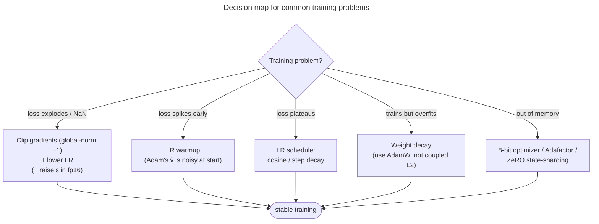

# Choosing an optimizer: from the default to a stable run

This page turns the course into decisions: which optimizer, which knobs, and what to check when training misbehaves.

## Where each optimizer is used

- **[AdamW](/ai-ml/ai-ml-learning-resources/deep-learning/optimization-and-training/optimizers/adam-and-adamw)** — the default for **transformers, large language models (LLMs), and diffusion models**. Heterogeneous/sparse gradients and huge parameter counts are its sweet spot, and its robustness de-risks expensive runs.
- **Stochastic gradient descent (SGD) + [momentum / Nesterov](/ai-ml/ai-ml-learning-resources/deep-learning/optimization-and-training/optimizers/momentum-and-nesterov)** — still standard for **convolutional networks (CNNs) and vision** (ResNets), where a tuned SGD generalizes better.
- **[Adafactor / 8-bit Adam](/ai-ml/ai-ml-learning-resources/deep-learning/optimization-and-training/optimizers/beyond-adam) / ZeRO** (the Zero Redundancy Optimizer) — when **optimizer-state memory** is the binding constraint (huge models, limited GPU memory).
- **[Lion](/ai-ml/ai-ml-learning-resources/deep-learning/optimization-and-training/optimizers/beyond-adam)** — when you want Adam-like results at half the optimizer memory and are willing to retune.
- **L-BFGS** (limited-memory Broyden–Fletcher–Goldfarb–Shanno) — small, full-batch, low-noise problems (classical machine learning, some physics-informed nets), almost never deep nets.

---

## Optimizer-state memory: the load-bearing fact for LLM training

A point worth its own section because it dominates LLM-training cost. Adam/AdamW stores **two extra full-precision states per parameter** — $m$ and $v$ — on top of the weights and gradients.

In mixed-precision training — 16-bit floating point (FP16) for compute, 32-bit (FP32) where precision matters — the standard accounting per parameter is roughly:

- FP16 weights: 2 bytes, plus an FP32 master copy: 4 bytes,
- FP32 gradient: 4 bytes,
- Adam $m$ (FP32): 4 bytes, Adam $v$ (FP32): 4 bytes.

That's **~16–18 bytes per parameter** before activations — and the **optimizer states alone are 8 of those bytes, twice the size of the FP16 weights.**

- For a 7B model the Adam states are $\sim 7\text{B}\times 8 \approx 56$ GB on their own.
- This is *the* reason full fine-tuning is so expensive.
- It is the direct motivation for **8-bit Adam, Adafactor, ZeRO state-sharding**, and parameter-efficient methods.

> [!TIP]
> This is exactly why [low-rank adaptation and parameter-efficient fine-tuning (LoRA, PEFT)](/ai-ml/ai-ml-learning-resources/model-adaptation/lora-and-parameter-efficient-fine-tuning/lora-and-parameter-efficient-fine-tuning) save so much memory.
> - By training only a few million low-rank adapter parameters instead of all 7B, you only pay Adam's $2\times$ state overhead on the *adapters*.
> - That shrinks optimizer memory from tens of GB to a fraction of a GB.
> - The optimizer-state cost is the bridge between "optimizers" and "why PEFT exists." 

---

## Application: choosing and configuring an optimizer

**Pick it.** Transformer / LLM / diffusion → **AdamW**. CNN/vision tuned for best test accuracy → **SGD + Nesterov momentum**. Memory-bound huge model → **Adafactor / 8-bit Adam**. Prototyping anything → AdamW (robust by default).

**Set the knobs.** AdamW defaults are stable:

- $\beta_1=0.9$, $\beta_2=0.999$ (drop $\beta_2$ to $0.95$ for large LLMs, which makes $v$ more responsive to recent gradient scale).
- $\epsilon=10^{-8}$ (raise to $10^{-6}$ in mixed precision).
- Weight decay $0.01$–$0.1$ (excluding biases and norm params).
- The **one** knob you must always tune is the **learning rate**.

**Pair it with a schedule and guards.** Warmup + cosine decay, gradient clipping at global-norm $\sim1.0$, and the batch-size↔learning-rate (LR) linear-scaling rule. The decision map when training misbehaves:

> [!WARNING]
> In mixed-precision (FP16) training, the default $\epsilon=10^{-8}$ can **underflow** inside $\sqrt{\hat v}+\epsilon$ when $\hat v$ is tiny, making the denominator collapse and the step explode.
> - If FP16 diverges early while FP32 is fine, **raise $\epsilon$** (to $10^{-6}$) before suspecting anything else.
> - BF16 (bfloat16), with its larger exponent range, mostly sidesteps this.

---

## The guards around the optimizer: clipping, schedules, batch size

Three neighbours of the optimizer have their own pages; this is what the recipe takes from each:

- **Gradient clipping** caps the **global** gradient norm (about 1.0 for LLMs) after backprop and before `optimizer.step()`, so one unlucky batch cannot blow the weights to `NaN`.
  - Global-norm versus by-value clipping, and why, is on [Vanishing & Exploding Gradients](/ai-ml/ai-ml-learning-resources/deep-learning/optimization-and-training/vanishing-exploding-gradients/vanishing-exploding-gradients).
- **The learning-rate schedule** moves the global $\eta$ over training: **warmup, then decay**, because Adam's $\hat v$ is unreliable in the first steps.
  - The decays, warmup length and the **linear scaling rule** that ties $\eta$ to batch size (justified by the [$1/B$ noise law](/ai-ml/ai-ml-learning-resources/deep-learning/optimization-and-training/optimizers/optimizers)) are on [Learning-Rate Schedules & Warmup](/ai-ml/ai-ml-learning-resources/deep-learning/optimization-and-training/learning-rate-schedules-and-warmup/learning-rate-schedules-and-warmup).
- **Gradient accumulation** sums gradients over micro-batches to fake a larger batch on a small GPU — see [Pretraining: batching, precision and memory](/ai-ml/ai-ml-learning-resources/model-building/pretraining/pretraining-batching-precision-and-memory).

---

## Recap and rapid-fire

**If you remember nothing else:** the optimizer turns a noisy mini-batch gradient into a good weight step against an ill-conditioned, non-convex surface.

- **SGD** steps downhill (noise $\propto 1/B$).
- **Momentum/Nesterov** add a velocity that averages noise, coasts through saddles, and accelerates the valley ($\sim\!1/(1-\beta)$ amplification).
- **AdaGrad** gives per-parameter rates but starves (sum of $g^2$), and **RMSprop** fixes that with an EMA.
- **Adam** = momentum + RMSprop + bias correction, and **AdamW** decouples weight decay and is the transformer/LLM default.
- Pair it with **warmup + decay** and **gradient clipping**.
- Adam's real edge is **robustness**, not raw speed — and its $1/\sqrt{\hat v}$ is a cheap diagonal stand-in for the Hessian we can't afford.

**Quick-fire — say these out loud:**

- *SGD update?* $\theta \leftarrow \theta - \eta g$, with $g$ a mini-batch estimate whose variance $\propto 1/B$.
- *Why can mini-batch noise *help*?* It rattles the iterate off saddles and out of sharp minima, biasing toward flatter, better-generalizing solutions.
- *Momentum update + effective step?* $v=\beta v+g,\ \theta-=\eta v$; effective step $\approx \eta/(1-\beta)\approx10\eta$ at $\beta=0.9$.
- *Nesterov vs momentum?* Nesterov evaluates the gradient at the *look-ahead* point $\theta-\eta\beta v$ — it starts braking a step early, so it overshoots less.
- *AdaGrad vs RMSprop?* AdaGrad sums all past $g^2$ (rate decays to 0 — the death problem); RMSprop uses an EMA (rate stays alive).
- *Adam's m and v?* $m$ = EMA of $g$ (direction); $v$ = EMA of $g^2$ (per-parameter volatility); update $\approx$ direction $\div$ volatility.
- *Why bias-correct, exactly?* $m,v$ start at 0 so $\mathbb{E}[v_t]=(1-\beta_2^t)\mathbb{E}[g^2]$ is too small early; dividing by $(1-\beta^t)$ unbiases it and prevents a huge first step.
- *Weight decay vs L2?* Identical for SGD; in Adam, L2 flows through $1/\sqrt{\hat v}$ so high-gradient weights get under-decayed — AdamW decouples the decay (better generalization, the LLM default).
- *Gradient clipping?* Cap the **global** gradient norm ($\sim1.0$) to stop exploding-gradient `NaN`s — keeps direction, caps magnitude.
- *Batch size ↔ LR?* Linear scaling rule: $\times k$ batch → $\times k$ LR (with warmup), justified by the $1/B$ noise law.
- *Adam's memory cost?* Two extra states per parameter (~$2\times$ the FP16 weights, ~56 GB for a 7B model) — the reason for 8-bit Adam, Adafactor, ZeRO, and a big motivation for LoRA/PEFT.
- *Why no second-order for deep nets?* The Hessian is $O(n^2)$ to store / $O(n^3)$ to invert; Adam's $1/\sqrt{\hat v}$ is a cheap diagonal approximation; K-FAC/Shampoo/Sophia buy back more curvature at more cost.
- *SGD vs Adam generalization?* Tuned SGD+momentum often generalizes better (vision); Adam/AdamW trains faster, tolerates the LR, and is essential for transformers/LLMs.

---

## References

Shared with the topic's companion file — see [Optimizers — references and further reading](/ai-ml/ai-ml-learning-resources/deep-learning/optimization-and-training/optimizers/optimizers#references-further-reading).
