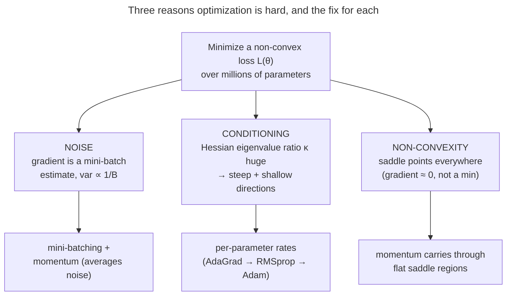
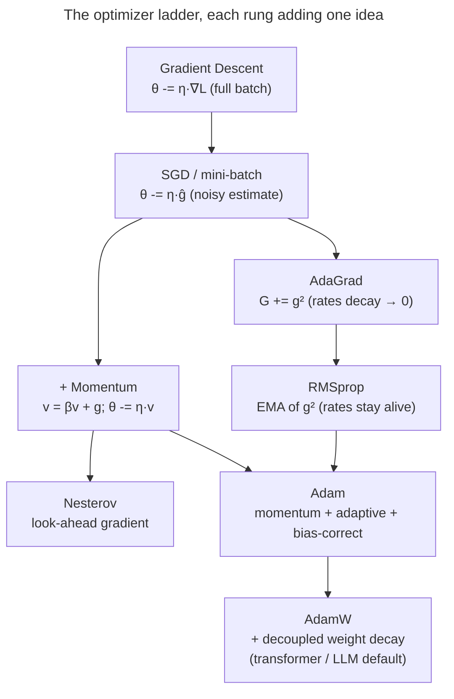

# Optimizers: turning gradients into good weight updates

[Backprop](/ai-ml/ai-ml-learning-resources/deep-learning/neural-network-foundations/backpropagation-and-computational-graphs/backpropagation-and-computational-graphs) hands you a **gradient** — the direction of steepest *increase* in the loss. The obvious move is to step the opposite way.

But *"step how far, in which combined direction, and at what rate for each of a billion parameters whose gradients you only know approximately?"* is where naive gradient descent falls apart. That is where the **optimizer** earns its keep.

- **What it is:** the rule that turns the raw gradient into the actual weight change.
- **What it decides:** a model that converges in hours versus one that oscillates forever, blows up to `NaN`, or crawls so slowly it never finishes.
- **Why it matters:** on modern transformers, the choice of optimizer (Adam vs SGD), and one or two of its knobs, is among the highest-leverage decisions in the whole training recipe.

I'm going to walk this the way I'd actually teach it to a teammate who can already differentiate a loss but keeps reaching for `torch.optim.Adam` without knowing *why* it works.

- **Start:** the **problem** — minimizing a high-dimensional, non-convex loss from *noisy* gradient estimates over an *ill-conditioned* surface.
- **Then:** build the optimizer ladder one rung at a time, **deriving every rule from the rung below it**, never just stating a formula.

By the end you'll be able to:

- explain the **three things that make the optimization hard** — noise, conditioning, and non-convexity — and how each optimizer idea attacks one of them;
- **derive** the full-batch → stochastic → mini-batch progression, including *why the gradient-noise variance scales like* $1/B$;
- **derive momentum** as an exponential moving average (EMA) of gradients, show it's a low-pass filter, and prove its effective step is $\approx \eta/(1-\beta)$;
- **derive Nesterov's lookahead**, **AdaGrad**, and **RMSprop**, and explain AdaGrad's "death" problem and RMSprop's fix;
- **derive Adam fully** — both moments, *and the bias correction* (with the algebra showing **why** the zero-initialized EMA is biased);
- **derive why L2 ≠ weight decay for adaptive optimizers**, and how **AdamW** fixes it;
- place **second-order** methods (Newton, K-FAC, Shampoo, Sophia) and explain why the exact Hessian is hopeless at scale;
- reason about the **SGD-vs-Adam generalization** debate, **gradient clipping**, and the **hyperparameter defaults** — and back all of it with **worked numbers** and **measured plots**.

Intuition first (a ball rolling downhill), then the rules in full, then code that reproduces PyTorch's Adam to $10^{-6}$.

> [!NOTE]
> Keep two ideas strictly separate.
> - **Gradient descent** is the *strategy* — move against the gradient.
> - The **optimizer** is the *specific update rule* implementing it: how it uses the current gradient *plus a memory of past gradients and their sizes* to decide each step.
>
> Every optimizer in this course is "gradient descent"; they differ only in how cleverly they use that memory.

---

## The problem: a hard optimization, not a clean one

If loss surfaces were nice — convex, well-scaled, and if we could compute the *exact* gradient — plain gradient descent with a single well-chosen learning rate would be all you ever needed, and this page would be one line.

Real deep-learning optimization is hard for **three** compounding reasons, and the entire optimizer family is a sequence of fixes for them.

**1. The gradient is noisy.** We never compute the true loss gradient — that would need a forward/backward pass over the *entire* dataset for *every* step.

- We estimate it on a small random **mini-batch**: unbiased but *noisy*, pointing roughly downhill and jittering from batch to batch.
- Too much noise and the step is unreliable; too little and each step is ruinously expensive.
- (We make the $1/B$ noise scaling precise below.)

**2. The surface is ill-conditioned.** Deep loss surfaces are wildly anisotropic — far steeper in some parameter directions than others.

- Locally the loss looks like a quadratic bowl $L(\theta)\approx \tfrac12 (\theta-\theta^\star)^\top H (\theta-\theta^\star)$, and the **eigenvalues of the Hessian** $H$ are the curvatures along its principal axes.
- Their ratio — the **condition number** $\kappa = \lambda_{\max}/\lambda_{\min}$ — can be in the thousands.
- A single global step size cannot serve a direction with curvature 1000 and another with curvature 1 at the same time.
- This is the **ravine** problem, and it is the central villain of this whole page.

**3. The surface is non-convex and high-dimensional.** With millions to billions of parameters, the surface is riddled not with bad *local minima* (rare and usually fine) but with **saddle points**.

- A saddle is flat in some directions and curved in others; the gradient nearly vanishes and naive gradient descent (GD) stalls.
- High dimension makes saddles overwhelmingly more common than minima.

*Why saddles dominate (the intuition).* At any critical point (gradient zero) the Hessian's eigenvalues tell you the shape.

- A **minimum** needs *all* $n$ eigenvalues positive (curving up in every direction); a **saddle** needs at least one negative.
- Imagine each eigenvalue's sign as a coin flip: the chance that *all* $n$ come up "positive" is vanishingly small for large $n$. So critical points are almost always saddles, and true minima are exponentially rare.
- This is *good* news: deep nets rarely get trapped in bad local minima. The real obstacle is the *plateaus* around saddles, where the gradient is tiny and plain GD inches along.
- **Momentum is the cure** — it carries velocity straight through a flat saddle region where a memoryless step would stall.



> [!NOTE]
> The three problems map almost one-to-one onto the three big optimizer ideas.
> - **Momentum** averages away noise *and* coasts through saddles.
> - **Adaptive per-parameter rates** (AdaGrad/RMSprop) attack conditioning.
> - **Adam** is just both at once.
>
> Hold this map in your head and the rest of the page is filling in the algebra.

---

## From full-batch GD to mini-batch SGD (derived)

Start with the cleanest possible rule and add reality.

**Full-batch gradient descent.** Define the loss as an average over the whole dataset of $N$ examples, $L(\theta)=\tfrac1N\sum_{i=1}^N \ell_i(\theta)$. The exact gradient is $g=\nabla_\theta L=\tfrac1N\sum_i \nabla_\theta \ell_i$, and the update is

$$\theta_{t+1} = \theta_t - \eta\, g_t.$$

This is the "true" steepest-descent step, but computing $g$ needs a pass over *all* $N$ examples for *one* update. On a dataset of millions, that is one tiny step per epoch — hopelessly slow.

**Stochastic gradient descent (SGD).** Go to the other extreme: estimate the gradient from a **single** random example $i$,

$$\hat g_t = \nabla_\theta \ell_i(\theta_t), \qquad \mathbb{E}_i[\hat g_t] = g_t.$$

The estimate is *unbiased* (its average over the random draw equals the true gradient) but high-variance. You get an update *per example* — thousands of cheap, noisy steps where full-batch took one expensive clean one.

**Mini-batch SGD (the practical middle).** Average the gradient over a random batch $\mathcal{B}$ of $B$ examples:

$$\hat g_t = \frac1B\sum_{i\in\mathcal{B}} \nabla_\theta \ell_i(\theta_t).$$

Now *derive the variance*. Treat the per-example gradients as i.i.d. draws with true mean $g$ and per-coordinate variance $\sigma^2$. The batch estimate is their sample mean, so by the standard variance-of-a-mean result,

$$\operatorname{Var}[\hat g_t] = \operatorname{Var}\!\left[\frac1B\sum_{i\in\mathcal{B}}\nabla\ell_i\right] = \frac{1}{B^2}\sum_{i\in\mathcal{B}}\operatorname{Var}[\nabla\ell_i] = \frac{\sigma^2}{B}.$$

So **the gradient-noise variance falls like $1/B$** — and the noise *standard deviation* like $1/\sqrt B$. That single fact governs the speed/noise trade-off:

- **Small $B$** → cheap steps, but noisy: more updates per second, each less reliable.
- **Large $B$** → expensive steps, but accurate: fewer, cleaner updates (and to *halve* the noise you must *quadruple* the batch — diminishing returns).

> [!NOTE]
> The $1/\sqrt B$ noise-vs-$1/B$ variance distinction is interview gold.
> - Doubling the batch only cuts the gradient *noise* (std-dev) by $\sqrt2\approx1.41$, not by 2.
> - That sub-linear payoff is exactly why there is a "critical batch size" beyond which bigger batches buy almost nothing.
> - It's also the quantitative backbone of the **linear-scaling rule** for batch size and learning rate ([Learning-Rate Schedules & Warmup](/ai-ml/ai-ml-learning-resources/deep-learning/optimization-and-training/learning-rate-schedules-and-warmup/learning-rate-schedules-and-warmup)).

> [!TIP]
> The noise isn't purely a cost — it's a *feature*.
> - The jitter lets SGD **rattle off saddle points and out of sharp, narrow minima** that full-batch GD would get stuck in or settle into.
> - A growing body of work argues this noise is part of *why* SGD-trained nets generalize well: it biases training toward flat, wide minima. Full-batch GD on the same net often generalizes *worse*.
> - So we don't just tolerate the noise — within reason, we *want* it.

> [!WARNING]
> "SGD" in a modern paper or a `torch.optim.SGD` call almost always means **mini-batch** SGD (usually with momentum), not the literal one-example version.
> - The pure single-example algorithm is mostly a teaching device.
> - When you read "we trained with SGD," read "mini-batch SGD + momentum."

---

## The conditioning problem: a ravine (the central villain)

Plain gradient descent uses one global learning rate $\eta$ for *every* parameter: $\theta \leftarrow \theta - \eta g$. Watch it fail on the simplest hard surface — a 2-D quadratic that is steep in one direction and shallow in the other.

Take $L(\theta)=\tfrac12(a\,x^2 + b\,y^2)$ with $a\gg b$ (say $a=12$, $b=1$, so $\kappa=12$). The gradient is $g=(a x,\, b y)$, so each axis evolves *independently*:

$$x_{t+1} = x_t - \eta\,a\,x_t = (1-\eta a)\,x_t, \qquad y_{t+1} = (1-\eta b)\,y_t.$$

Each coordinate is a geometric sequence. It **converges only if** $|1-\eta\lambda|<1$, i.e. $0<\eta<2/\lambda$. The catch: *both* axes share the *same* $\eta$.

- To stay **stable in the steep direction** you need $\eta < 2/a$. Push $\eta$ above that and $|1-\eta a|>1$: the steep coordinate's sign flips and grows every step — the classic **zig-zag that diverges**.
- But that same small $\eta$ makes the **shallow direction** crawl, since $1-\eta b$ is barely below 1, so $y$ shrinks by a tiny fraction each step.

The number that governs everything is the eigenvalue ratio $\kappa = a/b$. The best convergence rate plain GD can achieve on this surface is $\frac{\kappa-1}{\kappa+1}$ per step — so large $\kappa$ means glacial progress. **This is the ravine: oscillate across the steep walls while inching along the valley floor.**


> [!TIP]
> "Why not just lower the learning rate?" is a trap an interviewer will set.
> - Lowering $\eta$ *does* cure the steep-direction zig-zag — but it makes the already-glacial shallow direction *hopeless*.
> - One knob cannot win both axes.
> - Every optimizer past plain SGD is, at heart, a way to **stop using one rate for every direction.**


---

## What it is: a short ladder

An optimizer is a pure function `(weights, gradient, state) → (new weights, new state)`. The family is a short ladder; each rung adds **exactly one idea** to the rung below:

- **SGD** — step downhill. (No state.)
- **+ [Momentum / Nesterov](/ai-ml/ai-ml-learning-resources/deep-learning/optimization-and-training/optimizers/momentum-and-nesterov)** — accumulate a *velocity* so consistent directions build speed and oscillations cancel. (State: one vector.)
- **+ [Adaptive rates (AdaGrad → RMSprop)](/ai-ml/ai-ml-learning-resources/deep-learning/optimization-and-training/optimizers/adaptive-learning-rates)** — give *each parameter its own* effective step from the size of its recent gradients. (State: one vector.)
- **[Adam](/ai-ml/ai-ml-learning-resources/deep-learning/optimization-and-training/optimizers/adam-and-adamw)** — momentum **and** per-parameter adaptive rates together, bias-corrected. (State: two vectors.)
- **[AdamW](/ai-ml/ai-ml-learning-resources/deep-learning/optimization-and-training/optimizers/adam-and-adamw)** — Adam with **decoupled weight decay**; the default for transformers, LLMs, and diffusion models.



**A 60-year provenance, in one line each** (the *where-this-came-from* notes are folded into the references):

- **1951** — Robbins & Monro formalize **stochastic approximation**, the theoretical root of SGD.
- **1964** — Polyak's **heavy-ball momentum** (the $v=\beta v+g$ above).
- **1983** — Nesterov's **accelerated gradient** (the lookahead, with the $O(1/t^2)$ rate).
- **2011** — Duchi, Hazan & Singer's **AdaGrad** (per-parameter rates from $\sum g^2$).
- **2012** — Tieleman & Hinton's **RMSprop** (EMA fix), in a Coursera lecture — never formally published.
- **2014/15** — Kingma & Ba's **Adam** (momentum + RMSprop + bias correction) — now the most-cited optimizer.
- **2017/19** — Loshchilov & Hutter's **AdamW** (decoupled weight decay), the modern transformer default.
- **2023** — search-discovered **Lion** and Hessian-light **Sophia** push at the efficiency frontier.

---

## Intuition: a ball rolling downhill

Before the algebra, hold the physical picture — every rule below is a literal upgrade to this ball.

- **SGD** is a *light, frictionless* ball with no memory. On a ravine it rolls straight into the steep wall, bounces back, and zig-zags — reacting only to the local slope, forgetting where it just came from.
- **Momentum** makes the ball *heavy*. It builds velocity coasting down the valley and **averages out** the back-and-forth across the walls, so it rolls *through* small bumps and coasts across flat saddles instead of stalling.
- **Adaptive methods** put a **governor on each wheel**. A wheel (parameter) that keeps getting huge, erratic gradients has its step *shrunk*; a wheel with small, steady gradients keeps a *full* step. Now the steep and shallow axes can each get the rate they need.
- **Adam** is the heavy ball **with** per-wheel governors — momentum for *direction*, adaptive scaling for *step size per axis*. That combination is why Adam "just works" on a fresh problem: it self-corrects for both noise and conditioning without you tuning much.

```svg
<svg viewBox="0 0 760 368" xmlns="http://www.w3.org/2000/svg" font-family="ui-sans-serif, system-ui, sans-serif" data-legend="focus: the ball — how far along the valley it has come, and how high up the steep walls it bounces">
<title>A ball rolling down the ravine: light (SGD), heavy (momentum) and governed (Adam)</title>
<desc>Side view along the ravine floor of the page's surface, curvature 12 across and 1 along, from the start (-9, -4.5). Each lane drops one ball with the race's default settings for 60 steps. Left to right is progress along the valley floor toward the minimum; height above the floor is how far up the steep walls the ball is. The light ball bounces wall to wall, the heavy ball swings through and rings, the governed ball comes down steadily.</desc>
<text x="24" y="64" font-size="13" font-weight="600" fill="currentColor">Light ball — SGD</text>
<text x="24" y="82" font-size="11" style="fill:var(--diagram-muted, #475569)">no memory: η = 0.13</text>
<polyline points="232.0,58.0 240.3,60.1 248.5,62.2 256.8,64.3 265.1,66.3 273.4,68.3 281.6,70.2 289.9,72.1 298.2,73.9 306.4,75.7 314.7,77.4 323.0,79.1 331.3,80.8 339.5,82.4 347.8,83.9 356.1,85.4 364.3,86.9 372.6,88.3 380.9,89.7 389.2,91.0 397.4,92.3 405.7,93.6 414.0,94.8 422.2,95.9 430.5,97.0 438.8,98.1 447.1,99.1 455.3,100.1 463.6,101.0 471.9,101.9 480.1,102.7 488.4,103.5 496.7,104.2 504.9,104.9 513.2,105.6 521.5,106.2 529.8,106.8 538.0,107.3 546.3,107.8 554.6,108.2 562.8,108.6 571.1,108.9 579.4,109.2 587.7,109.4 595.9,109.6 604.2,109.8 612.5,109.9 620.7,110.0 629.0,110.0 637.3,110.0 645.6,109.9 653.8,109.8 662.1,109.6 670.4,109.4 678.6,109.2 686.9,108.9 695.2,108.5 703.5,108.1 711.7,107.7 720.0,107.2" fill="none" stroke-width="2" style="stroke:var(--diagram-muted, #475569)"/>
<line x1="628.6" y1="114.0" x2="628.6" y2="122.0" stroke-width="2" style="stroke:var(--diagram-muted, #475569)"/>
<text x="628.6" y="134.0" text-anchor="middle" font-size="10" style="fill:var(--diagram-muted, #475569)">minimum</text>
<circle cx="271.7" cy="19.9" r="8" stroke-width="2" style="fill:var(--diagram-teal, #075e6b);fill-opacity:.3;stroke:var(--diagram-teal, #075e6b)"><animate attributeName="cx" dur="15s" repeatCount="indefinite" keyTimes="0.0000;0.0167;0.0333;0.0500;0.0667;0.0833;0.1000;0.1167;0.1333;0.1500;0.1667;0.1833;0.2000;0.2167;0.2333;0.2500;0.2667;0.2833;0.3000;0.3167;0.3333;0.3500;0.3667;0.3833;0.4000;0.4167;0.4333;0.4500;0.4667;0.4833;0.5000;0.5167;0.5333;0.5500;0.5667;0.5833;0.6000;0.6167;0.6333;0.6500;0.6667;0.6833;0.7000;0.7167;0.7333;0.7500;0.7667;0.7833;0.8000;0.8167;0.8333;0.8500;0.8667;0.8833;0.9000;0.9167;0.9333;0.9500;0.9667;0.9833;1.0000" values="271.7;318.1;358.4;393.5;424.1;450.7;473.8;493.9;511.4;526.7;539.9;551.4;561.5;570.2;577.8;584.4;590.1;595.1;599.5;603.3;606.5;609.4;611.9;614.1;616.0;617.6;619.0;620.3;621.3;622.3;623.1;623.8;624.4;625.0;625.4;625.8;626.2;626.5;626.8;627.0;627.2;627.4;627.5;627.7;627.8;627.9;628.0;628.1;628.1;628.2;628.2;628.3;628.3;628.3;628.4;628.4;628.4;628.4;628.5;628.5;628.5"/><animate attributeName="cy" dur="15s" repeatCount="indefinite" keyTimes="0.0000;0.0167;0.0333;0.0500;0.0667;0.0833;0.1000;0.1167;0.1333;0.1500;0.1667;0.1833;0.2000;0.2167;0.2333;0.2500;0.2667;0.2833;0.3000;0.3167;0.3333;0.3500;0.3667;0.3833;0.4000;0.4167;0.4333;0.4500;0.4667;0.4833;0.5000;0.5167;0.5333;0.5500;0.5667;0.5833;0.6000;0.6167;0.6333;0.6500;0.6667;0.6833;0.7000;0.7167;0.7333;0.7500;0.7667;0.7833;0.8000;0.8167;0.8333;0.8500;0.8667;0.8833;0.9000;0.9167;0.9333;0.9500;0.9667;0.9833;1.0000" values="19.9;47.7;65.3;76.7;84.2;89.3;92.8;95.3;97.1;98.3;99.3;100.0;100.5;100.9;101.1;101.3;101.5;101.6;101.7;101.8;101.8;101.9;101.9;101.9;101.9;102.0;102.0;102.0;102.0;102.0;102.0;102.0;102.0;102.0;102.0;102.0;102.0;102.0;102.0;102.0;102.0;102.0;102.0;102.0;102.0;102.0;102.0;102.0;102.0;102.0;102.0;102.0;102.0;102.0;102.0;102.0;102.0;102.0;102.0;102.0;102.0"/></circle>
<text x="24" y="176" font-size="13" font-weight="600" fill="currentColor">Heavy ball — momentum</text>
<text x="24" y="194" font-size="11" style="fill:var(--diagram-muted, #475569)">velocity: η = 0.012, β = 0.9</text>
<polyline points="232.0,170.0 240.3,172.1 248.5,174.2 256.8,176.3 265.1,178.3 273.4,180.3 281.6,182.2 289.9,184.1 298.2,185.9 306.4,187.7 314.7,189.4 323.0,191.1 331.3,192.8 339.5,194.4 347.8,195.9 356.1,197.4 364.3,198.9 372.6,200.3 380.9,201.7 389.2,203.0 397.4,204.3 405.7,205.6 414.0,206.8 422.2,207.9 430.5,209.0 438.8,210.1 447.1,211.1 455.3,212.1 463.6,213.0 471.9,213.9 480.1,214.7 488.4,215.5 496.7,216.2 504.9,216.9 513.2,217.6 521.5,218.2 529.8,218.8 538.0,219.3 546.3,219.8 554.6,220.2 562.8,220.6 571.1,220.9 579.4,221.2 587.7,221.4 595.9,221.6 604.2,221.8 612.5,221.9 620.7,222.0 629.0,222.0 637.3,222.0 645.6,221.9 653.8,221.8 662.1,221.6 670.4,221.4 678.6,221.2 686.9,220.9 695.2,220.5 703.5,220.1 711.7,219.7 720.0,219.2" fill="none" stroke-width="2" style="stroke:var(--diagram-muted, #475569)"/>
<line x1="628.6" y1="226.0" x2="628.6" y2="234.0" stroke-width="2" style="stroke:var(--diagram-muted, #475569)"/>
<circle cx="271.7" cy="131.9" r="8" stroke-width="2" style="fill:var(--diagram-teal, #075e6b);fill-opacity:.3;stroke:var(--diagram-teal, #075e6b)"><animate attributeName="cx" dur="15s" repeatCount="indefinite" keyTimes="0.0000;0.0167;0.0333;0.0500;0.0667;0.0833;0.1000;0.1167;0.1333;0.1500;0.1667;0.1833;0.2000;0.2167;0.2333;0.2500;0.2667;0.2833;0.3000;0.3167;0.3333;0.3500;0.3667;0.3833;0.4000;0.4167;0.4333;0.4500;0.4667;0.4833;0.5000;0.5167;0.5333;0.5500;0.5667;0.5833;0.6000;0.6167;0.6333;0.6500;0.6667;0.6833;0.7000;0.7167;0.7333;0.7500;0.7667;0.7833;0.8000;0.8167;0.8333;0.8500;0.8667;0.8833;0.9000;0.9167;0.9333;0.9500;0.9667;0.9833;1.0000" values="271.7;275.9;284.0;295.4;309.7;326.4;345.0;365.2;386.5;408.6;431.1;453.7;476.2;498.2;519.7;540.2;559.8;578.3;595.5;611.3;625.8;638.9;650.6;660.8;669.6;677.0;683.2;688.0;691.7;694.2;695.7;696.2;695.9;694.8;693.0;690.6;687.7;684.4;680.7;676.8;672.7;668.5;664.2;660.0;655.7;651.6;647.6;643.8;640.2;636.8;633.6;630.7;628.1;625.7;623.6;621.8;620.2;618.9;617.9;617.0;616.4"/><animate attributeName="cy" dur="15s" repeatCount="indefinite" keyTimes="0.0000;0.0167;0.0333;0.0500;0.0667;0.0833;0.1000;0.1167;0.1333;0.1500;0.1667;0.1833;0.2000;0.2167;0.2333;0.2500;0.2667;0.2833;0.3000;0.3167;0.3333;0.3500;0.3667;0.3833;0.4000;0.4167;0.4333;0.4500;0.4667;0.4833;0.5000;0.5167;0.5333;0.5500;0.5667;0.5833;0.6000;0.6167;0.6333;0.6500;0.6667;0.6833;0.7000;0.7167;0.7333;0.7500;0.7667;0.7833;0.8000;0.8167;0.8333;0.8500;0.8667;0.8833;0.9000;0.9167;0.9333;0.9500;0.9667;0.9833;1.0000" values="131.9;138.6;150.6;165.8;178.9;170.9;166.0;165.1;168.3;175.2;184.7;195.6;206.1;200.5;196.5;194.6;195.2;198.0;202.5;208.0;213.7;209.2;205.2;202.8;202.1;203.1;205.5;208.7;212.2;209.8;207.1;205.5;205.1;205.9;207.5;209.8;212.3;211.3;209.7;208.7;208.5;209.0;210.1;211.6;213.3;212.9;211.7;211.0;210.8;211.0;211.7;212.6;213.6;213.4;212.6;212.1;211.9;212.0;212.4;213.0;213.6"/></circle>
<text x="24" y="288" font-size="13" font-weight="600" fill="currentColor">Governed ball — Adam</text>
<text x="24" y="306" font-size="11" style="fill:var(--diagram-muted, #475569)">a governor per wheel: η = 0.3</text>
<polyline points="232.0,282.0 240.3,284.1 248.5,286.2 256.8,288.3 265.1,290.3 273.4,292.3 281.6,294.2 289.9,296.1 298.2,297.9 306.4,299.7 314.7,301.4 323.0,303.1 331.3,304.8 339.5,306.4 347.8,307.9 356.1,309.4 364.3,310.9 372.6,312.3 380.9,313.7 389.2,315.0 397.4,316.3 405.7,317.6 414.0,318.8 422.2,319.9 430.5,321.0 438.8,322.1 447.1,323.1 455.3,324.1 463.6,325.0 471.9,325.9 480.1,326.7 488.4,327.5 496.7,328.2 504.9,328.9 513.2,329.6 521.5,330.2 529.8,330.8 538.0,331.3 546.3,331.8 554.6,332.2 562.8,332.6 571.1,332.9 579.4,333.2 587.7,333.4 595.9,333.6 604.2,333.8 612.5,333.9 620.7,334.0 629.0,334.0 637.3,334.0 645.6,333.9 653.8,333.8 662.1,333.6 670.4,333.4 678.6,333.2 686.9,332.9 695.2,332.5 703.5,332.1 711.7,331.7 720.0,331.2" fill="none" stroke-width="2" style="stroke:var(--diagram-muted, #475569)"/>
<line x1="628.6" y1="338.0" x2="628.6" y2="346.0" stroke-width="2" style="stroke:var(--diagram-muted, #475569)"/>
<circle cx="271.7" cy="243.9" r="8" stroke-width="2" style="fill:var(--diagram-teal, #075e6b);fill-opacity:.3;stroke:var(--diagram-teal, #075e6b)"><animate attributeName="cx" dur="15s" repeatCount="indefinite" keyTimes="0.0000;0.0167;0.0333;0.0500;0.0667;0.0833;0.1000;0.1167;0.1333;0.1500;0.1667;0.1833;0.2000;0.2167;0.2333;0.2500;0.2667;0.2833;0.3000;0.3167;0.3333;0.3500;0.3667;0.3833;0.4000;0.4167;0.4333;0.4500;0.4667;0.4833;0.5000;0.5167;0.5333;0.5500;0.5667;0.5833;0.6000;0.6167;0.6333;0.6500;0.6667;0.6833;0.7000;0.7167;0.7333;0.7500;0.7667;0.7833;0.8000;0.8167;0.8333;0.8500;0.8667;0.8833;0.9000;0.9167;0.9333;0.9500;0.9667;0.9833;1.0000" values="271.7;295.5;319.2;342.8;366.3;389.6;412.6;435.3;457.6;479.4;500.6;521.1;540.9;559.9;577.9;594.8;610.7;625.3;638.6;650.5;661.1;670.2;677.9;684.1;689.0;692.5;694.7;695.7;695.6;694.4;692.3;689.4;685.8;681.6;676.9;671.8;666.5;661.0;655.4;649.9;644.5;639.3;634.4;629.9;625.7;621.9;618.6;615.8;613.5;611.7;610.4;609.6;609.2;609.2;609.6;610.4;611.5;612.8;614.3;616.0;617.8"/><animate attributeName="cy" dur="15s" repeatCount="indefinite" keyTimes="0.0000;0.0167;0.0333;0.0500;0.0667;0.0833;0.1000;0.1167;0.1333;0.1500;0.1667;0.1833;0.2000;0.2167;0.2333;0.2500;0.2667;0.2833;0.3000;0.3167;0.3333;0.3500;0.3667;0.3833;0.4000;0.4167;0.4333;0.4500;0.4667;0.4833;0.5000;0.5167;0.5333;0.5500;0.5667;0.5833;0.6000;0.6167;0.6333;0.6500;0.6667;0.6833;0.7000;0.7167;0.7333;0.7500;0.7667;0.7833;0.8000;0.8167;0.8333;0.8500;0.8667;0.8833;0.9000;0.9167;0.9333;0.9500;0.9667;0.9833;1.0000" values="243.9;250.6;257.0;263.0;268.6;273.8;278.5;282.9;286.9;290.5;293.7;296.6;299.1;301.4;303.3;305.0;306.4;307.7;308.8;309.8;310.7;311.6;312.4;313.2;314.0;314.8;315.6;316.5;317.3;318.2;319.1;319.9;320.8;321.6;322.4;323.1;323.8;324.4;325.0;325.6;325.8;325.5;325.2;324.9;324.7;324.4;324.2;324.0;323.9;323.7;323.6;323.6;323.5;323.5;323.5;323.5;323.6;323.7;323.7;323.8;323.9"/></circle>
<text x="232" y="360" font-size="11" style="fill:var(--diagram-muted, #475569)">← start of the valley · along the floor →</text>
<text x="720" y="360" text-anchor="end" font-size="11" style="fill:var(--diagram-muted, #475569)">height = how far up the steep walls</text>
</svg>
```

The three balls on this page's ravine, with the race's default settings. The pictures in depth: the [Momentum intuition](/ai-ml/ai-ml-intuitions/learning-and-optimization/first-order-optimization/momentum-intuition) and the [Adam intuition](/ai-ml/ai-ml-intuitions/learning-and-optimization/adaptive-optimization/adam-intuition).

---

## References

The curated link library for this topic — videos, courses, articles, papers, books, and internal cross-links — lives in a companion file so it can be reused as a standalone reference list:

**→ [Optimizers — references and further reading](/ai-ml/ai-ml-learning-resources/deep-learning/optimization-and-training/optimizers/optimizers#references-further-reading)**
