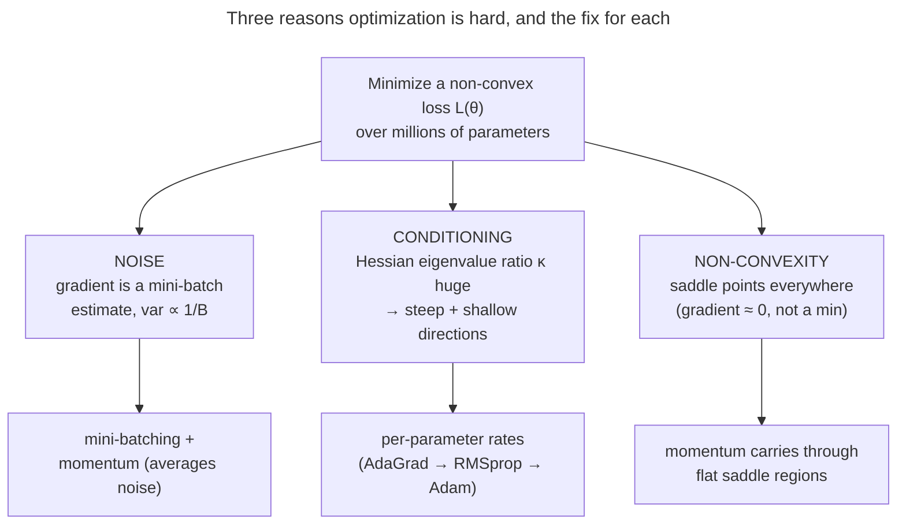
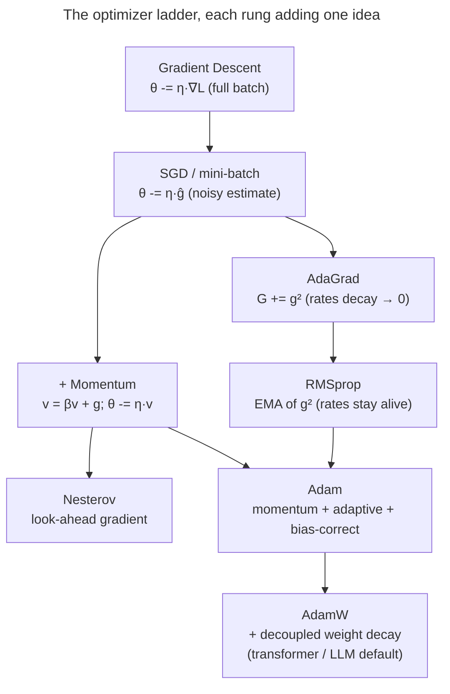

# Optimizers: turning gradients into good weight updates

[Backprop](/ai-ml/ai-ml-learning-resources/deep-learning/neural-network-foundations/backpropagation-and-computational-graphs/backpropagation-and-computational-graphs) hands you a **gradient** — the direction of steepest *increase* in the loss. The obvious move is to step the opposite way.

But *"step how far, in which combined direction, and at what rate for each of a billion parameters whose gradients you only know approximately?"* is where naive gradient descent falls apart. That is where the **optimizer** earns its keep.

- **What it is:** the rule that turns the raw gradient into the actual weight change.
- **What it decides:** a model that converges in hours versus one that oscillates forever, blows up to `NaN`, or crawls so slowly it never finishes.
- **Why it matters:** on modern transformers, the choice of optimizer (Adam vs SGD), and one or two of its knobs, is among the highest-leverage decisions in the whole training recipe.

I'm going to walk this the way I'd actually teach it to a teammate who can already differentiate a loss but keeps reaching for `torch.optim.Adam` without knowing *why* it works.

- **Start:** the **problem** — minimizing a high-dimensional, non-convex loss from *noisy* gradient estimates over an *ill-conditioned* surface.
- **Then:** build the optimizer ladder one rung at a time, **deriving every rule from the rung below it**, never just stating a formula.

By the end you'll be able to:

- explain the **three things that make the optimization hard** — noise, conditioning, and non-convexity — and how each optimizer idea attacks one of them;
- **derive** the full-batch → stochastic → mini-batch progression, including *why the gradient-noise variance scales like* $1/B$;
- **derive momentum** as an exponential moving average (EMA) of gradients, show it's a low-pass filter, and prove its effective step is $\approx \eta/(1-\beta)$;
- **derive Nesterov's lookahead**, **AdaGrad**, and **RMSprop**, and explain AdaGrad's "death" problem and RMSprop's fix;
- **derive Adam fully** — both moments, *and the bias correction* (with the algebra showing **why** the zero-initialized EMA is biased);
- **derive why L2 ≠ weight decay for adaptive optimizers**, and how **AdamW** fixes it;
- place **second-order** methods (Newton, K-FAC, Shampoo, Sophia) and explain why the exact Hessian is hopeless at scale;
- reason about the **SGD-vs-Adam generalization** debate, **gradient clipping**, and the **hyperparameter defaults** — and back all of it with **worked numbers** and **measured plots**.

Intuition first (a ball rolling downhill), then the rules in full, then code that reproduces PyTorch's Adam to $10^{-6}$.

> [!NOTE]
> Keep two ideas strictly separate.
> - **Gradient descent** is the *strategy* — move against the gradient.
> - The **optimizer** is the *specific update rule* implementing it: how it uses the current gradient *plus a memory of past gradients and their sizes* to decide each step.
>
> Every optimizer on this page is "gradient descent"; they differ only in how cleverly they use that memory.

---

## The problem: a hard optimization, not a clean one

If loss surfaces were nice — convex, well-scaled, and if we could compute the *exact* gradient — plain gradient descent with a single well-chosen learning rate would be all you ever needed, and this page would be one line.

Real deep-learning optimization is hard for **three** compounding reasons, and the entire optimizer family is a sequence of fixes for them.

**1. The gradient is noisy.** We never compute the true loss gradient — that would need a forward/backward pass over the *entire* dataset for *every* step.

- We estimate it on a small random **mini-batch**: unbiased but *noisy*, pointing roughly downhill and jittering from batch to batch.
- Too much noise and the step is unreliable; too little and each step is ruinously expensive.
- (We make the $1/B$ noise scaling precise below.)

**2. The surface is ill-conditioned.** Deep loss surfaces are wildly anisotropic — far steeper in some parameter directions than others.

- Locally the loss looks like a quadratic bowl $L(\theta)\approx \tfrac12 (\theta-\theta^\star)^\top H (\theta-\theta^\star)$, and the **eigenvalues of the Hessian** $H$ are the curvatures along its principal axes.
- Their ratio — the **condition number** $\kappa = \lambda_{\max}/\lambda_{\min}$ — can be in the thousands.
- A single global step size cannot serve a direction with curvature 1000 and another with curvature 1 at the same time.
- This is the **ravine** problem, and it is the central villain of this whole page.

**3. The surface is non-convex and high-dimensional.** With millions to billions of parameters, the surface is riddled not with bad *local minima* (rare and usually fine) but with **saddle points**.

- A saddle is flat in some directions and curved in others; the gradient nearly vanishes and naive gradient descent (GD) stalls.
- High dimension makes saddles overwhelmingly more common than minima.

*Why saddles dominate (the intuition).* At any critical point (gradient zero) the Hessian's eigenvalues tell you the shape.

- A **minimum** needs *all* $n$ eigenvalues positive (curving up in every direction); a **saddle** needs at least one negative.
- Imagine each eigenvalue's sign as a coin flip: the chance that *all* $n$ come up "positive" is vanishingly small for large $n$. So critical points are almost always saddles, and true minima are exponentially rare.
- This is *good* news: deep nets rarely get trapped in bad local minima. The real obstacle is the *plateaus* around saddles, where the gradient is tiny and plain GD inches along.
- **Momentum is the cure** — it carries velocity straight through a flat saddle region where a memoryless step would stall.

> [!NOTE]
> The three problems map almost one-to-one onto the three big optimizer ideas.
> - **Momentum** averages away noise *and* coasts through saddles.
> - **Adaptive per-parameter rates** (AdaGrad/RMSprop) attack conditioning.
> - **Adam** is just both at once.
>
> Hold this map in your head and the rest of the page is filling in the algebra.

---

## From full-batch GD to mini-batch SGD (derived)

Start with the cleanest possible rule and add reality.

**Full-batch gradient descent.** Define the loss as an average over the whole dataset of $N$ examples, $L(\theta)=\tfrac1N\sum_{i=1}^N \ell_i(\theta)$. The exact gradient is $g=\nabla_\theta L=\tfrac1N\sum_i \nabla_\theta \ell_i$, and the update is

$$\theta_{t+1} = \theta_t - \eta\, g_t.$$

This is the "true" steepest-descent step, but computing $g$ needs a pass over *all* $N$ examples for *one* update. On a dataset of millions, that is one tiny step per epoch — hopelessly slow.

**Stochastic gradient descent (SGD).** Go to the other extreme: estimate the gradient from a **single** random example $i$,

$$\hat g_t = \nabla_\theta \ell_i(\theta_t), \qquad \mathbb{E}_i[\hat g_t] = g_t.$$

The estimate is *unbiased* (its average over the random draw equals the true gradient) but high-variance. You get an update *per example* — thousands of cheap, noisy steps where full-batch took one expensive clean one.

**Mini-batch SGD (the practical middle).** Average the gradient over a random batch $\mathcal{B}$ of $B$ examples:

$$\hat g_t = \frac1B\sum_{i\in\mathcal{B}} \nabla_\theta \ell_i(\theta_t).$$

Now *derive the variance*. Treat the per-example gradients as i.i.d. draws with true mean $g$ and per-coordinate variance $\sigma^2$. The batch estimate is their sample mean, so by the standard variance-of-a-mean result,

$$\operatorname{Var}[\hat g_t] = \operatorname{Var}\!\left[\frac1B\sum_{i\in\mathcal{B}}\nabla\ell_i\right] = \frac{1}{B^2}\sum_{i\in\mathcal{B}}\operatorname{Var}[\nabla\ell_i] = \frac{\sigma^2}{B}.$$

So **the gradient-noise variance falls like $1/B$** — and the noise *standard deviation* like $1/\sqrt B$. That single fact governs the speed/noise trade-off:

- **Small $B$** → cheap steps, but noisy: more updates per second, each less reliable.
- **Large $B$** → expensive steps, but accurate: fewer, cleaner updates (and to *halve* the noise you must *quadruple* the batch — diminishing returns).

> [!NOTE]
> The $1/\sqrt B$ noise-vs-$1/B$ variance distinction is interview gold.
> - Doubling the batch only cuts the gradient *noise* (std-dev) by $\sqrt2\approx1.41$, not by 2.
> - That sub-linear payoff is exactly why there is a "critical batch size" beyond which bigger batches buy almost nothing.
> - It's also the quantitative backbone of the **linear-scaling rule** later.

> [!TIP]
> The noise isn't purely a cost — it's a *feature*.
> - The jitter lets SGD **rattle off saddle points and out of sharp, narrow minima** that full-batch GD would get stuck in or settle into.
> - A growing body of work argues this noise is part of *why* SGD-trained nets generalize well: it biases training toward flat, wide minima. Full-batch GD on the same net often generalizes *worse*.
> - So we don't just tolerate the noise — within reason, we *want* it.

> [!WARNING]
> "SGD" in a modern paper or a `torch.optim.SGD` call almost always means **mini-batch** SGD (usually with momentum), not the literal one-example version.
> - The pure single-example algorithm is mostly a teaching device.
> - When you read "we trained with SGD," read "mini-batch SGD + momentum."

---

## The conditioning problem: a ravine (the central villain)

Plain gradient descent uses one global learning rate $\eta$ for *every* parameter: $\theta \leftarrow \theta - \eta g$. Watch it fail on the simplest hard surface — a 2-D quadratic that is steep in one direction and shallow in the other.

Take $L(\theta)=\tfrac12(a\,x^2 + b\,y^2)$ with $a\gg b$ (say $a=12$, $b=1$, so $\kappa=12$). The gradient is $g=(a x,\, b y)$, so each axis evolves *independently*:

$$x_{t+1} = x_t - \eta\,a\,x_t = (1-\eta a)\,x_t, \qquad y_{t+1} = (1-\eta b)\,y_t.$$

Each coordinate is a geometric sequence. It **converges only if** $|1-\eta\lambda|<1$, i.e. $0<\eta<2/\lambda$. The catch: *both* axes share the *same* $\eta$.

- To stay **stable in the steep direction** you need $\eta < 2/a$. Push $\eta$ above that and $|1-\eta a|>1$: the steep coordinate's sign flips and grows every step — the classic **zig-zag that diverges**.
- But that same small $\eta$ makes the **shallow direction** crawl, since $1-\eta b$ is barely below 1, so $y$ shrinks by a tiny fraction each step.

The number that governs everything is the eigenvalue ratio $\kappa = a/b$. The best convergence rate plain GD can achieve on this surface is $\frac{\kappa-1}{\kappa+1}$ per step — so large $\kappa$ means glacial progress. **This is the ravine: oscillate across the steep walls while inching along the valley floor.**

> [!TIP]
> "Why not just lower the learning rate?" is a trap an interviewer will set.
> - Lowering $\eta$ *does* cure the steep-direction zig-zag — but it makes the already-glacial shallow direction *hopeless*.
> - One knob cannot win both axes.
> - Every optimizer past plain SGD is, at heart, a way to **stop using one rate for every direction.**

---

## What it is: a short ladder

An optimizer is a pure function `(weights, gradient, state) → (new weights, new state)`. The family is a short ladder; each rung adds **exactly one idea** to the rung below:

- **SGD** — step downhill. (No state.)
- **+ Momentum / Nesterov** — accumulate a *velocity* so consistent directions build speed and oscillations cancel. (State: one vector.)
- **+ Adaptive rates (AdaGrad → RMSprop)** — give *each parameter its own* effective step from the size of its recent gradients. (State: one vector.)
- **Adam** — momentum **and** per-parameter adaptive rates together, bias-corrected. (State: two vectors.)
- **AdamW** — Adam with **decoupled weight decay**; the default for transformers, LLMs, and diffusion models.

**A 60-year provenance, in one line each** (the *where-this-came-from* notes are folded into the references):

- **1951** — Robbins & Monro formalize **stochastic approximation**, the theoretical root of SGD.
- **1964** — Polyak's **heavy-ball momentum** (the $v=\beta v+g$ above).
- **1983** — Nesterov's **accelerated gradient** (the lookahead, with the $O(1/t^2)$ rate).
- **2011** — Duchi, Hazan & Singer's **AdaGrad** (per-parameter rates from $\sum g^2$).
- **2012** — Tieleman & Hinton's **RMSprop** (EMA fix), in a Coursera lecture — never formally published.
- **2014/15** — Kingma & Ba's **Adam** (momentum + RMSprop + bias correction) — now the most-cited optimizer.
- **2017/19** — Loshchilov & Hutter's **AdamW** (decoupled weight decay), the modern transformer default.
- **2023** — search-discovered **Lion** and Hessian-light **Sophia** push at the efficiency frontier.

---

## Intuition: a ball rolling downhill

Before the algebra, hold the physical picture — every rule below is a literal upgrade to this ball.

- **SGD** is a *light, frictionless* ball with no memory. On a ravine it rolls straight into the steep wall, bounces back, and zig-zags — reacting only to the local slope, forgetting where it just came from.
- **Momentum** makes the ball *heavy*. It builds velocity coasting down the valley and **averages out** the back-and-forth across the walls, so it rolls *through* small bumps and coasts across flat saddles instead of stalling.
- **Adaptive methods** put a **governor on each wheel**. A wheel (parameter) that keeps getting huge, erratic gradients has its step *shrunk*; a wheel with small, steady gradients keeps a *full* step. Now the steep and shallow axes can each get the rate they need.
- **Adam** is the heavy ball **with** per-wheel governors — momentum for *direction*, adaptive scaling for *step size per axis*. That combination is why Adam "just works" on a fresh problem: it self-corrects for both noise and conditioning without you tuning much.

---

## References

The curated link library for this topic — videos, courses, articles, papers, books, and internal cross-links — lives in a companion file so it can be reused as a standalone reference list:

**→ [Optimizers — references and further reading](/ai-ml/ai-ml-learning-resources/deep-learning/optimization-and-training/optimizers/optimizers#references-further-reading)**
