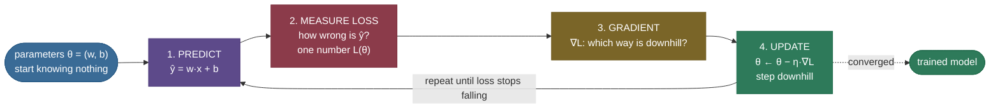

# How Models Learn: measure how wrong, then nudge to be less wrong

A freshly-created model knows **nothing**. Its internal numbers — its *parameters* — start at zero or at random, and its first predictions are useless: ask it a house price and it might answer "$0" for every house in California. Yet a few seconds later that same model draws a line through the data that a statistician would sign off on. Nothing was hand-coded in between. So what actually happened? What *is* "learning," mechanically, when we say a model learned?

The answer is one loop, and it is astonishingly simple: **the model makes a prediction, we measure how wrong it is with a single number, and we nudge every parameter a tiny bit in the direction that makes that number smaller — then we do it again, thousands of times.** That's it. That loop — *predict, measure, nudge, repeat* — is how a two-parameter line learns, and it is how a trillion-parameter language model learns. Only the model and the "how wrong" number change; the loop does not.

> **The one-sentence core.** *Learning is minimising a loss: a model predicts, a **loss function** scores how wrong it is, and **gradient descent** repeatedly steps every parameter downhill on that loss until it can't get much less wrong.*

I'm going to teach this the way I'd teach it at a whiteboard to someone who has never trained a model — intuition first (no calculus yet), then the training loop as a picture, then the three pieces of math (the loss, its gradient, the update rule) derived gently but honestly, then real runnable code that trains a real model on real data from scratch and *proves* it reached the right answer. By the end you'll be able to:

- explain **what a loss is** and why we need one number, not a vibe;
- explain the **gradient** as "which way is downhill" and the **update rule** $\theta \leftarrow \theta - \eta\,\nabla L$ symbol by symbol;
- say exactly what the **learning rate** $\eta$ does, and predict what happens when it's too big or too small;
- trace the **training loop** — predict → loss → gradient → update → repeat — and point to each step in code;
- explain why the *same loop* trains linear regression, logistic regression, and the output layer of a neural net;
- run a notebook that trains a real model by hand and matches scikit-learn to the decimal.

---

## The problem: a model that knows nothing

Let's make "knows nothing" concrete. We'll predict a California district's **median house value** from its **median income** — one number in, one number out. Our model is the simplest thing that can fit a trend: a straight line,

$$\hat y = w\,x + b,$$

where $x$ is the income, $\hat y$ is our predicted price, $w$ is the line's **slope**, and $b$ is its **intercept** (where it crosses the vertical axis). "The parameters" *are* $w$ and $b$ — two numbers. Learning means finding good values for them.

Before any learning, we set $w = 0$ and $b = 0$. Substitute those in and the model says $\hat y = 0\cdot x + 0 = 0$ for **every** district, regardless of income. On real data (2,000 real districts) that know-nothing line is comically bad — a flat line pinned to the floor of the plot, ignoring the obvious upward trend that richer districts have pricier houses.

Here's the felt problem: **we have a knob for the slope and a knob for the intercept, and no idea which way to turn them.** Turning $w$ up a little — does that help or hurt? What about $b$? With two knobs you might fumble your way to a decent line by trial and error. But real models have millions or billions of knobs. Random fiddling is hopeless. We need a *principled, automatic* way to know which way to turn every knob at once. That method is what "learning" means, and building it up is the rest of this page.

---

## Intuition first: the hot-and-cold game

Forget calculus for a moment. You already know how to solve "which way do I turn the knob?" — it's the children's **hot-and-cold game**. A friend hides a toy; you wander the room; with every step they tell you "warmer" (closer) or "colder" (farther). You don't need a map. You just need, at each step, to know whether you're getting **warmer or colder**, and to keep moving in the warmer direction. Do that repeatedly and you find the toy.

Learning is exactly this game, with two changes that make it automatic:

1. Instead of a friend saying "warmer/colder," we compute a **loss** — a single number that is *large when the model is very wrong and small when it's nearly right*. Lower loss = warmer.
2. Instead of guessing a direction and checking, we compute the **gradient** — the calculus tool that hands us the "warmest downhill direction" directly, for *every* knob at once, without trial and error.

So the mental model to hold for the rest of the page is a landscape. Imagine the loss as the **height of terrain**, and the model's parameters as your **position** on the ground. A very wrong model sits high on a hillside (big loss); the best model sits in the valley (smallest loss). Learning is **walking downhill** until you reach the valley floor. The only questions are: *how do I know which way is downhill?* (the gradient) and *how big a step do I take?* (the learning rate). Everything else is repetition.

Here is the whole loop as one picture — this is the diagram to burn in:



> **Note:** notice the loop has no "intelligence" hidden in it — no rules about houses or income. It is a blind hill-descent. That's the surprising part of machine learning: a completely general downhill-walking procedure, pointed at data, produces a model that captures a real trend. The cleverness is in the *loop*, not in any hand-written knowledge.

> **See it move.** 3Blue1Brown's [Gradient descent, how neural networks learn](https://www.youtube.com/watch?v=IHZwWFHWa-w) animates exactly this ball-rolling-downhill picture on a real network's loss surface — the single best 20 minutes for making this click.

---

## The math, derived gently

Now we turn the hot-and-cold intuition into three precise pieces: the **loss** (the "how wrong" number), the **gradient** (the "which way is downhill" arrow), and the **update rule** (the step). Every symbol is defined as it appears.

### Piece 1 — the loss: how wrong, in one number

We have $n$ real examples $(x_1, y_1), \dots, (x_n, y_n)$ — here $x_i$ is a district's income and $y_i$ its true house value. For a given line $(w, b)$ the prediction for example $i$ is $\hat y_i = w\,x_i + b$, and the **error** on that example is $\hat y_i - y_i$ (how far the prediction is above or below the truth). We need to squash all $n$ errors into one number. The standard choice for regression is the **mean squared error (MSE)**:

$$L(w, b) = \frac{1}{n}\sum_{i=1}^{n}\big(\hat y_i - y_i\big)^2.$$

Read it left to right: take each error, **square** it (so positive and negative errors both count as "wrong," and big misses count *far* more than small ones — squaring a 4 gives 16, squaring a 1 gives 1), then **average** over all examples. A perfect line has $L = 0$; our know-nothing line has a large $L$. Crucially, $L$ is a function of the parameters $(w, b)$ — change the line and the loss changes. That function *is* the landscape we descend.

> **Source / derivation:** the squared-error loss and its use as the regression objective are standard; see [Goodfellow, Bengio & Courville, *Deep Learning*, Ch. 5 (5.1.4, mean squared error) & Ch. 8 (optimization for training)](https://www.deeplearningbook.org/) for MSE as a maximum-likelihood objective under Gaussian noise, and [Dive into Deep Learning, Ch. 3.1 "Linear Regression"](https://d2l.ai/chapter_linear-regression/linear-regression.html) for the same loss built up from scratch. Both are free and in the references.

> **Note:** why *squared* error and not, say, absolute error $|\hat y_i - y_i|$? Two reasons worth knowing: squaring makes the loss a smooth, bowl-shaped (convex) surface with a single bottom and a well-defined slope everywhere — ideal for gradient descent — and it corresponds to assuming the noise in the data is Gaussian (the maximum-likelihood connection above). Absolute error is also usable and more robust to outliers, but its corner at zero makes the calculus messier. For a first model, MSE is the natural choice.

### Piece 2 — the gradient: which way is downhill

We want to change $(w, b)$ to lower $L$. Calculus gives us the tool: the **partial derivative** $\partial L / \partial w$ tells us how much $L$ changes when we nudge $w$ (holding $b$ fixed), and $\partial L / \partial b$ likewise for $b$. Stacked together, $\nabla L = (\partial L/\partial w,\ \partial L/\partial b)$ is the **gradient** — and it points in the direction of steepest *increase* of $L$. So the direction of steepest *decrease* — downhill, the "warmer" direction — is the **negative** gradient $-\nabla L$.

Let's actually differentiate the MSE. Write the error $r_i = \hat y_i - y_i = w x_i + b - y_i$. Since $L = \frac1n \sum_i r_i^2$, the chain rule (differentiate the square, then the inside) gives, for the slope:

$$\frac{\partial L}{\partial w} = \frac{1}{n}\sum_{i=1}^n \frac{\partial}{\partial w} r_i^2 = \frac{1}{n}\sum_{i=1}^n 2 r_i \frac{\partial r_i}{\partial w} = \frac{2}{n}\sum_{i=1}^n (\hat y_i - y_i)\,x_i,$$

because $\partial r_i / \partial w = x_i$. And for the intercept, $\partial r_i / \partial b = 1$, so:

$$\frac{\partial L}{\partial b} = \frac{2}{n}\sum_{i=1}^n (\hat y_i - y_i).$$

Look at what these *mean*, connecting back to the intuition. Both are built from the residual $(\hat y_i - y_i)$ — prediction minus truth. The intercept's gradient is (twice) the **average error**: if the line is systematically too low, the errors are negative, so $-\partial L/\partial b$ says "raise $b$" — lift the whole line. The slope's gradient weights each error by that example's $x_i$: it says "if the line is too low for high-income districts, tilt it up." The gradient is not magic; it is the precise, quantitative version of "you're colder over here, warmer over there."

> **Try it:** we start too *low* ($\hat y = 0 <$ most prices), so every residual $\hat y_i - y_i$ is negative and $\partial L/\partial b$ comes out **negative** — the update raises $b$. **Predict:** if instead the line started too *high* (say $b = 10$, above every price), what sign would $\partial L/\partial b$ have, and would the first update raise or lower $b$? (Hint: flip the sign of the residuals.) The gradient always points *away* from the fit, so the update always steps back toward it — from either side.

> **Source / derivation:** gradient descent — step in the negative-gradient direction to minimise a function — dates to [Cauchy's 1847 note *Méthode générale pour la résolution des systèmes d'équations simultanées*](https://www.academie-sciences.fr/pdf/dossiers/Cauchy/Cauchy_pdf/CR1847_t25_p536_538.pdf); its modern treatment for machine-learning objectives is [Goodfellow, Bengio & Courville, *Deep Learning*, Ch. 4.3 (gradient-based optimization) & Ch. 8](https://www.deeplearningbook.org/). Both in the references.

### Piece 3 — the update rule: take a step

Now the single most important line in machine learning. We move each parameter a small amount in the downhill direction:

$$\boxed{\;\theta \leftarrow \theta - \eta\,\nabla L(\theta)\;}\qquad\text{i.e.}\qquad w \leftarrow w - \eta\,\frac{\partial L}{\partial w}, \quad b \leftarrow b - \eta\,\frac{\partial L}{\partial b}.$$

Here $\theta$ ("theta") is shorthand for *all* the parameters at once (here $\theta = (w, b)$; for a neural net it's every weight). The minus sign is the whole point: the gradient points uphill, so we subtract it to go **down**. And $\eta$ ("eta") is the **learning rate** — a small positive number (like 0.3) that sets **how big a step** we take. This one update, repeated, is gradient descent.

What does $\eta$ do, intuitively? It's your stride length walking downhill in fog:

- **too small** and you inch forward — safe but agonisingly slow, thousands of steps to reach the valley (it *crawls*);
- **just right** and you stride confidently down to the bottom (it *converges*);
- **too big** and you leap clear over the valley to a *higher* point on the far slope, then leap back even higher — each step overshoots worse than the last, and the loss explodes to infinity (it *diverges*).

We'll *measure* all three regimes below. Getting $\eta$ into the right range is the single most important knob-setting in practice.

> **Note (intuition vs. formal):** *intuitively*, a too-big step overshoots the minimum. *Formally*, for a quadratic bowl like MSE there's a precise threshold: if $\eta$ exceeds $2/\lambda_{\max}$ (where $\lambda_{\max}$ is the largest curvature of the loss) the iteration is unstable and diverges. You don't need that formula yet — the forward-link [Gradient Descent Theory](/ai-ml/ai-ml-learning-resources/foundations/mathematical-foundations/gradient-descent-theory/gradient-descent-theory) derives it — but it's why "too big" isn't a vague warning: there's an exact edge.

### Every symbol in one place

```
x, y          one example's input (income) and true target (house value)
θ = (w, b)    the parameters: slope w and intercept b (what we learn)
ŷ = w·x + b   the model's prediction
L(θ) = (1/n) Σ (ŷ − y)²          the LOSS: mean squared error (how wrong)
∇L = (∂L/∂w, ∂L/∂b)              the GRADIENT: steepest-uphill direction
∂L/∂w = (2/n) Σ (ŷ − y)·x         slope gradient (residual, weighted by x)
∂L/∂b = (2/n) Σ (ŷ − y)           intercept gradient (average residual)
η                                 the LEARNING RATE: step size (e.g. 0.3)
θ ← θ − η·∇L                       the UPDATE RULE: step downhill; repeat
```

---

## The code: train a real model from scratch, and prove it's right

Enough theory — let's run the loop on real data and watch a model learn. The whole thing is a handful of lines of NumPy: no autodiff, no library doing the learning for us. We implement the loss, the gradient we just derived, and the update, then loop. (The full typed module is [`how_models_learn.py`](code/how_models_learn.py); the stepwise notebook is [the step-by-step teaching notebook](code/how-models-learn.ipynb).)

```python
import numpy as np

def train_linear_gd(x, y, lr=0.3, epochs=200):
    w, b = 0.0, 0.0                           # start knowing nothing
    for _ in range(epochs):
        y_hat = w * x + b                     # 1. PREDICT
        resid = y_hat - y                     # (the error on every example)
        grad_w = (2/len(x)) * (resid @ x)     # 2+3. LOSS's GRADIENT wrt w
        grad_b = (2/len(x)) * resid.sum()     #       and wrt b
        w -= lr * grad_w                      # 4. UPDATE: step downhill
        b -= lr * grad_b
    return w, b
```

That is the entire learning algorithm — the four numbered steps of the Mermaid diagram, in four lines inside the loop. Everything else in the module is bookkeeping (loading real data, recording the loss so we can plot it, checking against scikit-learn).

**Watch the loss fall.** Running this on 2,000 real California districts (income standardised, house value in $100k units), the loss starts at **5.58** for the know-nothing line and drops to **0.674** — most of the fall happening in the first handful of epochs, because the gradient is largest when the model is most wrong:


**Watch the line fit itself.** That falling number *is* the line physically rotating into place. Freezing the parameters at a few epochs and drawing each line over the real scatter shows the model learning in real time — from the flat line at the bottom (epoch 0, loss 5.58) up into the best straight-line fit (by epoch 5 the loss is already 0.67 and the line barely moves after):


**The ball rolling downhill, for real.** Because our model has exactly two parameters, we can *see* the entire loss landscape: plot $L(w, b)$ as a surface over the $(w, b)$ plane and it's a bowl, with the best line at the bottom. Gradient descent drops a ball at our start $(0, 0)$ and rolls it downhill, one step per epoch, straight to the minimum:


**Did we build the real thing, or just something that looks right?** Here's the proof. Linear regression has a known exact answer — the **least-squares** solution — which `sklearn.LinearRegression` computes directly with linear algebra, no gradient descent at all. If our blind hill-descent found the *same* slope and intercept, we didn't build a lookalike; we built the genuine algorithm and it converged to the provably-optimal fit. It does, to four decimals:

```
our gradient descent : slope w = +0.7819, intercept b = +2.0717
sklearn least squares: slope w = +0.7819, intercept b = +2.0717
match within 1e-2: True
```

The module also runs the *identical loop* on three features at once (income, house age, average rooms) and again matches scikit-learn's least-squares weights $[+0.8398, +0.1935, -0.0865]$ exactly (reproduce with `python how_models_learn.py`) — the loop doesn't care how many parameters it's descending on.

---

## The learning rate, measured

The update rule has one free knob we chose by hand: $\eta$. Let's *measure* the three regimes on the same real regression — same model, same data, only the step size changes:


The numbers make the picture exact:

```
lr = 0.001 : start 5.5775 -> end 4.5303      crawled (barely moved)
lr = 0.3   : start 5.5775 -> end 0.6741      converged (reached the minimum)
lr = 1.02  : start 5.5775 -> end 543.3037    DIVERGED (loss exploded)
```

This is why "tune the learning rate" is the first advice anyone gives. Too small wastes compute (you'll wait forever); too large is catastrophic (the loss becomes `inf` or `nan` and the run is dead). The good range is often a factor of 10 wide, and finding it — by trying a few values on a log scale, exactly like this — is a routine first step in any training job.

> **Try it:** before you run the notebook, **predict**: at $\eta = 1.02$ the loss reached 543 after 60 epochs. If you *doubled* the epochs to 120, would the final loss roughly double, square, or stay about the same? (Hint: each diverging step multiplies the error by a constant factor, so the loss grows *geometrically* — doubling the steps roughly *squares* the blow-up. Divergence isn't a plateau you can outlast; it's an explosion. Run it and watch the number go from hundreds to millions.)

---

## The same loop, a different problem: classification

Here's the claim that makes this page matter: **this exact loop is not for lines-through-points — it is how essentially every model learns.** To prove it, we change the problem completely. Instead of predicting a number (regression), we'll **classify**: given two measurements of a tumour (mean radius, mean texture), predict whether it's **benign or malignant** — a real diagnostic dataset of 569 tumours.

Two things change; the loop does not.

**The model outputs a probability.** A line $w\cdot x + b$ can be any number from $-\infty$ to $+\infty$, but a probability must live in $[0, 1]$. So we pass the line through the **sigmoid** function, $\sigma(z) = 1/(1 + e^{-z})$, which smoothly squashes any score into $(0, 1)$: very negative scores → near 0 (confidently malignant), very positive → near 1 (confidently benign), zero → exactly 0.5 (a coin flip). The model is $p = \sigma(w\cdot x + b)$.

**The loss becomes log-loss.** Squared error is wrong for probabilities (it barely punishes confident mistakes). The right loss is **log-loss**, a.k.a. **binary cross-entropy**:

$$L = -\frac{1}{n}\sum_{i=1}^n \Big[\,y_i \log p_i + (1 - y_i)\log(1 - p_i)\,\Big].$$

Intuitively this is the *surprise* the model assigns to what actually happened: if the truth is "benign" ($y=1$) and the model said $p = 0.99$, the penalty $-\log 0.99 \approx 0.01$ is tiny; if it confidently said $p = 0.01$, the penalty $-\log 0.01 \approx 4.6$ is savage. Confidently wrong is punished hard; confidently right is nearly free. A know-nothing classifier predicts $p = 0.5$ for everyone, giving loss $-\log 0.5 = \ln 2 \approx 0.693$ — the coin-flip baseline.

> **Source / derivation:** log-loss *is* the cross-entropy between the true label and the predicted probability, and it is derived in full — including why its gradient collapses to the clean form below — in the companion chapter [Cross-Entropy & KL Divergence](/ai-ml/ai-ml-learning-resources/foundations/mathematical-foundations/cross-entropy-and-kl-divergence/cross-entropy-and-kl-divergence). We point there rather than re-deriving it here.

Now the beautiful part. What's the gradient of log-loss with respect to the parameters? After the sigmoid's derivative and the log cancel (the cancellation is worked out in the cross-entropy chapter), it collapses to:

$$\frac{\partial L}{\partial w} = \frac{1}{n}\sum_i (p_i - y_i)\,x_i, \qquad \frac{\partial L}{\partial b} = \frac{1}{n}\sum_i (p_i - y_i).$$

That is **prediction minus target**, weighted by $x$ — the *identical structure* as the MSE gradient (which was $(\hat y_i - y_i)\,x_i$). The residual $(p - y)$ plays the same role as $(\hat y - y)$ did. So we can feed it into the very same update rule and the very same loop. Running it on the real tumours, the log-loss falls from $\ln 2 = 0.693$ to **0.232**, and the **decision boundary** — the line where the model is 50/50 — swings into the place that best separates the two classes:


And the same proof-of-correctness holds: our from-scratch logistic GD reaches essentially the same weights as `sklearn.LogisticRegression` — our fit is `w = [-4.298, -0.841], b = +0.984` versus sklearn's `w = [-4.296, -0.840], b = +0.984`, agreeing to ~2 decimals. (For a fair comparison we fit sklearn *near-unregularised*, `C=1e4`, so it targets the same maximum-likelihood solution our loss does — otherwise its regularisation would deliberately shrink the weights and they wouldn't match.) **Same loop, different model and loss, matched to the library.** That is the payoff — you have now seen the engine that trains both a regressor and a classifier, and it was one loop.

---

## Batches, epochs, and the leap to real scale

Two vocabulary items and one scaling idea, because you'll hit them immediately.

- An **epoch** is one full pass over the data (every example seen once). We ran 200 epochs above; each was one update using *all* the data. This is **full-batch** (or "batch") gradient descent.
- Full-batch is fine for 2,000 examples but impossible for millions: you can't fit the whole dataset in memory and compute one gradient over all of it per step. The fix is **stochastic gradient descent (SGD)** and its practical form, **mini-batch** GD: estimate the gradient from a small random *batch* (say 32 or 256 examples) each step. The estimate is noisy, but each step is cheap, so you take vastly more of them — and the noise even helps escape bad spots. Every large model is trained this way.

The loop is otherwise unchanged: predict on the batch, measure the loss, compute the gradient, step. The forward-link [Gradient Descent Theory](/ai-ml/ai-ml-learning-resources/foundations/mathematical-foundations/gradient-descent-theory/gradient-descent-theory) covers SGD, momentum, and adaptive optimizers (Adam) — all of which are refinements of *how* to use the gradient, not replacements for the loop.

> **Note:** when people say GPT was "trained," this is the loop they mean — mini-batch gradient descent on a cross-entropy loss (next-token prediction), for trillions of tokens, over billions of parameters. The parameters aren't $w$ and $b$; they're every weight in the network. The loss isn't MSE; it's cross-entropy. But it is *predict → measure loss → gradient → update → repeat*, exactly what you just built. There is no other magic.

---

## Measuring honestly: train / validation / test

One more idea belongs here, because "the model learned" is only meaningful if it learned something that **generalises** — that works on data it has never seen. If you judge a model by its loss on the very examples it trained on, you're grading students on the exact questions they saw while studying. A model can score perfectly by *memorising* and still be useless on anything new (that failure is **overfitting**, the subject of the [next chapter](/ai-ml/ai-ml-learning-resources/foundations/ai-ml-orientation/overfitting-and-underfitting/overfitting-and-underfitting)).

The fix is to split your data before training:

- **Training set** — the model learns on this (computes gradients, updates parameters).
- **Validation set** — held out from training; you check loss here to tune choices like the learning rate and to decide when to stop. The model never learns on it directly.
- **Test set** — locked away until the very end, touched **once**, to get an honest estimate of real-world performance.

The iron rule: **the test set must stay untouched** until you're done. Every time you peek and adjust, you leak information from it into your choices, and its estimate stops being honest. Split first, learn on train, tune on validation, judge once on test.

> **Tip:** for small datasets, **k-fold cross-validation** reuses the data more efficiently — split into $k$ folds, train on $k{-}1$ and validate on the held-out fold, rotate, average. StatQuest's [Cross Validation](https://www.youtube.com/watch?v=fSytzGwwBVw) explains it in six minutes. It's the standard way to estimate performance without a big dedicated validation set.

---

## Pitfalls and failure modes

The things that actually bite when you first train models, each with the fix.

**1. Learning rate too high → `nan`/`inf` loss.** The most common first bug: the loss becomes `nan` after a few steps and never recovers. That's divergence (our $\eta = 1.02$ run). *Fix:* drop the learning rate by 10× until the loss falls smoothly; a diverged run can't be salvaged mid-flight, only restarted with a smaller step.

**2. Features on wildly different scales → training crawls or zig-zags.** If one feature ranges 0–1 and another 0–100,000, the loss surface becomes a long thin ravine, and a single learning rate can't suit both directions — it crawls along one axis while overshooting the other. *Fix:* **standardise** every feature to zero mean and unit variance before training (we did; it's why one $\eta$ worked). This is not optional preprocessing — it's what makes the loss bowl round enough to descend.

**3. Judging on the training set → fooling yourself.** A loss of 0 on training data can mean a great model *or* a memoriser. *Fix:* always report loss/accuracy on a held-out set (above). If train loss keeps falling while validation loss rises, you're overfitting.

**4. Forgetting to standardise the target, or mixing up units.** Our house values are in $100k units; a "loss of 0.67" is 0.67 in *those squared units*, not dollars. *Fix:* know your units. MSE is in the square of the target's units — take the square root (RMSE) for something interpretable ($\sqrt{0.67} \approx 0.82$, i.e. typical error ~\$82k here).

**5. `exp` overflow in the sigmoid/softmax.** A large logit makes `exp` overflow to `inf`. *Fix:* use a numerically-stable sigmoid (branch on the sign of $z$, as the module does) or the framework's fused `log_softmax`/`binary_cross_entropy_with_logits`. Never call bare `exp` on an unbounded score. (The [Cross-Entropy chapter](/ai-ml/ai-ml-learning-resources/foundations/mathematical-foundations/cross-entropy-and-kl-divergence/cross-entropy-and-kl-divergence) covers the log-sum-exp trick.)

**6. Fear of local minima.** The single most common beginner worry: won't gradient descent get *stuck* in a bad valley short of the best one? For a **convex** loss like MSE the answer is no — the bowl has a *single* bottom (you saw it in the loss-surface figure), which is exactly why our blind descent reached the *exact* least-squares answer. There is nowhere else to get stuck. Neural-network losses *are* non-convex, with many local minima and saddle points, but in practice the same loop reliably finds an *excellent* one — the [Gradient Descent Theory chapter](/ai-ml/ai-ml-learning-resources/foundations/mathematical-foundations/gradient-descent-theory/gradient-descent-theory) explains why (high-dimensional minima are mostly equally good, and saddles are escapable). *Fix / takeaway:* for convex problems, don't fear local minima at all; for deep nets, good **initialization** and a **sane learning rate** matter far more than the minima you might imagine you're trapped in.

**7. Expecting the loss to fall monotonically with mini-batches.** Full-batch loss falls smoothly (every step uses all data); mini-batch/SGD loss is *noisy* — it bounces down. *Fix:* don't panic at a jittery curve; look at the trend over many steps (or plot a running average). A little noise is normal and even helpful.

---

## Where it's used, and why it matters

This isn't one technique among many — it is *the* engine of modern machine learning. Almost every model you'll meet is trained by some version of this loop:

- **Linear & logistic regression** (this page) — the loop in its purest form, matching the closed-form answer.
- **Deep neural networks** — the same loop, with the gradient computed by **backpropagation** (the chain rule applied through many layers) and the update handled by an optimizer like **Adam** (a smarter way to use the gradient). The loop is unchanged; only $\nabla L$ is harder to compute.
- **Large language models** — mini-batch gradient descent on a **cross-entropy** (next-token) loss, over trillions of tokens. Pre-training *is* this loop at planetary scale.
- **Recommenders, forecasters, vision models, speech models** — all trained by predict → loss → gradient → update. The loss changes (MSE, cross-entropy, contrastive, …); the loop is the constant.

**When the loop is *not* how a model "learns":** a few methods don't use gradient descent at all. **k-nearest-neighbours** just stores the training data and looks up neighbours at prediction time (no parameters, no loss to minimise). **Decision trees** are grown by greedily splitting on features to reduce impurity, not by stepping down a smooth loss. **Linear regression itself** has a closed-form least-squares solution (which we used as our ground truth), so on small data you'd solve it directly rather than iterate. Gradient descent wins precisely when the model is too big or the loss too complex for a closed form — which is essentially all of deep learning.

That's the whole reason this chapter is the foundation for everything after it: understand *predict → measure → nudge → repeat*, and you understand the mechanism under every algorithm in the rest of this repo.

---

## Recap and rapid-fire

**If you remember nothing else:** learning is minimising a loss. A model predicts, a **loss** scores how wrong it is in one number, the **gradient** says which way is downhill for every parameter at once, and the **update rule** $\theta \leftarrow \theta - \eta\,\nabla L$ takes a step that way — repeated until the loss stops falling. The **learning rate** $\eta$ is the step size (too small crawls, too big diverges). The *same loop* trains linear regression, logistic regression, and a trillion-parameter LLM; only the model and the loss change. Judge the result on **held-out** data, never on the training set.

**Quick-fire — say these out loud:**

- *What is a loss function?* One number that measures how wrong the model's predictions are; lower is better. MSE for regression, cross-entropy for classification.
- *What is gradient descent?* Repeatedly step every parameter in the negative-gradient (downhill) direction to lower the loss.
- *What's the update rule?* $\theta \leftarrow \theta - \eta\,\nabla L$ — parameters minus learning-rate times gradient.
- *What does the learning rate do?* Sets the step size: too small crawls, well-chosen converges, too big diverges to `inf`.
- *What's an epoch?* One full pass over the training data.
- *Full-batch vs SGD?* Full-batch uses all data per step (smooth, small-data); SGD/mini-batch uses a random subset (cheap, noisy, scales to huge data).
- *Why the same loop for regression and classification?* Both gradients reduce to (prediction − target)·x — the residual structure is identical.
- *Why split train/val/test?* To measure generalisation honestly; the test set must stay untouched until the end.
- *How is an LLM trained?* This exact loop — mini-batch gradient descent on a cross-entropy loss — at massive scale.
- *One learning-rate symptom to recognise?* Loss going to `nan` → learning rate too high; loss barely moving → too low.

---

## Code and the runnable notebook

Everything on this page is produced by real code you can run and teach from — a clean typed module and a step-by-step executed notebook that mirrors it one operation at a time:

- **[Step-by-step teaching notebook](code/how-models-learn.ipynb)** — 15 numbered steps, each an intuition lead-in plus one focused cell with real output: a know-nothing line and its loss, the gradient and one step by hand, the full training loop with the loss falling, the line fitting itself, the loss surface with the descent path, the learning-rate sweep (crawl/converge/diverge), then the *same loop* training logistic regression on real tumours — all matched to scikit-learn. Executes headless with zero errors.
- **[The load-bearing module](code/how_models_learn.py)** — every function used above, typed and asserted; run it with `python how_models_learn.py` to reproduce all the printed numbers (including the scikit-learn match assertions).
- **The figure generator** (`00. Basics/tools/make_figures_04.py`) — regenerates all five figures from the same real pipeline; no number is hand-typed.

---

## References and further reading

The curated link library for this topic — start-here path, videos, courses, articles, papers, and books, all free/open — lives in a companion file so it can be reused as a standalone reference list, and every "Source / derivation" citation above appears in it:

**→ [How Models Learn — references and further reading](how-models-learn.references.md)**
