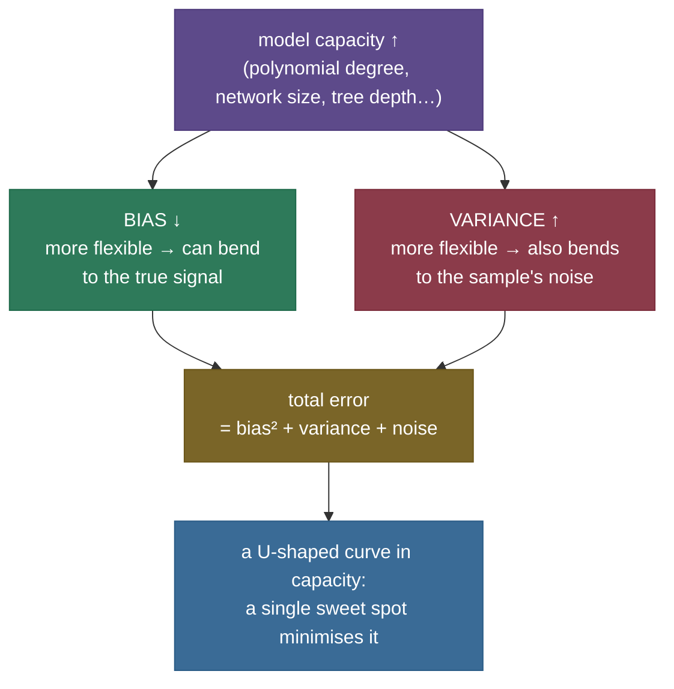

# Overfitting & Underfitting: scoring 100% on the practice test, failing the real exam

You train a model. It scores **essentially perfectly** on the data it learned from — tiny error, the fit hugs every point. You ship it, real data arrives, and it is **badly wrong**. Not a little wrong: wrong in a way that would have embarrassed a far simpler model. What happened? The model didn't fail to learn — it learned *too well*. It memorised the exact examples it was shown, including the random noise in them, and mistook that memorisation for understanding. That failure has a name, **overfitting**, and it is the single most important thing to understand before you trust any model's numbers.

Its mirror image is just as dangerous. A model too simple to capture the real pattern is wrong *everywhere* — on the training data **and** on new data. That is **underfitting**. Between "too simple to see the pattern" and "so complex it memorises the noise" sits a **sweet spot** where the model captures the real signal and ignores the noise — where it **generalises**. Finding that sweet spot, and knowing which side of it you're on, is the daily work of machine learning.

> **The one-sentence core.** *A model's error splits into **bias** (error from being too simple to capture the truth) and **variance** (error from being so flexible it fits the training sample's noise); underfitting is all bias, overfitting is all variance, and the goal is the complexity that minimises their sum — measured honestly on data the model never saw.*

I'll teach this the way I'd teach it at a whiteboard, building on the [previous chapter](/ai-ml/ai-ml-learning-resources/foundations/ai-ml-orientation/how-models-learn/how-models-learn) where a model learned by driving its training loss down. The uncomfortable twist of this chapter is that **driving training loss to zero is not the goal** — and can be the *disease*. We'll go intuition first (memorising the answer key vs. learning the concept, no formulas), then the picture of capacity vs. generalisation, then the one piece of real math — the **bias-variance decomposition** — derived gently but honestly, then real runnable code that *measures* the whole story on real data: the classic U-curve, three fitted models you can see underfit / fit / overfit, and the two cures (regularization and more data) working on measured numbers. By the end you'll be able to:

- explain **overfitting and underfitting** without hand-waving, and say which one a given train/validation pair shows;
- read the **U-curve** — why training error only ever falls with capacity while validation error falls then rises;
- state and *derive* the **bias-variance decomposition** $\mathbb{E}[(y-\hat f)^2] = \text{bias}^2 + \text{variance} + \sigma^2$, and tie each term to the U you measured;
- use the **generalisation gap** (validation minus training error) as your overfitting diagnostic;
- explain how **L2 regularization** trades a little bias for a lot less variance, and why **more data** shrinks the gap;
- run a notebook that measures all of this on real curves and matches scikit-learn.

---

## The problem: a model that memorises instead of learns

Let's make "memorises the noise" concrete and measured. We have a real relationship to learn — a gentle curve, $f(x) = \cos(1.5\pi x)$ on $x \in [0, 1]$ — but we only ever observe it through **noisy measurements**: $y = f(x) + \varepsilon$, where each $\varepsilon$ is a small random error (Gaussian, standard deviation $\sigma = 0.25$). This is exactly the real situation: there is a true signal, and every data point is that signal *plus* noise we can't see or remove. We draw **40** such points and try to recover the curve.

> **Why a controlled curve and not a spreadsheet dataset?** Because to *separate* a model's error into "too simple" versus "memorised the noise," we must know the true signal and the noise level — and on a real tabular dataset both are unknown and unmeasurable. Generating real data from a known curve plus real noise is the standard, honest way this is taught (it is the setup in *An Introduction to Statistical Learning* and scikit-learn's own overfitting example). The generating function is synthetic; **the fitting, the metrics, and every measured curve below are completely real** and reproducible from the seed. It is a controlled experiment, not a toy.

Now fit polynomials of increasing **capacity** — degree 1 (a straight line), degree 4, degree 15 — to those same 40 points. Here is the felt problem, measured on a large held-out set the models never saw:


Look at the right panel. The degree-15 model achieves the **lowest training error of the three** — it passes almost exactly through the 40 training points, its training MSE a tiny **0.024**. By the only measure the last chapter gave us (training loss), it is the *best* model. Yet on new data it scores **0.180** — nearly **three times worse** than the humble degree-4 model's **0.068**. It has contorted itself to hit every noisy point, inventing violent wiggles (and wild swings at the edges) that exist in *this* sample's noise and nowhere in the real curve. That is overfitting, and here is the trap it sets: **the number you were trained to minimise — training error — gets *better* exactly as the model gets *worse*.** You cannot detect overfitting by looking at training performance. If you judge a model on the data it learned from, the most overfit, most useless model looks like the winner.

The left panel is the opposite failure. A straight line is too rigid to bend with the curve; it is wrong on the training data (MSE 0.243) *and* wrong on new data (0.243) — high error everywhere, because it never captured the real shape at all. That is underfitting.

The middle panel is what we want: a model complex enough to follow the true curve, simple enough to ignore the noise. The whole chapter is about how to *find* it and how to *know* you've found it.

---

## Intuition first: memorising the answer key vs. learning the concept

Forget polynomials for a moment. You already understand this from school.

Two students prepare for an exam using the same 40 practice questions (with answers). **Student A** memorises the 40 answer sheets word for word — every answer, including the *typos* and the one question that had a wrong answer key. On the practice questions, Student A scores 100%. **Student B** ignores the exact answers and works to understand the underlying *concepts* the questions test. On the practice questions, Student B makes a few slips and scores 90%.

Now the **real exam** arrives — different questions, same concepts. Student A, who memorised specific answers, is lost: the questions don't match the memorised sheets, and the typos they faithfully learned are worse than useless. Student B, who learned the concept, does well — the questions are new but the concept is the same.

That is overfitting versus generalising, exactly:

- **Student A = the overfit model.** It memorised the *training set*, including its noise (the typos, the wrong key). It scores near-perfectly on training data and poorly on anything new. Its problem is **variance**: change the practice set (a different sample) and it memorises a completely different, equally useless set of specifics.
- **Student B = the well-fit model.** It learned the *signal* and tolerated a little training error rather than chase noise. It generalises.
- **A student who didn't study at all = the underfit model.** Wrong on the practice questions *and* the exam. Its problem is **bias**: too little capacity to capture the concept in the first place.

The practice questions are your **training set**; the real exam is the **test set**; the concept is the **true signal**; the typos and quirks are the **noise**. And the moral is the one that makes this whole field honest: *the only score that matters is the one on questions you haven't seen.* Grading a model on its training data is grading Student A on the practice sheet they memorised — it tells you nothing about the exam.

Hold onto one more image, because the math will make it precise. Imagine training your model on **many different practice sets** drawn from the same course. A high-**bias** (underfit) model gives nearly the *same wrong answer* every time — consistently off, insensitive to which practice set it saw. A high-**variance** (overfit) model gives a *wildly different answer* for each practice set — it swings all over the place depending on the exact noise it happened to memorise. Bias is being *consistently wrong*; variance is being *inconsistently right*. The best model is a little of neither.

> **See it move.** Amazon's [MLU-Explain: The Bias-Variance Tradeoff](https://mlu-explain.github.io/bias-variance/) is a beautiful interactive that lets you drag model complexity and *watch* bias fall while variance rises — the same crossover we're about to measure, animated under your cursor. Two minutes there makes the rest of this page click.

---

## The mechanism: capacity, and where the two failures live

The knob under all of this is **model capacity** (also called complexity or flexibility): how wiggly a function the model is *able* to represent. For our polynomials, capacity is just the **degree** — degree 1 can only draw straight lines, degree 4 can draw curves with a few bends, degree 15 can draw something that snakes through 15+ turns. More capacity = more shapes the model can take = more able to fit *both* real signal and random noise.

Everything follows from a tension between two things that capacity does in *opposite* directions:



Read the diagram as the **complexity axis**, left (simple) to right (complex):

- **Far left — underfit / high bias.** Too little capacity to represent the true signal. The model is *systematically* wrong (a line can't be a curve, no matter how much data). Training and validation error are both high, and close together.
- **Middle — the sweet spot.** Just enough capacity to capture the signal, not enough to chase the noise. Validation error is at its minimum.
- **Far right — overfit / high variance.** So much capacity that the model fits the specific noise of *this* training sample. Training error keeps falling (it can always hug the points harder), but validation error *rises* — the extra wiggles are noise-specific and wrong on new data.

The single most useful consequence, and the thing you'll actually plot: **training error only ever falls as capacity grows** (a bigger model can always match the training points at least as well — a degree-5 polynomial contains every degree-4 one), but **validation error falls, bottoms out, then rises.** That gap between the two curves *is* overfitting, and their shapes are the U-curve we measure next.

---

## The math, derived gently: the bias-variance decomposition

Now the one piece of real math, and it is worth every line because it *proves* the U-curve exists and tells you exactly what each cure does. We'll define every symbol and show every step.

### Setup: what "error" even means here

Fix a single input $x$. The truth there is $f(x)$, but we never see it cleanly — we see $y = f(x) + \varepsilon$, where $\varepsilon$ is random noise with mean $0$ and variance $\sigma^2$ (nobody can predict $\varepsilon$; it's the irreducible randomness of measurement). We train a model on a random training set $\mathcal{D}$ and get a predictor $\hat f_{\mathcal D}(x)$ — the hat means "estimated," the subscript $\mathcal D$ reminds us it depends on *which* training sample we happened to draw. Draw a different $\mathcal D$ and you get a different $\hat f$.

The quantity we care about is the **expected squared error** on a fresh point — averaged over both the noise $\varepsilon$ and the random draw of the training set $\mathcal D$:

$$\text{Err}(x) = \mathbb{E}_{\mathcal D,\,\varepsilon}\!\left[\big(y - \hat f_{\mathcal D}(x)\big)^2\right], \qquad y = f(x) + \varepsilon.$$

This is the honest generalisation error: how wrong, on average, is a model trained on a typical sample when it meets a fresh noisy observation?

### The derivation: three terms fall out

Let me abbreviate $\hat f = \hat f_{\mathcal D}(x)$ and define $\bar f = \mathbb{E}_{\mathcal D}[\hat f]$ — the **average prediction** across all possible training sets (what the model predicts "on average," the centre of its wobble). Substitute $y = f + \varepsilon$ and add-and-subtract $\bar f$:

$$\text{Err}(x) = \mathbb{E}\!\left[\big(f + \varepsilon - \hat f\big)^2\right] = \mathbb{E}\!\left[\big((f - \hat f) + \varepsilon\big)^2\right].$$

Expand the square: $\mathbb{E}[(f-\hat f)^2] + \mathbb{E}[\varepsilon^2] + 2\,\mathbb{E}[(f-\hat f)\varepsilon]$. The **cross-term vanishes** because the noise $\varepsilon$ on the fresh test point is independent of the model $\hat f$ (which was trained on other data) and has mean zero: $\mathbb{E}[(f-\hat f)\varepsilon] = \mathbb{E}[f-\hat f]\cdot\mathbb{E}[\varepsilon] = (\ldots)\cdot 0 = 0$. And $\mathbb{E}[\varepsilon^2] = \sigma^2$ by definition. So:

$$\text{Err}(x) = \underbrace{\mathbb{E}\!\left[(f - \hat f)^2\right]}_{\text{model's error}} + \sigma^2.$$

Now crack open the model's error the same way — add and subtract the average prediction $\bar f$:

$$\mathbb{E}\!\left[(f - \hat f)^2\right] = \mathbb{E}\!\left[\big((f - \bar f) + (\bar f - \hat f)\big)^2\right] = (f - \bar f)^2 + \mathbb{E}\!\left[(\bar f - \hat f)^2\right] + 2(f-\bar f)\,\mathbb{E}[\bar f - \hat f].$$

Here $(f - \bar f)^2$ is a constant (no randomness left in it, so the expectation passes through), and again the **cross-term vanishes**: $\mathbb{E}[\bar f - \hat f] = \bar f - \mathbb{E}[\hat f] = \bar f - \bar f = 0$ (the average deviation from the average is zero, by definition of the average). What remains are two named quantities, and adding back the noise gives the whole result:

$$\boxed{\;\text{Err}(x) = \underbrace{\big(f(x) - \bar f\big)^2}_{\textbf{bias}^2} + \underbrace{\mathbb{E}\!\left[(\hat f - \bar f)^2\right]}_{\textbf{variance}} + \underbrace{\sigma^2}_{\textbf{noise}}\;}$$

Three terms, and each is exactly the intuition from the exam story, now precise:

- **Bias$^2 = (f - \bar f)^2$** — how far the model's *average* prediction sits from the truth. This is being *systematically* wrong (Student A's typos aside, the "didn't study" student who's off in the same direction every time). A too-simple model has high bias: a line's average prediction can't match a curve no matter the data.
- **Variance $= \mathbb{E}[(\hat f - \bar f)^2]$** — how much the prediction *bounces around* its own average as the training sample changes. This is being *inconsistent* — the overfit model that memorises a different set of noise for every sample. A too-complex model has high variance.
- **Noise $\sigma^2$** — the **irreducible error**. It does not depend on the model at all. No algorithm, however clever, can predict the unpredictable part of $y$. It is the floor; the best possible model reaches $\sigma^2$ and no lower.

> **Source / derivation:** the bias-variance decomposition of expected squared error was crystallised for the neural-network / machine-learning setting by [Geman, Bienenstock & Doursat, "Neural Networks and the Bias/Variance Dilemma," *Neural Computation* 4(1), 1992](https://direct.mit.edu/neco/article/4/1/1/5620/Neural-Networks-and-the-Bias-Variance-Dilemma). The clean textbook derivation above follows [James, Witten, Hastie & Tibshirani, *An Introduction to Statistical Learning*, §2.2.2 (the bias-variance trade-off)](https://www.statlearning.com/) and [Goodfellow, Bengio & Courville, *Deep Learning*, Ch. 5.4 (bias & variance)](https://www.deeplearningbook.org/). All three are free/open and in the references.

### Why this is the U-curve

Here is the payoff. As capacity grows, **bias falls** (a more flexible model can bend its average prediction toward the truth) but **variance rises** (a more flexible model swings more from sample to sample). Their **sum** — plus the constant noise floor — is therefore **high at both ends and lowest in the middle: a U.** The decomposition doesn't just describe the U-curve; it *is* the U-curve, split into its causes. Underfitting is the left arm (bias-dominated); overfitting is the right arm (variance-dominated); the sweet spot is the bottom, where a marginal bit more capacity would add more variance than it removes bias.

> **Intuition vs. formal.** *Intuitively*, the sweet spot is "enough flexibility to see the pattern, not so much you chase noise." *Formally*, it is the capacity where $\frac{d(\text{bias}^2)}{d(\text{capacity})} + \frac{d(\text{variance})}{d(\text{capacity})} = 0$ — where the rate bias is falling exactly cancels the rate variance is rising. You don't need calculus to find it in practice (you just read the bottom of the validation curve), but that's what the bottom *is*.

We are about to *measure* all three terms and watch them sum to the U — not assert them, measure them.

---

## The code: measuring the U-curve on real data, and proving it against scikit-learn

Enough theory — let's measure it. The full typed module is [`overfitting_underfitting.py`](code/overfitting_underfitting.py) and the stepwise notebook is [the step-by-step teaching notebook](code/overfitting-and-underfitting.ipynb); everything below is produced by real function calls, cross-checked against scikit-learn.

The core experiment is the **complexity sweep**: fit every degree from 1 to 15 on the *same* 40 training points, and record two numbers per degree — the error on the training set, and the error on a large (4,000-point) held-out validation set the model never touched.

```python
def complexity_sweep(train, val, degrees=range(1, 16)):
    train_mse, val_mse = [], []
    for d in degrees:
        fit = fit_poly(train.x, train.y, d)          # least squares, degree d
        train_mse.append(mse(train.y, predict_poly(fit, train.x)))   # error on data it learned
        val_mse.append(mse(val.y,   predict_poly(fit, val.x)))       # error on fresh data
    best = degrees[int(np.argmin(val_mse))]           # the measured sweet spot
    return train_mse, val_mse, best
```

The polynomial fit itself is real least squares implemented from scratch (expand $x$ into a polynomial basis, standardise the columns, solve for the weights) — no library doing the learning for us. One numerical care point worth naming: we use a **Chebyshev** polynomial basis rather than raw powers $[x, x^2, \dots]$. Both describe the *identical* space of degree-$d$ polynomials, so the fitted curve is mathematically the same — but raw powers become hopelessly ill-conditioned by degree 15 ($x^{15}$ is numerically tiny, and all the powers are nearly parallel), which would make the fit basis-dependent and unstable. Chebyshev columns stay well-scaled, so the degree-15 fit is stable and reproducible, and matches scikit-learn to machine precision (we verify this).

Running the sweep produces the central figure of this whole subject — the **U-curve**:

![Training and validation mean-squared error plotted against polynomial degree from 1 to 15, on real measured data. The training-error curve (blue) falls monotonically from 0.24 at degree 1 down toward 0.02 at degree 15. The validation-error curve (red) falls from 0.24 to a minimum of 0.068 at degree 4 (marked with a green star, the sweet spot), stays flat through the mid degrees, then rises erratically to 0.18–0.27 at the highest degrees. A dotted line marks the irreducible noise floor sigma-squared = 0.062. The left is labelled underfit, the right overfit.](images/basics05_ucurve.png)

Every feature of this plot is a claim from the theory, now measured:

- **Training error (blue) only falls.** From **0.243** at degree 1 down to **0.024** at degree 15. More capacity can always fit the training points harder. If you looked *only* at this curve, you'd conclude "degree 15 is best" — the exact mistake overfitting sets.
- **Validation error (red) is a U.** It falls from **0.243** (underfit — the line is wrong everywhere) to a minimum of **0.068** at degree **4** (the sweet spot, green star), then climbs back to **0.180** by degree 15 (overfit). The measured sweet spot degree 4 is where generalisation is best.
- **The noise floor (dotted).** The sweet-spot validation error, 0.068, nearly touches $\sigma^2 = 0.0625$ — the irreducible noise. A good model gets *close* to the floor and cannot beat it. That gap of 0.006 above the floor is the residual bias+variance the best degree-4 model still carries.
- **The gap between blue and red is overfitting.** At the sweet spot the two curves are close; toward the right, training error keeps dropping while validation error rises — the curves fan apart. That fanning *is* the model memorising noise.

**Did we measure the real thing, or a lookalike?** The proof: at every degree we hand scikit-learn's own `LinearRegression` the identical standardised features and compare. Our from-scratch fit matches scikit-learn's solver to **1e-6** at degrees 1, 4, and 15 — so the curves above are the genuine least-squares estimator, not an approximation:

```
degree 1 / 4 / 15 : our least-squares fit == sklearn's solver, matched to 1e-6
sweet-spot degree (lowest validation error) = 4
```

### The generalisation gap: your one-number diagnostic

The distance between the two curves has a name and a job. The **generalisation gap** is validation error minus training error, and it is the practical signature you read off any training run:

```
              train MSE   val MSE    gap        diagnosis
underfit (deg 1) : 0.243     0.243   +0.000   both high  -> too simple
good     (deg 4) : 0.032     0.068   +0.035   both low   -> just right
overfit  (deg 15): 0.024     0.180   +0.157   train low, val high -> memorising
```

This tiny table is how you diagnose a model in the wild, where you can't see bias and variance directly:

- **Both errors high, small gap → underfitting.** The model is too weak to fit even the training data. Add capacity (a more complex model, more features).
- **Both errors low, small gap → good fit.** Ship it.
- **Training error low, validation error high, *large* gap → overfitting.** The model memorised. Reduce capacity, regularize, or get more data (both cures measured below).

Notice the gap is a cleaner tell than either number alone: the overfit model has the *lowest* training error of all three, yet the *largest* gap. **Watch the gap, never the training error alone.**

---

## Measuring the decomposition: bias down, variance up, summing to the U

The U-curve shows the *symptom*. The bias-variance decomposition shows the *cause* — and because our data comes from a known curve with known noise, we can **measure all three terms directly** and confirm they sum to the total. For each degree we resample **600** independent training sets, fit a model to each, and measure across a dense grid of test points: how far the *average* fit sits from the truth (bias$^2$), how much the fits *bounce around* their average (variance), and — separately — the actual expected test error against fresh noisy targets. The theorem says the first two plus $\sigma^2$ must equal the third.


The measured numbers make the theory concrete (a slice of the printed table):

```
degree |   bias^2 | variance |  noise |   sum   | measured
   1   |   0.1834 |   0.0138 | 0.0625 |  0.2598 |  0.2605     <- high bias (underfit)
   4   |   0.0002 |   0.0119 | 0.0625 |  0.0746 |  0.0745     <- balanced (sweet spot)
   9   |   0.0003 |   0.8491 | 0.0625 |  0.9119 |  0.9108     <- high variance (overfit)
```

Read across and the whole chapter is in three rows:

- **Bias$^2$ collapses** from **0.183** (degree 1 — the line is systematically wrong) to essentially **zero** by degree 4 (a quartic can match the true curve's shape). Once capacity is enough to represent the signal, bias is gone.
- **Variance explodes** from **0.014** (degree 1 — a line barely moves when you resample) to **0.849** (degree 9 — the fit lurches wildly with every new sample's noise). This is the price of flexibility.
- **The sum is the U.** Total error is high-left (bias), high-right (variance), lowest in the middle — bottoming around degree 3-4, exactly where the sweep's validation curve bottomed. Same sweet spot, reached two independent ways. (Only the *location* of the minimum is meant to agree, not the vertical scale: the sweep's numbers come from one fixed training sample, while these are an **expectation over 600 draws**, so at high degree they diverge in magnitude — the sweep's single-draw degree-15 error was a modest 0.180, whereas the *expected* error here climbs toward 0.9 as rare unlucky samples dominate the average.)
- **The identity holds.** In every row, bias$^2 +$ variance $+ \sigma^2$ equals the independently-measured test error to within Monte-Carlo tolerance (0.2598 vs 0.2605; 0.9119 vs 0.9108). The decomposition isn't a metaphor — it's an equation, and we checked it.
- **The noise floor is untouchable.** $\sigma^2 = 0.0625$ (shown rounded to $0.062$ on the figures) sits under everything. Even the perfectly-tuned model can't dip below it, because you cannot predict noise.

> **Note (why the plot stops at degree 9).** Averaging variance requires the fits to be *stably measurable*. With only 40 training points, individual fits past degree 9 become so wild (their predictions occasionally swing to enormous values on unlucky samples) that estimating their average variance would need impractically many resamples. That instability is not a plotting failure — it *is* the extreme right end of the variance curve, screaming. Degrees 1-9 already show the full bias-down / variance-up crossover; the rest is just more of the same, louder.

---

## The two cures, measured

Overfitting has two classic fixes, and we can *measure* both working. The first keeps the model's capacity but restrains it; the second keeps the model but feeds it more data.

### Cure 1 — regularization: penalise complexity, trade a little bias for a lot less variance

You don't have to *reduce* a model's capacity to stop it overfitting — you can leave the capacity there but **discourage the model from using it recklessly**. That is **regularization**. The most common form, **L2 regularization** (a.k.a. **ridge** regression, or "weight decay" in deep learning), adds a penalty on the size of the weights to the loss:

$$L_{\text{ridge}}(w) = \underbrace{\sum_i \big(\hat y_i - y_i\big)^2}_{\text{fit the data}} + \underbrace{\lambda \, \lVert w \rVert^2}_{\text{stay small}}, \qquad \lVert w\rVert^2 = \sum_j w_j^2.$$

The first term is the sum of squared errors — the same fit objective as the [last chapter](/ai-ml/ai-ml-learning-resources/foundations/ai-ml-orientation/how-models-learn/how-models-learn)'s MSE, just unaveraged (this is scikit-learn's `Ridge` convention, where the penalty knob is called `alpha`; our reported $\lambda \approx 0.49$ below is on exactly this scale); the second term, $\lambda\lVert w\rVert^2$, punishes large weights. The knob $\lambda \ge 0$ sets how hard: $\lambda = 0$ is ordinary least squares (no penalty, free to overfit); large $\lambda$ forces the weights toward zero. Here is *why it fights overfitting*, straight from the decomposition: those violent overfit wiggles require **large** weights (a curve that swings from $+2$ to $-2$ between nearby points needs big coefficients). Shrinking the weights makes such swings *impossible*, so the fit can't chase noise as hard — **variance drops sharply**. In exchange, pulling the weights away from the unconstrained best-fit adds a little **systematic** error — **bias rises slightly**. At the right $\lambda$, variance falls far more than bias rises, and total error drops.

We measure it by taking the wildly-overfit **degree-15** model and sweeping $\lambda$:


The measured story:

```
overfit degree-15 model, lambda = 0   : validation MSE = 0.180   (wild, memorising)
best-penalised model, lambda = 0.49   : validation MSE = 0.075   (a 58% cut)
sweet-spot degree-4 model (for compare): validation MSE = 0.068
```

Regularization cut the overfit model's validation error by **58%** — from 0.180 down to **0.075**, essentially recovering the sweet-spot degree-4 performance (0.068) — **without removing a single degree of capacity**. The same degree-15 model, penalised, generalises almost as well as the hand-picked simpler one. Note the *shape*: the $\lambda$ curve is itself a U. Too little penalty (left) leaves the model overfit; too much penalty (right) crushes the weights toward zero and the model *underfits* (bias takes over again). And training error (blue) only ever *rises* with $\lambda$ — regularization deliberately sacrifices training fit to buy generalisation. This is the same trade in a new guise: you tune $\lambda$ exactly as you tuned capacity, by watching held-out error.

> **Source / derivation:** the L2 (ridge) penalty was introduced by [Hoerl & Kennard, "Ridge Regression: Biased Estimation for Nonorthogonal Problems," *Technometrics* 12(1), 1970](https://www.tandfonline.com/doi/abs/10.1080/00401706.1970.10488634) — the title itself names the trade (deliberately *biased* estimation to reduce variance). The modern treatment, including why the penalty shrinks weights and how to choose $\lambda$, is [*An Introduction to Statistical Learning*, Ch. 6.2 (shrinkage methods: ridge & lasso)](https://www.statlearning.com/). Both are in the references. L1 regularization (**lasso**, penalising $\sum_j |w_j|$) is the close cousin that shrinks some weights to *exactly* zero, giving feature selection — covered in [03. Supervised Learning](/ai-ml/ai-ml-learning-resources/core-machine-learning/supervised-learning/readme).

### Cure 2 — more data: noise can't be memorised in bulk

The other cure needs no cleverness: **get more training data.** The intuition is sharp — an overfit model works by memorising the *specific* noise in its training points, but you can only memorise so much. Give it 40 points and a flexible model can bend to hit each one's noise; give it 4,000 points and there is simply too much conflicting noise to fit — the model is forced to fit the *signal*, which is the one thing all the points agree on. More data drowns the noise.

We measure it by fixing a mildly-overfitting model (degree 6) and growing the training set from 20 points to 600, watching the generalisation gap:


```
n_train |  train MSE |  val MSE |   gap
   20   |    0.040   |   0.609  |  0.569    <- badly overfit on tiny data
   80   |    0.057   |   0.070  |  0.013    <- gap nearly closed
  600   |    0.062   |   0.064  |  0.001    <- generalises; both at the noise floor
```

The **generalisation gap shrank from 0.569 to 0.001** as data grew — a 500× collapse — purely by adding data to the *same* model. Two things happen as $n$ grows, and the plot shows both: validation error *falls* (more data pins down the true shape) while training error slightly *rises* (harder to fit many points perfectly — the model can no longer memorise them all). They meet at the noise floor. This is the **learning curve**, and reading it is a standard diagnostic: if train and validation error are far apart and validation is still falling, *more data will help* (you're overfitting and data-starved); if they've already converged and both sit high, more data won't help — you have a bias problem and need a *better model*, not more data.

---

## Pitfalls and failure modes

The things that actually bite when you first grapple with over/underfitting, each with the fix.

**1. Judging a model on its training data.** The cardinal sin. Training error *falls* as a model overfits, so a low training error can mean a great model *or* a memoriser — you cannot tell them apart from training data alone. *Fix:* always report error on a held-out validation/test set. The number that matters is the one on data the model never saw.

**2. Touching the test set more than once.** The test set gives an honest performance estimate *only if it stays sealed until the very end*. Every time you peek at test performance and then change something (a hyperparameter, a feature, the model), you leak information from it into your choices and quietly overfit *to the test set itself*. *Fix:* split three ways — **train** (learn on it), **validation** (tune on it, look freely), **test** (touch **once**, at the end). For small data, use **k-fold cross-validation** to reuse data without a big dedicated validation set.

> **Source / derivation:** the train/validation/test protocol and k-fold cross-validation for honest error estimation are treated in [*An Introduction to Statistical Learning*, Ch. 5 (resampling methods)](https://www.statlearning.com/). StatQuest's [Cross Validation](https://www.youtube.com/watch?v=fSytzGwwBVw) is the six-minute visual version. In the references.

**3. Reading the wrong signal off the curves.** Both errors high = underfit (add capacity); big gap with low training error = overfit (regularize / more data). Confusing them wastes weeks — people add capacity to an *overfit* model (making it worse) or regularize an *underfit* one (making it worse). *Fix:* diagnose from the gap first, then act. The two failures need *opposite* medicine.

**4. Regularizing by feel instead of by measurement.** $\lambda$ (or dropout rate, or tree depth) is a knob with a U-shaped validation curve, exactly like capacity. Too little doesn't fix overfitting; too much causes underfitting. *Fix:* sweep it on a log scale and read the validation minimum — precisely the ridge sweep above. Never guess a single value.

**5. Data leakage disguised as great generalisation.** If information from the validation/test set sneaks into training — e.g. you standardise features using statistics computed over the *whole* dataset before splitting, or a feature secretly encodes the target — validation error looks fabulously low and you think you've beaten overfitting. You haven't; you've cheated and won't know until production. *Fix:* fit *all* preprocessing (scalers, encoders, imputers) on the training fold only, then apply to validation/test. Split *first*, transform *after*.

**6. Assuming more capacity is always worse for generalisation.** The classic U-curve is the *right* mental model for most models you'll build, but modern deep networks can show **double descent**: past the point of interpolating the training data, test error can *fall again* as capacity keeps growing. *Fix:* know the classic picture cold (it governs almost everything you'll do), and know that the very-overparameterised regime has its own surprising behaviour — see the "where it matters" section and the Belkin et al. reference.

**7. Chasing the noise floor.** A beginner sees validation MSE stuck at 0.068 above a theoretical 0 and keeps adding capacity to "close the gap to zero." But the floor here is $\sigma^2 = 0.0625$ — the noise — and *no model can go below it*. Trying only adds variance and makes things worse. *Fix:* know your irreducible error. If validation error is near the noise floor, you're done; the remaining error is the data's, not the model's.

**8. Training too long — overfitting *over epochs*, not just over capacity.** Even a perfectly-sized model overfits if you keep training it. As the [previous chapter](/ai-ml/ai-ml-learning-resources/foundations/ai-ml-orientation/how-models-learn/how-models-learn)'s loop grinds down the *training* loss epoch after epoch, the model eventually starts fitting the training set's noise — so **validation error traces the very same U shape over training time** that we just saw over capacity, falling then rising. Watching only the (still-dropping) training loss hides it completely. *Fix:* **early stopping** — track validation error every so often and halt at the *bottom of that U* (the epoch of lowest validation error), not at the lowest training error. It is the single most-used regularizer in deep learning, and it is just "stop at the sweet spot" applied to time instead of capacity.

**9. A tiny validation set can look great by pure luck.** The whole chapter rests on the held-out score being trustworthy — but if that held-out set is small, a *single* lucky split can flatter a bad model (or a good model can look bad on an unlucky one). The number has its own variance. *Fix:* prefer **k-fold cross-validation** — rotate the held-out fold and average — so you trust a *curve/distribution* of scores, not one fragile number. (This is why our validation set above is a large 4,000 points: to make the measured errors stable enough to compare degrees at all.)

---

## Where it's used, and why it matters

Overfitting versus underfitting is not one topic among many — it is the lens through which every model is evaluated and every regularization technique is understood. It scales, unchanged in principle, from a two-parameter line to a trillion-parameter network:

- **Every regularized model you'll meet** is fighting variance with some version of the L2 penalty above. **Ridge** and **lasso** regression add it explicitly. **Weight decay** in deep learning *is* L2 regularization on the network's weights. The mechanism — shrink the parameters, trade a little bias for less variance — is identical.
- **Neural networks** add their own anti-overfitting tools, all variance-reducers: **dropout** (randomly zeroing units during training so the network can't rely on memorised co-adaptations — [Srivastava et al., 2014](https://jmlr.org/papers/volume15/srivastava14a/srivastava14a.pdf)), **early stopping** (halt training when *validation* loss starts rising — literally stopping at the bottom of the U as it forms over epochs), **data augmentation** (manufacture more training data — Cure 2 — by transforming examples), and **batch/layer normalization**. Covered in [05. Deep Learning](/ai-ml/ai-ml-learning-resources/deep-learning/readme).
- **Large language models** live this tension at scale. They are so overparameterised they *can* memorise training data (a real privacy and generalisation concern), yet they generalise remarkably — partly because of the **double descent** phenomenon, where the classic U-curve's right arm bends back down in the massively-overparameterised regime ([Belkin et al., 2019](https://arxiv.org/abs/1812.11118)). The **train/validation** split becomes held-out perplexity; **weight decay** is standard; and **scaling laws** are, at heart, statements about how the bias-variance-data balance shifts as you grow model and dataset together.
- **Decision trees and boosting** control capacity with **tree depth**, **min-samples-per-leaf**, and the **number of estimators** — every one a knob with a U-shaped validation curve. A depth-1 stump underfits; an unpruned tree memorises. Random forests and gradient boosting are, in large part, machinery for reducing a flexible model's *variance*.

**When to reach for which fix:** diagnose with the gap first. *Underfitting* (both errors high) → more capacity, more/better features, less regularization, train longer. *Overfitting* (big gap) → more data (best if you can get it), regularization (L2/dropout/early stopping), fewer features, or a simpler model. The bias-variance frame tells you *which lever* moves your error, so you stop guessing.

That is why this chapter sits at the foundation: every evaluation you run, every regularizer you add, every "why is my great training accuracy not showing up in production?" is this one idea. Master *bias vs. variance, measured on held-out data*, and you have the diagnostic that governs the entire rest of the repo.

---

## Recap and rapid-fire

**If you remember nothing else:** a model's expected error is **bias² + variance + irreducible noise**. **Underfitting** is high bias (too simple, wrong everywhere, small train/validation gap). **Overfitting** is high variance (too complex, memorises noise, low training error but large gap). As capacity grows, bias falls and variance rises, so validation error traces a **U** — and the sweet spot is its bottom. You diagnose with the **generalisation gap** (validation − training), never training error alone, and you cure overfitting with **regularization** (penalise complexity, trading a little bias for much less variance) or **more data** (noise can't be memorised in bulk). Always measure on data the model never saw.

**Quick-fire — say these out loud:**

- *What is overfitting?* The model fits the training data's noise, not just its signal — low training error, high error on new data (high variance).
- *What is underfitting?* The model is too simple to capture the real pattern — high error on training *and* new data (high bias).
- *What is the bias-variance decomposition?* Expected squared error = bias² + variance + noise. Bias = systematically wrong; variance = inconsistent across samples; noise = irreducible.
- *Why is validation error U-shaped but training error only falls?* More capacity always fits training points harder (train ↓), but eventually fits noise, hurting generalisation (validation ↓ then ↑).
- *What's the generalisation gap and what does it tell you?* Validation − training error. Small with high errors → underfit; large with low training error → overfit.
- *How does L2 regularization fight overfitting?* It penalises large weights (λ‖w‖²), shrinking them so the model can't make wild noise-chasing swings — lowers variance for a small bias cost.
- *Name two other cures for overfitting.* More data; and (for nets) dropout, early stopping, data augmentation.
- *Why can't you beat the noise floor?* σ² is irreducible randomness in the data; no model can predict what is unpredictable.
- *Why keep a test set sealed until the end?* Every peek-and-adjust leaks it into your choices, so you overfit to the test set and its estimate stops being honest.
- *What is double descent?* In very overparameterised models, test error can fall *again* past the interpolation point — the classic U's right arm bends back down.

---

## Code and the runnable notebook

Everything on this page is produced by real code you can run and teach from — a clean typed module and a step-by-step executed notebook that mirrors it one measurement at a time:

- **[Step-by-step teaching notebook](code/overfitting-and-underfitting.ipynb)** — numbered steps, each an intuition lead-in plus one focused cell with real output: the real noisy data and the true curve, the three fits (underfit / good / overfit) you can see, the complexity sweep and its U-curve, the generalisation-gap table, the bias-variance decomposition measured over hundreds of resamples (with the identity checked), and both cures — the ridge λ sweep and the learning curve — working on measured numbers, all matched to scikit-learn. Executes headless with zero errors.
- **[The load-bearing module](code/overfitting_underfitting.py)** — every function used above, typed and asserted; run it with `python overfitting_underfitting.py` to reproduce all the printed numbers (including the scikit-learn match and the bias-variance identity check).
- **The figure generator** (`00. Basics/tools/make_figures_05.py`) — regenerates all five figures from the same real pipeline; no number is hand-typed.

---

## References and further reading

The curated link library for this topic — start-here path, videos, courses, articles, papers, and books, all free/open — lives in a companion file so it can be reused as a standalone reference list, and every "Source / derivation" citation above appears in it:

**→ [Overfitting & Underfitting — references and further reading](overfitting-and-underfitting.references.md)**
