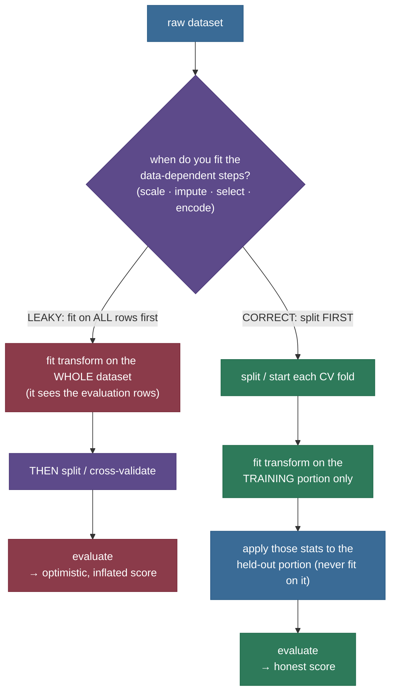

# Data Leakage: when your model studies with the answer key

Your notebook says **95%**. You ship the model. In the real world it does **70%**. Nothing about the model changed — same weights, same code — but a quarter of its accuracy evaporated the moment it met data it hadn't secretly seen before. That 25-point cliff is the most expensive bug in applied machine learning, and its most common cause has a name: **data leakage** — at *training* time, the model had access to information it will *not* have at *prediction* time, so the score it earned was never real.

Here is the trap in its purest, measured form. I built a dataset of **pure noise** — 200 rows, 5,000 columns of random Gaussian numbers, and a **coin-flip label** with no relationship to any column. There is no signal to find; the best any honest model can do on new data is **chance, 50%**. Then I ran a completely ordinary-looking pipeline: pick the 50 features most correlated with the label, cross-validate a classifier on them. It reported **86% accuracy.**

![A bar chart with three bars on a pure-noise dataset whose honest accuracy is chance. The first bar, LEAKY CV (select features on all data then cross-validate), reaches 0.86 and is coloured red; a double-headed arrow spans from it down to the second bar labelled 'inflation +38 points of pure fiction'. The second bar, HONEST CV (select inside a Pipeline, per fold), sits at 0.48, green. The third bar, HONEST hold-out on an untouched test set, sits at 0.53, blue. A dashed amber line marks chance at 0.50 — the honest truth, since the data is pure noise.](images/dataprep11_leaky_vs_honest.png)

That 86% is **pure fiction** — thirty-six points of skill on a problem with zero skill available. Do the *identical* steps the correct way (which we'll build below) and the score collapses to **48%**, dead on chance, confirmed by an untouched hold-out at 53%. Same data, same model, same number of features. The only thing that changed was *where the feature selection was allowed to look* — and that one detail was the difference between a lie and the truth.

That gap — inflated score, honest truth, and the discipline that separates them — is what this chapter is about. Leakage is not a property of your model; it is a property of your **protocol**. It is the single most reliable way to fool yourself in ML, which is exactly why it is one of the most-asked applied interview questions: it separates people who have *shipped* models from people who have only *fit* them.

> **The one-sentence core.** *Data leakage is any information available to the model at training time that will **not** be available at prediction time; it makes your validation score **optimistically biased** — great in the notebook, collapsing in the real world — and the cure is not a better model but a better protocol: **fit every data-dependent step (scale, impute, select, encode, target-statistics) using only the training portion of each split, and split time-ordered data by time**, which scikit-learn's `Pipeline` + correct cross-validation enforces structurally.*

I'll teach this the way I'd teach it at a whiteboard — **felt problem first** (a score you can't reproduce, measured on noise where the truth is *known*), then **intuition** (studying with the answer key taped inside your textbook), then the **mechanism** (where leakage physically enters a split or a CV loop, with a diagram), then the **taxonomy** (the four doors it walks through and *why each one inflates the estimate*), then three **worked, measured demos** — preprocessing leakage, target leakage on real medical data, and temporal leakage — each with the leaky number, the honest number, and the fix, then **pitfalls**, then the real-world **horror stories**. By the end you'll be able to:

- **define** leakage precisely (train-time access to prediction-time-unavailable information) and explain *why* it biases the estimate optimistically;
- name the **taxonomy** — preprocessing/train-test contamination, target (feature) leakage, temporal leakage, group/duplicate contamination — and say *why each* inflates a cross-validated score;
- **measure** a leak: build the honest protocol alongside the leaky one and read off the gap (0.86 → 0.48 on noise, 1.00 → 0.96 on real data, 0.97 → 0.69 R² on a time series);
- write the **correct protocol** — every transform inside a `Pipeline`, cross-validated; `TimeSeriesSplit` for time-ordered data — and explain why it makes leakage structurally impossible;
- spot the **red flag** in an interview: *a great score you can't reproduce out-of-sample is leakage until proven otherwise.*

---

## The problem: a score you cannot reproduce

Every practitioner meets leakage the same way: a model that is *too good*. Validation accuracy is suspiciously high, the ROC curve hugs the corner, and for a moment you believe you're brilliant. Then the model touches genuinely new data — a later month, a different hospital, actual real-world traffic — and the number falls off a cliff. The gap between the two is almost always leakage: at fit time the model drank in something it won't have at predict time.

The reason leakage is so dangerous is that **it is invisible in a single number.** A leaky 86% and an honest 86% look identical on the page. You cannot tell a real score from an inflated one by staring at it; the inflation only becomes visible when you build the *honest* protocol next to the leaky one and watch the number move. That is the entire method of this chapter, and it is why I opened on **pure noise**: when the data has no signal, the honest answer is *provably* chance (0.50), so every point above 0.50 is leakage you can *measure*, not merely suspect. The 86% in the figure above is 36 measured points of pure protocol error.

> **Why start on noise, not a real dataset?** Because to *prove* a number is inflated you need to know the true answer, and the only dataset whose true answer you know exactly is one with no signal — there, truth is chance by construction. It is the strongest possible scientific control: any excess is leakage, full stop. The very next demos move to **real** data (a medical dataset, a realistic time series) where the same mechanism costs real, measured accuracy — but the noise experiment is what lets us see the mechanism naked, with nothing else going on.

---

## Intuition first: the answer key taped inside the textbook

Forget cross-validation folds for a moment. You already understand leakage from school.

Imagine studying for an exam with a textbook that has **the answer key taped inside the back cover.** You do the practice problems, glance at the key, and score 98% on every practice test. You feel ready. Then you walk into the real exam — no key — and score 70%. Were you ever a 98% student? No. The 98% measured your ability to *read the answer key*, not your ability to *solve problems*. The practice score was inflated by information (the answers) that was available while you *studied* but gone when it *counted*.

That is exactly data leakage, and the mapping is precise:

- **The practice test** is your validation/test set — the stand-in for the real exam (the real world).
- **The answer key taped inside** is any information that leaked from those evaluation rows into training. In the noise demo, the "answer key" was the *feature selection* peeking at which columns correlated with the label *across all rows, including the ones it would later be scored on.*
- **The inflated practice score** is your leaky validation accuracy. **The real exam** is the real world, where the key is gone and the true ability shows.
- **The fix** is to study with the answer key *removed* — do your practice problems using only what you'll have in the real exam. In ML: fit every data-dependent step using only the *training* rows of each split, so the model never glimpses the evaluation rows while learning.

The analogy holds up under pressure, which is how you know it's a good one:

- **"But I only *selected features* on all the data — I didn't train on the test labels directly."** Reading the answer key doesn't mean copying it verbatim either; it means *any* look at the answers shapes your practice score upward. Feature selection on all rows *uses the test rows' relationship to the label* to choose columns — a look at the key. So does fitting a scaler's mean on all rows, or computing a target-mean encoding over the whole dataset. Every one is a peek.
- **"Where does the analogy break?"** A student *knows* they glanced at the key; leakage is insidious precisely because it's *silent* — the peek is buried inside a `fit_transform` call that ran before your split, and nothing errors. That silence is why leakage needs a *structural* fix (a `Pipeline`), not just good intentions.

Hold onto the image: **the answer key must be gone while you study.** Everything below is machinery for guaranteeing it's gone.

---

## The mechanism: where leakage enters a split

Before the taxonomy, the *shape* of the failure — because leakage always enters at one specific place: **a data-dependent step that is fit using rows it will later be evaluated on.**

A "data-dependent step" is anything that *learns something from the data* before the model does: a scaler learning a mean and standard deviation, an imputer learning a column median, a feature selector learning which columns correlate with the label, a target/mean encoder learning per-category label averages, even a PCA learning principal axes. Each of these has a `fit` (learn statistics) and a `transform` (apply them) — exactly like a model. And exactly like a model, **it must be fit on the training data only.**



The left path is the bug: `fit_transform(X)` on everything, *then* split. The transform has now seen the evaluation rows, so when you score on them the model has an unfair whisper of their distribution. The right path is the cure: split *first*, fit the transform on the training portion, apply those frozen statistics to the held-out portion. The held-out rows influence *nothing* about how they're processed — which is precisely the situation in the real world, where they don't exist yet.

Cross-validation makes this subtler and more dangerous, because it's easy to fit a transform *once* on all the training data and then cross-validate — and every fold's validation portion has still leaked into that transform. The transform must be **re-fit inside each fold**, on that fold's training rows only:

![A schematic with two panels. Left panel, titled LEAKY: fit the transform BEFORE the split, shows five cross-validation folds stacked vertically; each fold is a bar with one amber validation block and the rest blue training blocks, the amber block sliding across the five folds. Beneath all five folds a single red band spans the full width, labelled 'transform / feature-selection FIT on ALL rows (incl. every val block)', with red arrows rising from it into every fold's validation block — the contamination. Right panel, titled CORRECT: fit the transform INSIDE each fold, shows the same five folds, but a green 'fit' marker sits only over each fold's training blocks, never over its amber validation block — so the transform never sees the rows it is scored on.](images/dataprep11_where_leakage_enters.png)

The left panel is why "I did use cross-validation" is not a defense against leakage: if the transform was fit once, before the loop, on all the data (the red band), then *every* fold's validation block (the arrows) was contaminated. The right panel is the fix — the green fit-markers touch only training blocks. This is exactly what a scikit-learn `Pipeline` handed to `cross_val_score` does automatically, and why the fix is *structural*: you stop being able to make the mistake.

> **Source / derivation:** the discipline that every data-dependent preprocessing step must be fit inside the resampling loop — never once on all the data — is the core message of [James, Witten, Hastie & Tibshirani, *An Introduction to Statistical Learning*, Ch. 5 "Resampling Methods"](https://www.statlearning.com/) (free PDF), and is spelled out in devastating detail in [Hastie, Tibshirani & Friedman, *The Elements of Statistical Learning*, §7.10.2 "The Wrong and Right Way to Do Cross-validation"](https://hastie.su.domains/ElemStatLearn/) (free PDF). The structural cure is scikit-learn's [`Pipeline`](https://scikit-learn.org/stable/modules/compose.html) and [Common pitfalls: data leakage](https://scikit-learn.org/stable/common_pitfalls.html#data-leakage).

---

## The taxonomy: the four doors leakage walks through

Leakage is one idea — train-time access to prediction-time-unavailable information — but it enters through four recognizable doors. Naming them is the interview-grade version of this topic.

**1. Preprocessing leakage (train/test contamination).** A data-dependent transform is fit on data that includes the evaluation rows — the mechanism above. Fitting a `StandardScaler`, an imputer, `SelectKBest`, or a target encoder on the whole dataset before splitting, or once before a CV loop. *Why it inflates:* the transform encodes statistics of the evaluation rows (their mean, their label-correlation), so the model is evaluated on rows it partially shaped. This is our **Demo 1**, and the mildest-looking yet most pervasive door.

**2. Target (feature) leakage.** A *feature* is a proxy for, or is computed from, the label — information that in reality only exists *after* the outcome you're predicting. Classic examples: a "was_contacted_by_collections" flag when predicting loan default (you only get contacted *because* you defaulted); a lab test that is ordered *because* the diagnosis is suspected; a `total_charges` column when predicting whether a customer churned (charges accrue over a tenure that ends at churn). *Why it inflates:* the feature carries the answer, so the model looks brilliant — but the feature won't exist at prediction time (you're predicting *before* the outcome), so in the real world the model loses its crutch. This is our **Demo 2**, on real medical data.

**3. Temporal leakage.** For time-ordered data, training on rows from the *future* relative to the rows you predict. A random (shuffled) train/test split, or plain K-fold CV, scatters future observations into the training set, so the model interpolates answers it should have to *forecast*. *Why it inflates:* real forecasting only ever has the past; a shuffled split hands the model the future, which it cannot have in the real world. This is our **Demo 3**.

**4. Group / duplicate contamination.** The same entity appears in both train and test — near-duplicate rows, multiple visits by the same patient, augmented copies of the same image, the same user split across folds. *Why it inflates:* the model memorizes the entity in training and "recognizes" it in test, scoring on identity rather than generalization. The fix is *grouped* splitting (scikit-learn's [`GroupKFold`](https://scikit-learn.org/stable/modules/cross_validation.html#group-cv)) so an entity is never on both sides.

All four are the same disease with different symptoms: **the evaluation is optimistic because the model had, at fit time, information tied to the evaluation rows or to the future.** The next section makes "optimistic" precise.

---

## The math: why leakage inflates the estimate

We evaluate a model to estimate its **generalization performance** — how well it will do on genuinely new data drawn from the same distribution. Formally, for a model $\hat{f}$ trained on a sample, the quantity we care about is the expected error (or accuracy) on an independent draw:

$$\text{Err} = \mathbb{E}_{(x,y)\sim \mathcal{D}}\big[\,L\big(y,\ \hat{f}(x)\big)\,\big],$$

where $L$ is the loss and $(x, y)$ is a *fresh* example the model has never touched. A validation or cross-validation score $\widehat{\text{Err}}$ is an **estimator** of $\text{Err}$, and it is only trustworthy if it is (approximately) **unbiased** — if, on average, it neither over- nor under-states the truth.

The whole game is the phrase *"a fresh example the model has never touched."* An honest protocol guarantees the held-out rows were **independent** of everything the model learned — the model's fit, and every data-dependent transform's fit. Under that independence, $\widehat{\text{Err}}$ is (nearly) unbiased for $\text{Err}$: what you measure is what you'll get.

Leakage **breaks the independence.** When a transform is fit on all the data, the processing of a held-out row $x_i$ depends on $x_i$ itself (and on its label $y_i$, if selection or target-encoding used labels). The held-out rows are no longer fresh — the model was tuned, however slightly, *toward* them. So the estimator becomes **optimistically biased**:

$$\mathbb{E}\big[\widehat{\text{Err}}_{\text{leaky}}\big] \;<\; \text{Err} \qquad\Longleftrightarrow\qquad \mathbb{E}\big[\widehat{\text{Acc}}_{\text{leaky}}\big] \;>\; \text{Acc}.$$

The left form is for a *loss* (the estimated error is too *low*); the right is the equivalent statement for *accuracy* (the estimated accuracy is too *high*) — and since every demo below reports accuracy (or R²), the right-hand inequality, $\mathbb{E}[\widehat{\text{Acc}}_{\text{leaky}}] > \text{Acc}$, is the one you'll see in the numbers: leaky > honest, every time.

The size of the bias grows with *how much* of the evaluation rows' information leaked in. This is exactly what the noise demo measures, and it is why the leak *scales with $k$*:


Read the two curves. The **honest** curve (green) sits at chance for *every* $k$ — per-fold selection can never exploit the held-out rows, so no amount of selection buys fake accuracy. The **leaky** curve (red) climbs from 0.59 toward 0.96 as $k$ grows: the more noise columns you let the selector cherry-pick *from the whole dataset*, the better it fits the specific test folds it peeked at, and the bigger the lie. The bias isn't a fixed offset — it's a dial, and *you* set it by how much leakage you allow. On pure noise, where $\text{Err}$ corresponds to exactly 0.50 accuracy, the entire red curve above the amber line is measured optimistic bias.

Two consequences worth stating precisely:

- **You cannot detect leakage from the leaky number alone.** $\widehat{\text{Err}}_{\text{leaky}} = 0.86$ is not self-evidently wrong; it looks like a good model. Detection *requires* computing the honest estimator too and comparing — which is why "build the honest protocol and watch the number move" is the method, not an afterthought.
- **Leakage is about the protocol, not the model.** Nothing above depended on which classifier we used. Swap logistic regression for a random forest and the noise demo still reports ~0.86 leaky, ~0.50 honest. A "great" score that you can't reproduce out-of-sample is a protocol red flag, full stop.

> **Source / derivation:** the formal treatment of leakage — a taxonomy, why it produces optimistically biased performance estimates, and how to detect and avoid it — is [Kaufman, Rosset, Perlich & Stitelman, "Leakage in Data Mining: Formulation, Detection, and Avoidance," *ACM TKDD* 6(4), 2012 (KDD 2011)](https://dl.acm.org/doi/10.1145/2382577.2382579) (author copy [free PDF](https://www.cs.umb.edu/~ding/history/470_670_fall_2011/papers/cs670_Tran_PreferredPaper_LeakingInDataMining.pdf)). The optimism of a resubstitution/contaminated estimate versus a properly held-out one is developed in [*The Elements of Statistical Learning*, Ch. 7 (esp. §7.10.2)](https://hastie.su.domains/ElemStatLearn/). A large-scale survey of leakage *silently invalidating published ML results* across scientific fields is [Kapoor & Narayanan, "Leakage and the Reproducibility Crisis in ML-based Science," 2022](https://arxiv.org/abs/2207.07048).

---

## Demo 1, explained: preprocessing leakage in code

The headline demo is worth reading as code, because the leaky version looks *completely reasonable* — that's the point. The full typed module is [`data_leakage.py`](code/data_leakage.py) and the stepwise notebook is [the step-by-step teaching notebook](code/data-leakage.ipynb). The leaky protocol:

```python
# LEAKY: select the 50 "best" features on the WHOLE dataset, THEN cross-validate
x_selected = SelectKBest(f_classif, k=50).fit_transform(x, y)   # <-- sees every row, incl. eval folds
leaky_cv = cross_val_score(clf, x_selected, y, cv=5).mean()     # 0.860 on pure noise (FICTION)
```

`SelectKBest.fit_transform(x, y)` ranks all 5,000 columns by their correlation with the label **across all 200 rows** and keeps the top 50. Those 50 columns were chosen *using* the very rows the subsequent cross-validation scores on — the answer key was taped inside. The honest version moves selection inside a `Pipeline`, so `cross_val_score` re-fits it on each fold's training rows only:

```python
# HONEST: selection lives INSIDE the pipeline → re-fit on each training fold only
pipe = Pipeline([("select", SelectKBest(f_classif, k=50)), ("clf", clf)])
honest_cv = cross_val_score(pipe, x, y, cv=5).mean()            # 0.480 on pure noise (the truth)
```

The measured result, reproducible from the seed:

```
  leaky   CV accuracy (select on ALL data, then CV) : 0.860   <- inflated FICTION
  honest  CV accuracy (select INSIDE the Pipeline)   : 0.480   <- the truth (~chance)
  honest  hold-out accuracy (untouched test set)     : 0.533   <- confirms it
  measured inflation gap                             : +0.380
```

The only difference between the two blocks is a `Pipeline`, and it moves the reported accuracy by **38 points** — from a confident lie to the honest truth, corroborated by a hold-out that never entered either computation. This is the whole chapter in six lines of code.

> **On reproducibility.** All numbers on this page are from a single seed (42), so the exact figures (0.86, 0.48, …) are one-run point estimates and will wobble a little with the seed. The claim that *matters* — **leaky > honest** — is not a lucky draw: it is enforced by assertions in the module and reproduces across seeds, because on pure noise the honest score is chance *by construction*, so any excess is leakage no matter the seed. You'd pin the precise numbers down with more repeats; the *direction and mechanism* are what's robust.

---

## Demo 2: target leakage on real medical data

Preprocessing leakage needed noise to make the truth knowable; **target leakage** shows up on real data all the time, so we measure it there. We take the real [Breast Cancer Wisconsin dataset](https://scikit-learn.org/stable/datasets/toy_dataset.html#breast-cancer-wisconsin-diagnostic-dataset) that ships with scikit-learn (569 patients, 30 genuine cell-nucleus measurements) and append **one realistic leaky column**: a "confirmatory marker" that is really recorded *after* the biopsy — the kind of field that ends up in a training table because it was in the database, but that does not exist when you predict on a *new* patient. We build it as the label plus a little noise, so it is a near-copy of the answer.

![A two-panel figure on real Breast Cancer data. Left panel: three accuracy bars. '30 REAL features only (honest)' at 0.963 in green; 'REAL + leaked column (inflated)' at 1.000 in red; 'LEAKED column ALONE' at 1.000 in slate. Right panel: a histogram of the injected leaked column's value, split by diagnosis into two cleanly separated humps — class 0 clustered near 0 in red, class 1 clustered near 1 in blue, with almost no overlap; the caption notes the absolute correlation with the label is 0.97, a near-copy of y.](images/dataprep11_target_leak.png)

The measured result:

```
  |corr(leaked column, label)|                 : 0.972  (it is a near-copy of y)
  accuracy WITH the leaked column              : 1.000   <- inflated
  accuracy on the 30 REAL features only        : 0.963   <- honest
  accuracy using ONLY the leaked column        : 1.000   <- it IS the answer
```

Read it as a detective would. The model **with** the leak posts a perfect **1.00** — a score that should always make you suspicious, not proud. The smoking gun is the last row: the leaked column **alone**, with the 30 real features thrown away entirely, *also* scores 1.00. A single "feature" that predicts the diagnosis perfectly is not a feature — it *is* the label, wearing a disguise (the right panel shows it: two cleanly separated humps, one per class). Drop that one column and you're back to the honest **0.96** that the real measurements genuinely support.

The lesson is the deepest one in the chapter: **the cure for target leakage is not a clever transform — no `Pipeline` catches it — it is domain knowledge.** You must ask of every feature, *"will this value exist, and be correct, at the moment I need to predict?"* If a column is populated *because of* or *after* the outcome, it leaks, and it must be removed. Here the honest gap is small (0.96 → 1.00) only because breast-cancer diagnosis is genuinely easy; imagine a problem where the honest model is a mediocre 0.70 — a leak like this would dress it up as a flawless 1.00, you'd ship it, and it would fail catastrophically the day the leaky column wasn't there. The danger of target leakage is exactly that it hides how bad your real model is.

---

## Demo 3: temporal leakage — training on the future

The third door is **time**. When observations are ordered in time and you're forecasting the future from the past, a *random* split is a leak: it scatters future days into the training set, letting the model interpolate answers it should have to predict. We simulate a realistic daily series — an upward **trend**, a **weekly** cycle, and **autocorrelated** noise (today looks like yesterday), the three ingredients real series have — and predict each day from its previous seven, two ways: a shuffled K-fold split, and a forward-chronological `TimeSeriesSplit`.

![A three-part figure on 730 days of a realistic series (trend plus weekly season plus autocorrelated noise). Top-left: the series plotted over time, with the first 80 percent shaded blue and labelled 'train = the PAST' and the last 20 percent shaded amber and labelled 'test = the FUTURE' — the honest forward split, one clean cut. Bottom-left: the same series with a shuffled split, where 20 percent of days are marked as red test points sprinkled BETWEEN the blue training points across the whole timeline — so almost every test day has training neighbours on both sides. Right: two R-squared bars — shuffled K-fold (leaky) at 0.97 in red, forward TimeSeriesSplit (honest) at 0.69 in green, an inflation of +0.28 R-squared.](images/dataprep11_temporal_leak.png)

The measured result:

```
  shuffled K-fold R^2 (trains on the FUTURE)   : 0.968   <- inflated
  forward TimeSeriesSplit R^2 (past -> future) : 0.692   <- honest
  measured inflation gap                       : +0.276
```

The bottom-left panel is *why*: under the shuffled split, nearly every red test day has blue training days on **both sides** of it in time. Because neighbouring days are similar (trend + season + autocorrelation), the model barely has to forecast — it interpolates between the surrounding training points and all but reads the answer off them, so R² looks superb at **0.97**. The forward split (top-left) is the honest forecasting task: train only on the past, predict the genuinely unseen future — and R² falls to **0.69**, the number you'd actually get tomorrow. Shuffling time-ordered data hands the model a time machine; `TimeSeriesSplit` takes it away.

> **Source / derivation:** the correct evaluation of time-ordered data — train strictly on the past, never shuffle — is scikit-learn's [`TimeSeriesSplit`](https://scikit-learn.org/stable/modules/generated/sklearn.model_selection.TimeSeriesSplit.html) and the [time-series cross-validation guide](https://scikit-learn.org/stable/modules/cross_validation.html#cross-validation-of-time-series-data); the forecasting-methodology treatment of why random splits leak in temporal problems is [Hyndman & Athanasopoulos, *Forecasting: Principles and Practice*, §5.10 "Time series cross-validation"](https://otexts.com/fpp3/tscv.html) (free online).

---

## The fix: one habit, enforced by a Pipeline

Three different leaks, one discipline: **every data-dependent step must be fit using only the training portion of each split — and the split must respect time.** In scikit-learn that is two concrete rules and one judgment call:

1. **Put every transform inside a `Pipeline`, and cross-validate the pipeline** — never `fit_transform` on all the data first. Scaling, imputation, feature selection, encoding, target statistics, dimensionality reduction: all of it goes inside, so all of it is re-fit per fold on training rows only.
2. **Split time-ordered data by time** (`TimeSeriesSplit`), and group-structured data by group (`GroupKFold`) — never plain-shuffle when rows are tied by time or entity.
3. **Drop any feature that won't exist, or won't be correct, at prediction time** — the domain-knowledge check no library can do for you.

The honest template, in full, is the pattern to reach for every single time:

```python
from sklearn.pipeline import Pipeline
from sklearn.preprocessing import StandardScaler
from sklearn.feature_selection import SelectKBest, f_classif
from sklearn.model_selection import cross_val_score

honest = Pipeline([
    ("scale",  StandardScaler()),               # fit on each training fold only
    ("select", SelectKBest(f_classif, k=50)),   # fit on each training fold only
    ("clf",    LogisticRegression(max_iter=1000)),
])
score = cross_val_score(honest, x, y, cv=5).mean()   # every transform saw only training rows
```

The point of the `Pipeline` is not convenience — it is that it makes the leak *structurally impossible to commit*. You literally cannot fit the scaler or the selector on the validation rows, because `cross_val_score` hands each fold's training rows to `pipeline.fit` and its validation rows only to `pipeline.predict`. The discipline is enforced by the machinery, not by your memory at 2 a.m.

> **Source / derivation:** the `Pipeline` (and [`ColumnTransformer`](https://scikit-learn.org/stable/modules/generated/sklearn.compose.ColumnTransformer.html) for per-column transforms) as the mechanism that fits all preprocessing inside the training folds is documented in scikit-learn's [Pipelines and composite estimators](https://scikit-learn.org/stable/modules/compose.html) and its [Common pitfalls: how to avoid data leakage](https://scikit-learn.org/stable/common_pitfalls.html#how-to-avoid-data-leakage) guide.

---

## Pitfalls and failure modes

The specific ways leakage sneaks in, each with the fix.

**1. `fit_transform` on all the data before splitting.** The classic. `X = scaler.fit_transform(X)` (or an imputer, or `SelectKBest`) and *then* `train_test_split`. The transform saw the test rows. *Fix:* split first, or put the transform in a `Pipeline` and cross-validate the pipeline. **Split before you fit anything.**

**2. Fitting preprocessing once, then cross-validating.** Even with a proper split, if you fit the scaler/selector *once* on all the training data and then run CV, every fold's validation portion leaked into that transform (the red band in the mechanism figure). *Fix:* the transform must be re-fit *inside* each fold — which a `Pipeline` handed to `cross_val_score` does automatically.

**3. A feature that is a proxy for, or computed from, the label.** Target leakage — the collections flag, the post-diagnosis lab, the `total_charges` that only accrues until churn. Near-perfect accuracy is the symptom. *Fix:* for every feature ask, *"is this known, and correct, before the outcome I'm predicting?"* Drop anything populated because of or after the label. Check: a single feature that predicts the target almost perfectly is a leak until proven otherwise.

**4. Shuffling time-ordered data.** A random split or plain K-fold on a time series trains on the future. *Fix:* `TimeSeriesSplit`; build features from strictly past information (lags, expanding windows that don't peek forward); and never compute a "global" rolling statistic over the whole series.

**5. The same entity in both train and test.** Multiple rows per patient/user/session, near-duplicates, augmented image copies — the model memorizes the entity and "recognizes" it in test. *Fix:* `GroupKFold` / group-aware splitting so an entity is never on both sides; deduplicate before splitting.

**6. Leakage through the target's own history / label encoding.** Target-mean (target) encoding of a categorical feature fit on all rows leaks the label into the feature. *Fix:* fit the encoder inside the CV fold (or use out-of-fold / smoothed encoding), never on the full dataset.

**7. Tuning hyperparameters on the test set.** Using the *test* set to pick `k`, the threshold, the model — then reporting test performance. The test set has now trained you. *Fix:* a three-way split (train / validation / test) or nested cross-validation; the test set is touched **once**, at the very end. See [10 Train/Validation/Test Splits](/ai-ml/ai-ml-learning-resources/foundations/data-preparation/train-validation-test-splits/train-validation-test-splits).

**8. Trusting a single, un-reproduced great score.** The deepest pitfall is *believing* a number that's too good. *Fix:* treat any surprisingly high score as guilty until proven innocent — build the honest protocol beside it, check an untouched hold-out, and confirm the number reproduces out-of-sample before you celebrate.

---

## Where it matters, and real-world horror stories

Leakage is not an academic curiosity — it has invalidated competitions, published papers, and production systems, and knowing the war stories is the interview-grade version of this topic.

- **Kaggle competitions decided by leaks.** Leakage is so common in competitions that Kaggle teaches [a dedicated lesson](https://www.kaggle.com/code/alexisbcook/data-leakage) on it. Multiple contests have been won — or had to be *re-run* — because a leaked column (a row ID correlated with the target, a timestamp, a proxy feature) let a model "predict" the answer. The pattern is always the same: a leaderboard score that no honest model could reach, because the winning feature won't exist at deployment.
- **The ML reproducibility crisis.** Kapoor & Narayanan surveyed [leakage across scientific fields](https://arxiv.org/abs/2207.07048) — civil war prediction, medicine, genomics, neuroimaging — and found **hundreds of papers** whose headline results were inflated by leakage (train/test contamination, temporal leaks, duplicated subjects), often collapsing to near-baseline once fixed. Leakage isn't just *your* bug; it's a field-wide one.
- **Medicine and credit.** A sepsis model that uses a lab test *ordered because clinicians already suspected sepsis*; a churn model that uses charges accrued *up to the churn date*; a fraud model that uses a "chargeback" field populated *after* the fraud was confirmed. Each looks superb offline and fails the moment it faces a *new* case where that after-the-fact field is empty.
- **Train/serve skew in production.** Even a leak-free training pipeline leaks if the *serving* pipeline computes features differently — e.g., a feature normalized against statistics that included future data in training but only past data at serving. This is where leakage meets MLOps: your training and serving code must compute every feature identically, from information available at prediction time. See [14 Deployment & MLOps](/ai-ml/ai-ml-learning-resources/deployment-and-mlops/readme) and [Data and Concept Drift Detection](/ai-ml/ai-ml-learning-resources/deployment-and-mlops/monitoring-and-reliability/data-and-concept-drift-detection/data-and-concept-drift-detection).

**When to be paranoid:** any time your score jumps unexpectedly, any time a single feature dominates, any time you're working with time-ordered or grouped data, and any time a transform is fit outside a `Pipeline`. The move is always the same — *build the honest protocol next to the suspicious one and see if the number survives.*

That is why this chapter sits at the heart of preprocessing: every other step (scaling, imputation, encoding, selection) is a *data-dependent transform*, and every one of them is a leakage risk unless it's fit inside the training folds. Getting leakage right is what makes every other number in your notebook trustworthy.

---

## Recap and rapid-fire

**If you remember nothing else:** data leakage is train-time access to information you won't have at prediction time; it makes your validation score **optimistically biased** — great in the notebook, collapsing in the real world. On pure noise (honest truth = chance), selecting features on all data before CV reported **0.86**; the `Pipeline` fix reported **0.48**, confirmed by a hold-out at **0.53**. On real medical data, a proxy-of-the-label column took accuracy to **1.00** (and predicted the label **1.00** on its own); dropping it returned the honest **0.96**. On a time series, a shuffled split scored **0.97** R²; a forward `TimeSeriesSplit` scored **0.69**. The cure is a **protocol**, not a model: fit every data-dependent step on training rows only (put it in a `Pipeline`, cross-validate the pipeline), split time-ordered data by time, and drop features that won't exist at prediction time.

**Quick-fire — say these out loud:**

- *What is data leakage?* Any information available to the model at training time that won't be available at prediction time — it makes your validation score optimistically biased.
- *Name the main types.* Preprocessing/train-test contamination (transform fit on all data), target/feature leakage (a proxy for the label), temporal leakage (training on the future), and group/duplicate contamination (same entity in train and test).
- *Why does fitting a scaler on all the data leak?* The transform encodes statistics of the evaluation rows, so those rows are no longer independent of the fit — the estimate becomes optimistic.
- *You cross-validated, so you're safe from leakage — true?* No. If a transform was fit once before the CV loop, every fold's validation rows leaked into it. The transform must be re-fit inside each fold — use a `Pipeline`.
- *A single feature predicts your target almost perfectly. Reaction?* Suspect target leakage — that feature is probably the label in disguise or a post-outcome proxy. Check whether it exists at prediction time.
- *How do you evaluate a time-series model?* Split by time (`TimeSeriesSplit`) — train on the past, predict the future. Never shuffle; a random split trains on the future.
- *How does a `Pipeline` prevent leakage?* `cross_val_score` fits the whole pipeline on each fold's training rows and only predicts on the validation rows, so every transform is fit on training data only — structurally, you can't leak.
- *You get 99% in the notebook and 70% in the real world. First hypothesis?* Data leakage — build the honest protocol, check an untouched hold-out, and see whether the 99% reproduces.
- *Is leakage a model problem or a protocol problem?* A protocol problem — it doesn't depend on the model; swap the classifier and the leak persists.

---

## Code and the runnable notebook

Everything on this page is produced by real code you can run and teach from — a clean typed module and a step-by-step executed notebook that mirrors it one measurement at a time:

- **[Step-by-step teaching notebook](code/data-leakage.ipynb)** — 13 numbered steps (0–12) plus a recap, each an intuition lead-in plus one focused cell with real output: the noise dataset whose honest answer is chance, the leaky feature-selection protocol (0.86) and the `Pipeline` fix (0.48), the hold-out confirmation, the leak-grows-with-*k* sweep, the real Breast Cancer target leak (1.00 → 0.96 and the smoking-gun leaked-column-alone), the temporal leak (0.97 → 0.69 R²) with the shuffled-vs-forward split picture, and the unifying honest template. Executes headless with zero errors.
- **[The load-bearing module](code/data_leakage.py)** — every function used above, typed and asserted; run it with `python data_leakage.py` to reproduce all the printed numbers (the three leaks, each with leaky score, honest score, and the assertion that leaky > honest).
- **The figure generator** (`02. Data_Preprocessing/tools/make_figures_11.py`) — regenerates all five figures from the same real pipelines; no number is hand-typed.

---

## References and further reading

The curated link library for this topic — start-here path, videos, courses, articles, and the source/derivation citations above — lives in a companion file so it can be reused as a standalone reference list, and every "Source / derivation" citation on this page appears in it:

**→ [Data Leakage — references and further reading](/ai-ml/ai-ml-learning-resources/foundations/data-preparation/data-leakage/data-leakage#references-further-reading)**
