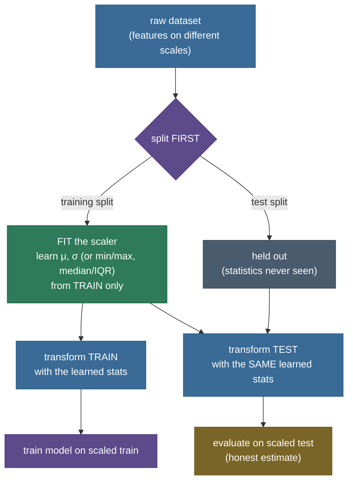

# Feature Scaling & Normalization: putting every feature on the same ruler

You have a real dataset: **178 wines**, each described by **13 chemical measurements** — alcohol content (around 11–15), magnesium (70–160), colour intensity (1–13), and *proline*, an amino acid, measured in the **hundreds to nearly two thousand**. You want to classify each wine's cultivar with a nearest-neighbour model: to label a new wine, find the most similar wines you've already seen and copy their answer. "Most similar" means *closest*, and closest means the smallest Euclidean distance across all 13 features.

Here is the trap, and it is measured, not hypothetical. Euclidean distance adds up squared differences feature by feature — and a difference of "400 in proline" produces a vastly bigger squared number than a difference of "2 in colour intensity," purely because proline's *units* are bigger. Run the numbers on this exact dataset and **proline alone accounts for 99.7% of the distance between two wines.** The other twelve measurements — every one of them potentially informative — contribute a combined 0.3%. Your "13-feature" model is, without you telling it to, a **one-feature** model. And it shows: that nearest-neighbour classifier scores **72%** on held-out wines. Put every feature on a common ruler first and the *same* model, *same* data, jumps to **96%**.

That gap — 72% to 96%, from nothing but a change of units — is what this chapter is about. Feature scaling is the humble, mechanical step that closes it, and knowing exactly **which models need it, which don't, and why** is one of the most reliably-asked questions in applied ML.

> **The one-sentence core.** *Distance-based and gradient-based models read features in whatever **units** you give them, so a large-magnitude feature silently dominates; **scaling** rewrites every feature onto a common ruler — standardization to mean 0/std 1, min-max to [0,1], or robust to median 0/IQR 1 — changing the ruler without changing the information, and you always fit the ruler on the **training split only**.*

I'll teach this the way I'd teach it at a whiteboard, on the real Wine dataset the whole way through — every number below comes from an executed cell you can re-run. We go **felt problem first** (one feature eating the entire distance — measured), then **intuition** (the common-ruler idea, before any formula), then the **mechanism** (fit statistics on train, transform both splits), then the **math** of the three scalers derived and compared, then **from-scratch code** cross-checked against scikit-learn, then the **measured effect on real models** — KNN and an SVM leaping, a random forest not budging — and finally *why* it happens (distorted neighbourhoods; ill-conditioned gradient descent). By the end you'll be able to:

- explain **why** distance- and gradient-based models are scale-sensitive, using a number you measured (proline = 99.7% of the distance);
- **derive** standardization $z=(x-\mu)/\sigma$, min-max, and robust scaling, and say what each does to the distribution and to outliers;
- name **which models need scaling** (KNN, k-means, SVM, PCA, neural nets, anything gradient-based, L1/L2-regularized models) and **which don't** (trees and tree ensembles), and *why* trees are immune;
- state the **fit-on-train-only** rule and why fitting on all the data leaks;
- read a measured before/after table and explain a **+24-point** accuracy jump to a peer.

---

## The problem: one feature is eating the whole distance

Let's make "large-magnitude feature dominates" concrete and measured, on the real [Wine dataset](https://scikit-learn.org/stable/datasets/toy_dataset.html#wine-recognition-dataset) that ships inside scikit-learn (178 wines, 13 real chemical measurements, 3 cultivars — no download, fully reproducible). The two faces of the problem:

![Left: a horizontal bar chart, log x-axis, of the range (max minus min) of each of the 13 Wine features. proline towers at a range near 1,237, magnesium near 92, down to nonflavanoid_phenols near 0.5 — the largest range is 2,474 times the smallest. Right: a grouped bar chart of the share of average squared Euclidean distance owned by each feature; raw proline is 99.7 percent (one giant red bar) while every other feature is near zero, and after standardizing every feature sits near the dotted 7.7 percent fair-share line.](images/dataprep02_scale_disparity.png)

The **left panel** is the raw disparity: `proline`'s range (max − min) is **2,474×** the smallest feature's range. That is not a data error — it's just units. Proline is a concentration measured in one scale; hue is a ratio near 1. Both are perfectly valid; they simply live on different rulers.

The **right panel** is why that matters, and it is the single most important measurement in this chapter. Euclidean distance squared is a **sum over features**: $d(a,b)^2 = \sum_j (a_j - b_j)^2$. Averaged over all pairs of wines, each feature's contribution to that sum is proportional to its **variance** — and proline's variance dwarfs everything. The result: on the raw data, **proline owns 99.73% of the average squared distance between two wines.** The model literally cannot see the other twelve features; they round to zero next to proline. After standardization (blue bars), every feature contributes its fair **~1/13 = 7.7%** — including proline, now at 7.69%. The ruler is even; every feature gets a vote.

> **Why the Wine dataset and not a synthetic example?** Because the whole point is that scaling changes *real model accuracy on real data*, and to show that honestly we need a real dataset with real scale disparity and a real classification task. Wine is the canonical choice — it is scikit-learn's own "importance of feature scaling" example — precisely because its features span thousands-fold in magnitude while all carrying signal. Every distance, every accuracy, every iteration count below is measured on this dataset and reproducible from the seed. Nothing here is asserted; it is all run.

This is the felt problem: **you did not decide proline was 300× more important than colour intensity — its units decided for you.** Scaling is how you take that decision back.

---

## Intuition first: a common ruler, before any formula

Forget the formulas for a moment. The idea is something you already understand from everyday life.

Imagine judging a **decathlon** — ten events, wildly different units. The 100-metre sprint is scored in seconds (around 10–11); the shot put in metres (around 15–20); the javelin in metres too, but around 60–90. If you naively "added up the raw numbers" to rank athletes, the javelin distance would swamp everything — a good javelin throw is numerically 8× a good sprint time, so the ranking would be *almost entirely* a javelin contest, and a world-class sprinter with an average javelin would look mediocre. That is exactly proline dominating the wine distance.

The real decathlon solves this with a **scoring table**: each event's raw performance is converted to points on a common 0–1000-ish scale, so a great sprint and a great javelin are worth *comparable* points. Now the total is a fair combination of all ten events. **Feature scaling is that scoring table.** It converts each feature from its own idiosyncratic units to a common scale, so that when a model combines them — by distance, by weighted sum, by whatever — no single feature dominates *just because its numbers are bigger*.

The analogy holds up under pressure, which is how you know it's a good one:

- **What is the query, and what are the events?** A wine is an athlete; each of the 13 measurements is an event with its own units. Distance between wines is the "combined score" — and without a scoring table, it's a javelin-only contest (proline-only).
- **Does converting to points *lose* information?** No — and this is the crucial, honest point. The decathlon table doesn't change *who is faster*; it just expresses each performance on a comparable scale. Scaling is the same: it is an **affine transform** (shift and stretch) applied to each feature independently. The *ordering* of wines within each feature is untouched, the *correlations* between features are untouched. **Scaling changes the ruler, not the information.**
- **Where does the analogy break?** A decathlon table is hand-designed by officials; a scaler's "table" is computed automatically from the data (the mean and spread of each feature). And there are *several* scaling tables to choose from — standardization, min-max, robust — differing in how they handle the spread and the outliers. Choosing among them is the one real judgement call, and we'll make it precise.

Hold onto the core image: **thirteen features, thirteen different rulers, and a model that can only compare apples to apples.** Scaling hands every feature the same ruler so the comparison is fair.

> **See it in one picture.** scikit-learn's [Compare the effect of different scalers](https://scikit-learn.org/stable/auto_examples/preprocessing/plot_all_scaling.html) lays out the same three scalers on real data side by side — two minutes there and the differences between standard, min-max, and robust click into place.

---

## The mechanism: fit the ruler on train, then transform everything

Before the math, the shape of the operation — because *where* you compute the scaling statistics is as important as the formula, and getting it wrong is a classic, silent bug.

A scaler has two phases, exactly like a model:

1. **Fit** — look at the data and *learn the statistics* the ruler needs (a mean and a standard deviation, or a min and a max, or a median and an IQR — one pair per feature).
2. **Transform** — apply those learned statistics to rewrite the data.

The rule that trips up everyone at least once: **you fit only on the training set, then use those same statistics to transform both the training and the test set.** You do *not* fit the scaler on the test set, and you do *not* fit it on all the data before splitting.



Why fit on train only? Because the test set is a stand-in for **data you haven't collected yet** — data that, in production, does not exist when you build the scaler. If you compute the mean and standard deviation over the *whole* dataset, those statistics are partly shaped by the test rows, so the test set's own values leak into how it gets transformed. Your evaluation is then quietly optimistic: the model saw a whisper of the test distribution through the scaler. It is a mild form of **data leakage**, and we'll measure exactly how mild at the end — small for scaling, but the *habit* (split first, fit on train) is the same habit that saves you from far more dangerous leaks. In scikit-learn this is enforced structurally by fitting the scaler inside a `Pipeline`, which we'll point to.

> **Source / derivation:** the fit-on-training-data-only protocol for all preprocessing — and why fitting on the full dataset contaminates the estimate — is treated in [James, Witten, Hastie & Tibshirani, *An Introduction to Statistical Learning*, Ch. 5 (resampling) and Ch. 6.1](https://www.statlearning.com/) (free PDF), and is the reason scikit-learn provides [`Pipeline`](https://scikit-learn.org/stable/modules/compose.html). The full failure taxonomy is the sibling chapter, [11 Data Leakage](/ai-ml/ai-ml-learning-resources/foundations/data-preparation/data-leakage/data-leakage).

---

## The math, derived: three rulers and what each one does

Now the formulas — three of them, each a different "scoring table," each defined by statistics fit on the training data. Throughout, we work **one feature at a time**: let $x_1, x_2, \dots, x_n$ be the training values of a single feature (say proline across the $n$ training wines), and $x$ any value of that feature (train or test) that we want to rescale.

### The statistics we'll need

- **mean** $\displaystyle \mu = \frac{1}{n}\sum_{i=1}^n x_i$ — the feature's centre of mass.
- **standard deviation** $\displaystyle \sigma = \sqrt{\frac{1}{n}\sum_{i=1}^n (x_i - \mu)^2}$ — its typical spread around the mean. (We use the population form, dividing by $n$; this is scikit-learn's `StandardScaler` convention.)
- **min** and **max** — the smallest and largest training values.
- **median** — the middle value when sorted (the 50th percentile), a centre that ignores how extreme the extremes are.
- **IQR** (interquartile range) $= Q_3 - Q_1$ — the 75th percentile minus the 25th, the spread of the *middle half* of the data, which likewise ignores the tails.

### 1. Standardization (z-score): mean 0, standard deviation 1

$$\boxed{\; z = \frac{x - \mu}{\sigma} \;}$$

Subtract the mean (now the feature is *centred* at 0) and divide by the standard deviation (now its spread is exactly 1). A standardized value is a **z-score**: it says "this point is $z$ standard deviations above (or below) the feature's mean." Proline's raw 1,200 might become $z = +1.1$; its raw 300 might become $z = -1.4$. After standardizing, **every feature has mean 0 and std 1**, so no feature's spread dominates — each contributes an equal share of the distance (the 7.7% we measured).

What it does to the shape: standardization is a pure **shift-and-stretch** (affine map), so it *preserves the distribution's shape exactly* — a skew stays a skew, a bimodal stays bimodal. Crucially, it **does not bound the range and does not resist outliers**: a value that sat 6 standard deviations out still sits 6 standard deviations out. This is the default scaler, and the right choice for roughly-symmetric features and for conditioning gradient descent (more on that below).

### 2. Min-max normalization: squeeze into [0, 1]

$$\boxed{\; x_{\text{mm}} = \frac{x - \min}{\max - \min} \;}$$

Subtract the min (the smallest training value maps to 0) and divide by the range (the largest maps to 1). Every training value lands in $[0, 1]$. This is the scaler people usually mean by "**normalization**," and it's the natural choice when a model *needs* bounded inputs — image pixel intensities rescaled to $[0,1]$ are the canonical example.

Its weakness is baked into the formula: the denominator is set by the **extremes**. A single outlier — one freakishly large wine — becomes the max (maps to 1) and stretches the denominator, so **all the ordinary values get compressed into a narrow band near 0.** Min-max is the most **outlier-sensitive** of the three: one bad point rescales everyone else.

### 3. Robust scaling: median 0, IQR 1

$$\boxed{\; x_{\text{rob}} = \frac{x - \text{median}}{\text{IQR}} \;}$$

Subtract the median (centre) and divide by the IQR (spread of the middle half). Structurally it mirrors standardization — *centre, then divide by a spread* — but it uses statistics computed from the **middle of the data**, which a handful of extreme values barely move. Change the single largest wine to ten times larger and the median doesn't budge and the IQR barely does. So robust scaling is **outlier-resistant**: the bulk of the data ends up well-spread around 0 with an IQR of 1, while genuine outliers sit far out (as they should) instead of crushing everyone into a sliver. Note the "1" here is the **interquartile range**, not the standard deviation — robust scaling normalizes the *middle-half* spread to 1, so the bulk sits roughly in $[-1, 1]$ but the overall standard deviation is generally **not** 1 (unlike standardization, which fixes exactly the std). Reach for it when a feature is heavily skewed or riddled with outliers.

> **Source / derivation:** robust scaling is an application of **robust statistics** — using the median and IQR as outlier-resistant estimates of location and scale in place of the mean and standard deviation. The foundational treatments are [Peter Huber, *Robust Statistics* (1981)](https://onlinelibrary.wiley.com/doi/book/10.1002/0471725250) and [Hampel, Ronchetti, Rousseeuw & Stahel, *Robust Statistics: The Approach Based on Influence Functions* (1986)](https://onlinelibrary.wiley.com/doi/book/10.1002/9781118186435); the practical scaler is scikit-learn's [`RobustScaler`](https://scikit-learn.org/stable/modules/generated/sklearn.preprocessing.RobustScaler.html). The general place of centering and scaling in the modeling workflow is [Kuhn & Johnson, *Feature Engineering and Selection*, Ch. 6](http://www.feat.engineering/) (free online).

### Why distance-based models are scale-sensitive (the proof behind the 99.7%)

Now the derivation that turns the intuition into the measured number. For two samples $a$ and $b$, squared Euclidean distance is a sum over features:

$$d(a, b)^2 = \sum_{j=1}^{p} (a_j - b_j)^2.$$

Average this over all pairs of samples. For a single feature $j$, the average squared difference between two independent draws is

$$\mathbb{E}\big[(a_j - b_j)^2\big] = \mathbb{E}\big[((a_j - \mu_j) - (b_j - \mu_j))^2\big] = \operatorname{Var}[a_j] + \operatorname{Var}[b_j] = 2\operatorname{Var}[x_j],$$

because the cross-term vanishes for independent draws (the mean of $(a_j-\mu_j)(b_j-\mu_j)$ is zero). So **each feature's contribution to the average distance is proportional to its variance**, and its *share* of the total distance is simply

$$\text{share}_j = \frac{\operatorname{Var}[x_j]}{\sum_k \operatorname{Var}[x_k]}.$$

On raw Wine, proline's variance is so much larger than the rest that its share is 99.73%. After standardization *every variance is exactly 1*, so every share is $1/13$. That is the whole mechanism, and it's why any model built on Euclidean distance — **KNN, k-means, RBF-kernel SVM** (its kernel $\exp(-\gamma\lVert a-b\rVert^2)$ is a distance), and **PCA** (which chases directions of maximum variance and would simply return "the proline axis" unscaled) — is scale-sensitive. Scaling equalizes the variances so distance reflects *all* the features, not the biggest-numbered one.

### Why trees are scale-*invariant* (the honest contrast)

A decision tree asks threshold questions: "is `proline` $\le 755$?" Every wine is sent left or right by that comparison. Now apply *any* monotone rescaling $g$ (standardization, min-max, robust — all are monotone increasing): the question becomes "is $g(\text{proline}) \le g(755)$?", and because $g$ preserves order, **exactly the same wines** fall on each side. The threshold's *number* changes; the *partition* does not. So the tree that gets built is identical, and its predictions are **bit-for-bit unchanged**. This is why **decision trees, random forests, and gradient-boosted trees do not need scaling** — a fact we'll confirm by showing a random forest's predictions are literally identical across all three scalers.

> **Intuition vs. formal.** *Intuitively*, trees "care about order, not magnitude," and every scaler here preserves order. *Formally*, a split on $x_j$ at threshold $t$ produces the partition $\{x : x_j \le t\}$; under a strictly increasing $g$, the split $g(x_j) \le g(t)$ produces the **identical** partition, so the entire tree's decision regions — and hence its loss and predictions — are invariant to $g$.

---

## The scalers, seen: what each does to a real skewed feature

Before the code, look at the three scalers acting on a genuinely awkward real feature — `magnesium`, which is right-skewed with high outliers — so the differences in the last section become visible:

![Four histograms of the Wine magnesium feature, skew about 1.16. Left: original units, values 70 to 162, a right-skewed clump around 90-110 with a lone high outlier near 162 marked by a dashed line. Second: standardized, identical shape now centred near 0 with the outlier out near +4. Third: min-max, identical shape squeezed into 0 to 1 with the outlier pinned exactly at 1 and the bulk compressed between 0.1 and 0.6. Fourth: robust, centred on the median near 0 with the bulk spread across roughly minus 1 to 1 and the outlier far out near 3.3.](images/dataprep02_scalers_on_feature.png)

Read the **x-axes**, because the *shape* is identical in all four panels — scaling is affine, so it can never change a distribution's shape, only its ruler. What differs is where everything lands:

- **Standardized** — bulk centred at 0 with spread 1; the outlier sits ~4 standard deviations out. Shape and relative outlier-ness preserved exactly.
- **Min-max** — the outlier is pinned at exactly 1.0, and because it stretched the denominator, **the entire bulk is squashed into roughly [0.1, 0.6].** One extreme value compressed everyone else. This is min-max's outlier sensitivity, made visible.
- **Robust** — centred on the median with the middle-half spanning an IQR of 1 (roughly $[-1, 1]$), and the outlier left far out near 3.3 where it belongs. The bulk is well-spread and readable; the outlier didn't get to crush it. This is why robust scaling wins on skewed, outlier-heavy features.

Same information, three rulers — and you can see why the choice of ruler matters when the data has a heavy tail.

---

## The code: three scalers from scratch, proven against scikit-learn

Enough theory — let's build the scalers and verify they're the genuine article. The full typed module is [`feature_scaling.py`](code/feature_scaling.py) and the stepwise notebook is [the step-by-step teaching notebook](code/feature-scaling-and-normalization.ipynb); everything below is real, cross-checked against scikit-learn.

Each scaler is a tiny object with a `fit` (learn the statistics from training data) and a `transform` (apply them) — the exact two-phase shape from the mechanism diagram. Standardization, in full:

```python
@dataclass
class StandardScalerScratch:
    mean_: NDArray[np.float64]
    std_: NDArray[np.float64]

    @classmethod
    def fit(cls, x):                       # learn μ, σ from the TRAINING data only
        return cls(mean_=x.mean(axis=0), std_=x.std(axis=0, ddof=0) + EPS)

    def transform(self, x):                # apply the learned stats: z = (x - μ) / σ
        return (x - self.mean_) / self.std_
```

Min-max stores `min` and `range = max - min`; robust stores `median` and `iqr = Q3 - Q1` — each a two-line `fit`/`transform` mirroring its formula. (The tiny `EPS` guards against a divide-by-zero on a constant feature whose spread is 0.)

Now the proof that these aren't approximations. We fit each from-scratch scaler on the training split, apply it to the test split, and compare against scikit-learn's `StandardScaler` / `MinMaxScaler` / `RobustScaler` fed the identical data:

```
   standard: max|ours - sklearn| = 2.18e-11
     minmax: max|ours - sklearn| = 2.12e-12
     robust: max|ours - sklearn| = 1.38e-11
```

All three match to better than **1e-9** — machine precision. The from-scratch transforms *are* scikit-learn's transforms; every downstream number is trustworthy. This is the "real thing" proof: you now know exactly what those library objects compute, because you rebuilt them.

---

## The measured effect: scaling changes real model accuracy

Here is the payoff — the number you can quote in an interview. We train four models on the same train/test split, **without** scaling and **with** each scaler (fit on train only, always), and measure test accuracy. Three models are scale-sensitive (KNN and the RBF-SVM use distance; logistic regression is gradient-trained); the fourth, a random forest, is the scale-invariant control. (This is a **single stratified 70/30 split**, not cross-validated — so the exact figures, including the occasional 1.000, are one-split point estimates; the *pattern* — scaling lifts the distance/gradient models and leaves the forest untouched — is the robust takeaway, and you'd pin the precise numbers down with cross-validation.)


The measured table, in full:

```
  model              none  standard    minmax    robust
  KNN               0.722     0.944     0.963     0.926
  SVM-RBF           0.667     0.981     1.000     0.981
  LogReg            0.963     0.981     1.000     0.981
  RandomForest      1.000     1.000     1.000     1.000   <- INVARIANT
```

Read it row by row — the whole chapter is here:

- **KNN: 0.722 → 0.963.** A **+24-point** jump from nothing but rescaling. Unscaled, KNN was a proline-only classifier (99.7% of the distance); scaled, it uses all 13 features and finds genuinely similar wines.
- **SVM-RBF: 0.667 → 1.000.** An even bigger **+33-point** leap. The RBF kernel is a distance, so it suffers the same domination and enjoys the same cure — here, all the way to a perfect test score.
- **LogReg: 0.963 → 1.000.** Smaller, because a linear model can partly compensate by learning a tiny weight on proline — but scaling still helps, and (as we'll see next) it converges *dramatically* faster.
- **RandomForest: 1.000 across all four columns.** Not "about the same" — **bit-for-bit identical predictions**, because monotone rescaling leaves every threshold split's partition unchanged. The honest contrast: if your whole pipeline is trees, scaling is optional.

**Which scaler won?** Here min-max edged out standardization on this particular dataset, but that's dataset-specific and not a rule — the durable lesson is *scaling vs. no scaling*, a 20-to-33-point swing, not the finer choice between scalers (which you'd settle by cross-validation).

### Why: unscaled axes distort who is "nearest"

The accuracy jump has a visual root cause. Take two real Wine features on very different scales — `proline` (hundreds to thousands) and `flavanoids` (0 to 5) — pick one wine as a query, and find its 5 nearest neighbours, first on the raw axes, then on standardized axes. (This picture is drawn over *all* the wines, train and test together, purely to show the geometry — it makes no generalization claim; the accuracy table above is what respects the train-only split.)


On the **raw axes** (left), because proline dwarfs flavanoids, "nearest" means "nearest *in proline*" — so the 5 neighbours are a **horizontal slab**: same proline, wildly different flavanoids, reaching into a neighbouring cultivar. **Three of the five neighbours are the wrong cultivar.** KNN votes on those neighbours, so it votes wrong. On the **standardized axes** (right), both features share a ruler, "nearest" is genuinely nearest, the neighbours form a tight local cluster, and **zero of the five are the wrong cultivar.** That local fix, repeated across every query point, *is* the KNN jump — **72%→94% on these standardized axes** (and 96% with min-max, the best scaler on this split).

---

## Why gradient descent needs scaling too

Distance-based models are the obvious victims, but **gradient-based** models — linear and logistic regression, and every neural network — are hurt in a subtler way: unscaled features make the loss surface **ill-conditioned**, and gradient descent crawls or diverges on it.

Here is the same from-scratch logistic-regression gradient descent, same learning rate, run on two Wine features raw vs. standardized (again computed over all the wines for illustration — this is a statement about the *optimization geometry*, not a generalization measurement):

![Left panel: training loss on a log scale versus gradient-descent iteration, same learning rate 0.01 for both. The raw-features curve (red) oscillates violently around a high loss near 10 for all 200 iterations — it diverges. The standardized curve (green) descends smoothly from about 0.69 toward 0.55. Right panel: loss contours drawn as ellipses; the standardized covariance (condition number about 3.0) is a fat near-circular ellipse, while the raw covariance (condition number about 131,513) is a razor-thin nearly-flat line.](images/dataprep02_gd_convergence.png)

The **condition number** of a feature set is, loosely, how *elongated* the loss surface's contours are — the ratio of the steepest curvature direction to the shallowest. It's the exact quantity that governs how fast (or whether) gradient descent converges:

```
  condition number of the loss surface : raw   131,513   scaled    3.0
  logistic-regression iterations to converge : raw   6911   scaled   17
```

Raw, the condition number is **~131,000** — the loss surface is a razor-thin valley (the flat sliver in the right panel). A learning-rate step big enough to make progress *along* the valley overshoots *across* it, so the loss oscillates and **diverges** (the red sawtooth in the left panel). Standardized, the condition number drops to **~3** — the contours are nearly circular (the fat ellipse) — and the same step descends smoothly. This is not a hand-rolled artefact: scikit-learn's own well-engineered solver needs **6,911 iterations** to converge on unscaled Wine and just **17** once standardized — a ~400× speedup from one line of preprocessing.

> **Source / derivation:** that input normalization conditions the optimization and accelerates gradient learning is a classic result — [LeCun, Bottou, Orr & Müller, "Efficient BackProp" (1998), §4.3](http://yann.lecun.com/exdb/publis/pdf/lecun-98b.pdf) shows why zero-mean, unit-variance inputs speed up backpropagation, and [Goodfellow, Bengio & Courville, *Deep Learning*, Ch. 4.3 (numerical conditioning) & Ch. 8.7.1 (input normalization / batch normalization)](https://www.deeplearningbook.org/) give the modern treatment. The full theory of why the condition number governs the convergence rate is developed in this platform's [13 Gradient Descent Theory](/ai-ml/ai-ml-learning-resources/foundations/mathematical-foundations/gradient-descent-theory/gradient-descent-theory), building on [04 How Models Learn](/ai-ml/ai-ml-learning-resources/foundations/ai-ml-orientation/how-models-learn/how-models-learn).

This is also why **L1/L2-regularized** models need scaling: the penalty $\lambda\sum_j w_j^2$ (or $\lambda\sum_j |w_j|$) applies the *same* $\lambda$ to every weight, which is only fair if the features are on the same scale — otherwise the penalty punishes a large-magnitude feature's naturally-small weight differently from a small feature's naturally-large one.

---

## Fit on train only: a data-leakage preview

We can now *measure* the fit-on-train-only rule from the mechanism section. Fit the standard scaler correctly (on train), then incorrectly (on train **and** test together), and compare:

```
  including test rows in the fit shifts the mean by up to 1.437 and the std by up to 7.197 per feature
  largest change in a transformed TEST value, correct vs leaky: 0.2111
```

The leaky fit's statistics genuinely differ — the test set's own values bled into the mean and standard deviation, and the transformed test values change by up to 0.21 as a result. For *scaling specifically*, the leak is **mild** (a scaler summarises a feature into two numbers, so a few test rows move them only slightly), and I want to be honest about that rather than overclaim. But the *habit* is non-negotiable: **split first, fit the scaler on the training split, transform everything with those statistics.** The same discipline, applied to a feature that encodes the target or to a group-level statistic, is the difference between a model that works in production and one that silently cheated. The full failure taxonomy — and the `Pipeline` that makes leakage structurally impossible — is the next chapter.

> **Source / derivation:** the leakage mechanism and its cure (fitting all transforms inside a cross-validated `Pipeline` on training folds only) are detailed in [11 Data Leakage](/ai-ml/ai-ml-learning-resources/foundations/data-preparation/data-leakage/data-leakage) and its references; the split protocol itself is [10 Train/Validation/Test Splits](/ai-ml/ai-ml-learning-resources/foundations/data-preparation/train-validation-test-splits/train-validation-test-splits).

---

## Pitfalls and failure modes

The things that actually bite when you first apply scaling, each with the fix.

**1. Fitting the scaler on the whole dataset before splitting.** The most common leak. You `scaler.fit_transform(X)` and *then* split — so the scaler saw the test rows, and your validation score is optimistic. *Fix:* split first, `scaler.fit(X_train)`, then `scaler.transform` both splits — or put the scaler in a `Pipeline` so scikit-learn does it correctly inside every cross-validation fold. **Split first, transform after.**

**2. Fitting a *second* scaler on the test set.** The mirror mistake: calling `fit_transform` on the test set gives it its *own* mean and std, so train and test end up on **different rulers** and every distance is meaningless. *Fix:* fit once, on train; call only `transform` on test. There is one ruler, learned from train.

**3. Scaling a feature that shouldn't be scaled — or forgetting one that should.** Scaling one-hot/binary columns is usually pointless (they're already 0/1); scaling a target variable for a regression changes the units of your predictions and metrics. Conversely, forgetting to scale *one* high-magnitude feature reintroduces the whole problem. *Fix:* scale the numeric features that share the model's distance/gradient computation; use a `ColumnTransformer` to apply scaling selectively and consistently.

**4. Using min-max on outlier-heavy data.** One extreme value pins the max at 1 and squashes everyone else into a sliver (you saw it on magnesium) — now the "scaled" feature is nearly constant for the bulk and carries little signal. *Fix:* on skewed, outlier-heavy features prefer **robust scaling** (median/IQR), or handle the outliers first (see [05 Outlier Detection](/ai-ml/ai-ml-learning-resources/foundations/data-preparation/outlier-detection-and-treatment/outlier-detection-and-treatment)).

**5. Expecting scaling to help trees.** Standardizing before a random forest or gradient-boosted trees does nothing (we measured *identical* predictions) — it's harmless but wasted work, and worse, it can lull you into thinking you've "preprocessed" when the real issue is elsewhere. *Fix:* know that tree ensembles are scale-invariant; spend the effort on features that matter to them (interactions, encodings).

**6. Confusing "normalization" the scaler with "normalization" the row-operation.** "Normalize" is overloaded. Min-max scaling normalizes each *feature* (column) to [0,1]; scikit-learn's `Normalizer` rescales each *sample* (row) to unit norm — a totally different operation used mainly for text/TF-IDF vectors. *Fix:* say which you mean. This chapter is about per-feature scaling.

**7. Data-dependent leakage through the scaler in cross-validation.** Even with a train/test split, if you fit the scaler once on the whole training set and *then* cross-validate, each fold's validation portion leaked into the scaler. *Fix:* the scaler must be re-fit inside *each* CV fold — which a `Pipeline` handles automatically. Never fit preprocessing outside the CV loop.

**8. Assuming scaling changes the information.** It doesn't — it's an affine, order-preserving, correlation-preserving map. If scaling *dramatically* changed which model is best in a way that isn't about distance/gradient conditioning, suspect a bug (a double-fit, a leaked test set, a scaled target). *Fix:* remember the mantra — **scaling changes the ruler, not the information** — and treat surprising swings as a signal to check the pipeline.

---

## Where it's used, and why it matters

Feature scaling is not a wine-dataset curiosity — it is a mandatory step in front of a large fraction of all ML models, and knowing the *which and why* is the interview-grade version of this topic.

**Models that NEED scaling** (distance- or gradient-based, or penalised):

- **k-Nearest Neighbours & k-Means** — pure Euclidean distance; unscaled, they cluster/classify on the biggest-magnitude feature (exactly our KNN demo). Covered in [03 Supervised Learning](/ai-ml/ai-ml-learning-resources/core-machine-learning/supervised-learning/readme) and [04 Unsupervised Learning](/ai-ml/ai-ml-learning-resources/core-machine-learning/unsupervised-learning/readme).
- **SVMs (especially RBF/polynomial kernels)** — the kernel is a distance; the [libsvm guide](https://www.csie.ntu.edu.tw/~cjlin/papers/guide/guide.pdf) opens by insisting on scaling. Our SVM went 0.67→1.00.
- **PCA and any variance-based method** — PCA finds directions of maximum *variance*, so unscaled it just returns the highest-variance (largest-unit) feature's axis. Scale first, always, unless the raw variances are genuinely comparable.
- **Linear/logistic regression and neural networks** trained by gradient descent — scaling conditions the loss surface (our 131,513→3 condition number, 6911→17 iterations). Neural nets extend this idea *inside* the network with **batch/layer normalization** ([05 Deep Learning](/ai-ml/ai-ml-learning-resources/deep-learning/readme)).
- **L1/L2-regularized models (ridge, lasso, elastic net)** — a single penalty $\lambda$ is only fair across features on a common scale.

**Models that DON'T need scaling** (order-based, monotone-invariant):

- **Decision trees, random forests, and gradient-boosted trees** (XGBoost, LightGBM, CatBoost) — threshold splits are invariant to any monotone rescaling; we measured bit-identical predictions. This is a genuine practical convenience: tree pipelines skip the scaler entirely.

**When to reach for which scaler:** **standardization** is the sensible default (roughly-symmetric features, gradient-based models); **min-max** when a model needs bounded $[0,1]$ inputs and outliers are controlled (image pixels, some neural-net inputs); **robust** when the feature is heavily skewed or outlier-ridden. When unsure between standardization and min-max, try both in cross-validation — but the decision that *matters*, and the one interviewers probe, is **scale vs. don't-scale, and knowing which models fall on which side.**

That is why this chapter sits early in preprocessing: it is a one-line step whose omission quietly caps a distance- or gradient-based model at a fraction of its accuracy, and whose *correct* application (fit on train, apply everywhere) is the same discipline that keeps your entire evaluation honest.

---

## Recap and rapid-fire

**If you remember nothing else:** distance-based models (KNN, k-means, SVM, PCA) and gradient-based models (linear/logistic regression, neural nets, regularized models) read features in their raw **units**, so a large-magnitude feature dominates — on real Wine, proline alone was **99.7%** of the distance, capping KNN at 72%. **Scaling** rewrites each feature onto a common ruler: **standardization** $z=(x-\mu)/\sigma$ (mean 0, std 1, shape preserved), **min-max** to $[0,1]$ (bounded, outlier-sensitive), or **robust** $(x-\text{median})/\text{IQR}$ (outlier-resistant). Scaled, that same KNN hit 96%; the SVM went 67%→100%. **Trees don't care** (monotone splits → identical predictions). Always **fit the scaler on the training split only.** Scaling changes the ruler, not the information.

**Quick-fire — say these out loud:**

- *Why does an unscaled feature dominate a distance-based model?* Euclidean distance sums squared per-feature differences, and each feature's contribution is proportional to its variance — so the largest-magnitude feature swamps the rest (proline = 99.7% on Wine).
- *Standardization vs. normalization — what's the difference?* Standardization → mean 0, std 1 (z-score), unbounded, shape-preserving. Min-max normalization → squeezed into $[0,1]$, bounded, outlier-sensitive.
- *When is RobustScaler the right call?* When the feature is heavily skewed or has outliers — median and IQR ignore the tails, so the bulk isn't crushed.
- *Which models need scaling and which don't?* Need: KNN, k-means, SVM, PCA, gradient-descent-trained (linear/logistic/NN), L1/L2-regularized. Don't: decision trees and tree ensembles.
- *Why are trees scale-invariant?* Splits are threshold comparisons; any monotone rescaling preserves order, so the same rows fall on each side — identical tree, identical predictions.
- *Why must you fit the scaler on train only?* Fitting on all data lets the test set's statistics leak into its transform, making your evaluation optimistic — a form of data leakage.
- *How does scaling help gradient descent?* It lowers the loss surface's condition number (131,513→3 on our demo), turning a razor-thin valley into near-circular contours so the same learning rate converges instead of diverging (6911→17 iterations).
- *Does scaling change the information in the data?* No — it's an affine, order- and correlation-preserving map. It changes the ruler, not the information.
- *You standardized before a random forest and accuracy didn't move — bug or expected?* Expected — trees are scale-invariant; the predictions are literally identical.

---

## Code and the runnable notebook

Everything on this page is produced by real code you can run and teach from — a clean typed module and a step-by-step executed notebook that mirrors it one measurement at a time, all on the real Wine dataset:

- **[Step-by-step teaching notebook](code/feature-scaling-and-normalization.ipynb)** — 13 numbered steps (0–12) plus a recap, each an intuition lead-in plus one focused cell with real output: the scale disparity, the distance decomposition (proline = 99.7%), the three scalers built from scratch and matched to scikit-learn, the three scalers on a skewed feature, the measured model-accuracy table and its bar chart, the random-forest invariance check, the gradient-descent conditioning demo and its loss curves, the solver's iteration-count contrast, and the fit-on-train-only leakage probe. Executes headless with zero errors.
- **[The load-bearing module](code/feature_scaling.py)** — every function used above, typed and asserted; run it with `python feature_scaling.py` to reproduce all the printed numbers (including the scikit-learn match, the model table, the condition numbers, and the random-forest invariance check).
- **The figure generator** (`02. Data_Preprocessing/tools/make_figures_02.py`) — regenerates all five figures from the same real pipeline; no number is hand-typed.

---

## References and further reading

The curated link library for this topic — start-here path, videos, courses, articles, and the source/derivation citations above — lives in a companion file so it can be reused as a standalone reference list, and every "Source / derivation" citation on this page appears in it:

**→ [Feature Scaling & Normalization — references and further reading](/ai-ml/ai-ml-learning-resources/foundations/data-preparation/feature-scaling-and-normalization/feature-scaling-and-normalization#references-further-reading)**
