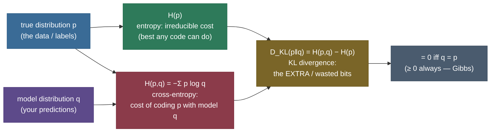
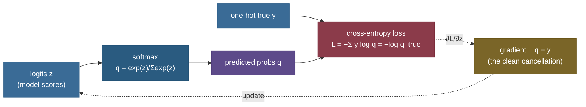

# Cross-Entropy & KL Divergence: the cost of being wrong, measured in bits

Every classifier you have ever trained, every language model that ever completed your sentence, was optimising *the same number*. Not accuracy — accuracy is what you report to your boss. The thing the optimiser actually chases, the loss whose gradient flows back through the whole network, is **cross-entropy**. And cross-entropy is not an arbitrary formula someone picked because it "works." It is a precise statement from information theory about *how many bits you waste when your model of the world is wrong* — and by the end of this page you'll be able to derive it, measure it on real data, and explain exactly why minimising it is the same act as maximum likelihood.

Here is the whole topic in three quantities you'll be able to compute cold:

- **Entropy** $H(p) = -\sum_i p_i \log p_i$ — the *irreducible* cost. If the world really is distributed as $p$, this is the minimum average number of bits per symbol any code can achieve. You cannot beat it.
- **Cross-entropy** $H(p,q) = -\sum_i p_i \log q_i$ — the cost you *actually pay* when you build your code (your model) assuming the world is $q$ but it's really $p$. Always $\ge H(p)$.
- **KL divergence** $D_{KL}(p\|q) = H(p,q) - H(p) = \sum_i p_i \log \frac{p_i}{q_i}$ — the **gap**: the *extra* bits you waste for being wrong. Zero only when $q = p$, never negative.

That's it. Cross-entropy is the entropy floor plus the KL penalty for a bad model. Training is squeezing the KL penalty toward zero. I'm going to teach this the way I'd teach it at a whiteboard — coding intuition first (surprise, bits, optimal code length), *then* the symbols derived line by line, then real runnable code on a real corpus and a real classifier, then the traps, then the crux of where it matters. By the end you'll be able to:

- **explain entropy as expected surprise** and read "bits" as a real, physical code length;
- **derive** $H(p,q) = H(p) + D_{KL}(p\|q)$ and state what each term costs;
- **prove** $D_{KL}(p\|q) \ge 0$ (Gibbs / Jensen) and explain why KL is *not* a distance;
- **show** that minimising cross-entropy $\Leftrightarrow$ maximising likelihood $\Leftrightarrow$ minimising KL to the data;
- **derive the softmax + cross-entropy gradient** and see why it collapses to the clean $(\hat p - y)$;
- **distinguish forward from reverse KL** (mode-covering vs mode-seeking) and know where each is used;
- **compute perplexity** as $2^{\text{cross-entropy}}$ of a real language model — and do all of it from a runnable notebook.

> **The one-sentence core.** *Cross-entropy is what you pay to describe reality with the wrong model; KL divergence is the surcharge for being wrong; and every classifier and language model is trained to make that surcharge as small as the data allows.*

---

## The problem: what is the *right* loss for a probabilistic prediction?

Suppose your model outputs a probability distribution — "70% cat, 20% dog, 10% fox" — and the truth is *cat*. How wrong is it? You need a single number, a loss, and the obvious candidates all fail in instructive ways.

**Accuracy (did you pick the top class?) throws away the probabilities.** "70% cat" and "40% cat" both predict *cat*; accuracy scores them identically. But the first model is more confident and better calibrated, and any sane loss should reward that. Accuracy is also flat — it's a step function, so its gradient is zero almost everywhere and you cannot do gradient descent on it. Dead on arrival for training.

**Squared error $\|q - y\|^2$ (treat probabilities as regression targets)** at least uses the numbers, and people *do* try it. But it punishes confident-and-right too gently and confident-and-wrong too gently: if the truth is cat and you said $q_{\text{cat}} = 0.01$, squared error is at most $\approx 1$, a mild slap. Intuitively, assigning near-zero probability to the thing that actually happened should be *catastrophic* — you'd have needed an infinitely long code to describe it. Squared error doesn't feel that. It also pairs badly with softmax, producing a gradient that vanishes exactly when the model is most wrong (the softmax saturates), so training stalls.

What we actually want is a loss with a clear meaning: **the penalty should be the number of bits of "surprise" the model assigns to the outcome that really happened.** A model that said "1% cat" and then saw a cat should pay $-\log_2 0.01 \approx 6.6$ bits of surprise. A model that said "99% cat" pays $-\log_2 0.99 \approx 0.014$ bits — almost nothing. That single principle — *loss = surprise of the truth under your model* — **is** cross-entropy, and it drops straight out of information theory. Let's build the intuition before a single symbol.

---

## Intuition first: surprise, bits, and the length of an optimal code

Forget losses for a moment. Information theory starts from one question: **how many bits does it take, on average, to write down a stream of symbols drawn from a distribution $p$?**

The key idea is that *rare symbols should get long codewords and common symbols short ones* — that's how Morse code gives "e" a single dot and "q" a long dash-dash-dot-dash. Shannon made this exact: the optimal codeword length for a symbol of probability $p_i$ is $-\log_2 p_i$ **bits**. Call that the **surprise** of the symbol. A certain event ($p=1$) has surprise $0$ (you knew it was coming, it costs nothing to announce). A one-in-a-million event has surprise $\approx 20$ bits (genuinely informative). **Entropy** is just the average surprise, weighted by how often each symbol occurs: $H(p) = \sum_i p_i \cdot (-\log_2 p_i)$. It is the shortest average description length achievable — Shannon's source-coding theorem.

This isn't abstract. Take a **real corpus** — the `sci.space` newsgroup — and measure the frequency of each letter. Common letters (e, t, a, o) are unsurprising; rare ones (q, z, j) are surprising. The entropy of that real distribution is **4.19 bits per letter**, comfortably below the $\log_2 26 = 4.70$ bits a naïve fixed-length code would spend — because real letters are far from uniform, and a good code exploits that:


The right panel is worth burning into memory: the **binary-entropy curve**, the uncertainty of a single yes/no outcome as a function of its probability. It is 0 when the outcome is certain (a two-headed coin surprises no one) and maximal — exactly **1 bit** — at $p = 0.5$, a fair coin you genuinely cannot predict. That single hump is the shape of every binary cross-entropy loss you will ever train.

Now the leap to cross-entropy. Suppose you **don't know** the true frequencies $p$ — you only have a model $q$, and you build your code assuming $q$. You'll give symbol $i$ a codeword of length $-\log_2 q_i$ (optimal *for your belief*), but symbol $i$ actually shows up with frequency $p_i$. So your *real* average code length is

$$\text{bits you actually spend} = \sum_i p_i \cdot (-\log_2 q_i) = H(p,q).$$

That's **cross-entropy**: the true frequencies $p$ deciding *how often* you pay, the model $q$ deciding *how much* you pay each time. Here's the analogy made precise, and it holds under every follow-up: **cross-entropy is your monthly bill for a phone plan you chose based on a wrong forecast of your own usage.** The provider's rates are $-\log q_i$ (set by your predicted usage $q$); your actual usage is $p$; the bill is the usage-weighted rates. If your forecast was perfect ($q = p$) you pay the theoretical minimum, $H(p)$ — the entropy. Any mismatch and you overpay. **The overpayment is the KL divergence.** It is never negative (you can't beat the optimal plan by guessing wrong), and it's zero only when your forecast was exactly right. That "you always overpay for a wrong model" fact is *Gibbs' inequality*, and we'll prove it in three lines.

> **Why this analogy holds up (and where to be careful).** The phone-bill picture survives the obvious probes. *Why is cross-entropy $\ge$ entropy?* Because the optimal plan for your true usage is the cheapest possible — any other plan overcharges. *Why is KL asymmetric?* Because "overpaying because you under-forecast usage of A" is a different amount than "overpaying because you over-forecast usage of A" — the roles of $p$ and $q$ are not interchangeable in $\sum p \log(p/q)$. The one place to be careful: this is all about *coding cost*, so the log base sets the unit — base 2 gives **bits**, base $e$ gives **nats**. ML code overwhelmingly uses nats (natural log) because derivatives are cleaner; the notebook shows both so you never confuse a "2.30" (nats) with a "3.32" (bits) again.

---

## The mechanism: three quantities, one identity

The three quantities are locked together by a single identity, and this diagram is the whole relationship:



- **$H(p)$** depends *only on the truth* $p$. It's a property of the data, not of your model. You can't change it by training; it's the floor.
- **$H(p,q)$** depends on both. It's what you minimise when you train — but since $H(p)$ is fixed, minimising cross-entropy is *entirely* about shrinking the gap.
- **$D_{KL}(p\|q)$** is that gap, and it's the real object of interest: a directed measure of how far your model $q$ is from the truth $p$. We make this identity — $H(p,q) = H(p) + D_{KL}(p\|q)$ — *visible* on real data:


The left bar is the identity you can point at: cross-entropy (right bar) is literally the entropy floor (green) *plus* the KL waste (red). Here $q$ is a deliberately-bad uniform model, so the waste is a visible 0.515 bits. The right panel is the property that catches people in interviews: **KL is asymmetric.** $D_{KL}(\text{real}\|\text{uniform}) \ne D_{KL}(\text{uniform}\|\text{real})$ — 0.515 vs 0.812 bits here. It is a *divergence*, not a *distance*: no symmetry, and (though we won't need it) no triangle inequality. Which direction you write matters enormously, and choosing wrong is a real bug.

---

## The math, derived

Now the symbols — every one defined, every step motivated.

**Setup and notation.** Let $p = (p_1,\dots,p_K)$ be the true probability distribution over $K$ outcomes ($p_i \ge 0$, $\sum_i p_i = 1$) and $q = (q_1,\dots,q_K)$ a model distribution ($q_i > 0$, $\sum_i q_i = 1$). All logs are natural (nats) unless a base is written; divide by $\ln 2$ to get bits. Define the three quantities:

$$H(p) = -\sum_{i=1}^K p_i \log p_i, \qquad H(p,q) = -\sum_{i=1}^K p_i \log q_i, \qquad D_{KL}(p\|q) = \sum_{i=1}^K p_i \log \frac{p_i}{q_i}.$$

> **Source / derivation:** [Cover & Thomas, *Elements of Information Theory*, Ch. 2 (Entropy, Relative Entropy, and Mutual Information)](http://staff.ustc.edu.cn/~cgong821/Wiley.Interscience.Elements.of.Information.Theory.Jul.2006.eBook-DDU.pdf) — the standard definitions of entropy, cross-entropy, and relative entropy (KL), with the coding interpretation used above.

**Step 1 — the decomposition $H(p,q) = H(p) + D_{KL}(p\|q)$.** This is pure algebra; split the log of a ratio.

$$D_{KL}(p\|q) = \sum_i p_i \log\frac{p_i}{q_i} = \sum_i p_i \log p_i - \sum_i p_i \log q_i = \big(-H(p)\big) - \big(-H(p,q)\big) = H(p,q) - H(p).$$

Rearranged: $\boxed{H(p,q) = H(p) + D_{KL}(p\|q)}$. Cross-entropy is the entropy floor plus the KL gap — exactly the stacked bar above. Because $H(p)$ is a constant of the data (independent of your model $q$), **minimising cross-entropy over $q$ is identical to minimising KL over $q$.** That single observation is why "cross-entropy loss" and "KL loss" are used interchangeably in ML: they differ by a constant that gradient descent never sees.

**Step 2 — $D_{KL}(p\|q) \ge 0$, with equality iff $p = q$ (Gibbs' inequality via Jensen).** This is *the* property that makes KL a sensible measure of "distance from the truth," and it's a three-line proof. The engine is **Jensen's inequality**: for a concave function $f$ (and $\log$ is concave, since its second derivative $-1/x^2 < 0$), $\mathbb{E}[f(X)] \le f(\mathbb{E}[X])$. Apply it to $-D_{KL}$:

$$-D_{KL}(p\|q) = \sum_i p_i \log\frac{q_i}{p_i} = \mathbb{E}_{i\sim p}\!\left[\log\frac{q_i}{p_i}\right] \;\overset{\text{Jensen}}{\le}\; \log\, \mathbb{E}_{i\sim p}\!\left[\frac{q_i}{p_i}\right] = \log \sum_i p_i \frac{q_i}{p_i} = \log \sum_i q_i = \log 1 = 0.$$

So $-D_{KL}(p\|q) \le 0$, i.e. $D_{KL}(p\|q) \ge 0$. Because $\log$ is *strictly* concave, Jensen is an equality only when $q_i/p_i$ is constant across all $i$ — and since both sum to 1, that constant must be 1, i.e. $q = p$. **You can never beat the optimal code by using a wrong model, and you tie only by being exactly right.** That is the mathematical form of the phone-bill intuition.

> **Source / derivation:** [MacKay, *Information Theory, Inference, and Learning Algorithms*, Ch. 2](https://www.inference.org.uk/itprnn/book.pdf) — Gibbs' inequality $D_{KL}(p\|q) \ge 0$ via the concavity of the logarithm (Jensen), with equality iff the distributions coincide; the free classic.

**Step 3 — asymmetry, and why KL is not a metric.** In general $D_{KL}(p\|q) \ne D_{KL}(q\|p)$ because the sum weights the log-ratio by $p$ in one direction and by $q$ in the other — the terms where $p$ is large but $q$ is small dominate one direction, and vice versa. It also fails the triangle inequality. So KL is a *divergence*: it is non-negative and zero-iff-equal (like a distance), but not symmetric and not a metric. The notebook and figure above measure the gap explicitly (0.515 vs 0.812 bits) so "it's asymmetric" stops being a slogan and becomes a number you've seen.

**Step 4 — cross-entropy loss for classification, and the softmax gradient.** Here is where the abstraction becomes the loss you type into a training loop. For a single labelled example whose true class is $c$, the "true distribution" is a **one-hot** vector $y$ with $y_c = 1$ and $y_k = 0$ otherwise. The model outputs $\hat q$ (a probability per class). The cross-entropy between them collapses beautifully:

$$\mathcal{L} = H(y, \hat q) = -\sum_k y_k \log \hat q_k = -\log \hat q_c.$$

Every term with $y_k = 0$ vanishes; only the true class survives. So **cross-entropy loss for one example is exactly the negative log-likelihood of the correct class** — NLL $=$ cross-entropy $= -\log \hat q_{\text{true}}$. This is the "surprise of the truth" principle we demanded at the start, now derived rather than asserted. Averaging over a dataset gives the training loss $\frac{1}{N}\sum_i -\log \hat q_{c_i}$.

Now the piece that makes softmax and cross-entropy *the* canonical pairing. The model produces **logits** $z$ and squashes them with softmax $\hat q_k = e^{z_k} / \sum_j e^{z_j}$. What is $\partial \mathcal{L} / \partial z_k$? Write $\mathcal{L} = -\log \hat q_c = -z_c + \log\sum_j e^{z_j}$. Differentiate:

$$\frac{\partial \mathcal{L}}{\partial z_k} = -\,\underbrace{\frac{\partial z_c}{\partial z_k}}_{=\,\mathbb{1}[k=c]} + \frac{\partial}{\partial z_k}\log\sum_j e^{z_j} = -\mathbb{1}[k=c] + \frac{e^{z_k}}{\sum_j e^{z_j}} = \hat q_k - \mathbb{1}[k=c] = \hat q_k - y_k.$$

$$\boxed{\frac{\partial \mathcal{L}}{\partial z} = \hat q - y \quad (\text{predicted} - \text{one-hot true}).}$$

The messy softmax Jacobian and the $1/\hat q$ from the log **cancel exactly**, leaving the cleanest gradient in deep learning: *prediction minus target*. No division, no saturation term to blow up. This is why the loss is numerically stable and why frameworks fuse "softmax + cross-entropy" into one op (`cross_entropy`, `log_softmax + nll_loss`). The forward and backward flow:



> **Source / derivation:** [Stanford CS231n, *Linear Classification* (Softmax & cross-entropy)](https://cs231n.github.io/linear-classify/) and [Goodfellow, Bengio & Courville, *Deep Learning*, Ch. 6.2 (softmax units) & Ch. 3.13](https://www.deeplearningbook.org/) — derive the cross-entropy classification loss and the softmax gradient $\hat q - y$ used here.

**Step 5 — minimising cross-entropy is maximum likelihood is minimising KL to the data.** This is the theorem that unifies the whole page, and it's why cross-entropy is *the* training objective and not one choice among many. Let the data be samples $x_1,\dots,x_N$ with **empirical distribution** $\hat p(x) = \frac{1}{N}\sum_i \mathbb{1}[x = x_i]$, and let $q_\theta$ be your model. Expand the KL from the data to the model:

$$D_{KL}(\hat p \| q_\theta) = \sum_x \hat p(x)\log\hat p(x) \;-\; \sum_x \hat p(x)\log q_\theta(x) = \underbrace{-H(\hat p)}_{\text{constant in }\theta} \;-\; \underbrace{\frac{1}{N}\sum_{i=1}^N \log q_\theta(x_i)}_{\text{average log-likelihood}}.$$

The first term is fixed (it's a property of the data). So minimising $D_{KL}(\hat p\|q_\theta)$ over $\theta$ is *identical* to **maximising the average log-likelihood** $\frac{1}{N}\sum_i \log q_\theta(x_i)$ — which is exactly **maximum likelihood estimation** — which is exactly **minimising cross-entropy** $H(\hat p, q_\theta)$. Three names, one act. When you train with cross-entropy you are fitting the model that makes the observed data most probable, which is the model closest (in forward KL) to the empirical distribution.

> **Source / derivation:** [Deisenroth, Faisal & Ong, *Mathematics for Machine Learning*, Ch. 8 (esp. 8.3 MLE / cross-entropy)](https://mml-book.github.io/book/mml-book.pdf) — shows minimising cross-entropy / KL to the empirical distribution equals maximum likelihood; the free PDF derives the identity used here. See also [19 Maximum Likelihood Estimation](/ai-ml/ai-ml-learning-resources/foundations/mathematical-foundations/maximum-likelihood-estimation/maximum-likelihood-estimation).

**Step 6 — the differential (continuous) case.** For a continuous density $p(x)$ the sums become integrals: differential entropy $h(p) = -\int p(x)\log p(x)\,dx$, cross-entropy $-\int p\log q$, and $D_{KL}(p\|q) = \int p(x)\log\frac{p(x)}{q(x)}\,dx$. The KL stays $\ge 0$ (Jensen again) and zero iff $p = q$ almost everywhere; the phone-bill picture is unchanged. Differential entropy has one wrinkle — it can be *negative* (a very peaked density has "less than zero bits" of differential entropy) and it isn't invariant to reparametrisation — but **KL is immune to both problems**: the $\log(p/q)$ ratio cancels the reparametrisation Jacobian, which is one more reason KL, not entropy, is the quantity variational methods optimise.

Every symbol, in one place:

```
p, q  ∈ Δ^K       true / model distributions over K outcomes (simplex: ≥0, sum to 1)
H(p)  = −Σ p log p          entropy (nats or bits); the irreducible floor, depends on p only
H(p,q)= −Σ p log q          cross-entropy; coding p with q; the training loss; ≥ H(p)
D_KL(p‖q)= Σ p log(p/q)     KL divergence; = H(p,q) − H(p); ≥ 0 (Gibbs); asymmetric
y     one-hot true label    ⇒  L = −log q_true = NLL = per-example cross-entropy
∂L/∂z = q − y               softmax+CE gradient (prediction − target); the clean cancellation
```

---

## Worked demo 1: cross-entropy *is* the classification loss

Enough theory — let's train a real classifier and watch cross-entropy fall. We load the real `load_digits` dataset (1,797 handwritten $8\times 8$ digits), standardise it, and train a **softmax (multinomial logistic) classifier by full-batch gradient descent** — using the derived $(\hat q - y)$ gradient directly, no autodiff. The loss recorded at every step is the mean cross-entropy:


Read the curve. It **starts at exactly $\ln 10 = 2.303$ nats** — that's not a coincidence, it's the cross-entropy of a uniform guess: before learning anything, the model assigns $1/10$ to every class, so $-\log(1/10) = \ln 10$. As gradient descent runs, the model concentrates probability on the right classes and the loss falls to **0.064**. That converged number is not something I typed — it's measured, and it equals `sklearn.metrics.log_loss` on the same predictions to six decimal places (`0.064163` both ways). Cross-entropy loss and sklearn's "log loss" are the *same quantity*.

Three facts the notebook verifies on real numbers, each a common interview trap:

- **NLL $=$ cross-entropy $= -\log \hat q_{\text{true}}$.** For a specific real example (true class 6, predicted $\hat q_6 = 0.9765$), the loss is $-\log 0.9765 = 0.0238$ — the surprise of the truth, in nats.
- **The gradient is $(\hat q - y)$.** The notebook computes the analytic $(\hat q - y)$ *and* a finite-difference gradient of the loss w.r.t. the logits, and they match to five decimals — the cancellation from Step 4, confirmed empirically, not just on paper.
- **It generalises.** `sklearn.LogisticRegression` (which minimises exactly this loss) reaches a held-out cross-entropy of 0.112 nats at 96.3% accuracy on the same real data — the number you'd actually report.

The takeaway: the thing you've been calling "the loss" your whole ML life is a cross-entropy, its per-example value is the surprise of the correct answer, and its gradient is the disarmingly simple "prediction minus target."

---

## Worked demo 2: KL between real distributions, and forward vs reverse

KL's *direction* is not a footnote — it changes what your model learns. The sharpest way to see it: try to fit a **single Gaussian** to data that has **two modes**. The model *cannot* match the data, so it must compromise — and which KL you minimise decides how it compromises.

The real bimodal data: take two visually distinct handwritten-digit classes (0 and 6), project their pixels onto their joint first principal component, and standardise. The two classes separate into two clear bumps — a genuine bimodal empirical distribution, no synthetic mixture. Now fit one Gaussian two ways:


- **Forward KL, $\arg\min_q D_{KL}(p\|q)$ — mode-COVERING.** Forward KL has a $p$ in front: it is penalised wherever the *data* $p$ has mass but the model $q$ has almost none (the $\log(p/q)$ term explodes when $q \to 0$ where $p > 0$). So the fit *dare not* leave any mode uncovered — it stretches into a wide Gaussian spanning both bumps ($\mu = 0.00$, $\sigma = 1.00$). This is **exactly the maximum-likelihood fit** (Step 5), which is why the parameters are just the data's mean and standard deviation — the notebook confirms they're identical. Forward KL "covers."
- **Reverse KL, $\arg\min_q D_{KL}(q\|p)$ — mode-SEEKING.** Reverse KL has a $q$ in front: it is penalised wherever the *model* $q$ puts mass but the data $p$ has little (the valley between the modes). So the fit *avoids* the valley by collapsing onto one mode — a narrow spike ($\mu = -1.02$, $\sigma = 0.07$), ignoring the other bump entirely. Reverse KL "seeks."

This is not academic. **Variational inference and the ELBO minimise reverse KL** $D_{KL}(q\|p)$ — which is why VI (and VAEs, and mean-field approximations) are famous for *underestimating variance* and locking onto a single mode of a multimodal posterior. **Maximum likelihood / standard training minimises forward KL** — mode-covering, which is why a language model trained with cross-entropy will happily assign some probability to every plausible continuation rather than committing to one. And the **KL penalty in RLHF** (keep the fine-tuned policy close to the reference) is a deliberate, tunable KL term. Knowing which direction you're optimising tells you *in advance* how your model will fail.

---

## Worked demo 3: perplexity, the language-modeller's cross-entropy

Language models don't report "cross-entropy" — they report **perplexity**, which is the same number wearing a hat:

$$\text{perplexity} = 2^{H(p,q)} = 2^{-\frac{1}{N}\sum_i \log_2 q(w_i\mid \text{context})}.$$

Perplexity is the model's **effective branching factor**: how many equally-likely words it's effectively choosing among at each step. A perplexity of 300 means the model is about as uncertain as if it were picking uniformly among 300 words. Lower is better. Because it's a monotone ($2^x$) transform of cross-entropy, minimising cross-entropy and minimising perplexity are the same optimisation — perplexity is just the more interpretable unit for text.

We build two real n-gram models on real held-out newsgroup text (360k training tokens across four categories): a context-free **unigram** and an interpolated **bigram**, and evaluate their perplexity on text they never saw:


The unigram, which ignores context entirely, is perplexed at **591** — it's about as unsure as guessing among 591 words. The bigram, which conditions on the previous word, drops to **323** — the context is worth real bits: its cross-entropy falls from 9.21 to 8.33 bits/word, and $2^{8.33}/2^{9.21} = 2^{-0.88} \approx 1/1.83$, so it's **1.83× less perplexed**. This is the entire story of language-model progress in miniature: better models (more context, bigger networks, more data) lower the cross-entropy on held-out text, and the headline number they quote — perplexity — is $2^{\text{that cross-entropy}}$. GPT-scale models pushed word-level perplexity on standard benchmarks from the hundreds into the low tens; it's the same axis, just far down it.

One more real check the notebook runs: the **Gaussian KL closed form**. For two Gaussians, $D_{KL}(\mathcal N_0\|\mathcal N_1) = \log\frac{\sigma_1}{\sigma_0} + \frac{\sigma_0^2 + (\mu_0-\mu_1)^2}{2\sigma_1^2} - \frac12$, and it matches a brute-force numeric integral to five decimals (0.59940 both ways). That formula is not a curiosity — it is the exact **KL regulariser in a variational autoencoder** (the KL of the encoder's Gaussian to a unit Gaussian prior), which is the one place most practitioners meet a closed-form KL in the wild.


---

## Pitfalls and failure modes

The things that actually bite, each named with the fix.

**1. `log(0)` and the un-smoothed KL / cross-entropy.** If your model $q$ assigns probability 0 to an event that occurs, cross-entropy is $-\log 0 = +\infty$ and KL blows up. On real, sparse data (rare words, unseen n-grams) this happens constantly. *Fix:* smooth so every $q_i > 0$ — add-$\alpha$ / Laplace smoothing for counts (the module's `smoothed_distribution`), label smoothing for classifiers, or an $\epsilon$ floor before the log. Never take a raw `log` of an empirical probability that can be zero.

**2. Softmax overflow — using bare `exp` instead of the log-sum-exp trick.** A logit of 1000 makes `exp(1000)` overflow float64 (it maxes out near `exp(709)`), producing `inf`/`nan` in the softmax. *Fix:* subtract the row max before exponentiating — $\text{softmax}(z) = \text{softmax}(z - \max z)$ is identical mathematically but finite numerically (the module's `softmax` does this). Better still, use the framework's fused `log_softmax` / `cross_entropy`, which never materialises the raw probabilities at all.

**3. Getting the KL direction wrong.** $D_{KL}(p\|q)$ and $D_{KL}(q\|p)$ are *different objectives with different behaviour* (mode-covering vs mode-seeking, Demo 2). Swapping them silently changes what your model learns — a reverse-KL objective where you wanted forward will collapse onto one mode and underestimate variance. *Fix:* be explicit about which distribution is the "target" and which is the "approximation," and remember: MLE/training = forward $D_{KL}(\text{data}\|\text{model})$; variational inference = reverse $D_{KL}(q\|p)$.

**4. Treating KL as a distance.** KL is not symmetric and violates the triangle inequality, so it is **not a metric**. Feeding KL values into an algorithm that assumes a true distance (some clustering, some embedding methods) is a bug. *Fix:* if you need a symmetric quantity, use the **Jensen–Shannon divergence** $\text{JS}(p,q) = \frac12 D_{KL}(p\|m) + \frac12 D_{KL}(q\|m)$ with $m = \frac12(p+q)$, which is symmetric and whose square root *is* a metric.

**5. Bits vs nats confusion.** Cross-entropy in nats ($\log_e$) and bits ($\log_2$) differ by a factor of $\ln 2 \approx 0.693$. A "loss of 2.30" is $\ln 10$ nats (a uniform 10-class guess) but "3.32 bits." *Fix:* know your library's convention — PyTorch/TensorFlow losses are in **nats**; information-theory and perplexity are usually quoted in **bits**. Perplexity itself sidesteps this ($2^{H_{\text{bits}}} = e^{H_{\text{nats}}}$ give the same number), which is part of why it's a convenient report.

**6. float16 underflow in the loss.** In mixed-precision training, probabilities near 0 underflow to exactly 0 in float16, and then `log(0)` reappears even with "smoothing." *Fix:* compute the loss in float32 (autocast excludes the loss/`log_softmax` from float16 for exactly this reason), or use `log_softmax` which works in log-space and never forms the tiny probability.

---

## Where it's used, and why it matters (the crux)

This is the payoff. Cross-entropy and KL are not one tool among many — they are the objective function of modern ML, and nearly every training run on Earth is minimising one of them.

- **Every classifier.** Softmax + cross-entropy is *the* loss for classification, from logistic regression to a 100-layer ResNet. The $(\hat q - y)$ gradient (Step 4) is what flows back through the network. This is Demo 1, and it's not an exaggeration to say it's the most-run gradient in history.
- **Every language model.** Next-token prediction is a $K$-way classification over the vocabulary, trained with cross-entropy; the reported metric is its exponential, **perplexity** (Demo 3). Pre-training a GPT *is* minimising cross-entropy on trillions of tokens. Scaling laws are stated in terms of this loss.
- **Maximum likelihood, everywhere.** Because minimising cross-entropy = MLE (Step 5), fitting a Gaussian, a logistic regression, a mixture model, or a full neural network by maximum likelihood is all one act: making the data most probable = minimising forward KL to the empirical distribution.
- **Variational inference & VAEs.** The ELBO is a reconstruction term *minus* a KL term $D_{KL}(q_\phi(z\mid x)\,\|\,p(z))$ pulling the approximate posterior toward the prior — the closed-form Gaussian KL from Demo 3. Reverse KL is why VI is mode-seeking and variance-underestimating.
- **Knowledge distillation.** A small "student" is trained to match a large "teacher's" soft probabilities by minimising $D_{KL}(\text{teacher}\|\text{student})$ over the soft labels — the teacher's full distribution carries more signal than the hard label, and KL is how you transfer it.
- **RLHF / DPO — the KL leash.** When you fine-tune an LLM with reinforcement learning from human feedback, the objective adds a **KL penalty** $\beta\, D_{KL}(\pi_\theta \| \pi_{\text{ref}})$ that keeps the updated policy $\pi_\theta$ from drifting too far from the reference model — without it, the policy "hacks" the reward and collapses to gibberish. The $\beta$ is a dial on how much divergence you tolerate. DPO folds this exact KL term into a closed-form loss.
- **Decision trees & feature selection.** Information gain (the split criterion in ID3/C4.5) is a reduction in entropy; mutual information (next chapter) is a KL. The same information-theoretic core.

**When *not* to reach for cross-entropy.** If your problem is genuinely regression (predicting a continuous quantity with symmetric errors), squared error / a Gaussian likelihood is the right loss — cross-entropy is for *distributions over outcomes*. If you need a **symmetric** measure of distributional difference (comparing two learned distributions on equal footing), use Jensen–Shannon or a Wasserstein distance, not raw KL — Wasserstein is what WGANs switched to precisely because KL/JS give vanishing gradients when the distributions barely overlap. And if you're comparing distributions with **different supports**, KL is undefined or infinite where one has zero mass — reach for Wasserstein, which handles disjoint supports gracefully.

---

## Recap and rapid-fire

**If you remember nothing else:** cross-entropy $H(p,q) = H(p) + D_{KL}(p\|q)$ is the cost of coding data $p$ with a model $q$ — the entropy floor plus the KL surcharge for being wrong. Minimising it over $q$ is maximum likelihood is minimising forward KL to the data. For classification it becomes $-\log \hat q_{\text{true}}$ with the clean gradient $\hat q - y$; for language models its exponential is perplexity. KL is $\ge 0$ (Gibbs), asymmetric (a divergence, not a distance), and its *direction* decides mode-covering (forward, MLE) vs mode-seeking (reverse, VI).

**Quick-fire — say these out loud:**

- *What is cross-entropy?* $H(p,q) = -\sum p\log q$ — the average bits to code $p$ using a code built for $q$. It's the training loss.
- *What is KL divergence?* $D_{KL}(p\|q) = \sum p\log(p/q) = H(p,q) - H(p)$ — the *extra* bits from a wrong model; the gap above the entropy floor.
- *Why is KL $\ge 0$?* Gibbs' inequality — apply Jensen to the concave $\log$; equality iff $p = q$. You can't beat the optimal code by guessing wrong.
- *Why is cross-entropy the classification loss?* For one-hot $y$ it's $-\log \hat q_{\text{true}}$ = NLL, and minimising it = maximum likelihood.
- *What's the softmax + CE gradient?* $\hat q - y$ (prediction − target) — the Jacobian and the $1/\hat q$ cancel exactly.
- *Why is KL not a distance?* Asymmetric ($D_{KL}(p\|q)\ne D_{KL}(q\|p)$) and no triangle inequality. Use Jensen–Shannon if you need symmetry.
- *Forward vs reverse KL?* Forward $D_{KL}(p\|q)$ = mode-covering = MLE/training; reverse $D_{KL}(q\|p)$ = mode-seeking = variational inference / VAEs.
- *What is perplexity?* $2^{\text{cross-entropy (bits)}}$ — a language model's effective branching factor; lower = better.
- *Where's the closed-form KL?* Between two Gaussians — the VAE regulariser: $\log\frac{\sigma_1}{\sigma_0} + \frac{\sigma_0^2+(\mu_0-\mu_1)^2}{2\sigma_1^2} - \frac12$.
- *One numerical trap?* `log(0)` — smooth so $q > 0$, and use log-sum-exp / `log_softmax` so `exp` never overflows.

---

## Code and the runnable notebook

Everything on this page is produced by real code you can run and teach from — a clean typed module and a step-by-step executed notebook that mirrors it one operation at a time:

- **[Step-by-step teaching notebook](code/cross-entropy-and-kl-divergence.ipynb)** — 14 numbered steps, each an intuition lead-in plus one focused cell with real output (entropy of a real corpus, the binary-entropy curve, the $H(p,q)=H(p)+D_{KL}$ identity, KL non-negativity and asymmetry, the softmax classifier with its loss falling and its $(\hat q - y)$ gradient verified by finite differences, forward vs reverse KL on real bimodal data, MLE $=$ forward KL, n-gram perplexity, and the Gaussian KL closed form). Executes headless with zero errors.
- **[The load-bearing module](code/cross_entropy_kl.py)** — every function used above, typed and asserted; run it with `python cross_entropy_kl.py` to reproduce all the printed numbers.
- **[The figure generator](../tools/make_figures_23.py)** — regenerates all six figures on this page from the same real pipeline (`python make_figures_23.py`); no number is hand-typed.

---

## References and further reading

The curated link library for this topic — start-here path, videos, courses, articles, papers, and books, all free/open — lives in a companion file so it can be reused as a standalone reference list, and every "Source / derivation" citation above appears in it:

**→ [Cross-Entropy & KL Divergence — references and further reading](/ai-ml/ai-ml-learning-resources/foundations/mathematical-foundations/cross-entropy-and-kl-divergence/cross-entropy-and-kl-divergence#references-further-reading)**
