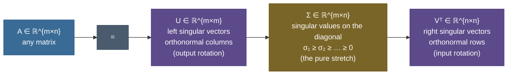

# Singular Value Decomposition: the natural axes of any matrix

Take a photograph — a real one, 427 × 640 pixels — and store it as a matrix of brightness values. That's 273,280 numbers. Now suppose I told you that you can throw away **95% of them**, keep only about 20 carefully chosen "ingredients," and still recognize the scene. Not a lossy JPEG trick, not a neural network — one clean idea from linear algebra that tells you *exactly which ingredients matter and in what order*. That idea is the **Singular Value Decomposition**, and by the end of this page you'll have watched it reconstruct that photo from almost nothing, and you'll know precisely why it's optimal to do so.

SVD is, without much exaggeration, the single most useful factorization in all of applied mathematics and machine learning. It is PCA. It is the best low-rank approximation of *anything*. It is how you solve least-squares when there's no exact answer, how you measure whether a linear system is numerically trustworthy, how recommender systems fill in missing ratings, how LoRA fine-tunes a 70-billion-parameter model by touching a tiny fraction of it, and how latent semantic analysis found topics in text a decade before transformers. All of it is one factorization: $A = U\Sigma V^\top$.

I'm going to teach this the way I'd actually teach it at a whiteboard — starting from the *geometry* (a picture you can hold in your head), then the mechanism, then the math derived line by line, then real runnable code on real data, then the traps, then where it earns its keep. By the end you'll be able to:

- **state and derive** $A = U\Sigma V^\top$ and explain what each factor *does* geometrically;
- **explain why SVD exists for every matrix** — even rectangular, even rank-deficient — when eigendecomposition doesn't;
- **connect** $\sigma_i = \sqrt{\lambda_i(A^\top A)}$ and prove it;
- **state Eckart–Young–Mirsky** and explain why truncating the SVD is *provably* the best low-rank approximation;
- **derive PCA as SVD** and read explained variance off the singular values;
- **use the pseudoinverse** to solve least squares, and read the **condition number** off the spectrum;
- and do all of the above from a runnable notebook on a real image and a real dataset.

> **The one-sentence core.** *Every linear map, no matter its shape, is nothing more than a rotation, then a stretch along perpendicular axes, then another rotation — and SVD is the tool that hands you exactly those axes and those stretch factors.*

---

## The problem: what are the *natural axes* of a transformation?

You already know one way to find special directions of a matrix: **eigenvectors**. An eigenvector $v$ of a square matrix $A$ is a direction that $A$ merely scales: $Av = \lambda v$. Beautiful — but it has two crippling limitations for real data.

**First, eigendecomposition needs a square matrix.** Your data almost never is. A dataset is $n$ samples × $d$ features (tall and thin). An image is height × width (rectangular). A user–item ratings table is #users × #items. `A @ v = λ @ v` doesn't even typecheck when `A` is 427 × 640 — the input and output live in different spaces.

**Second, even square matrices can fail to have a usable eigendecomposition.** A matrix can be *defective* (not enough independent eigenvectors), or its eigenvectors can be non-orthogonal and its eigenvalues complex, which wrecks the clean "orthogonal directions that get scaled" picture you actually want.

So we need a more general question. Not "which directions does $A$ merely scale?" (often nobody), but:

> **The right question:** *is there an orthonormal set of input directions that $A$ maps to an orthonormal set of output directions, changing only their lengths?*

That question has an answer for **every** matrix — square or rectangular, full-rank or not, real entries always. The input directions are the **right singular vectors** (columns of $V$), the output directions are the **left singular vectors** (columns of $U$), and the length changes are the **singular values** ($\sigma_i$, the diagonal of $\Sigma$). Finding them *is* the SVD. Let's see it before we write a single symbol.

---

## Intuition first: a circle becomes an ellipse

Here is the whole of SVD in one picture, and it is worth staring at until it's permanent.

Take the unit circle — every direction, length 1 — and push it through a $2\times2$ matrix $A$. The output is always an **ellipse**. Always. A linear map can rotate the circle, stretch it, flip it, shear it, but the image of a circle under any linear map is an ellipse (a squashed, possibly rotated circle). SVD is the statement that this ellipse-making happens in three clean, separable stages:


Read the four panels left to right:

1. **The unit circle** — all input directions, each length 1.
2. **After $V^\top$ (rotate).** $V^\top$ is a rotation/reflection: it spins the circle but a rotated circle is still a circle. Its job is to line up the circle's axes with the directions that are about to be stretched.
3. **After $\Sigma$ (scale).** Now we stretch along the coordinate axes by the singular values — here $\sigma_1 = 2.67$ horizontally, $\sigma_2 = 1.02$ vertically. The circle becomes an **axis-aligned ellipse**. The singular values *are the semi-axis lengths of that ellipse.* This is the only step that changes lengths.
4. **After $U$ (rotate).** $U$ is another rotation/reflection that spins the ellipse into its final orientation — which is exactly where $A$ would have sent the original circle.

So $A = U\Sigma V^\top$ read right-to-left is a **recipe**: rotate to align the axes ($V^\top$), stretch along those axes ($\Sigma$), rotate to the final pose ($U$). Every matrix is *this*. The numbers in the figure are real — computed by `numpy.linalg.svd` on the real matrix $A = \left[\begin{smallmatrix}2.0 & 1.2\\ 0.4 & 1.6\end{smallmatrix}\right]$, and the code asserts that applying $U\Sigma V^\top$ to the circle reproduces $A$ applied to the circle exactly.

> **Why this analogy holds up (and where it would break).** The "circle → ellipse" picture is not a loose metaphor — it is literally true, and it survives every follow-up. *Rectangular matrix?* A $3\times2$ matrix maps the 2-D unit circle into a (possibly tilted) ellipse living in 3-D — same picture, one more output dimension. *Rank-deficient matrix?* One semi-axis collapses to length 0 ($\sigma_2 = 0$) and the ellipse degenerates to a line segment — SVD *tells you* the rank by how many semi-axes are nonzero. The only thing to keep straight: the *axis directions* differ before the stretch ($V$'s columns) and after ($U$'s columns) — SVD needs **two** rotations precisely because input and output natural-axes need not coincide (eigendecomposition uses one because it forces them to).

---

## The mechanism: three factors, and what each one is

Concretely, the decomposition of a matrix $A$ with $m$ rows and $n$ columns is:



- **$U \in \mathbb{R}^{m\times m}$** — the **left singular vectors**, as columns. Orthonormal ($U^\top U = I$): a rotation/reflection in the *output* space $\mathbb{R}^m$. Its columns are an orthonormal basis for the column space of $A$ (and its orthogonal complement).
- **$\Sigma \in \mathbb{R}^{m\times n}$** — the **singular values** $\sigma_1 \ge \sigma_2 \ge \dots \ge 0$ on the main diagonal, zeros elsewhere. This is the *only* factor that scales; it is "diagonal" even though rectangular (the extra rows or columns are all zero).
- **$V \in \mathbb{R}^{n\times n}$** — the **right singular vectors**, as columns (so $V^\top$ has them as rows). Orthonormal ($V^\top V = I$): a rotation/reflection in the *input* space $\mathbb{R}^n$. Its columns are an orthonormal basis for the row space of $A$.

There are three sizes of this factorization, and knowing which you're using prevents a lot of confusion:

| Form | $U$ | $\Sigma$ | $V^\top$ | when to use |
|---|---|---|---|---|
| **Full** | $m\times m$ | $m\times n$ | $n\times n$ | theory; the complete orthonormal bases of all four subspaces |
| **Thin / reduced** | $m\times r$ | $r\times r$ | $r\times n$ | computation ($r=\min(m,n)$); drops the parts that multiply zeros |
| **Truncated (rank-$k$)** | $m\times k$ | $k\times k$ | $k\times n$ | **compression / approximation** — keep only the top $k$ triplets |

The **truncated** form is where all the machine-learning magic lives, and the rest of this page is largely about *why keeping the top $k$ is the smartest possible thing to keep.* Everything below uses the thin form (`full_matrices=False`) because it's what real code runs.

---

## The math, derived

Now the symbols — but derived, not dropped. Define everything, motivate every step.

**Setup.** Let $A \in \mathbb{R}^{m\times n}$ be any real matrix. We seek orthonormal vectors $v_1,\dots,v_r \in \mathbb{R}^n$ (inputs) and $u_1,\dots,u_r \in \mathbb{R}^m$ (outputs) and non-negative scalars $\sigma_1 \ge \dots \ge \sigma_r > 0$ such that

$$A v_i = \sigma_i\, u_i \quad\text{for } i = 1,\dots,r.$$

In words: each special input direction $v_i$ is sent by $A$ to a scaled version ($\sigma_i$ times) of an output direction $u_i$. Stack these $r$ equations columnwise — $AV = U\Sigma$ — and right-multiply by $V^\top$ (using $VV^\top = I$ for the orthonormal $V$) to get the factorization $A = U\Sigma V^\top$. So *if* such vectors exist, the decomposition follows immediately. The real work is proving they exist and finding them — and that comes from a symmetric matrix we can always diagonalize.

**Step 1 — form $A^\top A$, which is symmetric and positive semi-definite.** Consider the $n\times n$ matrix $A^\top A$. It is **symmetric** ($(A^\top A)^\top = A^\top A$) and **positive semi-definite**: for any $x$, $x^\top (A^\top A) x = (Ax)^\top(Ax) = \lVert Ax\rVert^2 \ge 0$. By the **spectral theorem**, a real symmetric matrix has an orthonormal eigenbasis with real eigenvalues, and PSD forces those eigenvalues to be $\ge 0$. So

$$A^\top A = V \Lambda V^\top, \qquad \Lambda = \operatorname{diag}(\lambda_1,\dots,\lambda_n),\ \ \lambda_1 \ge \dots \ge \lambda_n \ge 0,$$

with $V$ orthonormal. These $v_i$ (eigenvectors of $A^\top A$) are exactly our right singular vectors.

> **Source / derivation:** [Deisenroth, Faisal & Ong, *Mathematics for Machine Learning*, Ch. 4.5](https://mml-book.github.io/book/mml-book.pdf) — derives the SVD from the symmetric eigendecomposition of $A^\top A$ and the spectral theorem, which is the route taken here.

**Step 2 — define the singular values and left singular vectors.** Set

$$\sigma_i = \sqrt{\lambda_i} \ge 0, \qquad u_i = \frac{1}{\sigma_i} A v_i \ \ (\text{for } \sigma_i > 0).$$

The square root is real because $\lambda_i \ge 0$ (Step 1) — *this is the crux of why SVD exists for every matrix.* Now check the $u_i$ are orthonormal, which is what makes $U$ a genuine rotation:

$$u_i^\top u_j = \frac{1}{\sigma_i\sigma_j}(Av_i)^\top(Av_j) = \frac{1}{\sigma_i\sigma_j} v_i^\top (A^\top A) v_j = \frac{\lambda_j}{\sigma_i\sigma_j}\, v_i^\top v_j = \frac{\lambda_j}{\sigma_i\sigma_j}\,\delta_{ij},$$

which is $1$ when $i=j$ (since $\lambda_i = \sigma_i^2$) and $0$ otherwise. So $\{u_i\}$ is orthonormal — for free, out of the algebra. By construction $Av_i = \sigma_i u_i$, which is exactly the relation we set out to satisfy. Assembling the columns gives $A = U\Sigma V^\top$. $\blacksquare$

Every symbol, defined and used:

```
A  ∈ ℝ^{m×n}   the matrix (m rows, n cols)          r = rank(A) = # of σ_i > 0
V  ∈ ℝ^{n×n}   right singular vectors (eig of AᵀA)  σ_i = √λ_i(AᵀA)   singular values
U  ∈ ℝ^{m×m}   left singular vectors  (eig of AAᵀ)  Σ  ∈ ℝ^{m×n}      diag(σ_1..σ_r), 0 elsewhere
```

**The symmetric flip side.** The same argument on $AA^\top$ (an $m\times m$ symmetric PSD matrix) gives $AA^\top = U\Sigma^2 U^\top$: the *left* singular vectors are the eigenvectors of $AA^\top$, with the **same** nonzero eigenvalues $\sigma_i^2$. So the two symmetric matrices $A^\top A$ and $AA^\top$ share their nonzero spectrum, and SVD is the single object that ties them together.

> **Source / derivation:** [Gilbert Strang, *Introduction to Linear Algebra* / MIT 18.06 Lecture 29](https://ocw.mit.edu/courses/18-06-linear-algebra-spring-2010/) — derives $A^\top A = V\Sigma^2 V^\top$ and $AA^\top = U\Sigma^2 U^\top$, giving $\sigma_i = \sqrt{\lambda_i(A^\top A)}$ and the four-subspaces picture.

This gives us a real, independently-computable cross-check: compute the singular values two ways — from `numpy.linalg.svd(A)`, and as `sqrt(eigvals(AᵀA))` — and they must agree. The notebook does exactly this and confirms it (`True`). It's the kind of check that turns a formula you *believe* into one you *know*.

> **Note — why not just always use eigendecomposition, then?** Because eigendecomposition of a general (non-symmetric, or rectangular) matrix can have complex eigenvalues and non-orthogonal eigenvectors, or fail to exist. SVD routes *through* the symmetric PSD matrices $A^\top A$ and $AA^\top$, which the spectral theorem **guarantees** have real non-negative eigenvalues and orthonormal eigenvectors. That guarantee is why SVD is universal and eigendecomposition is not.

---

## Eckart–Young–Mirsky: the best rank-$k$ approximation, provably

Here is the theorem that makes SVD the workhorse of ML, and the one interviewers love. Write the SVD as a **sum of rank-1 pieces** (this rewriting is the whole game):

$$A = U\Sigma V^\top = \sum_{i=1}^{r} \sigma_i\, u_i v_i^\top.$$

Each term $\sigma_i u_i v_i^\top$ is an $m\times n$ **rank-1 matrix** (an outer product) scaled by its singular value. Because $\sigma_1 \ge \sigma_2 \ge \dots$, the terms are sorted from *most* to *least* important. Now **truncate** — keep only the first $k$:

$$A_k = \sum_{i=1}^{k} \sigma_i\, u_i v_i^\top.$$

**The theorem (Eckart–Young, extended by Mirsky).** Among *all* matrices $B$ of rank at most $k$, this $A_k$ is the closest to $A$ — and its error is exactly the tail of the spectrum:

$$\min_{\operatorname{rank}(B)\le k}\lVert A - B\rVert_F = \lVert A - A_k\rVert_F = \sqrt{\sum_{i>k}\sigma_i^2}, \qquad \min_{\operatorname{rank}(B)\le k}\lVert A - B\rVert_2 = \lVert A - A_k\rVert_2 = \sigma_{k+1}.$$

In the Frobenius norm the best-possible error is the root-sum-square of the *discarded* singular values; in the spectral (operator-2) norm it's simply the *first* discarded singular value $\sigma_{k+1}$. No cleverer rank-$k$ matrix exists. This is why "just keep the top $k$ singular triplets" isn't a heuristic — it's **optimal**.

> **Source / derivation:** [Eckart & Young (1936), *Psychometrika*](https://doi.org/10.1007/BF02288367) proved the Frobenius-norm case; [Mirsky (1960), *Quarterly J. Math.*](https://doi.org/10.1093/qmath/11.1.50) extended optimality to **every** unitarily invariant norm (Frobenius and spectral both). Both are in the references.

We don't just assert it — the notebook *proves it empirically on the real image*. For each $k$ it (1) confirms the measured truncation error equals the closed form $\sqrt{\sum_{i>k}\sigma_i^2}$ to floating-point tolerance, and (2) builds a legitimate but *random* rank-$k$ approximation and shows it is always worse:


The green bar (truncated SVD) is below the red (random rank-$k$) at every single $k$, by 27–41%. That gap *is* the theorem made visible: of all the rank-$k$ matrices you could pick, the SVD truncation is the floor no one can beat.

---

## Worked demo 1: compressing a real photograph

Now the demo that makes low-rank *seen*. Load a real photo, treat it as a matrix, and reconstruct it at increasing rank. This is the entire concept in one figure.


Walk down the ranks and read the *measured* numbers (printed by the module, not typed by me):

| rank $k$ | rel. Frobenius error | numbers stored | compression |
|---:|---:|---:|---:|
| 1 | 0.294 | 1,068 | 256× |
| 5 | 0.187 | 5,340 | 51× |
| 20 | 0.139 | 21,360 | 13× |
| 50 | 0.104 | 53,400 | 5× |
| 100 | 0.074 | 106,800 | 2.6× |
| 427 (full) | 0.000 | 456,036 | 0.6× (exact) |

The storage accounting is the punchline. A rank-$k$ reconstruction needs only $U[:,{:}k]$ ($m k$ numbers), $s[{:}k]$ ($k$ numbers), and $V^\top[{:}k]$ ($k n$ numbers) — total $k(m+n+1)$ — versus $mn$ for the dense image. At $k=20$ that's 21,360 numbers instead of 273,280: a **13× reduction** while the tower is already clearly there. (Note the full-rank row *expands* slightly to 456,036 > 273,280 — storing all three factors costs more than the original matrix, which is exactly why you only ever store a *truncated* SVD. Compression comes from throwing triplets away.)

**Why does so little suffice?** Because the singular-value spectrum of real, structured data decays fast:


The **energy** captured by the first $k$ triplets is $\sum_{i\le k}\sigma_i^2 / \sum_i \sigma_i^2$ (the squared singular values are the "energy" because $\lVert A\rVert_F^2 = \sum_i \sigma_i^2$). The curve saturates early: 99% of the image's energy lives in the first 56 of 427 singular values. The tail is fine texture that costs a lot of coefficients for little visual payoff.

> **Gotcha — energy ≠ perceived quality.** The energy curve says 90% of energy is in the *first* singular value alone — yet rank 1 looks like blank stripes! No contradiction: $\sigma_1$ captures the image's overall **brightness** (a near-constant background), which is a huge fraction of the raw squared magnitude but carries almost none of the *scene*. The recognizable structure appears only once several more triplets are added (around rank 20). Lesson: energy percentages are dominated by the mean/DC component; don't equate "% energy retained" with "looks good." When people quote "95% variance retained" for PCA, the same caveat applies — center your data first (Demo 2 does) to stop the mean from hijacking the top component.

The quality-vs-size tradeoff, measured end to end:


There's no free lunch and no cliff — just a smooth knob. Pick the $k$ that meets your error budget; SVD guarantees (Eckart–Young) you're on the optimal frontier at every setting.

---

## Worked demo 2: SVD *is* PCA

The second demo dissolves the boundary between two things students learn separately. **PCA and SVD are the same computation.** Here's the derivation, then the real data.

**Setup.** Let $X \in \mathbb{R}^{n\times d}$ be a data matrix: $n$ samples (rows), $d$ features (columns). **Center** it by subtracting the column means: $X_c = X - \mathbf{1}\bar{x}^\top$. PCA seeks the orthonormal directions (principal components) along which the centered data varies most — i.e. the eigenvectors of the covariance matrix $C = \frac{1}{n-1}X_c^\top X_c$, ordered by eigenvalue (variance).

**The connection.** Take the SVD of the centered matrix, $X_c = U\Sigma V^\top$. Then

$$C = \frac{1}{n-1}X_c^\top X_c = \frac{1}{n-1} V\Sigma^\top U^\top U \Sigma V^\top = V\,\frac{\Sigma^2}{n-1}\,V^\top.$$

Compare with the eigendecomposition $C = V\Lambda_C V^\top$: the **right singular vectors of $X_c$ are exactly the principal components**, and the variance explained by component $i$ is

$$\text{explained variance}_i = \frac{\sigma_i^2}{n-1}.$$

That's the whole of PCA, expressed through the SVD — no separate covariance eigendecomposition needed. (Computing the SVD of $X_c$ directly is also *more numerically stable* than forming $X_c^\top X_c$ and diagonalizing it, because squaring the data squares the condition number — a real reason production PCA implementations use SVD internally.)

> **Source / derivation:** [Deisenroth, Faisal & Ong, *Mathematics for Machine Learning*, Ch. 10 (PCA) with Ch. 4.5 (SVD)](https://mml-book.github.io/book/mml-book.pdf), and [Brunton & Kutz, *Data-Driven Science & Engineering*, Ch. 1](https://databookuw.com/) — both derive PCA as the SVD of the centered data matrix with variance $\sigma_i^2/(n-1)$; the notebook cross-checks the result against `sklearn.decomposition.PCA`, which computes PCA this way internally.

Run it on the real `load_digits` dataset — 1797 handwritten digits, each an 8×8 = 64-pixel image:


The measured explained-variance ratios of the top five components are `[0.149, 0.136, 0.118, 0.084, 0.058]`, and — the reassuring part — these match `sklearn.decomposition.PCA` to floating-point tolerance (`True` in the notebook), because sklearn's PCA *is* a truncated SVD. About 21 of the 64 components carry 90% of the variance: you can halve the dimensionality with almost no information loss.

And because each principal direction is a vector in the 64-pixel space, you can **reshape it back to 8×8 and look at it** — the "eigen-digits":


These are the fundamental "strokes" the dataset is built from. Any digit is (approximately) a weighted sum of these patterns plus the mean image — which is precisely the rank-$k$ reconstruction. Keeping the top 10 of 64 components rebuilds every digit while retaining 73.8% of the variance (measured). This is dimensionality reduction, feature extraction, and interpretability, all falling out of the same $U\Sigma V^\top$.

---

## The pseudoinverse: solving the unsolvable least-squares problem

One more piece of the SVD's power. When $A$ is tall ($m > n$ — more equations than unknowns, the normal situation in regression), the system $Ax = b$ usually has **no exact solution**: $b$ doesn't lie in the column space of $A$. Least squares asks for the next best thing — the $x$ minimizing $\lVert Ax - b\rVert_2$ — and the SVD hands it to you in closed form via the **Moore–Penrose pseudoinverse**:

$$A^+ = V\,\Sigma^+\,U^\top, \qquad \Sigma^+ = \operatorname{diag}\!\Big(\tfrac{1}{\sigma_1},\dots,\tfrac{1}{\sigma_r},\,0,\dots\Big),$$

and the least-squares solution is $\hat{x} = A^+ b$. Read $\Sigma^+$ carefully: you **reciprocate the nonzero singular values and leave the zeros as zeros** (not $1/0 = \infty$). That single rule is what makes the pseudoinverse defined and stable even when $A$ is rank-deficient or ill-conditioned — you refuse to divide by a (near-)zero singular value, and the corresponding direction simply contributes nothing.

> **Source / derivation:** [Trefethen & Bau, *Numerical Linear Algebra*, Lectures 4–5 & 11](https://people.maths.ox.ac.uk/trefethen/text.html) — derives the pseudoinverse and least-squares solution from the SVD, and the numerical-rank/condition-number diagnostics used below.

The notebook builds a **real overdetermined system** — 200 noisy equations, 5 unknowns — recovers the coefficients with $A^+b$, and confirms they match `numpy.linalg.lstsq` exactly (`True`) with a small residual. It's the same machinery under `sklearn`'s `LinearRegression`.

**And the condition number falls out for free.** The ratio

$$\kappa(A) = \frac{\sigma_{\max}}{\sigma_{\min}}$$

measures how much $A$ stretches its most-amplified direction relative to its least. A large $\kappa$ means the least-squares solution is *sensitive*: tiny changes in $b$ (or rounding error) get amplified into large changes in $x$ — the problem is **ill-conditioned**. The notebook makes this vivid by building a matrix with two nearly-identical columns and watching $\kappa$ explode while the *numerical rank* correctly reports the true, lower dimensionality. This is how SVD quietly protects every serious numerical library from blowing up on near-singular data.

---

## Pitfalls and failure modes

The things that actually bite people, named specifically with the fix.

**1. Forgetting to center before PCA.** PCA-via-SVD is the SVD of the *centered* matrix. Skip the centering and your first singular vector points at the data's **mean**, not its direction of maximum variance — the "top component" becomes a useless offset. *Fix:* subtract the column means first (`X - X.mean(axis=0)`), always. The notebook's Demo 2 centers explicitly.

**2. `full_matrices=True` when you meant thin.** `np.linalg.svd(A)` returns the **full** $U$ ($m\times m$) and $V^\top$ ($n\times n$) by default. For a 100,000 × 300 data matrix that allocates a $100{,}000\times100{,}000$ $U$ — tens of gigabytes, instantly OOM. *Fix:* pass `full_matrices=False` for the thin SVD (what you almost always want). The module uses it throughout.

**3. Dividing by a zero (or tiny) singular value in the pseudoinverse.** Rank-deficient or ill-conditioned $A$ has singular values at or near zero; naïvely computing $1/\sigma_i$ produces `inf`/`nan` and garbage. *Fix:* threshold — invert $\sigma_i$ only when $\sigma_i > \text{rcond}\cdot\sigma_{\max}$, else set it to 0 (numpy's `pinv`/`lstsq` default). The module's `pseudoinverse` does exactly this with `rcond=1e-12`.

**4. Confusing "energy retained" with "variance retained" with "quality."** As the image demo showed, $\sigma_1$ can hold 90% of *energy* while carrying almost none of the *scene* (it's the brightness/DC term). For **centered** data (PCA) the mean is removed, so explained-variance percentages are trustworthy; for raw matrices (image pixels), they are dominated by the offset. *Fix:* know whether you centered, and report the metric that matches your goal.

**5. Eigendecomposition of $A^\top A$ instead of SVD of $A$.** Mathematically identical, numerically not: forming $A^\top A$ **squares the condition number** ($\kappa(A^\top A) = \kappa(A)^2$), so a matrix that was borderline becomes hopeless, and small singular values are lost to round-off. *Fix:* take the SVD of $A$ directly; never form $A^\top A$ to get singular values on real, finite-precision data.

**6. Sign ambiguity of singular vectors.** The pair $(u_i, v_i)$ can each flip sign together ($-u_i, -v_i$ gives the same $\sigma_i u_i v_i^\top$), so different libraries/runs may return components with flipped signs. This is *not* a bug. *Fix:* if you need reproducible signs (e.g. comparing to a reference), impose a convention — e.g. make the largest-magnitude entry of each $u_i$ positive (`sklearn`'s `svd_flip` does this).

---

## Where it's used, and why it matters

SVD is not a textbook curiosity — it is load-bearing infrastructure across ML. A tour, tied to the mechanism you now understand:

- **PCA / dimensionality reduction** (exactly Demo 2). Every `sklearn.decomposition.PCA` call is a truncated SVD of the centered data. Feature compression, visualization preprocessing, whitening — all SVD.
- **LoRA — low-rank adaptation of LLMs.** Fine-tuning a giant weight matrix $W$ by learning a **low-rank update** $\Delta W = BA$ (rank $r \ll d$) is the Eckart–Young insight applied to *weight deltas*: the useful adaptation lives in a low-rank subspace, so you train $r(d+d)$ parameters instead of $d^2$. This is why a 70B model can be fine-tuned on a single GPU. ([LoRA & PEFT](/ai-ml/ai-ml-learning-resources/llms-applications-and-agents/training-and-adaptation/lora-and-parameter-efficient-fine-tuning/lora-and-parameter-efficient-fine-tuning).)
- **Latent Semantic Analysis (LSA).** Truncated SVD of a term–document matrix finds latent "topics" (the singular vectors) — the pre-neural workhorse of information retrieval, and still a strong, cheap baseline.
- **Recommender systems / collaborative filtering.** The Netflix-Prize-era matrix-factorization models factor a sparse user–item ratings matrix into low-rank user and item factors — SVD (and its regularized, missing-data-aware cousins) filling in the blanks.
- **Least squares & regression** (the pseudoinverse). Under the hood of linear regression, control, and any overdetermined solve.
- **Numerical rank, conditioning, and rank-revealing.** Deciding the *effective* rank of noisy data, and diagnosing when a linear system is trustworthy — the condition-number check of Step 13.
- **Image / signal compression and denoising.** Truncating small singular values discards high-frequency noise (it lives in the low-$\sigma$ tail), a classic denoiser; the compression is Demo 1.
- **Randomized SVD at scale.** For matrices too large to decompose fully, [Halko–Martinsson–Tropp randomized SVD](https://arxiv.org/abs/0909.4061) approximates the top-$k$ triplets in near-linear time — how SVD survives the billion-row era.

**When *not* to reach for SVD.** It's $O(mn\min(m,n))$ — expensive for very large dense matrices; use **randomized** or **truncated** SVD (compute only the top $k$) then. For sparse matrices, use sparse-aware solvers (`scipy.sparse.linalg.svds`), never a dense SVD. And if you truly need *eigenvectors of a symmetric matrix* (e.g. a graph Laplacian), a symmetric eigensolver is cheaper and more direct than a full SVD.

---

## Recap and rapid-fire

**If you remember nothing else:** every matrix factors as $A = U\Sigma V^\top$ — rotate ($V^\top$), stretch by the singular values ($\Sigma$), rotate ($U$) — the singular values are the semi-axis lengths of the ellipse the unit sphere becomes, and *truncating* to the top $k$ singular triplets is the **provably optimal** rank-$k$ approximation (Eckart–Young–Mirsky). That one fact powers PCA, compression, LoRA, recommenders, and least squares.

**Quick-fire — say these out loud:**

- *What is the SVD of a matrix?* $A = U\Sigma V^\top$: $U,V$ orthonormal (rotations), $\Sigma$ diagonal non-negative (the stretch).
- *Why does it exist for any matrix?* It's the eigendecomposition of the symmetric PSD $A^\top A$; PSD $\Rightarrow \lambda_i \ge 0 \Rightarrow \sigma_i = \sqrt{\lambda_i}$ is real. Always.
- *Relation to eigenvalues?* $\sigma_i = \sqrt{\lambda_i(A^\top A)}$; $V$ = eigenvectors of $A^\top A$, $U$ = eigenvectors of $AA^\top$.
- *Best rank-$k$ approximation?* Keep the top $k$ triplets. Error $=\sqrt{\sum_{i>k}\sigma_i^2}$ (Frobenius) or $\sigma_{k+1}$ (spectral). Nothing beats it — Eckart–Young–Mirsky.
- *How is SVD PCA?* SVD of the **centered** data; principal components are the right singular vectors; variance$_i = \sigma_i^2/(n-1)$.
- *How does it solve least squares?* Pseudoinverse $A^+ = V\Sigma^+U^\top$, reciprocating nonzero $\sigma_i$; $\hat{x}=A^+b$ minimizes $\lVert Ax-b\rVert$.
- *What's the condition number?* $\kappa = \sigma_{\max}/\sigma_{\min}$ — how much the map amplifies noise; large = ill-conditioned.
- *Full vs thin vs truncated?* Full = square $U,V$ (theory); thin = $\min(m,n)$ (compute, `full_matrices=False`); truncated = top $k$ (compress).
- *One numerical trap?* Don't form $A^\top A$ to get singular values — it squares the condition number. SVD $A$ directly.

---

## Code and the runnable notebook

Everything on this page is produced by real code you can run and teach from — a clean typed module and a step-by-step executed notebook that mirrors it one operation at a time:

- **[Step-by-step teaching notebook](code/singular-value-decomposition.ipynb)** — 14 numbered steps, each an intuition lead-in plus one focused cell with real output (the factorization, the circle→ellipse geometry, the eigen-connection, the image montage, Eckart–Young, PCA-on-digits, the pseudoinverse, and the condition number). Executes headless with zero errors.
- **[The load-bearing module](code/singular_value_decomposition.py)** — every function used above, typed and asserted; run it with `python singular_value_decomposition.py` to reproduce all the printed numbers.
- **[The figure generator](../tools/make_figures_06.py)** — regenerates all seven figures on this page from the same real pipeline (`python make_figures_06.py`); no number is hand-typed.

---

## References and further reading

The curated link library for this topic — videos, courses, articles, papers, and books, all free/open — lives in a companion file so it can be reused as a standalone reference list, and every "Source / derivation" citation above appears in it:

**→ [Singular Value Decomposition — references and further reading](singular-value-decomposition.references.md)**
