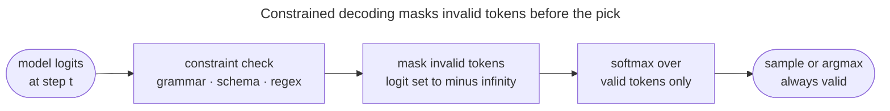

# Constrained and guided decoding: making invalid output unreachable

Sampling decides which plausible token to emit; this page covers the decoders that also guarantee the output is well-formed.

## The idea: mask what the structure forbids

Sometimes the output must be **valid**, not merely likely: JSON that parses, a value from an enum, code that compiles, text matching a regular expression or a grammar.

- **Constrained (guided) decoding** masks every token that would break the constraint *before* the decoder picks, so an illegal token can never be emitted.
- It is the same truncation idea as top-k and top-p — zero out the disallowed tokens, renormalize — applied to **syntactic validity** instead of probability.
- The model still chooses among the valid tokens by its own probabilities; it simply cannot choose an invalid one.

## Three levels of constraint

- **Logit bias and token masking** — the simplest form.
  - Add $-\infty$ to the logits of forbidden tokens, or a positive bias to encouraged ones.
  - Force a yes-or-no answer by allowing only the `Yes` and `No` token ids; ban a word by setting its logit to $-\infty$.
- **Grammar and regex constraints** — track the partial output with a parser or automaton.
  - At every step compute the tokens that keep the output parseable under a context-free grammar or a regular expression, and mask the rest.
  - Libraries such as **Outlines**, **Guidance** and **llama.cpp GBNF grammars** do this.
- **JSON and schema mode** — the production special case behind tool calling and structured extraction.
  - Generation is constrained to a JSON schema, so the output always parses into the expected object.
  - It is how function calling returns well-formed arguments reliably.

> [!NOTE]
> Constraints change **which tokens are allowed**, never the model's preferences among the allowed ones.
> - They are orthogonal to temperature and top-p: you can run nucleus sampling *inside* a grammar.
> - That is why structured-output features are reliable: the grammar makes invalid output unreachable, while sampling still gives natural variation in the valid space.

---

## References

Shared with the topic's companion file — see [Decoding & Sampling — references](/ai-ml/ai-ml-learning-resources/inference-and-serving/decoding-and-sampling/decoding-and-sampling#references-further-reading).
