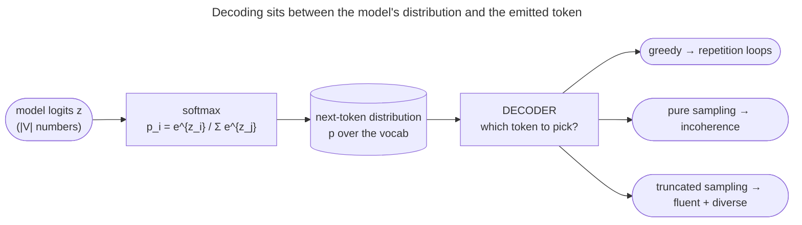

# Decoding & Sampling: turning the next-token distribution into text

A trained language model does **not** output text. At every step it outputs a *probability distribution over the whole vocabulary*.

- That is fifty thousand numbers that sum to 1, one per possible next token.
- "The capital of France is ___" produces a distribution where `Paris` might hold 0.92, `the` 0.01, `a` 0.008, and so on down a long tail.
- **Decoding** is the separate, deliberate algorithm that turns that distribution into one actual token, and then the next, and the next.
- The model proposes; the *decoder* disposes.

This is the most under-appreciated lever in all of LLM usage. The *exact same model*, with the *exact same weights*, can produce very different text.

- It can give a crisp factual answer, a repetitive broken loop, or fluent creative prose.
- The only thing that changed was **how you picked tokens from its distributions**.
- Pick the single most-likely token every time and a powerful model collapses into "*I think that I think that I think that…*".
- Pick purely at random from the raw distribution and it dissolves into word salad.

The art is the narrow corridor between these two failures. Each setting in that corridor has a name: **greedy**, **beam search**, **temperature**, **top-k**, and **top-p (nucleus)**.

By the end of this page you'll be able to:

- explain **why** the choice of decoder changes coherence, diversity, and repetition so dramatically;
- derive how **temperature** reshapes the softmax, and predict the effect of $T=0.5$ vs $T=2.0$;
- explain the precise difference between **top-k** (fixed count) and **top-p** (adaptive mass), and *why top-p is usually better*;
- explain **neural text degeneration** (Holtzman 2019) — why likelihood-maximizing decoders loop, and why nucleus sampling fixes it;
- pick the right decoder for a task — **closed-ended** (translation, extraction) vs **open-ended** (chat, story);
- prove every one of these claims in runnable from-scratch code.

> [!NOTE]
> This page is about *which* token, not *how fast*.
> - [Speculative decoding](/ai-ml/ai-ml-learning-resources/inference-and-serving/speculative-decoding/speculative-decoding) is a pure speed trick: its output is provably **distributionally identical** to plain sampling.
> - Decoding *strategy*, the subject here, is the choice that **changes what text you get**. Speculation makes a strategy faster; it never changes which one you chose.

**The strategies at a glance.** Every decoder below reads the same logits; they differ in what they keep and how they pick. The axis that decides between them is **closed-ended vs open-ended**:

| Strategy | What it does | Output feel | Task shape it fits |
|---|---|---|---|
| **Greedy** (argmax) | always the single most likely token | deterministic; loops on long text | closed-ended and short: extraction, arithmetic, a label |
| **Beam search** | keeps the $b$ most probable *sequences* | high-likelihood, low-diversity, slower | closed-ended with one best sequence: translation, summarization |
| **Temperature** | rescales the logits before the softmax | the dial from focused to adventurous | both; it is combined with every sampling decoder |
| **Top-k** | keeps a fixed $k$ best tokens, then samples | bounded randomness, blind to confidence | open-ended, when a hard cap on candidates is enough |
| **Top-p (nucleus)** | keeps the smallest set covering mass $p$ | adaptive: tight when sure, wide when unsure | the open-ended default: chat, dialogue, stories |

---

## The problem: a distribution is not a sentence

Here is the felt problem. Run a model forward one step and you get a vector of logits $z \in \mathbb{R}^{|V|}$.

- The softmax turns it into a probability $p_i$ for each of the $|V|$ vocabulary tokens.
- You must emit exactly one token, then feed it back in and repeat.
- **What rule do you use to choose?**

Two obvious rules both fail, and feeling *why* they fail is the whole motivation.

**Naïve rule 1 — always take the most likely token (greedy).** Surely the highest-probability token is the "best"? On open-ended text it is not.

- Greedy decoding falls into **repetition loops**: once the model emits "*the United States and the United States*", the most-likely continuation is *again* "*and the United States*", because that phrase is now in the context reinforcing itself.
- The locally-optimal choice is globally catastrophic, and this is not a small-model artefact: **GPT-2-large does it too** (Holtzman et al. 2019).
- Greedy is *myopic*: it optimizes the next token, never the sentence.

**Naïve rule 2 — sample straight from the raw distribution.** If greedy is too rigid, just draw a token at random with probability $p_i$? The problem is the **long tail**.

- A 50,000-token vocabulary puts a *tiny* probability on each of thousands of irrelevant tokens.
- There are *so many* of them that their **combined** mass is large, and you'll regularly draw one.
- One absurd token ("*The capital of France is **bicycle**…*") derails the rest of the generation, because the model now has to continue from nonsense.
- Pure sampling is *too loose*.

*The two naïve rules fail at opposite extremes (the red nodes name the failures: loops and incoherence). Every good decoder lives in between: keep the plausible tokens, discard the tail, sample with controlled randomness.*

So we need a rule that is **random enough to be diverse and non-repetitive, but constrained enough to never wander into the nonsense tail.** That single sentence is the design brief for everything below.

---

## Intuition first: the dinner-party menu

Before any math, the mental model I actually use.

Think of the model's distribution as a **menu the chef hands you each round**, with a recommendation score next to every dish.

- You order one dish and eat it.
- The chef then writes the *next* menu based on what you just ate.
- How do you order?

The five strategies, as ordering rules:

- **Greedy** = *always order the single top-scored dish.*
  - Decisive, but you eat the same "safe" dish forever.
  - Each choice shapes the next menu, so ordering "fries" once makes "fries" top-scored again and you spiral into fries-fries-fries. (Repetition.)
- **Pure sampling** = *roll a weighted die over the entire menu, including the dish the chef scored 0.0001.*
  - Occasionally you order the kitchen-sink special and the evening goes off the rails. (Incoherence.)
- **Temperature** = *how much you trust the scores.*
  - Low temperature ($T<1$): you trust the chef, so you almost always pick near the top — conservative, focused.
  - High temperature ($T>1$): you treat the scores as mere suggestions and spread your orders around — adventurous, wilder.
- **Top-k** = *"only let me order from the top 5 dishes."* A fixed-size shortlist, and a blunt instrument.
  - If there are really only 2 good dishes tonight you're still forced to consider 5.
  - If there are 30 equally-good dishes you're cruelly limited to 5.
- **Top-p (nucleus)** = *"give me the shortest shortlist that covers 90% of the recommendation score, and let me order from that."*
  - When one dish is clearly best, the shortlist is just that one dish.
  - When ten dishes are all plausible, the shortlist grows to include them all.
  - **The shortlist resizes itself to the chef's confidence.** That self-resizing is the entire reason nucleus sampling beats fixed top-k.

Hold a follow-up question to this analogy — *"what if two dishes tie at the 90% boundary?"* — and it still works.

- You include the tying dish: the boundary is "at least 90%", so the crossing dish stays on the list.
- We'll see that exact rule in the math.
- The analogy maps cleanly: **menu = distribution, score = probability, shortlist = the truncation set, how-much-you-trust-scores = temperature.**

---

## Where it matters: choosing the decoder is choosing the behaviour

The crux for practitioners: **the decoder is a product decision, not just a hyperparameter.** Match it to the task.

This is why API providers expose `temperature`, `top_p`, `top_k`, `frequency_penalty`, and `presence_penalty` as first-class parameters — they *are* the behaviour controls.

- A coding assistant runs near-greedy ($T\approx0.2$) for correctness.
- A brainstorming tool runs $T\approx1.0$ with $p\approx0.95$ for range.
- **Same model, different decoder, completely different product.**

The per-task settings — which decoder and which knob values for extraction, code, translation, summarization, chat, stories, evals and tool calls — are the playbook in [Decoding in Production](/ai-ml/ai-ml-learning-resources/inference-and-serving/decoding-and-sampling/decoding-in-production).

---

## References

The curated link library for this topic — videos, courses, articles, papers, books, and internal cross-links — lives in a companion file so it can be reused as a standalone reference list:

**→ [Decoding & Sampling — references](/ai-ml/ai-ml-learning-resources/inference-and-serving/decoding-and-sampling/decoding-and-sampling#references-further-reading)**
