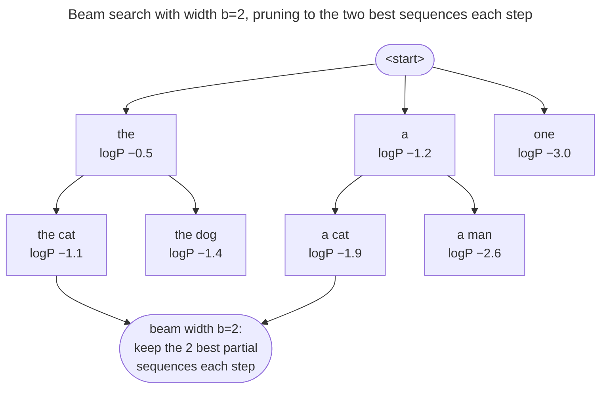

# Greedy and beam search: decoding as a search for the likeliest text

The [menu](/ai-ml/ai-ml-learning-resources/inference-and-serving/decoding-and-sampling/decoding-and-sampling) offers many dishes; this page covers the two decoders that always order the safest ones.

## The strategies, derived

There are two families.

- **Search** decoders (greedy, beam) try to find the *most probable sequence*.
- **Sampling** decoders (temperature / top-k / top-p) *draw* from the distribution with controlled randomness.

### Greedy: argmax, and why it's myopic

Greedy is the simplest possible rule — at each step emit the single highest-probability token:

$$x_t = \arg\max_i \; p_i = \arg\max_i \; z_i$$

- Since softmax is monotonic, the argmax of the probabilities equals the argmax of the logits, so greedy doesn't even need the softmax.
- It's deterministic (same prompt → same output, no seed) and fast.

> [!NOTE]
> **Source:** the greedy / argmax decoder and its myopia are laid out in [Jurafsky & Martin, *Speech and Language Processing* (3rd ed.), Ch. 10 — Large Language Models](https://web.stanford.edu/~jurafsky/slp3/10.pdf), which frames autoregressive generation and contrasts greedy against search and sampling.

The flaw is structural, not incidental.

- Greedy maximizes $p(x_t \mid x_{<t})$ at each step, but the **product** $\prod_t p(x_t \mid x_{<t})$ — the probability of the whole sequence — is *not* maximized by a chain of locally-greedy choices.
- A token that looks slightly worse now can open up a far more probable continuation later, and greedy can never see it.
- Worse, on open-ended text the locally-optimal choice **reinforces itself into a loop** (the repetition above).
- Greedy is the right tool only when the answer is essentially deterministic: "2 + 2 = ___", or extracting a field from a document.

### Beam search: keep several hypotheses alive

Beam search attacks greedy's myopia directly: instead of committing to one token, keep the **$b$ most-probable partial sequences** ("beams") at every step.

- Expand every beam by every possible next token.
- Score all the resulting candidate sequences by their cumulative log-probability, and keep the top $b$.
- At the end, return the highest-scoring complete sequence.

*Beam search with width $b=2$. At each step every surviving beam is expanded by all tokens, the candidates are scored by cumulative log-probability, and only the top $b$ survive (green nodes kept, unmarked nodes pruned). Greedy is the special case $b=1$; exhaustive search is $b = |V|^{T}$.*

> [!NOTE]
> **Source:** beam search for sequence decoding is presented with worked code in [*Dive into Deep Learning*, Ch. 10 — Beam Search](https://d2l.ai/chapter_recurrent-modern/beam-search.html), which derives greedy as the $b=1$ special case and the length-normalized scoring below.

Beam search shines on **closed-ended** tasks — machine translation (MT), summarization, constrained generation — where there *is* a single best answer and finding the high-probability sequence matters. On **open-ended** generation it fails in a surprising way: **maximum-probability text is bland and repetitive.**

- Holtzman et al. showed that the most-likely sequences a model can produce are *degenerate*.
- Humans don't write the highest-probability continuation; real language is full of mildly-surprising choices.
- Beam search, by hunting probability, hunts exactly the wrong thing for creative text.

For closed-ended use, one practical fix targets beam's bias toward *short* sequences.

- Raw cumulative log-prob only ever *subtracts* with each extra token, so short sequences win.
- **Length normalization** divides the score by $L^\alpha$ for sequence length $L$:

$$\text{score}(x_{1:L}) = \frac{1}{L^\alpha}\sum_{t=1}^{L} \log p(x_t \mid x_{<t})$$

> [!NOTE]
> **Source:** length-normalized beam scoring is from [Wu et al., *Google's Neural Machine Translation System* (2016)](https://arxiv.org/abs/1609.08144), §7 (the $lp(Y)$ length penalty), and is reproduced with code in [*Dive into Deep Learning*, Ch. 10 — Beam Search](https://d2l.ai/chapter_recurrent-modern/beam-search.html).

---

## References

Shared with the topic's companion file — see [Decoding & Sampling — references](/ai-ml/ai-ml-learning-resources/inference-and-serving/decoding-and-sampling/decoding-and-sampling#references-further-reading).
