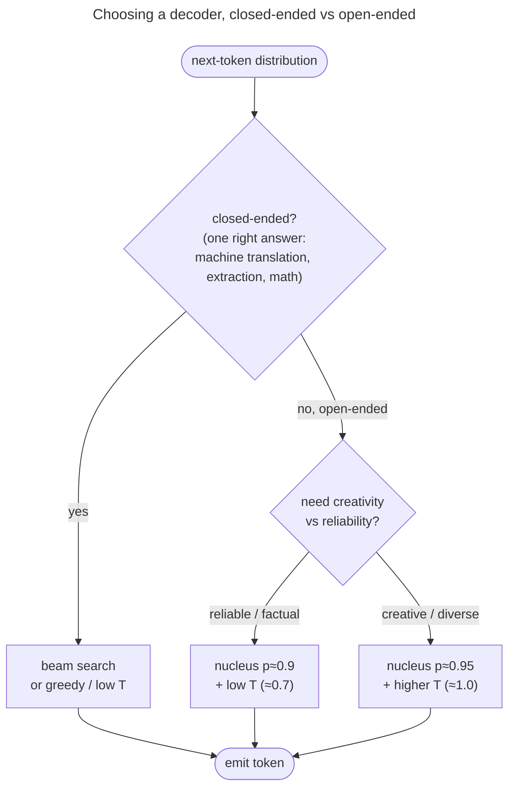
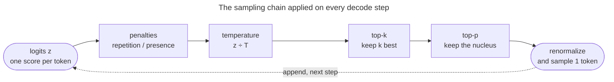

# Sampling: temperature, top-k and top-p

Search decoders loop on open-ended text; this page builds the sampling decoders that keep variety without drawing nonsense.

## Neural text degeneration: why the corridor exists

It's worth pausing on *why* both extremes fail, because Holtzman et al. (2019) turned the folklore into a precise observation, and it's the conceptual heart of the topic.

Their finding: **maximizing likelihood produces degenerate text.**

- Beam search and greedy hunt for high-probability sequences, but the highest-probability sequences a model can produce are *repetition loops*.
- The longer they run, the *more* confident the model becomes in continuing the loop (a positive-feedback trap).
- Meanwhile, the **probability mass in the unreliable tail** is the source of incoherence under pure sampling: integrate over thousands of tail tokens and you draw a derailing one too often.

Their sharpest observation: **human text is not the most probable text.**

- Scored by the model, real human continuations are full of dips: people keep choosing tokens that are *not* the model's top pick.
- Natural language lives in a band of **moderate** probability, not at the ceiling, so a decoder that chases the ceiling slides into robotic, looping text.

**The loop, mechanically.** Once the model emits a phrase, the phrase sits in its own context and *raises* the probability of saying it again.

- Greedy takes that now-likeliest token, which strengthens the pattern further — a self-reinforcing loop.
- Sampling breaks the loop by sometimes *not* taking the top token.

**Measured: same weights, different decoders.**

- GPT-2 continuing *"I love pizza. I love pizza."* greedily loops forever: **distinct-2 = 0.103**, so only about 10% of its bigrams are unique.
- The same model with nucleus sampling (top-p = 0.92) never repeats a bigram: **distinct-2 = 1.0**.
- A toy self-reinforcing model, with no download, shows the same slide: 0.125 under greedy, 0.175 at $T = 0.3$, 0.450 at $T = 1.0$.


The GPT-2 measurement, end to end. It downloads the 124M-parameter GPT-2 once and runs on CPU:

```step
///FILE gpt2_degeneration.py
"""Measured: greedy degenerates, nucleus stays diverse (GPT-2, Python 3.12).
distinct-2 = fraction of unique bigrams; lower = more repetitive."""
import torch
from transformers import GPT2LMHeadModel, GPT2TokenizerFast

tokenizer = GPT2TokenizerFast.from_pretrained("gpt2")
model = GPT2LMHeadModel.from_pretrained("gpt2").eval()
torch.manual_seed(0)

def distinct_2(text):
    words = text.split()
    bigrams = [tuple(words[i:i + 2]) for i in range(len(words) - 1)]
    return len(set(bigrams)) / max(len(bigrams), 1)

prompt_ids = tokenizer("I love pizza. I love pizza.", return_tensors="pt").input_ids
with torch.no_grad():
    greedy = model.generate(prompt_ids, max_new_tokens=40, do_sample=False,
                            pad_token_id=tokenizer.eos_token_id)
    nucleus = model.generate(prompt_ids, max_new_tokens=40, do_sample=True,
                             top_p=0.92, top_k=0, temperature=1.0,
                             pad_token_id=tokenizer.eos_token_id)
greedy_text = tokenizer.decode(greedy[0, prompt_ids.shape[1]:], skip_special_tokens=True)
nucleus_text = tokenizer.decode(nucleus[0, prompt_ids.shape[1]:], skip_special_tokens=True)
print("GREEDY  distinct-2 =", round(distinct_2(greedy_text), 3), "->", greedy_text[:80])
print("NUCLEUS distinct-2 =", round(distinct_2(nucleus_text), 3), "->", nucleus_text[:80])
```

Output (the nucleus continuation varies with the seed and the `transformers` version; the distinct-2 gap is the stable result):

```text
GREEDY  distinct-2 = 0.103 ->  I love pizza. I love pizza. I love pizza. I love pizza. I love pizza. I love pi
NUCLEUS distinct-2 = 1.000 ->  I love pizza.
```

> [!NOTE]
> **Source:** the degeneration result, the "human text is not the most probable text" finding, and nucleus sampling itself are from [Holtzman et al., *The Curious Case of Neural Text Degeneration*](https://arxiv.org/abs/1904.09751) (ICLR 2020). The toy distinct-2 numbers come from `code/decoding_strategies.py`.

The resolution is to **truncate the unreliable tail, then sample from what remains.**

- That keeps the diversity that defeats repetition while discarding the tail that causes incoherence.
- Nucleus sampling does this *adaptively*, which is why it tracks human text statistics (perplexity, repetition rate, vocabulary usage) far better than greedy, beam, or pure sampling.




*The decision you actually make in practice. Closed-ended with one right answer → search (beam / greedy / low temperature). Open-ended → nucleus sampling, with temperature trading reliability for creativity.*

---

## The sampling chain

We take them in turn, deriving the transform each one applies. First, where the sampling transforms sit: a production sampler chains them on every decode step, each box reshaping the logits before the next.



*The order most libraries implement: penalties, then temperature, then the top-k and top-p filters, then draw.*

- Hugging Face `transformers` and vLLM both follow this order.
- Because temperature runs before top-p there, a higher $T$ widens the nucleus as well as flattening it.

> [!NOTE]
> The Temperature section below recommends the other order for the middle boxes — truncate with top-p first, then temperature-scale what survives. The two orders behave differently:
> - **Temperature first (the library order):** a hot $T$ flattens the distribution, so more tail tokens fit inside mass $p$. Creativity and tail risk rise together.
> - **Top-p first (the recommended order):** the nucleus is fixed by the model's own confidence, and temperature only reshuffles mass among tokens the model found plausible.
> - **In a library you cannot reorder the boxes**, so get the same protection by tightening `top_p` whenever you raise `temperature`.

---

## Temperature: a dial on the softmax's sharpness

Now the sampling family. The first knob doesn't truncate anything — it *reshapes* the distribution before you sample. **Temperature** $T$ divides the logits before the softmax:

$$p_i = \frac{\exp(z_i / T)}{\sum_j \exp(z_j / T)}$$

> [!NOTE]
> **Source:** temperature scaling of the softmax originates in the distillation literature, [Hinton, Vinyals & Dean, *Distilling the Knowledge in a Neural Network* (2015)](https://arxiv.org/abs/1503.02531), §2 ("we use a higher temperature in the softmax"). Its use as a decoding knob at scale is documented in the [GPT-3 paper, Brown et al. (2020)](https://arxiv.org/abs/2005.14165).

Let's *derive* the effect rather than assert it. Consider two tokens with logit gap $\Delta = z_a - z_b$. Their **probability ratio** is

$$\frac{p_a}{p_b} = \frac{\exp(z_a/T)}{\exp(z_b/T)} = \exp\!\left(\frac{\Delta}{T}\right).$$

Read off the two limits:

- **$T < 1$ (e.g. 0.5):** dividing by a number $<1$ **magnifies** $\Delta/T$.
  - The ratio $\exp(\Delta/T)$ *grows*: the gap between the best token and the rest widens, and the distribution **sharpens**.
  - As $T \to 0$, the ratio $\to \infty$ for any positive gap, so all mass collapses onto the argmax: **temperature 0 *is* greedy.**
- **$T > 1$ (e.g. 2.0):** dividing by a number $>1$ **shrinks** $\Delta/T$.
  - The ratio shrinks toward 1: all tokens become more equal, and the distribution **flattens** toward uniform.
  - As $T \to \infty$, every token's probability $\to 1/|V|$: pure uniform randomness.

**The same effect, by hand, on this page's peaked toy distribution.** In `PEAKED` (full logits in the worked example below), `cat` has logit 8.0 and `the` has 5.0, a gap $\Delta = 3$:

- **At $T=1$:** exponentiate every logit. `cat` gives $e^{8.0}\approx 2981$, `the` gives $e^{5.0}\approx 148.4$, and the other eight sum to about 136.
  - The total is $\approx 3266$, so $p(\text{cat}) = 2981/3266 \approx 0.913$ and $p(\text{the}) \approx 0.045$.
- **At $T=2$:** halve every logit first, so `cat` becomes 4.0 and `the` 2.5.
  - Now $e^{4.0}\approx 54.6$ and $e^{2.5}\approx 12.18$ out of a total $\approx 95.7$: $p(\text{cat})\approx 0.571$, $p(\text{the})\approx 0.127$.
- **The ratio shortcut:** $p_{\text{cat}}/p_{\text{the}} = e^{\Delta/T}$ is $e^{6}\approx 403$ at $T=0.5$, $e^{3}\approx 20.1$ at $T=1$, and $e^{1.5}\approx 4.48$ at $T=2$.

`cat` wins at every temperature. **Temperature changed how confidently it wins, never which token wins** — and these are the probabilities the demo prints beside each entropy.

The clean way to measure "sharp vs flat" is **Shannon entropy** $H = -\sum_i p_i \log_2 p_i$ — low when peaked, high when spread. The demo computes it directly on our toy distribution:

| Temperature $T$ | Entropy (bits) | Top token's prob | Character |
|---|---:|---:|---|
| 0.5 | **0.03** | 0.997 | near-greedy, deterministic |
| 1.0 | **0.61** | 0.913 | the model's own distribution |
| 2.0 | **2.20** | 0.571 | flattened, adventurous |

These exact numbers come from `decoding_sampling.py` (and the figure below is generated from the same function), so the page, notebook, and figure can never disagree.


> [!NOTE]
> Temperature alone doesn't solve the long-tail problem — even at $T=1$ that fat tail of nonsense tokens is still there to be sampled.
> - Temperature controls the *shape*; **top-k and top-p control the *support*** (which tokens are allowed at all).
> - In practice you combine them: truncate the tail with top-p, then temperature-scale what remains.

---

## Top-k: keep a fixed number of tokens

The first truncation method. **Top-k sampling** keeps only the $k$ highest-probability tokens, zeroes out the rest, renormalizes, and samples:

$$V^{(k)} = \text{the } k \text{ tokens with highest } p_i, \qquad p'_i = \begin{cases} \dfrac{p_i}{\sum_{j \in V^{(k)}} p_j} & i \in V^{(k)} \\[2mm] 0 & \text{otherwise} \end{cases}$$

> [!NOTE]
> **Source:** top-k sampling for open-ended generation was introduced and popularized by [Fan, Lewis & Dauphin, *Hierarchical Neural Story Generation* (2018)](https://arxiv.org/abs/1805.04833), §4, which truncates to the top $k$ candidates before renormalizing and sampling.

The renormalization is the load-bearing step.

- After deleting the tail, the surviving probabilities no longer sum to 1.
- So we divide by their sum $\sum_{j \in V^{(k)}} p_j$ to make a valid distribution again.
- Top-k decisively kills the nonsense tail: with $k=40$, those thousands of absurd tokens simply cannot be drawn.

But top-k's fixed size is a genuine weakness, and it's the cleanest way to motivate top-p. **$k$ is the wrong constant for both ends of the confidence spectrum:**

- When the model is **confident** (one token at 0.95), $k=40$ still admits 39 low-probability tokens you'd never want — wasting the truncation.
- When the model is **uncertain** (50 roughly-equal plausible tokens), $k=40$ chops off 10 perfectly good ones for no reason — over-truncating.

The right cutoff *depends on the distribution's shape*, and a fixed $k$ cannot adapt. That is exactly the gap nucleus sampling fills.

---

## Top-p (nucleus): keep the smallest set covering probability mass $p$

**Top-p sampling** — *nucleus sampling* — replaces "keep a fixed *count*" with "keep a fixed *amount of probability mass*."

- Sort tokens by probability descending.
- Walk down the list accumulating probability; stop as soon as the cumulative sum reaches $p$.
- That smallest set is the **nucleus** $V^{(p)}$; renormalize over it and sample.

$$V^{(p)} = \text{smallest set with} \sum_{i \in V^{(p)}} p_i \ge p, \qquad p'_i = \begin{cases} \dfrac{p_i}{\sum_{j \in V^{(p)}} p_j} & i \in V^{(p)} \\[2mm] 0 & \text{otherwise} \end{cases}$$

> [!NOTE]
> **Source:** nucleus (top-p) sampling and the supporting analysis of neural text degeneration are from [Holtzman, Buys, Du, Forbes & Choi, *The Curious Case of Neural Text Degeneration* (2019)](https://arxiv.org/abs/1904.09751), §3.1 (the nucleus definition) and §3–4 (why likelihood-maximizing decoders degenerate).

The magic is that $|V^{(p)}|$ — the **number** of tokens kept — is now a *consequence of the distribution's shape*, not a fixed input:

- **Peaked distribution** (top token at 0.92): the cumulative sum crosses $p=0.9$ almost immediately, so the nucleus is **just 1–2 tokens**. Tight and focused, exactly when the model is sure.
- **Flat distribution** (many roughly-equal tokens): the cumulative sum crawls upward, needing **many tokens** to reach $p=0.9$. Wide and exploratory, exactly when the model is unsure.

This is the single most important figure on the page — the **same** two distributions, truncated by fixed-$k$ vs adaptive nucleus:


And the adaptivity is monotone — as a distribution flattens (entropy rises), the nucleus grows smoothly while top-k stays pinned at its constant:


That is the crux: **top-p adapts its cutoff to the model's confidence; top-k cannot.** It's why nucleus sampling (often $p \in [0.9, 0.95]$) is the default decoder in most production chat systems, and why the original paper named it for the *nucleus* of probability mass.

> [!NOTE]
> Greedy, top-k and top-p are **one operation with different cutoffs**: truncate, renormalize, sample.
> - Greedy keeps 1 token; top-k keeps $k$; top-p keeps tokens until their mass reaches $p$.
> - Temperature joins the family as a limit: $T \to 0$ is greedy.
> - Seeing one parameterized truncate-and-sample procedure, not four unrelated tricks, is what makes the topic click.

---

## The other knobs, briefly

A handful of refinements you'll meet in practice, each a small twist on the above:

- **Min-p sampling** — keep tokens whose probability is at least $p_{\min} \times p_{\max}$ (a fraction of the *top* token's probability).
  - Like top-p it's adaptive, but it's anchored to the peak rather than to cumulative mass.
  - That anchoring keeps it stable at high temperature, where top-p can still admit junk.
- **Typical sampling** ([Meister et al. 2022](https://arxiv.org/abs/2202.00666)) — keep tokens whose information content $-\log p_i$ is *close to the distribution's expected* information content (its entropy), rather than simply the most probable.
  - Grounded in information theory: human text tends to be "typically" surprising, not maximally probable.
- **Epsilon and eta sampling** ([Hewitt et al. 2022](https://arxiv.org/abs/2210.15191)) — cut every token below an absolute probability floor (epsilon), or below a floor that moves with the distribution's entropy (eta).
  - Same goal as top-p — drop the unreliable tail — with a more principled threshold than a fixed $k$ or $p$.
- **Contrastive search** ([Su et al. 2022](https://arxiv.org/abs/2202.06417)) — pick the token that is both high-probability *and* dissimilar (in hidden-state space) to tokens already generated.
  - It explicitly penalizes the representation-space repetition that causes degeneration.
- **Repetition penalty** — push down the logits of tokens already generated, before the softmax.
  - It is the one knob here aimed at a symptom rather than the distribution, so it gets its own subsection next.

> [!NOTE]
> **Source:** typical sampling is from [Meister, Pimentel, Wiher & Cotterell, *Locally Typical Sampling* (2022)](https://arxiv.org/abs/2202.00666). Contrastive search and the degeneration-as-anisotropy analysis are from [Su, Lan, Wang, Yogatama, Kong & Collier, *A Contrastive Framework for Neural Text Generation* (2022)](https://arxiv.org/abs/2202.06417). Epsilon and eta sampling are from [Hewitt, Manning & Liang, *Truncation Sampling as Language Model Desmoothing* (2022)](https://arxiv.org/abs/2210.15191); min-p is from [Nguyen et al., *Turning Up the Heat: Min-p Sampling* (2024)](https://arxiv.org/abs/2407.01082).

---

## The quality–diversity trade-off: one picture for all of it

Every knob on this page moves the decoder along one trade-off — **quality** (coherence, factuality, staying on topic) against **diversity** (variety, surprise, distinct n-grams).


Reading the picture:

- **Greedy and beam** (bottom-left): maximal model-probability, **low diversity**, so they degenerate on open-ended tasks — and are right for closed-ended ones with one answer.
- **Pure sampling at $T = 1$, no truncation** (bottom-right): maximal diversity, but the noisy tail sinks coherence.
- **Nucleus near $p = 0.9$** (the human-like band): diverse enough to read as human, truncated enough to stay coherent.
- **Temperature slides you along the curve**: up toward diversity, down toward quality. No point is best for every task; the task decides where to sit.

---

## Worked example: build every decoder from scratch

Here is a single self-contained script that implements **greedy, temperature, top-k, and top-p** on a hand-built toy distribution.

- It *proves* the claims above, most importantly that **top-p's nucleus shrinks on a peaked distribution and grows on a flat one**, the property top-k cannot have.
- It runs on CPU in well under a second; no GPU, no model download.

> [!NOTE]
> **Runnable project and a step-by-step notebook:** the same verified code lives as a clean script and an executed teaching notebook next to this page.
> - See the [step-by-step teaching notebook](code/18-Decoding-and-Sampling.ipynb) and the [runnable demo script](code/decoding_sampling.py) (run it with `python decoding_sampling.py`).
> - The page, notebook, and figures all import the functions below, so every quoted number has exactly one source.

```step
///FILE decoding_sampling.py
"""From-scratch greedy / temperature / top-k / top-p. Verified on Python 3.12 / torch 2.12, CPU."""
import torch
import torch.nn.functional as F

VOCAB = ("the", "cat", "sat", "on", "mat", "dog", "ran", "fast", "blue", "sky")
PEAKED = torch.tensor([5.0, 8.0, 4.0, 3.5, 3.0, 2.5, 2.0, 1.5, 1.0, 0.5])   # "cat" dominates
FLAT   = torch.tensor([2.20, 2.05, 1.95, 2.10, 1.80, 2.00, 1.70, 1.90, 1.85, 1.75])  # spread out

def softmax_T(logits, T):                 # temperature: p_i = softmax(z_i / T)
    return F.softmax(logits / T, dim=-1)

def entropy_bits(p):                       # H = -Σ p log2 p  (low = peaked, high = flat)
    p = p.clamp_min(1e-12)
    return float(-(p * torch.log2(p)).sum())

def top_k_filter(logits, k):               # keep k highest logits, mask rest to -inf
    kth = torch.topk(logits, k).values[..., -1]
    return logits.masked_fill(logits < kth, float("-inf"))

def top_p_filter(logits, p):               # keep smallest set with cumulative prob >= p
    probs = F.softmax(logits, dim=-1)
    s_probs, s_idx = torch.sort(probs, descending=True)
    cumulative = torch.cumsum(s_probs, dim=-1)
    remove_sorted = cumulative > p
    remove_sorted[..., 1:] = remove_sorted[..., :-1].clone()   # shift right: KEEP the crossing token
    remove_sorted[..., 0] = False                              # always keep the top-1 token
    remove = torch.zeros_like(remove_sorted).scatter(-1, s_idx, remove_sorted)
    return logits.masked_fill(remove, float("-inf"))

def nucleus_size(logits, p):               # how many tokens land in the top-p nucleus
    return int(torch.isfinite(top_p_filter(logits, p)).sum())

# --- greedy is just argmax ---
print("greedy(peaked) =", VOCAB[int(torch.argmax(PEAKED))])              # -> 'cat'

# --- temperature reshapes the distribution (measured by entropy) ---
for T in (0.5, 1.0, 2.0):
    print(f"T={T}: entropy = {entropy_bits(softmax_T(PEAKED, T)):.3f} bits")

# --- THE key result: top-k is fixed, top-p ADAPTS ---
print("top-k k=3:  peaked keeps", int(torch.isfinite(top_k_filter(PEAKED,3)).sum()),
      " flat keeps", int(torch.isfinite(top_k_filter(FLAT,3)).sum()))
print("top-p p=0.9: peaked nucleus", nucleus_size(PEAKED,0.9),
      " flat nucleus", nucleus_size(FLAT,0.9))
assert nucleus_size(PEAKED,0.9) < nucleus_size(FLAT,0.9)   # adaptivity, asserted not assumed
```

Output (CPU):

```text
greedy(peaked) = cat
T=0.5: entropy = 0.032 bits
T=1.0: entropy = 0.611 bits
T=2.0: entropy = 2.203 bits
top-k k=3:  peaked keeps 3  flat keeps 3
top-p p=0.9: peaked nucleus 1  flat nucleus 9
```

Read the last two lines carefully — they *are* the lesson.

- **Top-k keeps 3 tokens on both distributions**, blind to their shape.
- **Top-p keeps 1 token when the distribution is peaked and 9 when it's flat** — it widened by 9× purely because the model was less certain.
- The `assert nucleus_size(PEAKED) < nucleus_size(FLAT)` makes that adaptivity a *contract*: if a future refactor ever broke it, the script would fail loudly rather than print a wrong number.
- The full script adds two more checks.
  - The empirical-frequency check: sampling *recovers* the filtered distribution, max error 0.024 over 2000 draws.
  - The diversity check: distinct tokens over 2000 draws rise 3 → 9 → 10 as $T$ goes 0.5 → 1.0 → 2.0.

> [!WARNING]
> **The off-by-one that bites everyone (`top_p_filter`).** The two lines that shift the removal mask right and force-keep the top-1 token are not decoration.
> - Without the shift, the token that *crosses* the threshold $p$ is itself removed, so the kept mass ends up *just under* $p$.
> - On a sharply peaked distribution where the top token already exceeds $p$, you can remove **everything**, leaving an empty nucleus and a divide-by-zero on renormalization.
> - The shift keeps the crossing token (so mass is always $\ge p$), and `remove_sorted[..., 0] = False` guarantees at least one token always survives.
> - This is the single most common bug in hand-rolled nucleus implementations.

---

## Turn every knob yourself

Every decoder above, on this page's own `PEAKED` and `FLAT` distributions — move one knob and watch the **kept set** (the shaded corridor) resize.

<!-- EXPLORER: softmax-temperature {
  "title": "Decoding and sampling, live",
  "prompt": "next token:",
  "distributions": [
    { "id": "peaked", "label": "PEAKED (cat dominates)", "tokens": ["the", "cat", "sat", "on", "mat", "dog", "ran", "fast", "blue", "sky"], "logits": [5.0, 8.0, 4.0, 3.5, 3.0, 2.5, 2.0, 1.5, 1.0, 0.5] },
    { "id": "flat", "label": "FLAT (spread out)", "tokens": ["the", "cat", "sat", "on", "mat", "dog", "ran", "fast", "blue", "sky"], "logits": [2.20, 2.05, 1.95, 2.10, 1.80, 2.00, 1.70, 1.90, 1.85, 1.75] }
  ],
  "initial": { "distribution": "peaked", "temperature": 1.0, "topK": null, "topP": 0.9 },
  "entropyUnit": "bits",
  "repetition": { "generated": ["the", "the", "on"] },
  "showOrder": true,
  "compareDraws": 5,
  "caption": "Bars run most to least likely. Dashed outline = the model's softmax at T; filled bar = the renormalized survivors; hatched grey = cut. Entropy is measured on the model's softmax at T, in bits, as in the temperature table above. Draws are seeded, so re-draw changes them and a replay repeats them."
} -->
> **Interactive explorer — the decoder on one distribution.** Switch between `PEAKED` and `FLAT`, flip greedy against sampled, and drag temperature, top-k, top-p and the repetition penalty $\rho$. Without the widget, the same numbers are in the tables and the demo output on this page.

What to try, and what each move proves:

- **Hold top-p at 0.9 and switch PEAKED → FLAT.** The corridor jumps from 1 token to 9; set top-k to 3 and it stays at 3 on both — **top-p adapts, top-k cannot**.
- **Drag T on PEAKED.** The top-token readout shows `cat` at 99.7% (T = 0.5), 91.3% (1.0) and 57.1% (2.0), with entropy 0.032, 0.611 and 2.203 bits — the table above, live.
- **Flip the filter order with T at 2.** Temperature-first lets the hot tail into the nucleus; top-p-first keeps the model's own one-token nucleus.
- **On FLAT at T = 1, set ρ to 1.2.** `the` and `on` drop out of the top four, and greedy switches from `the` to `cat` at 12.0%.
- **Compare the two rows of draws.** Greedy says `the` five times on FLAT; sampled picks several different tokens from the same distribution.

---

## References

Shared with the topic's companion file — see [Decoding & Sampling — references](/ai-ml/ai-ml-learning-resources/inference-and-serving/decoding-and-sampling/decoding-and-sampling#references-further-reading).
