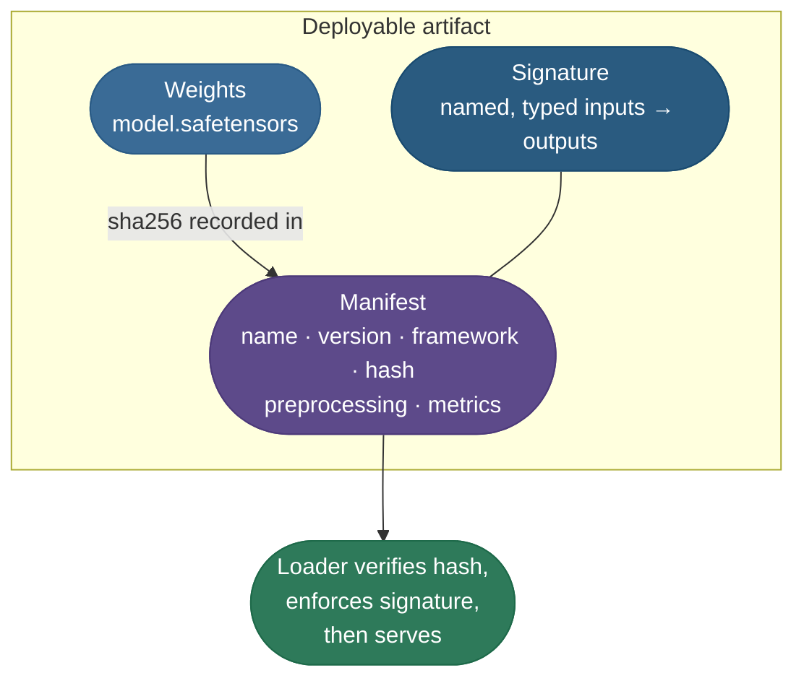
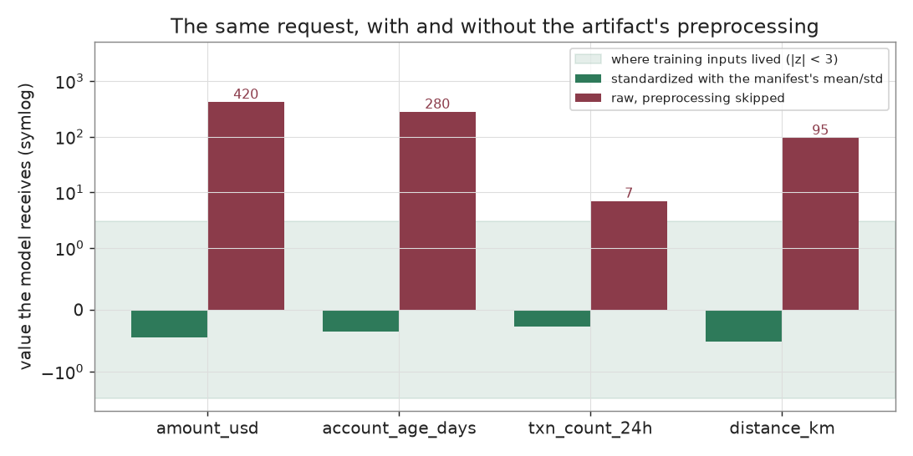
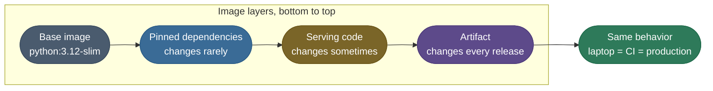

# Model Packaging and Containerization: from checkpoint to deployable artifact

Training ends with a file of weights. Production needs something a stranger can run on a machine you have never seen, and trust.

This page builds that thing in two layers:

- **The artifact** — weights, a manifest and an input signature that together describe and verify the model.
- **The image** — a container that pins everything around the artifact: OS, Python, libraries, entrypoint.

One example carries the whole page: **`transaction-risk`**, a small PyTorch classifier that reads four numbers about a card transaction and returns `low`, `medium` or `high` risk. It is tiny on purpose, so every failure mode below can be run on a laptop.

> **Note:** Neighbouring pages own the steps around packaging:
> - pinning seeds and environments so training reproduces — [Reproducibility](/ai-ml/ai-ml-learning-resources/operations-and-lifecycle/lifecycle-and-reproducibility/reproducibility/reproducibility)
> - naming versions and moving the Production pointer — [Model Registry and Governance](/ai-ml/ai-ml-learning-resources/operations-and-lifecycle/governance-and-economics/model-registry-and-governance/model-registry-and-governance)
> - exposing the artifact behind an API — [Model Serving](/ai-ml/ai-ml-learning-resources/inference-and-serving/packaging-and-serving/model-serving/model-serving)
> - releasing the image gradually — [A/B testing, shadow and canary deployment](/ai-ml/ai-ml-learning-resources/operations-and-lifecycle/release-and-deployment/ab-testing-shadow-and-canary-deployment/ab-testing-shadow-and-canary-deployment)

---

## The problem: a checkpoint is not a deployable

Hand a teammate `model.pt` and a Slack message, and four incidents are waiting:

- **It will not load.** The container has a different PyTorch than training did, and the checkpoint depended on it.
- **It loads and returns nonsense, silently.** The caller sends raw dollars where the model was trained on standardized values.
- **It is not the file you trained.** A partial download or a swapped file serves predictions for days before anyone notices.
- **It runs code on load.** A pickled checkpoint can execute whatever its author embedded, the moment you open it.

None of these is a modelling bug. Each is **missing information or missing verification** around the weights — which is exactly what packaging adds.

---

## What an artifact is

An artifact is a model you could hand to a stranger who could serve it **without asking you a single question.** It has three parts, bound together by a hash.



What each part answers:

- **Weights** — the learned parameters, in a format that stores tensors and nothing else.
- **Manifest** — the birth certificate: which framework, which version, the weights' SHA-256 hash, the preprocessing statistics, the evaluation score.
- **Signature** — the input/output contract: exactly which named, typed features go in, and what comes out.

**The intuition: a sealed medicine bottle.** The label names the drug, the dose and the batch number; the seal shows nobody opened it.

- The **manifest is the label** — what is inside and how to take it (the preprocessing is the dose).
- The **hash is the seal** — broken means do not use, whatever the label says.
- The **signature is the dosage form** — a tablet will not go into an inhaler.
- **Where it breaks:** a sealed, correctly labelled bottle can still be the wrong drug for the patient. Whether the model is good enough is evaluation's job, not packaging's.

---

## Weight formats: why not a pickle

The format decides what loading a file is allowed to do. There are four in common use.

| Format | What is inside | Loading can run code? | Use it for |
|---|---|---|---|
| **Pickle** (`.pt`, `.bin` from `torch.save`) | a serialized Python object graph | **yes** — unpickling can call any function | local checkpoints you wrote yourself |
| **safetensors** | a JSON header plus raw tensor bytes | no | the default for shipping PyTorch and Hugging Face weights |
| **GGUF** | quantized tensors plus model metadata in one file | no | llama.cpp-class local and edge runtimes |
| **ONNX** | a framework-neutral compute graph plus weights | no | ONNX Runtime and accelerator toolchains |

Why the first row matters:

- A pickle stores **instructions for rebuilding objects**, and those instructions may name any callable. The program below proves it with a harmless `print`.
- safetensors stores only a header and bytes, so the worst a malicious file can do is fail to parse. It also loads zero-copy by memory-mapping.
- If you must read a pickle, `torch.load(path, weights_only=True)` restricts unpickling to tensors and plain containers.

How quantized formats trade size against accuracy is the [Quantization](/ai-ml/ai-ml-learning-resources/inference-and-serving/quantization/quantization) page's subject.

---

## Training/serving skew, and the signature that stops it

**Training/serving skew** means the inputs at serving time differ from what the model saw in training. It is the most common silent production bug, because the model does not crash — it confidently answers the wrong question.

The shapes it takes:

| Skew | Example | What the model does |
|---|---|---|
| **Missing preprocessing** | trained on standardized values, served raw dollars | extreme inputs, confident nonsense |
| **Order** | features arrive `[age, amount, …]` instead of `[amount, age, …]` | reads each value as another feature |
| **Type** | `"420.0"` as a string | crashes in the best case, coerces badly in the worst |
| **Missing feature** | caller omits `distance_km` | fills with a default nobody chose |

`transaction-risk` was trained on standardized features: `(value − mean) / std`, with the mean and standard deviation measured on the training set. Here is one request two ways:



*Standardized, the request sits where the training data lived. Raw, three of the four features are 95 to 420 times larger than any value the model ever saw.*

The consequence, from the program below:

- **With the manifest's preprocessing:** `{'risk': 'medium', 'confidence': 1.0}`.
- **Raw features, preprocessing skipped:** `{'risk': 'high', 'confidence': 1.0}` — equally confident, and wrong.

Two defences, and the artifact carries both:

- **Ship the preprocessing in the artifact.** The mean and standard deviation live in the manifest, so serving cannot use different numbers than training did.
- **Enforce the signature before the model runs.** Match inputs by name, not position; reject missing, unknown and non-numeric fields. A malformed request becomes a loud `422`, not a quiet misprediction.

---

## The manifest

This is the manifest the program writes for `transaction-risk`, exactly as emitted (the `mean`, `std` and signature arrays are joined onto single lines here for reading):

```json
{
  "name": "transaction-risk",
  "version": "1.0.0",
  "framework": "torch==2.13.0",
  "weights_file": "model.safetensors",
  "weights_format": "safetensors",
  "weights_sha256": "fff73fa6bdf6ecffef7bf8774cd6d7255f2cbecfd03c46ea2710df22af7dad8b",
  "architecture": {"class": "RiskClassifier", "in_features": 4, "hidden": 16, "out_classes": 3},
  "preprocessing": {
    "standardize": {
      "mean": [957.9415893554688, 435.86834716796875, 9.339301109313965, 320.4930725097656],
      "std": [1197.8740234375, 439.5343322753906, 8.799079895019531, 444.5162353515625]
    }
  },
  "signature": {
    "inputs": [
      {"name": "amount_usd", "dtype": "float32"},
      {"name": "account_age_days", "dtype": "float32"},
      {"name": "txn_count_24h", "dtype": "float32"},
      {"name": "distance_km", "dtype": "float32"}
    ],
    "outputs": [{"name": "risk", "dtype": "string", "values": ["low", "medium", "high"]}]
  },
  "metrics": {"holdout_accuracy": 1.0}
}
```

Every deployment question now has a written answer:

- **Which framework?** `torch==2.13.0` — pin exactly that in the image.
- **Are these the bits we trained?** Hash `model.safetensors` and compare with `weights_sha256`.
- **How do I prepare inputs?** Standardize with those four means and standard deviations.
- **What may I send, and what comes back?** Four named `float32` features in; one of three strings out.
- **Is it good enough to serve?** `holdout_accuracy` says so — `1.0` here because the toy classes barely overlap; a real model's number is what the registry's promotion gate reads.

> **Note:** The hash depends on the exact bytes training produced, so another PyTorch build or CPU may print a different `weights_sha256`. That is the point: the manifest pins the file you actually trained, not the recipe.

---

## Containerizing: freezing the world around the artifact

The artifact pins the model. A **container image** pins everything around it — OS libraries, Python, the exact packages, the entrypoint — so the same bytes run on a laptop, in CI and on every production node.



**Layer order is a build-time decision.** Docker caches each layer and rebuilds from the first one whose inputs changed:

- Put what changes **least** at the bottom — base image, then dependencies.
- Put what changes **most** at the top — the artifact.
- Shipping a new model then rebuilds one thin layer, not a multi-gigabyte PyTorch install.

A reference Dockerfile for `transaction-risk`, not run on this page:

```dockerfile
FROM python:3.12-slim

ENV PYTHONDONTWRITEBYTECODE=1 PYTHONUNBUFFERED=1
WORKDIR /app

# Dependencies first: this layer rebuilds only when requirements.txt changes.
COPY requirements.txt .
RUN pip install --no-cache-dir -r requirements.txt

# Serving code, then the artifact: a new model version rebuilds only these layers.
COPY package_and_serve.py serve.py ./
COPY artifact/ ./artifact/

# Never serve as root.
RUN useradd --create-home appuser
USER appuser

EXPOSE 8000
# slim images ship without curl, so probe with Python itself.
HEALTHCHECK --interval=10s --timeout=3s \
    CMD python -c "import urllib.request; urllib.request.urlopen('http://localhost:8000/healthz')"
CMD ["uvicorn", "serve:app", "--host", "0.0.0.0", "--port", "8000"]
```

`requirements.txt` is exported from the project's lockfile (`uv export --format requirements-txt`), so every version the image installs is exact. The `serve.py` it runs wraps the program's `ModelService` in FastAPI — reference, not run here:

```python
from pathlib import Path

from fastapi import FastAPI, HTTPException

from package_and_serve import ModelService, SignatureError

app = FastAPI()
service = ModelService(Path("artifact"))     # hash verified once, at startup


@app.get("/healthz")
def healthz() -> dict:
    return {"status": "ok", "model": f'{service.manifest["name"]}:{service.manifest["version"]}'}


@app.post("/predict")
def predict(record: dict) -> dict:
    try:
        return service.predict(record)
    except SignatureError as error:
        raise HTTPException(status_code=422, detail=str(error)) from error
```

**Bake the weights in, or fetch them at start?** Both are common; the choice is a trade:

| Approach | Strength | Cost |
|---|---|---|
| **Baked into the image** | one immutable, self-contained unit | a 15 GB LLM makes a 15 GB image: slow pulls, slow cold starts |
| **Fetched at startup** from object storage or a registry | small image, weights cached per node | a runtime dependency; the loader **must** verify the hash |
| **Model as an OCI artifact** (for example Docker Model Runner) | weights versioned and pulled like images, beside the container | newer tooling; runtime support varies |

Small classical models are usually baked in. LLMs are usually fetched, which is exactly why the hash check lives in the loader rather than in the build.

**GPU images add one more pin.** A CUDA base image fixes the CUDA toolkit version, and the node's driver must be new enough for it. Pin both, or the image that ran in staging fails on a production node with an older driver.

---

## The program: package, serve, refuse

This program is the whole page in one file. It trains `transaction-risk`, writes the artifact, serves a request the way the container would, and then tries every failure from the opening section.

It is PyTorch for the model and plain Python for packaging. Run it with `uv run --python 3.12 --with torch --with safetensors python package_and_serve.py`:

```python
"""Package a PyTorch model as a verifiable artifact, then serve it the way a container would.

The artifact is safetensors weights plus a manifest that records the weight hash, the
preprocessing statistics and the input signature. The loader refuses anything that
breaks those promises: a flipped byte, a missing feature, a string where a number
belongs. The last demo shows why pickled checkpoints are the wrong format to ship.
Runs on CPU in a few seconds.
"""
from __future__ import annotations

import hashlib
import json
import pickle
import shutil
import tempfile
from dataclasses import dataclass
from pathlib import Path

import torch
from safetensors.torch import load_file, save_file
from torch import nn

MODEL_NAME = "transaction-risk"
MODEL_VERSION = "1.0.0"
FEATURES = ["amount_usd", "account_age_days", "txn_count_24h", "distance_km"]
CLASSES = ["low", "medium", "high"]
CLASS_CENTERS = torch.tensor([
    [40.0, 900.0, 2.0, 5.0],
    [400.0, 300.0, 6.0, 80.0],
    [2500.0, 20.0, 20.0, 900.0],
])
SPREAD = 0.35
HIDDEN_UNITS = 16
SAMPLES_PER_CLASS = 200
TRAIN_FRACTION = 0.7
TRAIN_STEPS = 300
LEARNING_RATE = 0.05
SEED = 0


class SignatureError(ValueError):
    """A request that does not match the artifact's input contract."""


class IntegrityError(ValueError):
    """Weights on disk that do not match the manifest's hash."""


@dataclass(frozen=True)
class LabelledData:
    features: torch.Tensor
    labels: torch.Tensor


class RiskClassifier(nn.Module):
    def __init__(self, in_features: int, hidden: int, out_classes: int) -> None:
        super().__init__()
        self.net = nn.Sequential(nn.Linear(in_features, hidden), nn.ReLU(),
                                 nn.Linear(hidden, out_classes))

    def forward(self, x: torch.Tensor) -> torch.Tensor:
        return self.net(x)


def make_data(generator: torch.Generator) -> LabelledData:
    """Gaussian clusters around each class centre, each feature spread 35 percent."""
    features, labels = [], []
    for index, center in enumerate(CLASS_CENTERS):
        noise = torch.randn(SAMPLES_PER_CLASS, len(FEATURES), generator=generator)
        features.append(center + noise * center * SPREAD)
        labels.append(torch.full((SAMPLES_PER_CLASS,), index))
    return LabelledData(torch.cat(features), torch.cat(labels))


def sha256_of(path: Path) -> str:
    digest = hashlib.sha256()
    with path.open("rb") as handle:
        for chunk in iter(lambda: handle.read(8192), b""):
            digest.update(chunk)
    return digest.hexdigest()


def train_and_package(out_dir: Path) -> dict:
    generator = torch.Generator().manual_seed(SEED)
    torch.manual_seed(SEED)
    data = make_data(generator)
    order = torch.randperm(len(data.labels), generator=generator)
    cut = int(TRAIN_FRACTION * len(order))
    train, test = order[:cut], order[cut:]
    mean, std = data.features[train].mean(0), data.features[train].std(0)

    model = RiskClassifier(len(FEATURES), HIDDEN_UNITS, len(CLASSES))
    optimizer = torch.optim.Adam(model.parameters(), lr=LEARNING_RATE)
    for _ in range(TRAIN_STEPS):
        loss = nn.functional.cross_entropy(model((data.features[train] - mean) / std), data.labels[train])
        optimizer.zero_grad()
        loss.backward()
        optimizer.step()
    with torch.no_grad():
        predicted = model((data.features[test] - mean) / std).argmax(1)
    accuracy = (predicted == data.labels[test]).float().mean().item()

    weights_path = out_dir / "model.safetensors"
    save_file(model.state_dict(), str(weights_path))
    manifest = {
        "name": MODEL_NAME, "version": MODEL_VERSION,
        "framework": f"torch=={torch.__version__}",
        "weights_file": weights_path.name, "weights_format": "safetensors",
        "weights_sha256": sha256_of(weights_path),
        "architecture": {"class": "RiskClassifier", "in_features": len(FEATURES),
                         "hidden": HIDDEN_UNITS, "out_classes": len(CLASSES)},
        "preprocessing": {"standardize": {"mean": mean.tolist(), "std": std.tolist()}},
        "signature": {"inputs": [{"name": name, "dtype": "float32"} for name in FEATURES],
                      "outputs": [{"name": "risk", "dtype": "string", "values": CLASSES}]},
        "metrics": {"holdout_accuracy": round(accuracy, 4)},
    }
    (out_dir / "manifest.json").write_text(json.dumps(manifest, indent=2))
    return manifest


class ModelService:
    """The container entrypoint: trusts only the manifest, verifies before it serves."""

    def __init__(self, artifact_dir: Path) -> None:
        self.manifest = json.loads((artifact_dir / "manifest.json").read_text())
        weights_path = artifact_dir / self.manifest["weights_file"]
        if sha256_of(weights_path) != self.manifest["weights_sha256"]:
            raise IntegrityError("weights sha256 does not match the manifest; refusing to serve")
        shape = self.manifest["architecture"]
        self.model = RiskClassifier(shape["in_features"], shape["hidden"], shape["out_classes"])
        self.model.load_state_dict(load_file(str(weights_path)), strict=True)
        self.model.eval()
        stats = self.manifest["preprocessing"]["standardize"]
        self.mean, self.std = torch.tensor(stats["mean"]), torch.tensor(stats["std"])
        self.input_names = [spec["name"] for spec in self.manifest["signature"]["inputs"]]
        self.classes = self.manifest["signature"]["outputs"][0]["values"]

    def validate(self, record: dict) -> torch.Tensor:
        missing = [name for name in self.input_names if name not in record]
        unknown = sorted(set(record) - set(self.input_names))
        if missing or unknown:
            raise SignatureError(f"missing={missing} unknown={unknown}")
        wrong_type = [name for name in self.input_names
                      if isinstance(record[name], bool) or not isinstance(record[name], (int, float))]
        if wrong_type:
            raise SignatureError(f"not numeric: {wrong_type}")
        return torch.tensor([[float(record[name]) for name in self.input_names]])

    def score(self, features: torch.Tensor) -> dict:
        with torch.no_grad():
            probabilities = self.model(features).softmax(1)[0]
        index = int(probabilities.argmax())
        return {"risk": self.classes[index], "confidence": round(float(probabilities[index]), 3)}

    def predict(self, record: dict) -> dict:
        return self.score((self.validate(record) - self.mean) / self.std)


class RunsCodeOnLoad:
    """Any pickled object can name a function for the unpickler to call."""

    def __reduce__(self):
        return (print, ("  pickle.loads just called print() -- it could call anything",))


def demo_integrity(artifact: Path) -> None:
    tampered = Path(tempfile.mkdtemp(prefix="tampered-"))
    shutil.copytree(artifact, tampered, dirs_exist_ok=True)
    weights = bytearray((tampered / "model.safetensors").read_bytes())
    weights[-1] ^= 0x01                                   # flip one bit of one weight
    (tampered / "model.safetensors").write_bytes(bytes(weights))
    try:
        ModelService(tampered)
    except IntegrityError as error:
        print("  tampered artifact :", error)


def main() -> None:
    artifact = Path(tempfile.mkdtemp(prefix="artifact-"))
    manifest = train_and_package(artifact)
    print("== packaged artifact ==")
    print("  files            :", sorted(path.name for path in artifact.iterdir()))
    print("  framework        :", manifest["framework"])
    print("  weights sha256   :", manifest["weights_sha256"][:16], "...")
    print("  holdout accuracy :", manifest["metrics"]["holdout_accuracy"])

    service = ModelService(artifact)
    request = {"amount_usd": 420.0, "account_age_days": 280, "txn_count_24h": 7, "distance_km": 95.0}
    print("\n== one request, served ==")
    print("  with the manifest's preprocessing   :", service.predict(request))
    print("  raw features, preprocessing skipped :", service.score(service.validate(request)))

    print("\n== requests that break the contract ==")
    for bad in ({"amount_usd": 420.0}, {**request, "amount_usd": "420.0"}):
        try:
            service.predict(bad)
        except SignatureError as error:
            print("  rejected          :", error)
    demo_integrity(artifact)

    print("\n== why the weights are not a pickle ==")
    pickle.loads(pickle.dumps(RunsCodeOnLoad()))


if __name__ == "__main__":
    main()
```

Its output, exactly as printed:

```text
== packaged artifact ==
  files            : ['manifest.json', 'model.safetensors']
  framework        : torch==2.13.0
  weights sha256   : fff73fa6bdf6ecff ...
  holdout accuracy : 1.0

== one request, served ==
  with the manifest's preprocessing   : {'risk': 'medium', 'confidence': 1.0}
  raw features, preprocessing skipped : {'risk': 'high', 'confidence': 1.0}

== requests that break the contract ==
  rejected          : missing=['account_age_days', 'txn_count_24h', 'distance_km'] unknown=[]
  rejected          : not numeric: ['amount_usd']
  tampered artifact : weights sha256 does not match the manifest; refusing to serve

== why the weights are not a pickle ==
  pickle.loads just called print() -- it could call anything
```

How the output maps to the opening incidents:

- **"It will not load"** — the manifest records `torch==2.13.0`, so the image pins the same version.
- **"Nonsense, silently"** — skipping preprocessing flips `medium` to `high` at full confidence; `predict` always applies the manifest's statistics.
- **Malformed requests** — the missing features and the `"420.0"` string are rejected before the model runs.
- **"Not the file you trained"** — flipping a single bit of one weight fails the hash check at startup.
- **"Runs code on load"** — unpickling called `print`; the safetensors weights have no such path.

The skew figure on this page is drawn by `code/make_figures.py` from the same `train_and_package` function.

---

## What-if analysis

Remove or change one piece and trace the consequence:

- **Drop the hash check.** A truncated download loads if its header still parses, or fails deep inside `load_state_dict` with an error that does not say "corrupt file".
- **Drop the preprocessing from the manifest.** Serving code re-implements standardization from memory, and the first difference in a mean or a column order is a silent skew.
- **Match inputs by position instead of name.** Two clients that build the list in different orders get different predictions, and neither errors.
- **Copy the artifact before the dependencies in the Dockerfile.** Every model release reinstalls PyTorch, and CI builds go from seconds to minutes.
- **Ship `torch.save` pickles.** Anyone who can write to the model bucket can run code on every serving node.

---

## Pitfalls

| Symptom | Likely cause | Fix |
|---|---|---|
| **Checkpoint loads on a laptop, fails in the container** | framework version skew between training and image | pin the manifest's `framework` version in the lockfile the image installs |
| **`/predict` returns plausible nonsense, no error** | training/serving skew: preprocessing, order or type | ship preprocessing in the manifest; enforce the signature by name before scoring |
| **Pod refuses to start: hash mismatch** | corrupted or partial download, or a swapped file | re-pull the artifact — the check is working; never disable it to "unblock" |
| **Every model release takes minutes to build** | the artifact is copied before dependencies, busting the layer cache | order layers from least to most frequently changing |
| **Health check always fails in a slim image** | `HEALTHCHECK` calls `curl`, which the image does not contain | probe with Python, or install the tool explicitly |
| **Staging passes, production fails on GPU nodes** | CUDA toolkit in the image newer than the node's driver | pin the CUDA base image and the node driver together |
| **Cold starts of many minutes for an LLM** | tens of gigabytes of weights baked into the image | fetch weights at startup with a node cache, verifying the hash |
| **Security scan flags the model bucket** | pickled checkpoints loadable by serving | convert to safetensors; load any remaining pickles with `weights_only=True` |

> **Tip:** Most of this table collapses into two habits:
> - **Make the artifact self-verifying** — hash, preprocessing and signature travel with the weights, so skew and corruption fail loudly at load.
> - **Make the image boring** — pinned base, pinned dependencies, layers ordered by change frequency, non-root user.

---

## Where it matters — and where it does not

The full artifact-plus-image discipline pays off when:

- **Someone else serves the model** — a platform team, another service, or you in six months.
- **Models ship often** — layer ordering and hash checks turn releases into routine builds.
- **Inputs cross a trust boundary** — public APIs, partner integrations, anything a signature should police.

Lighter packaging is fine when:

- **A notebook experiment never leaves your machine** — a checkpoint and a seed are enough.
- **A managed platform owns the format** — hosted endpoints and model registries often define the manifest for you; learn theirs rather than inventing a second one.
- **The model is an LLM served by an engine** — the engine loads a Hugging Face directory (safetensors plus config), and your job shifts to pinning the engine image; see [LLM Serving Engines](/ai-ml/ai-ml-learning-resources/inference-and-serving/packaging-and-serving/llm-serving-engines/llm-serving-engines).

---

## Key takeaways

- **An artifact is weights + manifest + signature**, bound by the weights' SHA-256 hash.
- **Ship safetensors, not pickles** — loading a pickle can run arbitrary code.
- **Training/serving skew is silent**: carry preprocessing in the manifest and enforce the signature by name.
- **Order image layers by change frequency** — base, dependencies, code, artifact.
- **Pin the whole world**: framework version, CUDA base image and driver together, non-root user, a health check that works in the image.

---

## Production implementation

Runnable services in this estate that implement what this page teaches:

- **[ml-platform](/python/python-production-examples/ml-platform/readme)** — packaging with provenance, a served prediction endpoint, and a registry that versions and gates every promotion.

---

## References

The curated link library for this topic — documentation, courses, articles and internal cross-links — lives in a companion file so it can be reused as a standalone reference list:

**→ [Model Packaging and Containerization — references](/ai-ml/ai-ml-learning-resources/inference-and-serving/packaging-and-serving/model-packaging-and-containerization/model-packaging-and-containerization#references-further-reading)**
