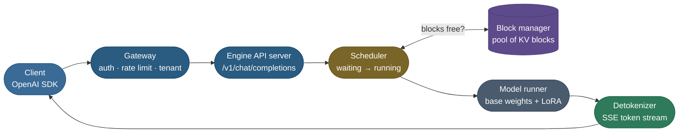
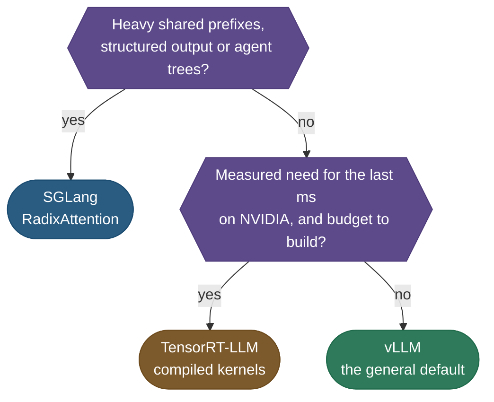
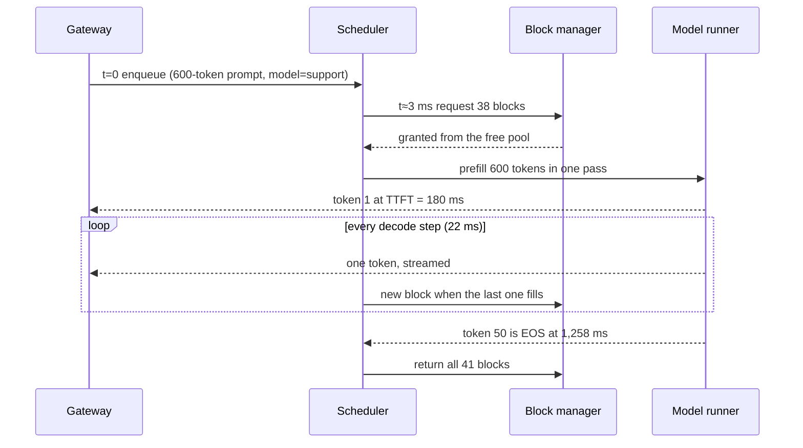
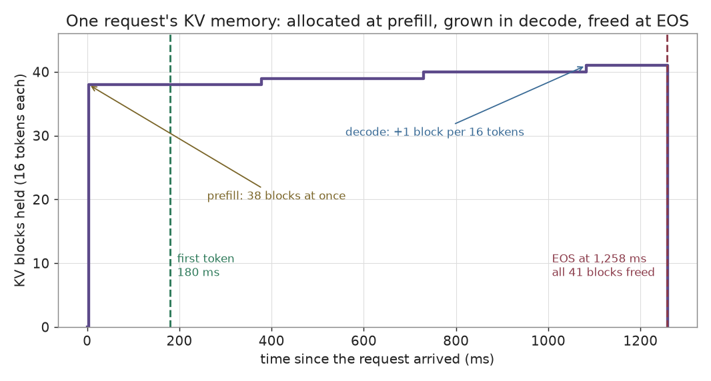
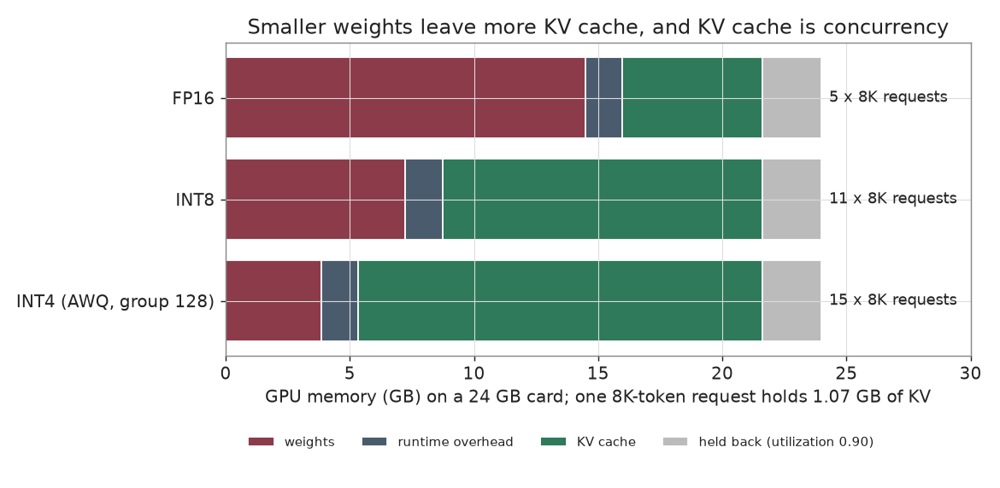
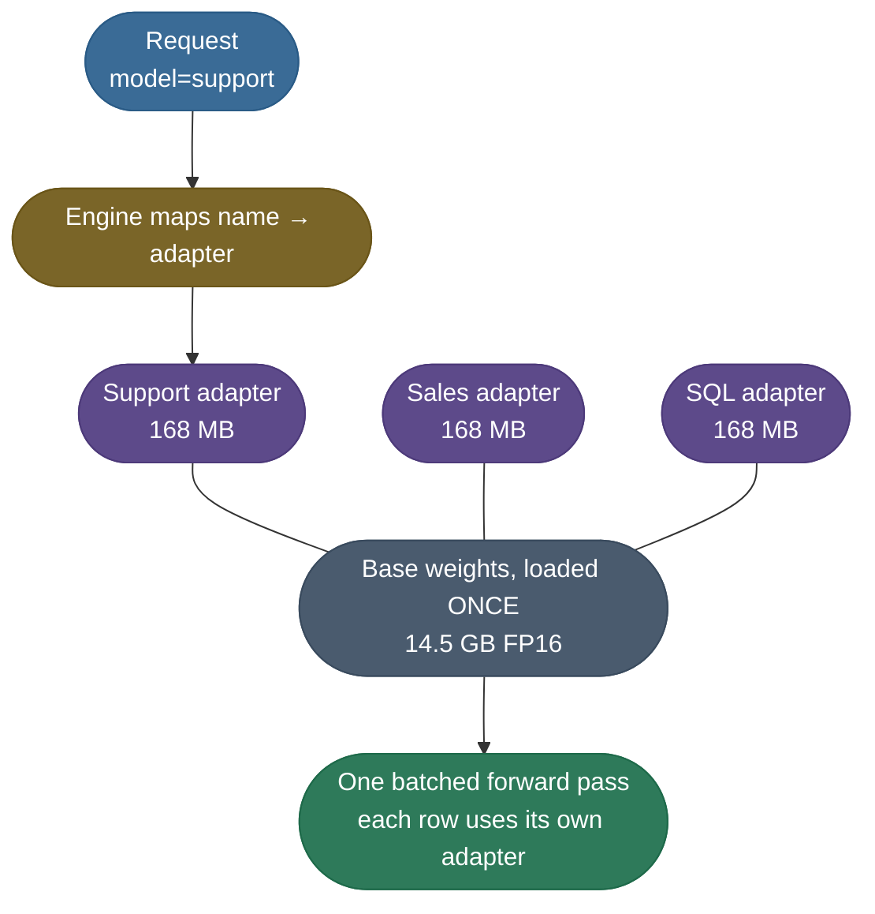
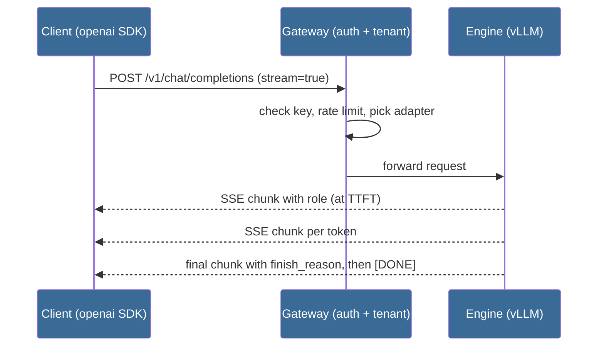

# LLM Serving Engines: from a checkpoint to a streaming endpoint

A fine-tuned model on disk answers nobody. An **inference engine** turns it into an endpoint that thousands of users can stream from at once.

This page is about the engine as a **product you choose, size and configure**:

- **Which engine** — vLLM, SGLang, Text Generation Inference (TGI) or TensorRT-LLM, and the question that picks one.
- **One request's life inside it** — the KV blocks it takes, grows and returns, with the latency clock running.
- **What fits on the GPU** — weights, runtime overhead and KV cache, per weight precision.
- **Many tenants on one base** — LoRA adapters swapped per request.
- **The contract** — an OpenAI-compatible streaming API, down to the wire frames.

One running example carries the whole page: **Atlas**, a `Mistral-7B-Instruct` base with three LoRA adapters (Support, Sales, SQL), served from one 24 GB GPU.

> **Note:** The mechanisms an engine is built from each have their own page. This page links them rather than re-teaching them:
> - why decode is memory-bound, and the prefill/decode split — [KV Cache](/ai-ml/ai-ml-learning-resources/inference-and-serving/kv-cache/kv-cache)
> - PagedAttention and why static batching wastes the GPU — [Inference Optimization](/ai-ml/ai-ml-learning-resources/inference-and-serving/inference-optimization/inference-optimization)
> - the per-step scheduler — [Continuous Batching and Scheduling](/ai-ml/ai-ml-learning-resources/inference-and-serving/continuous-batching-and-scheduling/continuous-batching-and-scheduling)
> - draft-and-verify decoding — [Speculative Decoding](/ai-ml/ai-ml-learning-resources/inference-and-serving/speculative-decoding/speculative-decoding)
>
> **Tip:** Serving a classic (non-LLM) model asks two questions first:
> - **online or batch** — per-request latency against scheduled throughput;
> - **which server** — REST or gRPC behind Triton, BentoML or KServe.
>
> This topic's [references](#references-further-reading) open with a suggested path through both.

---

## The problem: `model.generate()` behind a web route

The first serving attempt is always the same: load the model in a Flask or FastAPI process and call `generate()` per request. It collapses under load for three reasons.

- **One request at a time.** The GPU spends most of each decode step waiting on memory, so serial requests leave its compute idle.
- **Memory reserved for the worst case.** Each request gets a contiguous KV region sized for the maximum context, so a 200-token reply strands room for 8,000.
- **No contract.** Every client has to learn a bespoke request format, and nothing streams.

An engine fixes all three with the same move: **treat GPU memory as a pool of small KV blocks, and schedule requests into it every step.**

---

## What an engine is

Strip away the flags and every modern engine has the same five parts. A request flows left to right; the scheduler and the block manager decide when it may run.



What each part owns:

- **API server** — parses the OpenAI-shaped request, applies the chat template, tokenizes.
- **Scheduler** — every step, decides which waiting requests join the running batch and which finished ones leave.
- **Block manager** — the ledger of fixed-size KV blocks: who holds which, how many are free.
- **Model runner** — one forward pass over the whole running batch, applying each request's LoRA adapter.
- **Detokenizer** — turns sampled token ids back into text and streams them out as they appear.

**The intuition: a hotel run from a room ledger.** Rooms are KV blocks, guests are requests.

- A guest checks in only if the ledger shows enough free rooms for their luggage (the prompt).
- A long stay takes one more room every sixteen nights (tokens), never a whole floor up front.
- At checkout every room returns to the ledger at once, and the next guest in the lobby gets them.
- **Where the analogy breaks:** guests who share a prefix can share rooms (prefix caching), and under pressure the hotel may evict a guest mid-stay and re-admit them later (preemption).

---

## Which engine, and why

All four engines run the same playbook: paged KV cache, continuous batching, prefix reuse. They differ in what they optimize beyond it and in what the last few percent of speed costs you.

| | **vLLM** | **SGLang** | **TGI** | **TensorRT-LLM** |
|---|---|---|---|---|
| **Sweet spot** | general-purpose default | prefix-heavy, structured and agentic traffic | existing Hugging Face deployments (maintenance mode) | lowest latency on NVIDIA GPUs |
| **Signature machinery** | PagedAttention, automatic prefix caching | RadixAttention prefix tree, fast constrained decoding | first-class multi-LoRA, token streaming | compiled fused kernels, in-flight batching |
| **Setup effort** | low (`pip install vllm`) | low to medium | low (Docker image) | high (build an engine per model and GPU) |
| **Multi-LoRA** | yes (`--enable-lora`) | yes | first-class | limited |
| **OpenAI-compatible API** | built in | built in | built in | via a wrapper server |

> **Note:** TGI is in **maintenance mode**, and its repository was archived in March 2026:
> - Hugging Face now recommends vLLM and SGLang, which load the same `transformers` model definitions.
> - Keep TGI for deployments that already run it; do not start new ones on it.

Pick a new deployment with one question at a time:



> **Tip:** When unsure, start on **vLLM** — the broadest model support and documentation, and the engine Atlas runs on below. Engines ship releases monthly, so re-check each project's status before you standardize; TGI's archiving is the reminder.

For how each engine's cache strategy differs in depth, see [the engines and what they bet on](/ai-ml/ai-ml-learning-resources/inference-and-serving/kv-cache/kv-cache-in-production).

---

## One request, block by block

Here is one Atlas request through vLLM, as numbers you can recompute. The setup:

- **Model shape:** 32 layers, 8 KV heads of dimension 128, FP16 cache.
- **KV per token:** `2 × 32 × 8 × 128 × 2 bytes = 131,072 bytes` (128 KiB) — the formula is derived on the [KV Cache](/ai-ml/ai-ml-learning-resources/inference-and-serving/kv-cache/kv-cache) page.
- **Block size:** vLLM's default of 16 tokens, so one block is `16 × 131,072 = 2.10 MB`.
- **The request:** a 600-token prompt to the Support adapter, answered in 50 tokens.
- **The clock:** Time To First Token (TTFT) of 180 ms, Time Per Output Token (TPOT) of 22 ms.



What happens at each moment:

1. **Arrival, t = 0.** The gateway checks the key, resolves `model="support"` to the Support adapter, and enqueues. No GPU work yet.
2. **Admission, t ≈ 3 ms.** A running sequence just finished, so the scheduler admits Atlas mid-batch once 38 free blocks exist. It does not wait for the batch to drain.
3. **Prefill.** All 600 prompt tokens go through one parallel forward pass and fill `⌈600 / 16⌉ = 38` blocks, **79.7 MB**. The last position's logits give token 1 — that moment is TTFT.
4. **Decode.** Each step emits one token, sharing the forward pass with every other live sequence. Block 38 has 8 spare slots (`38 × 16 = 608`), so tokens 2 to 9 allocate nothing.
   - Producing token 10 writes token 9's KV, the cache reaches 609 tokens, and **block 39** opens.
   - Blocks 40 and 41 open at tokens 26 and 42, each adding 2.10 MB.
5. **EOS, t = 1,258 ms.** Token 50 is the stop token. The cache holds 649 tokens in 41 blocks (**86.0 MB**), and all of them return to the pool in one step.



*The request's memory is a staircase: one big allocation at prefill, one small step per 16 decoded tokens, then a cliff at EOS. That cliff is why concurrency, not total traffic, sets the memory ceiling.*

Two off-by-ones hide in that trace, and both show up in capacity math:

- **The end-to-end clock is `TTFT + TPOT × (N − 1)`,** not `× N`. Token 1 arrives with prefill, so 50 tokens take `180 + 22 × 49 = 1,258 ms`.
- **The last token is never cached.** Token *k* enters the cache when it is fed back to produce token *k + 1*, so the cache peaks at `prompt + output − 1 = 649` tokens.

> **Note:** The user sees the first word at 180 ms and watches the rest arrive. Streaming does not shorten the 1.26 s; it moves the wait to where nobody notices it.

---

## What fits on the GPU: weights, overhead and KV cache

The engine claims a fixed slice of GPU memory at startup, loads the weights, and turns **everything left over into KV blocks.** That leftover is your concurrency.

The budget for one 24 GB GPU:

- **Usable memory** = `24 GB × --gpu-memory-utilization (0.90) = 21.6 GB`. The rest is held back for the CUDA driver and fragmentation.
- **Weights** = `parameters × bits per weight ÷ 8`. Mistral-7B has 7.24 B parameters.
- **Runtime overhead** = CUDA context, activations and captured graphs. This page assumes **1.5 GB**; measure yours from the engine's startup log.
- **KV cache** = usable − weights − overhead.
- **One 8,192-token request** holds `8,192 × 131,072 bytes = 1.07 GB` of KV.

The program at the end of this page computes the table:

| Weight precision | Weights | KV cache | Concurrent 8K-token requests |
|---|---:|---:|---:|
| **FP16** (16 bits) | 14.48 GB | 5.62 GB | **5** |
| **INT8** (8 bits) | 7.24 GB | 12.86 GB | **11** |
| **INT4, AWQ group 128** (4.25 bits with scales) | 3.85 GB | 16.25 GB | **15** |



*Every gigabyte the weights give up becomes KV cache. Going from FP16 to 4-bit triples how many long requests fit on the same card.*

What the table does and does not say:

- **It is a memory argument only.** Whether 4-bit quality and cost per token are acceptable for Atlas is the [Quantization](/ai-ml/ai-ml-learning-resources/inference-and-serving/quantization/quantization) page's question.
- **The KV cache has its own precision.** An FP8 KV cache halves the 131,072 bytes per token again; see the variants in [KV Cache](/ai-ml/ai-ml-learning-resources/inference-and-serving/kv-cache/kv-cache-variants).
- **`--max-model-len` is a promise the engine checks.** At startup vLLM refuses to run if not even one maximum-length sequence fits in the KV budget.

Standing Atlas up is one install and one command. This is reference configuration — it needs a CUDA GPU, so it is not run on this page:

```bash
uv pip install vllm openai
vllm serve mistralai/Mistral-7B-Instruct-v0.3 --port 8000
```

---

## Many tenants on one base: LoRA hot-swap

Atlas has three personalities, and a SaaS product may have hundreds. Running a full model copy per tenant multiplies the weights; **loading the base once and swapping small adapters per request** does not.



**Where 168 MB comes from.** A rank-*r* LoRA on a linear layer of shape `d_in → d_out` adds `r × (d_in + d_out)` parameters. For Mistral-7B at rank 32 on all seven projections:

| Projection | Shape | Parameters at r = 32 |
|---|---|---:|
| q, o (each) | 4096 → 4096 | 262,144 |
| k, v (each) | 4096 → 1024 | 163,840 |
| gate, up, down (each) | 4096 ↔ 14336 | 589,824 |
| **one layer** | | **2,621,440** |

Times 32 layers is 83.9 M parameters, and at 2 bytes each, **167.8 MB** per adapter. The bill for five tenants:

| Deployment | GPU memory for 5 tenants | Cost of tenant number 6 |
|---|---:|---|
| **5 full copies** | 72.4 GB | another GPU |
| **1 base + 5 adapters** | 15.3 GB | a 168 MB file |

How engines make this fast:

- **Batched multi-LoRA.** One decode batch mixes rows for different adapters; custom kernels apply each row's low-rank update inside the same forward pass.
- **S-LoRA** showed the approach scaling to thousands of adapters by paging adapter weights in a unified memory pool alongside the KV cache.
- **vLLM flags:** `--enable-lora`, `--lora-modules support=/path/to/support`, `--max-loras` (adapters active in one batch), `--max-lora-rank` (must cover your largest rank).
- **TGI (existing deployments):** list adapters in the `LORA_ADAPTERS` environment variable, then select one per request with `adapter_id`.

Why a 168 MB file can redirect a 14.5 GB model is the [LoRA and parameter-efficient fine-tuning](/ai-ml/ai-ml-learning-resources/model-adaptation/lora-and-parameter-efficient-fine-tuning/lora-and-parameter-efficient-fine-tuning) page's story.

---

## The contract: an OpenAI-compatible streaming API

Atlas needs an interface the rest of the world already speaks. That is the **OpenAI Chat Completions API**: `POST /v1/chat/completions` with a `messages` array.

- Every major engine serves it, so the `openai` SDK, LangChain and your front end work unchanged.
- Switching from a hosted model to Atlas is **one `base_url` change**.



Two design rules shape the endpoint:

- **Stream.** With `stream=true` the engine sends tokens as **Server-Sent Events (SSE)** the moment they exist. Perceived latency becomes TTFT instead of the full reply time.
- **Keep the gateway thin and in front.** Authentication, rate limiting, per-tenant keys, request logging and routing live in a small layer before the engine.
  - The engine's job is filling GPU slots; every cross-cutting concern inside it competes with that.
  - A thin gateway also lets you put several engine replicas behind one address.

**What streaming looks like on the wire.** Each event is a line starting `data: ` holding one JSON chunk, separated by a blank line. Atlas answering "How do I reset my password?":

```text
data: {"id":"chatcmpl-atlas-9f2","object":"chat.completion.chunk","model":"support","choices":[{"index":0,"delta":{"role":"assistant","content":""},"finish_reason":null}]}

data: {"id":"chatcmpl-atlas-9f2","object":"chat.completion.chunk","model":"support","choices":[{"index":0,"delta":{"content":"Click"},"finish_reason":null}]}

data: {"id":"chatcmpl-atlas-9f2","object":"chat.completion.chunk","model":"support","choices":[{"index":0,"delta":{"content":" \"Forgot"},"finish_reason":null}]}

data: {"id":"chatcmpl-atlas-9f2","object":"chat.completion.chunk","model":"support","choices":[{"index":0,"delta":{"content":" password\""},"finish_reason":null}]}

data: {"id":"chatcmpl-atlas-9f2","object":"chat.completion.chunk","model":"support","choices":[{"index":0,"delta":{},"finish_reason":"stop"}]}

data: [DONE]
```

Reading the frames:

- **First chunk** carries `delta.role` and arrives at TTFT.
- **Middle chunks** carry one token's text each in `delta.content`.
- **Last real chunk** has an empty `delta` and a `finish_reason`: `"stop"` means a stop token, `"length"` means `max_tokens` ran out.
- **`data: [DONE]`** closes the stream. The SDK parses all of this; your loop only reads `delta.content`.

---

## Atlas in production: launch flags and a streaming client

The production launch adds the levers from the sections above. Reference configuration, GPU required:

```bash
vllm serve mistralai/Mistral-7B-Instruct-v0.3 \
    --max-model-len 8192 \
    --gpu-memory-utilization 0.90 \
    --enable-lora \
    --max-lora-rank 32 \
    --lora-modules support=./adapters/support sales=./adapters/sales sql=./adapters/sql \
    --enable-prefix-caching \
    --enable-chunked-prefill \
    --api-key "$SERVE_KEY" \
    --port 8000
```

What each flag buys:

| Flag | Lever | Section it comes from |
|---|---|---|
| `--max-model-len 8192` | caps the KV a single request may claim | what fits on the GPU |
| `--gpu-memory-utilization 0.90` | sets the pool the KV blocks are carved from | what fits on the GPU |
| `--enable-lora`, `--max-lora-rank`, `--lora-modules` | one base, many tenants, routed by `model` | LoRA hot-swap |
| `--enable-prefix-caching` | shared system prompts reuse the same blocks | [KV Cache in production](/ai-ml/ai-ml-learning-resources/inference-and-serving/kv-cache/kv-cache-in-production) |
| `--enable-chunked-prefill` | long prompts stop stalling other requests' decode | [Continuous batching](/ai-ml/ai-ml-learning-resources/inference-and-serving/continuous-batching-and-scheduling/continuous-batching-and-scheduling) |
| `--api-key` | rejects unauthenticated calls at the engine | the contract |

> **Note:** Engine defaults for prefix caching and chunked prefill have changed between releases. Passing the flags explicitly keeps behavior pinned when an upgrade changes a default.

Any OpenAI client then talks to Atlas. Reference, needs the running endpoint:

```python
import os

from openai import OpenAI

client = OpenAI(base_url="http://localhost:8000/v1", api_key=os.environ["SERVE_KEY"])

stream = client.chat.completions.create(
    model="support",                      # the LoRA adapter name from --lora-modules
    messages=[{"role": "user", "content": "How do I reset my password?"}],
    stream=True,
)
for chunk in stream:
    print(chunk.choices[0].delta.content or "", end="", flush=True)
```

**The part you can run.** Every number on this page — blocks, megabytes, the clock, the VRAM table, the LoRA bill — comes from this program. It is plain Python because each number is arithmetic on model shape and engine settings; no GPU is needed. Run it with `uv run --python 3.12 python request_lifecycle.py`:

```python
"""One LLM request through a paged-KV serving engine, worked as arithmetic.

Traces a 600-token prompt and a 50-token answer on a Mistral-7B-shaped model:
the blocks the engine allocates and frees, the latency clock the user feels,
how much of a 24 GB GPU is left for the KV cache at each weight precision, and
the memory bill for serving five LoRA tenants. Plain Python on purpose: every
number is a product of model shape and engine settings, so no GPU is needed.
"""
from __future__ import annotations

import math
from dataclasses import dataclass

GB = 1e9
MB = 1e6
PROMPT_TOKENS = 600
OUTPUT_TOKENS = 50
TTFT_MS = 180.0
TPOT_MS = 22.0
LONG_CONTEXT_TOKENS = 8192
LORA_RANK = 32
LORA_TENANTS = 5


@dataclass(frozen=True)
class ModelShape:
    name: str
    parameters: float
    layers: int
    hidden: int
    mlp_hidden: int
    kv_heads: int
    head_dim: int


@dataclass(frozen=True)
class EngineSettings:
    block_size_tokens: int = 16            # vLLM default block size
    kv_bytes_per_element: int = 2          # FP16 / BF16 cache
    gpu_memory_gb: float = 24.0
    gpu_memory_utilization: float = 0.90   # vLLM --gpu-memory-utilization
    runtime_overhead_gb: float = 1.5       # CUDA context, activations, graphs (assumed)


@dataclass(frozen=True)
class BlockEvent:
    event: str
    tokens_in_cache: int
    blocks_held: int


@dataclass(frozen=True)
class VramBudget:
    precision: str
    weights_gb: float
    kv_cache_gb: float
    concurrent_long_requests: int


MISTRAL_7B = ModelShape("Mistral-7B", parameters=7.24e9, layers=32, hidden=4096,
                        mlp_hidden=14336, kv_heads=8, head_dim=128)
ENGINE = EngineSettings()
BITS_PER_WEIGHT = {"FP16": 16.0, "INT8": 8.0, "INT4 (AWQ, group 128)": 4.25}


def kv_bytes_per_token(model: ModelShape, engine: EngineSettings) -> int:
    """A key and a value vector, in every layer, for one token."""
    return 2 * model.layers * model.kv_heads * model.head_dim * engine.kv_bytes_per_element


def blocks_for(tokens: int, engine: EngineSettings) -> int:
    return math.ceil(tokens / engine.block_size_tokens)


def trace_request(prompt_tokens: int, output_tokens: int, engine: EngineSettings) -> list[BlockEvent]:
    """Every moment the request's block count changes, from prefill to EOS."""
    held = blocks_for(prompt_tokens, engine)
    events = [BlockEvent("prefill writes the prompt", prompt_tokens, held)]
    # Output token k enters the cache when it is fed back to produce token k+1,
    # so the last token is never cached: the cache peaks at prompt + output - 1.
    for generated in range(1, output_tokens):
        cached = prompt_tokens + generated
        if blocks_for(cached, engine) > held:
            held = blocks_for(cached, engine)
            events.append(BlockEvent(f"output token {generated + 1} needs a new block", cached, held))
    events.append(BlockEvent("EOS returns every block to the pool", prompt_tokens + output_tokens - 1, held))
    return events


def end_to_end_ms(ttft_ms: float, tpot_ms: float, output_tokens: int) -> float:
    """The first token arrives at TTFT; each later token costs one TPOT."""
    return ttft_ms + tpot_ms * (output_tokens - 1)


def vram_budget(model: ModelShape, engine: EngineSettings, precision: str, context_tokens: int) -> VramBudget:
    weights_gb = model.parameters * BITS_PER_WEIGHT[precision] / 8 / GB
    usable_gb = engine.gpu_memory_gb * engine.gpu_memory_utilization
    kv_cache_gb = usable_gb - weights_gb - engine.runtime_overhead_gb
    per_request_gb = kv_bytes_per_token(model, engine) * context_tokens / GB
    concurrent = max(0, math.floor(kv_cache_gb / per_request_gb))
    return VramBudget(precision, weights_gb, kv_cache_gb, concurrent)


def lora_adapter_mb(model: ModelShape, rank: int) -> float:
    """Rank-r A and B matrices on all seven linear projections of every layer, FP16."""
    kv_width = model.kv_heads * model.head_dim
    shapes = [
        (model.hidden, model.hidden), (model.hidden, kv_width), (model.hidden, kv_width),
        (model.hidden, model.hidden), (model.hidden, model.mlp_hidden),
        (model.hidden, model.mlp_hidden), (model.mlp_hidden, model.hidden),
    ]
    per_layer = sum(rank * (fan_in + fan_out) for fan_in, fan_out in shapes)
    return per_layer * model.layers * 2 / MB


def print_lifecycle() -> None:
    per_token = kv_bytes_per_token(MISTRAL_7B, ENGINE)
    block_mb = per_token * ENGINE.block_size_tokens / MB
    print(f"KV cache per token : {per_token:,} bytes ({per_token / 1024:.0f} KiB)")
    print(f"one 16-token block : {block_mb:.2f} MB")
    print("\n== block timeline for one request ==")
    for step in trace_request(PROMPT_TOKENS, OUTPUT_TOKENS, ENGINE):
        size_mb = step.blocks_held * block_mb
        print(f"  {step.event:<38} cache={step.tokens_in_cache:>4} tokens  "
              f"blocks={step.blocks_held:>2}  ({size_mb:5.1f} MB)")
    total_ms = end_to_end_ms(TTFT_MS, TPOT_MS, OUTPUT_TOKENS)
    print(f"\nfirst token at {TTFT_MS:.0f} ms; last of {OUTPUT_TOKENS} tokens at {total_ms:,.0f} ms")


def print_budgets() -> None:
    print(f"\n== 24 GB GPU at utilization {ENGINE.gpu_memory_utilization}, "
          f"{LONG_CONTEXT_TOKENS}-token requests ==")
    for precision in BITS_PER_WEIGHT:
        budget = vram_budget(MISTRAL_7B, ENGINE, precision, LONG_CONTEXT_TOKENS)
        print(f"  {precision:<22} weights={budget.weights_gb:5.2f} GB  "
              f"kv={budget.kv_cache_gb:5.2f} GB  concurrent={budget.concurrent_long_requests}")


def print_lora_bill() -> None:
    adapter_mb = lora_adapter_mb(MISTRAL_7B, LORA_RANK)
    base_gb = MISTRAL_7B.parameters * 2 / GB
    separate_gb = LORA_TENANTS * base_gb
    shared_gb = base_gb + LORA_TENANTS * adapter_mb / 1000
    print(f"\n== {LORA_TENANTS} LoRA tenants, rank {LORA_RANK}, all linear layers ==")
    print(f"  one adapter            : {adapter_mb:.0f} MB")
    print(f"  {LORA_TENANTS} full model copies    : {separate_gb:.1f} GB")
    print(f"  1 base + {LORA_TENANTS} adapters    : {shared_gb:.1f} GB")


def main() -> None:
    print_lifecycle()
    print_budgets()
    print_lora_bill()


if __name__ == "__main__":
    main()
```

Its output, exactly as printed:

```text
KV cache per token : 131,072 bytes (128 KiB)
one 16-token block : 2.10 MB

== block timeline for one request ==
  prefill writes the prompt              cache= 600 tokens  blocks=38  ( 79.7 MB)
  output token 10 needs a new block      cache= 609 tokens  blocks=39  ( 81.8 MB)
  output token 26 needs a new block      cache= 625 tokens  blocks=40  ( 83.9 MB)
  output token 42 needs a new block      cache= 641 tokens  blocks=41  ( 86.0 MB)
  EOS returns every block to the pool    cache= 649 tokens  blocks=41  ( 86.0 MB)

first token at 180 ms; last of 50 tokens at 1,258 ms

== 24 GB GPU at utilization 0.9, 8192-token requests ==
  FP16                   weights=14.48 GB  kv= 5.62 GB  concurrent=5
  INT8                   weights= 7.24 GB  kv=12.86 GB  concurrent=11
  INT4 (AWQ, group 128)  weights= 3.85 GB  kv=16.25 GB  concurrent=15

== 5 LoRA tenants, rank 32, all linear layers ==
  one adapter            : 168 MB
  5 full model copies    : 72.4 GB
  1 base + 5 adapters    : 15.3 GB
```

The two figures on this page are drawn from the same functions by `code/make_figures.py`, so the charts and the table cannot disagree.

---

## What-if analysis

Change one setting and trace what moves:

- **Block size 16 → 32.** Fewer, larger blocks: less block-table bookkeeping, but up to 31 tokens of waste per request instead of 15, and coarser prefix sharing.
- **`--max-model-len` 8K → 32K.** Nothing changes for short requests — paging only allocates what is used. But a single 32K request now holds 4.3 GB, so at FP16 it alone takes most of Atlas's 5.62 GB KV budget.
- **`--gpu-memory-utilization` 0.90 → 0.97.** About 1.7 GB more KV, one or two more long requests — and an out-of-memory crash the first time activations spike past the thin reserve.
- **Remove the gateway.** The engine still serves, but tenant keys, rate limits and request logs move into a process whose job is filling GPU slots.
- **Remove LoRA hot-swap.** Five tenants need 72.4 GB, which is five GPUs for the same traffic.

---

## Pitfalls: when the endpoint misbehaves

Most engine problems have a recognizable signature, and most fixes are a flag rather than more hardware:

| Symptom | Likely cause | Fix |
|---|---|---|
| **Startup fails: max model length does not fit** | weights + overhead leave less KV than one full-length sequence | lower `--max-model-len`, quantize the weights, or use an FP8 KV cache |
| **Out of KV blocks, requests preempted as load rises** | KV budget too small for the concurrency | quantize weights to free KV memory; cap `--max-num-seqs`; raise utilization carefully |
| **Throughput plateaus with GPU utilization low** | the GPU is starved: small batch or a CPU-bound front end | raise `--max-num-seqs`; move tokenization and auth out of the hot path |
| **Throughput plateaus with GPU utilization near 100%** | compute-bound at this precision | quantize, add [speculative decoding](/ai-ml/ai-ml-learning-resources/inference-and-serving/speculative-decoding/speculative-decoding), or use a faster GPU |
| **p99 TTFT high while p50 is fine** | long prompts' prefill stalling everyone | enable chunked prefill; cap prompt length; route long-context traffic separately |
| **High TPOT, a slow token stream** | decode is memory-bandwidth bound | fewer bytes per token: quantized weights, FP8 KV cache, GQA models |
| **Wrong adapter answers** | `--lora-modules` names do not match the `model` field clients send | list served names at `GET /v1/models` and align them |
| **Adapter fails to load** | adapter rank above `--max-lora-rank` | set `--max-lora-rank` to the largest rank you serve |
| **Capacity math off by one request** | end-to-end computed as `TTFT + TPOT × N` | use `TTFT + TPOT × (N − 1)`; the cache peaks at `prompt + output − 1` |

> **Tip:** Two questions sort most incidents:
> - **Is GPU utilization high or low?** High means compute-bound (quantize, faster GPU); low means the GPU is starved (batch more, fix the front end).
> - **Is TTFT or TPOT the bad one?** TTFT points at queueing and prefill; TPOT points at the memory-bound decode loop.

Latency spikes that follow the autoscaler, and pods that never get a GPU, are fleet problems covered in [Scaling Inference](/ai-ml/ai-ml-learning-resources/inference-and-serving/packaging-and-serving/scaling-inference/scaling-inference).

---

## Where engines are used — and where they are not

Reach for an LLM engine when **autoregressive generation** is the workload:

- **Chat and assistant endpoints** — streaming, many concurrent users, shared system prompts.
- **Multi-tenant fine-tune hosting** — one base, per-customer LoRA adapters.
- **Batch generation** — offline synthetic data or evaluation runs, where throughput beats latency.

Reach for something else when:

- **The model is not a generative transformer.** A classifier or ranking model gains nothing from paged KV; general servers such as Triton or BentoML fit, see [Model Serving](/ai-ml/ai-ml-learning-resources/inference-and-serving/packaging-and-serving/model-serving/model-serving).
- **The device is a laptop or phone.** llama.cpp-class runtimes with GGUF weights trade throughput for fitting anywhere; see [Small and on-device language models](/ai-ml/ai-ml-learning-resources/inference-and-serving/small-and-on-device-language-models/small-and-on-device-language-models).
- **One GPU is no longer enough.** Tensor parallelism and disaggregated prefill/decode change the unit you scale; see [KV Cache in production](/ai-ml/ai-ml-learning-resources/inference-and-serving/kv-cache/kv-cache-in-production).

---

## Key takeaways

- An engine is **a KV-block ledger plus a per-step scheduler** behind an OpenAI-compatible port.
- One request **allocates at prefill, grows a block per 16 tokens, and frees everything at EOS**; concurrency, not traffic, sets the memory ceiling.
- **Usable memory minus weights minus overhead is concurrency**: FP16 fits 5 long requests on 24 GB, 4-bit fits 15.
- **LoRA hot-swap** serves five tenants in 15.3 GB instead of 72.4 GB.
- Put **auth and routing in a thin gateway**, stream with SSE, and compute latency as `TTFT + TPOT × (N − 1)`.

---

## Production implementation

Runnable services in this estate that implement what this page teaches:

- **[inference-orchestrator](/python/python-production-examples/inference-orchestrator/readme)** — the stateless control plane in front of a model-engine fleet, with admission control, backpressure and streaming.
- **[ml-platform](/python/python-production-examples/ml-platform/readme)** — the classical-model half: packaging, a served prediction endpoint and traffic-split rollout.

---

## References

The curated link library for this topic — papers, engine documentation, videos and internal cross-links — lives in a companion file so it can be reused as a standalone reference list:

**→ [LLM Serving Engines — references](/ai-ml/ai-ml-learning-resources/inference-and-serving/packaging-and-serving/model-serving/model-serving#references-further-reading)**
