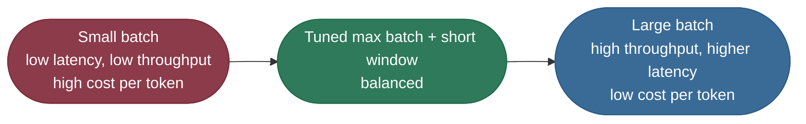
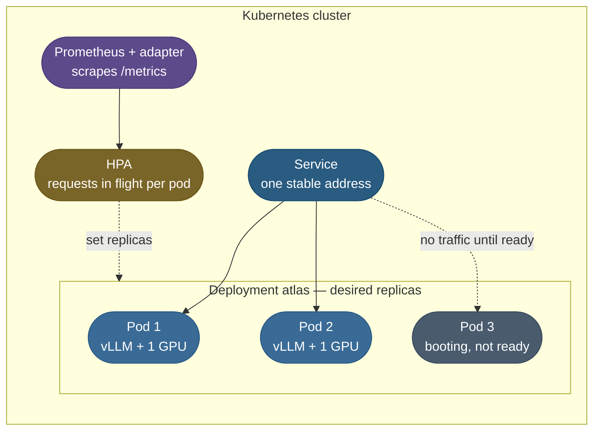
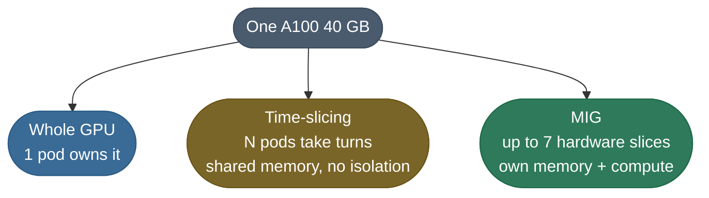
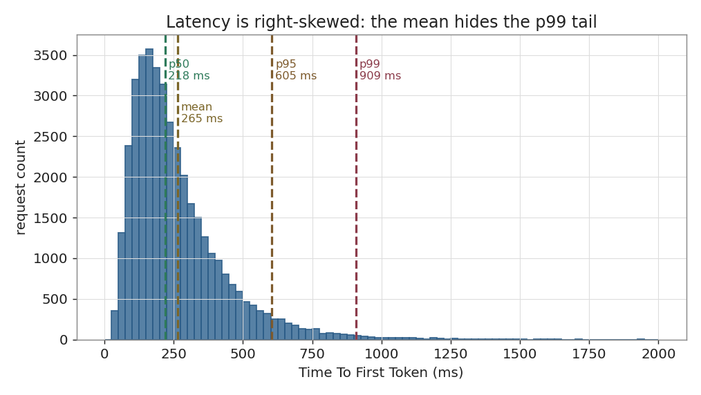

# Scaling Inference: autoscaling, GPU scheduling and the latency–cost dial

One engine replica answers a steady trickle. Launch day brings five times the traffic in a minute, and the same fleet has to survive it without paying for peak capacity all night.

This page is the systems layer around the engine:

- **The batching dial** — how one replica trades latency for throughput.
- **The scaling signal** — why CPU lies about a GPU workload and queue depth does not.
- **Three policies, simulated** — CPU-driven, queue-driven with a warm floor, and scale-to-zero, on the same traffic.
- **Kubernetes mechanics** — Deployment, Horizontal Pod Autoscaler (HPA), readiness, and GPU scheduling with Multi-Instance GPU (MIG).
- **Fleet monitoring** — the latency percentiles, throughput and cost per token that say whether scaling worked.

The running example is **Atlas**, the `Mistral-7B-Instruct` chat endpoint from [LLM Serving Engines](/ai-ml/ai-ml-learning-resources/inference-and-serving/packaging-and-serving/model-serving/model-serving): one vLLM replica per GPU, batching up to 32 sequences.

---

## The problem: GPUs are not web servers

A stateless web service scales by adding pods that are ready in seconds, triggered by CPU. An inference fleet breaks both assumptions.

- **Replicas arrive in minutes.** A new pod pulls a multi-gigabyte image, downloads or maps the weights, and warms CUDA kernels before it serves one token.
- **Traffic arrives in seconds.** A spike fills every slot long before the new replica finishes booting.
- **CPU says nothing.** The GPU does the work; the host CPU runs a scheduler loop that looks almost the same idle or saturated.

So the two decisions that matter are **what signal you scale on** and **how much capacity you keep warm** for the gap a cold start cannot close.

---

## The latency–throughput dial

Inside one replica, batch size is the dial between latency and cost. Bigger batches spread each forward pass over more requests; each request then shares compute with more peers.



You set a **policy**, not a number:

- **Classical models** (a classifier behind Triton or Ray Serve): a max batch size plus a batching window — "up to 32 requests or 10 ms, whichever comes first".
- **LLM engines** batch continuously, so arrivals join the next step instead of waiting for a window. The dial becomes `--max-num-seqs`: the most sequences one replica runs at once.
- **Past the dial's end,** a replica is full. The only way to more capacity is **another replica** — which is where autoscaling starts.

The per-step scheduler behind continuous batching is taught in [Continuous Batching and Scheduling](/ai-ml/ai-ml-learning-resources/inference-and-serving/continuous-batching-and-scheduling/continuous-batching-and-scheduling).

---

## Which signal to scale on

An autoscaler compares a metric to a target and sets a replica count. The whole design is choosing a metric that **rises before latency does**.

| Signal | What it measures | Verdict for inference |
|---|---|---|
| **Host CPU %** | the pod's CPU, not the GPU | useless: flat whether the GPU is idle or saturated |
| **GPU utilization %** | share of time any kernel ran | misleading: near 100% at modest load, since decode runs every step |
| **Requests in flight** (running + waiting) | work the replica holds right now | **the default**: rises the moment demand exceeds capacity |
| **Requests waiting** (`vllm:num_requests_waiting`) | the queue in front of the batch | good trigger, but zero until the batch is already full |
| **KV cache usage** (`vllm:kv_cache_usage_perc`) | memory pressure in the engine | good secondary signal for long-context traffic |
| **p99 TTFT** | what users feel | best alert, poor trigger: it lags, and it spikes only once users already wait |

The rule this page uses:

- **Scale on requests in flight per replica**, targeting about 75% of the slots.
- **Alert on p99 TTFT**, so a wrong target shows up as a page, not a slow bleed.

---

## Three policies on the same traffic

To see the difference, simulate it. The model, in plain assumptions:

- **A replica** batches 32 sequences; each chat request holds a slot for 6 seconds, so one replica serves about 5.3 requests per second.
- **A cold start** takes 150 seconds from decision to first served request.
- **The autoscaler** re-evaluates every 15 seconds (the HPA default) and scales down only after 300 seconds below target (the HPA default scale-down window), one replica at a time.
- **Traffic:** 5 quiet minutes, then 6 requests/s, a 10-minute spike to 30 requests/s, then 6 again.

The three policies:

- **CPU signal, floor 2** — the web-server habit: target 70% host CPU, never below 2 replicas.
- **Queue signal, floor 2** — target 24 requests in flight per replica, keep 2 warm.
- **Queue signal, floor 0** — the same target, allowed to scale to zero when idle.

The program is deterministic and dependency-free. Run it with `uv run --python 3.12 python autoscaler_sim.py`:

```python
"""Autoscaling a GPU inference fleet on CPU versus queue depth, simulated second by second.

A replica is one engine that batches up to 32 sequences; each chat request holds a
slot for 6 seconds; a new replica needs 150 seconds to boot. Traffic is quiet, then
steady, then spikes. Three policies face the same traffic: scale on CPU with a warm
floor, scale on queue depth with a warm floor, and scale on queue depth down to zero.
Deterministic and dependency-free, so the numbers on the page reproduce exactly.
"""
from __future__ import annotations

import math
from collections import deque
from dataclasses import dataclass, field

SIM_SECONDS = 2400
SLOTS_PER_REPLICA = 32
SERVICE_SECONDS = 6
COLD_START_SECONDS = 150
SYNC_PERIOD_SECONDS = 15
SCALE_DOWN_WINDOW_SECONDS = 300
MAX_REPLICAS = 12
TARGET_IN_FLIGHT_PER_REPLICA = 24   # 75 percent of the slots
TARGET_CPU_PERCENT = 70.0


@dataclass(frozen=True)
class Policy:
    name: str
    signal: str            # "cpu" or "queue"
    min_replicas: int


@dataclass
class Fleet:
    ready: int
    booting: deque = field(default_factory=deque)      # ready-at times
    running: deque = field(default_factory=deque)      # finish times, non-decreasing
    waiting: deque = field(default_factory=deque)      # arrival times
    below_target_since: int | None = None


@dataclass(frozen=True)
class RunResult:
    policy: Policy
    waits_s: list[int]
    ready_series: list[int]
    queue_series: list[int]
    replica_hours: float
    still_waiting: int


def arrivals_per_second(t: int) -> int:
    if t < 300:
        return 0            # overnight quiet
    if t < 900:
        return 6            # steady daytime load
    if t < 1500:
        return 30           # launch spike
    return 6


def host_cpu_percent(fleet: Fleet) -> float:
    """An engine pod's CPU barely moves with load: the GPU does the work."""
    if fleet.ready == 0:
        return 0.0
    busy_fraction = len(fleet.running) / (fleet.ready * SLOTS_PER_REPLICA)
    return 25.0 + 15.0 * busy_fraction


def desired_replicas(policy: Policy, fleet: Fleet) -> int:
    if policy.signal == "cpu":
        wanted = math.ceil(fleet.ready * host_cpu_percent(fleet) / TARGET_CPU_PERCENT)
    else:
        in_flight = len(fleet.running) + len(fleet.waiting)
        wanted = math.ceil(in_flight / TARGET_IN_FLIGHT_PER_REPLICA)
    return max(policy.min_replicas, min(MAX_REPLICAS, wanted))


def reconcile(policy: Policy, fleet: Fleet, t: int) -> None:
    """Scale up at once (new replicas still boot); scale down only after a quiet window."""
    desired = desired_replicas(policy, fleet)
    current = fleet.ready + len(fleet.booting)
    if desired > current:
        fleet.booting.extend([t + COLD_START_SECONDS] * (desired - current))
        fleet.below_target_since = None
        return
    if desired == current:
        fleet.below_target_since = None
        return
    if fleet.below_target_since is None:
        fleet.below_target_since = t
        return
    spare_slots = (fleet.ready - 1) * SLOTS_PER_REPLICA - len(fleet.running)
    if t - fleet.below_target_since >= SCALE_DOWN_WINDOW_SECONDS and spare_slots >= 0:
        fleet.ready -= 1
        fleet.below_target_since = t


def step(fleet: Fleet, t: int, waits_s: list[int]) -> None:
    while fleet.booting and fleet.booting[0] <= t:
        fleet.booting.popleft()
        fleet.ready += 1
    while fleet.running and fleet.running[0] <= t:
        fleet.running.popleft()
    fleet.waiting.extend([t] * arrivals_per_second(t))
    free_slots = fleet.ready * SLOTS_PER_REPLICA - len(fleet.running)
    while free_slots > 0 and fleet.waiting:
        waits_s.append(t - fleet.waiting.popleft())
        fleet.running.append(t + SERVICE_SECONDS)
        free_slots -= 1


def simulate(policy: Policy) -> RunResult:
    fleet = Fleet(ready=policy.min_replicas)
    waits_s: list[int] = []
    ready_series: list[int] = []
    queue_series: list[int] = []
    replica_seconds = 0
    for t in range(SIM_SECONDS):
        step(fleet, t, waits_s)
        if t % SYNC_PERIOD_SECONDS == 0:
            reconcile(policy, fleet, t)
        replica_seconds += fleet.ready + len(fleet.booting)    # booting GPUs bill too
        ready_series.append(fleet.ready)
        queue_series.append(len(fleet.waiting))
    return RunResult(policy, waits_s, ready_series, queue_series,
                     replica_seconds / 3600, len(fleet.waiting))


def percentile(values: list[int], pct: float) -> int:
    ordered = sorted(values)
    rank = max(0, math.ceil(pct / 100 * len(ordered)) - 1)
    return ordered[rank]


POLICIES = [
    Policy("CPU signal, floor 2", "cpu", 2),
    Policy("queue signal, floor 2", "queue", 2),
    Policy("queue signal, floor 0", "queue", 0),
]


def main() -> None:
    print(f"{'policy':<24}{'served':>8}{'p50 wait':>10}{'p99 wait':>10}"
          f"{'peak':>6}{'replica-h':>11}{'unserved':>10}")
    for policy in POLICIES:
        run = simulate(policy)
        print(f"{policy.name:<24}{len(run.waits_s):>8}"
              f"{percentile(run.waits_s, 50):>9}s{percentile(run.waits_s, 99):>9}s"
              f"{max(run.ready_series):>6}{run.replica_hours:>11.2f}{run.still_waiting:>10}")
    first_wait = simulate(POLICIES[2]).waits_s[0]
    print(f"\nfloor 0: the first request of the morning waited {first_wait}s for a cold start")


if __name__ == "__main__":
    main()
```

Its output, exactly as printed:

```text
policy                    served  p50 wait  p99 wait  peak  replica-h  unserved
CPU signal, floor 2        19600      374s      955s     2       1.33      7400
queue signal, floor 2      27000        0s       99s    12       4.91         0
queue signal, floor 0      27000        0s      126s    12       5.48         0

floor 0: the first request of the morning waited 150s for a cold start
```


*The CPU policy never notices the spike. Both queue policies catch it, but only after a cold start, and scaling to zero adds its own morning queue.*

What the run teaches:

- **CPU never scales.** Host CPU peaks near 40% against a 70% target, so the fleet sits at 2 replicas.
  - 7,400 requests are still queued at the end, and the median wait is 374 s.
  - This is the most common production mistake with GPU autoscaling, reproduced exactly.
- **The queue signal serves everyone,** but its p99 wait is still 99 s.
  - Its trigger fires within 15 s of the spike; the replicas arrive 150 s later.
  - **A better signal cannot beat a cold start.** Only warm capacity or a faster boot can.
- **Scale-to-zero cost more here, not less:** 5.48 replica-hours against 4.91.
  - The first request waited the full 150 s cold start.
  - Requests piled up during the boot, so the in-flight count jumped and the autoscaler overshot to 12 replicas for a 6 requests/s load.
  - Zero pays off only when idle periods are long compared with the cold start and the scale-down window.
- **Scale-down is slow by design.** One replica per 300 s window keeps a second spike from landing on an empty fleet, at the cost of the tail you see in the middle panel.

> **Note:** The simulation is deliberately simple — fixed service time, no preemption, one replica removed per window. The directions it shows are robust; the exact seconds are properties of these assumptions.

**Sizing the warm floor.** Work backwards from the cold start:

- Queue growth during a boot is `(spike rate − warm capacity) × cold start`.
- For this spike: `(30 − 2 × 5.3) × 150 ≈ 2,900` requests waiting before help arrives, which matches the bottom panel's peak.
- To hold the p99 wait near one service time instead, the floor must carry the spike: `⌈30 / 5.3⌉ = 6` replicas warm for a known launch.
- Hold that floor only for the event window, and schedule it rather than leaving it permanent.

---

## Kubernetes: the Deployment, the autoscaler and readiness

For most production fleets the orchestrator is **Kubernetes**. You declare the desired state — "N healthy Atlas replicas behind one address" — and controllers keep reality matching it.



The Deployment asks for a GPU per pod and gates traffic on the model being loaded. Reference configuration, not run here:

```yaml
apiVersion: apps/v1
kind: Deployment
metadata: { name: atlas }
spec:
  replicas: 2
  selector: { matchLabels: { app: atlas } }
  template:
    metadata: { labels: { app: atlas } }
    spec:
      containers:
        - name: vllm
          image: vllm/vllm-openai:v0.11.0
          args: ["--model", "mistralai/Mistral-7B-Instruct-v0.3",
                 "--max-model-len", "8192", "--gpu-memory-utilization", "0.90"]
          ports: [{ containerPort: 8000 }]
          resources:
            limits:
              nvidia.com/gpu: 1          # schedule only onto a node with a free GPU
          startupProbe:                  # allow up to 10 minutes to load weights
            httpGet: { path: /health, port: 8000 }
            periodSeconds: 10
            failureThreshold: 60
          readinessProbe:                # no traffic until the engine answers
            httpGet: { path: /health, port: 8000 }
            periodSeconds: 5
```

What each part protects:

- **`nvidia.com/gpu: 1`** is a resource the NVIDIA device plugin advertises; the scheduler will only place the pod on a node with one free.
- **`startupProbe`** stops Kubernetes from killing a pod that is still loading 15 GB of weights.
- **`readinessProbe`** keeps the Service from routing to a pod before the engine can answer.

The HPA scales on requests in flight, not CPU. Reference configuration:

```yaml
apiVersion: autoscaling/v2
kind: HorizontalPodAutoscaler
metadata: { name: atlas }
spec:
  scaleTargetRef: { apiVersion: apps/v1, kind: Deployment, name: atlas }
  minReplicas: 2                  # the warm floor
  maxReplicas: 12                 # the cost ceiling
  metrics:
    - type: Pods
      pods:
        metric: { name: vllm_requests_in_flight }
        target: { type: AverageValue, averageValue: "24" }
  behavior:
    scaleUp: { stabilizationWindowSeconds: 0 }
    scaleDown: { stabilizationWindowSeconds: 300 }
```

- **`vllm_requests_in_flight`** is not a built-in name. A Prometheus Adapter rule publishes it as `vllm:num_requests_running + vllm:num_requests_waiting` per pod.
- **`averageValue: "24"`** is the simulation's target: 75% of 32 slots.
- **The `behavior` block** makes the defaults explicit: scale up immediately, scale down only after 5 quiet minutes.

**The same policy in Ray Serve.** Ray Serve scales on ongoing requests per replica natively, with no metrics adapter. Reference configuration:

```yaml
applications:
  - name: atlas
    import_path: serve_app:app
    deployments:
      - name: Atlas
        ray_actor_options: { num_gpus: 1 }
        autoscaling_config:
          min_replicas: 2
          max_replicas: 12
          target_ongoing_requests: 24
```

---

## GPU scheduling: whole cards, time-slicing and MIG

GPUs are the scarce, expensive resource, and a whole 40 GB card is often far more than one small model needs. There are three ways to hand GPUs to pods.



| Mode | Isolation | Good for | Watch out for |
|---|---|---|---|
| **Whole GPU** | full | an LLM that needs the memory | idle capacity at low traffic |
| **Time-slicing** | none: shared memory, one crash can take all | dev, notebooks, bursty small models | one pod's memory spike kills its neighbors |
| **MIG** (Multi-Instance GPU) | hardware-level memory and fault isolation | many small production models on one card | fixed slice profiles; repartitioning drains the node |

MIG profiles on an A100 40 GB, and what they can hold:

| Profile | Max per card | Memory | Fits |
|---|---:|---:|---|
| `1g.5gb` | 7 | 5 GB | classifiers, embedding models, a 1B LLM at 4-bit |
| `2g.10gb` | 3 | 10 GB | a 7B LLM at 4-bit with a small KV cache |
| `3g.20gb` | 2 | 20 GB | a 7B LLM at FP16 with little KV room |
| `7g.40gb` | 1 | 40 GB | the whole card |

**The worked example.** Seven ranking and embedding models, each needing under 5 GB and light traffic:

- **Whole GPUs:** 7 cards, each mostly idle.
- **MIG:** one card split into seven `1g.5gb` slices, each isolated.
- The hardware bill drops by roughly 7x for the same models — until one model's traffic grows enough to need its own card.
- An FP16 7B LLM needs 14.5 GB of weights alone, so it never fits a `1g.5gb` or `2g.10gb` slice. MIG is for the small-model fleet, not for Atlas.

How GPU sharing moves the inference bill, and when a reserved or spot fleet is cheaper, is the subject of [Cost Optimization](/ai-ml/ai-ml-learning-resources/operations-and-lifecycle/governance-and-economics/cost-optimization/cost-optimization).

---

## Monitoring the fleet: latency, throughput and cost

Scaling is only working if the numbers users feel stay inside their targets. Three metric families say so.

**Latency, at the token level.** A single "request duration" hides what a streaming user feels:

- **TTFT (Time To First Token)** — queueing plus prefill; the spinner time.
- **TPOT (Time Per Output Token)** — how fast text flows after that.
- **End to end** = `TTFT + TPOT × (output tokens − 1)`.

**Watch percentiles, never the mean.** Under continuous batching, latency is right-skewed: most requests are fast, and bursts push a few into a long queue.



*Illustrative distribution (a log-normal sample, not a measured endpoint): the mean of 265 ms and median of 218 ms look healthy, while p99 is 909 ms — more than four times the median.*

- **Alert on p99 TTFT and p99 TPOT.** The tail is the experience of your unhappiest users, and it moves first when the fleet is short.
- In the simulation above, the queue policy's p50 wait was 0 s during the spike while its p99 was 99 s. A mean-based alert would have stayed green.

**Throughput and utilization, read together.**

- Measure **output tokens per second**, not requests per second — a request can be 5 or 5,000 tokens.
- **High GPU utilization, low throughput:** compute-bound; quantize or use a faster GPU.
- **Low GPU utilization, low throughput:** the GPU is starved; batch more or fix the front end.

**Cost per token, the number that ties the levers together.**

- `$ per 1M tokens = GPU $ per hour ÷ tokens per hour × 1,000,000`.
- Warm floors, scale-down windows and MIG slices all move it; so does every idle booting replica, which bills from the moment it is requested.

Model quality, drift and guardrail signals sit beside these in [Model Monitoring and Observability](/ai-ml/ai-ml-learning-resources/operations-and-lifecycle/monitoring-and-reliability/model-monitoring-and-observability/model-monitoring-and-observability).

---

## Pitfalls: when the fleet misbehaves

| Symptom | Likely cause | Fix |
|---|---|---|
| **Spike hits, replica count never moves** | HPA on CPU; engine pods never cross the target | scale on requests in flight or requests waiting |
| **Latency spikes every few minutes** | the autoscaler flaps, cold-starting replicas into live traffic | lengthen the scale-down window; raise the warm floor |
| **GPU pods stuck `Pending`** | no node has a free `nvidia.com/gpu` of the requested kind | check the node pool's autoscaler ceiling, the device plugin and MIG profile names |
| **New pods killed while loading** | liveness or readiness probe fires before weights load | add a `startupProbe` with a long failure threshold |
| **First request after deploy times out** | routed before CUDA kernels warmed | send a warm-up request before marking the pod ready |
| **Scale-to-zero endpoint costs more than expected** | short idle gaps plus overshoot from the boot-time queue | keep a floor of 1–2 on user-facing paths; zero only for batch and dev |
| **Costs high with flat traffic** | floor sized for a past launch left permanent | schedule event floors; lower the base floor where redundancy allows |
| **Time-sliced pods crash together** | one workload exhausted shared GPU memory | use MIG for isolation, or whole GPUs |

> **Tip:** When a fleet misbehaves, ask two questions first:
> - **Did the replica count move when traffic moved?** If not, the signal is wrong.
> - **Did latency recover once replicas were ready?** If not, the problem is inside the replica, not the autoscaler — see [LLM Serving Engines](/ai-ml/ai-ml-learning-resources/inference-and-serving/packaging-and-serving/model-serving/model-serving).

---

## Where this matters — and where it does not

Autoscaling earns its complexity when:

- **Traffic varies a lot within a day,** so peak capacity would sit idle for hours.
- **Replicas are expensive,** so every idle GPU-hour is real money.
- **Latency targets are explicit,** so a warm floor can be sized against them.

Keep it simple instead when:

- **Traffic is flat** — a fixed replica count with headroom is cheaper to operate.
- **The workload is batch** — a job queue that starts workers on demand is the natural model, and cold starts do not matter.
- **One model needs more than one GPU** — the scaling unit becomes a multi-GPU replica, and prefill/decode disaggregation changes the picture; see [KV Cache in production](/ai-ml/ai-ml-learning-resources/inference-and-serving/kv-cache/kv-cache-in-production).

---

## Key takeaways

- **Scale on requests in flight**, alert on p99 TTFT; host CPU never sees a GPU spike.
- **A cold start is a floor on spike latency** that no signal can beat — size a warm floor with `(spike − warm capacity) × cold start`.
- **Scale-to-zero pays only for long idle periods**, and never on a user-facing chat path.
- On Kubernetes: request `nvidia.com/gpu`, gate traffic with startup and readiness probes, and make HPA behavior explicit.
- **MIG packs small models** onto one card with hardware isolation; time-slicing shares without isolation.

---

## Production implementation

Runnable services in this estate that implement what this page teaches:

- **[inference-orchestrator](/python/python-production-examples/inference-orchestrator/readme)** — the control plane in front of an engine fleet: admission control, backpressure and streaming, the pieces that keep a queue from growing without bound.

---

## References

The curated link library for this topic — documentation, videos, articles and internal cross-links — lives in a companion file so it can be reused as a standalone reference list:

**→ [Scaling Inference — references](/ai-ml/ai-ml-learning-resources/inference-and-serving/packaging-and-serving/scaling-inference/scaling-inference#references-further-reading)**
