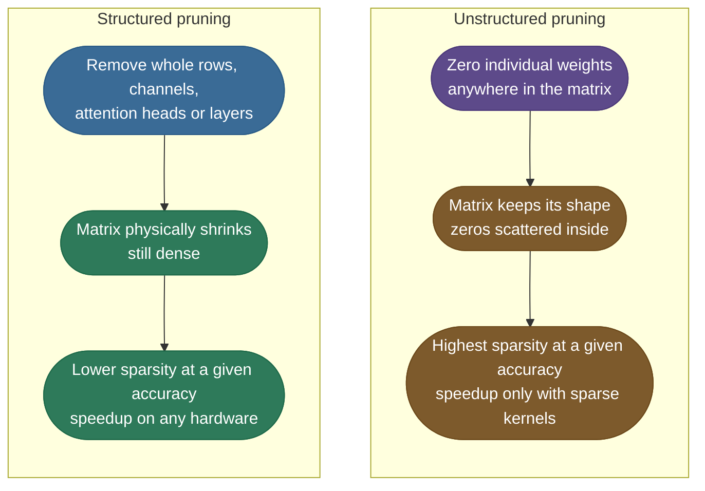
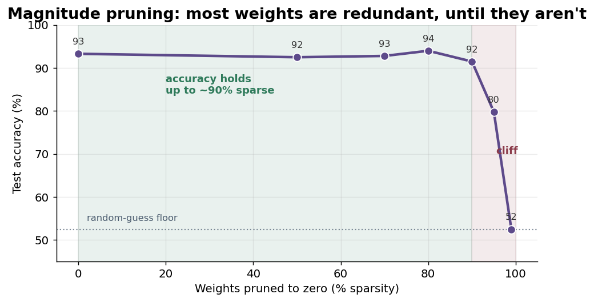
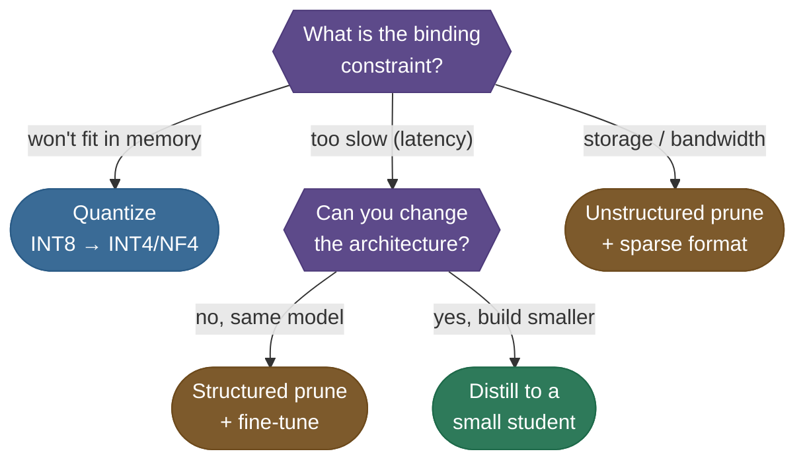
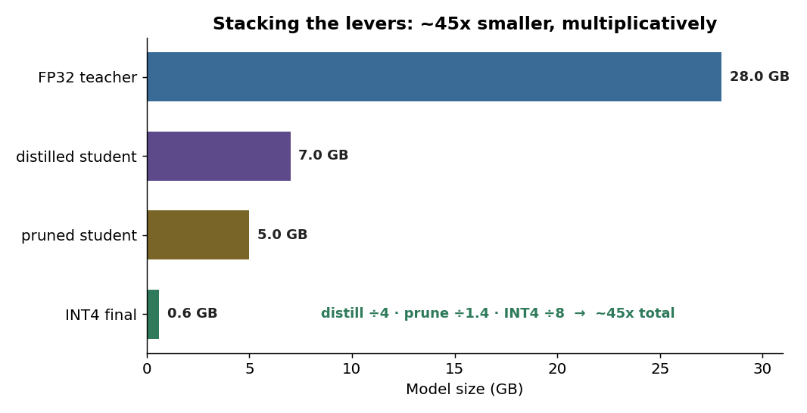

# Pruning and sparsity: delete most of the weights, keep the function

A small classifier on this page has **19,200 weights**. Zero out 80% of them — 15,360 weights set to exactly 0.0, no retraining — and its test accuracy goes from **93.3% to 94.0%**. Zero out 95% and it drops to 79.8%; at 98% it guesses.

That curve is the whole subject of pruning:

- **Why** so many weights can go: trained networks carry far more parameters than their function needs.
- **Which** ones to remove, and how to write the rule down as a mask.
- **What the zeros buy** — and why, by default, they buy neither a smaller file nor a faster model.
- **How to push the cliff back** by pruning gradually and fine-tuning in between.

> **Note:** this page is the model-layer deep dive. For the one-page mental model, see the [pruning and sparsity intuition (7.10)](/ai-ml/ai-ml-intuitions/scaling-adaptation-and-efficiency/compression/pruning-and-sparsity-intuition). The sibling levers are [quantization](/ai-ml/ai-ml-learning-resources/inference-and-serving/quantization/quantization) (fewer bits per weight) and [knowledge distillation](/ai-ml/ai-ml-learning-resources/model-adaptation/knowledge-distillation/knowledge-distillation) (a smaller model trained to imitate).

---

## The problem: a trained network is mostly dead weight

Networks are trained **over-parameterized** on purpose. Extra width makes optimization easier and generalization better, but the finished function needs only a fraction of that capacity.

- **Most weights end up near zero.** A trained layer's weights cluster tightly around 0.0, and each tiny weight adds a tiny term to its neuron's sum.
- **Many are redundant.** Two weights can carry overlapping signal, so removing one lets the other absorb its role after a little retraining.
- **The cost is paid at inference anyway.** Every one of those weights is stored, loaded and multiplied on every request.

Order-of-magnitude expectations before you start, for a 7-billion-parameter model:

| Method | Size after | Speedup | Accuracy cost | Effort |
|---|---|---|---|---|
| **Unstructured pruning, 90%** | 3–5× smaller *if* saved sparse | none without sparse kernels | small, with fine-tuning | hours (iterative) |
| **Structured pruning, 30–50%** | proportionally smaller, still dense | yes, on any hardware | moderate; recover with fine-tuning | hours to days |

*Ballparks that swing with the layer mix and the hardware — expectations to verify, not results.*

---

## Intuition: a few loud voices carry the vote

Think of one neuron as a committee vote. Each input $x_i$ is a member, each weight $w_i$ is how loudly that member speaks, and the neuron's output is the sum of $w_i x_i$.

- **Most members whisper.** With $|w_i|$ near zero, their contribution barely moves the total.
- **A few shout.** The large weights decide the outcome.
- **Silencing the whisperers** changes the result by the sum of a few tiny terms — so the vote, and the network's function, survives.

The analogy also predicts where the simple rule fails, which is worth keeping in mind:

- **A whisperer holding a megaphone.** If input $x_i$ is huge, even a small $w_i$ contributes a large $w_i x_i$.
- Scoring by $|w_i|$ alone misses that case. Scoring by $|w_i| \cdot |x_i|$ — the idea behind **Wanda** — catches it (see [References](#references-further-reading)).

---

## Unstructured vs structured: scattered zeros or smaller matrices

**Where** the zeros land decides what they buy.



*Unstructured pruning keeps every matrix shape and scatters zeros inside it; structured pruning deletes whole units, so the dense matrices that remain are smaller.*

- **Unstructured:** individual weights anywhere. It reaches 90%+ sparsity with little loss, because the pruner has the most freedom. But a 4096×4096 matrix with 90% zeros is still a 4096×4096 matrix to a dense kernel.
- **Structured:** whole rows, columns, channels, heads or layers. Less freedom, so less sparsity at the same accuracy — but no special kernel is needed to benefit.

**The dense-shrink arithmetic** for structured pruning, on a Llama-7B-shaped feed-forward block (hidden size $d = 4096$, intermediate size $d_{ff} = 11008$, three projection matrices):

- **Before:** $3 \times d \times d_{ff} = 3 \times 4096 \times 11008 = 135{,}266{,}304$ parameters per layer.
- **Remove 30% of the intermediate channels:** $d_{ff} = 7706$, so $3 \times 4096 \times 7706 = 94{,}691{,}328$.
- **Result:** 30% fewer parameters **and** 30% fewer floating-point operations (FLOPs) in that block, on any hardware — the matrices are simply smaller.

---

## Magnitude pruning, derived

The simplest criterion — remove the smallest $|w|$ — is not just a heuristic. It falls out of asking how much the loss rises when one weight is deleted.

**The saliency of a weight.** Deleting $w_i$ means changing it by $\delta w_i = -w_i$. A second-order Taylor expansion of the loss $L$ around the trained weights gives:

$$\Delta L \approx g_i \,\delta w_i + \tfrac{1}{2} H_{ii}\, \delta w_i^2 = -g_i\, w_i + \tfrac{1}{2} H_{ii}\, w_i^2$$

- **$g_i = \partial L / \partial w_i$** is the gradient. At a trained minimum it is close to zero, so the first term drops out.
- **$H_{ii} = \partial^2 L / \partial w_i^2$** is the curvature of the loss along that weight. This diagonal-only form ignores interactions between weights — the simplification behind Optimal Brain Damage.
- **What is left:** $\Delta L \approx \tfrac{1}{2} H_{ii} w_i^2$, the loss increase from deleting weight $i$.

> **Source / derivation:** [LeCun, Denker and Solla, *Optimal Brain Damage* (1989)](https://proceedings.neurips.cc/paper/1989/hash/6c9882bbac1c7093bd25041881277658-Abstract.html) — saliency as $\tfrac{1}{2} H_{ii} w_i^2$ at a minimum with a diagonal Hessian. [Hassibi and Stork (1992)](https://proceedings.neurips.cc/paper/1992/hash/303ed4c69846ab36c2904d3ba8573050-Abstract.html) keep the full inverse Hessian and also update the surviving weights.

**From saliency to magnitude.** Assume the curvature is roughly the same for every weight, $H_{ii} \approx h$. Then ranking by $\tfrac{1}{2} h\, w_i^2$ is ranking by $w_i^2$, which is ranking by $|w_i|$.

- **That assumption is the whole price of magnitude pruning.** It is cheap because it never computes curvature, and wrong exactly where curvature differs a lot between weights.

**The mask.** For $n$ weights and a target sparsity $s \in [0, 1)$:

$$\tau = \text{the } s\text{-th quantile of } \{|w_1|, \dots, |w_n|\}, \qquad m_i = \mathbb{1}\big[\,|w_i| \ge \tau\,\big], \qquad \widehat{W} = m \odot W$$

- **$\tau$** is the magnitude threshold, the value below which a fraction $s$ of the weights fall.
- **$m$** is a 0/1 mask with the same shape as $W$; $\odot$ multiplies elementwise, so masked weights become exact zeros.
- **The number of zeros** is $k = \lfloor s\, n \rfloor$.

> **Gotcha:** "the $s$-th quantile" has two common implementations, and they disagree by one weight.
> - **Interpolated quantile** (`torch.quantile`): $\tau$ lands *between* the $k$-th and $(k{+}1)$-th smallest magnitudes, and `|w| >= tau` zeros exactly $k$ weights.
> - **Order statistic** (`kthvalue(k)`): $\tau$ *is* the $k$-th smallest magnitude, so `|w| >= tau` keeps it and zeros only $k-1$. Use strict `>` with this form.

### Worked example: one row of eight weights

Take one neuron's eight incoming weights and prune them to 50% sparsity, so $k = 4$:

```text
weights : [ 0.82, -0.05,  0.41,  0.02, -0.63,  0.11, -0.09,  0.30]
|value| : [ 0.82,  0.05,  0.41,  0.02,  0.63,  0.11,  0.09,  0.30]
sorted  : 0.02  0.05  0.09  0.11 | 0.30  0.41  0.63  0.82
```

- **Threshold:** the 4th smallest magnitude is `0.11`, so zero everything at or below it (the order-statistic form with inclusive removal).
- **Removed:** `-0.05, 0.02, 0.11, -0.09`, the four smallest in absolute value.

```text
mask    : [ 1,     0,     1,     0,     1,     0,     0,     1   ]   (1 = keep)
pruned  : [ 0.82,  0.00,  0.41,  0.00, -0.63,  0.00,  0.00,  0.30]
```

*Source: Han et al., 2015 — [Learning both Weights and Connections for Efficient Neural Networks](https://arxiv.org/abs/1506.02626).*

- **What it costs:** half the multiplies are gone, and the lost terms are the ones closest to zero.

### Worked example: a 3×4 matrix, global vs per row

A single row hides the real question: **who shares a threshold?** Take this matrix and prune it to 50% (6 of 12 weights):

```text
W = [  0.60  -0.02   0.15  -0.40 ]
    [  0.05   0.90  -0.08   0.03 ]
    [ -0.25   0.10  -0.70   0.12 ]

sorted |w|: 0.02 0.03 0.05 0.08 0.10 0.12 | 0.15 0.25 0.40 0.60 0.70 0.90
```

**Global threshold** — one $\tau$ for the whole matrix:

- **Order statistic:** the 6th smallest is `0.120`. **Interpolated 50th percentile:** `0.135`, halfway to `0.15`.
- `|w| >= 0.135` keeps exactly 6. `|w| >= 0.120` would keep 7 — the off-by-one from the gotcha, measured.
- **Mask:** rows `[1,0,1,1]`, `[0,1,0,0]`, `[1,0,1,0]`. Row 1 keeps three weights; row 2 keeps only its `0.90`.

**Per-row threshold** — keep the top 2 of every row:

- **Mask:** rows `[1,0,0,1]`, `[0,1,1,0]`, `[1,0,1,0]`. Row 1 loses `0.15`; row 2 is forced to keep `-0.08`.

Compare the two on weight mass kept and on the output for the probe input $x = [1, 1, 1, 1]$ (dense output `[0.33, 0.90, -0.73]`):

| Threshold | Weights kept | Mass kept | Output | Squared error |
|---|---:|---:|---|---:|
| **Global** | 6 | $3.00 / 3.40 =$ **88.2%** | `[0.35, 0.90, -0.95]` | **0.0488** |
| **Per row** | 6 | $2.93 / 3.40 =$ **86.2%** | `[0.20, 0.82, -0.95]` | **0.0717** |

- **Global wins here** because it spends the budget where the large weights are. It let row 1 keep a third weight by taking one from row 2, which had nothing else worth keeping.
- **Per-row is a constraint**, and constraints cost accuracy at the same sparsity. With four columns and two kept per row, this mask is exactly the **2:4 pattern** that some GPUs accelerate — the section on speedups below comes back to it.

These numbers are printed by the first block of [`sparsity_accuracy_cliff.py`](code/sparsity_accuracy_cliff.py).

---

## Global ranking and the iterative loop

On a real network the same choice comes up at the layer level: one threshold for all layers, or a fixed sparsity per layer.

- **Global ranking** lets redundant layers give up more weights and sensitive ones keep theirs, without you guessing per-layer rates. It is the default in the code below.
- **The risk** is that a layer whose weights are all small in scale gets wiped out entirely, cutting the network in two. Cap the per-layer sparsity when layers differ a lot in scale.

**Pruning is done gradually**, because weights can only compensate for a small loss at a time:


*The prune → fine-tune loop. Each round removes a slice the survivors can absorb, then retrains them with the mask re-applied so pruned weights stay at zero.*

- **Why fine-tuning works:** after a small cut, the surviving weights shift to reproduce the lost terms — the redundancy from the problem section, cashed in.
- **Why the mask must be re-applied:** the optimizer updates every parameter, so without the mask, pruned weights drift away from zero again.

---

## Sparsity is not a smaller file and not a speedup

A pruned weight is still a 32-bit `0.0` in a dense tensor. **Nothing gets smaller or faster until something exploits the zeros.**

### Storage: dense zeros cost the same bytes

Measured by saving the 128×128 hidden matrix of the page's model, pruned to three sparsities:

```text
 sparsity  dense save (kB)  CSR save (kB)
       0%             67.1          330.8
      50%             67.1          156.6
      90%             67.1           23.1
```

- **The dense save never changes:** 16,384 float32 values are 65.5 kB of data at any sparsity, plus serialization overhead.
- **Compressed sparse row (CSR)** stores only the nonzeros — but each one needs its value (4 bytes) *and* its column index (8 bytes as int64), plus one row pointer per row.
  - That is at least 12 bytes per nonzero against 4 per dense entry, so even in theory CSR only pays past two-thirds sparsity.
  - Measured with `torch.save`, it was **five times bigger** at 0%, still bigger at 50%, and **three times smaller** at 90%.

### Speed: a dense kernel multiplies the zeros too

A dense matrix multiply does the same work whatever the values are. Three ways to turn zeros into time:

- **Structured removal:** the matrices shrink, as in the arithmetic above. Works everywhere.
- **Sparse kernels:** general sparse matrix multiply has index-chasing overhead, so it typically wins only at very high sparsity.
- **2:4 semi-structured sparsity:** exactly two nonzeros in every block of four, a pattern NVIDIA's Ampere-generation-and-later GPUs execute with dedicated kernels.
  - **NVIDIA** reports throughput gains approaching 20% at large batch sizes and up to 36% better performance per watt, at the dense model's accuracy.
  - **PyTorch's** `to_sparse_semi_structured` tutorial measures 1.38× on a linear layer and about 1.3× end to end on BERT, both on an A100.
  - **The pattern caps sparsity at exactly 50%**, and it is a constraint: the per-row mask above is what it forces.

---

## The code: the sparsity–accuracy cliff

The model is a multilayer perceptron (MLP) with two 128-wide hidden layers, trained on 1,600 examples of a two-class problem.

- **The labels** are the sign of a noisy sum of the first 5 of 20 input features, so the task is learnable but not trivial.
- **The experiment** loads the same trained weights at each sparsity, applies one global magnitude mask, and measures test accuracy on 400 held-out examples — no retraining.

The pruning core of [`sparsity_accuracy_cliff.py`](code/sparsity_accuracy_cliff.py):

```python
import torch
from torch import nn


def weight_parameters(model: nn.Module) -> dict[str, nn.Parameter]:
    """The weight matrices pruning acts on; biases are left dense."""
    return {name: param for name, param in model.named_parameters() if name.endswith("weight")}


@torch.no_grad()
def global_magnitude_masks(model: nn.Module, sparsity: float) -> dict[str, torch.Tensor]:
    """Rank every weight in the network together; keep those strictly above the threshold."""
    weights = weight_parameters(model)
    if sparsity == 0.0:
        return {name: torch.ones_like(param, dtype=torch.bool) for name, param in weights.items()}
    all_magnitudes = torch.cat([param.abs().flatten() for param in weights.values()])
    zeroed_count = int(sparsity * all_magnitudes.numel())          # k = floor(s * n)
    threshold = all_magnitudes.kthvalue(zeroed_count).values        # tau = k-th smallest |w|
    return {name: param.abs() > threshold for name, param in weights.items()}   # strict >


@torch.no_grad()
def apply_masks(model: nn.Module, masks: dict[str, torch.Tensor]) -> None:
    for name, param in weight_parameters(model).items():
        param.mul_(masks[name])                                     # W_hat = m ⊙ W
```

- **`kthvalue` with strict `>`** is the order-statistic form of the mask, so exactly $k$ weights are zeroed.
- **`torch.cat` over every layer** is what makes the ranking global.

Output (CPU, torch 2.13):

```text
torch 2.13.0 · 19,200 prunable weights
dense baseline accuracy: 93.3%

One-shot global magnitude pruning (no retraining)
 target sparsity  real sparsity   accuracy %
              0%           0.0%         93.3
             50%          50.0%         92.5
             70%          70.0%         92.8
             80%          80.0%         94.0
             90%          90.0%         91.5
             95%          95.0%         79.8
             98%          98.0%         52.5
             99%          99.0%         52.5
```

---

## Reading the cliff



*The one-shot sweep above, plotted at 0, 50, 70, 80, 90, 95 and 99% sparsity (values rounded). Accuracy is flat through 90%, then falls to the floor.*

- **The plateau (0–90%).** Accuracy wanders between 91.5% and 94.0% — noise on 400 test examples, not a trend. The weights being removed were the whisperers.
- **The knee (90–95%).** The threshold starts cutting weights that matter; accuracy drops 12 points in one step.
- **The floor (98–99%).** 52.5% is what the model gets by predicting one class for everything — the test set's majority share.
- **The job of pruning** is to find the knee and stop before it, or to move it right.

> **Note:** the 80% point *above* the dense baseline is not pruning improving the model. On 400 examples a 0.7-point swing is 3 predictions, well within noise.

---

## Recovering accuracy: prune gradually, fine-tune with the mask fixed

The same trained model, taken to the same final sparsities in steps. Each round prunes, measures, then fine-tunes for 100 full-batch Adam updates with the mask re-applied after every step:

```python
def train(model, data, steps, masks=None):
    optimizer = torch.optim.Adam(model.parameters(), lr=LEARNING_RATE)
    loss_function = nn.CrossEntropyLoss()
    for _ in range(steps):
        optimizer.zero_grad()
        loss_function(model(data["train_x"]), data["train_y"]).backward()
        optimizer.step()
        if masks is not None:
            apply_masks(model, masks)      # the optimizer just moved the pruned weights; zero them again
```

```text
Iterative pruning, 100 fine-tune steps per round
 round sparsity  after prune %  after fine-tune %
            50%           92.5               93.5
            70%           93.0               94.0
            80%           93.8               93.5
            90%           89.0               94.5
            95%           87.0               94.0
            98%           81.0               94.5
            99%           83.5               95.7
```

- **At 95% sparsity:** one-shot gave 79.8%; iterative gives 94.0%.
- **At 99%:** one-shot was at the floor; iterative ends at 95.7% with 192 of 19,200 weights left.
- **The "after prune" column** shows each cut still hurts. It is the fine-tune that repairs it, and each repaired model is a better starting point for the next cut.

> **Warning:** do not read 99% as a general result. This task depends on 5 input features in a near-linear way, so 192 weights are enough to express it. On real networks the knee sits much further left.
> - **Han et al. (2015)** reached about 89% sparsity on AlexNet (61M → 6.7M parameters) with retraining, at the dense model's accuracy.
> - Always rerun the sweep on your own model.

---

## Where pruning sits among the three levers

Start from the constraint that is actually breaking the deployment:



*Routing a constraint to a lever. Pruning owns two branches: storage (unstructured, saved sparse) and latency on an unchanged architecture (structured).*

- **Quantization first, almost always:** it is the cheapest lever, and it shows how much headroom is left.
- **Pruning** when you must keep the architecture but need fewer stored weights or less compute.
- **Distillation** when you can afford to train a smaller architecture outright.

---

## Stacking the levers

The levers attack different things — shape, count and bits — so their savings **multiply**.



*An illustrative stacking plan, not a measured run. Each stage shrinks what the previous one left.*

- **Distill:** a 28 GB FP32 teacher into a student about 4× smaller → **7 GB**.
- **Structured prune:** 30% of the student's channels → about **5 GB**. Structured, so the saving is real in dense storage.
- **Quantize to INT4:** 5 GB of FP32 at 8× fewer bits → about **0.6 GB**.
- **Total:** $28 / 0.6 \approx$ **45×**. A short fine-tune after the lossy steps recovers most of the accuracy.

---

## Pitfalls

- **One-shot pruning past the knee.** Accuracy craters and a single pass cannot recover it. Prune in small steps and fine-tune between rounds.
- **The file did not get smaller.** Unstructured zeros are still stored densely. Save in a sparse format (and only past high sparsity), or use structured or 2:4 pruning.
- **Structured pruning tanked accuracy fast.** Whole channels the model needed were removed. Lower the ratio, fine-tune after, and score channels by importance rather than raw weight magnitude.
- **Pruned weights came back.** The mask was applied once and the optimizer moved the zeros. Re-apply it after every step, or use `torch.nn.utils.prune`, which multiplies the mask into every forward pass.
- **A whole layer vanished under global ranking.** Its weights were all small in scale. Cap the per-layer sparsity, or rank within layers.
- **A speedup claimed from sparsity alone.** Without structured removal, a sparse kernel or supported 2:4 hardware, the pruned model runs exactly as fast as the dense one.
- **Magnitude on a large language model (LLM).** Activation outliers break the equal-scale assumption behind $|w|$. Use activation-aware scores such as Wanda, or SparseGPT.
- **Shipping on sparsity alone.** A pruned model passes two gates: it is cheaper on the real target **and** still good enough on your own evaluation set against the dense baseline.

---

## In production

- **Estate example:** [model-compression](/python/python-production-examples/model-compression/readme) runs magnitude and structured pruning next to quantization and distillation on one model, and reports measured size, latency and quality.
- **PyTorch:** `torch.nn.utils.prune` provides local, global and custom pruning as masks that can later be made permanent; `torch.sparse.to_sparse_semi_structured` converts 2:4-pruned weights for the accelerated GPU kernels.
- **Classic results:** magnitude pruning with retraining made AlexNet 9× and VGG-16 13× smaller at the same ImageNet accuracy (Han et al., 2015).
- **Large language models:** SparseGPT prunes 175-billion-parameter models to at least 50% sparsity in one shot without retraining; Wanda reaches strong one-shot results on LLaMA with only weights and input activations.
- **Hardware:** 2:4 sparsity on NVIDIA Ampere and later is the main route from unstructured-style pruning to real speed on a GPU, at the cost of the fixed 50% pattern.

---

## References

The curated link library for this topic — papers, videos, courses, documentation and in-platform links — lives in a companion file so it can be reused as a standalone reference list:

**→ [Pruning and Sparsity — references](/ai-ml/ai-ml-learning-resources/inference-and-serving/pruning-and-sparsity/pruning-and-sparsity#references-further-reading)**
