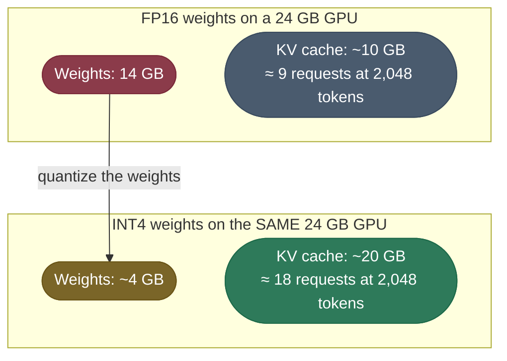
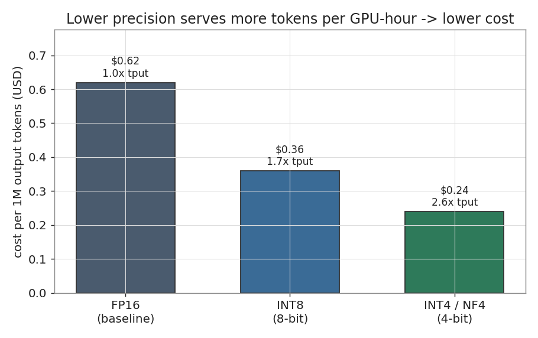

# Quantization in serving: measure it, then spend the memory

The main [Quantization](/ai-ml/ai-ml-learning-resources/inference-and-serving/quantization/quantization) page derives the ruler and the methods. This chapter asks what they buy once a model is actually served.

- **On a CPU:** quantize a real classifier, measure it, and see why a model four times smaller can run slower.
- **On a GPU:** follow the freed memory into the key–value (KV) cache, then into concurrent requests.
- **On the bill:** turn throughput into dollars per million tokens.

---

## The problem: a four-times-smaller model that got slower

The usual claim is that quantization makes a model "smaller and faster". **Only the first half is guaranteed.**

- **Size** follows from the arithmetic: an INT8 weight is one byte where FP32 is four.
- **Speed** depends on whether the hardware has integer kernels that beat the cost of converting values in and out of INT8.
- A benchmark that skips that distinction ships a regression. The run below shows one.

---

## Measuring dynamic INT8 on a CPU

The example is `ReviewSorter`, a three-layer classifier head with 256 inputs, two 512-wide hidden layers and 10 classes. It is quantized with **dynamic post-training quantization (PTQ)**.

- **Weights** are converted to INT8 once, ahead of time.
- **Activations** are quantized on the fly for each batch, so no calibration set is needed.
- **Agreement** stands in for quality: the share of 512 inputs on which the INT8 model picks the same class as the FP32 model.

The heart of [`dynamic_int8_on_cpu.py`](code/dynamic_int8_on_cpu.py):

```python
import copy
import torch
from torch import nn

torch.backends.quantized.engine = "qnnpack"      # INT8 kernels available on ARM and x86

fp32_model = ReviewSorter().eval()               # Linear(256,512) → ReLU → Linear(512,512) → ReLU → Linear(512,10)
int8_model = torch.ao.quantization.quantize_dynamic(
    copy.deepcopy(fp32_model), {nn.Linear}, dtype=torch.qint8
).eval()                                          # every nn.Linear now stores int8 weights + one scale
```

The script then measures the serialized size, the mean latency over a 64-row batch, and agreement. Output on an Apple-silicon CPU with torch 2.13:

```text
torch 2.13.0 · INT8 engine: qnnpack
model      size (MB)   latency (ms)   agreement %
fp32           1.600          0.128         100.0
int8           0.407          0.418          99.0

size reduction   : 3.93x smaller
decisions changed: 1.0% of 512 inputs
```

### Reading the three columns

- **Size — 3.93× smaller.** Close to the ideal 4×. The gap is the per-layer scales, zero-points and the bias vectors, which stay in floating point.
- **Agreement — 99.0%.** Five of 512 decisions flipped: inputs that sat close to a class boundary, where a rounding error of half a tick was enough to cross it.
- **Latency — 3.3× slower.** Each INT8 layer quantizes its input, runs the integer matrix multiply and dequantizes the result.
  - On a 512×512 matrix the multiply is so cheap that those conversions dominate.

> **Note:** your latency figures will differ from machine to machine; the pattern will not. Two things to expect when you run it:
> - **Deprecation warnings.** torch 2.13 warns that eager-mode `torch.ao.quantization` is deprecated in favour of the `torchao` quantization API. The numbers above are still what the current API produces.
> - **A missing engine.** If you see `NoQEngine`, the default x86 backend is unavailable on your CPU. Setting `qnnpack`, as the script does, fixes it.

---

## Why the memory win is certain and the speed win is not

The two effects come from different places, so they behave differently.

- **Memory** is bytes per parameter times parameters. Nothing about the kernel changes it.
- **Speed** is the time to fetch the weights plus the time to compute with them:
  - **Large model, decode step:** fetching dominates. Four times fewer bytes means roughly four times less waiting on memory, so quantization speeds it up.
  - **Tiny model or small matrices:** the compute is trivial and conversion overhead is fixed per layer, so quantization can slow it down, as measured above.
  - **Wrong kernel:** without integer kernels (server-CPU vector instructions, mobile neural processing units, GPU 4-bit kernels) the device dequantizes back to floating point and gains nothing.

> **Tip:** report a quantization speedup only from the deployment hardware, the real batch size and a model of the real size. Anything else is a size measurement.

---

## On a GPU, freed weight memory becomes KV-cache headroom

At serving time the weights and the [KV cache](/ai-ml/ai-ml-learning-resources/inference-and-serving/kv-cache/kv-cache) share one pool of GPU memory. **Every gigabyte the weights give up is a gigabyte of cache**, and cache is what holds concurrent requests.



*The same GPU, two weight precisions. Quantizing a 7-billion-parameter model's weights to INT4 roughly doubles the KV-cache budget, and so roughly doubles the number of requests the GPU can serve at once. Activation memory is ignored here for clarity.*

The request counts come from the per-token cache size of a Llama-2-7B-shaped model with an FP16 cache:

- **Shape:** 32 layers, hidden size 4,096, and one key plus one value vector per layer per token.
- **Bytes per token:** $2 \times 32 \times 4096 \times 2 = 524{,}288$ bytes, about **0.52 MB**.
- **FP16 weights:** 10 GB of cache ÷ 0.52 MB ≈ **19,000 tokens**, about **9 requests** of 2,048 tokens.
- **INT4 weights:** 20 GB ÷ 0.52 MB ≈ **38,000 tokens**, about **18 requests**.

> **Note:** the weight figures are rounded. 7 billion INT4 weights with per-group scales come to about 3.7 GB (0.53 bytes per parameter, from the main page's memory math); the diagram rounds that to 4 GB.

---

## From throughput to dollars per million tokens

More tokens from the same GPU-hour means fewer dollars per token. The conversion is one line:

$$\text{\$ per 1M tokens} = \frac{\text{GPU \$ per hour}}{\text{tokens per second} \times 3600 \times u} \times 10^6$$

- **$u$** is **effective utilization**, the fraction of the hour the GPU spends generating. Queueing, bursty traffic and reserved headroom keep it well below 1.

Worked on an A10G-class 24 GB GPU at **$1 per hour**. The throughputs are **illustrative ballparks** for a 7B model, not measurements from this page.

| Precision | Bytes/param | 7B weights | Throughput | Tokens/hour at $u = 0.28$ | $ per 1M tokens |
|---|---:|---:|---:|---:|---:|
| **FP16 / BF16** | 2 | ~14 GB | 1,600 tok/s (1.0×) | 1,612,800 | **$0.62** |
| **INT8 / FP8** | 1 | ~7 GB | 2,720 tok/s (1.7×) | 2,741,760 | **$0.36** |
| **INT4 / NF4 (GPTQ, AWQ)** | ~0.53 | ~3.7 GB | 4,160 tok/s (2.6×) | 4,193,280 | **$0.24** |

The FP16 row, step by step:

- **At full utilization:** $1{,}600 \times 3{,}600 = 5{,}760{,}000$ tokens per hour → $\$1 / 5.76 = \$0.17$ per million.
- **At 28% utilization:** $5{,}760{,}000 \times 0.28 = 1{,}612{,}800$ tokens → $\$1 / 1.6128 = \$0.62$ per million.
- **The INT4 row** divides the same cost by 2.6× the tokens: $0.62 / 2.6 = \$0.24$, which is **about 62% cheaper** per token on identical hardware.



*Cost per million tokens falls in step with throughput. The absolute cents move with GPU price, utilization and the prompt-to-output mix; **the ratio between precisions is what carries over** to your own deployment.*

---

## Pitfalls

- **Benchmarking on a toy.** A small model on the wrong kernel makes INT8 look slow, as the demo shows, and a big model on a tuned kernel makes it look fast. Measure the shipping configuration.
- **Counting only the weights.** INT4 weights shrink about 3.8× against FP16, but the KV cache and activations stay in their own precision. Plan capacity from the total: weights + cache + activations.
- **Assuming the quality cost is uniform.** Quantization error is uneven across tasks. It tends to bite hardest on long-context reasoning and rare tokens, so evaluate on your own task set rather than one benchmark.
- **Trusting utilization-free cost numbers.** A dollars-per-token figure at 100% utilization understates a real endpoint's cost several times over. State $u$ whenever you quote one.

---

## Recap

- **Memory:** a quantized model is smaller on every device, no exceptions.
- **Speed:** it is faster only when fetching weights dominates and integer kernels exist. Measured on a small CPU model, INT8 was 3.93× smaller and 3.3× slower.
- **Concurrency:** on a GPU, freed weight memory becomes KV cache. Going from FP16 to INT4 roughly doubles the requests a 24 GB card holds for a 7B model.
- **Cost:** tokens per hour × utilization sets dollars per token; at 2.6× the throughput, INT4 serves the same model about 62% cheaper.

---

## References

The sources for this chapter live in the main page's companion link library:

**→ [Quantization — references](/ai-ml/ai-ml-learning-resources/inference-and-serving/quantization/quantization#references-further-reading)**
