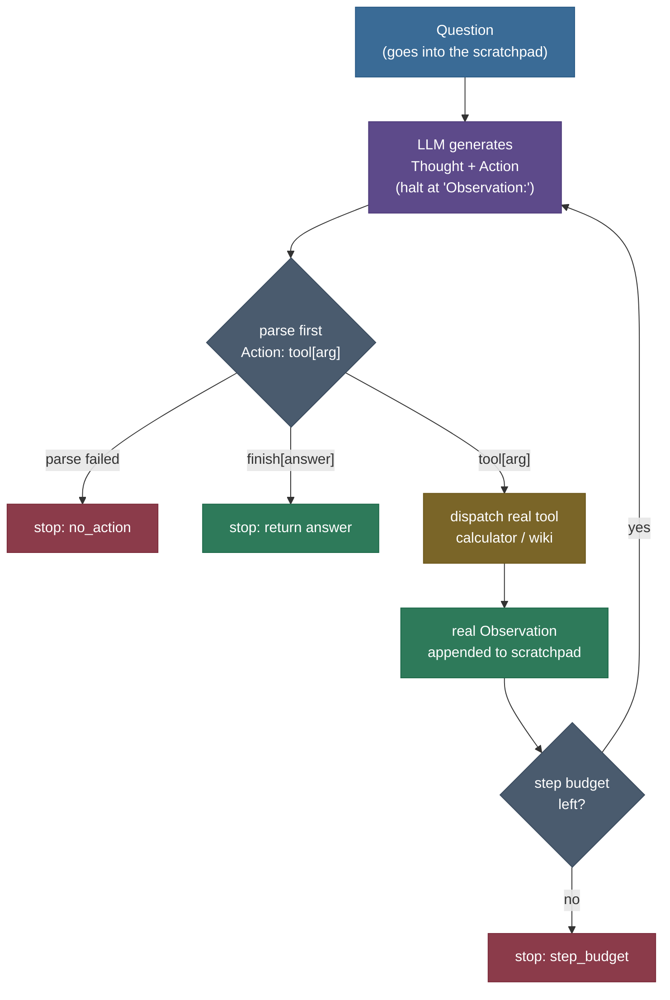

# ReAct: teaching a language model to think *and* act

Ask a small language model a question it cannot do in its head — *"What is 481 multiplied by 32, then plus 19?"* — and it will answer instantly, fluently, and **wrong**. Here is a real 1.5-billion-parameter instruction model, given exactly that question with no tools:

```
question : What is 481 multiplied by 32, then plus 19?
LLM alone: 15605       (the correct answer is 15411)
```

It is off by 194 and has no idea. It did multi-digit multiplication one token at a time and there was nothing to catch the slip. Now give that *same model* a calculator and let it **act** — call the tool, read the real result, then finish:

```
Question: What is 481 multiplied by 32, then plus 19?
Thought: I need to multiply 481 by 32 and add 19. I'll use the calculator.
Action: calculator[481 * 32 + 19]
Observation: 15411
Thought: The calculator returned 15411, which is the final answer.
Action: finish[15411]
Answer: 15411
```

Same weights, same decoding, right answer. The only thing that changed is that the model was allowed to **do something and look at what happened**. That is ReAct — *Reason + Act* — and it is the single most important pattern in agentic AI. By the end of this page you'll have built the real agent that produced both traces above, understand every line of its loop, and know exactly why the second trace beats the first.

> **For a fast, buzzword-level overview** of agents and agentic workflows, skim the recall cards [AI Buzzword Knowledge — Agents](../../../../AI-Buzzword-Knowledge/05-Agents.md) and [AI Buzzword Knowledge — Agentic Workflows](../../../../AI-Buzzword-Knowledge/06-Agentic-Workflows.md). *This* page is the in-depth, build-it-yourself treatment.

Everything here is real and runnable. There is a genuine model, two genuine tools, a genuine loop, and a companion notebook that re-executes the whole thing headless with zero errors. No trace on this page was written by hand — they are what the model actually generated (greedy decoding, so they reproduce exactly).

You'll be able to:

- **state the core insight** of ReAct and contrast it with plain chain-of-thought and with plan-then-execute;
- **write the Thought/Action/Observation prompt grammar** on a whiteboard and explain the one-shot exemplar;
- **derive the loop** — generation, the stop condition, parsing, tool dispatch, observation splicing, termination;
- **name the real failure modes** (hallucinated observations, runaway loops, format drift, ignored observations) and the code that defends against each;
- and **measure** that acting on real observations beats reasoning alone — 100% vs 50% on real multi-step questions, from the real run below.

> **The one-sentence core.** *An LLM that can only think must trust its own memory and mental arithmetic; ReAct lets it think a little, then act, then read what actually happened — grounding each reasoning step in a real observation instead of a guess.*

---

## The problem: reasoning without acting is reasoning in the dark

Chain-of-thought prompting taught us that letting a model "think step by step" before answering dramatically improves multi-step reasoning. But chain-of-thought has a hard ceiling: **every step is generated from the model's own weights, with no contact with the world.** If a fact isn't in the weights, or the arithmetic is beyond what the model can do token-by-token, the reasoning chain confabulates — smoothly, confidently, and unrecoverably. There is no point in the chain where the model can *check*.

We just saw it: the reason-only model said 481 × 32 + 19 = 15605. It didn't flag uncertainty. It couldn't, because it had no calculator and no way to know it was wrong. And this isn't a one-off. Run six real multi-step questions through the same reason-only model and it gets **half of them wrong** — always the ones needing exact computation or a looked-up fact:

| question | reason-only answer | correct? |
|---|---|:---:|
| 481 × 32 + 19 | 15605 | ✗ (should be 15411) |
| (1287 − 998) × 6 | 30 | ✗ (should be 1734) |
| 17³ − 200 | 491 | ✗ (should be 4713) |
| Eiffel Tower year + 100 | 1989 | ✓ |
| 146 × 3 | 438 | ✓ |
| 8849 − 849 | 8000 | ✓ |

*(Real outputs from `run_direct` in the companion module — reproduced exactly by greedy decoding.)*

The failures share a shape: they need an **exact external operation** the model cannot perform reliably in its head. What the model *can* do well is decide *what operation to perform*. So the fix isn't a bigger model — it's giving this model a way to **offload the exact part to a tool and read the answer back.**

Two prior ideas each solve half of this and point at the synthesis:

- **Chain-of-Thought** (Wei et al., 2022) gives the model a *reasoning* channel — but no *acting* channel. It can plan the multiplication but not perform it reliably.
- **Tool use / function calling** gives the model an *acting* channel — but a single tool call with no reasoning can't handle problems that need *several* tools chosen adaptively based on intermediate results.

ReAct is the interleaving of the two: reason a little to decide the next action, act, observe the real result, and repeat. Reasoning decides *what to do*; acting-and-observing establishes *what is true*.

> **Source / derivation:** [Yao et al., *ReAct: Synergizing Reasoning and Acting in Language Models* (2022), arXiv:2210.03629](https://arxiv.org/abs/2210.03629) — introduces the interleaved reason+act paradigm and shows, with ablations, that it beats reason-only (chain-of-thought) and act-only baselines on multi-hop QA (HotpotQA) and interactive tasks (ALFWorld, WebShop), largely by reducing hallucinated facts through grounding in tool observations.

---

## Intuition first: a detective who checks the evidence

Picture two detectives given the same case.

The **first** sits in an armchair and reasons the whole thing out end to end — motive, opportunity, culprit — never leaving the room. Brilliant chains of deduction, but every link rests on what they *remember* or *assume*. One wrong assumption early and the entire conclusion is confidently wrong. This is chain-of-thought: pure reasoning, no contact with evidence.

The **second** detective reasons *one step*, then **acts on it** — "I think the window was forced; let me go *look* at the window" — observes what's actually there, and lets that real observation shape the next thought. "The window is intact, so my forced-entry theory is dead; the culprit had a key — who has a key?" Each deduction is immediately grounded against reality before the next one is built on it. This is ReAct.

The second detective isn't smarter. They just refuse to build a tower of reasoning on unchecked assumptions. Every `Thought` proposes what to investigate; every `Action` investigates it; every `Observation` is a fact from the world, not from the detective's imagination — and the next `Thought` has to account for it.

That is the whole mental model, and it holds up under pressure. **Why does interleaving specifically help, versus doing all the thinking first then all the acting?** Because in a real multi-step problem you *don't know the second action until you've seen the result of the first*. You can't decide "what to compute" until the lookup tells you the number to compute with. Plan-then-execute (reason fully, then act on the fixed plan) breaks exactly here: a plan made before any observation is a plan made blind. ReAct's power is that the action *is chosen in light of the latest real observation* — the loop adapts.

**Where the analogy would break:** a detective has judgment about *which* evidence to trust; a ReAct agent trusts whatever the tool returns. If the tool lies (a buggy calculator, a stale search index), the agent grounds itself in a falsehood just as confidently as a truth. Grounding fixes *hallucinated* facts; it does not fix *wrong tools*. Keep that boundary — it's the source of half the failure modes later.

---

## The mechanism: the ReAct loop

Concretely, ReAct is a loop around a single language model. Each turn the model reads the growing transcript (the **scratchpad**), emits one `Thought` and one `Action`, the system runs the real tool and appends the real `Observation`, and the loop repeats until the model emits a special `finish` action (or a step budget is hit).



Four things in this diagram are doing the real work, and each is a design decision you must get right:

1. **Generate, then *halt at `Observation:`*.** The model proposes a Thought and an Action, and generation is *stopped* the instant it would start writing an observation. This is non-negotiable: if you let the model keep generating, it will happily hallucinate `Observation: 15411` (or `Observation: 15605`) itself, and you're back to reason-only with extra steps. The stop condition is what forces the model to *actually use the tool*.
2. **Parse the first well-formed action.** Real model output is messy; we take the first `Action: tool[arg]` and discard the rest, so a chatty model can advance the loop by at most one real step.
3. **Dispatch the real tool** and splice its **real** return value back in as the observation. This is the "acting" — and the observation is a fact, not a guess.
4. **Terminate** on `finish`, an unparseable step, or an exhausted budget — three real stop conditions, the last being the guard against infinite loops.

Here is that loop executing for real on a **multi-hop** question that needs two different tools in sequence — the case where interleaving truly earns its keep:

![A real ReAct trace on a multi-hop question, rendered as stacked colour-coded cards: Question -> Thought -> Action wiki[Eiffel Tower completion date] -> Observation (the real 1889 fact) -> Thought -> Action calculator[1889 + 100] -> Observation 1989 -> Thought -> Action finish[1989] -> Answer 1989. Every card is real output from Qwen2.5-1.5B-Instruct, greedy-decoded.](../images/agentic02_react_trace.png)

Read it top to bottom. The agent doesn't know it will need the calculator until *after* `wiki` tells it the year is 1889 — the second action is chosen in light of the first observation. That adaptivity is the mechanism. A plan-then-execute agent, committing to a fixed plan before seeing any observation, cannot express "look up the year, *then* add 100 to whatever that turns out to be" as cleanly, because the second step depends on the first step's *result*, not just its *existence*.

---

## The method, specified in full

Now the details, derived rather than dropped — because the difference between a ReAct demo and a ReAct *agent* is entirely in getting these right.

### The prompt grammar

ReAct is, mechanically, **a prompt format plus a loop.** The prompt does three jobs: declare the grammar, declare the tools, and show one worked example so a small model reliably copies the shape. The real system prompt from the module:

```
You solve questions by reasoning and using tools, one step at a time.

At each step output EXACTLY one Thought line then one Action line, then STOP and wait:
Thought: <your reasoning about what to do next>
Action: <tool>[<input>]

Available tools:
- calculator[expression]   evaluates arithmetic, e.g. Action: calculator[481 * 32 + 19]
- wiki[query]              looks up a fact, e.g. Action: wiki[Eiffel Tower]
- finish[answer]           gives the FINAL answer, e.g. Action: finish[15411]

Rules:
- Never write an "Observation:" line yourself — the system supplies real observations.
- Put the fully computed final value inside finish[...], not an expression.

Example:
Question: What is 6 times 7, plus 3?
Thought: I should compute 6 * 7 + 3 with the calculator.
Action: calculator[6 * 7 + 3]
Observation: 45
Thought: The calculator returned 45, which is the final answer.
Action: finish[45]

Now solve the new question.
```

Every clause here is load-bearing:

- **"EXACTLY one Thought then one Action, then STOP"** — pairs with the generation stop string. The prompt *asks* for one step; the decoder *enforces* it. Belt and braces, because small models drift.
- **The one-shot example** — a 1.5B model given only an abstract format description will produce `calculator[expr]` (literally the word "expr"). Show it *one* concrete Thought/Action/Observation/finish cycle and it locks onto the pattern. One-shot exemplars are how you make small models format-reliable.
- **"Never write an Observation: line yourself"** — states the contract the stop string enforces. The model must *wait* for a real observation.
- **"Put the fully computed value in finish[...]"** — a hint against the common `finish[1889 + 100]` slip (which we also handle in code — see robustness).

### The grammar as a mini-language

Formally the model emits a tiny two-production grammar per step:

```
step   := THOUGHT "\n" ACTION
THOUGHT := "Thought:" text
ACTION  := "Action:" tool "[" arg "]"
tool    := "calculator" | "wiki" | "finish"
```

and the *system* — never the model — emits `OBSERVATION := "Observation:" text` after every non-`finish` action. The transcript the model conditions on at step $t$ is the concatenation:

$$\text{scratchpad}_t = Q \;\Vert\; (T_1 \, A_1 \, O_1) \;\Vert\; (T_2 \, A_2 \, O_2) \;\Vert\; \dots \;\Vert\; (T_{t-1} \, A_{t-1} \, O_{t-1})$$

where $Q$ is the question, $T_i/A_i$ are the model's thought/action at step $i$, and $O_i$ is the **real** observation from dispatching $A_i$. The model generates $T_t A_t$ conditioned on $\text{scratchpad}_t$; the system computes $O_t = \text{dispatch}(A_t)$ and forms $\text{scratchpad}_{t+1}$. The loop is a fold over this sequence, and the key invariant is that **every $O_i$ comes from a tool, never from the model** — that is what "grounded" means, precisely.

### ReAct vs its ablations

The paper's central empirical claim is best understood as a 2×2: reasoning on/off, acting on/off.

| | **no acting** | **acting** |
|---|---|---|
| **no reasoning** | plain prompting (answer directly) | act-only (call a tool, no thinking between) |
| **reasoning** | Chain-of-Thought (think, never act) | **ReAct** (think ↔ act ↔ observe) |

- **Reason-only (CoT)** hallucinates facts and mis-computes, with no way to check — our 50% baseline.
- **Act-only** can call tools but, without a reasoning channel, can't *decide* which tool to call next when the choice depends on an intermediate result — it fumbles multi-hop problems.
- **ReAct** gets the reasoning to *steer* the acting and the acting to *ground* the reasoning. Yao et al. show this combination beats both ablations on HotpotQA, ALFWorld, and WebShop.

> **Source / derivation:** [Yao et al., arXiv:2210.03629, §3.3 "Results and Observations"](https://arxiv.org/abs/2210.03629) — the ablation on the knowledge-intensive tasks (HotpotQA, Fever) isolating reasoning-only (CoT), acting-only (Act), and combined ReAct, establishing that the *interleaving* (not either half alone) is what drives the gains ("ReAct outperforms Act consistently"; "ReAct vs. CoT"; "ReAct + CoT-SC perform best"), with the analysis attributing much of the improvement to reduced fact hallucination via observation grounding. (The interactive decision-making results on ALFWorld and WebShop are in §4.)

> **Related — the reasoning half.** [Wei et al., *Chain-of-Thought Prompting Elicits Reasoning in Large Language Models* (2022), arXiv:2201.11903](https://arxiv.org/abs/2201.11903) — the reasoning channel ReAct builds on; read it to see exactly what ReAct *adds* (an acting channel and real observations) on top of pure step-by-step reasoning.

---

## The worked code, explained

The whole agent lives in one real module, [`react_agent.py`](code/react_agent.py). Let's walk the pieces in the order the loop uses them; each is a real function you can run.

### The tools are real (and the calculator is *safe*)

The calculator does not `eval` — that would let a model, or an injected observation, run arbitrary Python. Instead it parses the expression to an AST and walks it, allowing only numbers and a whitelist of operators:

```python
_SAFE_BINOPS = {ast.Add: operator.add, ast.Sub: operator.sub, ast.Mult: operator.mul,
                ast.Div: operator.truediv, ast.Pow: operator.pow, ast.Mod: operator.mod}

def _eval_ast(node):
    if isinstance(node, ast.Constant):            # a number — the only leaf allowed
        return float(node.value)
    if isinstance(node, ast.BinOp) and type(node.op) in _SAFE_BINOPS:
        return _SAFE_BINOPS[type(node.op)](_eval_ast(node.left), _eval_ast(node.right))
    if isinstance(node, ast.UnaryOp) and type(node.op) in _SAFE_UNARYOPS:
        return _SAFE_UNARYOPS[type(node.op)](_eval_ast(node.operand))
    raise ToolError("expression contains a disallowed operation")   # names, calls, imports -> reject
```

A `calculator[__import__("os").system(...)]` isn't *discouraged* — it's structurally impossible, because `ast.Call` and `ast.Name` nodes hit the final `raise`. **Safe tool design is not optional in an agent**: the model's action string is untrusted input, exactly like user input. (This is why the sibling chapter on [Tool Use & Function Calling](/ai-ml/ai-ml-learning-resources/llms-applications-and-agents/agentic-ai/tool-use/tool-use) matters, and why [Safety, Guardrails & Human-in-the-Loop](/ai-ml/ai-ml-learning-resources/llms-applications-and-agents/agentic-ai/agent-safety/agent-safety) is a whole chapter.)

The `wiki` tool is a real lookup against a small local knowledge base — offline and deterministic so the notebook reproduces exactly, but genuinely returning text the model must *read* to answer. It even has a real **miss** path (`"No knowledge-base entry found for ..."`), because in the wild tools sometimes return nothing useful and the agent has to cope.

### Generation halts before the model can cheat

The model wrapper generates greedily (deterministic) and — critically — stops at the first `Observation:`:

```python
out = self.model.generate(**enc, max_new_tokens=MAX_NEW_TOKENS,
                          do_sample=False,                    # greedy => reproducible
                          stop_strings=["Observation:", "\nQuestion:"],
                          tokenizer=self.tokenizer)
```

Greedy decoding (`do_sample=False`) is why every trace on this page reproduces exactly. The `stop_strings` is the enforcement half of the "wait for a real observation" contract: the decoder refuses to let the model write past the point where an observation would go.

### Parsing is defensive, because real output is messy

```python
ACTION_RE = re.compile(r"Action:\s*([A-Za-z_]\w*)\s*\[(.*?)\]", re.DOTALL)

def parse_action(generated):
    match = ACTION_RE.search(generated)
    if match is None:
        return generated, None                    # a real failure the loop must survive
    return generated[: match.end()], Action(match.group(1), match.group(2).strip())
```

We take the **first** well-formed action and drop everything after it. A model that emits three actions, or dumps a fake observation, can therefore advance the loop by at most one real step. `None` (no parseable action) is returned rather than raising — the loop treats it as a clean `no_action` stop, not a crash.

### The loop itself

```python
def run_react(llm, question, *, max_steps=MAX_STEPS):
    scratchpad = f"Question: {question}\n"
    for i in range(max_steps):
        generated = llm.generate(SYSTEM_PROMPT, scratchpad)
        text, action = parse_action(generated)
        if action is None:
            return ReActResult(..., stop_reason="no_action")
        if action.tool == "finish":
            return ReActResult(..., answer=_normalise_finish(action.arg), stop_reason="finish")
        observation = dispatch(action)                       # the REAL tool result
        scratchpad += f"{text}\nObservation: {observation}\n" # splice the real fact back in
    return ReActResult(..., stop_reason="step_budget")       # the anti-infinite-loop guard
```

Read the three exits: `finish` (success), `no_action` (the model gave up / drifted), `step_budget` (ran out of turns). A production agent needs all three — especially the last, which is the difference between "I couldn't solve it in N steps" and an agent that loops forever burning tokens.

One more real-world detail: `_normalise_finish`. Small models frequently emit `finish[1889 + 100]` — the *expression* instead of the *value*. Rather than mark the model wrong, we evaluate a purely-numeric finish argument through the same safe calculator:

```python
def _normalise_finish(arg):
    if _NUMERIC_EXPR_RE.match(arg):     # "1889 + 100" -> evaluate to "1989"
        try:    return calculator(arg)
        except ToolError:  return arg
    return arg                          # "Ada Lovelace" -> pass through unchanged
```

This is not cheating — it's honouring the model's obvious intent. And it is representative: **making a real agent work is 20% prompt and 80% parsing, normalisation, and control flow.**

---

## The result: acting beats thinking-alone, measured

Here is the honest test. The same six real multi-step questions, run two ways — the full ReAct loop (with tools) and the reason-only baseline (no tools) — scored on exact match. Every generation is greedy, so this reproduces exactly.


*Scope: 6 questions and one small (1.5B) model — this illustrates the mechanism, it is not a benchmark. The peer-reviewed, large-scale version of exactly this result is Yao et al.'s §3.3 ablation.*

**ReAct 100% (6/6) versus reason-only 50% (3/6).** And the *pattern* of the wins is the whole story — reason-only succeeds precisely on the easy arithmetic and fails on everything needing exact computation or a looked-up fact, while ReAct recovers every one of those by acting:


The three reason-only failures (15605 not 15411; 30 not 1734; 491 not 4713) are all cases where the model tried to compute in its head and slipped. ReAct fixes each by handing the exact part to the calculator — grounding the reasoning in a real observation. That green-vs-red gap *is* the value of acting, made visible on real data. (This mirrors, at small scale, exactly what Yao et al. report on HotpotQA and ALFWorld — grounding in tool observations reduces the confident-but-wrong outputs of reason-only prompting.)

---

## Pitfalls and failure modes

The things that actually bite when you build a ReAct agent, named specifically with the fix.

**1. The model hallucinates its own observations.** The single most common bug: you forget the stop string, the model generates `Action: calculator[...]` *and then* helpfully writes `Observation: 15605`, and you're back to reason-only with theatre. *Fix:* halt generation at `Observation:` (the `stop_strings` above). The system, not the model, writes every observation. This is the defining discipline of ReAct.

**2. Runaway loops — the model never calls `finish`.** A model can thought-and-act forever, especially if a tool keeps returning unhelpful results. *Fix:* a hard `max_steps` budget with a `step_budget` stop reason. The notebook demonstrates this by forcing `max_steps=1` and watching the loop terminate cleanly instead of hanging. In production, surface it as a graceful "couldn't solve in N steps."

**3. Prompt-format drift.** Small models wander off the grammar: `calculator[expr]` (the literal word), missing brackets, multiple actions in one turn, prose instead of an action. *Fix:* (a) a one-shot exemplar in the system prompt to lock the shape; (b) defensive parsing that takes the *first* well-formed action and tolerates the rest; (c) treat an unparseable step as a clean `no_action` stop, never a crash.

**4. `finish` returns an expression, not a value.** `finish[1889 + 100]` instead of `finish[1989]`. *Fix:* `_normalise_finish` evaluates a numeric finish argument through the safe calculator — honouring intent without marking the model wrong.

**5. Ignored observations.** The model calls a tool, gets a real result, and then *ignores it* in the next thought — reasoning from its prior belief instead of the new fact. This is subtle and model-dependent. *Fix:* keep observations short and unambiguous, put them immediately before the next generation, and (for larger systems) prompt the model to explicitly restate the observation it's using. It's also a reason to prefer capable instruct models — weaker models ignore observations more.

**6. Unsafe tools = grounding in a hole.** If your "calculator" is `eval`, the model's action string is an arbitrary-code-execution vector; if your search returns attacker-controlled text, that text enters the model's context as a trusted observation (an indirect prompt-injection surface). *Fix:* treat every tool input as untrusted (AST-walk, don't `eval`; parameterise, don't concatenate) and every tool *output* as potentially adversarial. Grounding only helps if the ground is solid. See [Safety, Guardrails & Human-in-the-Loop](/ai-ml/ai-ml-learning-resources/llms-applications-and-agents/agentic-ai/agent-safety/agent-safety).

**7. Cost blows up with the scratchpad.** Every step re-sends the entire growing transcript, so an $n$-step trace costs roughly $O(n^2)$ tokens. *Fix:* cap steps, keep observations terse, summarise or truncate old steps for long tasks, and reach for [Memory for Agents](/ai-ml/ai-ml-learning-resources/llms-applications-and-agents/agentic-ai/memory/memory) when the scratchpad outgrows the context window.

---

## Where it matters, and where it's used

**The crux — when to reach for ReAct.** Use it when a task needs (a) *several* steps, (b) chosen *adaptively* based on intermediate results, and (c) grounded in *external* facts or computation the model can't do reliably in its head. Multi-hop question answering, tool-augmented math, web navigation, database querying, any "look something up, then act on it, then maybe look up more" task. If a task is a single tool call, plain function-calling is simpler; if the full plan is knowable up front and doesn't depend on observations, plan-then-execute is cheaper. ReAct's sweet spot is precisely where *the next action depends on the last observation*.

ReAct is the backbone of essentially every production agent framework:

- **LangChain / LangGraph** — the classic "ReAct agent" is a first-class construct; LangGraph models the exact reason→act→observe loop as a graph with tool nodes and a termination condition.
- **LlamaIndex** — its `ReActAgent` is a direct implementation of this grammar and loop over tools.
- **Hugging Face `smolagents` / Transformers Agents** — ReAct-style tool loops as the default agent.
- **The wider agent stack** — [Model Context Protocol (MCP)](/ai-ml/ai-ml-learning-resources/llms-applications-and-agents/agentic-ai/model-context-protocol/model-context-protocol) standardises the *tools* a ReAct loop calls; [Reflection & Self-Critique](/ai-ml/ai-ml-learning-resources/llms-applications-and-agents/agentic-ai/reflection/reflection) and [Planning & Task Decomposition](/ai-ml/ai-ml-learning-resources/llms-applications-and-agents/agentic-ai/planning/planning) extend the bare loop with self-correction and up-front planning; [Multi-Agent Systems](/ai-ml/ai-ml-learning-resources/llms-applications-and-agents/agentic-ai/multi-agent-systems/multi-agent-systems) wire several ReAct agents together.

Two important **forward-links** — how the field extends ReAct:

> **Forward-link — tools the model *learns* to call.** [Schick et al., *Toolformer: Language Models Can Teach Themselves to Use Tools* (2023), arXiv:2302.04761](https://arxiv.org/abs/2302.04761) — instead of ReAct's *prompted* tool use at inference time, Toolformer *fine-tunes* the model to decide when and how to call APIs, self-supervising from whether a tool call reduced its loss. Complementary to ReAct: same "act on real results" idea, moved from prompt into weights.

> **Forward-link — reflecting between attempts.** [Shinn et al., *Reflexion: Language Agents with Verbal Reinforcement Learning* (2023), arXiv:2303.11366](https://arxiv.org/abs/2303.11366) — wraps ReAct with a *self-reflection* step: on failure, the agent writes a natural-language critique of what went wrong and prepends it to the next attempt, improving over trials without any weight updates. ReAct is the inner loop; Reflexion is the outer, learning loop.

---

## Recap and rapid-fire

**If you remember nothing else:** ReAct interleaves **Thought → Action → Observation** so the model reasons a little, acts, and reads the *real* result before reasoning again — grounding each step in a fact instead of a guess. The stop-at-observation discipline (the model never writes its own observations) is what makes it real, and on real multi-step questions it turned a 50% reason-only model into a 100% agent, unchanged weights.

**Quick-fire — say these out loud:**

- *What is ReAct?* Interleaved reasoning and acting: `Thought` (reason) → `Action` (tool call) → `Observation` (real result) → repeat, until `finish`.
- *Why does it beat chain-of-thought?* CoT reasons but never acts, so it can't check itself; ReAct grounds each step in a real observation, cutting hallucinated facts and mis-computation.
- *Why interleave instead of plan-then-act?* Because the next action often depends on the last observation — you can't plan blind. ReAct chooses each action in light of the latest real result.
- *What's the single most important implementation detail?* Halt generation at `Observation:` so the model can't hallucinate the tool's result — the system supplies every observation.
- *Name three stop conditions.* `finish[...]` (success), unparseable output (`no_action`), and the step budget (`step_budget`, the anti-infinite-loop guard).
- *Why not `eval` for the calculator tool?* The action string is untrusted; `eval` is arbitrary code execution. Parse to an AST and whitelist operators instead.
- *How do you make a small model follow the format?* A one-shot exemplar in the system prompt + defensive parsing (take the first well-formed action) + `finish` normalisation.
- *What does ReAct *not* fix?* Wrong tools. Grounding in a buggy tool or attacker-controlled search result grounds you in a falsehood — tool safety and output-trust are separate problems.
- *How does cost scale?* ~$O(n^2)$ tokens over $n$ steps (the whole scratchpad is re-sent each turn) — cap steps and keep observations terse.

---

## Code and the runnable notebook

Everything on this page is produced by real code you can run and teach from — a real agent module and a step-by-step executed notebook that mirrors it one operation at a time:

- **[Step-by-step teaching notebook](code/02-ReAct-Reason-and-Act.ipynb)** — 14 numbered steps, each an intuition lead-in plus one focused cell with real output: the LLM-alone failure, the two safe tools, the prompt grammar, one raw generation, parsing, dispatch, the full numeric and multi-hop loops, `finish` normalisation, the ReAct-vs-baseline comparison (100% vs 50%), and the step-budget failure mode. Executes headless with zero errors on a real model.
- **[The load-bearing agent module](code/react_agent.py)** — the real tools, prompt, model wrapper, parser, dispatch, loop, and evaluation, all typed and documented; run it with `python react_agent.py` to reproduce every trace and number on this page.
- **[The figure generator](../tools/make_figures_02.py)** — regenerates the three figures from the same real run (`python make_figures_02.py`); no number is hand-typed.

---

## References and further reading

The curated link library for this topic — the ReAct paper and its ablations, the reasoning and tool-use lineage, videos, courses, and the framework implementations — lives in a companion file so it can be reused as a standalone reference list, and every "Source / derivation" citation above appears in it:

**→ [ReAct — references and further reading](/ai-ml/ai-ml-learning-resources/llms-applications-and-agents/agentic-ai/reason-and-act/reason-and-act#references-further-reading)**
