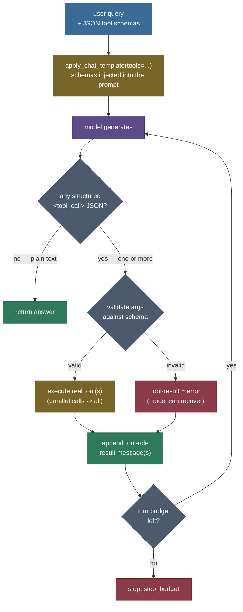

# Tool Use & Function Calling: give the model a typed API, not a text box

In the [ReAct chapter](/ai-ml/ai-ml-learning-resources/llms-applications-and-agents/agentic-ai/reason-and-act/reason-and-act) we taught a model to call a tool by writing free text — `Action: calculator[481 * 32 + 19]` — and we parsed that text with a regex. It worked. But watch what a real 1.5-billion-parameter model does when you ask it, ReAct-style, to emit a `TOOL: name(args)` line and nothing else:

```
question    : What is 481 multiplied by 32, then plus 19?
model prose : calculator(481 * 32 + 19)
regex parse : None            (it dropped the "TOOL:" prefix the parser needs)
```

The model *understood the task perfectly* — it named the right tool and the right arguments. It just didn't format the prose the exact way the parser demanded, so the parse failed. Now declare that same tool with a **JSON schema** and ask the model natively, and here is what it emits instead:

```
<tool_call>
{"name": "calculator", "arguments": {"expression": "481 * 32 + 19"}}
</tool_call>
```

Same model, same task — but this is **structured JSON**, a data format with an unambiguous grammar. `json.loads` never has to guess. Across eight real single-tool queries the difference is stark: the structured path yields a usable, dispatchable call **8 out of 8** times; the text-parsing path, **1 out of 8**. That gap is what this chapter is about.

> **For a fast, buzzword-level overview** of tool use, function calling, and MCP, skim the recall cards [AI Buzzword Knowledge — Tool Use & MCP](../../../../AI-Buzzword-Knowledge/08-Tool-Use-and-MCP.md) and [AI Buzzword Knowledge — Agents](../../../../AI-Buzzword-Knowledge/05-Agents.md). *This* page is the in-depth, build-it-yourself treatment.

Everything here is real and runnable. There is a genuine model with **native** tool-calling, three genuine JSON-schema tools, a genuine structured-call parser and validator, a genuine message loop with tool-role results, and a companion notebook that re-executes the whole thing headless with zero errors. No trace on this page was written by hand — every `<tool_call>` is what the model actually emitted (greedy decoding, so they reproduce exactly).

You'll be able to:

- **state the core insight** of function calling and explain precisely how it differs from ReAct's text-parsed actions;
- **write a JSON tool schema** on a whiteboard (name, description, typed `parameters`, `required`) and explain what each field does for the model;
- **derive the protocol loop** — schema into the prompt, structured `tool_call` out, parse, *validate against the schema*, execute, tool-role result message, answer;
- **explain parallel vs sequential** multi-tool calls and why the API models tool calls as a *list*;
- **name the real failure modes** (valid JSON with wrong arguments, missing required fields, hallucinated tool results, injection through tool outputs) and the code that defends against each;
- and **measure** that structured calling parses far more reliably than text-parsing — 8/8 vs 1/8 on real output.

> **The one-sentence core.** *ReAct proved a model can decide to act; function calling makes that act reliable by giving the model a **typed schema to fill in** and emitting a **structured call** the runtime parses as data — trading "hope the prose is formatted right" for "validate JSON against a contract."*

---

## The problem: parsing prose is a losing game

To feel why structured calling exists, you have to feel the brittleness it removes — and the cleanest way to feel it is to look honestly at what the ReAct approach costs.

ReAct's action channel is **free text**. The model writes `Action: calculator[481 * 32 + 19]`, and *your code* has to recover the tool name and argument from that string with a regex. When the model is cooperative, this works. But a language model is a probability distribution over text, not a compiler — and it drifts. It writes `calculator(481*32+19)` with the wrong brackets. It writes `I'll use the calculator to compute 481 * 32 + 19` in prose. It emits the literal word `calculator[expr]`. It stacks two actions in one turn. Every one of those is a **parse failure**, and every parse failure is code you have to write, test, and still occasionally lose to.

We just saw it happen. Given a ReAct-style instruction, the model produced `calculator(481 * 32 + 19)` — the *right tool, the right argument* — and the regex still returned `None`, because it wanted `TOOL: calculator(...)` and the model dropped the prefix. The model wasn't wrong about the task. The **text protocol was the wrong contract**.

And this isn't a one-off. Run eight real single-tool queries through the same model, once via a text protocol and once via native structured calling, and score only one thing — *did we get a call we can actually dispatch?*

| query | structured (JSON) | text (prose) |
|---|:---:|:---:|
| 481 × 32 + 19 | OK | FAIL |
| 17³ − 200 | OK | FAIL |
| convert 42 km to miles | OK | FAIL |
| 5 kg in pounds | OK | FAIL |
| 100 °C to °F | OK | FAIL |
| USD → EUR rate | OK | FAIL |
| 1000 g in pounds | OK | OK |
| 250 × 4 ÷ 5 | OK | FAIL |

*(Real outputs from `compare_structured_vs_text` in the companion module — reproduced exactly by greedy decoding.)*

**Structured 8/8, text 1/8.** The failures aren't the model failing to understand — they're the model failing to *format prose* into a rigid grammar. The fix isn't a bigger model or a cleverer regex. The fix is to stop parsing prose: declare each tool with a **schema**, and rely on the model having been *trained and templated* to emit a **structured** call that is JSON by construction.

Two ideas set this up, and each contributes a piece:

- **ReAct** (Yao et al., 2022) gave the model an *acting* channel and the reason→act→observe loop. But its action is free text, and text is brittle to parse.
- **Learned tool use** (Toolformer, Schick et al., 2023) showed a model can be *trained* to decide when and how to call an API — moving tool use from a prompted afterthought into the model's own competence.

Function calling is the productised synthesis: a **standard schema format** the model was trained to read, a **structured call format** it was trained to emit, and a runtime contract — parse, validate, execute, return a result message — that treats the tool call as *data*, not prose.

> **Source / derivation:** [Schick et al., *Toolformer: Language Models Can Teach Themselves to Use Tools* (2023), arXiv:2302.04761](https://arxiv.org/abs/2302.04761) — shows a model can be fine-tuned to insert API calls into its own generations, self-supervised by whether a call reduced its next-token loss. This is the lineage of "the model natively knows how to call tools": the ability to emit a well-formed call becomes a learned competence, not a prompt trick. Modern instruct models fold a tool-calling format directly into their chat template and post-training, which is exactly what makes the structured `<tool_call>` output on this page reliable.

---

## Intuition first: a form to fill in, not an essay to write

Here is the mental model, and it holds up under pressure.

**ReAct hands the model a blank sheet of paper** and says: *"write down which tool to use and its input, in this exact sentence format."* The model writes a sentence. You then read the sentence and try to figure out what it meant. Most of the time you can. Sometimes the handwriting is off, the format wandered, and you're stuck squinting at prose trying to recover structured intent from unstructured text.

**Function calling hands the model a form** — a typed form with labelled fields:

```
Tool:      [ calculator ▾ ]     (pick from: calculator, convert_units, get_exchange_rate)
expression: [ __________ ]      (a string, required)
```

The model doesn't write an essay; it **fills in the boxes**. And crucially, the *shape* of what comes back is guaranteed by the form, not by the model's prose discipline: you get back `{"name": "calculator", "arguments": {"expression": "481 * 32 + 19"}}` — a filled-in form, as JSON. Your job flips from *"parse fuzzy text and hope"* to *"read a completed form and check the boxes are filled correctly."*

The database-lookup analogy that people reach for is worth making precise, because the imprecise version misleads. People say "function calling is like the model making an API call." Closer: **the schema is the API's function signature; the model is a caller that has been trained to produce a well-formed invocation of that signature; your runtime is the function body.** The model never *runs* anything — it emits an *invocation*, and your code decides whether to honour it. That separation is the whole safety story later: the model proposes, the runtime disposes.

**Why does the form help specifically, versus a well-worded text instruction?** Because a form has an unambiguous grammar and a text sentence does not. JSON has exactly one way to be parsed; prose has as many interpretations as the model has ways to phrase it. The model was *post-trained* to emit the form correctly — the format is baked into its weights and its chat template — so producing valid JSON is a high-probability behaviour, whereas producing a *specific* prose grammar is a coin flip. You're not asking the model to be more careful; you're asking it for output in a format it was trained to produce and that your parser can't misread.

**Where the analogy breaks — and this is the load-bearing caveat for the whole chapter.** A form guarantees the *fields are filled with the right type* — it does **not** guarantee the values are *correct*. A user can type a valid-but-wrong date into a date field. The model can emit `{"expression": "1287 - 998 * 6"}` — perfect JSON, wrong maths, because it dropped the parentheses the user meant. Structured calling makes the *shape* reliable; it does nothing for the *semantics*. That's why validation and the tool's own error handling matter, and it's the source of half the failure modes at the end. Keep it in mind: **valid JSON ≠ valid arguments.**

---

## The mechanism: the function-calling loop

Concretely, function calling is a loop around a chat model whose template has a `tools=` slot. Each turn we render the conversation *plus the JSON tool schemas* into the prompt; the model either emits one or more **structured tool calls** or a plain-text answer. On a tool call we parse the JSON, validate the arguments against the schema, run the real tool, append a **tool-role result message**, and ask the model again. It ends when the model answers with no tool call (or a turn budget is hit).



Five things in this diagram do the real work, and each is a design decision you must get right:

1. **Schemas go into the prompt via the chat template.** `apply_chat_template(messages, tools=schemas)` injects the JSON tool declarations into the exact system section the model was trained to read. This is *how the model knows the tools exist* — no bespoke prompt engineering, the format is standardised in the model's template.
2. **The model emits structured JSON, not prose.** Because it was post-trained on this format, the tool call comes back as `<tool_call>{...}</tool_call>` — parseable as data.
3. **Validate before you execute.** The single most under-appreciated step: valid JSON is not valid arguments. Check required fields and types against the schema *before* running anything, and turn a violation into a result the model can read.
4. **Tool calls are a *list* — parallel is first-class.** The model can emit two independent calls in one turn; the loop dispatches both and returns a result for each. This is not an edge case, it's a core capability.
5. **The result goes back as a tool-role message**, and the loop repeats. The distinct `tool` role (vs stuffing the result into user text) is what lets the model attribute the observation to the call it made — the protocol's version of ReAct's "the system supplies the observation."

First, the simplest complete round-trip: one query, one structured call, one tool result, one grounded answer — the whole protocol in four cards, with the **actual JSON the model emitted** shown verbatim:


That middle card — `{"name": "calculator", "arguments": {"expression": "481 * 32 + 19"}}` — is the entire difference from ReAct in one line: structured JSON your runtime parses as data, not prose it has to interpret.

Now the same loop on a **parallel** task — two independent unit conversions the model recognises can be done at once, the case that shows off structured calling's list-of-calls design:


Read it top to bottom. The model saw two *independent* sub-tasks and emitted **both** `convert_units` calls in a single turn — as two separate JSON objects. Our runtime dispatched both, returned a `tool` result for each, and the model composed the final answer from the two real results. A text protocol would have had to serialise this into two round-trips (or invent a prose convention for "two calls at once" that you'd then have to parse); the structured format expresses it natively because a turn's tool calls are *a list*.

---

## The method, specified in full

Now the details, derived rather than dropped — because the difference between a function-calling demo and a function-calling *agent* is entirely in getting these right.

### The tool schema

A tool is declared as a JSON object in the OpenAI/JSON-schema-style function format. This is the contract the model reads. The real schema for the calculator, from the module:

```json
{
  "type": "function",
  "function": {
    "name": "calculator",
    "description": "Evaluate an arithmetic expression and return the numeric result. Use for any exact calculation (multiplication, powers, parenthesised expressions).",
    "parameters": {
      "type": "object",
      "properties": {
        "expression": {
          "type": "string",
          "description": "An arithmetic expression, e.g. '481 * 32 + 19'."
        }
      },
      "required": ["expression"]
    }
  }
}
```

Every field is load-bearing, and each one is *for the model*, not for your code:

- **`name`** — the identifier the model emits and your dispatcher keys on. Keep it short and verb-like.
- **`description`** — the single most important field for *tool selection*. The model reads this to decide *whether and when* to use the tool. A vague description ("does math") gets the tool called at the wrong times; a precise one ("use for any exact calculation") steers selection. This is prompt engineering, concentrated into one string.
- **`parameters`** — a JSON Schema `object` with typed `properties`. Each property's `type` (`string`, `number`, …) and `description` tell the model what to put in each field. This is the "form" the model fills in.
- **`required`** — which fields must be present. The model reads this; your validator *enforces* it. Belt and braces, because the model can still omit a required field.

The schema is the **single source of truth**: the same object is handed to the model (via the template) *and* validated against at dispatch time, so the declaration the model sees and the contract your code enforces can never drift.

> **Try it yourself.** In the companion notebook, edit the calculator's `description` in `TOOL_REGISTRY` down to just `"does math"` and re-run the schema-and-call steps on a mixed batch (a calculation, a unit conversion, an FX query). Watch tool *selection* get muddier — the model calls the calculator on things it shouldn't, or hesitates on things it should. Then restore the precise description and watch selection sharpen. **The `description` is the highest-leverage string in the entire schema** — it is your prompt for *when to use the tool*, and it's the cheapest thing to get wrong.

### How the schema enters the prompt

The mechanism is not magic — you can print it. `apply_chat_template(messages, tools=schemas, add_generation_prompt=True)` renders the schemas into the system section. For Qwen (and the Hermes-style templates it follows), that section reads:

```
# Tools
You may call one or more functions to assist with the user query.
You are provided with function signatures within <tools></tools> XML tags:
<tools>
{"type": "function", "function": {"name": "calculator", ...}}
{"type": "function", "function": {"name": "convert_units", ...}}
{"type": "function", "function": {"name": "get_exchange_rate", ...}}
</tools>
For each function call, return a json object with function name and arguments
within <tool_call></tool_call> XML tags:
<tool_call>
{"name": <function-name>, "arguments": <args-json-object>}
</tool_call>
```

Two things to notice. First, the model is *told the output format explicitly* by its own template — the `<tool_call>{...}</tool_call>` convention isn't something you prompt for, it's baked into how the model was trained and templated. Second, "**You may call one or more functions**" — the template itself invites *parallel* calls. This is why structured calling handles two-calls-in-a-turn natively.

### The structured call, and why it parses cleanly

The model's response is JSON wrapped in a sentinel tag. Parsing is `findall` the tags, then `json.loads` each payload — parsing a *data format*, not prose:

```python
TOOL_CALL_RE = re.compile(r"<tool_call>\s*(\{.*?\})\s*</tool_call>", re.DOTALL)

def parse_tool_calls(generated):
    calls = []
    for payload in TOOL_CALL_RE.findall(generated):
        try:
            obj = json.loads(payload)              # a DATA format, unambiguous grammar
        except json.JSONDecodeError:
            continue                                # malformed JSON is rare and handled, not fatal
        if isinstance(obj.get("name"), str) and isinstance(obj.get("arguments"), dict):
            calls.append(ToolCall(obj["name"], obj["arguments"]))
    return calls
```

Contrast this with ReAct's `Action:\s*([A-Za-z_]\w*)\s*\[(.*?)\]` regex over free text. Both use a regex — but ReAct's regex is trying to impose structure *onto prose the model chose the shape of*, while here the regex only extracts a delimited JSON payload whose *internal* structure is guaranteed by `json.loads`. The failure surface shrinks from "any way the model can phrase an action" to "the rare case the model emits malformed JSON." Returning a **list** is what makes parallel calls first-class.

### Validation: the second line of defence

Structured calling guarantees the arguments are *JSON* — it does not guarantee they're *right*. So we validate every call against its schema before executing:

```python
def validate_arguments(call, spec):
    props    = spec.parameters["properties"]
    required = spec.parameters["required"]
    missing  = [k for k in required if k not in call.arguments]
    if missing:
        raise ToolError(f"missing required argument(s) {missing} for {spec.name}")
    coerced = {}
    for key, raw in call.arguments.items():
        if key not in props:            # ignore stray keys rather than fail
            continue
        want = props[key].get("type", "string")
        ok_types = _JSON_TYPE_OK.get(want, (str,))
        if want in ("number", "integer") and isinstance(raw, str):    # "42" -> 42.0 (coerce)
            coerced[key] = float(raw) if want == "number" else int(raw)   # (raises on "abc")
            continue
        # accept a right-typed value, but reject a bool where a number is wanted (bool IS an int!)
        if isinstance(raw, ok_types) and not (want != "boolean" and isinstance(raw, bool)):
            coerced[key] = raw
        else:
            raise ToolError(f"argument {key!r} must be a {want}, got {type(raw).__name__} {raw!r}")
    return coerced
```

The `not (want != "boolean" and isinstance(raw, bool))` guard is the subtle detail worth pausing on: in Python `bool` is a subclass of `int`, so `isinstance(True, (int, float))` is `True` — without the guard, a `True` would silently pass as a `number`. We reject it, because a boolean is almost never a valid numeric argument. *(This is the exact logic in `validate_arguments`; the string-coercion `try/except` is elided here for flow — see [`function_calling_agent.py`](code/function_calling_agent.py).)*

This is the function-calling analogue of ReAct's defensive parsing and `_normalise_finish` — but operating on *typed JSON* instead of fuzzy prose, which makes it far more precise. A missing `to_unit`, a `value` sent as the string `"42"` (coerce it), a boolean where a number belongs (reject it) — each is caught here, *before* a tool runs, and turned into an error the model can read and correct on its next turn. **Validation is where "valid JSON ≠ valid arguments" gets handled in code.**

### The message loop and the tool role

The protocol grows the message list with three roles. After the user query, each turn appends an **assistant** message recording the `tool_calls`, then one **tool**-role result message per call:

```python
messages.append({"role": "assistant", "content": "",
                 "tool_calls": [{"type": "function",
                                 "function": {"name": c.name, "arguments": c.arguments}}
                                for c in calls]})
for call, result in zip(calls, results):
    messages.append({"role": "tool", "name": call.name, "content": result})
```

The distinct `tool` role is doing real work. It tells the model *this text is a tool's output, attributed to the call you made* — not a user turn, not your own words. That attribution is the structured-protocol version of ReAct's stop-at-`Observation:` discipline: the observation is supplied by the system, in its own labelled channel, so the model can't confuse its request with the result. Represent the loop as a fold over messages and the invariant is: **every `tool` message's content came from executing a real tool, never from the model.**

### Sequential vs parallel — the two multi-tool shapes

The list-of-calls design gives you two composition patterns for free:

- **Parallel** — independent sub-tasks in *one* turn (the km→mi and kg→lb figure above). The model emits several calls at once; you run them and return several results. Fewer round-trips, lower latency.
- **Sequential** — the *next* call depends on the *previous* result. The model calls `get_exchange_rate`, reads the real rate, *then* uses it. This needs multiple turns because the second argument isn't known until the first result comes back — exactly the adaptivity ReAct is built around.

Here is a real sequential trace: the model looks up the USD→JPY rate, reads the real **157.0**, and grounds its final answer on it.

```
User: First look up the USD to JPY exchange rate with the get_exchange_rate tool, then multiply 40 dollars by that rate to get the yen amount.
Assistant -> tool_call: get_exchange_rate({"from_currency": "USD", "to_currency": "JPY"})
Tool [get_exchange_rate] -> 157.0
Assistant: Now, let's use the calculated exchange rate of 157.0 to multiply it by 40 dollars to find out how many Japanese Yen you would have:

40 * 157 = 6,280 Yen

Therefore, 40 US Dollars is approximately equal to 6,280 Japanese Yen.
```

The rate **157.0** came from the tool, not the model's memory — the same grounding ReAct gives you, now over the structured protocol. (Note the model does the final multiply in prose here rather than issuing a second `calculator` call — a realistic behaviour worth seeing honestly; the *fact* is still grounded in a real tool result.)

---

## The worked code, explained

The whole agent lives in one real module, [`function_calling_agent.py`](code/function_calling_agent.py). Let's walk the pieces in the order the loop uses them; each is real code you can run.

### The tools are real (and the calculator is *safe*)

The model's `arguments` are untrusted input, exactly like user input — so the calculator does not `eval`. It parses to an AST and walks it, allowing only numbers and a whitelist of operators, and it *normalises* the model's most common slip (`^` → `**`):

```python
def calculator(*, expression: str) -> str:
    normalised = expression.strip().replace("^", "**")   # real cleanup: 17^3 -> 17**3
    tree = ast.parse(normalised, mode="eval")
    return _stringify(_eval_ast(tree.body))              # AST walk; names/calls/imports -> raise
```

The keyword-only `expression` mirrors the schema's named parameter, so the dispatcher unpacks the model's `arguments` dict straight into the signature with `fn(**kwargs)`. A `calculator[__import__("os")...]` argument is *structurally impossible*, not merely discouraged — `ast.Call`/`ast.Name` nodes hit a `raise`. The other two tools are equally real: `convert_units` over a genuine factor table (with alias normalisation `"Celsius" → "C"` and a real error path for incompatible dimensions), and `get_exchange_rate` over a real offline rate table with a real miss path.

### The registry pairs schema with callable

```python
TOOL_REGISTRY = {
    "calculator": ToolSpec(schema=<the JSON above>, fn=calculator),
    "convert_units": ToolSpec(schema=..., fn=convert_units),
    "get_exchange_rate": ToolSpec(schema=..., fn=get_exchange_rate),
}
```

One structure holds *what the model sees* (the schema) and *what the runtime runs* (the callable), side by side. `tool_schemas()` returns just the schemas for the template; `dispatch` looks up the callable by the name the model emitted. Declaration and enforcement are the same object — they can't drift.

### Generation, then structured parse

The model wrapper renders the messages *with the tool schemas* and generates greedily (deterministic, so every trace reproduces):

```python
text = self.tokenizer.apply_chat_template(messages, tools=tools, add_generation_prompt=True, tokenize=False)
out  = self.model.generate(**enc, max_new_tokens=MAX_NEW_TOKENS, do_sample=False, ...)
```

Then `parse_tool_calls` (above) turns the output into a `list[ToolCall]`. No tool calls means the model is answering in plain text — which is how the loop knows it's done.

### Dispatch = validate, then execute

```python
def dispatch(call):
    spec = TOOL_REGISTRY.get(call.name)
    if spec is None:
        return f"Error: no tool named {call.name!r}. Available: {', '.join(TOOL_REGISTRY)}."
    try:
        kwargs = validate_arguments(call, spec)   # schema check BEFORE running anything
        return spec.fn(**kwargs)                   # the real tool
    except ToolError as exc:
        return f"Error: {exc}"                      # a result the model can read and recover from
```

Unknown tools, schema violations, and tool errors all become *result strings*, never crashes — so the model can read the problem on its next turn and try again. This is the robustness that turns a demo into an agent.

### The loop itself

```python
def run_agent(model, query, *, max_turns=MAX_TOOL_TURNS):
    messages = [{"role": "user", "content": query}]
    for i in range(max_turns):
        raw   = model.generate(messages, tools=tool_schemas())
        calls = parse_tool_calls(raw)
        if not calls:                                   # plain text -> that's the answer
            return AgentResult(..., answer=raw, stop_reason="answered")
        results = [dispatch(c) for c in calls]          # validate + execute (parallel -> all)
        messages.append(<assistant message with tool_calls>)
        for call, result in zip(calls, results):
            messages.append({"role": "tool", "name": call.name, "content": result})
    return AgentResult(..., stop_reason="step_budget")  # the anti-infinite-loop guard
```

Two exits: `answered` (the model replied without a tool call — success) and `step_budget` (ran out of turns — the guard every production agent needs). The parallel case is handled with no special code: `calls` is just a list, so `[dispatch(c) for c in calls]` runs them all and each gets its own `tool` message. **Making a real function-calling agent work is 20% schema design and 80% validation, dispatch, and the message loop** — the same lesson ReAct teaches, one layer up.

---

## The result: structured calling parses reliably; text-parsing does not

Here is the honest test, and it is the empirical core of this chapter. The same eight real single-tool queries, asked two ways — native structured function-calling (JSON, schema-validated) and a ReAct-style text protocol (`TOOL: name(args)`, regex-parsed) — scored on one axis: *did we get a parseable, dispatchable call?* Every generation is greedy, so this reproduces exactly.


*Scope: 8 queries and one small (1.5B) model — this isolates the *parsing reliability* axis, not answer quality, and it is not a benchmark. The large-scale, leaderboard version of "which models emit valid, correct calls" is the Berkeley Function-Calling Leaderboard (below).*

**Structured 100% (8/8) versus text 1/8.** And the *shape* of the failures is the whole point: the model understood every task — it just couldn't reliably render its intent into the rigid `TOOL:` prose grammar. On the one query text got right (`1000 g in pounds`), the model happened to format the prose exactly as the parser wanted. On the other seven it produced the right idea in the wrong shape. Structured calling removes that failure mode by construction: the model emits a format it was trained to produce and the runtime parses it as data.

This is the ReAct chapter's brittleness, quantified. ReAct's text-parsed action *works* — but every drift off its grammar is a parse failure you fight with defensive code. Function calling doesn't fight the drift; it changes the contract so the drift mostly can't happen.

> **Source / derivation:** [Patil et al., *Gorilla: Large Language Model Connected with Massive APIs* (2023), arXiv:2305.15334](https://arxiv.org/abs/2305.15334) — trains and evaluates LLMs on producing *correct, executable* API calls across a large tool space, and introduces the evaluation methodology (AST-matching of the generated call against the reference) that became the [Berkeley Function-Calling Leaderboard](https://gorilla.cs.berkeley.edu/leaderboard.html). It formalises the axis measured informally above: not "did the model say something sensible" but "did it emit a *valid, dispatchable* call with the right function and arguments" — the exact reliability property structured calling buys you.

---

## Pitfalls and failure modes

The things that actually bite when you build a function-calling agent, named specifically with the fix.

**1. Valid JSON, wrong arguments.** The defining trap. The model emits perfect JSON — `{"expression": "1287 - 998 * 6"}` — but dropped the parentheses the user meant (`(1287 - 998) * 6`). The *shape* is valid; the *semantics* are wrong, and no schema can catch it. *Fix:* there is no parser fix — this is a reasoning error, not a format error. Mitigate with clear tool descriptions, examples in the schema, and (for critical tools) a confirmation step or a sanity check inside the tool. **The schema guarantees the form is filled; it never guarantees the answer is right.**

**2. Missing required fields / wrong types.** Structured output does not enforce your `required` list or your types — the model can omit `to_unit` or send `value` as a string. *Fix:* `validate_arguments` against the schema *before* dispatch; coerce what's safely coercible (a numeric string to a number), reject what isn't, and return the violation as a tool-result the model can read and correct. Never call the tool on unvalidated arguments.

**3. Hallucinated tool results — the model answers without calling.** Ask a currency question and a model may just *make up* a rate and answer, never emitting a tool call. (We saw a version of this: on one phrasing the model computed with an invented rate instead of looking it up.) *Fix:* make the tool the obvious path in the description ("use this to get the current rate"), and for high-stakes facts, detect "answered without the expected tool call" and re-prompt. This is the function-calling cousin of ReAct's hallucinated-observation problem.

**4. The model can't reference a prior result inside a new call's arguments.** In a sequential task, the model sometimes emits `calculator({"expression": "80 * [result of previous request]"})` — a literal placeholder, because it can't splice the earlier tool's numeric result into the next call's JSON. *Fix:* it's fine (and common) for the model to do the final combining step in prose once it has read the result; if you *need* the second call, prompt it to "use the numeric value from the previous result," and treat the un-substituted placeholder as a validation error (the calculator will reject it — which it does).

**5. Malformed JSON.** Rare with a well-trained model, but a long or truncated generation can cut off mid-JSON. *Fix:* `json.loads` in a `try` and skip un-parseable blocks (as `parse_tool_calls` does); a turn with zero *parseable* calls is handled, not a crash. Give the generation enough `max_new_tokens` that a normal call isn't truncated.

**6. Runaway loops — the model never stops calling tools.** A model can keep emitting tool calls turn after turn, especially if a tool keeps erroring. *Fix:* a hard `max_turns` budget with a `step_budget` stop reason — the same anti-infinite-loop guard ReAct needs. Surface it as "couldn't complete in N turns," not a hang.

**7. Unsafe tools and injection through tool *outputs*.** Two distinct holes. (a) The `arguments` are untrusted — if your calculator is `eval`, it's an arbitrary-code-execution vector (AST-walk instead, as here). (b) A tool's *output* enters the model's context as a trusted `tool` message — a search tool returning attacker-controlled text is an **indirect prompt-injection** surface. *Fix:* validate and sanitise every argument (untrusted input), and treat every tool *output* as potentially adversarial before it re-enters the context. Structured calling makes the *call* reliable; it does nothing to make the *tool* or its *output* trustworthy. See [Safety, Guardrails & Human-in-the-Loop](/ai-ml/ai-ml-learning-resources/llms-applications-and-agents/agentic-ai/agent-safety/agent-safety).

**8. Over-stuffed tool lists.** Hand the model 40 tools and selection accuracy drops — it picks the wrong one or hallucinates arguments for a tool that half-fits. *Fix:* keep the active tool set small and well-described; for large tool spaces, retrieve a relevant subset per query (the approach Gorilla and MCP-style discovery take). Fewer, sharper schemas beat a giant menu.

---

## Where it matters, and where it's used

**The crux — when to reach for function calling over ReAct's text actions.** Reach for structured function calling whenever your model *supports it natively* (essentially all modern instruct models do) — it is strictly more reliable than parsing prose, gives you typed arguments and schema validation for free, and expresses parallel calls natively. Reach for ReAct-style text actions when you're on a model *without* a tool-calling template, when you want the reasoning trace visible and interleaved for teaching or debugging, or when you're building the loop from scratch to understand it. In practice they compose: production agents use the reason→act→observe *loop* of ReAct with the *structured call* of function calling as the "act" step. This chapter and [ReAct](/ai-ml/ai-ml-learning-resources/llms-applications-and-agents/agentic-ai/reason-and-act/reason-and-act) are two halves of the same picture — the loop and the call.

Function calling is the practical core of every production agent stack:

- **OpenAI function/tool calling** — the API that popularised the schema-and-structured-call pattern; `tools=[...]`, the model returns `tool_calls`, you return `role: "tool"` messages. The format this chapter mirrors.
- **Anthropic tool use** — the same contract with `tool_use`/`tool_result` content blocks; two vendors converging on one shape is the sign it's essential, not incidental.
- **Open models — Qwen, Hermes, Llama** — bake a tool-calling format into their chat template (the `<tool_call>` convention used here is Qwen/Hermes-style), so open-source agents get native structured calling too.
- **The wider agent stack** — [Agent frameworks](/ai-ml/ai-ml-learning-resources/llms-applications-and-agents/agentic-ai/agent-frameworks/agent-frameworks) (LangChain, LlamaIndex, smolagents) wrap this loop; [Planning & Task Decomposition](/ai-ml/ai-ml-learning-resources/llms-applications-and-agents/agentic-ai/planning/planning) and [Multi-Agent Systems](/ai-ml/ai-ml-learning-resources/llms-applications-and-agents/agentic-ai/multi-agent-systems/multi-agent-systems) build on tool-calling agents as the unit.

The important **forward-link** — how the field standardises the *tools* themselves:

> **Forward-link — a standard protocol for tools.** [Model Context Protocol (MCP)](/ai-ml/ai-ml-learning-resources/llms-applications-and-agents/agentic-ai/model-context-protocol/model-context-protocol) — where function calling standardises how a *model* emits a call, MCP standardises how a *client and server* exchange tool definitions and results, so any MCP-compatible app can discover and call any MCP server's tools over one wire protocol. It is the same schema-and-structured-call idea (tools declared with schemas, called with structured requests, returning structured results) lifted from "one app's tool list" to "an open ecosystem of tool servers." Read it next: function calling is *how one model calls a tool*; MCP is *how the whole ecosystem shares tools.*

---

## Recap and rapid-fire

**If you remember nothing else:** function calling gives the model a **typed JSON schema to fill in** and gets back a **structured `tool_call`** the runtime parses as data, validates against the schema, executes, and returns as a **tool-role message** — trading ReAct's "parse the prose and hope" for "read a filled-in form and check the boxes." On real output it turned a 1/8 text-parsing reliability into 8/8, same model.

**Quick-fire — say these out loud:**

- *What is function calling?* Declaring tools with JSON schemas, the model emitting a structured call `{"name", "arguments"}`, and the runtime parsing, validating, executing, and returning a `tool`-role result — a loop until the model answers in plain text.
- *How is it different from ReAct?* ReAct's action is *free text* parsed by regex (brittle); function calling's action is *structured JSON* the model was trained to emit and the runtime parses as data (reliable). Same loop, more robust "act" step.
- *Why does structured beat text-parsing?* JSON has one unambiguous grammar; prose has many. The model was post-trained on the JSON format, so it produces it reliably — and your parser can't misread it. Measured: 8/8 vs 1/8.
- *What does a schema contain?* `name`, `description` (drives tool *selection*), typed `parameters` (properties + types), and `required`. The description is the highest-leverage field.
- *What's the single most under-appreciated step?* Validation. **Valid JSON ≠ valid arguments** — check required fields and types against the schema *before* executing, and turn violations into results the model can read.
- *Parallel vs sequential calls?* Parallel = independent calls in one turn (a *list* of tool_calls, fewer round-trips). Sequential = the next call depends on the previous result (needs multiple turns).
- *Why a distinct `tool` role?* So the model attributes the observation to the call it made — the structured version of ReAct's "the system supplies every observation."
- *What does function calling NOT fix?* Wrong arguments (a reasoning error the schema can't catch), untrusted tool *outputs* (injection surface), and unsafe tools (`eval` is still ACE). Structured *shape* ≠ correct *semantics* ≠ safe *tool*.
- *When to use ReAct's text actions instead?* On models without a tool-calling template, or when you want a visible reasoning trace to teach/debug. In production they compose: ReAct's loop + function calling's structured act.

---

## Code and the runnable notebook

Everything on this page is produced by real code you can run and teach from — a real agent module and a step-by-step executed notebook that mirrors it one operation at a time:

- **[Step-by-step teaching notebook](code/03-Tool-Use-and-Function-Calling.ipynb)** — 14 numbered steps, each an intuition lead-in plus one focused cell with real output: the text-parsing failure, the three real JSON-schema tools, the schema, the template rendering (see the tools enter the prompt), a real structured `<tool_call>`, parsing and schema validation, dispatch, the full loop on single / sequential / **parallel** tasks, and the structured-vs-text reliability head-to-head (8/8 vs 1/8). Executes headless with zero errors on a real model, and is clean under `ruff check`.
- **[The load-bearing agent module](code/function_calling_agent.py)** — the real tools, JSON schemas, registry, model wrapper, structured parser, schema validator, dispatch, message loop, and the reliability comparison, all typed and documented; run it with `python function_calling_agent.py` to reproduce every trace and number on this page.
- **[The figure generator](../tools/make_figures_03.py)** — regenerates the three figures from the same real run (`python make_figures_03.py`); no number is hand-typed.

---

## References and further reading

The curated link library for this topic — the function-calling specs (OpenAI, Anthropic), the learned-tool-use and correct-call-evaluation papers, the chat-template-with-tools docs, videos, courses, and the forward-link to MCP — lives in a companion file so it can be reused as a standalone reference list, and every "Source / derivation" citation above appears in it:

**→ [Tool Use & Function Calling — references and further reading](tool-use.references.md)**
