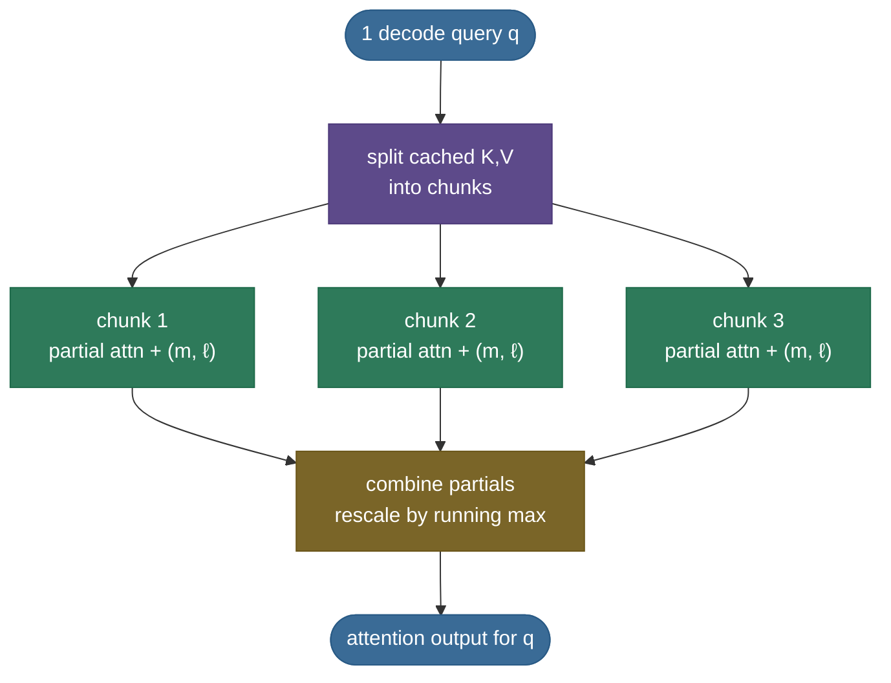

# KV Cache · Chapter 3 — FlashAttention and FlashDecoding: reading the cache fast

Chapters 1–2 decided **how many bytes** of cache exist. This chapter is the other half of the speed equation: the attention **kernel** decides how close to peak bandwidth those bytes move. Shrink the cache 4× with GQA and read it with a kernel that wastes 4× the memory traffic, and you've gone nowhere.

Two kernels matter, one per phase:

- **FlashAttention** — exact attention without ever materializing the $n \times n$ score matrix; the prefill (and training) workhorse.
- **FlashDecoding** — the decode-shaped variant: one lone query against a long cache, parallelized across the cache instead of across queries.

---

## The problem: the score matrix is the traffic

Standard attention is three matmuls with a giant intermediate in the middle — and the intermediate, not the math, is the cost.

- Compute $S = QK^\top/\sqrt{d}$ ($n \times n$), write it to HBM; read it back for softmax, write $P$; read $P$ back to multiply by $V$.
- That is $O(n^2)$ **memory traffic** to and from slow HBM — at 32K context, a single head's score matrix is $32768^2 \times 2$ bytes = **2 GiB**, per head, per layer.
- The GPU's fast on-chip SRAM is ~20 MB *total* — the matrix cannot live there, so the naive kernel shuttles it through HBM and the memory bus becomes the bottleneck (the same roofline logic as the main page's decode analysis).

> **Note:** attention's FLOPs are rarely the problem — the *round-trips* are. FlashAttention's contribution is IO-awareness: same math, radically fewer HBM touches.

---

## FlashAttention: tile, stream, never materialize

**FlashAttention** ([Dao et al. 2022](https://arxiv.org/abs/2205.14135)) computes *exact* attention while keeping every intermediate small enough to live in SRAM.

**The tiling loop:**

- Split K and V into **blocks** small enough for SRAM (say 128 rows each).
- For each query block: loop over K/V blocks, compute the *partial* scores for that tile **in SRAM**, fold them into a running output, and move on — the full $n \times n$ matrix never exists anywhere.
- Each K/V block is read from HBM **once** per query block, instead of the naive kernel's multiple full-matrix round-trips.

**The trick that makes tiling legal — online softmax.** Softmax normalizes over the *whole* row, but tiling sees the row one chunk at a time. The fix is a running reformulation:

- keep three accumulators per query row: the **running max** $m$, the **running denominator** $\ell$, and the **running weighted output** $o$;
- on each new tile, compute the tile's local max, **rescale** the old accumulators by $e^{m_{\text{old}} - m_{\text{new}}}$, then add the tile's contribution;
- after the last tile, $o/\ell$ is *exactly* the softmax-weighted output — same numbers as the naive kernel, to floating point.

$$m_{\text{new}} = \max(m_{\text{old}}, m_{\text{tile}}), \quad \ell_{\text{new}} = e^{m_{\text{old}}-m_{\text{new}}}\,\ell_{\text{old}} + e^{m_{\text{tile}}-m_{\text{new}}}\,\ell_{\text{tile}}$$

- the $\max$ subtraction is the standard numerical-stability trick for softmax; online softmax just maintains it *incrementally*.

**What it buys:**

- memory traffic drops from $O(n^2)$ to $O(n)$ in the sequence length (each K/V element streamed once per query block);
- long-context prefill and training become feasible at lengths where the naive kernel wouldn't even fit;
- it is **exact** — not an approximation like sparse or linear attention; nothing about model quality changes.

> **Gotcha:** FlashAttention is a *kernel*, not an architecture. It composes with every variant in [chapter 1](/ai-ml/ai-ml-learning-resources/llms-applications-and-agents/inference-and-runtime/kv-cache/kv-cache-variants) — GQA, MLA, quantized caches — because it only changes how the bytes are scheduled, never which bytes exist.

---

## FlashDecoding: the lone-query problem

Decode breaks FlashAttention's parallelism assumption, and the fix is to flip the axis of parallelism.

**Why decode starves the GPU:**

- FlashAttention parallelizes across **query blocks** — plenty of them in prefill, where all $N$ prompt positions arrive at once.
- A decode step has **one** query token. One query block ≈ one streaming multiprocessor doing work — the other ~100+ SMs idle while the lone block crawls through a 32K-token cache.
- The step was already memory-bound; now it's memory-bound *and* using a fraction of the memory system's parallelism.

**The fix — parallelize over the cache** ([FlashDecoding, Dao et al. 2023](https://pytorch.org/blog/flash-decoding/)):

- **split** the cached K/V into chunks along the sequence dimension;
- attend the single query to **every chunk in parallel** — each chunk produces a partial output plus its softmax statistics $(m, \ell)$;
- **combine** the partials with the same online-softmax rescaling FlashAttention uses within a row — associativity makes the split-then-merge exact;
- long-context decode goes from one crawling SM to a bandwidth-saturated GPU; reported speedups reach **up to ~8×** on long sequences.

> **Note (split-count trade):** too many splits and the combine/reduction overhead dominates; too few and SMs idle. The kernel picks the split count from cache length and SM count — just enough parallelism to saturate the hardware.

---

## The lineage: where the kernels went next

The ideas above kept compounding; knowing the names lets you read a serving-engine changelog.

- **FlashAttention-2** — better work partitioning and fewer non-matmul ops; ~2× over FA-1 on the same hardware.
- **FlashAttention-3** — Hopper-native: warp specialization, TMA async copies, FP8 support; pushes toward the H100's actual roofline.
- **FlashDecoding++** — replaces the exact running-max rescale with a *predetermined* softmax max (plus overflow fallback), making the chunk combines cheaper and asynchronous.
- **FlashInfer** — the kernel library built for *serving* shapes: block-sparse/paged KV layouts (it reads vLLM-style block tables natively), fused GQA and speculative-verification kernels; adopted by vLLM and SGLang.
- The through-line: every generation moves the kernel closer to **"stream the cache once, at full bandwidth, whatever shape the cache is in."**

---

## How kernels and cache levers compose

The cache stack and the kernel stack multiply; neither substitutes for the other.

- The **cache levers** ([chapters 1](/ai-ml/ai-ml-learning-resources/llms-applications-and-agents/inference-and-runtime/kv-cache/kv-cache-variants)–[2](/ai-ml/ai-ml-learning-resources/llms-applications-and-agents/inference-and-runtime/kv-cache/kv-cache-optimization-stack)) set *how many bytes* must move per step: KV heads × bits × tokens × allocation efficiency.
- The **kernels** set *what fraction of peak bandwidth* you move them at: tiling, split-K parallelism, paged-layout gathers.
- A production long-context stack always names both: **"GQA + paging + FP8 cache, read by FlashAttention/FlashDecoding-class kernels"** — the recurring recipe behind every "128K context" product claim.
- Rough mental model: $\text{TPOT} \approx \dfrac{\text{bytes held per step (levers)}}{\text{effective bandwidth (kernels)}}$ — two independent numerators of the same fraction.

> **Tip:** in an interview, connecting the two layers is the senior answer. "Shrink the bytes with GQA/FP8/paging, then saturate bandwidth with FlashDecoding's split-K" demonstrates you see the full pipeline, not one trick.

---

## Recap

- Naive attention's cost is the $n \times n$ score matrix's **HBM round-trips**, not its FLOPs.
- **FlashAttention** = tiling + online softmax: exact attention, $O(n)$ memory traffic, intermediates never leave SRAM.
- **Online softmax** is the enabling identity: running $(m, \ell, o)$ accumulators, rescaled per tile by $e^{\Delta m}$ — exact, and associative enough to split.
- **FlashDecoding** reuses that associativity to parallelize **one query across cache chunks** — the decode-shaped kernel; up to ~8× on long context.
- The lineage (FA-2/FA-3, FlashDecoding++, FlashInfer) keeps chasing the same target: stream the cache once at full bandwidth, in whatever paged/quantized/grouped shape it's in.
- Cache levers shrink the bytes; kernels raise the bandwidth — **compose both** or leave speed on the table.

Next: [Chapter 4 — the KV cache in production](/ai-ml/ai-ml-learning-resources/llms-applications-and-agents/inference-and-runtime/kv-cache/kv-cache-in-production): schedulers, metrics, and the incidents.

---

## References

Shared with the topic's companion file — see [KV Cache — references and further reading](/ai-ml/ai-ml-learning-resources/llms-applications-and-agents/inference-and-runtime/kv-cache/kv-cache#references-further-reading) (FlashAttention, FlashDecoding, and serving-kernel entries).
