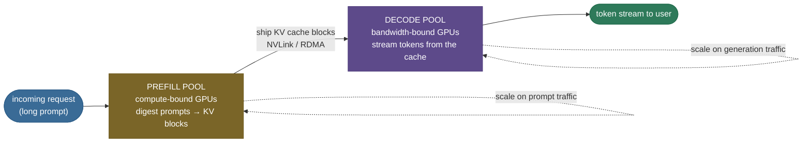

# KV Cache · Chapter 4 — The KV cache in production

Everything so far was mechanism; this chapter is operations. In a serving system the KV cache is the **shared, finite, per-request state** every scheduling decision revolves around — and the origin of most LLM-serving incidents. Here: how engines schedule around the cache, the metrics that expose it, the failure modes, and the checklists.

What the cache *is* to a serving engine:

- the **unit of admission** — a request enters only if its worst-case cache fits;
- the **unit of preemption** — under pressure, a request's cache is what gets evicted or swapped;
- the **unit of sharing** — prefix blocks are the dedup layer across requests;
- the **unit of transfer** — disaggregation ships cache blocks between machines.

---

## The engines and what they bet on

Four production engines dominate; each is a different bet on cache management.

| Engine | Cache bet | Signature machinery |
|---|---|---|
| [vLLM](https://github.com/vllm-project/vllm) | paging is everything | PagedAttention, continuous batching, automatic prefix caching, FP8 cache |
| SGLang | prefixes repeat at scale | RadixAttention — radix-tree prefix cache across thousands of sessions |
| TensorRT-LLM | compile it all | fused kernels, paged KV, FP8-first on Hopper, in-flight batching |
| llama.cpp | fit on anything | aggressive cache quantization (down to 4-bit), CPU/GPU split, unified memory |

- The convergent evolution is the tell: **every** serious engine independently arrived at paged cache + continuous batching + prefix reuse — the ladder of [chapter 2](/ai-ml/ai-ml-learning-resources/llms-applications-and-agents/inference-and-runtime/kv-cache/kv-cache-optimization-stack) is not optional at scale.

---

## Scheduling around the cache

Three scheduler mechanisms — all of them cache-shaped — define modern serving.

**Continuous batching.** The batch is rebuilt **every step**, not per request-group:

- a finished request releases its cache blocks *immediately*; a queued request joins the very next step;
- without it, the whole batch waits for its slowest member while finished requests' cache sits idle;
- with it, cache occupancy — not batch boundaries — becomes the only limit on concurrency.

```mermaid
gantt
    dateFormat X
    axisFormat %s
    section Static batch
    req A (short) — then GPU slot idles      :done, 0, 3
    req B (long)                             :active, 0, 9
    req C waits for the WHOLE batch          :crit, 9, 12
    section Continuous batch
    req A (short)                            :done, 0, 3
    req C admitted the step A finishes       :done, 3, 7
    req B (long) — never blocks anyone       :active, 0, 9
```

*Static batching strands cache and compute behind the slowest request; continuous batching refills the slot — and reuses the freed cache blocks — the very next step.*

**Chunked prefill.** A 30K-token prompt's prefill is a multi-second compute burst that would stall every co-scheduled decode:

- split the prefill into chunks (say 2K tokens) and interleave them with the running decodes;
- TTFT for the long prompt rises slightly; TPOT for everyone else stops spiking — the p99 defense;
- the cache fills progressively, chunk by chunk, instead of in one burst.

**Preemption: swap vs recompute.** When a load spike outruns free blocks, the scheduler evicts someone:

- **swap** — copy the victim's cache blocks to CPU RAM, copy back on resume; costs PCIe bandwidth both ways;
- **recompute** — drop the blocks, re-run prefill on resume; costs GPU compute, no interconnect;
- short caches favor recompute (prefill is cheap); long caches favor swap (re-prefilling 30K tokens is not);
- either way the request *survives* — the alternative is the OOM crash in the incident list below.

> **Tip:** **speculative decoding** rides on this machinery: a draft model proposes several tokens and the target model verifies them in one forward pass — which requires the cache to tentatively hold speculated tokens and **roll back** the rejected suffix. A block-addressable cache makes the rollback a block-table edit.

---

## Disaggregated prefill and decode

The two phases have opposite bottlenecks — at sufficient scale you stop running them on the same GPUs.

- **Why:** prefill is compute-bound, decode memory-bound ([main page](/ai-ml/ai-ml-learning-resources/llms-applications-and-agents/inference-and-runtime/kv-cache/kv-cache)). On shared GPUs, chunked prefill only *softens* the interference; heavy prompt traffic still bleeds into TPOT.
- **How:** a **prefill pool** digests prompts and produces KV caches; the blocks are **shipped over the interconnect** (NVLink/RDMA) to a **decode pool** that streams tokens; each pool scales and is hardware-tuned independently.

*The cache is the interface between the pools — which is why paged, addressable blocks are the precondition for the architecture.*
- **The cache is the interface:** what travels between the pools is exactly the request's KV blocks — which is why paged, addressable layouts ([chapter 2](/ai-ml/ai-ml-learning-resources/llms-applications-and-agents/inference-and-runtime/kv-cache/kv-cache-optimization-stack)) are the precondition for the architecture.
- **When:** worth it when prompt and generation traffic are both heavy and TTFT/TPOT targets are strict — the regime of the largest deployments; small deployments should exhaust chunked prefill first.

---

## The metrics that expose the cache

Four numbers on every serious serving dashboard, and what the cache does to each.

- **TTFT** (time-to-first-token) — prefill latency. Prefix-cache hits collapse it; long-prompt bursts inflate it; chunked prefill trades a little of it for everyone else's TPOT.
- **TPOT** (time-per-output-token) — decode latency ≈ bytes-streamed-per-step ÷ effective bandwidth. Rises with context length (the cache term), falls with GQA/FP8/windowing and better kernels ([chapter 3](/ai-ml/ai-ml-learning-resources/llms-applications-and-agents/inference-and-runtime/kv-cache/kv-cache-flashattention-and-flashdecoding)).
- **Cache utilization** — fraction of KV memory holding *live* tokens. Low → fragmentation or over-reservation (climb to L3); pinned at 100% → preemption churn is next.
- **Goodput** — throughput that *met its latency SLO*, the honest number. Raw tokens/sec rises with batch size right up until cache pressure triggers preemption storms and p99 detonates — goodput is what catches it.

> **Gotcha:** watch **preemption rate** alongside goodput. A rising preemption rate at flat throughput is the early warning that you're serving from the cache's redline — the next traffic spike becomes the incident.

---

## The incident playbook

The five classic KV-cache incidents — mechanism, detection, mitigation. (The main page lists them; here is the dissection.)

**1. Context bleed.**

- *Mechanism:* cache keyed wrong or a pooled buffer reused without clearing — user A's tokens condition user B's generation. Correctness **and privacy** failure.
- *Detection:* hard to see in metrics; shows up as "the model referenced something I never said." Test with canary strings across request boundaries.
- *Mitigation:* key cache blocks strictly to request IDs; zero or fence blocks on release; make cross-request sharing *explicit* (prefix cache) rather than accidental.

**2. OOM under a load spike.**

- *Mechanism:* concurrency × length outruns free blocks mid-generation — the cache grows *after* admission.
- *Detection:* cache utilization pegged + allocation failures; in naive engines, a crash that takes every in-flight request with it.
- *Mitigation:* admission control that budgets **worst-case** blocks per request; preemption (swap/recompute) as the pressure valve; capacity planning from cache math, not weight math.

**3. Silent quality loss from a quantized cache.**

- *Mechanism:* FP8/INT8/INT4 cache enabled for capacity; K's outlier channels degrade long-context retrieval quietly ([chapter 1](/ai-ml/ai-ml-learning-resources/llms-applications-and-agents/inference-and-runtime/kv-cache/kv-cache-variants)).
- *Detection:* only visible in **evals** — win-rate and needle-in-haystack before/after; perplexity barely moves.
- *Mitigation:* gate the flag on long-context evals; prefer FP8 before INT; keep K at higher effective precision than V.

**4. Stale prefix cache.**

- *Mechanism:* system prompt edited, cache key unchanged — every request reuses the old prefix's KV. The model "ignores" the new prompt because it literally never sees it.
- *Detection:* behavior doesn't change after a prompt deploy; prefix-cache hit rate stays suspiciously perfect.
- *Mitigation:* content-hash the prefix into the cache key; version prompts; flush on deploy.

**5. Capacity sized from the wrong number.**

- *Mechanism:* GPUs budgeted from parameter count; the per-request cache (the number that actually caps concurrency) never entered the spreadsheet.
- *Detection:* the fleet OOMs or preempts at a fraction of the projected load.
- *Mitigation:* size from the formula — weights + overhead + (cache/token × expected length × target concurrency); the [main page's Worked example 2](/ai-ml/ai-ml-learning-resources/llms-applications-and-agents/inference-and-runtime/kv-cache/kv-cache) is the template.

---

## The pre-launch checklist

Before an LLM service takes real traffic, the cache questions to have answers for:

- **Capacity** — cache/token for *this* model and dtype? Expected context distribution? Concurrency at p95 length? Headroom for spikes?
- **Allocation** — paged or slab? Block size? Utilization target before admission throttles?
- **Sharing** — prefix caching on? Cache key includes a content hash? Flush path on prompt deploy?
- **Degradation** — preemption policy (swap vs recompute) chosen and *load-tested*? Admission control rejects rather than crashes?
- **Quality** — if the cache is quantized: long-context evals ran? Win-rate delta recorded and signed off?
- **Observability** — TTFT, TPOT, cache utilization, preemption rate, prefix hit rate all on the dashboard with alerts?
- **Isolation** — canary test for context bleed in CI? Cache cleared/fenced between requests, proven under concurrency?

---

## Recap

- In production the cache is the **currency of scheduling**: admission, preemption, sharing, and transfer are all denominated in cache blocks.
- Continuous batching + chunked prefill + preemption are the three scheduler moves; all exist to keep cache occupancy high without letting it kill p99.
- Disaggregation separates the compute-bound and memory-bound phases onto separate pools, with **cache blocks as the interface** between them.
- Watch **goodput and preemption rate**, not raw throughput — the cache redline announces itself there first.
- The five incidents (bleed, OOM, silent quant loss, stale prefix, mis-sized capacity) are all one root cause: treating the cache as an implementation detail instead of the system's primary state.

Back to the [main page](/ai-ml/ai-ml-learning-resources/llms-applications-and-agents/inference-and-runtime/kv-cache/kv-cache) · previous: [Chapter 3 — FlashAttention and FlashDecoding](/ai-ml/ai-ml-learning-resources/llms-applications-and-agents/inference-and-runtime/kv-cache/kv-cache-flashattention-and-flashdecoding).

---

## References

Shared with the topic's companion file — see [KV Cache — references and further reading](kv-cache.references.md) (vLLM, SGLang, TensorRT-LLM, speculative-decoding, and serving-survey entries).
