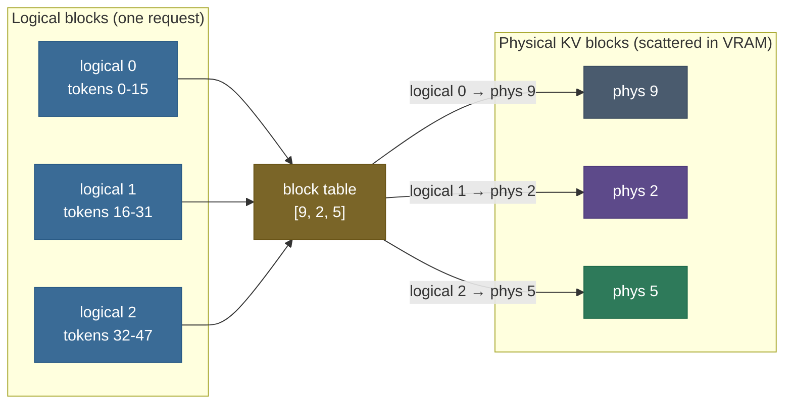

# KV Cache · Chapter 2 — The optimization ladder

Every serving system climbs the same ladder, in the same order, for the same reason: each level removes the *next* dominant waste. This chapter walks the levels from "no cache at all" to a fully-optimized production cache — what each level fixes, what it costs, and the numbers that tell you when to climb.

The ladder at a glance:

| Level | Name | Kills | Typical win |
|---:|---|---|---|
| L0 | Naive recompute | — (the baseline waste) | — |
| L1 | KV cache | re-projecting the past | $O(n^2) \to O(n)$ total work |
| L2 | Pre-allocated, in-place cache | per-step re-allocation | removes a hidden $O(n^2)$ |
| L3 | PagedAttention | fragmentation | 60–80% wasted memory → ~4% |
| L4 | Prefix caching | duplicate prefill | shared prompts ≈ free |
| L5 | Quantized cache | excess bits | 2–4× bytes (speed *and* capacity) |
| L6 | Windowing / offload | unbounded growth | constant memory on endless streams |

---

## L0 → L1: cache at all

The main page covers this move in full; the ladder needs only its shape.

- **L0** recomputes every past token's K/V on every step: $\tfrac{n(n+1)}{2}$ projections total, per-step cost growing with position.
- **L1** stores each token's K/V at first computation and reuses them forever: one projection per token, identical outputs, VRAM traded for time.
- Everything else in this chapter is about *managing* what L1 created: a state object that grows with every token and lives as long as the request.

---

## L1 → L2: stop re-allocating

The teaching-code `torch.cat` append hides a second quadratic. Real engines never grow a tensor per token.

- `torch.cat` per step allocates a new buffer and **copies the entire cache** — $O(n)$ copy per step, $O(n^2)$ over the generation. The complexity you just removed sneaks back in through the allocator.
- **L2** allocates once (worst-case length, contiguous), writes each new token's K/V **in place** at the next slot, and bumps a length counter. Append becomes a true $O(1)$.
- The Hugging Face `DynamicCache` → `StaticCache` migration is exactly this move — and `StaticCache` is also what makes the decode step `torch.compile`-able (fixed shapes, no re-allocation).

> **Gotcha:** L2's fix creates L3's problem. Pre-allocating *worst-case* length per request means a request that stops at 50 tokens still holds its 4,096-token reservation. You've traded re-allocation for **reservation waste**.

---

## L2 → L3: page the cache (PagedAttention)

The waste L2 leaves behind is *allocation-shaped*, and the fix is the oldest trick in operating systems: **virtual memory**.

**The problem, quantified:**

- **Internal fragmentation** — a request reserved for 4,096 tokens but finished at 50 wastes 99% of its slab.
- **External fragmentation** — free gaps between contiguous slabs, each too small to fit a new request.
- Measured across real workloads, contiguous allocators waste **60–80%** of cache memory ([vLLM paper](https://arxiv.org/abs/2309.06180)).

**The mechanism — PagedAttention:**

- Store the cache in small fixed-size **blocks** (vLLM default: 16 tokens each), physically scattered anywhere in VRAM.
- Give each request a **block table** mapping logical block index → physical block — exactly an OS page table.
- Allocate **on demand**, one block at a time: a request only ever holds blocks for tokens it actually produced.
- The attention kernel gathers scattered blocks through the table; logically the cache still *looks* contiguous.

**The lookup, concretely.** Block size 16, you want token 40:

- logical block = $40 // 16 = 2$, offset = $40 \bmod 16 = 8$;
- block table `[9, 2, 5]` → logical 2 maps to **physical block 5**;
- the kernel reads **slot 8 of physical block 5**. Tokens 0…47 live scattered across physical blocks 9, 2, 5 — the table is the only thing making them look contiguous.

**What it buys:**

- wasted memory capped at **less than one block** per request (≤ 15 token-slots) — regardless of sequence length; 60–80% waste becomes ~4%;
- the reclaimed memory becomes batch slots: vLLM reports **2–4× throughput** over contiguous predecessors;
- blocks are **addressable**, which unlocks sharing (L4) and shipping (disaggregation, [chapter 4](/ai-ml/ai-ml-learning-resources/llms-applications-and-agents/inference-and-runtime/kv-cache/kv-cache-in-production)).

> **Note (block-size trade):** smaller blocks waste less on the final partial block but multiply block-table size and per-step gather overhead; larger blocks gather faster but waste more. 16 is vLLM's measured balance point.

---

## L3 → L4: never prefill the same prefix twice

Once blocks are addressable, requests can **share** them — and most real traffic shares a lot.

- Chat and agent workloads carry a long identical **prefix**: the system prompt, a few-shot preamble, a shared document. Naively every request re-runs prefill over it.
- **Prefix caching** computes the prefix's KV blocks **once** and points every matching request's block table at the same physical blocks — a prefill that becomes a cache hit.
- **Copy-on-write** handles divergence: the moment a request extends past the shared prefix, only the block it writes is copied; everything upstream stays shared. (Same trick serves beam search — beams share their common prefix's blocks.)
- vLLM ships this as *automatic prefix caching*; **SGLang's RadixAttention** organizes cached prefixes in a radix tree for fast longest-prefix matching across thousands of concurrent conversations.

> **Tip:** the win scales with `shared-prefix length × request rate`. A 3,000-token system prompt at 100 req/min is ~300K tokens of prefill per minute that simply stops happening.

> **Gotcha:** a prefix cache needs **invalidation**. Change the system prompt but keep its cache key and every request silently reuses the wrong KV — the "stale prefix" incident in [chapter 4](/ai-ml/ai-ml-learning-resources/llms-applications-and-agents/inference-and-runtime/kv-cache/kv-cache-in-production).

---

## L4 → L5: quantize the cache

With allocation and reuse solved, the remaining bytes are the numbers themselves — and FP16 is more precision than cached K/V needs.

- **FP8** halves bytes-held *and* bytes-streamed; hardware-native on Hopper+; usually near-lossless. The default first move.
- **INT8/INT4** go further but need scale-factor machinery — per-channel for K, per-token for V (the KIVI asymmetry, mechanics in [chapter 1](/ai-ml/ai-ml-learning-resources/llms-applications-and-agents/inference-and-runtime/kv-cache/kv-cache-variants)).
- Because decode is bandwidth-bound, fewer bytes per token is **directly faster**, on top of fitting 2–4× more requests.
- The cost is a quality tail-risk concentrated in long-context retrieval: **gate this level on long-context evals**, not perplexity.

---

## L5 → L6: bound or spill the growth

The top of the ladder handles the cases where even an optimized cache can't just keep growing.

- **Sliding window + attention sinks** — cap `seq_len` at $w$; keep ~4 sink tokens so softmax has somewhere to put its mandatory probability mass (StreamingLLM). Constant memory on endless streams; genuine forgetting outside the window ([chapter 1](/ai-ml/ai-ml-learning-resources/llms-applications-and-agents/inference-and-runtime/kv-cache/kv-cache-variants)).
- **Offload / tiering** — spill cold cache blocks to CPU RAM (or NVMe) and prefetch on demand: an idle chat session's cache doesn't have to occupy VRAM at all. Paging makes this tractable — blocks are the unit of movement.
- **Preempt-and-recompute** — under memory pressure, an engine can *drop* a request's cache entirely and recompute it by re-running prefill when the request is rescheduled. Recompute-vs-swap is a genuine trade: recompute burns compute but no interconnect; swap burns bandwidth but keeps prefill work.

> **Note:** L6 is the first level that changes *semantics* (windows forget) or *latency shape* (offload adds fetch stalls). L1–L5 are pure wins; L6 is a workload decision.

---

## Sizing a deployment, level by level

The reasoning end to end, for "serve Llama-3-8B chat on one A100-80GB, 8K context, max throughput" — each step is the main-page formula plus one ladder level:

1. **Per-token cache.** Llama-3-8B ships GQA-8 ($n_{\text{layers}}=32$, $d_{\text{head}}=128$): $2 \times 32 \times 8 \times 128 \times 2 \approx 0.125$ MiB/token.
2. **Per-request cache.** 8K context → $8192 \times 0.125 \approx 1$ GiB/request.
3. **Budget.** 80 GB − ~16 GB weights − ~6 GB overhead ≈ **58 GB for cache** → ~**58 concurrent requests** (L2 arithmetic).
4. **Climb to L3.** Real requests average far below the 8K cap — paging turns reserved-but-unused into free blocks; effective concurrency rises toward the *average*-length bound, not the worst-case one.
5. **Climb to L4.** Chat traffic shares the system prompt — its blocks are stored once, not per-request.
6. **Climb to L5.** FP8 cache → 0.5 GiB/request → ~**116 requests**.
7. **Need endless sessions?** L6 windowing caps per-session growth; offload parks idle sessions in CPU RAM.

> **Tip:** climb **in order**. Quantizing (L5) before paging (L3) shrinks bytes you're still wasting 60–80% of; prefix caching (L4) without paging (L3) has no shareable blocks to point at. Each level's win compounds on the previous one.

---

## Recap

- The ladder: **cache → in-place → paged → shared → quantized → bounded/spilled** — each level kills the next dominant waste, and the order is not optional.
- L2 hides in plain sight: `torch.cat` growth is a silent second $O(n^2)$; pre-allocate and write in place.
- L3 (PagedAttention) is the pivotal level — it converts memory from slabs into **addressable blocks**, which is what makes L4 sharing, beam search, offload, and cache shipping possible at all.
- L4 turns the most common traffic pattern (shared system prompt) into cache hits; it needs invalidation discipline.
- L5 pays twice (capacity *and* bandwidth) and risks once (long-context quality) — gate on evals.
- L6 changes semantics or latency shape; it's a workload decision, not a free win.

Next: [Chapter 3 — FlashAttention and FlashDecoding](/ai-ml/ai-ml-learning-resources/llms-applications-and-agents/inference-and-runtime/kv-cache/kv-cache-flashattention-and-flashdecoding): the ladder decided how many bytes exist; the kernels decide how close to peak bandwidth you move them.

---

## References

Shared with the topic's companion file — see [KV Cache — references and further reading](/ai-ml/ai-ml-learning-resources/llms-applications-and-agents/inference-and-runtime/kv-cache/kv-cache#references-further-reading) (vLLM/PagedAttention, SGLang/RadixAttention, StreamingLLM, KIVI entries).
