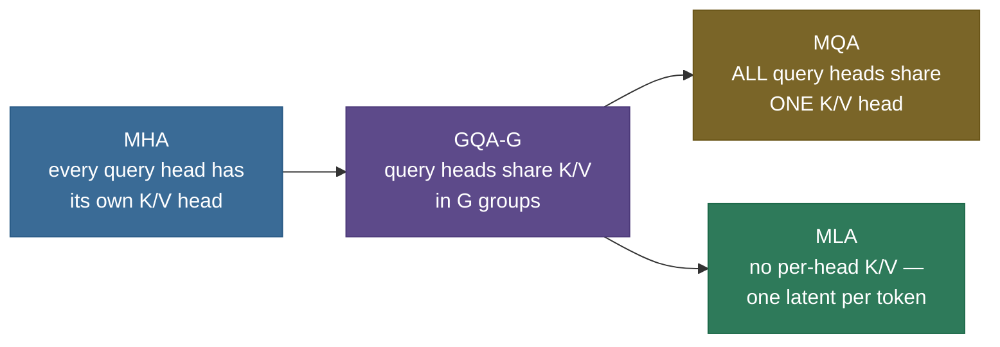
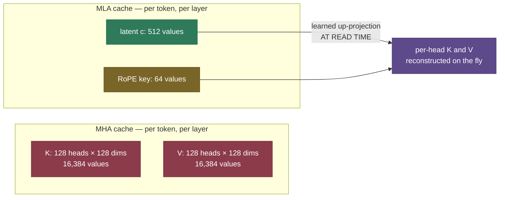

# KV Cache · Chapter 1 — Variants: what you store

The [main page](/ai-ml/ai-ml-learning-resources/llms-applications-and-agents/inference-and-runtime/kv-cache/kv-cache) established the cache-size formula and why every byte of it costs speed and capacity. This chapter is about the **variants** — the different answers models give to "what exactly do we store per token?" Every variant attacks a different term of the formula, and every modern model you can name has picked one.

The map, before the details:

- **Fewer KV heads** — MQA and GQA shrink $n_{\text{kv\_heads}}$ (architectural, chosen at pretraining).
- **No per-head K/V at all** — MLA stores a compressed latent and reconstructs K/V at read time.
- **Fewer bits per number** — quantized caches (FP8, INT8, INT4, KIVI) shrink bytes-per-element (runtime).
- **Fewer tokens** — sliding windows and attention sinks cap `seq_len` (architectural or runtime).

---

## The family tree at a glance

Four attention variants, one axis: how much per-token K/V state survives.

| Variant | KV heads stored | per-token cache rel. MHA | quality | used by |
|---|---|---:|---|---|
| MHA | $H$ (one per query head) | 1× | reference | GPT-2, Llama-2-7B |
| GQA-$G$ | $G$ groups (e.g. 8) | $G/H$ (e.g. 1/4–1/8) | ~MHA | Llama-2-70B, Llama-3, Mistral |
| MQA | 1 | $1/H$ (e.g. 1/32–1/64) | small drop | Falcon, PaLM, early Gemini |
| MLA | latent $d_c$ + RoPE key $d_R$ | ~4% of MHA | ≥ MHA (reported) | DeepSeek-V2/V3 |

---

## MQA and GQA: share the K/V heads

The biggest lever is architectural: **share K and V across query heads** so there are simply fewer of them to store.

- ***MHA*** (multi-head attention) — every query head has its own K/V head. Biggest cache, reference quality.
- ***MQA*** (multi-query attention) — *all* query heads share **one** K/V head, collapsing $n_{\text{kv\_heads}}$ to 1. The cache shrinks by the full head count (e.g. **32× or 64×**), at a noticeable quality cost.
- ***GQA*** (grouped-query attention) — query heads share K/V in **groups**. The sweet spot, used by Llama-2/3, Mistral, and most modern models.

**The group-sharing mechanism.** GQA with $G$ groups (written **GQA-$G$**) splits the $H$ query heads into $G$ equal groups:

- every head in a group shares **one** K/V head → you store $G$ K/V heads instead of $H$;
- the formula's $n_{\text{kv\_heads}}$ multiplier drops from $H$ to $G$ — the cache shrinks by exactly $H/G$;
- MHA is the $G{=}H$ end of the dial (no sharing), MQA the $G{=}1$ end (everyone shares);
- cut KV heads 64 → 8 and the cache shrinks **8×** while every *query* head — most of the model's expressiveness — stays untouched.

**Converting an existing MHA model.** You don't have to pretrain from scratch (Ainslie et al., [GQA 2023](https://arxiv.org/abs/2305.13245)):

- partition the $H$ K heads into $G$ groups and **mean-pool** each group down to one K head (same for V);
- **uptrain** the converted model on **~5% of the original pretraining compute** to recover quality;
- a light retrofit, not a fresh pretrain — but still a real training run with a real bill, not a config flag.

> **Note:** GQA is *the* reason a modern 70B model is servable at long context. Choosing a base model for long-context serving? **Check its KV-head count**, not just its parameter count.

> **Gotcha:** where the quality loss lands is not uniform — it concentrates in **long-context retrieval** (needle-in-a-haystack lookups suffer first, because fewer distinct K/V views of the past survive). Mild at GQA-8, noticeable at MQA-1. Evaluate on retrieval-shaped tasks, not perplexity alone.

---

## MLA: cache a latent, not the heads

**Multi-head Latent Attention** (DeepSeek-V2/V3) is the frontier of the lever: stop storing per-head K and V entirely.

- Per token, MLA caches a single **low-rank latent vector** ($d_c$ wide) — a learned compression of the information every head's K and V would carry.
- At read time, learned **up-projections** reconstruct the per-head K and V from the latent on the fly — compute traded for memory, in a regime where memory is the scarce resource.
- Put in numbers: same-shape MHA with $n_{\text{heads}}=128$, $d_{\text{head}}=128$ caches $2 \times 128 \times 128 = 32{,}768$ values per token per layer. DeepSeek-V2's MLA caches a **latent of $d_c=512$ plus a decoupled-RoPE key of $d_R=64$ = 576 values** — no factor of 2, because one latent reconstructs both K and V.
- That is **~1.8%** of the same-shape MHA ($576/32{,}768$); DeepSeek headlines **~4%** against its own production baseline. Either way, far below even GQA.

*32,768 stored values become 576 — the up-projection moves the cost from memory (stored per token, forever) to compute (paid per read), the right trade in a memory-bound regime.*

> **Note (the RoPE subtlety):** RoPE doesn't commute with the low-rank up-projection — you can't rotate a compressed latent, up-project, and get the right per-head positional key. So MLA caches a small *separately-RoPE'd* key dimension ($d_R=64$) **directly**, alongside the latent. That extra 64 is why the cache is $512+64$, not $512$.

> **Gotcha:** MQA/GQA/MLA are **architectural** — chosen at (pre)training. You can't toggle them at runtime. The runtime variants below (quantization, windowing) are the ones you can apply to a model you already have, untouched.

---

## Quantized caches: fewer bits per number

The cache is just numbers, and you rarely need 16 bits of precision for them. Store K and V in fewer bits and the bytes — and, in the bandwidth-bound decode regime, the latency — shrink proportionally.

| Precision | bytes/elem | cache vs FP16 | quality | notes |
|---|---:|---:|---|---|
| FP16 (baseline) | 2 | 1.00× | reference | what the main-page formula assumes |
| FP8 (E5M2/E4M3) | 1 | 0.50× | near-lossless | hardware-native on Hopper; the common default |
| INT8 | 1 | 0.50× | small loss | needs per-token (V) / per-channel (K) scales |
| INT4 | 0.5 | 0.25× | needs care | outliers bite without good scaling; measure win-rate |
| KIVI 2-bit | ~0.25 | ~0.125× | good w/ the K/V split | K per-channel + V per-token, ~2 bits each |

**Why K and V want *different* quantization — the mechanism.** This is the part worth understanding; the best low-bit schemes fall out of it. The two tensors have opposite error structure:

- **Keys** carry **persistent large-magnitude outliers in a few *fixed* channels** — the same feature dimensions blow up across nearly every token. Quantize a key *per-token* (one scale across that token's channels) and a single outlier channel sets the scale, crushing every other channel's precision. Fix: quantize keys **per-channel** — each channel gets its own scale, so a loud channel spends bits only on itself.
- **Values** have **no structured channel outliers** — *and* the attention output is a per-token **weighted sum** of value vectors, so error localized per-token gets averaged down. **Per-token** scaling is exactly right for V.

That split — **keys per-channel, values per-token, ~2 bits each** — is precisely **KIVI** ([Liu et al. 2024](https://arxiv.org/abs/2402.02750)). The asymmetry isn't a heuristic; it falls out of where each tensor's error lands.

> **Gotcha:** low-bit caches are not free. FP8 is usually near-lossless; INT4 and below need the per-channel/per-token machinery to survive, and the failures concentrate — again — in long-context retrieval. **Measure win-rate before and after**; don't assume.

---

## Windowed caches: fewer tokens

The variants above shrink bytes-per-token; this one caps the **number of tokens**. If you don't truly need unbounded history, keep only the most recent $w$:

- **Sliding-window attention** (Mistral) — each token attends only to the last $w$ tokens; the cache never exceeds $w$ entries no matter how long the conversation runs.
- **Attention sinks** ([StreamingLLM](https://arxiv.org/abs/2309.17453)) — keep the **first few tokens** *plus* the recent window. The mechanism is softmax itself: attention weights must sum to 1, there is no "attend to nothing." When the query matches no recent token, the mandatory probability mass pools on the earliest tokens — visible from every position. Evict them and you delete a chunk of the softmax **denominator**; the surviving weights renormalize wildly and quality collapses. Keep ~4 sinks + the window → stable, infinite-length streaming at bounded memory.

> **Note: a window doesn't mean a token only "sees" $w$ back.** Stacking layers gives a window the same reach a stack of convolutions gives a CNN: layer 1's output at position $i$ already mixes the last $w$ tokens, so layer 2 reaches $2w$ back, and over $L$ layers the effective receptive field is $\approx L \times w$. Mistral's $w=4096$ over 32 layers reaches **~131K tokens** of effective context — while the cache stays capped at $w$.

> **Gotcha:** effective receptive field is not **retrievable memory**. Information outside the window survives only as it was progressively *summarized* up the layer stack — "what did I say an hour ago, verbatim?" fails silently. Right for live transcription; wrong for document QA.

---

## The variants in real models

Tie each variant to a model you know. Per-token figures are $2 \times n_{\text{layers}} \times n_{\text{kv\_heads}} \times d_{\text{head}} \times 2$ bytes (FP16), straight from each model's real config:

| Model | Attn | KV heads | $d_{\text{head}}$ | Layers | Window | per-token cache (FP16) | what it buys |
|---|---|---:|---:|---:|---|---:|---|
| Llama-2-7B | MHA | 32 | 128 | 32 | full | $2{\cdot}32{\cdot}32{\cdot}128{\cdot}2 = $ **0.50 MiB** | the MHA baseline |
| Llama-3-8B | GQA-8 | 8 | 128 | 32 | full | $2{\cdot}32{\cdot}8{\cdot}128{\cdot}2 = $ **0.125 MiB** | 4× smaller → 8K–128K servable |
| Mistral-7B | GQA-8 | 8 | 128 | 32 | 4096 | **0.125 MiB**, capped at $w$ → ≤ 512 MiB total | cache can't grow past the window |
| DeepSeek-V2 | MLA | latent 512 + RoPE 64 | — | 60 | full | $60{\cdot}576{\cdot}2 = $ **0.066 MiB** | ~1.8% same-shape (4% reported) |

Read off the columns:

- the same 32-layer, $d_{\text{head}}=128$ 7B-class shape costs **0.50 MiB/token** under MHA and **0.125 MiB/token** under GQA-8 — the whole difference is the 32 → 8 KV-head cut;
- Mistral adds a window, so the *total* is bounded regardless of conversation length;
- MLA abandons the per-head formula entirely and lands at ~1.8% of same-shape MHA;
- every serving engine layers paging, FP8 cache options, and prefix caching on top of whichever variant the model ships with — that stack is [chapter 2](/ai-ml/ai-ml-learning-resources/llms-applications-and-agents/inference-and-runtime/kv-cache/kv-cache-optimization-stack).

> **Note:** **beam search** multiplies the cache by the beam width — each beam needs its own K/V for its own continuation. A paged, block-addressable cache makes this cheap: beams **share** the blocks of their common prefix and fork copy-on-write where they diverge.

---

## Choosing a variant: the decision rules

Three questions pick the variant; everything else is detail.

- **Do you control pretraining?** Yes → ship GQA (8 heads is the industry sweet spot); consider MLA if you're chasing frontier serving economics and can absorb the engineering. No → your KV-head count is fixed; your levers are runtime-only (quantize, window, page).
- **Is the workload retrieval-heavy at long context?** Yes → be conservative: GQA-8 over MQA, FP8 over INT4, full attention over windows — every aggressive variant fails *here* first. No (chat, summarize-as-you-go, transcription) → push harder; windows + sinks + low-bit caches are close to free.
- **Is the bottleneck capacity or latency?** Capacity (requests-per-GPU) → shrink bytes-held: fewer KV heads, lower bits, windows. Latency (TPOT at long context) → shrink bytes-streamed: the same levers, but measured per step — and pair with the kernels in [chapter 3](/ai-ml/ai-ml-learning-resources/llms-applications-and-agents/inference-and-runtime/kv-cache/kv-cache-flashattention-and-flashdecoding).

> **Tip:** the variants **compose**. Llama-3 ships GQA; serve it with an FP8 cache and paging and you've stacked three multipliers before touching a kernel. The composed stack, level by level, is [chapter 2](/ai-ml/ai-ml-learning-resources/llms-applications-and-agents/inference-and-runtime/kv-cache/kv-cache-optimization-stack).

---

## Recap

- Four variants, one axis: **how much per-token K/V state survives** — per-head (MHA), grouped (GQA), single (MQA), latent (MLA).
- **GQA-8** is the modern default: ~MHA quality, 4–8× smaller cache; MHA→GQA conversion is a mean-pool + ~5% uptrain.
- **MLA** caches a 576-wide latent instead of 32,768 per-head values — ~4% of MHA — at the cost of up-projection compute and a decoupled RoPE key.
- **Quantized caches** shrink bytes-per-element; K needs per-channel scales (fixed outlier channels), V is happy per-token — that asymmetry *is* KIVI.
- **Windows + sinks** bound the token count; sinks exist because softmax must put its probability mass somewhere.
- Quality losses from every aggressive variant concentrate in **long-context retrieval** — evaluate there, not on perplexity.

Next: [Chapter 2 — the optimization ladder](/ai-ml/ai-ml-learning-resources/llms-applications-and-agents/inference-and-runtime/kv-cache/kv-cache-optimization-stack), where these variants slot into the level-by-level stack a real serving system climbs.

---

## References

Shared with the topic's companion file — see [KV Cache — references and further reading](kv-cache.references.md) (GQA, MLA/DeepSeek-V2, KIVI, StreamingLLM, and Mistral entries).
