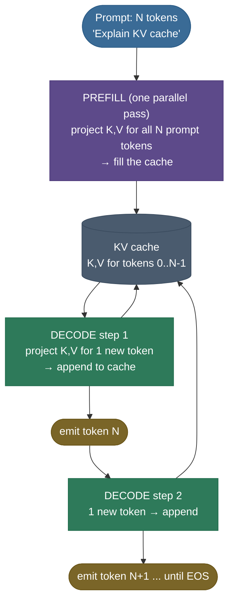
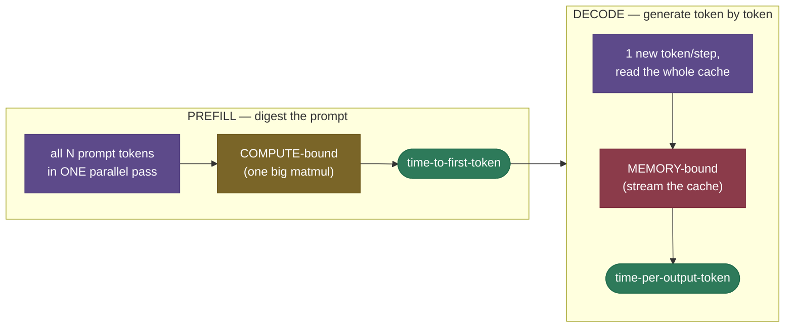

# KV Cache: don't recompute the past

Imagine writing an essay where, before you add each new word, you re-read the entire essay from the very first word — out loud, start to finish — just to decide what comes next. That is exactly what a transformer does when it generates text without a **KV cache**: every new token reruns attention over every token before it, recomputing numbers it already computed a step ago. The KV cache is the sticky note that says *"you already worked this out — here it is"*, and it is the single most important optimization in LLM inference.

This is the **main page** of a multi-chapter topic — the complete core; four depth chapters ([below](#going-deeper-the-chapters)) go further. By the end of this page you can:

- explain **what** is cached and **why only K and V** (never Q);
- **compute** the cache footprint for a real model and **size a deployment** from it;
- explain why generation has **two phases** (prefill vs decode) with opposite bottlenecks;
- derive from first principles why decode is **memory-bandwidth bound**;
- prove in runnable code that the cache changes **nothing** about the output, only the speed.

> **Note:** the cache is a *speed and memory* mechanism, not a *modeling* one. With or without it, the model produces **identical tokens** (proven in code below). It only changes how fast, and how much VRAM, that takes.

---

## The problem: decoding repeats itself

LLMs generate **autoregressively** — one token at a time, each conditioned on all before it — and the naive loop recomputes the past on every single step. Feel the waste first; the cache is just its removal.

- To produce token $t$, self-[attention](../../../../deep-learning/attention-and-transformers/attention-mechanism/attention-mechanism.md) forms a **query** for the current position, compares it against a **key** per previous position, and mixes the corresponding **values**.
- To produce token $t{+}1$ naively, the whole sequence runs through the model again — recomputing K and V for tokens $1 \dots t$, *the very same K and V computed one step ago*.
- Summed over a sequence of length $n$, that is $1 + 2 + \dots + n = \tfrac{n(n+1)}{2}$ projections — **quadratic**. With a cache each step projects one new token — **linear** overall.

The observation that makes the optimization possible:

> **Note:** in a causal (decoder-only) transformer, a token's key and value depend **only on that token and the ones before it** — never on anything after. Once token 5's K and V are computed, they are **frozen for the rest of the generation**. Recomputing them yields bit-for-bit identical numbers. Pure waste.


> **Gotcha:** people say the cache makes attention "$O(n)$ instead of $O(n^2)$." Be precise: the cache removes the redundant *recomputation of past tokens' K/V projections (and the rest of their forward pass)*. The attention **scores** for the current token still touch all $n$ past keys — a single step is still $O(n)$. What you never redo is the past tokens' work.

---

## What it is

A **KV cache** is a per-layer buffer holding the **key** and **value** vectors of every token processed so far — compute each token's K and V exactly once, then reuse them forever. It splits generation into two phases:

- ***Prefill*** — process the entire prompt in **one parallel pass**, computing and storing K and V for all prompt tokens. This fills the cache.
- ***Decode*** — generate one token at a time. Each step computes K and V for **only the new token**, appends them, and attends over the whole cache.



> **See it in 3D:** Brendan Bycroft's [interactive LLM visualizer](https://bbycroft.net/llm) walks a single token through the *entire* forward pass of a small GPT — the clearest way to see where the K and V vectors that the cache stores are produced, per layer.

---

## Intuition: the running tab

Think of a bartender keeping a **running tab**. Without a tab, every new drink means re-adding every drink you've had all night from the receipts — slower with every round. With a tab, the total is written down and each order just **adds one line**. The KV cache is that tab:

- the model keeps the "running context" — every past token's keys and values — written down;
- each new token adds only its own line;
- nobody ever re-derives the tab from the receipts.


---

## Why K and V, never Q

The single most-asked KV-cache interview question, and it reduces to **who needs to talk to whom**: a new token's query interrogates *all past keys* and gathers *all past values* — but past tokens' queries already did their job and are never asked again.

- **Q is per-step and disposable** — each decode step has exactly one new query, used once, discarded.
- **K and V are per-token and reused** — every old key and value is re-read on *every* subsequent step.
- Caching Q would store bytes nobody will ever read.


> **Note:** there is **no attention mask** in a decode step — the single new query attends to *every* cache entry, which is automatically causal because the cache only ever holds past tokens. The triangular causal mask matters during **prefill** (and training), where many query positions are processed in one pass.

---

## Common misconceptions

The wrong beliefs I hear most often — several stated confidently in interviews. Each with the precise correction:

- **"The KV cache makes the model smarter / changes its outputs."** No. Speed and memory only — with or without it, the model emits **bit-for-bit identical tokens** (the code below proves it; its `identical` column stays `True`). If caching changed outputs, it would be a bug.
- **"Q is cached too — it's the QKV cache."** Only **K and V**. Each decode step's one new query is used once and discarded; old queries are never consulted again, but every old key and value is re-read on every step.
- **"The cache helps training too."** Training uses teacher forcing — the whole target sequence is processed in one parallel pass, so there is nothing to carry between steps. The cache exists only for **autoregressive inference**.
- **"The cache is a minor overhead next to the weights."** At 4K context one Llama-2-7B sequence holds ~2 GiB of cache — *per sequence*. A batch of 32 holds ~64 GiB, **more than the weights** (derived below). In serving, the cache — not the weights — usually caps batch size and therefore throughput.
- **"Decode is slow because the GPU runs out of compute."** The opposite: decode's arithmetic intensity is ~1 FLOP/byte against hardware balanced at ~156 (derived below) — compute units idle ~99% of the time waiting on **memory**. That is why *shrinking the cache* (GQA, FP8) speeds decoding: fewer bytes streamed, not fewer FLOPs.
- **"Longer context just means a slower prefill."** It also means a *linearly bigger cache held for the whole request* and more bytes streamed on *every* decode step — past ~28K tokens (7B-MHA, derived below) the cache overtakes the weights as the thing you stream. Long context is a **memory-capacity and bandwidth** problem, not just latency.

---

## The two phases: prefill vs decode

The cache splits inference into two phases with **opposite performance characteristics** — and confusing them is the root of most serving mistakes.



- **Prefill** — all $N$ prompt tokens at once; a big dense matmul that keeps the compute units busy. **Compute-bound**; sets **time-to-first-token (TTFT)**.
- **Decode** — one token at a time; the dominant cost is *reading weights and cache out of memory* to do very little math. **Memory-bound**; sets **time-per-output-token (TPOT)**.

> **Tip:** this split is why serving dashboards report **two latency numbers** (TTFT and TPOT) — different bottlenecks, so optimizing one rarely helps the other. How engines juggle the two phases (chunked prefill, continuous batching, speculative decoding, disaggregation) is [chapter 4](/ai-ml/ai-ml-learning-resources/llms-applications-and-agents/inference-and-runtime/kv-cache/kv-cache-in-production).

---

## How it works: the cache tensor and the append

Concretely: per layer, the cache is a pair of tensors shaped `[batch, n_kv_heads, seq_len, head_dim]` — one for K, one for V. The lifecycle has three moves:

1. **Prefill.** Run the prompt (length $N$) through every layer once; each layer projects K and V for all $N$ tokens and writes them into its cache. `seq_len` is now $N$.
2. **Decode step.** For the single newest token, in each layer: project its $q, k, v$; **append** $k, v$ (cache length $N{+}1$); attend the one query against the full cached K/V; produce the next token.
3. **Repeat** until EOS or the length limit. Each step grows every layer's cache by one position.

The word "append" hides a production detail worth knowing:

- In a real engine it is an **in-place write into a pre-allocated buffer** — allocate once, write the new token's K/V into the next slot, bump a length counter, free on completion.
- Growing the tensor with `torch.cat` every step (as the teaching code below does for clarity) re-allocates and copies the whole cache per token — turning the $O(n)$ win back into an $O(n^2)$ disaster.
- The cache is **never freed mid-sequence** — a naive engine therefore reserves worst-case length per request and wastes most of it, exactly the fragmentation problem **PagedAttention** solves ([chapter 2](/ai-ml/ai-ml-learning-resources/llms-applications-and-agents/inference-and-runtime/kv-cache/kv-cache-optimization-stack)).

> **Watch it grow:** this [interactive KV-cache explainer](https://mbrenndoerfer.com/writing/kv-cache-transformer-attention-optimization) animates the cache filling during prefill and growing by one token per decode step.

<!-- STEP-PLAYER: kv-cache-decode-trace -->
> **Step player — prefill to decode, tensor by tensor.** Steps through the full lifecycle on a toy config (1 layer, 2 KV heads, $d_{head}=4$): tokenized prompt → prefill's parallel Q/K/V projection under the causal mask → the filled cache `[1, 2, 4, 4]` → a decode step's single-token $q,k,v$ projection → the in-place append (`seq_len` 4 → 5) → the score row $qK^\top/\sqrt{d}$ with live numbers → softmax weights → the weighted sum of cached values that becomes the next token's representation. Every step shows the exact tensor shapes, what is **written** (new) versus **read** (reused), and the FLOPs/bytes it moves. Without the interactive player, the numbered lifecycle above tells the same story.

---

## The math: how big is the cache

One formula decides what you can serve — interviewers ask you to derive it on the spot:

$$\text{cache bytes} \;=\; 2 \times n_{\text{layers}} \times n_{\text{kv\_heads}} \times d_{\text{head}} \times \text{seq\_len} \times \text{batch} \times \text{bytes per element}$$

- The leading **2** stores both **K** and **V**; everything else is "how many numbers, at what precision."
- It holds for MHA, MQA, and GQA — vary $n_{\text{kv\_heads}}$. **MLA breaks it**: no per-head K/V at all — substitute the latent width $d_c + d_R$ and drop the leading 2 ([chapter 1](/ai-ml/ai-ml-learning-resources/llms-applications-and-agents/inference-and-runtime/kv-cache/kv-cache-variants)).

> **Source / derivation:** the formula falls out of the per-layer attention shapes in [Vaswani et al., *Attention Is All You Need* (2017)](https://arxiv.org/abs/1706.03762) §3.2, and is worked through in [kipply, *Transformer Inference Arithmetic*](https://kipp.ly/transformer-inference-arithmetic/) and [EleutherAI, *Transformer Math 101*](https://blog.eleuther.ai/transformer-math/) — all in the references.

**Worked example 1 — cache per token (Llama-2-7B, FP16).** Config: $n_{\text{layers}}=32$, $n_{\text{kv\_heads}}=32$, $d_{\text{head}}=128$, FP16 = 2 bytes:

$$2 \times 32 \times 32 \times 128 \times 2 \;=\; 524{,}288 \text{ bytes} \;\approx\; \mathbf{0.5\ MiB\ per\ token.}$$

- One sequence at **4,096 tokens** holds $4096 \times 0.5\,\text{MiB} \approx \mathbf{2\ GiB}$ of cache.
- The weights are 7B × 2 bytes ≈ **14 GB** (≈ 13 GiB; at this precision we treat GB and GiB interchangeably) — one sequence's cache is already ~14% of the weights, and it scales with **batch**.


**Worked example 2 — how many requests fit on one GPU?** An 80 GB A100 serving that 7B model:

- Weights ~14 GB, activations/overhead ~6 GB → **~60 GB free for cache**.
- At 0.5 MiB/token, a 4K-context request needs 2 GiB → $60 / 2 \approx \mathbf{30}$ concurrent requests. *That*, not the weights, is the throughput ceiling.
- Switch to **GQA-8** (8 KV heads instead of 32): cache/token drops 4× to 0.125 MiB → 0.5 GiB/request → $60 / 0.5 \approx \mathbf{120}$ requests. **Same hardware, 4× throughput — purely from shrinking the cache.** That single calculation is why GQA exists.

**Worked example 3 — the long-context wall (128K).** Push context to 128K on 7B-MHA:

- $131072 \times 0.5\,\text{MiB} = \mathbf{64\ GiB}$ for **one** sequence — it alone overflows an 80 GB GPU once weights are loaded.
- GQA-8 cuts it to 16 GiB; an FP8 cache halves that to 8 GiB; paging allocates only what's actually used.
- "128K context" is served by **the whole stack at once** (GQA + quantized cache + paging), never one trick — the stack is [chapter 2](/ai-ml/ai-ml-learning-resources/llms-applications-and-agents/inference-and-runtime/kv-cache/kv-cache-optimization-stack).

<!-- EXPLORER: kv-cache-memory -->
> **Interactive explorer — the KV-cache memory calculator.** The formula as sliders: pick a model preset, drag **KV heads** (MHA 32 → GQA 8 → MQA 1), **cache dtype** (FP16 → FP8 → INT4), **context length**, and **batch size** — watch cache-per-token, total cache vs the weights, and **how many concurrent requests fit on an 80 GB GPU** respond instantly. Without the widget, work the formula by hand as in the three examples above.

---

## Why decode is memory-bound

Worth deriving from first principles, because it is the insight the rest of the field is built on. The relevant quantity is **arithmetic intensity** — FLOPs done per byte moved from memory.

- A batch-1 decode step pushes one token through the model: each parameter does one multiply-add (2 FLOPs), so a forward pass ≈ $2 \times \text{params}$ FLOPs ≈ **14 GFLOP** for a 7B model.
- To do that math the GPU must **read every weight** out of memory — 14 GB in FP16. (At short context the cache adds little; at long context the cache term grows until *it* is the bytes you stream.)

$$\text{arithmetic intensity} \approx \frac{2 \times \text{params}\ \text{ FLOP}}{\text{total weight bytes read}} = \frac{14\times10^9 \text{ FLOP}}{14\times10^9 \text{ bytes}} \approx \mathbf{1\ \text{FLOP/byte}}.$$

- An A100 does ~312 TFLOP/s of compute against ~2 TB/s of bandwidth — balanced at ~**156 FLOP/byte**. At intensity ~1, decode is **deeply** memory-bound: compute units sit ~99% idle waiting on memory.


- The cure is **batching**: $B$ sequences read each weight **once** but do $B\times$ the math — intensity scales by $B$, walking decode toward the compute-bound regime. Once weights are amortized across a big batch, the **KV cache** becomes the bytes you actually move — so shrinking it (GQA, FP8) converts almost directly into tokens/second.

> **Source / derivation:** the [roofline model](https://www2.eecs.berkeley.edu/Pubs/TechRpts/2008/EECS-2008-134.html) (Williams, Waterman & Patterson, CACM 2009); its application to transformer decode — establishing that autoregressive generation is memory-bound — is [Pope et al., *Efficiently Scaling Transformer Inference* (2022)](https://arxiv.org/abs/2211.05102). Both in the references.

> **Note (when does the cache overtake the weights?):** at batch 1 on 7B-MHA, cache/token is 0.5 MiB against ~14 GB of weights → equal at $14\,\text{GB} / 0.5\,\text{MiB} \approx \mathbf{28\text{K}}$ **tokens** (a round number, not an exact one — the point is the order of magnitude). Past ~28K context you stream *more* cache than weights every step — shrinking the cache becomes the dominant lever on decode speed.

> **Tip:** when you hear "we doubled throughput by quantizing the KV cache to FP8," translate: they **halved the bytes streamed per token**. In a bandwidth-bound regime, halving the bytes ≈ doubling the speed. The cache size *is* the speed.

---

## Code: prove it, then watch the speedup grow

A from-scratch single-layer attention that runs the decode loop **both ways** — recomputing everything vs keeping a cache — checks the outputs match to floating-point tolerance, then times both across growing lengths so you *watch the speedup widen*. CPU, a few seconds, no GPU needed.

> **Runnable project and step-by-step notebook:** the same verified code lives next to this page — the [teaching notebook](code/05-KV-Cache.ipynb) and the [demo script](code/kv_cache.py) (`python kv_cache.py`).

```python
"""From-scratch KV cache: prove identical outputs, then time how the speedup GROWS with length.
Verified on Python 3.12.13 / torch 2.12.0, CPU."""
import time, torch, torch.nn.functional as F

torch.manual_seed(0)
d_model, n_heads, head_dim = 512, 8, 64
assert n_heads * head_dim == d_model
Wq = torch.randn(d_model, d_model) * 0.02
Wk = torch.randn(d_model, d_model) * 0.02
Wv = torch.randn(d_model, d_model) * 0.02

def split_heads(x):                 # (T, d_model) -> (n_heads, T, head_dim)
    T = x.shape[0]
    return x.view(T, n_heads, head_dim).transpose(0, 1)

def attn_step(q_t, K, V):           # q_t:(n_heads,1,head_dim)  K,V:(n_heads,T,head_dim)
    scores = (q_t @ K.transpose(-1, -2)) / head_dim ** 0.5   # query attends all cached keys
    return (F.softmax(scores, dim=-1) @ V).transpose(0, 1).reshape(1, d_model)

def decode_no_cache(emb, N):        # every step re-projects K,V for ALL tokens so far -> O(n^2)
    outs = []
    for t in range(1, N + 1):
        ctx = emb[:t]
        K, V = split_heads(ctx @ Wk), split_heads(ctx @ Wv)   # recomputed from scratch
        outs.append(attn_step(split_heads(emb[t-1:t] @ Wq), K, V))
    return torch.cat(outs, 0)

def decode_with_cache(emb, N):      # project only the NEW token, append to the cache -> O(n)
    outs, K_cache, V_cache = [], None, None
    for t in range(1, N + 1):
        new = emb[t-1:t]
        k_new, v_new = split_heads(new @ Wk), split_heads(new @ Wv)
        # NOTE: cat-per-step is the O(n^2) re-allocation trap flagged in "How it works" above;
        # real engines write in place into a pre-allocated buffer. Kept as cat here for clarity.
        K_cache = k_new if K_cache is None else torch.cat([K_cache, k_new], dim=1)
        V_cache = v_new if V_cache is None else torch.cat([V_cache, v_new], dim=1)
        outs.append(attn_step(split_heads(new @ Wq), K_cache, V_cache))
    return torch.cat(outs, 0)

def timeit(fn, reps=3):
    fn()
    t0 = time.perf_counter()
    for _ in range(reps): fn()
    return (time.perf_counter() - t0) / reps * 1e3

print(f"{'N':>6} | {'no-cache':>10} | {'kv-cache':>10} | {'speedup':>8} | identical")
print("-" * 58)
for N in (256, 512, 1024, 2048):
    emb = torch.randn(N, d_model) * 0.1
    a, b = decode_no_cache(emb, N), decode_with_cache(emb, N)
    same = torch.allclose(a, b, atol=1e-5)
    ms_no  = timeit(lambda: decode_no_cache(emb, N))
    ms_yes = timeit(lambda: decode_with_cache(emb, N))
    print(f"{N:>6} | {ms_no:>8.1f}ms | {ms_yes:>8.1f}ms | {ms_no/ms_yes:>6.1f}x | {same}")
```

Output on a laptop CPU:

```
     N |   no-cache |   kv-cache |  speedup | identical
----------------------------------------------------------
   256 |     61.9ms |     50.4ms |    1.2x | True
   512 |    172.6ms |    118.7ms |    1.5x | True
  1024 |    507.5ms |    325.9ms |    1.6x | True
  2048 |   1741.0ms |    833.0ms |    2.1x | True
```

Read the table top to bottom:

- The **`identical` column is `True` at every length** — the cache changes nothing about *what* the model produces.
- The **speedup widens** (1.2× → 2.1×) as the sequence grows — the $O(n^2) \to O(n)$ curve made visible: the no-cache loop's per-step work grows with position, so the ratio keeps opening.
- One tiny CPU layer understates it — in a real multi-layer model the saved work (every layer's projections **and** MLPs for past tokens) compounds far steeper. Trust the *shape* — a ratio that grows with length — not any single row.

> **Try it:** before changing anything, **predict**: bump `n_heads` to 16 and set `d_model = 1024` (keep `head_dim=64` — the assert enforces `n_heads × head_dim == d_model`, and the three weight matrices resize with `d_model` automatically). Does the speedup *ratio* at each `N` shift up, down, or stay put? Run and check. (Hint: heavier heads change the absolute milliseconds; the ratio's shape is driven by length — the redundant work the cache removes still grows $O(n^2)$ in `N` either way.)

> **Tip:** to see the real thing, run `model.generate(..., use_cache=True)` vs `use_cache=False` in Hugging Face on a long generation and watch the wall-clock diverge. Same idea, full model.

---

## What-if analysis

Every serving decision is one of these dials. For each: what to *expect*, how it *fails*, the *trade* you make. (Numbers reuse the 7B-MHA baseline: 0.5 MiB/token, 80 GB GPU, ~60 GB free for cache.)

**What if you remove the cache entirely?**

- *Expected:* identical outputs (proven above), but per-step cost grows with position — total $O(n^2)$; a full multi-layer model at chat lengths becomes seconds per token.
- *Failure:* interactive latency dies; long generations become unusable.
- *Trade:* you save the cache memory — the trade training actually takes (teacher forcing has no per-step recurrence).

**What if context length doubles (4K → 8K)?**

- *Expected:* cache per sequence doubles (2 → 4 GiB) → concurrent requests halve (30 → 15). TPOT degrades mildly at these lengths (weights dominate streaming until ~28K); prefill's attention term grows ~quadratically — TTFT hurts first.
- *Failure:* past the crossover every decode step streams more cache than weights; naive slab allocation OOMs on worst-case reservations long before memory is truly full.
- *Trade:* longer memory for fewer concurrent users — or the GQA + FP8 + paging stack to claw it back.

**What if batch size doubles?**

- *Expected:* weights read once per step regardless → arithmetic intensity ≈ doubles, throughput climbs — decode walks toward compute-bound. Cache memory also doubles (per-sequence).
- *Failure:* the cache hits the memory ceiling first; the scheduler preempts or swaps and tail latency spikes — the classic "throughput up, p99 destroyed" incident.
- *Trade:* throughput vs per-request latency and headroom; continuous batching exists to ride this line safely.

**What if KV heads drop 32 → 8 (GQA) — or to 1 (MQA)?**

- *Expected:* cache shrinks 4× (or 32×); requests-per-GPU scale by the same factor; long-context decode speeds up — fewer bytes stream per step.
- *Failure:* the quality loss is not uniform — it concentrates in **long-context retrieval** (needle-in-haystack lookups suffer first, because fewer distinct K/V views of the past are kept); mild at GQA-8, noticeable at MQA-1. Adoption isn't free either: a pretrained MHA checkpoint needs an **up-training run** (mean-pool the KV heads, continue training on a few percent of the original tokens) — a deployment-timeline cost, not a config flag.
- *Trade:* a small, retrieval-shaped quality delta plus one up-training bill for a 4× capacity/throughput win — why every modern open model ships GQA from pretraining. Mechanics in [chapter 1](/ai-ml/ai-ml-learning-resources/llms-applications-and-agents/inference-and-runtime/kv-cache/kv-cache-variants).

**What if the cache is quantized FP16 → FP8 → INT4?**

- *Expected:* bytes halve, then halve again; in the bandwidth-bound regime that converts near-directly into TPOT speedup and 2–4× more requests in memory.
- *Failure:* K is more outlier-prone than V — naive INT4-K collapses quality on long-context retrieval; you need per-channel scales for K and often higher effective precision for K than V (the KIVI split — [chapter 1](/ai-ml/ai-ml-learning-resources/llms-applications-and-agents/inference-and-runtime/kv-cache/kv-cache-variants)).
- *Trade:* a quality tail-risk that must be **evaluated, not assumed** — quantize the cache only after long-context evals are in place.

**What if you cap the cache with a sliding window (keep the last 4K only)?**

- *Expected:* memory becomes constant regardless of stream length — infinite generation on bounded VRAM.
- *Failure:* evict the **first few tokens** and attention collapses — they act as **attention sinks** absorbing probability mass the softmax must put somewhere; drop them and perplexity blows up (the StreamingLLM result). Keep ~4 sinks + the window and generation stays stable — but the model still *remembers nothing* outside the window; it fails silently on "what did I say an hour ago."
- *Trade:* unbounded stream length for genuine forgetting — right for live transcription, wrong for document QA.

> **Tip:** every what-if lands on the same seesaw: **bytes moved per step** (speed) vs **bytes held per request** (capacity) vs **fidelity of the attention view** (quality). Name which of the three you're spending and the right lever picks itself.

---

## Where it is used — and where it is not

**Used:** essentially every autoregressive LLM at **inference** time. Every serving stack — [vLLM](https://github.com/vllm-project/vllm), TGI, TensorRT-LLM, llama.cpp — is built around a KV cache, and most of their cleverness is in *managing* it ([chapter 4](/ai-ml/ai-ml-learning-resources/llms-applications-and-agents/inference-and-runtime/kv-cache/kv-cache-in-production)).

**Not used / not needed:**

- **Training** — teacher forcing processes the entire known target sequence in **one parallel pass**; there is nothing to cache across steps.
- **Prefill itself** — the prompt is processed in parallel; prefill doesn't benefit from the cache, it *creates* it.
- **Encoder-only models** (BERT-style) — no autoregressive generation, no cache.

> **Note:** encoder–decoder models (T5, Whisper) use a KV cache — **two**, in fact: the decoder caches its own **self-attention** K/V each step, *and* the **cross-attention** K/V computed once from the encoder output and reused for every generated token.

> **Gotcha:** the cache is an inference-only concept, so it is invisible in training memory budgets. A model that trained comfortably can still OOM in production purely from KV-cache growth at long context or high batch — the weights fit, the *cache* doesn't.

---

## Going deeper: the chapters

The core above is complete on its own; each chapter below takes one dimension to production depth. Read them in order the first time — each builds on the last:

1. **[Variants of the KV cache](/ai-ml/ai-ml-learning-resources/llms-applications-and-agents/inference-and-runtime/kv-cache/kv-cache-variants)** — what you store: MHA → MQA → GQA → MLA, quantized caches (FP8/INT8/KIVI), sliding windows and attention sinks, and the real-model table (Llama, Mistral, DeepSeek).
2. **[The optimization ladder](/ai-ml/ai-ml-learning-resources/llms-applications-and-agents/inference-and-runtime/kv-cache/kv-cache-optimization-stack)** — the levels every serving stack climbs: naive recompute → cached → pre-allocated → **PagedAttention** → prefix caching → quantized → windowed/offloaded — and how to size a deployment at each level.
3. **[FlashAttention and FlashDecoding](/ai-ml/ai-ml-learning-resources/llms-applications-and-agents/inference-and-runtime/kv-cache/kv-cache-flashattention-and-flashdecoding)** — the kernel side: tiling, online softmax, why exact attention never needs the $n \times n$ matrix, and how a single decode query saturates a GPU against a long cache.
4. **[The KV cache in production](/ai-ml/ai-ml-learning-resources/llms-applications-and-agents/inference-and-runtime/kv-cache/kv-cache-in-production)** — serving engines, continuous batching, chunked prefill, speculative decoding, disaggregated prefill/decode, the metrics that matter (TTFT/TPOT/goodput), and the incident playbook.

---

## Production failure modes

The cache is where a surprising number of production incidents live. The five that page you at 2 a.m. — each dissected with detection and mitigation in [chapter 4](/ai-ml/ai-ml-learning-resources/llms-applications-and-agents/inference-and-runtime/kv-cache/kv-cache-in-production):

- **Context bleed** — the cache isn't reset between requests (or a pooled buffer is reused without clearing); one user's tokens leak into another's generation. A correctness *and* privacy bug — key the cache strictly to the request.
- **OOM under load spikes** — the cache grows with concurrency × length; a burst of long requests overflows VRAM *mid-generation* unless the engine has admission control and preemption.
- **Silent quality loss from a quantized cache** — FP8/INT8 fits more requests but can quietly degrade outputs (keys are sensitive). **Measure win-rate** before and after; never ship on faith.
- **Stale prefix cache** — a shared prefix's content changed but its cache key didn't; every request reuses the wrong KV. Invalidate on prefix change.
- **Capacity sized from the wrong number** — budgeting GPUs from parameter count and forgetting the cache. Size from **Worked example 2**, not from the weights.

---

## Recap and rapid-fire

**If you remember nothing else:** during autoregressive decoding a token's K and V never change once computed — cache them and recompute only the *new* token's. This turns per-step work from $O(n)$ recompute into $O(1)$, splits inference into a compute-bound **prefill** and a memory-bound **decode**, and costs VRAM that **grows linearly with tokens × batch** — the real cap on what you can serve.

**Quick-fire — say these out loud:**

- *Why cache K and V but not Q?* Each step has one new, disposable query; K and V are per-token and reused by every future query.
- *Cache for Llama-2-7B at 8K context, batch 1?* 0.5 MiB/token × 8192 ≈ **4 GiB**.
- *Prefill vs decode?* One parallel, compute-bound pass (sets TTFT) vs a one-token-at-a-time, memory-bound loop (sets TPOT).
- *Why is decode memory-bound?* Arithmetic intensity ≈ 1 FLOP/byte vs the GPU's ~156 — it moves bytes, barely computes; batching fixes it.
- *What does GQA change in the formula?* Shrinks $n_{\text{kv\_heads}}$ (e.g. 32 → 8), cutting the cache proportionally.
- *What does MLA do?* Caches one low-rank latent per token (+ a tiny RoPE key) and reconstructs per-head K/V at read time — ~4% of MHA.
- *What does PagedAttention fix?* Memory fragmentation — page the cache into blocks (OS-style) for near-zero waste + prefix sharing.
- *How is 128K context actually served?* The full stack at once: GQA + quantized cache + paging (+ windowing for endless streams).
- *Does the cache change the output?* No — bit-for-bit identical; it only changes speed and memory.

---

## References and further reading

The curated link library for this topic — videos, courses, articles, papers, books, and internal cross-links — lives in a companion file so it can be reused as a standalone reference list:

**→ [KV Cache — references and further reading](/ai-ml/ai-ml-learning-resources/llms-applications-and-agents/inference-and-runtime/kv-cache/kv-cache#references-further-reading)**
