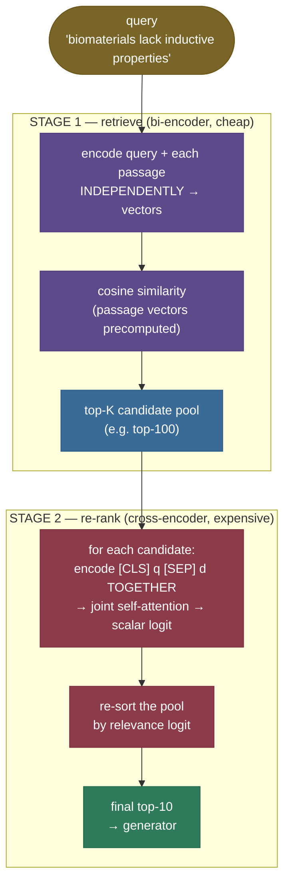

# Re-ranking with Cross-Encoders: cheap recall, then expensive precision

Your dense retriever just pulled its top candidates for a scientific claim — *"0-dimensional biomaterials lack inductive properties."* — and the abstract that actually supports it is *in* the results, but not on top: it's outranked by abstracts that share the vocabulary (biomaterials, induction, scaffolds) without addressing the specific claim. The bi-encoder did its job (the evidence is topically near), but it ranked by *overall similarity*, and on that axis the true evidence and a look-alike abstract sit almost on top of each other. The right passage is *in the haystack* — just not first.

This is the gap **re-ranking** fills, and this chapter measures it on a **real benchmark**. Everything below runs over **[BeIR/scifact](https://huggingface.co/datasets/BeIR/scifact)** — a real scientific-claim retrieval task with **5,183 real abstracts, 300 real test queries, and real human relevance judgments** — so every nDCG@10, MRR@10, Recall, and Precision is grounded in truth, not invented. Stage 1 is a real bi-encoder (`all-MiniLM-L6-v2`); stage 2 is a real cross-encoder (`cross-encoder/ms-marco-MiniLM-L-6-v2`). Every number on this page is produced by the [executed teaching notebook](code/06-Re-ranking-Cross-Encoders.ipynb) over that benchmark, mirroring the [runnable module `code/reranking.py`](code/reranking.py) step by step. No hand-made toy corpus, no faked scores.

The idea in one line: the bi-encoder (or BM25, or [hybrid](/ai-ml/ai-ml-learning-resources/llms-applications-and-agents/rag-and-knowledge-systems/hybrid-search/hybrid-search)) is a fast, coarse **first stage** — great at pulling the right *neighbourhood* of passages cheaply. A **cross-encoder** is a slow, precise **second stage** — it re-reads the top-K candidates, this time with the query and each passage fed through the model **together**, and re-sorts them by a far more accurate relevance score. Retrieve a wide net cheaply, then sharpen the top with an expensive model: cheap **recall**, then expensive **precision**. It's the highest-leverage precision upgrade you can bolt onto a RAG stack without touching your index — and we'll *measure* exactly how much it buys (real answer: on this strong first stage, **nDCG@10 0.648 → 0.687, MRR@10 0.607 → 0.656** — a real, if honest-sized, lift).

I'll build this the way I'd explain it to a teammate whose vector search keeps ranking the right passage *almost* first — starting from *why* the bi-encoder is structurally coarse, then the two-stage-funnel intuition, then the bi-encoder-vs-cross-encoder mechanism, the score and cost math **derived not dropped** (including ColBERT's MaxSim and MonoT5 — full math in Part 4 below), a real two-stage pipeline with the **nDCG/MRR lift measured over 300 real queries**, the traps that bite every real system, and where re-ranking is — and isn't — worth it. By the end you'll be able to:

- explain **why a bi-encoder can't model query↔document interaction** and a cross-encoder can;
- write the **cross-encoder scoring** path (`[CLS] q [SEP] d` → joint attention → scalar) and derive the **cost asymmetry** that forces two stages;
- define **nDCG@k** and **MRR** precisely, and reason about **Recall@k vs Recall@pool** (the real recall ceiling);
- build a two-stage retrieve-then-rerank pipeline over a real benchmark and *measure* the lift;
- place **ColBERT (MaxSim)** and **MonoT5** on the interaction/cost spectrum;
- avoid the killers: **latency** (K forward passes), the **recall ceiling** (rerank ≠ rescue), and treating the **uncalibrated logit** as a probability.

> **Note:** re-ranking is a *precision* upgrade, not a *recall* one. It **reorders the candidates the first stage already fetched** — it cannot conjure a passage retrieval missed. Get that one fact wrong and you'll "add a re-ranker" to a pipeline whose real problem is that the gold never made the candidate pool. We prove this limit in code below (Recall@100 is *identical* before and after) — internalize it now.

---

## The problem: independent encodings are coarse

To see why re-ranking exists, you have to feel what the first stage *structurally* cannot do.

A [bi-encoder](/ai-ml/ai-ml-learning-resources/llms-applications-and-agents/rag-and-knowledge-systems/embedding-models/embedding-models) — the dense retriever from chapter 3 — embeds the query and every passage **independently** into vectors, then ranks by cosine similarity. That independence is exactly what makes it fast: the passage vectors are precomputed once, offline, and at query time you embed only the query and take dot products. But it is also exactly why it's coarse: **the query never sees the passage.** Each is crushed to a single vector in isolation, so the model can never ask "does *this passage* answer *this specific query*?" — only "are these two summaries pointing the same general direction?"

We can *measure* the coarseness on the real benchmark. Over 300 scifact queries, the bi-encoder's **Recall@100 is 0.925** — the relevant abstract is in its top-100 pool 92.5% of the time. It finds the evidence. But its **nDCG@10 is only 0.648** and **MRR@10 is 0.607** — the evidence is often present yet ranked below look-alike abstracts. That gap between "found it" (high recall) and "ranked it first" (weaker nDCG/MRR) is the entire opening for re-ranking.

> **Note:** this is *not* a weak-embedder artifact. `all-MiniLM-L6-v2` is a strong, widely-used retriever — and its nDCG@10 of 0.648 still sits **≈0.35 below a perfect 1.0** (not all of which any re-ranker can recover — we'll see it claws back only ~0.038), because the limitation is **architectural**: independent encoding throws away query↔passage interaction *before* the comparison happens. No bigger bi-encoder removes it; only a model that reads the pair *together* can. That model is the cross-encoder.

---

## Intuition first: the résumé screen and the interview

Here is the mental model that holds up under questioning.

Hiring runs in two stages for a reason. First, a **keyword screen** scans thousands of résumés fast and cheap — does this résumé broadly match the role? It's lossy (good candidates with unusual phrasing slip; buzzword-stuffed ones pass) but it shrinks thousands to a shortlist in seconds. Then comes the **interview**: a human sits down with each shortlisted candidate and reads them *in the context of the actual job*, probing the fit no keyword scan could see. You'd never interview all thousand applicants (too slow), and you'd never hire straight off the keyword screen (too coarse). You **screen wide and cheap, then interview narrow and deep.**

Re-ranking is exactly that. The **bi-encoder is the keyword screen**: fast, precomputed, coarse — it turns the whole corpus into a shortlist (the top-K). The **cross-encoder is the interview**: it takes each shortlisted passage and reads it *together with the query*, with full attention between them, to judge true relevance. The funnel is the point — cheap recall, then expensive precision.

Push on the analogy — it survives, and where it bends, it teaches:

- **"Why not interview everyone — cross-encode the whole corpus?"** Same reason you don't interview a thousand people: cost. The cross-encoder runs a full transformer forward pass *per (query, passage) pair* at query time. We *measured* it: re-ranking 100 candidates takes ~1.1 seconds; cross-encoding all 5,183 passages would be ~57 seconds *per query*. You can only afford it on the shortlist. (This is the cost asymmetry we derive below.)
- **"Why not skip the screen and just interview the best few?"** Because the screen is what *produces* the shortlist — and its quality caps everything. If the keyword screen rejects your best candidate, no interview brings them back. **The re-ranker can only reorder who made the shortlist; a gold passage missed by retrieval is gone.** (The recall ceiling — the single most important caveat, which we prove: Recall@100 is identical before and after re-ranking.)
- **"What makes the interview better than the screen?"** The interview reads the candidate *in context* — the same résumé means different things for different roles. The cross-encoder reads each passage *conditioned on the query*: the specific claim's terms light up for the truly-supporting abstract in a way a topically-similar abstract doesn't, because query and passage tokens attend to each other.
- **"Is one cross-encoder score comparable across queries?"** No — it's an interview verdict for *this* candidate-and-job pairing, not an absolute grade. The score is an uncalibrated relevance logit; use it to *order* candidates for one query, not to compare across queries or threshold as a probability (a pitfall below).

The mapping to the mechanism is exact: **the keyword screen is the bi-encoder's independent encoding, the shortlist is the top-K candidate pool, and the interview is the cross-encoder reading query and passage jointly.** Hold that picture; everything below is the engineering that makes the interview accurate and the funnel affordable.

---

## The mechanism: bi-encoder retrieves, cross-encoder re-ranks

The two stages differ in *one* structural choice — whether the query and passage are encoded apart or together — and everything else (speed, precomputability, accuracy) follows from it.



**Stage 1 — bi-encoder retrieve (independent encoding).** Encode the query once; the passage vectors were already encoded offline. Rank by cosine. Cost at query time: one query encode + $N$ cheap dot products. Because the passage vectors don't depend on the query, they're **precomputed and indexed** ([ANN](/ai-ml/ai-ml-learning-resources/llms-applications-and-agents/rag-and-knowledge-systems/vector-search/vector-search)), which is why first-stage retrieval scales to millions of passages in milliseconds. In our code (`BiEncoderRetriever`) the passage matrix is embedded once and cached; `retrieve` takes the query vector, dots it against all passage vectors, and returns the **top-K** via numpy `argpartition` — an exact top-K in $O(N)$ without a full sort, and no faiss needed at this scale. The output is a **top-K candidate pool** — wide enough to (almost) always contain the gold, narrow enough to re-rank affordably.


**Stage 2 — cross-encoder re-rank (joint encoding).** For each of the $K$ candidates, concatenate the query and passage into one sequence `[CLS] query [SEP] passage` and run the transformer over the pair. Now **every query token can attend to every passage token and back** — the model directly measures whether *this* passage answers *this* query. A small head on the `[CLS]` representation emits a single **relevance logit**, and you re-sort the pool by it (`CrossEncoderReranker.rerank` scores every pair with `model.predict`, then `argsort`s the pool). Cost: $K$ full forward passes at query time, and — critically — the score *cannot be precomputed*, because it depends on the query.

![SCHEMATIC — Bi-encoder (left): two independent towers encode query and passage separately to vectors, compared by cosine — the passage vector is precomputed once, and the query and passage never interact. Cross-encoder (right): one joint tower over `[CLS] query [SEP] passage` with full self-attention between every query and passage token, emitting a single relevance logit — one forward pass per pair, nothing precomputable. Generated by `code/make_figures_06.py`.](../images/rag06_bi_vs_cross.png)

> **Note:** the dividing line is **where the comparison happens**. A bi-encoder compares *after* encoding (two finished vectors → cosine), so encoding is query-independent and cacheable. A cross-encoder compares *during* encoding (attention across the pair), so encoding is query-dependent and not cacheable. That single difference is the entire bi-vs-cross trade-off — accuracy vs precomputability — and the reason you use both, in stages. **[ColBERT](https://arxiv.org/abs/2004.12832)** and **MonoT5** are the clever middle grounds; we place them precisely in the math below.

---

## The math, part 1: the cross-encoder score

The cross-encoder is a transformer encoder with a scalar relevance head. For a (query $q$, passage $d$) pair, form the joint input sequence and score it:

$$\text{score}(q, d) \;=\; \mathbf{w}^\top\,\text{Encoder}\big(\texttt{[CLS]}\;q\;\texttt{[SEP]}\;d\big)_{\texttt{[CLS]}} \;+\; b \;\in\; \mathbb{R}$$

> **Source / derivation:** [Nogueira & Cho, *Passage Re-ranking with BERT* (2019), §3 (arXiv:1901.04085)](https://arxiv.org/abs/1901.04085) — feeds `[CLS] query [SEP] passage [SEP]` through BERT and puts a single linear layer on the `[CLS]` vector to produce a relevance score, trained with cross-entropy over relevant/non-relevant passages; the model behind every cross-encoder re-ranker.

Define every symbol: $\text{Encoder}(\cdot)$ is the transformer (here a 6-layer MiniLM); $\text{Encoder}(\dots)_{\texttt{[CLS]}}\in\mathbb{R}^{h}$ is the final-layer hidden state at the `[CLS]` position (a pooled representation of the *whole pair*, dimension $h$); $\mathbf{w}\in\mathbb{R}^{h}$ and $b\in\mathbb{R}$ are the learned head weights and bias; the output is a single real number. The magic is inside `Encoder`: self-attention runs over the **concatenated** sequence, so a query term and a matching passage term attend to each other directly. That cross-attention between the two halves is the signal a bi-encoder discards — and it's why the cross-encoder can tell *"supports this exact claim"* from *"is about the same topic."*

**Why cross-attention captures what the factorized dot-product cannot.** A bi-encoder computes $\text{sim}(q,d)=E(q)\cdot E(d)$ — the two encodings are formed *separately*, then combined by a single dot product. That factorization is a hard bottleneck: whatever $E(d)$ throws away about the passage while summarizing it to one vector is gone before the query is ever consulted. If a passage discusses biomaterials, induction, *and* three other topics, its one vector is a blur of all five; a query about the specific claim can't ask the passage "but do you address *induction in 0-D materials*?" — the dot product only sees the blurred summary. The cross-encoder never forms a query-independent passage vector at all: at layer 1, "induction" in the query already attends to "induction" in the passage, and by the final layer the `[CLS]` state encodes *the interaction*, not two summaries. The accuracy↔cost consequence is exact: joint attention is $O((n{+}m)^2)$ over the *combined* token sequence and must run per pair (not precomputable), whereas the factorized dot product is $O(hd)$ and precomputable. You buy interaction with cost.

**The output is an uncalibrated logit, not a probability.** It's trained to *rank* (relevant pairs score higher than non-relevant), so its magnitude is only meaningful *relative to other passages for the same query*. On the real benchmark, the cross-encoder scores genuinely-relevant abstracts far above the field — that separation (visualized below) is *why* re-ranking works — but a logit of +8 is not "supp 99% relevant." Don't threshold it as a probability or compare it across queries (a pitfall below); if you need a probability, apply a sigmoid only after calibration.

![REAL: the distribution of cross-encoder relevance logits for gold (relevant) vs non-gold candidates across 60 scifact queries. The gold candidates (green) sit far to the right of the non-relevant field (red) — the median gold logit is well above the median non-gold logit. That separation is exactly what lets re-sorting by the logit pull relevant abstracts toward the top (in aggregate — individual queries can still be mis-scored, the domain-mismatch pitfall below). Generated by `code/make_figures_06.py`.](../images/rag06_score_separation.png)

---

## The math, part 2: the cost asymmetry that forces two stages

Why not cross-encode the whole corpus and skip the bi-encoder? Because the two stages have fundamentally different cost structures. Let $N$ = corpus size, $K$ = re-rank pool size, $d$ = embedding dimension, $h$ = hidden size.

**Bi-encoder, query time:** one query encode (a single transformer forward pass) + $N$ dot products of length $d$. The $N$ passage encodes happened **offline, once**, and are cached. So query-time work is $\approx 1$ forward pass + $O(N\,d)$ cheap arithmetic — and the $O(Nd)$ part is what [ANN indexes](/ai-ml/ai-ml-learning-resources/llms-applications-and-agents/rag-and-knowledge-systems/vector-search/vector-search) cut to $O(\log N)$. Milliseconds over millions of passages — we *measured* **0.37 ms/query** on this corpus.

**Cross-encoder, query time:** $K$ transformer forward passes (one per candidate pair), and **zero** of them can be precomputed, because each score depends on the query. So the cost is $K \times (\text{one transformer forward pass})$ — orders of magnitude more per passage than a dot product. We *measured* **1102 ms** to re-rank $K=100$ candidates — about **11 ms per candidate**, and **~2,978× the retrieve cost**. (Wall-clock latency varies run-to-run and by machine — thermal, scheduling, warm vs cold caches — so expect roughly **8–11 ms/candidate** on this class of hardware; the figures here are the full-run median. The *ratio* — rerank ≫ retrieve — is what's invariant, not the exact milliseconds.)

$$\underbrace{\text{bi-encoder} \approx 1\ \text{encode} + O(N d)\ \text{compare}}_{\text{precompute } N,\ \text{cheap at query time (0.37 ms)}} \qquad\text{vs}\qquad \underbrace{\text{cross-encoder} = K\ \text{forward passes}}_{\text{nothing precomputable, } O(K)\ \text{transformer runs (11 ms each)}}$$

> **Source / derivation:** [Reimers & Gurevych, *Sentence-BERT* (2019), §1–§2 (arXiv:1908.10084)](https://arxiv.org/abs/1908.10084) — quantifies exactly this: BERT cross-encoders are accurate but require a forward pass per pair (their example: finding the most similar pair in 10,000 sentences needs ~50M inferences / ~65 hours), which is *why* they introduce the bi-encoder (SBERT) for retrieval and reserve the cross-encoder for re-ranking a shortlist.

The consequence is the whole architecture: run the cross-encoder only on a **small** $K$. Extrapolating our measured per-candidate cost, cross-encoding all 5,183 passages would take **~57 seconds per query** — a non-starter. Set $K$ too large and re-ranking dominates your latency; set it too small and the gold falls outside the pool (the recall ceiling). The practical sweet spot is $K \approx$ 50–100 — wide enough to catch the gold, small enough that $K$ forward passes stay within budget.


---

## The math, part 3: measuring the lift — nDCG@k and MRR (and the Recall ceiling)

To *prove* re-ranking helps you need ranking-quality metrics, not eyeballing. On a labelled benchmark each query has a **gold set** — the human-judged relevant passages (scifact averages ~1.13 per query). The metrics score a ranking against that gold set.

**MRR — Mean Reciprocal Rank.** The reciprocal of the rank of the *first* relevant hit, averaged over queries:

$$\text{MRR@}k \;=\; \frac{1}{|Q|}\sum_{q\in Q}\frac{1}{\text{rank}_q}, \qquad \text{RR} = \frac{1}{\text{rank of the first relevant doc in the top-}k}\ (0 \text{ if none}).$$

> **Source / derivation:** [Voorhees, *The TREC-8 Question Answering Track Report* (1999)](https://trec.nist.gov/pubs/trec8/papers/qa_report.pdf) — the QA-track evaluation that introduced **mean reciprocal rank**, averaging $1/\text{rank}$ of the first correct answer over a query set; the origin of the MRR used here. (Manning, Raghavan & Schütze, *Introduction to Information Retrieval*, [Ch. 8 "Evaluation in information retrieval"](https://nlp.stanford.edu/IR-book/html/htmledition/evaluation-in-information-retrieval-1.html), is the standard textbook treatment — in the references.)

First relevant hit at #1 → RR = 1; at #2 → 0.5; at #4 → 0.25; absent from the top-$k$ → 0. Simple and rank-focused; it captures "how high is the *first* right answer."

**nDCG@k — normalized Discounted Cumulative Gain at cutoff $k$.** First the **DCG**: sum each retrieved item's relevance, discounted by a log of its rank:

$$\text{DCG@}k \;=\; \sum_{i=1}^{k}\frac{\text{rel}_i}{\log_2(i+1)},$$

> **Source / derivation:** [Järvelin & Kekäläinen, *Cumulated Gain-based Evaluation of IR Techniques* (ACM TOIS 2002)](https://dl.acm.org/doi/10.1145/582415.582418) — introduces DCG and its normalization nDCG, with the $\log_2(i+1)$ rank discount that rewards placing relevant documents higher; the standard ranking metric used to evaluate re-rankers.

where $\text{rel}_i$ is the relevance of the item at rank $i$ (binary here: 1 for a gold doc, 0 otherwise) and $\log_2(i+1)$ is the **rank discount** — a document deeper in the list contributes less, which is exactly what makes ranking a relevant doc *higher* score better. A relevant doc at rank 1 contributes $1/\log_2 2 = 1$; at rank 4, only $1/\log_2 5 = 0.43$. Then **normalize** by the ideal DCG (the best possible ordering — all gold docs on top):

$$\text{nDCG@}k \;=\; \frac{\text{DCG@}k}{\text{IDCG@}k} \;\in\; [0, 1], \qquad \text{IDCG@}k = \sum_{i=1}^{\min(|\text{gold}|,\,k)}\frac{1}{\log_2(i+1)}.$$

Dividing by IDCG makes the metric comparable across queries with different numbers of relevant docs. The notebook prints the discount table (Step 5) so the metric isn't a black box.

**Recall@k and the ceiling — the subtle, important part.** **Recall@k** is the fraction of the gold set present in the top-$k$; **Precision@k** is the fraction of the top-$k$ that's relevant. Re-ranking affects these in a way worth getting *exactly* right:

- **Recall@10 rises** with re-ranking — because re-ranking promotes gold that was in the pool but *below* rank 10 *up into* the top-10. We measured **0.788 → 0.809**.
- **Recall@K over the whole retrieved pool is invariant** — re-ranking shuffles the *same* $K$ documents, so it can never change *which* $K$ they are. We measured **Recall@100 = 0.925 → 0.925, exactly unchanged.** That pool recall is the **true ceiling**: no re-ranker can exceed it, because the gold has to be *in the pool* to be re-ranked. If Recall@K is low, the fix is a wider pool or a better retriever, never a better re-ranker.

This is the recall ceiling stated precisely — and it's why the code *asserts* `Recall@100` is identical before and after, so the claim can't drift from the computation.

---

## Worked example: a two-stage pipeline you can read end to end

Let's build retrieve-then-rerank over the real benchmark and **measure** the lift. The runnable module is [`code/reranking.py`](code/reranking.py); the corpus embeddings are cached to `data/` so we embed once. Every number below comes from the [executed notebook](code/06-Re-ranking-Cross-Encoders.ipynb) over all 300 real queries — nothing is hand-typed. I walk through *what each piece of code does and why*, so nothing in the implementation is left unexplained.

> **Why no faiss here.** First-stage top-K is exact cosine via numpy `argpartition` — fine at 5,183 passages, and it sidesteps the `torch`+`faiss` OpenMP conflict entirely (both link `libomp`; co-loading crashes on macOS). The models run device-agnostically (cuda → mps → cpu, detected and printed); this page's numbers are from an `mps` run. Inference is deterministic (dropout off, no sampling), so ranks and metrics reproduce exactly; wall-clock latency varies and is reported as a median.

**Load the real benchmark and build stage 1.** `load_scifact()` reads the corpus, queries, and qrels and aligns them into index-based **gold sets** (`gold[i]` = the relevant doc indices for query `i`). `BiEncoderRetriever` embeds every passage once (cached), embeds the queries, and `retrieve` returns the top-K by exact cosine:

```python
from reranking import load_scifact, BiEncoderRetriever, RETRIEVE_K
data = load_scifact()                       # 5,183 passages, 300 queries, human relevance labels
bi = BiEncoderRetriever(data)               # embeds + caches the corpus; unit-norm rows
pool = bi.retrieve(query_index=0, k=RETRIEVE_K)   # top-100 by cosine — the candidate pool
```

Because the passage vectors are unit-norm, cosine is a plain dot product; `argpartition` finds the top-100 in $O(N)$ without sorting all 5,183. That pool is where the relevant abstract lives 92.5% of the time — but often not at the very top.

**Score the pool jointly with the cross-encoder, then re-sort.** `CrossEncoderReranker.scores` runs one joint forward pass per (query, passage) pair; `rerank` sorts the pool by the logit:

```python
from reranking import CrossEncoderReranker
cross = CrossEncoderReranker()
logits = cross.scores(data.query_texts[0], [data.doc_texts[i] for i in pool])  # one logit per pair
reranked = cross.rerank(data.query_texts[0], pool, data.doc_texts)             # pool, re-ordered
```

The gold abstracts score far above the non-relevant field (the score-separation figure above), so re-sorting pulls them up.

**Measure the aggregate lift over all 300 queries (`evaluate`).** This is the headline. For every query, retrieve top-100, re-rank, and average the metrics before vs after:

```
metric        | bi-encoder | reranked | delta
----------------------------------------------
nDCG@10       |     0.648  |   0.687  | +0.038
MRR@10        |     0.607  |   0.656  | +0.049
Recall@10     |     0.788  |   0.809  | +0.021
Precision@10  |     0.089  |   0.091  | +0.002
Recall@100    |     0.925  |   0.925  | +0.000   ← the pool ceiling: INVARIANT
```

Read it as the whole story of re-ranking. **nDCG@10 rises 0.648 → 0.687** and **MRR@10 rises 0.607 → 0.656** — the reranker reorders relevant abstracts toward the top. **Recall@10 rises** too (0.788 → 0.809) because gold from ranks 11–100 gets promoted into the top-10. But **Recall@100 is exactly unchanged (0.925)** — re-ranking reorders the same 100 docs, it cannot add what retrieval missed. That flat pool-recall number *is* the recall ceiling, measured. (The lift here is real but modest because `all-MiniLM-L6-v2` is already a strong first stage — an honest and important lesson: a re-ranker is a *measurable* precision upgrade you verify on your own data, not free magic.)


**Watch a real win (`hero_query`).** Averages hide the wins, so the code finds — by measurement, not hand-picking — the query the reranker helps *most* (biggest MRR gain): a genuinely relevant abstract the bi-encoder buried, pulled toward the top by joint scoring. The rank-shuffle figure shows that one real query's before/after:


**How deep should you re-rank? (`sweep_rerank_depth`).** Re-ranking deeper costs more forward passes. We sweep $K$ = how many top candidates to re-rank (leaving the tail in first-stage order — exactly what a latency-bound system does) and measure nDCG@10:

```
 K   | bi-only nDCG@10 | reranked nDCG@10
------------------------------------------
 1   |      0.648      |      0.648
 5   |      0.648      |      0.689
 10  |      0.648      |      0.682
 20  |      0.648      |      0.689
 50  |      0.648      |      0.688
 100 |      0.648      |      0.687
```

The knee is **early**: re-ranking just the **top-5** already captures essentially all the lift (0.689), and going deeper adds cost for no gain (it even dips slightly as deeper distractors occasionally get promoted). That shape — most of the benefit from a shallow pool — is why real systems re-rank ~50–100 for a safety margin on recall, not thousands.


**The library one-line version.** The code above *is* the library — this is exactly how you use sentence-transformers in the real world:

```python
from sentence_transformers import CrossEncoder
ce = CrossEncoder("cross-encoder/ms-marco-MiniLM-L-6-v2")
scores = ce.predict([(query, passage) for passage in candidate_passages])  # one logit per pair
reranked = [c for _, c in sorted(zip(scores, candidates), reverse=True)]
```

---

## The math, part 4: the middle grounds — ColBERT (MaxSim) and MonoT5

Bi-encoder and cross-encoder are the two extremes: compare *after* encoding (one vector each, maximally cacheable, minimally expressive) or *during* encoding (full cross-attention, maximally expressive, not cacheable). Two influential models sit deliberately between them, and knowing them lets you reason about the whole design space.

**ColBERT — late interaction via MaxSim.** Instead of crushing a passage to one vector, ColBERT keeps a vector *per token*. A query with $n$ tokens becomes $\{\mathbf q_1,\dots,\mathbf q_n\}$ and a passage with $m$ tokens becomes $\{\mathbf d_1,\dots,\mathbf d_m\}$ (all contextualized by BERT, then projected small). Relevance is the **MaxSim** score:

$$
\text{score}(q,d) \;=\; \sum_{i=1}^{n}\ \max_{j=1,\dots,m}\ \mathbf q_i \cdot \mathbf d_j .
$$

> **Source / derivation:** [Khattab & Zaharia, *ColBERT: Efficient Passage Search via Contextualized Late Interaction over BERT* (SIGIR 2020, arXiv:2004.12832)](https://arxiv.org/abs/2004.12832) — §3 defines the MaxSim late-interaction score over per-token embeddings; the precomputable middle ground between bi- and cross-encoders.

Read it literally: for each *query* token, find the single passage token it matches best (the inner $\max$), then sum those best-matches over all query tokens (the outer sum). It is "soft, per-token term matching" — a query term can align to a matching (or synonymous) passage term even if the rest of the passage is about something else, a signal a single-vector bi-encoder blurs away. Crucially the passage token vectors **depend only on the passage**, so they are *precomputed and indexed* exactly like bi-encoder vectors; only the cheap MaxSim runs at query time. That is why ColBERT is called *late interaction*: the interaction (the max over token pairs) happens late, after independent encoding — so it keeps most of the bi-encoder's precomputability while recovering much of the cross-encoder's token-level precision. The cost is storage — $m$ vectors per passage instead of 1.

**MonoT5 — relevance as generation.** A different route: instead of a classification head, use a sequence-to-sequence model (T5). Feed it the templated string `Query: {q} Document: {d} Relevant:` and read the model's probability of generating the token **"true"** versus **"false"**. The relevance score is the softmax over just those two output logits:

$$
\text{score}(q,d) \;=\; \frac{\exp(z_{\text{true}})}{\exp(z_{\text{true}}) + \exp(z_{\text{false}})},
$$

> **Source / derivation:** [Nogueira, Jiang, Pradeep & Lin, *Document Ranking with a Pretrained Sequence-to-Sequence Model* (Findings of EMNLP 2020, arXiv:2003.06713)](https://arxiv.org/abs/2003.06713) — casts re-ranking as generating "true"/"false" for a (query, passage) pair and takes the softmax over those two tokens as the relevance score; the seq2seq alternative to the encoder cross-encoder.

where $z_{\text{true}}, z_{\text{false}}$ are T5's output logits for the "true"/"false" tokens at the first decoding step. Like the encoder cross-encoder, MonoT5 reads query and passage *together* with full attention (so it's a joint scorer — one forward pass per pair, not precomputable), but it frames relevance as a *generation* decision, which lets it inherit T5's pretraining and often generalize better across domains. It is a cross-encoder in cost, a generator in form.

Where they sit on the interaction/cost spectrum: **bi-encoder** (no interaction, fully cacheable) → **ColBERT** (late per-token interaction, mostly cacheable) → **cross-encoder / MonoT5** (full joint interaction, not cacheable). More interaction buys precision; less interaction buys precomputability. Re-ranking is where you spend a little of the former on the shortlist the latter produced.

---

## Pitfalls and failure modes

Re-ranking fails in characteristic ways. Name them so you catch them in the wild.

**1. The recall ceiling (the #1 trap).** A re-ranker can only reorder the candidates retrieval fetched. A gold missed by the first stage is unrecoverable.

- *Failing:* retrieve top-5, then "add a re-ranker" to fix precision — but if the gold sat at retrieval-rank 20, it's never in the pool; the re-ranker shuffles five wrong passages. We *measured* the ceiling: **Recall@100 = 0.925 before and after** re-ranking — identical, because re-ranking reorders the same 100 docs.
- *Fix:* retrieve a **wide pool** (50–100) so the gold is almost always present, *then* re-rank. Tune the pool by measuring **Recall@K of the first stage** — re-ranking can't raise it.

**2. Latency from too-large a pool.** The cross-encoder runs $K$ forward passes; cost is linear in $K$ (~11 ms/candidate measured here).

- *Failing:* re-ranking the top-1000 "to be safe" adds a thousand transformer forward passes to every query — ~11 seconds here — usually far worse than the gain (which, per the K-sweep, plateaus by $K\approx5$–10).
- *Fix:* keep $K$ small (the sweep shows the knee is early); if you need a deeper pool, use a **cheaper re-ranker** (a smaller cross-encoder, or ColBERT-style late interaction) or batch the pairs on a GPU.

**3. Cross-encoding the whole corpus.** Tempting because cross-encoders are more accurate — but their scores can't be precomputed or indexed.

- *Failing:* replacing the bi-encoder with a cross-encoder over the corpus; query latency explodes from **0.37 ms to ~57 s** (one forward pass per passage, every query — extrapolated from our measured per-candidate cost).
- *Fix:* **never** run a cross-encoder as the first stage. Bi-encoder/BM25/hybrid retrieves; cross-encoder re-ranks the shortlist only.

**4. Treating the logit as a probability.** The score is an uncalibrated relevance logit, meaningful only *relative to other passages for the same query*.

- *Failing:* thresholding "keep passages with score > 0.5" as if it were a probability, or comparing scores across different queries to decide which query "retrieved better." The gold-vs-non-gold separation is real and large, but the raw logit is not a probability and not comparable across queries.
- *Fix:* use the score only to **order** candidates within one query. If you need an absolute keep/drop threshold or a probability, **calibrate** first (fit a sigmoid/isotonic mapping on labeled data).

**5. Domain / model mismatch.** A re-ranker trained on web QA (MS MARCO) may not transfer to your domain — and scifact is a fair example: it's *scientific* claim verification, not web search.

- *Failing:* an `ms-marco`-trained cross-encoder on dense legal or biomedical text can underperform, sometimes *below* the first stage, because its notion of relevance doesn't match the domain. (On scifact it still helps — +0.038 nDCG — but the modest size is partly this domain gap.)
- *Fix:* evaluate the re-ranker on *your* data (nDCG/MRR on a labeled set) before trusting it; consider a domain-matched re-ranker (e.g. a BGE reranker) or fine-tuning on in-domain pairs. A re-ranker is not automatically an improvement — *measure it*, exactly as we did here.

> **Gotcha:** notice the through-line — most re-ranking failures are about **the boundary with the first stage** (recall ceiling, pool size, never-cross-encode-everything) or **misreading the score** (logit ≠ probability). The cross-encoder itself rarely misbehaves; the *system* around it does. Suspect the pool and the score semantics first.

---

## Where it matters, and where it doesn't

**The one problem re-ranking solves:** first-stage retrieval gets the right *neighbourhood* but not the right *order* — the gold is in the top-K but not on top, because independent encoding can't model query↔passage interaction. A cross-encoder re-reads the shortlist with full attention and fixes the order. It's the highest-precision-per-effort upgrade in a RAG stack: drop it in *after* retrieval, no change to your index or embeddings.

**Which layer it lives at.** Re-ranking sits at the **retrieval layer, between the first-stage retriever and the generator** — it consumes the candidate pool and emits a re-ordered top-few. It's model-agnostic on both sides: any retriever (bi-encoder, BM25, hybrid) feeds it, and the re-ranked top goes to any LLM.

**The core tradeoff:** re-ranking buys precision at the cost of **$K$ transformer forward passes of query-time latency** (~11 ms each here) and a model that can't be precomputed or indexed. You trade "fast and coarse" for "fast-enough and sharp," and you accept a tuning surface (pool size $K$) and a hard ceiling (it can't fix recall).

**When re-ranking is the answer:**
- **The gold is in your top-K but not your top-few** — measure it: if **Recall@K is high but nDCG@10 is lower** (our exact situation: 0.925 vs 0.648), re-ranking is precisely the fix.
- **Precision-critical RAG** — when the generator gets only 3–5 passages and the *order* matters (lost-in-the-middle), getting the best passage to #1 is worth a cross-encoder pass.
- **Heterogeneous or noisy first-stage results** — hybrid/BM25 pools with mixed-quality candidates benefit most from a precise re-sort.

**When re-ranking is NOT worth it:**
- **Your first stage already nails the top-few** — if nDCG@3 is already high, a re-ranker adds latency for little gain. Measure before adding — the scifact lift is real but modest precisely because the first stage is strong.
- **The gold is missed by retrieval entirely** — re-ranking can't rescue it; fix recall first (better embeddings, hybrid, wider pool).
- **Hard latency budgets with no GPU** — $K$ CPU forward passes may blow your latency SLA; consider a smaller cross-encoder or skip it.

---

## In production

Re-ranking is a standard final stage in real-world retrieval, with a few well-trodden choices:

- **Open cross-encoders** — `cross-encoder/ms-marco-MiniLM-L-6-v2` (the one used here; small and fast, trained on MS MARCO passage ranking) and larger MiniLM/`electra` variants. The default open re-ranker for English QA.
- **BGE rerankers** — `BAAI/bge-reranker-base` and `bge-reranker-large` (and the v2-m3 multilingual line): strong open cross-encoders that frequently top the bi-encoder-then-rerank pipelines on retrieval benchmarks. The common open upgrade over `ms-marco-MiniLM`, and a good bet when your domain differs from web QA.
- **Cohere Rerank** — a hosted re-rank endpoint (`rerank-english-v3.0` / multilingual): you send the query and candidate passages, it returns relevance scores — a cross-encoder you don't host. The default managed option.
- **ColBERT / late interaction** — the middle ground (derived above): per-token passage embeddings are **precomputed**, and relevance is a late **MaxSim** over token similarities — more interaction than a bi-encoder, far cheaper than a full cross-encoder, so it can re-rank (or even retrieve) deeper pools. **MonoT5** is the seq2seq alternative when cross-domain generalization matters.

**The typical pipeline:** retrieve **top 50–100** with a bi-encoder / BM25 / hybrid, **re-rank** that pool with a cross-encoder, hand the **top 3–5** to the generator. Latency budget: the re-rank adds $K$ forward passes (~11 ms each on `mps` here; tens of ms on GPU for a small cross-encoder; more on CPU), which is why pool size is the knob you tune against your SLA — and, per the K-sweep, you rarely need it deep.

**When to reach for it:** the moment you measure high **Recall@K** but weak **nDCG@10** — your retriever finds the answer but ranks it poorly (scifact: 0.925 vs 0.648). Re-ranking is cheap to add (no index change), model-agnostic, and the lift is measurable on a labeled query set. The frontier — covered next — attacks the *other* end: [query transformation](/ai-ml/ai-ml-learning-resources/llms-applications-and-agents/rag-and-knowledge-systems/query-transformation/query-transformation) rewrites the query so the first stage retrieves a better pool in the first place (which raises the ceiling re-ranking is bounded by).

> **Note:** the through-line of this domain completes its first arc here. [Chapter 3](/ai-ml/ai-ml-learning-resources/llms-applications-and-agents/rag-and-knowledge-systems/embedding-models/embedding-models) built the dense lens; [chapter 4](/ai-ml/ai-ml-learning-resources/llms-applications-and-agents/rag-and-knowledge-systems/vector-search/vector-search) made it fast; [chapter 5](/ai-ml/ai-ml-learning-resources/llms-applications-and-agents/rag-and-knowledge-systems/hybrid-search/hybrid-search) fused it with lexical search; **this chapter added the precise second stage that re-orders whatever they retrieved.** Retrieve broadly and cheaply, then re-rank narrowly and precisely — that two-stage funnel is the backbone of every strong RAG retrieval pipeline.

---

## Recap and rapid-fire

**If you remember nothing else:** a bi-encoder encodes query and passage **independently** (fast, precomputable, coarse — it can't model their interaction), so the gold often lands in the top-K but not on top (on scifact, Recall@100 0.925 yet nDCG@10 only 0.648). A **cross-encoder** encodes them **together** (`[CLS] q [SEP] d` → joint attention → scalar logit), far more accurate but one forward pass per pair (~11 ms), so you run it only on the first stage's top-K. Retrieve wide and cheap, re-rank narrow and precise; measure the lift with **nDCG@k** (DCG = Σ relᵢ/log₂(i+1), normalized) and **MRR** — here **nDCG@10 0.648 → 0.687, MRR@10 0.607 → 0.656**. Re-ranking **reorders the pool**: it raises nDCG/MRR (and even Recall@10, by promoting in-pool gold), but **Recall@K over the whole pool is invariant** — it cannot rescue a gold retrieval missed (the recall ceiling). **ColBERT (MaxSim)** and **MonoT5** are the middle grounds between bi- and cross-encoders.

**Quick-fire — say these out loud:**

- *Bi-encoder vs cross-encoder?* Bi encodes query and passage separately → cosine (precomputable, fast, first-stage); cross encodes them together → scalar (accurate, slow, rerank-only).
- *Why not cross-encode the whole corpus?* One forward pass per (query, passage) pair, not precomputable — ~57 s/query over 5k passages here. Infeasible at corpus scale.
- *Write the cross-encoder score.* $\text{score} = \mathbf{w}^\top\text{Encoder}(\texttt{[CLS]}\,q\,\texttt{[SEP]}\,d)_{\texttt{[CLS]}} + b$ — a scalar relevance logit.
- *What's the recall ceiling?* Re-ranking reorders the retrieved pool; **Recall@K over the pool is unchanged** (measured 0.925 → 0.925). A gold missed by retrieval is unrecoverable — fix recall first.
- *Does re-ranking change Recall@10?* Yes, it can *rise* — gold from ranks 11–K gets promoted into the top-10. It's Recall@K over the *whole pool* that's invariant.
- *Define nDCG@k.* $\text{DCG@}k=\sum_{i\le k}\text{rel}_i/\log_2(i+1)$, divided by the ideal DCG → $[0,1]$; rewards ranking relevant docs higher.
- *Is the cross-encoder score a probability?* No — an uncalibrated logit, meaningful only relative to other passages for the same query. Calibrate before thresholding.
- *Typical pipeline?* Retrieve top 50–100 (bi/BM25/hybrid) → cross-encoder rerank → top 3–5 to the generator.
- *ColBERT vs MonoT5?* ColBERT = precomputed per-token vectors + late MaxSim ($\sum_i\max_j \mathbf q_i\cdot\mathbf d_j$), mostly cacheable; MonoT5 = joint seq2seq scorer, relevance = softmax over "true"/"false", cross-encoder-cost.
- *How deep should you re-rank?* Measure the quality-vs-K curve — the knee is early (here ~K=5); re-rank ~50–100 for a recall margin, not thousands.

---

## References and further reading

The curated link library for this topic — videos, courses, articles, papers, books, and internal cross-links — lives in a companion file so it can be reused as a standalone reference list:

**→ [Re-ranking with Cross-Encoders — references and further reading](reranking.references.md)**
