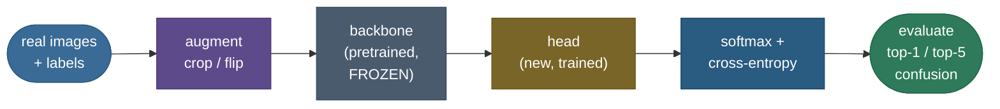
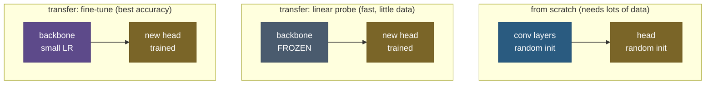

# Image classification: the applied workflow that reuses what a big model already knows

Show a person one photo of a hedgehog and they can pick hedgehogs out of a crowd forever. Ask a neural network to do the same from scratch and it wants **millions** of labeled examples. That gap is the whole story of applied image classification. The task itself is deceptively simple — *assign a whole image to one of $K$ categories* — but three things make the naive attack (feed raw pixels to a fresh classifier and train from zero) fail in the real world: a single 224×224×3 image is **150,528** raw numbers, so the input space is astronomically high-dimensional; the *same* object drifts across lighting, pose, scale, and background, so pixel-space distance is nearly meaningless; and you almost never have the millions of labeled images a from-scratch model needs to average all that variation away.

The move that dominates real vision work answers all three at once: **don't learn from pixels, learn from features — and don't even learn the features yourself, reuse the ones a big model already learned.** A network pretrained on a huge dataset (ImageNet's 1.2M images) has already discovered a general visual vocabulary — edges, textures, parts — in its early layers. **Transfer learning** grafts a small new classifier onto that frozen vocabulary and trains only the graft. On a small CIFAR-10 subset we *measure* the payoff below: a frozen pretrained backbone plus a single linear layer hits **80.0%** top-1 accuracy, while a from-scratch CNN of comparable size, given the *same* 3,000 labeled images, manages only **43.5%** — a **+36.5-point** gap from reuse alone.

This page is the applied classification **workflow**, deliberately distinct from the [CNN *mechanism*](/ai-ml/ai-ml-learning-resources/deep-learning/neural-architectures/cnns-and-convolution/cnns-and-convolution) (we *use* a CNN here; we don't re-derive convolution). Everything is produced by a **real, runnable** pipeline — real CIFAR-10 images, a real pretrained ResNet-18, real measured accuracy, every metric cross-checked against `scikit-learn`. By the end you'll be able to:

- state *exactly why* training from raw pixels is hard, with the dimensionality and data-scarcity arithmetic;
- describe the classification **pipeline** end to end — data → augmentation → backbone → head → loss → evaluation;
- recap **softmax + cross-entropy** and define **top-1 / top-5 accuracy** precisely (deeper math in [Foundations 23](/ai-ml/ai-ml-learning-resources/foundations/mathematical-foundations/cross-entropy-and-kl-divergence/cross-entropy-and-kl-divergence));
- explain **transfer learning** — freeze vs fine-tune — and *why* low-level features are reusable (Yosinski et al.);
- explain **data augmentation** as label-preserving regularization, and *measure* its effect on the overfitting gap;
- read a **confusion matrix** and **per-class accuracy**, and say precisely when a single accuracy number lies;
- run the whole thing yourself and get the same numbers.

Pictures and intuition first, then the method (with sources), then the runnable, measured code.

> **Note:** this page is the *workflow*. For the convolution operation itself — filters, weight sharing, receptive fields, the LeNet→ResNet lineage — see the sibling [CNNs & Convolution](/ai-ml/ai-ml-learning-resources/deep-learning/neural-architectures/cnns-and-convolution/cnns-and-convolution). For the two moves that carry this chapter, see [Transfer Learning for Vision](/ai-ml/ai-ml-learning-resources/modalities-and-generative-models/computer-vision/transfer-learning-for-vision/transfer-learning-for-vision) and [Data Augmentation](/ai-ml/ai-ml-learning-resources/modalities-and-generative-models/computer-vision/data-augmentation/data-augmentation). We point to them rather than repeat them.

---

## The problem: raw pixels are the wrong representation, and labels are scarce

To feel why the applied workflow looks the way it does, feel the naive approach fail. Take a CIFAR-10 image — a real 32×32×3 photo, so **3,072** numbers; a standard 224×224×3 input is **150,528**. Two things go wrong immediately.

**Pixel space is not semantic space.** In raw-pixel coordinates, a white cat on a black couch and a black cat on a white couch are *farther apart* than two completely different objects photographed on the same background. Shift every pixel one step to the right — a change no human would even notice — and the pixel vector moves enormously. A nearest-neighbor classifier on raw pixels (the honest baseline in every intro course) gets ~35–40% on CIFAR-10 and collapses entirely on real-resolution images, because "close in pixels" almost never means "same category." The information you want (is there a cat?) is tangled up in a representation dominated by information you don't (exact lighting, position, background).

**Labels are the expensive part.** The obvious fix — learn a better representation with a deep network — runs straight into data scarcity. A network with millions of parameters trained from random initialization needs enough labeled images to pin all those parameters down; with only a few hundred per class it *memorizes* the training set and generalizes poorly. And labels cost money and time: ImageNet took years and a crowd of annotators to build. In practice you have a *small* labeled dataset and need a model that generalizes from it anyway.

So the applied workflow needs two things the naive approach lacks: a way to turn pixels into a **semantic feature representation** without learning it from scratch, and a way to **squeeze more generalization out of few labels**. Transfer learning supplies the first; augmentation supplies the second. Everything below is those two ideas plus the plumbing to train and evaluate honestly.

> **Tip:** the interview one-liner for "why is image classification hard?" — *"raw pixels are high-dimensional and semantically meaningless (a one-pixel shift moves the vector enormously), and the labeled data to learn a good representation from scratch is scarce and expensive."* Transfer learning and augmentation are the two standard answers to those two problems.

---

## Intuition first: learn features, then *reuse* them

Picture two chefs. The first has never cooked; to make one dish she must learn knife skills, heat, seasoning, and the recipe all at once — and she needs to cook it a thousand times to get it right. The second is a trained cook who already has knife skills and palate; handed a new recipe, he needs only a few tries, because the *general* skills transfer and only the *specific* recipe is new. **A from-scratch network is the first chef; a pretrained backbone is the second.** The general visual skills — detecting edges, corners, textures, object parts — are the same for almost every vision task, so a model that learned them on ImageNet brings them to *your* task for free. You only teach it the new "recipe": which combinations of those features mean *your* classes.

Now make the parallel exact. A trained image classifier is really two pieces stacked: a **backbone** that maps an image to a compact feature vector (for ResNet-18, 512 numbers summarizing the whole image), and a **head** — a single linear layer — that maps that vector to class scores. The insight from years of vision research is that the **backbone is largely task-agnostic**: its early layers learn generic edge and texture detectors, its middle layers learn parts, and only the very top is specialized to the pretraining classes. So you can **freeze** the backbone, throw away its old head, bolt on a fresh head for your classes, and train *only the head*. This is a **linear probe**, the fastest and often startlingly strong form of transfer learning — and the reason it works is that the frozen 512-D features are already so good that your classes are nearly *linearly separable* in that space.

The intuition to hold onto: **classification difficulty lives in the representation, not the classifier.** In raw-pixel space the classes are hopelessly tangled and no linear boundary separates them. In the pretrained backbone's feature space the *same* classes fall into neat clumps a single linear layer can carve apart. Transfer learning is the act of borrowing that good space instead of paying to build your own.

The second idea, **augmentation**, is a different kind of cheat: if labels are scarce, *manufacture* more training views that you know keep the label. A cat photographed, then flipped left-to-right, is still a cat; cropped slightly, still a cat; shifted a few pixels, still a cat. Each transform is **label-preserving**, so it hands the network free extra examples of the invariances you *want* it to learn (a cat is a cat regardless of horizontal flip or small shift). The network can no longer memorize exact pixels — they change every epoch — so it is pushed toward features that survive the transforms. That is regularization, and we measure it below.


> **Note:** the two intuitions compose. Transfer learning fixes the *representation* problem (borrow a good feature space); augmentation fixes the *data* problem (manufacture label-preserving variety). In a real project you almost always use both: start from a pretrained backbone, and augment whatever small labeled set you have. The rest of this page is those two ideas, made precise and measured.

---

## The pipeline: how the pieces fit

Before the method, the shape of the whole thing. An image-classification system is a fixed sequence of stages, and every applied project — from a Kaggle notebook to a real-world deployed service — is some configuration of exactly these:



- **Data** — real labeled images, split into train / validation / test with strict discipline (no image and no near-duplicate crosses the split boundary — see [Data Leakage](/ai-ml/ai-ml-learning-resources/foundations/data-preparation/data-leakage/data-leakage)).
- **Augment** — apply label-preserving transforms to the *training* stream only (never to validation/test), so the model sees fresh variety each epoch.
- **Backbone** — a pretrained feature extractor. Freeze it (linear probe) or fine-tune it with a small learning rate. This is where transfer learning lives.
- **Head** — a small, fresh classifier (usually one linear layer) mapping features to your $K$ class scores (**logits**).
- **Loss** — **softmax** turns logits into class probabilities; **cross-entropy** scores them against the true label and provides the gradient that trains the head (and, if fine-tuning, the backbone).
- **Evaluate** — never trust training accuracy. Measure **top-1 / top-5** on held-out test data, then look *inside* the number with a **confusion matrix** and **per-class accuracy**.

The stages are the same whether you train from scratch or transfer; the only difference is whether the backbone starts random and updates fully, or starts pretrained and is frozen / gently fine-tuned. That single switch is worth the +36.5 points we measure.

---

## The method

### Softmax and cross-entropy (recap)

The head emits one **logit** $z_k$ per class — an unnormalized score. **Softmax** turns the logit vector into a probability distribution, and **cross-entropy** measures how much probability mass landed on the *true* class $y$:

$$\mathrm{softmax}(z)_k = \frac{e^{z_k - m}}{\sum_{j} e^{z_j - m}}, \quad m = \max_j z_j; \qquad \mathcal{L} = -\frac{1}{N}\sum_{i=1}^{N} \log \mathrm{softmax}(z_i)[\,y_i\,].$$

Two things to read off. First, softmax is shift-invariant: subtracting the row-max $m$ before exponentiating changes nothing mathematically (the $e^{-m}$ cancels top and bottom) but stops $e^{z}$ from overflowing — the one numerical-stability trick that matters, and the reason libraries fuse the two into a single `cross_entropy` op that works on raw logits. Second, the loss only depends on the probability assigned to the *correct* class: minimizing it means pushing $\mathrm{softmax}(z)[y] \to 1$. Our from-scratch stable softmax and cross-entropy match `torch.nn.functional` to machine precision (the code prints `|CE − torch| ≈ 9e-16`). The full derivation — cross-entropy as the KL divergence from the one-hot label distribution, its gradient $\hat{p} - y$ — lives in **[Foundations 23: Cross-Entropy & KL Divergence](/ai-ml/ai-ml-learning-resources/foundations/mathematical-foundations/cross-entropy-and-kl-divergence/cross-entropy-and-kl-divergence)**; we use it here, we don't re-derive it.

### Top-1 and top-5 accuracy

Cross-entropy trains the model; **accuracy** reports it. Two definitions dominate:

$$\text{top-1} = \frac{1}{N}\sum_i \mathbb{1}\!\left[\arg\max_k z_{i,k} = y_i\right], \qquad \text{top-}K = \frac{1}{N}\sum_i \mathbb{1}\!\left[y_i \in \text{top-}K\ \text{logits of } z_i\right].$$

**Top-1** credits a prediction only when the single highest-scoring class is exactly right. **Top-K** (in practice top-5) credits it when the true label is anywhere in the $K$ highest-scoring classes. Top-5 exists because on a 1000-way task like ImageNet, demanding the *single* best guess be correct is punishingly strict — many images genuinely contain several plausible labels — so the field reports both. Top-5 is always $\ge$ top-1 and rises with $K$. On our CIFAR-10 transfer model the two are far apart in exactly the informative way: **80.0%** top-1 but **99.3%** top-5 — the right answer is almost always in the model's shortlist, even when its single best guess misses. Our from-scratch metric implementations are cross-checked against `sklearn.metrics.accuracy_score` and `top_k_accuracy_score` and match *exactly* (difference `0e+00`), so these are the standard quantities, not a bespoke redefinition.

### Transfer learning: freeze or fine-tune

Transfer learning reuses a pretrained backbone. There is a spectrum of *how much* of it you let move:



- **Linear probe (freeze everything but the head).** Treat the backbone as a fixed feature extractor; train only a fresh linear layer on its features. Fastest, most data-efficient, hardest to overfit — you're fitting a few thousand parameters, not millions. This is what we measure (head = **5,130** parameters over a **frozen** 11.2M-parameter backbone). Strong when your task is close to the pretraining distribution.
- **Fine-tune (unfreeze the backbone, small learning rate).** Continue training the backbone too, gently, so its features *adapt* to your task. Higher ceiling accuracy, needs more data and care (too high a learning rate erases the pretrained knowledge — "catastrophic forgetting"). The usual recipe: train the head first with the backbone frozen, then unfreeze and fine-tune the whole thing at a low learning rate.

*Why* does freezing the backbone work at all? Because low-level visual features are **general**. Yosinski et al. (2014) measured exactly this: the first-layer filters a network learns are near-universal edge and color detectors — almost identical across tasks — and transferability degrades only gradually as you move up toward the task-specific top. Freeze the general early layers, replace the specific top, and you keep everything worth keeping. That empirical result is the license for the entire practice.

> **Source / derivation:** the transferability of learned features — that lower layers are general and upper layers task-specific, and that transferring + fine-tuning beats training from scratch — is Yosinski, Clune, Bengio & Lipson, *How transferable are features in deep neural networks?* (2014); the pretrained backbone we use is a ResNet-18 (He, Zhang, Ren & Sun, *Deep Residual Learning for Image Recognition*, 2016). Both in the [references](image-classification.references.md).

### Normalization: match the backbone's diet

A pretrained backbone expects the input distribution it was trained on. So before an ImageNet-pretrained model sees an image you **resize** it to the expected size (224×224) and **normalize** each channel with ImageNet's per-channel mean $(0.485, 0.456, 0.406)$ and standard deviation $(0.229, 0.224, 0.225)$: $x' = (x - \mu)/\sigma$. This centers each channel near zero and puts it on a comparable scale — the same conditioning any network prefers, but here it is doubly important because *mismatching* the pretraining statistics silently degrades the features. (A from-scratch model instead uses its *own* dataset's mean/std.) Getting normalization wrong is one of the most common quiet transfer-learning bugs — see the pitfalls.

### Augmentation as label-preserving regularization

Augmentation applies transforms that change the pixels but not the label — random crop (with a few pixels of padding), horizontal flip, small rotations, color jitter. Formally, if $t$ is a label-preserving transform then $(t(x), y)$ is a valid new training pair, so augmentation enlarges the effective dataset with samples drawn from the invariances you want. It **regularizes**: the model can't memorize exact pixels that never repeat, so it's pushed toward features robust to the transforms. Crucially, augmentation is applied to the **training stream only** — never to validation or test, where you want to measure performance on clean, untransformed images. We measure its effect directly below (the train-test gap roughly halves).

### When accuracy lies: class imbalance and per-class failure

A single accuracy number is an *average*, and averages hide structure. Two failure modes matter. First, **class imbalance**: if 95% of your images are class A, a model that always predicts A scores 95% accuracy while being useless — which is why imbalanced problems demand precision/recall, balanced accuracy, or per-class metrics instead (see [Imbalanced Data](/ai-ml/ai-ml-learning-resources/foundations/data-preparation/imbalanced-data/imbalanced-data) and the classification-metrics intuition). Second, even on a *balanced* dataset, overall accuracy averages over classes that behave very differently — some easy, some hard. The confusion matrix and per-class accuracy expose exactly which classes fail and what they're confused *with*, information the headline number destroys. This is the on-ramp to the specialized metrics that dominate downstream vision tasks — mAP and IoU for [detection and segmentation](/ai-ml/ai-ml-learning-resources/modalities-and-generative-models/computer-vision/detection-and-segmentation-metrics/detection-and-segmentation-metrics), where a single "accuracy" makes even less sense.

> **Source / derivation:** the classification task, the data-driven paradigm, and top-1/top-5 evaluation on the benchmark that defined the field are Deng et al., *ImageNet: A Large-Scale Hierarchical Image Database* (2009) and the deep-CNN result that launched modern classification, Krizhevsky, Sutskever & Hinton, *ImageNet Classification with Deep Convolutional Neural Networks* (AlexNet, 2012). Both in the [references](image-classification.references.md).

---

## The workflow, measured

Everything above is executable. The companion module — **[image_classification.py](code/image_classification.py)** — and the step-by-step **[runnable notebook](code/image-classification.ipynb)** run the real pipeline on a balanced **CIFAR-10** subset (**3,000** training / **1,000** test images, 10 classes) with a real **ImageNet-pretrained ResNet-18** backbone, and every number below is printed by that code. The training is CPU-pinned and seeded so the trace is bit-reproducible; the whole thing runs in a few minutes.

### Transfer learning vs training from scratch — the measured win

The headline experiment holds the labeled-data budget fixed and flips a single switch: reuse a pretrained backbone, or train a comparable CNN from random initialization. Same 3,000 images, same 1,000-image test set, same number of epochs.


| model | what trains | parameters trained | top-1 | top-5 |
|---|---|---|---|---|
| **Transfer** (frozen ResNet-18 + linear head) | the head only | **5,130** (backbone frozen) | **80.0%** | **99.3%** |
| From scratch (small CNN, random init) | everything | **94,986** | **43.5%** | — |

The transfer model wins by **+36.5 points** while training **18× fewer** parameters — it never touches the 11.2M-parameter backbone, only fits a 5,130-parameter linear head on the frozen 512-D features. This is the entire economic case for transfer learning in one row: at a realistic small-data budget, borrowing ImageNet features *dominates* learning from scratch, and costs less to train. It is also *why* practitioners essentially never train a vision classifier from random init — the from-scratch column is the accuracy you're leaving on the table.

> **Note:** be honest about *why* transfer wins here — it is not a fair "equal knowledge" fight, and it isn't meant to be. The backbone saw 1.2M ImageNet images during pretraining; the from-scratch net saw only our 3,000. That asymmetry *is* the point: in the real world someone already paid for the ImageNet pretraining, so you get those features for free. Transfer learning is the practice of not re-paying. The one regime where from-scratch catches up is when you have a very large labeled dataset of your own *and* your domain is far from ImageNet (medical, satellite, microscopy) — there, fine-tuning or even from-scratch training can be worth it.

### Data augmentation — the overfitting gap, measured

Next, the augmentation ablation: the *same* from-scratch CNN, trained with and without random-crop + horizontal-flip, on the same data. The right way to read augmentation's effect is the **generalization gap** = training accuracy − test accuracy. A model that memorizes has a big gap; a regularized one has a small gap.


| training | train accuracy | test accuracy | generalization gap |
|---|---|---|---|
| no augmentation | 56.3% | 43.5% | **12.8 pts** |
| with augmentation | 50.7% | 44.3% | **6.4 pts** |

Augmentation **halves the overfitting gap** (12.8 → 6.4 points): it pulls training accuracy *down* (the model can no longer memorize pixels that change every epoch) while holding — here, slightly raising — test accuracy. That shrinking gap is the mechanical signature of regularization. Two honest caveats. First, at this tiny budget the *test-accuracy* gain is small (**+0.8 points**); augmentation's payoff grows with training budget and data, where the gap advantage converts into a clear accuracy advantage. Second, augmentation is not free lunch — the transforms must be *label-preserving* for your task (a horizontal flip is fine for cats but wrong for reading text or classifying "left shoe vs right shoe"). The reliable claim, measured here, is the gap reduction; don't oversell the rest.

### Honest evaluation — the confusion matrix

Now look *inside* the transfer model's 80.0%. The confusion matrix $C[t,p]$ counts test images of true class $t$ predicted as $p$: a strong diagonal is correct, and the bright off-diagonal cells are the systematic mistakes.


The mistakes are not random — they're *semantic*. The single most confused pair is **dog → cat (15 times)**, with **cat → dog (11)** and **deer → horse (13)** close behind: the model's errors cluster among visually similar, four-legged, furry **animals**. Meanwhile the rigid, distinctive **vehicles** — ship, truck, automobile — are separated almost perfectly. That pattern is exactly what you'd expect and exactly what a single accuracy number hides: the model isn't uniformly 80% good, it's near-perfect on vehicles and genuinely struggling on fine-grained animals. This is the information you act on — collect more cat/dog data, add targeted augmentation, or use a stronger backbone.

### Per-class accuracy — where the headline number hides

The same story, ranked:


Per-class accuracy spans **65% (bird) to 89% (truck/ship)** around the 80% average — a 24-point spread the single number completely conceals. Vehicles (truck 89%, ship 89%, automobile 88%) sit well above the mean; fine-grained animals (bird 65%, cat 74%, dog 75%) well below. The lesson generalizes far past CIFAR-10: **overall accuracy is an average, and averages hide failure.** On any real problem — especially imbalanced or fine-grained ones — you report per-class metrics, not just the headline, and this is precisely why the downstream vision tasks reach for per-class measures like [mAP and IoU](/ai-ml/ai-ml-learning-resources/modalities-and-generative-models/computer-vision/detection-and-segmentation-metrics/detection-and-segmentation-metrics).

### Honest predictions — wins and real mistakes

Finally, actual predictions on real images — deliberately including the model's errors, because a classifier that only ever showed its wins would be lying:


The correct predictions (green) are unremarkable — frogs, horses, a plane, a ship, called correctly at moderate-to-high confidence. The instructive part is the mistakes (red): a truck read as a horse (confidence **0.25**), two horses misread as cat and airplane (**0.30**, **0.20**), a dog called a cat (**0.38**). Every error is a genuinely hard, blurry, low-resolution image — and, importantly, the model's confidence on its mistakes is **low**, exactly what a well-behaved classifier should do when unsure. A model that made confident errors would be a much bigger problem (a calibration failure); low-confidence errors are the honest, expected kind.

### Reading the module's report

Running `python image_classification.py` prints the consolidated, reproducible report — every number this page quotes, each guarded by a hard `assert`:

```
torch 2.12.0 | torchvision 0.27.0 | numpy 2.4.6 (reported on CPU, seed=0; accelerator available: mps)

=== Dataset: CIFAR-10 ===
  3000 train / 1000 test, 10 classes: ['airplane', 'automobile', 'bird', 'cat', 'deer', 'dog', 'frog', 'horse', 'ship', 'truck']

=== Softmax + cross-entropy from scratch vs torch ===
  CE(scratch)=4.818285  CE(torch)=4.818285  |softmax-torch|=1.1e-16  |CE-torch|=8.9e-16

=== Transfer learning (frozen ResNet-18 backbone + linear head) vs from-scratch CNN ===
  transfer   : top-1 = 0.8000   top-5 = 0.9930   (head params = 5,130, backbone FROZEN)
  from-scratch: top-1 = 0.4350                    (all 94,986 params trained from random init)
  -> transfer beats from-scratch by +36.5 points at the SAME 3000-image budget

=== Data augmentation ablation (same from-scratch CNN, +/- random crop & flip) ===
  no aug: train acc = 0.5627  test acc = 0.4350  gap = 12.8 pts
  aug   : train acc = 0.5070  test acc = 0.4430  gap = 6.4 pts
  -> augmentation cuts the train-test gap 12.8 -> 6.4 pts (test acc delta +0.8 pts)

=== Metrics from scratch on the best model (transfer (linear probe)), cross-checked vs scikit-learn ===
  top-1 = 0.8000  top-5 = 0.9930   (|top1-sklearn|=0.0e+00  |top5-sklearn|=0.0e+00  confusion==sklearn: True)
  best classes : truck 0.89, ship 0.89, automobile 0.88
  worst classes: bird 0.65, cat 0.74, dog 0.75

All checks passed (transfer > from-scratch; augmentation shrinks the generalization gap; from-scratch metrics == scikit-learn).
```

Read top to bottom, that is the whole page in numbers: the from-scratch softmax/cross-entropy match torch to $10^{-16}$; **transfer beats from-scratch by 36.5 points** at a fixed budget; **augmentation halves the overfitting gap**; the from-scratch metrics equal scikit-learn *exactly*; and the per-class breakdown exposes the vehicle/animal split. Each relationship is a hard `assert` — if transfer stopped beating scratch, or augmentation stopped shrinking the gap, or a metric diverged from scikit-learn, the module *raises*, it does not print a wrong number and exit 0.

> **Note on reproducibility and honesty.** The reported numbers are computed on **CPU** with fixed seeds so they are bit-reproducible on any machine (GPU/MPS convolution kernels are nondeterministic; we detect and report the accelerator but pin the measured pipeline to CPU on purpose). If the CIFAR-10 download or the pretrained weights are unavailable (no network), the module *detects* that and falls back to a real bundled dataset (scikit-learn's 8×8 digits) with a real from-scratch CNN — still measured, never mocked — and says so in its banner. We never fabricate an accuracy number.

---

## Common pitfalls and failure modes

The workflow is clean, but a predictable set of mistakes bites practitioners — and every one shows up in interviews:

- **Data leakage across the split.** The cardinal sin. If the same image (or a near-duplicate, or an augmented copy) appears in both train and test, your reported accuracy is inflated and meaningless. Split *before* augmenting, augment the training stream only, and de-duplicate near-identical images across the boundary. Full treatment: [Data Leakage](/ai-ml/ai-ml-learning-resources/foundations/data-preparation/data-leakage/data-leakage).
- **Augmenting the test set.** Augmentation belongs to *training* only. Applying random crops/flips to validation or test makes the metric noisy and non-comparable — you want to measure performance on clean images. (Test-time augmentation is a separate, deliberate technique; naive test augmentation is a bug.)
- **Wrong normalization for the backbone.** Feeding a pretrained model images normalized with the *wrong* mean/std (or not normalized at all, or with your dataset's stats instead of ImageNet's) silently wrecks the transferred features. Always normalize to match the pretraining distribution the backbone expects.
- **Trusting a single accuracy number.** As the confusion matrix showed, 80% overall hid a 65%-to-89% per-class spread. On imbalanced data it's worse: 95% accuracy can mean "always predicts the majority class." Always look at per-class accuracy / the confusion matrix, and on imbalanced problems use precision/recall or balanced accuracy.
- **Fine-tuning with too high a learning rate.** Unfreezing the backbone and training it at the head's learning rate erases the pretrained features (catastrophic forgetting) — you throw away exactly what you came for. Fine-tune the backbone at a *much* smaller learning rate than the head, and often only after warming up the head first.
- **Forgetting `model.eval()` at test time.** BatchNorm and dropout behave differently in train vs eval mode. Evaluate with the model in `eval()` (BatchNorm uses running statistics, dropout is off); forgetting it makes test numbers wrong and irreproducible.
- **Expecting from-scratch to match transfer on small data.** It won't, and the +36.5-point gap is why. If you find yourself training a vision model from random init on a few thousand images, reach for a pretrained backbone first.
- **Class imbalance in the training set.** A skewed class distribution biases the model toward the majority class. Rebalance (resampling, class weights in the loss) or at minimum measure per-class so you *see* the minority-class collapse.

---

## Where it's used and why it matters

- **Transfer learning is the default, everywhere.** Essentially every applied image classifier starts from an ImageNet-pretrained (or larger) backbone and fine-tunes — medical imaging, retail product recognition, wildlife monitoring, quality inspection, content moderation. Training from scratch is reserved for very large datasets or domains far from natural images. The `timm` library ships hundreds of pretrained backbones precisely because "grab a pretrained model and fine-tune" *is* the workflow.
- **Classification backbones power everything downstream.** The same pretrained backbone that classifies images becomes the feature extractor for [object detection](/ai-ml/ai-ml-learning-resources/modalities-and-generative-models/computer-vision/object-detection/object-detection) (a detector is a classifier run over regions), [semantic segmentation](/ai-ml/ai-ml-learning-resources/modalities-and-generative-models/computer-vision/detection-and-segmentation-metrics/detection-and-segmentation-metrics) (per-pixel classification), and multimodal models. Classification is the foundation the rest of computer vision is built on.
- **The benchmark that drove the field.** ImageNet (1000 classes, 1.2M images) and its top-1/top-5 metric drove every architecture advance from AlexNet through ResNet to [Vision Transformers](/ai-ml/ai-ml-learning-resources/modalities-and-generative-models/computer-vision/vision-transformers/vision-transformers). Understanding classification is understanding the through-line of modern deep learning for vision.
- **When *not* to reach for it.** If your images aren't natural photographs (raw sensor data, spectrograms with unusual statistics) an ImageNet backbone may transfer poorly and a domain-specific or from-scratch model can win — but you'd measure that, not assume it. And if per-class performance matters unequally (a rare-but-critical class), optimize and report the metric that reflects that, not overall accuracy.

> **Tip:** the practitioner's default recipe, in one line — *"start from a pretrained backbone, replace the head, augment your training data, freeze-then-fine-tune, and evaluate with a confusion matrix, not just accuracy."* That sentence is 90% of applied image classification. The remaining 10% is choosing the backbone and tuning the fine-tune schedule.

> **Try it:** in the [notebook](code/image-classification.ipynb), before you run anything, *predict the direction*. (1) Unfreeze ResNet-18's last block and fine-tune the head **and** that block at one-tenth the head's learning rate — will test accuracy go up or down versus the frozen linear probe, and why? (2) Swap the backbone `resnet18` → `resnet50` — predict what moves (accuracy? training time? overfitting on 3,000 images?). Write your prediction down, then change the two lines and check. Being *wrong* about the direction is where the learning is.

---

## Recap and rapid-fire

**If you remember nothing else:** image classification is a *workflow*, and its two load-bearing ideas are **transfer learning** (reuse a pretrained backbone's general features instead of learning from pixels — measured here at +36.5 points over from-scratch at the same budget) and **data augmentation** (label-preserving transforms that regularize — measured here halving the overfitting gap). Wrap them in the pipeline (data → augment → backbone → head → softmax cross-entropy → evaluate), and *never* trust a single accuracy number: the confusion matrix and per-class breakdown are where the truth lives.

**Quick-fire — say these out loud:**

- *Why not train from raw pixels?* High-dimensional, semantically meaningless (a one-pixel shift moves the vector enormously), and the labels to learn a good representation from scratch are scarce.
- *What is transfer learning?* Reuse a pretrained backbone's features; train only a new head (linear probe) or gently fine-tune the whole thing. Wins because low-level features are general (Yosinski).
- *Freeze vs fine-tune?* Freeze the backbone → fast, data-efficient, hard to overfit (fit a linear head). Fine-tune → higher ceiling, needs more data and a *small* learning rate to avoid catastrophic forgetting.
- *Top-1 vs top-5?* Top-1: single best guess correct. Top-5: true label among the 5 best. Top-5 ≥ top-1; used because a single guess over many classes is a harsh bar (we measured 80.0% vs 99.3%).
- *Softmax + cross-entropy?* Softmax → probabilities (subtract the max for stability); cross-entropy → $-\log p(\text{true class})$. Details in Foundations 23.
- *Why augment?* Manufacture label-preserving training views → the model can't memorize pixels → regularization. Training stream only, never test.
- *How is augmentation's effect measured?* The train−test generalization gap shrinks (we measured 12.8 → 6.4 points).
- *Why not just report accuracy?* It's an average that hides per-class failure and is meaningless under class imbalance. Use the confusion matrix / per-class accuracy (65%–89% spread here).
- *What normalization for a pretrained backbone?* Resize to its expected size and normalize with *its* pretraining mean/std (ImageNet), not your dataset's — mismatching silently degrades features.
- *Biggest leakage risk?* Same/near-duplicate/augmented image across the train-test split. Split before augmenting; augment training only.

---

## References and further reading

The curated link library for this topic — videos, courses, interactive/visual resources, articles, papers, books, and internal cross-links — lives in a companion file so it can be reused as a standalone reference list:

**→ [Image Classification — references and further reading](image-classification.references.md)**
