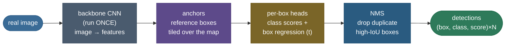

# Object detection: classification tells you *what*, detection tells you *what, where, and how many*

Ask an [image classifier](/ai-ml/ai-ml-learning-resources/modalities-and-generative-models/computer-vision/image-classification/image-classification) "what is in this photo?" and it answers with a single label — *cat*. Useful, until you show it a real scene: two cats on a couch, two remotes, a blanket. Now "cat" is not an answer. You need to know **how many** objects there are, **which class** each one is, and **where** each one sits — a box around every object. That is **object detection**, and the jump from one label to *a variable number of labels-plus-boxes* is the entire difficulty. A classifier's output is a fixed-size vector of class scores; a detector's output is a **list of (box, class, score) triples whose length it does not know in advance**, one per object it decides is present.

The naive fix — "just run the classifier at every position and scale" — is where you feel the problem. Slide a 224×224 window over a modest image at a handful of scales and aspect ratios and you evaluate the classifier **hundreds of thousands** of times per image; worse, each real object lights up *many* nearby windows, so you get a blizzard of overlapping boxes around every cat and no principled way to collapse them into "one cat here, one cat there." Detection is the set of ideas that make this tractable and correct: a way to **measure box overlap** (IoU), a way to **collapse duplicate boxes** (NMS), a way to **predict boxes as small corrections to reference boxes** (anchors + regression), and a way to **score the whole ranked list honestly** (Average Precision).

Everything on this page is produced by a **real, runnable** pipeline — a real pretrained **Faster R-CNN** run on a real photograph, with IoU, NMS, and AP implemented from scratch and each **cross-checked against a trusted reference** (`torchvision.ops` for IoU and NMS; a hand-verified worked example for AP). Real detections, real box counts, real measured AP. By the end you'll be able to:

- state *exactly why* detection is harder than classification, and what a detector's output actually is;
- define **IoU** and compute it, and explain the three box formats (xyxy / xywh / cxcywh) and why mixing them is the #1 bug;
- run the **NMS** algorithm by hand and say precisely when its greedy choice fails (crowded scenes → soft-NMS);
- explain **anchors** and the $(t_x, t_y, t_w, t_h)$ **box-regression** parametrization a detector actually learns;
- derive **Average Precision** from precision/recall through the PR curve to the area, and distinguish **AP@0.5**, **mAP**, and the COCO **mAP@[.5:.95]**;
- contrast **two-stage** (R-CNN family) and **one-stage** (YOLO, RetinaNet) detectors on the accuracy/speed axis;
- run the whole thing yourself and get the same numbers.

Pictures and intuition first, then the method (with sources), then the runnable, measured code.

> **Note:** this page is the detection *task* and its core machinery. It **builds on** [Image Classification](/ai-ml/ai-ml-learning-resources/modalities-and-generative-models/computer-vision/image-classification/image-classification) — a detector is, at heart, a classifier applied to regions plus a box regressor — and on the [CNN backbone](/ai-ml/ai-ml-learning-resources/deep-learning/neural-architectures/cnns-and-convolution/cnns-and-convolution) that turns pixels into features. The evaluation metrics (IoU, mAP) get their own dedicated treatment in [10 Detection & Segmentation Metrics](/ai-ml/ai-ml-learning-resources/modalities-and-generative-models/computer-vision/detection-and-segmentation-metrics/detection-and-segmentation-metrics); here we derive and *measure* them because you cannot understand a detector without them.

---

## The problem: a fixed-size classifier can't emit a variable-length list of boxes

Classification maps an image to one of $K$ scores. Its output shape is fixed: $K$ numbers. Detection's output shape is **not fixed** — one image has zero objects, another has seven — and each object needs four box coordinates *and* a class *and* a confidence. That mismatch is the whole reason detection needs new machinery.

Watch the naive approach fail concretely. The honest baseline is a **sliding window**: take your trained classifier, slide a window across the image at every position, and at several scales and aspect ratios, and classify each crop. Two things break immediately.

**The cost is enormous.** A 640×480 image, windows every 8 pixels, at 3 scales and 3 aspect ratios, is on the order of $\frac{640}{8}\cdot\frac{480}{8}\cdot 9 \approx 43{,}000$ classifier evaluations for *one* image — and that's a coarse grid. Real objects come at arbitrary positions and sizes, so a fine enough grid to not miss them runs into the hundreds of thousands. You cannot afford to run a deep CNN that many times per frame.

**The output is a mess of duplicates.** Even if you could afford it, a single object doesn't fire exactly one window — it fires *dozens* of overlapping windows that all contain most of it. Our real detector, run with its duplicate-removal turned off, emits **44 overlapping `cat` boxes** on a two-cat photo — dozens per object. Raw, the detector's answer to "how many cats?" would be "44 boxes." You need a principled way to say "these 44 boxes describe only 2 real cats; keep the best box per object."

So detection needs four things classification never did: **(1)** a way to turn one CNN pass over the image into region features cheaply (shared computation, not one CNN per window); **(2)** a way to *measure* when two boxes refer to the same object — **IoU**; **(3)** a way to *collapse* the duplicates that measure reveals — **NMS**; and **(4)** a way to *score* the resulting ranked list of boxes against the truth — **Average Precision**. The first is architecture (the R-CNN → Faster R-CNN → YOLO lineage below); the other three are the box-geometry core every detector shares, and where we spend most of this page.

> **Tip:** the interview one-liner for "why is detection harder than classification?" — *"classification has a fixed-size output (K class scores); detection must emit a variable-length list of boxes, each with a class and a score. That forces three extra pieces of machinery — IoU to measure box overlap, NMS to remove duplicate boxes, and Average Precision to score the ranked list — none of which classification needs."*

---

## Intuition first: propose, classify-and-refine, then deduplicate

Forget the metrics for a moment and picture how a person would do it. Hand someone a photo and a highlighter and say "box every object." They don't evaluate a formula — they do three things: **propose** candidate regions that *might* contain an object ("that blob could be something, that one too"), **decide and tighten** for each candidate ("that's a cat, and the box should sit a little tighter — down and to the left"), and finally **dedupe** ("I drew three boxes around the same cat; keep the best, cross out the rest"). Every modern detector is a mechanized version of exactly those three moves: **propose → classify-and-refine → deduplicate.**


That figure is a real detector's actual output. Read what detection *is* off it: not one label but a **list** of boxes, each with a class name and a confidence between 0 and 1 — and, honestly, some low-confidence guesses (the amber "couch" and "bed") that a threshold will later cut. The confident boxes are tight and correct; the borderline ones are the detector hedging. A detector's whole job is to produce this list, and detection's whole vocabulary exists to make each of the three moves precise.

Now make the three moves exact, because each one names a piece of machinery:

- **Propose.** Instead of a blind sliding window, run the CNN backbone **once** over the whole image to get a feature map, then propose candidate boxes from a fixed grid of reference boxes called **anchors** (boxes of several sizes and aspect ratios tiled over every location). One CNN pass, many cheap proposals — this is the move that killed the sliding window's cost.
- **Classify-and-refine.** For each proposal, a small head predicts a **class** *and* a **box correction** — four numbers $(t_x, t_y, t_w, t_h)$ that nudge the anchor's center and size onto the object. Detectors don't guess absolute coordinates; they predict a *correction to a nearby reference box*, which is a far easier target to learn.
- **Deduplicate.** Many proposals survive around each object, so you need to measure "do these two boxes refer to the same thing?" — that's **IoU**, the overlap between two boxes — and then greedily keep the highest-scoring box and suppress its high-IoU neighbours — that's **NMS**.

The single mental model to hold: **a detector is a classifier that also regresses a box, run over many candidate regions, followed by a cleanup that removes duplicate boxes.** Classification lives inside detection; the box geometry (IoU, anchors/regression, NMS) is the wrapper that turns "what is this crop?" into "what, where, and how many, across the whole image?"

> **Note:** the two families differ only in how they arrange *propose* and *classify-and-refine*. **Two-stage** detectors (Faster R-CNN) spend a first stage proposing a few hundred high-quality regions, then a second stage classifies and refines them — accurate, a bit slower. **One-stage** detectors (YOLO, RetinaNet) fuse the two: every anchor is classified-and-refined in a single pass — faster, and with focal loss (below) just as accurate. Both share the IoU/NMS/AP core derived next.

---

## How a detector computes: the pipeline

Before the box math, the shape of the whole system. Every modern detector is this pipeline; the families differ only in whether the middle two stages are one network or two.



- **Backbone** — a CNN (usually a pretrained classification backbone, e.g. ResNet-50) run **once** over the image to produce a feature map. This is the shared computation that replaces the sliding window's thousands of CNN passes. It is literally the classification backbone from the [previous chapter](/ai-ml/ai-ml-learning-resources/modalities-and-generative-models/computer-vision/image-classification/image-classification), reused.
- **Anchors** — a fixed set of reference boxes (several scales × aspect ratios) tiled at every feature-map location. They give the heads a *starting box* to correct rather than a coordinate to invent.
- **Per-box heads** — for each anchor/proposal, a **classification** head (which class, or background) and a **regression** head (the $(t_x, t_y, t_w, t_h)$ correction). In a **two-stage** detector a Region Proposal Network first prunes anchors to a few hundred proposals, then a second head re-classifies and re-refines them; in a **one-stage** detector the heads run on all anchors directly.
- **NMS** — the many surviving overlapping boxes are collapsed per class: sort by score, keep the best, suppress its high-IoU neighbours. This is the last step, and it is a **heuristic post-process**, not a learned layer.
- **Detections** — the final variable-length list of $(box, class, score)$.

The forward-pass cost is dominated by the single backbone pass (a few GFLOPs for ResNet-50 at typical resolution); the heads and NMS are cheap by comparison. That "backbone once, then cheap per-box work" is the architectural insight that made detection real-time-capable — and the whole R-CNN → Fast → Faster progression below is the story of pushing more of the work into that single shared pass.

---

## The method

Four pieces of box math, derived. Three of them — IoU, NMS, AP — we implement from scratch and verify against a reference in the code; the fourth (anchors/regression) is the parametrization the detector's regression head learns.

### Boxes: three formats, and why mixing them bites

A box is four numbers, but three conventions coexist and silently mixing them is the single most common detection bug:

$$
\text{xyxy} = (x_{\min}, y_{\min}, x_{\max}, y_{\max}), \qquad
\text{xywh} = (x_{\min}, y_{\min}, w, h), \qquad
\text{cxcywh} = (x_c, y_c, w, h).
$$

**xyxy** (corners) is what IoU, NMS, and drawing want. **xywh** (top-left + size) is the COCO *annotation* format. **cxcywh** (center + size) is what anchor regression predicts. The conversions are one-liners — e.g. $x_c = (x_{\min}+x_{\max})/2,\ w = x_{\max}-x_{\min}$ — but feed an xywh box to an IoU function that expects xyxy and you compute overlap between two *wrong* rectangles and get silently corrupted metrics, never an error. Our conversions match `torchvision.ops.box_convert` to $0$ (bit-identical) and round-trip losslessly; the code asserts it.

### IoU: measuring when two boxes are "the same object"

**Intersection over Union** is the overlap metric everything downstream depends on. For two boxes $A$ and $B$:

$$
\mathrm{IoU}(A, B) = \frac{\mathrm{area}(A \cap B)}{\mathrm{area}(A \cup B)}, \qquad
\mathrm{area}(A \cup B) = \mathrm{area}(A) + \mathrm{area}(B) - \mathrm{area}(A \cap B).
$$

The intersection rectangle is built from the *inner* edges — its top-left is the element-wise **max** of the two top-lefts, its bottom-right the element-wise **min** of the two bottom-rights — and then **clamped to be non-negative**: if the boxes don't overlap, a width or height goes negative, clamps to zero, and IoU is $0$. Two identical boxes give IoU $1$. The union subtracts the intersection so the overlap isn't double-counted.


IoU is scale-free (a number in $[0, 1]$) and is the currency of both jobs still to come: **NMS** uses it to decide which boxes are duplicates (IoU above a threshold → same object → suppress), and **AP** uses it to decide which detections *count* as correct (IoU with a ground-truth box $\ge 0.5$ → a hit). Our from-scratch IoU matrix matches `torchvision.ops.box_iou` to $0.00\text{e}{+}0$ — it *is* the standard IoU, not a look-alike.

> **Source / derivation:** IoU (the Jaccard index of two boxes) and the mean-Average-Precision protocol built on it are the PASCAL VOC evaluation standard — Everingham, Van Gool, Williams, Winn & Zisserman, *The PASCAL Visual Object Classes (VOC) Challenge* (2010) — extended by the COCO benchmark's stricter multi-threshold metric, Lin, Maire, Belongie, Hays, Perona, Ramanan, Dollár & Zitnick, *Microsoft COCO: Common Objects in Context* (2014). Both in the [references](/ai-ml/ai-ml-learning-resources/modalities-and-generative-models/computer-vision/object-detection/object-detection#references-further-reading).

### NMS: collapsing the duplicate boxes

The heads emit many overlapping boxes per object; **Non-Maximum Suppression** greedily keeps one per object. The algorithm, per class:

1. Sort all boxes by confidence score, highest first.
2. Take the top-scoring box, **keep** it.
3. Compute its IoU with every remaining box; **discard** every box with IoU above a threshold (default $0.5$) — those are duplicate detections of the same object.
4. Repeat with the next-highest surviving box until none remain.

The name says it: at each object you keep the *maximum*-scoring box and *suppress* the non-maxima around it. On our real image the effect is dramatic and measured:


**44 raw overlapping `cat` boxes → 2 kept** — one per real cat — and our from-scratch greedy NMS keeps the *identical* indices to `torchvision.ops.nms` (the code asserts set-equality of the kept indices). NMS is what turns the detector's "44 boxes" into "2 cats."

Two things to internalize. First, NMS is a **heuristic**, not a learned layer — it runs after the network, per class, with a hand-chosen IoU threshold. Second, its greedy choice has a real failure mode: in a **crowded scene** where two *distinct* objects genuinely overlap a lot (two people hugging), NMS will suppress the second object's box because it has high IoU with the first — a false suppression. That is exactly what **Soft-NMS** addresses (decay the neighbour's score instead of deleting it); we flag it in the pitfalls.

### Anchors and box regression: predicting a box as a correction

Detectors do not predict box coordinates from nothing. They start from **anchors** — reference boxes of several scales and aspect ratios tiled across the feature map — and the regression head predicts a **correction** $(t_x, t_y, t_w, t_h)$ that maps an anchor $a$ onto a ground-truth box $g$ (the Faster R-CNN parametrization):

$$
t_x = \frac{g_x - a_x}{a_w}, \quad t_y = \frac{g_y - a_y}{a_h}, \quad t_w = \log\frac{g_w}{a_w}, \quad t_h = \log\frac{g_h}{a_h},
$$

where $(a_x, a_y, a_w, a_h)$ and $(g_x, g_y, g_w, g_h)$ are the anchor and ground-truth boxes in **cxcywh** form. Read the design off the formula. The **center offsets** $t_x, t_y$ are measured *in units of the anchor's size*, so the same target works for a big anchor and a small one — scale-invariant. The **sizes** $t_w, t_h$ are predicted in **log-space**, so the head outputs an unbounded real number that maps to a strictly positive width/height ($w = a_w e^{t_w}$) — a box can never collapse to negative size, and "double the width" and "halve the width" are symmetric $\pm\log 2$ targets. Encoding a ground-truth box to $(t_x,t_y,t_w,t_h)$ and decoding it back recovers the box exactly; the code asserts the round-trip to $10^{-14}$. This regression target — a small, well-conditioned correction to a nearby reference box — is *far* easier to learn than absolute pixel coordinates, and it is why anchors exist.

![Anchors and box regression, made spatial. Nine anchors — 3 scales × 3 aspect ratios — are tiled at a single feature-map cell (grey), giving the detector a rack of reference boxes to correct rather than coordinates to invent. The matcher assigns the best-overlapping anchor (amber, dashed) to the object (green), and the regression head predicts a correction $t = (t_x, t_y, t_w, t_h)$ — the red arrow — that nudges that anchor's center and size onto the ground-truth box. The correction shown, $t = (0.44, -0.31, -0.04, 0.08)$, is the *actual* value the module's `encode_boxes` returns for this anchor/object pair, not a hand-drawn guess: the small centre shift (in anchor-size units) and near-zero log-space size deltas say "this anchor is already about the right size and shape — just move it a little."](images/cv07_anchors.png)

> **Source / derivation:** learned region proposals via a Region Proposal Network over anchors, and the $(t_x, t_y, t_w, t_h)$ box parametrization, are Ren, He, Girshick & Sun, *Faster R-CNN: Towards Real-Time Object Detection with Region Proposal Networks* (2015), building on Girshick, Donahue, Darrell & Malik, *Rich feature hierarchies (R-CNN)* (2014) and Girshick, *Fast R-CNN* (2015). Both in the [references](/ai-ml/ai-ml-learning-resources/modalities-and-generative-models/computer-vision/object-detection/object-detection#references-further-reading).

### Average Precision: scoring the ranked list

A detector emits a *ranked* list of boxes (by confidence). How good is it? Accuracy makes no sense — there's no fixed set of slots to be right or wrong about. The field's answer is **Average Precision**, the area under the **precision-recall curve**.

Build it by walking the detections from highest score to lowest. Each detection is matched to ground truth by IoU: if it overlaps an *unclaimed* ground-truth box with IoU $\ge$ a threshold (0.5 for AP@0.5), it's a **true positive** (and claims that box); otherwise — no match, or a duplicate of an already-claimed box — it's a **false positive**. After each detection, record

$$
\text{precision} = \frac{TP}{TP + FP} \quad(\text{of the boxes I've drawn, what fraction are right?}), \qquad
\text{recall} = \frac{TP}{\#\text{ground truth}} \quad(\text{of the real objects, what fraction have I found?}).
$$

Plotting precision against recall as you descend the ranked list traces the **PR curve**. High-confidence correct detections keep precision near 1; as you go down the list you find more objects (recall rises) but start admitting false positives (precision falls). **AP is the area under this curve** — a single number in $[0, 1]$ that rewards ranking true positives above false positives. The standard uses an *interpolated* curve (precision replaced by the maximum precision at any higher recall) so the area is over a monotonically non-increasing envelope.

A worked example makes the arithmetic concrete and pins the implementation. Take **3 ground-truth objects** and **5 detections** whose IoU-matching, ranked by score, gives the sequence **TP, TP, FP, TP, FP**:

| rank | match | cumulative TP | cumulative FP | precision | recall | interp. precision |
|---|---|---|---|---|---|---|
| 1 | TP | 1 | 0 | 1/1 = 1.00 | 1/3 = 0.33 | 1.00 |
| 2 | TP | 2 | 0 | 2/2 = 1.00 | 2/3 = 0.67 | 1.00 |
| 3 | FP | 2 | 1 | 2/3 = 0.67 | 0.67 | 1.00 |
| 4 | TP | 3 | 1 | 3/4 = 0.75 | 3/3 = 1.00 | 0.75 |
| 5 | FP | 3 | 2 | 3/5 = 0.60 | 1.00 | 0.75 |

The **interpolated precision** column is what `_all_point_ap` actually integrates: each raw precision is replaced by the *maximum* precision at any recall $\ge$ this one (the monotone envelope), which is why rank 3's raw 0.67 is lifted to 1.00 and ranks 4–5 sit at 0.75. Summing that envelope over the three distinct recall levels (0.33, 0.67, 1.00), each a step of width $\tfrac{1}{3}$, gives the area $\tfrac{1}{3}(1.0) + \tfrac{1}{3}(1.0) + \tfrac{1}{3}(0.75) = \tfrac{1}{3} + \tfrac{1}{3} + \tfrac{1}{4} = \tfrac{11}{12} \approx 0.9167$. Our from-scratch AP reproduces **exactly 11/12** on this case — a hard `assert` pins it, so a bug in the matching or the integration *raises* rather than shipping a wrong number.

![Average Precision as the area under the precision-recall curve. Left: the worked example (TP,TP,FP,TP,FP) — the raw staircase (slate) and the interpolated envelope whose shaded area is AP = 0.917 = 11/12. Right: the same real cat detections scored two ways — before NMS (red), 56 of the 58 boxes are false positives (only the 2 boxes matching the two cats are true positives), so precision collapses and AP = 0.67; after NMS (green), 6 clean detections give AP = 1.00. NMS raises AP by removing duplicate false positives.](images/cv07_pr_curve.png)

Two AP quantities you must distinguish:

- **mAP** — **mean** Average Precision, the AP averaged over classes. "The detector's mAP" always means this; a detector has one AP per class, and mAP is their mean.
- **AP@0.5 vs COCO mAP@[.5:.95]** — the IoU threshold for "counts as a hit" is a knob. **AP@0.5** (the PASCAL VOC metric) asks only for IoU $\ge 0.5$ — a loose bar. The headline **COCO metric averages AP over ten thresholds, IoU $= 0.50, 0.55, \dots, 0.95$**, so it rewards *tight* localization, not just rough detection, and is always lower than AP@0.5.

On our single real image the strong detector scores **mAP@0.5 = 1.00** and **COCO mAP@[.5:.95] = 0.975** — the stricter bar costs it a little (the second remote's box isn't pixel-perfect at IoU 0.95). Be honest about what that means: a *single easy image is illustrative, not a benchmark*. Real mAP is measured over thousands of images; here the point is the *machinery* (the matching, the curve, the threshold dependence) and that it reproduces the hand-verified worked example, not the specific 1.00.

> **Source / derivation:** the precision-recall-based Average Precision protocol, per-class AP and mAP, and the IoU-matching rule are the PASCAL VOC standard (Everingham et al., 2010); the stricter **mAP@[.5:.95]** averaged over ten IoU thresholds is the COCO metric (Lin et al., 2014). Both in the [references](/ai-ml/ai-ml-learning-resources/modalities-and-generative-models/computer-vision/object-detection/object-detection#references-further-reading).

---

## Mechanics, internals, and the two-stage/one-stage trade-off

**Forward pass.** One backbone pass produces the feature map ($O(HW\cdot\text{depth})$, a few GFLOPs for ResNet-50). Anchors are enumerated over the map (typically tens of thousands). In a **two-stage** detector, a Region Proposal Network scores/refines anchors and keeps the top ~1000 → NMS → ~300 proposals; a second head then classifies and re-refines those proposals. In a **one-stage** detector, the class + box heads run on *all* anchors directly. Either way, a final per-class NMS produces the output list. The heads and NMS are cheap relative to the backbone — the shared backbone pass is the whole point.

**The imbalance problem (why one-stage was hard).** A one-stage detector scores *every* anchor, and the overwhelming majority — tens of thousands per image — are **background**. This crushing foreground/background imbalance means the easy background examples dominate the loss and swamp the gradient from the rare real objects. **Focal loss** (RetinaNet) fixes it by down-weighting easy, well-classified examples: $\mathrm{FL}(p_t) = -(1 - p_t)^\gamma \log p_t$, where the $(1-p_t)^\gamma$ factor shrinks the loss on confident (easy background) predictions so the network learns from the hard, informative ones. That single change let one-stage detectors match two-stage accuracy at one-stage speed.

**The trade-off, stated plainly.** **Two-stage** (Faster R-CNN): the proposal stage filters anchors down to a few hundred high-quality regions before the expensive per-region classification, so accuracy is high and the second stage sees a balanced set — at the cost of two sequential networks (slower). **One-stage** (YOLO, SSD, RetinaNet): no proposal stage, every anchor classified in one pass — much faster (real-time), historically less accurate until focal loss closed the gap. The modern practical answer: one-stage (a YOLO variant) for real-time/edge, two-stage or DETR-style when maximum accuracy matters and latency is looser.

**Complexity.** Backbone: $O(HW \cdot C)$ per image. NMS: $O(n^2)$ per class in the naive greedy form ($n$ = boxes for that class), which is fine because $n$ is small after score-thresholding; the real cost is always the backbone.

---

## The build, measured

Everything above is executable. The companion module — **[object_detection.py](code/object_detection.py)** — and the step-by-step **[runnable notebook](code/object-detection.ipynb)** run a real **Faster R-CNN (ResNet-50 FPN, COCO weights)** on a real photograph and build IoU, NMS, and AP from scratch, each cross-checked against a reference. Every number below is printed by that code, seeded and CPU-pinned for a bit-reproducible trace.

**The from-scratch building blocks, each verified.** Box-format conversions match `torchvision.ops.box_convert` to $0$; the from-scratch IoU matrix matches `torchvision.ops.box_iou` to $0.00\text{e}{+}0$ (the sanity pair — two 10×10 boxes shifted 5 px — gives IoU $= 50/150 = 0.3333$); the $(t_x, t_y, t_w, t_h)$ encode/decode round-trips to $1.4\text{e}{-}14$. These are not look-alikes — they are the standard operations, provably.

**The real detector on a real image.** On the COCO photo (640×480), Faster R-CNN returns **7 detections at score ≥ 0.5**: `cat 0.989`, `remote 0.979`, `cat 0.953`, `remote 0.781`, and three borderline `couch 0.541`, `couch 0.540`, `bed 0.538`. The two cats and two remotes are found with high confidence; the couch/bed are the honest low-confidence hedges a score threshold trims.

**NMS, verified on the real boxes.** With the detector's own NMS disabled, the `cat` class produces **44 overlapping boxes** (taking the score ≥ 0.30 subset for a legible figure); from-scratch greedy NMS at IoU 0.5 keeps **2**, with kept indices *identical* to `torchvision.ops.nms` (asserted).

**AP, pinned and then measured.** The from-scratch AP reproduces the worked example **exactly (11/12 = 0.9167)**. On the real `cat` detections, scoring the *same* boxes before vs after NMS shows why NMS matters for the score. Here AP uses the fuller score ≥ 0.05 set (**58** cat boxes — a lower threshold than the NMS figure's 44 so the precision-recall curve extends to low confidence): **pre-NMS 58 detections → AP@0.5 = 0.6667** (56 of the 58 are false positives — only the 2 boxes matching the two cats are true positives — so precision collapses), **post-NMS 6 detections → AP@0.5 = 1.0000** — NMS lifts AP by **+0.333** by deleting those duplicate false positives. Per class, AP@0.5 is `cat 1.00`, `remote 1.00` → **mAP@0.5 = 1.00**, while the stricter **COCO mAP@[.5:.95] = 0.975**. The top cat detection's IoU with its ground-truth box is **0.980**.

### Reading the module's report

Running `python object_detection.py` prints the consolidated, reproducible report — every number this page quotes, each from-scratch check guarded by a hard `assert`:

```
torch 2.12.0 | torchvision 0.27.0 | numpy 2.4.6 (reported on CPU, seed=0; accelerator available: mps)

=== Real image: cats & remotes (COCO val2017) [coco-download] ===
  640x480 RGB; detector found 7 objects (score >= 0.5):
    cat          0.989
    remote       0.979
    cat          0.953
    remote       0.781
    couch        0.541
    couch        0.540
    bed          0.538

=== Box formats vs torchvision.ops.box_convert ===
  max|xywh err|=0.0e+00  max|cxcywh err|=0.0e+00  round-trip err=1.4e-14

=== IoU from scratch vs torchvision.ops.box_iou ===
  max|IoU err|=0.00e+00  (sanity pair, two 10x10 boxes shifted 5px: IoU=0.3333)

=== Box regression encode/decode (tx,ty,tw,th) round-trip ===
  max|decode(encode(gt)) - gt|=1.4e-14  example delta=(0.166, 0.976, -0.349, 0.189)

=== NMS from scratch vs torchvision.ops.nms  (class 'cat', IoU thresh 0.5) ===
  raw overlapping boxes: 44  ->  after NMS: 2   (kept indices == torchvision.ops.nms: True)

=== Average Precision from scratch ===
  known worked example (TP,TP,FP,TP,FP): AP = 0.916667  (hand-verified expected 11/12 = 0.916667)
  same real 'cat' detections, before vs after NMS (duplicates are false positives):
    pre-NMS :  58 detections -> AP@0.5 = 0.6667
    post-NMS:   6 detections -> AP@0.5 = 1.0000   (NMS lifts AP by +0.3333)
  per-class AP@0.5 vs hand-specified GT on 'cats & remotes (COCO val2017)' (illustrative, single image):
    AP@0.5[cat     ] = 1.0000   (6 detections, 2 ground-truth boxes)
    AP@0.5[remote  ] = 1.0000   (2 detections, 2 ground-truth boxes)
    -> mAP@0.5 = 1.0000   |   COCO mAP@[.5:.95] = 0.9750   (mean over 2 classes)
  IoU(top 'cat' detection, its GT) = 0.9804

All checks passed (box formats, IoU, NMS, and box-regression match their references;
AP reproduces the hand-verified 11/12 worked example; NMS removes duplicate FPs and lifts AP).
```

Read top to bottom, that is the whole page in numbers: the box ops and IoU are provably the standard operations; a real detector finds the real objects; NMS collapses 44 duplicate boxes to 2 and *matches torchvision exactly*; AP reproduces the hand-verified 11/12; and NMS lifts the real AP from 0.67 to 1.00 by removing duplicate false positives. Each relationship is a hard `assert` — if NMS stopped matching torchvision, or AP diverged from 11/12, the module *raises*, it does not print a wrong number and exit 0.

> **Note on reproducibility and honesty.** Numbers are computed on **CPU** with a fixed seed so they're bit-reproducible on any machine. The **ground-truth boxes are hand-specified** on the two clearly-visible cats and two remotes, and there is **one image**, so the mAP figures (1.00 / 0.975) are *illustrative of the machinery, not a benchmark* — real mAP is measured over thousands of images against curated annotations. What is rigorous here is the machinery: IoU and NMS match torchvision exactly, and AP reproduces the hand-verified worked example. If the COCO image can't be downloaded, the module falls back to a real bundled photo (Grace Hopper) and every check still runs on real coordinate data — it never mocks a detection or fabricates a metric.

---

## Common pitfalls and failure modes

Detection has a predictable set of traps, and every one shows up in interviews and in real code:

- **Mixing box formats.** The cardinal detection bug. Passing an xywh box to an IoU/NMS function that expects xyxy computes overlap between the wrong rectangles and silently corrupts every downstream metric — no exception, just wrong numbers. Always know which format each API speaks (COCO annotations are xywh; `torchvision.ops` wants xyxy) and convert explicitly.
- **NMS in crowded scenes (the greedy failure).** Greedy NMS suppresses any box with high IoU to a kept box — but two *distinct* objects that genuinely overlap (two people hugging, a herd) have high mutual IoU, so NMS deletes the second object's box. **Soft-NMS** (decay the neighbour's score by its IoU instead of deleting it) is the standard fix; class-aware NMS (only suppress within a class) also helps.
- **Wrong NMS threshold or per-class vs global.** Too high an IoU threshold leaves duplicates; too low merges nearby distinct objects. And NMS must run **per class** — a "person" box and an overlapping "handbag" box are different objects and must not suppress each other.
- **Confusing the score threshold with the IoU threshold.** They are different knobs: the **score threshold** decides which detections you keep (precision/recall trade-off); the **IoU threshold** decides what counts as a correct match in AP *and* what counts as a duplicate in NMS. Interviewers probe whether you conflate them.
- **Reporting AP on a single image (or a tiny set).** AP is a *ranking* metric that needs enough objects to trace a meaningful PR curve; on one image it's noise. Our 1.00 is honest for an easy image but is not a benchmark — always report mAP over a proper validation set.
- **Forgetting the off-by-one / half-open box convention.** Whether a box's max coordinate is inclusive or exclusive changes areas by a pixel and IoU by a hair; be consistent (torchvision treats boxes as continuous coordinates, area $=(x_2-x_1)(y_2-y_1)$).
- **The math vs the code: NMS is a heuristic, not a layer.** It runs *after* the network and is not differentiable; you cannot "train through" standard NMS. (This is precisely a motivation for **DETR**, which removes NMS by predicting a set directly.)
- **Anchor/scale mismatch.** If your anchors' scales and aspect ratios don't cover your objects (tiny objects, extreme aspect ratios), recall collapses — the regression head can only nudge an anchor so far. Tune anchor sizes to your data, or use an anchor-free/multi-scale (FPN) design.

---

## Where it's used and why it matters

- **Detection is everywhere objects must be located, not just named.** Autonomous driving (cars, pedestrians, signs), retail (shelf and checkout), medical imaging (lesions, nodules), agriculture (fruit/pest counting), security and retail analytics (people counting), robotics (grasp targets), document AI (layout). Any task phrased as "find and box the X's" is detection.
- **The metrics are the task's language.** IoU and mAP aren't academic — they are how detectors are *compared, tuned, and shipped*. "Our model gets 54 mAP" is the sentence that decides which detector goes to production, and understanding what that number does and doesn't capture (localization tightness via the [.5:.95] sweep, per-class breakdown, the score-threshold operating point) is the difference between a working system and a misleading benchmark.
- **The backbone is shared with everything else in vision.** A detector's backbone is the [classification](/ai-ml/ai-ml-learning-resources/modalities-and-generative-models/computer-vision/image-classification/image-classification) backbone; its per-pixel cousin is [semantic segmentation](/ai-ml/ai-ml-learning-resources/modalities-and-generative-models/computer-vision/semantic-segmentation/semantic-segmentation); adding a mask head gives [instance segmentation](/ai-ml/ai-ml-learning-resources/modalities-and-generative-models/computer-vision/instance-segmentation/instance-segmentation) (Mask R-CNN). Detection sits at the center of the vision task family.
- **When *not* to reach for a heavy detector.** If you only need "is there a cat anywhere?" use classification — detection is more expensive and needs box annotations (costly to collect). If objects never overlap and are on a clean background, classical blob detection may suffice. And for real-time on-device work, pick a one-stage model (YOLO/SSD) sized to your latency budget, not a two-stage detector.

> **Tip:** the practitioner's one-line recipe — *"run a shared backbone once, propose boxes from anchors, classify-and-refine each, run per-class NMS to remove duplicates, and evaluate with mAP over a real validation set — not accuracy, and not a single image."* That sentence is the spine of every detector from Faster R-CNN to YOLO.

> **Try it:** in the [notebook](code/object-detection.ipynb), before you run anything, *predict the direction*. (1) Raise the NMS IoU threshold from 0.5 toward 0.9 — will more or fewer boxes survive, and what happens to the duplicate cats? (2) Compute the real cat AP at IoU 0.9 instead of 0.5 — will it stay 1.00 or drop, and why? (3) Lower the detector's score threshold from 0.5 to 0.05 — what happens to recall, precision, and the number of borderline boxes drawn? Write your prediction down, change the one line, and check. Being *wrong* about the direction is where the learning is.

---

## The lineage in one paragraph (R-CNN → DETR)

The architecture story is a steady push to do more in one shared pass. **R-CNN** (2014) ran a CNN on ~2000 *selective-search* region proposals — accurate but painfully slow (one CNN per region). **Fast R-CNN** (2015) ran the CNN *once* and pooled features per region (RoI pooling) — one backbone pass, big speedup. **Faster R-CNN** (2015) replaced selective search with a *learned* **Region Proposal Network** over anchors — proposals became part of the network, making it end-to-end and the two-stage standard. **YOLO** (2016) threw out the proposal stage entirely, dividing the image into a grid and predicting boxes and classes in a **single pass** — real-time detection. **SSD** (2016) added multi-scale one-stage prediction. **RetinaNet** (2017) fixed one-stage's accuracy gap with **focal loss**, taming the background imbalance. **DETR** (2020) reframed detection as *set prediction* with a transformer, **removing anchors and NMS** altogether. Each step moved work into the shared computation or removed a hand-designed heuristic — and the IoU/NMS/AP core you built here underlies all of them (DETR excepted for NMS).

> **Source / derivation:** the one-stage, single-pass reformulation of detection is Redmon, Divvala, Girshick & Farhadi, *You Only Look Once: Unified, Real-Time Object Detection* (2016); the focal-loss fix for foreground/background imbalance in dense one-stage detectors is Lin, Goyal, Girshick, He & Dollár, *Focal Loss for Dense Object Detection (RetinaNet)* (2017); the anchor-and-NMS-free set-prediction reformulation is Carion, Massa, Synnaeve, Usunier, Kirillov & Zagoruyko, *End-to-End Object Detection with Transformers (DETR)* (2020). All in the [references](/ai-ml/ai-ml-learning-resources/modalities-and-generative-models/computer-vision/object-detection/object-detection#references-further-reading).

---

## Recap and rapid-fire

**If you remember nothing else:** detection = **classification + localization**, emitting a *variable-length* list of (box, class, score). It rests on four pieces of box math — **box formats** (know which of xyxy/xywh/cxcywh each API speaks), **IoU** (overlap = intersection/union, the currency of NMS and AP), **NMS** (greedily keep the top box, suppress high-IoU neighbours — here 44 duplicate boxes → 2), and **AP** (area under the precision-recall curve; mAP averages over classes; COCO mAP@[.5:.95] demands tight localization). Architecturally it's **backbone once → anchors → per-box class+regression → NMS**, split into two-stage (accurate) vs one-stage (fast, closed by focal loss).

**Quick-fire — say these out loud:**

- *Why is detection harder than classification?* Fixed-size output (K scores) vs a variable-length list of boxes, each with a class and score — forcing IoU, NMS, and AP.
- *What is IoU?* Intersection area over union area of two boxes, in $[0,1]$; 0 = disjoint, 1 = identical. The currency for "same object?" (NMS) and "correct?" (AP).
- *The three box formats?* xyxy (corners, for IoU/NMS/drawing), xywh (top-left+size, COCO annotations), cxcywh (center+size, anchor regression). Mixing them silently corrupts metrics.
- *NMS algorithm?* Sort by score; keep the top box; discard boxes with IoU > threshold; repeat. Per class. Greedy — fails in crowded scenes (→ soft-NMS).
- *What are anchors / the regression target?* Reference boxes tiled over the map; the head predicts $(t_x,t_y,t_w,t_h)$ correcting an anchor onto the object — centers in anchor-size units, sizes in log-space (never negative).
- *What is AP?* Area under the precision-recall curve, matching detections to GT by IoU. Rewards ranking TPs above FPs.
- *AP@0.5 vs mAP@[.5:.95]?* AP@0.5 needs IoU ≥ 0.5 (loose); COCO averages AP over IoU 0.5→0.95 (rewards tight boxes; always lower). mAP averages AP over classes.
- *Two-stage vs one-stage?* Two-stage (Faster R-CNN): propose then classify — accurate, slower. One-stage (YOLO/RetinaNet): all anchors in one pass — fast; focal loss fixed its accuracy.
- *What does focal loss solve?* Foreground/background imbalance — tens of thousands of easy background anchors swamp the loss; $(1-p_t)^\gamma$ down-weights easy examples.
- *Why does NMS raise AP?* Duplicate boxes are false positives; removing them lifts precision (we measured 0.67 → 1.00 on the real cat detections).

---

## References and further reading

The curated link library for this topic — videos, courses, interactive/visual resources, articles, papers, books, and internal cross-links — lives in a companion file so it can be reused as a standalone reference list:

**→ [Object Detection — references and further reading](/ai-ml/ai-ml-learning-resources/modalities-and-generative-models/computer-vision/object-detection/object-detection#references-further-reading)**
