# Diffusion models (DDPM): learn to generate by learning to un-noise, one tiny step at a time

A [VAE](/ai-ml/ai-ml-learning-resources/modalities-and-generative-models/generative-models/variational-autoencoders-vae-elbo/variational-autoencoders-vae-elbo) generates in **one leap** — draw a latent $z\sim\mathcal N(0,I)$, push it through a decoder, out comes an image. It works, but the leap is hard: a single network must map a shapeless Gaussian blob all the way to a photorealistic face in one shot, and the pressure of doing everything at once is exactly why VAE samples come out *blurry* and GAN training comes out *unstable*. So ask a different question — the question this whole chapter turns on: **what if we never asked any network to make the whole leap?** What if, instead, we took a real image and *destroyed* it gradually — sprinkle on a little Gaussian noise, then a little more, then a little more, for hundreds of steps, until nothing is left but static — and then trained a network to undo just **one** of those tiny steps? Each step is a baby step: the image at step $t$ and the image at step $t-1$ differ by only a whisper of noise, so *un-noising one step is easy*. And if you can reliably undo one small step, you can undo the whole thing: start from pure static and denoise, step by step by step, until an image assembles itself out of the noise. That is a **diffusion model**.

This is the idea that dethroned GANs for image synthesis and now powers Stable Diffusion, DALL·E, Imagen, and Sora. The **DDPM** (Denoising Diffusion Probabilistic Model; Ho, Jain & Abbeel, 2020) is its canonical form, and its beauty is that the whole thing collapses to something shockingly simple to train: **a network that predicts the noise**. You show it a noised image and it guesses what noise was added; the loss is plain mean-squared error $\lVert\varepsilon-\varepsilon_\theta\rVert^2$. No adversary, no delicate balance — one of the most stable objectives in deep learning, and it produces the sharpest samples in the field.

The connection to the VAE is not a coincidence, and it is worth stating up front because it organizes everything: **a diffusion model is a deep, many-step VAE with a *fixed* encoder.** The VAE learns both an encoder (image → latent) and a decoder (latent → image). Diffusion *freezes* the encoder — the "encoder" is just the noising process, which has no parameters to learn, you can write it down — and pours all the modeling into a *chain* of decoders, one per denoising step, sharing weights. The [ELBO you derived for the VAE](/ai-ml/ai-ml-learning-resources/modalities-and-generative-models/generative-models/variational-autoencoders-vae-elbo/variational-autoencoders-vae-elbo) is the *same* objective here, just summed over $T$ steps. If you understood the VAE, you are 80% of the way to diffusion.

Everything on this page is produced by a **real, runnable** pipeline — a from-scratch DDPM (noise schedule, a small denoiser $\varepsilon_\theta$, the simplified loss, ancestral sampling) trained on a **real 2-D distribution** (`make_moons`), chosen on purpose because in 2-D you can *watch* the whole process: the data cloud dissolving into an isotropic Gaussian on the way out, and reassembling into two crescents on the way back. And the two claims that matter are *proven*, not asserted. First, the **closed-form forward process is exact**: we check with a hard `assert` that the one-shot jump $q(x_t\mid x_0)=\mathcal N(\sqrt{\bar\alpha_t}\,x_0,(1-\bar\alpha_t)I)$ — the "nice property" that makes DDPM trainable — really is the marginal distribution of the slow step-by-step noising chain. Second, the **model actually generates the target**: ancestral sampling from $\mathcal N(0,I)$ produces points whose distribution matches the real two-moons, measured by the **energy distance** and `assert`ed far below the $\mathcal N(0,I)$ baseline. Every number quoted below is printed by an executed cell. By the end you will be able to:

- explain *why* denoising in many small steps sidesteps the one-shot leap that makes VAEs blurry and GANs unstable — in one breath;
- **derive the closed-form forward** $q(x_t\mid x_0)$ by compounding reparameterized Gaussian steps (the telescoping $\bar\alpha_t=\prod_s\alpha_s$), and say why it lets training jump to any timestep in one shot;
- write the **variational bound** as a sum of per-step Gaussian KLs — reusing the [VAE's ELBO](/ai-ml/ai-ml-learning-resources/modalities-and-generative-models/generative-models/variational-autoencoders-vae-elbo/variational-autoencoders-vae-elbo) and the [two-Gaussian KL](/ai-ml/ai-ml-learning-resources/foundations/mathematical-foundations/cross-entropy-and-kl-divergence/cross-entropy-and-kl-divergence) — and collapse it to the **simplified noise-prediction loss** $L_{\text{simple}}=\mathbb E\lVert\varepsilon-\varepsilon_\theta(x_t,t)\rVert^2$, saying exactly *why* predicting the noise works;
- write the **ancestral sampling** update from memory and explain each term;
- connect DDPM to the [VAE](/ai-ml/ai-ml-learning-resources/modalities-and-generative-models/generative-models/variational-autoencoders-vae-elbo/variational-autoencoders-vae-elbo) (hierarchical, fixed-encoder) and to [score matching](/ai-ml/ai-ml-learning-resources/modalities-and-generative-models/diffusion-models/score-based-and-sde-diffusion/score-based-and-sde-diffusion) ($\varepsilon_\theta\approx-\sqrt{1-\bar\alpha_t}\,\nabla\log q_t$), and be honest about the cost (sampling is *slow*);
- run the whole thing yourself and reproduce every number, including the two proofs.

Intuition and pictures first, then the math (with sources), then the runnable, measured code.

> **Note:** this page builds on two others and *cross-links rather than re-derives* them. The **ELBO** — the variational lower bound on $\log p(x)$ and its decomposition into KL terms — is derived in the [VAE chapter](/ai-ml/ai-ml-learning-resources/modalities-and-generative-models/generative-models/variational-autoencoders-vae-elbo/variational-autoencoders-vae-elbo); diffusion optimizes the *same* bound over a $T$-step chain. The **closed-form KL between two Gaussians** (which every per-step loss term is) is derived in [Cross-Entropy & KL](/ai-ml/ai-ml-learning-resources/foundations/mathematical-foundations/cross-entropy-and-kl-divergence/cross-entropy-and-kl-divergence). We recap what we need and link out for the full treatment.

---

## The problem: generating from a distribution you cannot write down

Here is the task, stated plainly. You have samples from some complicated distribution — natural images, say, or the two interleaving crescents below — and you want to draw *new* samples from it. The distribution has no formula; all you have is a pile of examples. This is the central problem of generative modeling, and the honest difficulty is that the distribution lives on a thin, curved, disconnected manifold inside a high-dimensional space. Almost every point in the space is *not* a valid sample; the valid ones form a wisp of measure near zero. How do you learn to land on that wisp?

The generative models before diffusion each made the leap in one jump, and each paid for it:

- A **[GAN](/ai-ml/ai-ml-learning-resources/modalities-and-generative-models/generative-models/gans-and-dcgan/gans-and-dcgan)** trains a generator to fool a discriminator: one network maps $\mathcal N(0,I)$ straight to an image, judged by an adversary. Sharp samples — but the two-network min-max is a **knife-edge**: mode collapse, oscillation, and non-convergence are everyday failures. There is no likelihood, no stable loss curve to watch.
- A **[VAE](/ai-ml/ai-ml-learning-resources/modalities-and-generative-models/generative-models/variational-autoencoders-vae-elbo/variational-autoencoders-vae-elbo)** maps $\mathcal N(0,I)$ to an image through a decoder, trained by the ELBO. Stable and principled — but the pixel-wise likelihood is maximized by the *average* of all plausible images for a code, so samples come out **blurry**.

Both ask a single network to cross the entire gulf from structureless noise to structured data in one pass. That is a genuinely hard function to learn, and the sharpness/stability price is the symptom. What if we could **break the gulf into many small, easy crossings**?

That is the move. Instead of learning the impossible-looking map "noise → image" directly, we build a **ladder of intermediate distributions** between the data and pure noise, spaced so finely that adjacent rungs are almost identical, and we only ever learn to step *down one rung*. The construction has to satisfy three things, and diffusion supplies all three:

- **A ladder we can build for free.** We need a fixed, known way to interpolate from data to noise — no learning required — so the only thing left to learn is the reverse. Diffusion uses **gradual Gaussian noising**: it is analytically tractable at every rung.
- **Rungs close enough that each reverse step is easy.** If adjacent distributions differ only by a whisper of noise, the reverse of one step is a *small, nearly-Gaussian* correction — a network can learn it well. This is why diffusion uses *hundreds* of steps.
- **A trivial place to start.** The top of the ladder must be a distribution we can sample directly. Diffusion drives the data all the way to $\mathcal N(0,I)$, so generation starts from a plain Gaussian draw.

The rest of this page is how to build that ladder, why the reverse steps are learnable, and how it all reduces to *predicting noise*.

---

## Intuition first: destroy structure slowly, then learn to rebuild it one step at a time

Forget the equations. Here is the whole idea in one picture.

Take a real data point and **add a little Gaussian noise**. Then add a little more. And a little more, hundreds of times. Early on the point barely moves; after many steps its original identity is washed out; after enough steps it is indistinguishable from a draw from $\mathcal N(0,I)$ — pure static. This is the **forward process**, and the crucial thing about it is that *it involves no learning at all*. It is a fixed recipe: "at each step, shrink the current point slightly toward the origin and add a dab of Gaussian noise." You can run it on any data; you never train it. Watch it happen to a real 2-D dataset — two crescent moons dissolving into a featureless Gaussian ball:

![The forward diffusion process on real 2-D data. Five panels left to right at diffusion steps t = 0, 40, 120, 240, 400. At t = 0 the real make_moons data forms two clean interleaving crescents (blue). As t grows, each panel adds Gaussian noise: at t = 40 the moons are still clearly visible but fuzzier (ᾱ_t = 0.96, almost all signal); by t = 120 they are smearing (ᾱ_t = 0.69); by t = 240 only a faint hint of structure remains inside a spreading cloud (ᾱ_t = 0.23); at t = 400 the cloud is an isotropic Gaussian blob with no visible structure (ᾱ_t = 0.02, almost all noise). Each panel is a direct draw from the closed-form q(x_t | x_0) = N(√ᾱ_t x_0, (1−ᾱ_t) I). The forward process is a fixed, learning-free recipe that transports the data distribution to N(0, I).](images/ga05_forward_diffusion.png)

Now the payoff idea. Running the forward process backward would *generate* data: if you could start from static and peel the noise back off, step by step, you would end at a real sample. But the forward process only goes one way — noising is easy, un-noising is not obvious. So we **learn the reverse**. We train a single neural network to answer one narrow question: *given a slightly-noised point at step $t$, what did it look like one step less noisy, at step $t-1$?* Because adjacent steps differ by only a tiny amount of noise, this is an *easy* question — the answer is a small, gentle correction, not a leap across the whole space. Train that one network to undo one small step, and generation is just: **start from $\mathcal N(0,I)$ static, and apply the network over and over**, from step $T$ down to step $0$, each application removing a little noise, until a clean sample condenses out of the fog:

![The reverse (generation) process on real 2-D data. Five panels left to right at t = 400, 100, 60, 25, 1. At t = 400 the cloud is pure N(0, I) noise (the starting point, purple). Running the learned denoiser step by step: at t = 100 the cloud is still mostly noise with a faint asymmetry; at t = 60 the two-moon structure begins to emerge; at t = 25 two crescents are clearly forming; at t = 1 (green) the samples are clean two-moons that match the real target. The structure emerges only in the last ~10% of steps — characteristic of DDPM. The network never saw the data as a whole; it only ever learned to undo one small noise step, yet iterating that step reconstructs the entire distribution.](images/ga05_reverse_trajectory.png)

Notice something in that second picture: for most of the journey the cloud still looks like noise, and the two-moons structure only snaps into focus in the *last* few steps. That is real DDPM behavior — the coarse layout is decided late — and it is honest to show it.

The analogy that holds up under pressure: **it is like learning to sculpt by studying thousands of time-lapse videos of statues being buried in sand, played *backwards*.** Burying a statue in sand is the forward process — trivial, mechanical, no skill: sand falls, structure vanishes, and after enough sand every statue looks like the same featureless dune. You never need to *learn* how to bury. What you learn, from the reversed videos, is the tiny incremental move: "given this almost-buried mound, brush away one thin layer of sand to reveal slightly more statue." No single brush-stroke reveals the statue; but apply that one learned move again and again, starting from a blank dune, and a statue emerges. The statue is a data sample; the dune is $\mathcal N(0,I)$; each brush-stroke is one application of the denoiser; and the reason you can start from *any* dune and get *a* statue is that the forward burying always ends at the same kind of dune — so a fresh dune (a fresh Gaussian draw) is a valid starting point the network knows how to excavate.

Three dials matter, and they map one-to-one onto the math:

- **How much noise per step** — the schedule $\beta_t$. Too much noise per step and adjacent rungs are far apart, so the reverse step is hard to learn (and less Gaussian); too little and you need impractically many steps. The schedule sets the whole ladder.
- **How many steps** — $T$ (we use $T=400$; real image models use $\sim 1000$). More steps = finer ladder = easier reverse steps = better samples, but **slower** generation, because sampling must run all $T$ steps in sequence. This is diffusion's defining cost, and the reason a whole literature exists to *shortcut* it ([DDIM, fewer-step samplers](/ai-ml/ai-ml-learning-resources/modalities-and-generative-models/diffusion-models/sampling-and-guidance-techniques/sampling-and-guidance-techniques)).
- **What the network predicts** — we will see it is cleanest to predict *the noise* $\varepsilon$ that was added, not the clean point directly. That single choice is what turns the loss into plain MSE.

---

## How it computes: two chains, one fixed and one learned

The mechanism is two Markov chains running in opposite directions over the same sequence of variables $x_0, x_1, \dots, x_T$, where $x_0$ is real data and $x_T$ is noise.

- The **forward chain** $q(x_t\mid x_{t-1})$ marches *up*, data → noise. It is **fixed** (no parameters): each step adds a scheduled dab of Gaussian noise. After $T$ steps we reach $x_T\approx\mathcal N(0,I)$.
- The **reverse chain** $p_\theta(x_{t-1}\mid x_t)$ marches *down*, noise → data. It is **learned**: a single network $\varepsilon_\theta(x_t,t)$, shared across all steps, parameterizes each denoising step. Generation runs this chain from a fresh $x_T\sim\mathcal N(0,I)$.

```mermaid
graph LR
    X0(["x&#8320;<br/>real data"]):::data
    XT(["x_T &#8776; N(0, I)<br/>pure noise"]):::frozen

    X0 -->|"q(x&#8321;|x&#8320;)<br/>+ noise"| X1(["x&#8321;"]):::mid
    X1 -->|"q(x&#8322;|x&#8321;)"| DOTS(["&#8230;"]):::mid
    DOTS -->|"q(x_T|x_{T-1})"| XT

    XT -.->|"p&#952;(x_{T-1}|x_T)<br/>denoise"| DOTS2(["&#8230;"]):::mid2
    DOTS2 -.->|"p&#952;(x&#8321;|x&#8322;)"| X1b(["x&#8321;"]):::mid2
    X1b -.->|"p&#952;(x&#8320;|x&#8321;)"| X0b(["x&#8320;<br/>generated sample"]):::out

    FWD["FORWARD (fixed, no learning)<br/>q(x_t|x_{t-1}) = N(&#8730;(1&#8722;&#946;_t) x_{t-1}, &#946;_t I)"]:::amber
    REV["REVERSE (learned)<br/>predict the noise &#949;&#952;(x_t, t), then step"]:::purple

    classDef data fill:#3A6B96,stroke:#2A5B86,color:#fff
    classDef frozen fill:#4A5B6E,stroke:#3A4B5E,color:#fff
    classDef mid fill:#7A6528,stroke:#6A5518,color:#fff
    classDef mid2 fill:#5D4A8A,stroke:#4D3A7A,color:#fff
    classDef out fill:#2E7A5A,stroke:#1E6A4A,color:#fff
    classDef amber fill:#7A6528,stroke:#6A5518,color:#fff
    classDef purple fill:#5D4A8A,stroke:#4D3A7A,color:#fff
```



Read the flow off the diagram. The **top row** is the forward chain: real data $x_0$ gets progressively noised (amber, $q$) rung by rung up to $x_T\approx\mathcal N(0,I)$. Every one of those arrows is a *fixed* Gaussian with no parameters — you never train it. The **bottom row** is the reverse chain (purple, $p_\theta$): starting from a fresh Gaussian draw, the *same* learned network denoises step by step back down to a generated sample $x_0$ (green). Training teaches that one network to make each downward arrow undo one upward arrow.

The output space is worth stating precisely: the network $\varepsilon_\theta(x_t,t)$ takes a noised point and a timestep and outputs a *noise estimate* the same shape as the data. A well-trained $\varepsilon_\theta$ has learned, for every noise level $t$, to point at the noise component of $x_t$ — equivalently (we will see) to point *toward* higher-density regions of the noised data. Iterating "estimate noise, remove a bit of it, add back a controlled dab" is the reverse chain. A poorly-trained one produces samples that drift off the data manifold — the 2-D analog of a diffusion image model's blotches and artifacts.

---

## The math, derived

We build the objective from the ground up, defining every symbol and connecting each term to the intuition. Two pieces — the ELBO decomposition and the two-Gaussian KL — are *recapped and cross-linked*, not re-derived, because they already have careful treatments elsewhere on this platform.

### The forward process, and the closed form that makes it trainable

The forward process is a Markov chain that adds Gaussian noise on a fixed **variance schedule** $\beta_1,\dots,\beta_T$ (small positive numbers, e.g. our linear ramp from $\beta_1=10^{-4}$ to $\beta_T=0.02$). Each step is:

$$
q(x_t\mid x_{t-1}) \;=\; \mathcal N\!\big(x_t;\ \sqrt{1-\beta_t}\,x_{t-1},\ \beta_t I\big),
\qquad x_0\sim q(x_0),\ \ t=1,\dots,T .
$$

Read it: the mean $\sqrt{1-\beta_t}\,x_{t-1}$ *shrinks* the previous point slightly toward the origin, and $\beta_t I$ adds isotropic noise. The shrink factor is chosen precisely so that variance is conserved — if $x_{t-1}$ has unit variance, so does $x_t$ — which is why the data, once standardized, drifts toward $\mathcal N(0,I)$ rather than exploding or collapsing. Define $\alpha_t=1-\beta_t$ (the fraction of variance the signal keeps at step $t$).

Simulating $t$ steps to get $x_t$ would be slow, and training needs to sample $x_t$ at *random* $t$ constantly. Here is the property that saves everything — **you can jump from $x_0$ to any $x_t$ in one shot**, because a chain of Gaussians is itself Gaussian. Derive it. Reparameterize each step as $x_t=\sqrt{\alpha_t}\,x_{t-1}+\sqrt{1-\alpha_t}\,\varepsilon_{t-1}$ with $\varepsilon_{t-1}\sim\mathcal N(0,I)$, and substitute one level down:

$$
\begin{aligned}
x_t &= \sqrt{\alpha_t}\,x_{t-1} + \sqrt{1-\alpha_t}\,\varepsilon_{t-1} \\
    &= \sqrt{\alpha_t}\Big(\sqrt{\alpha_{t-1}}\,x_{t-2} + \sqrt{1-\alpha_{t-1}}\,\varepsilon_{t-2}\Big) + \sqrt{1-\alpha_t}\,\varepsilon_{t-1} \\
    &= \sqrt{\alpha_t\alpha_{t-1}}\,x_{t-2} \;+\; \underbrace{\sqrt{\alpha_t(1-\alpha_{t-1})}\,\varepsilon_{t-2} + \sqrt{1-\alpha_t}\,\varepsilon_{t-1}}_{\text{two independent zero-mean Gaussians}} .
\end{aligned}
$$

The two noise terms are independent Gaussians, and the sum of independent Gaussians is Gaussian with variance equal to the **sum of variances**: $\alpha_t(1-\alpha_{t-1})+(1-\alpha_t)=\alpha_t-\alpha_t\alpha_{t-1}+1-\alpha_t=1-\alpha_t\alpha_{t-1}$. So the bracket collapses to a *single* draw $\sqrt{1-\alpha_t\alpha_{t-1}}\,\bar\varepsilon$, giving $x_t=\sqrt{\alpha_t\alpha_{t-1}}\,x_{t-2}+\sqrt{1-\alpha_t\alpha_{t-1}}\,\bar\varepsilon$. The variances *telescope*. Continue by induction all the way to $x_0$, define the **compounded signal-survival** $\bar\alpha_t=\prod_{s=1}^{t}\alpha_s$, and you land on the single most important equation in DDPM:

$$
\boxed{\;q(x_t\mid x_0)=\mathcal N\!\big(x_t;\ \sqrt{\bar\alpha_t}\,x_0,\ (1-\bar\alpha_t)I\big)
\quad\Longleftrightarrow\quad
x_t=\sqrt{\bar\alpha_t}\,x_0+\sqrt{1-\bar\alpha_t}\,\varepsilon,\ \ \varepsilon\sim\mathcal N(0,I).\;}
$$

This is the **"nice property."** It says the noised point at *any* step is just the clean point scaled by $\sqrt{\bar\alpha_t}$ plus a single Gaussian of variance $1-\bar\alpha_t$ — the signal and the noise mix, governed entirely by $\bar\alpha_t$. As $t$ grows, $\bar\alpha_t$ falls from $\approx 1$ (all signal) toward $0$ (all noise); with our schedule $\bar\alpha_{40}=0.96$, $\bar\alpha_{120}=0.69$, $\bar\alpha_{240}=0.23$, $\bar\alpha_{400}=0.018$ — matching the panels of the forward figure exactly. Here are all the schedule quantities, and why the signal is handed off to noise:

![The variance (noise) schedule. Left panel (a): four curves over diffusion step t = 1..400. β_t (red) ramps linearly from 0.0001 to 0.02 — the tiny noise added per step. α_t = 1 − β_t (grey) sits just under 1. ᾱ_t = ∏ α_s (blue, linear schedule) is the compounded signal-survival, falling smoothly from 1 at t = 0 to about 0.02 at t = 400. A dashed green curve shows ᾱ_t for the cosine schedule, which decays more gently in the middle and stays higher longer. Right panel (b): the two mixing coefficients from x_t = √ᾱ_t x_0 + √(1−ᾱ_t) ε. √ᾱ_t (blue, the weight on the clean signal x_0) starts at 1 and falls toward 0; √(1−ᾱ_t) (red, the weight on the noise ε) starts at 0 and rises toward 1; they cross near t ≈ 165, where the point is half signal and half noise. Everything the forward and reverse steps need is precomputed from β_t.](images/ga05_noise_schedule.png)

**Why this closed form is the whole game:** training will need $x_t$ for random $x_0$ and random $t$, millions of times. Without the boxed formula you would simulate $t$ sequential steps each time — hopeless. With it, one line produces $x_t$ directly, and — because $x_t$ is written as an explicit function of a *known* $\varepsilon$ — you also know the exact noise that produced it, which turns out to be the training target. We verify the closed form is genuinely the marginal of the slow chain with a hard `assert` in the [build](#the-build-proven).

> **Source / derivation:** the forward process, the closed-form $q(x_t\mid x_0)$, the variational bound, and the simplified noise-prediction objective are **Ho, Jain & Abbeel, *Denoising Diffusion Probabilistic Models* (2020)**. The idea originates in **Sohl-Dickstein, Weiss, Maheswaranathan & Ganguli, *Deep Unsupervised Learning using Nonequilibrium Thermodynamics* (2015)**, which first framed generation as reversing a diffusion. The **cosine schedule** and learned variances are **Nichol & Dhariwal, *Improved Denoising Diffusion Probabilistic Models* (2021)**. The score view ($\varepsilon\leftrightarrow\nabla\log q$) is **Song & Ermon, *Generative Modeling by Estimating Gradients of the Data Distribution* (2019)** and **Song et al., *Score-Based Generative Modeling through SDEs* (2021)**. All are free and in the [references](/ai-ml/ai-ml-learning-resources/modalities-and-generative-models/diffusion-models/diffusion-models-ddpm/diffusion-models-ddpm#references-further-reading).

### The reverse process and the variational bound (the same ELBO, T steps deep)

To generate, we need the reverse $p_\theta(x_{t-1}\mid x_t)$. For *small* $\beta_t$ each reverse step is itself approximately Gaussian (a fact from the theory of diffusions — this is the reason the ladder must be fine), so we model it as one:

$$
p_\theta(x_{t-1}\mid x_t)=\mathcal N\!\big(x_{t-1};\ \mu_\theta(x_t,t),\ \Sigma_t\big),
\qquad p(x_T)=\mathcal N(0,I).
$$

How do we train $\mu_\theta$? By maximizing the likelihood the model assigns to the data — and just like the VAE, the marginal $p_\theta(x_0)=\int p_\theta(x_{0:T})\,dx_{1:T}$ is intractable, so we maximize the **ELBO** instead. This is *exactly* the variational lower bound from the [VAE chapter](/ai-ml/ai-ml-learning-resources/modalities-and-generative-models/generative-models/variational-autoencoders-vae-elbo/variational-autoencoders-vae-elbo), with the latent $z$ replaced by the whole noised sequence $x_{1:T}$ and the encoder $q_\phi(z\mid x)$ replaced by the *fixed* forward chain $q(x_{1:T}\mid x_0)$. Writing $-\log p_\theta(x_0)\le \mathbb E_q\!\big[-\log\frac{p_\theta(x_{0:T})}{q(x_{1:T}\mid x_0)}\big]$ and regrouping the telescoping chain (the standard DDPM algebra) gives a bound that is a **sum of per-step terms**:

$$
\mathbb E_q\Big[\underbrace{\mathrm{KL}\big(q(x_T\mid x_0)\,\|\,p(x_T)\big)}_{L_T:\ \text{no parameters}}
\;+\;\sum_{t>1}\underbrace{\mathrm{KL}\big(q(x_{t-1}\mid x_t,x_0)\,\|\,p_\theta(x_{t-1}\mid x_t)\big)}_{L_{t-1}:\ \text{learn the reverse step}}
\;\underbrace{-\ \log p_\theta(x_0\mid x_1)}_{L_0:\ \text{final decode}}\Big].
$$

Look at what each piece is. $L_T$ has no parameters (it just measures how close the fully-noised data is to $\mathcal N(0,I)$ — small if $\bar\alpha_T\approx 0$, which is why we push $T$ high enough that $\bar\alpha_T=0.018$). Each $L_{t-1}$ is a **KL between two Gaussians** — the tractable *forward posterior* $q(x_{t-1}\mid x_t,x_0)$ against our learned reverse step. That is the same [two-Gaussian KL](/ai-ml/ai-ml-learning-resources/foundations/mathematical-foundations/cross-entropy-and-kl-divergence/cross-entropy-and-kl-divergence) the VAE used, so we do not re-derive it; we just need the forward posterior it compares against.

### The tractable forward posterior — the target the network chases

The reverse $q(x_{t-1}\mid x_t)$ is intractable on its own, but **conditioned on $x_0$** it is a clean Gaussian (Bayes' rule on three Gaussians — the forward step, the closed form, and the closed form one step earlier — combined by Gaussian conjugacy):

$$
q(x_{t-1}\mid x_t,x_0)=\mathcal N\!\big(x_{t-1};\ \tilde\mu_t(x_t,x_0),\ \tilde\beta_t I\big),\qquad
\tilde\beta_t=\frac{1-\bar\alpha_{t-1}}{1-\bar\alpha_t}\,\beta_t,
$$
$$
\tilde\mu_t(x_t,x_0)=\frac{\sqrt{\bar\alpha_{t-1}}\,\beta_t}{1-\bar\alpha_t}\,x_0+\frac{\sqrt{\alpha_t}\,(1-\bar\alpha_{t-1})}{1-\bar\alpha_t}\,x_t .
$$

This $\tilde\mu_t$ is the *ideal* denoiser mean — where $x_{t-1}$ should sit, given both the noisy $x_t$ and (cheating) the true $x_0$. The network's job is to match it *without* seeing $x_0$. Since both distributions in $L_{t-1}$ are Gaussians with the same variance, their KL reduces (this is the two-Gaussian KL, specialized) to a scaled squared distance between means:

$$
L_{t-1}=\mathbb E_q\!\left[\frac{1}{2\Sigma_t}\big\|\tilde\mu_t(x_t,x_0)-\mu_\theta(x_t,t)\big\|^2\right]+\text{const}.
$$

### The reparameterization that turns "match the mean" into "predict the noise"

Now the elegant move that gives DDPM its simple loss. Use the closed form $x_0=\frac{1}{\sqrt{\bar\alpha_t}}\big(x_t-\sqrt{1-\bar\alpha_t}\,\varepsilon\big)$ to rewrite the ideal mean $\tilde\mu_t$ in terms of the noise $\varepsilon$ rather than $x_0$. Substituting and simplifying (algebra in Ho et al.) gives a strikingly clean form:

$$
\tilde\mu_t=\frac{1}{\sqrt{\alpha_t}}\Big(x_t-\frac{\beta_t}{\sqrt{1-\bar\alpha_t}}\,\varepsilon\Big).
$$

So the ideal mean is just "$x_t$ minus a scaled copy of the noise that was added." The natural thing, then, is to have the network **predict that noise** — parameterize $\mu_\theta$ by a noise-estimate $\varepsilon_\theta(x_t,t)$ in the *same* algebraic form:

$$
\mu_\theta(x_t,t)=\frac{1}{\sqrt{\alpha_t}}\Big(x_t-\frac{\beta_t}{\sqrt{1-\bar\alpha_t}}\,\varepsilon_\theta(x_t,t)\Big).
$$

Plug both means into $L_{t-1}$. The $x_t$ terms cancel, the constants collect into a per-step weight, and the KL becomes a plain squared error **between the true noise and the predicted noise**:

$$
L_{t-1}=\mathbb E_{x_0,\varepsilon}\!\left[\frac{\beta_t^2}{2\Sigma_t\,\alpha_t(1-\bar\alpha_t)}\big\|\varepsilon-\varepsilon_\theta(\underbrace{\sqrt{\bar\alpha_t}\,x_0+\sqrt{1-\bar\alpha_t}\,\varepsilon}_{x_t},\,t)\big\|^2\right].
$$

This is why **predicting the noise** is the right parameterization: matching the Gaussian reverse mean is *identical* to regressing the added noise, and the latter is a target you always have (you drew $\varepsilon$ yourself when you made $x_t$).

### The simplified objective: just drop the weight

Ho et al.'s decisive empirical finding: **throw away the per-step weight** $\frac{\beta_t^2}{2\Sigma_t\alpha_t(1-\bar\alpha_t)}$ and set it to $1$. Sample a random timestep, a random noise, form $x_t$ with the closed form, and regress:

$$
\boxed{\;L_{\text{simple}}=\mathbb E_{t\sim\mathcal U\{1,T\},\ x_0\sim q,\ \varepsilon\sim\mathcal N(0,I)}\Big[\big\|\varepsilon-\varepsilon_\theta\big(\sqrt{\bar\alpha_t}\,x_0+\sqrt{1-\bar\alpha_t}\,\varepsilon,\ t\big)\big\|^2\Big].\;}
$$

That is the entire training objective — a single network, a random timestep, plain MSE against the noise, no adversary and no KL to balance. Dropping the weight is not just convenient: it *up-weights* the harder, higher-noise steps relative to the true ELBO, which empirically produces **better samples**. The price is honesty about what it is: $L_{\text{simple}}$ is a **reweighted** variational bound, not the exact bound — so it optimizes sample quality, not calibrated likelihood. We flag this again in the pitfalls.

### Sampling: run the reverse chain

Once $\varepsilon_\theta$ is trained, generation is **ancestral sampling** down the reverse chain. Start from $x_T\sim\mathcal N(0,I)$ and, for $t=T,T{-}1,\dots,1$, take the learned Gaussian step — its mean is $\mu_\theta$ above (with $\beta_t=1-\alpha_t$), plus a controlled dab of fresh noise except at the very last step:

$$
\boxed{\;x_{t-1}=\frac{1}{\sqrt{\alpha_t}}\Big(x_t-\frac{1-\alpha_t}{\sqrt{1-\bar\alpha_t}}\,\varepsilon_\theta(x_t,t)\Big)+\sigma_t\,z,\qquad z\sim\mathcal N(0,I)\ \ (z=0\ \text{at}\ t=1).\;}
$$

Each step: **estimate** the noise in $x_t$, **subtract** a scaled part of it to get the denoised mean, then **add back** a smaller dab $\sigma_t z$ (with $\sigma_t^2=\tilde\beta_t$, the forward-posterior variance) to stay on the stochastic reverse trajectory — until the final step, which is deterministic. Running all $T$ steps is what the reverse-trajectory figure showed. And it is exactly here that diffusion's cost lives: **$T$ sequential network evaluations per sample** — hundreds of forward passes for one image, versus one for a GAN or VAE. That is the tradeoff for the stability and sharpness, and the entire motivation for faster samplers ([DDIM and friends](/ai-ml/ai-ml-learning-resources/modalities-and-generative-models/diffusion-models/sampling-and-guidance-techniques/sampling-and-guidance-techniques)).

### Two connections worth carrying with you

**DDPM is a deep hierarchical VAE with a frozen encoder.** Line them up: a [VAE](/ai-ml/ai-ml-learning-resources/modalities-and-generative-models/generative-models/variational-autoencoders-vae-elbo/variational-autoencoders-vae-elbo) has one latent $z$, a *learned* encoder $q_\phi(z\mid x)$, a learned decoder $p_\theta(x\mid z)$, and a one-term ELBO. A DDPM has a whole *ladder* of latents $x_1,\dots,x_T$, a **fixed** encoder (the forward noising, no parameters), a learned reverse chain sharing one network, and an ELBO that is a **sum** of per-step KLs. Same variational machinery — the reparameterization trick, the Gaussian KL, the lower bound — unrolled $T$ times with the inference side frozen. The VAE is the one-step seed; diffusion is the many-step generalization.

**Predicting noise is (up to scale) learning the score.** There is a deep identity: for the Gaussian-noised marginal $q_t$, the optimal noise predictor is proportional to the *score* — the gradient of the log-density — $\varepsilon_\theta(x_t,t)\approx-\sqrt{1-\bar\alpha_t}\,\nabla_{x_t}\log q_t(x_t)$. So "subtract the predicted noise" is "step toward higher data density," and DDPM sampling is a discretized walk up the score field. This is the bridge to [score-based / SDE diffusion](/ai-ml/ai-ml-learning-resources/modalities-and-generative-models/diffusion-models/score-based-and-sde-diffusion/score-based-and-sde-diffusion), which reframes the same model as a stochastic differential equation — a genuinely different, and unifying, lens on everything above.

---

## The build, proven

Everything above is executable. The companion module — **[ddpm.py](code/ddpm.py)** — and the step-by-step **[runnable notebook](code/diffusion-models-ddpm.ipynb)** build a from-scratch DDPM on a **real 2-D distribution** (`sklearn` `make_moons`, 4,000 points, standardized) and make the two central claims *checkable* with hard `assert`s. Every number below is printed by that code, seeded and CPU-pinned for a reproducible trace. We use 2-D on purpose: the forward and reverse processes are *visible*, and "did it learn the distribution?" is directly *measurable* — a clarity you cannot get from a grid of pixels. (Scaling to images changes nothing in the math; it only swaps the small MLP denoiser for a convolutional U-Net — see [where it matters](#where-it-is-used-and-why-it-matters).)

### Proof 1: the closed-form forward IS the iterative chain

The whole method rests on the boxed "nice property" — that the one-shot jump $q(x_t\mid x_0)=\mathcal N(\sqrt{\bar\alpha_t}\,x_0,(1-\bar\alpha_t)I)$ equals the distribution you would get by *actually running* $t$ tiny noising steps. It is easy to write that formula with a wrong exponent or a dropped factor. So we make it a hard `assert` by checking it against the *definition*: fix a single point $x_0$, **simulate the slow iterative chain** ($t=240$ fresh Gaussian steps) $N=60{,}000$ independent times, and compare the empirical mean and covariance of $x_{240}$ to the closed-form $\sqrt{\bar\alpha_{240}}\,x_0$ and $(1-\bar\alpha_{240})I$. They agree to Monte-Carlo tolerance: closed-form mean $[0.5782,-0.3373]$ vs iterative mean $[0.5794,-0.3414]$ (max error $\mathbf{4.1\times10^{-3}}$), and closed-form variance $0.7678$ vs iterative covariance diagonal $[0.7653,0.7689]$ with off-diagonals near zero (max error $\mathbf{2.5\times10^{-3}}$).

![Proof 1 — the closed-form forward equals the iterative chain. Left panel (a): at t = 240, two point clouds are overlaid — the iterative chain (red), produced by running 240 tiny Gaussian noising steps from a fixed x_0, and the closed-form q(x_t | x_0) (green), sampled directly from N(√ᾱ_t x_0, (1−ᾱ_t) I). The two clouds sit exactly on top of each other; a black × marks the shared mean √ᾱ_t x_0. The title reports max|mean err| = 4.1e-03 and max|cov err| = 2.5e-03. Right panel (b): a log-log plot of the absolute error between the iterative chain's empirical mean and the closed-form mean versus the number of rollouts N (from 100 to 60,000). The error (green) falls along the dashed 1/√N reference line, the signature of Monte-Carlo convergence — confirming the two are the same distribution, not merely close. The one-shot q_sample the training loop uses is exactly the marginal of the slow compounded chain.](images/ga05_forward_check.png)

The clouds coincide and the error shrinks like $1/\sqrt N$ — the signature that the two are the *same distribution*, not merely similar. The shortcut the training loop relies on is exactly the slow chain's marginal.

### Real training: the noise-prediction loss falls

With the closed form certified, we train the denoiser $\varepsilon_\theta$ from scratch by minimizing $L_{\text{simple}}$ — for each minibatch, draw random timesteps and noise, form $x_t$ with `q_sample`, predict the noise, take the MSE, one Adam step. On the real two-moons (4,000 points, 700 epochs, CPU) the loss falls from $0.96$ to a stable $\mathbf{0.369}$ in about 20 seconds.

![The measured L_simple training curve. A single purple line falls from about 0.96 at epoch 1 to about 0.37 by epoch 700, with the fast early drop flattening into a stable plateau. The y-axis is L_simple = E ‖ε − ε_θ(x_t, t)‖², the x-axis is epoch. The caption notes it trains from scratch on real make_moons in well under a minute on CPU. Training a DDPM is teaching one network to predict the noise at every noise level; the loss plateaus around 0.37 because at high noise levels the noise is genuinely near-unpredictable, so a residual MSE near the noise floor is expected, not a failure.](images/ga05_training_loss.png)

The plateau near $0.37$ is honest and expected: at high $t$ the point is almost pure noise and the added $\varepsilon$ is nearly unpredictable, so a residual MSE well above zero is the *correct* answer there — the loss floor is a property of the problem, not a training failure. What matters is whether the trained chain *generates the target*, which we now measure.

### Proof 2: the trained model generates the target distribution

Learning a small loss is not the same as generating the data — we test generation *directly*. Draw 2,000 samples by ancestral sampling from $\mathcal N(0,I)$ and score them against a held-out batch of the real two-moons with the **energy distance** (a genuine two-sample statistic, zero iff the distributions match). Do the same for a raw $\mathcal N(0,I)$ baseline — the cloud the chain *starts* from — as a control. If diffusion learned anything, the generated samples must be far closer to the target than their own starting noise. They are: energy distance **0.0596** (generated vs target) versus **0.2164** (baseline vs target) — the generated samples are **3.6× closer**, a ratio of $0.275$, and the `assert` requires it below $0.5$.

![Proof 2 — a from-scratch DDPM generates the target. Left panel (a): a bar chart with two bars — the N(0, I) baseline (red, energy distance 0.216 to the real target) towering over the generated samples (green, energy distance 0.060). The title notes the generated cloud is 3.6× closer to the target than the chain's own starting noise (ratio 0.28). Right panel (b): a scatter overlay of 1,500 real target points (grey) and 1,500 generated points (green). The generated points sit squarely on the two interleaving crescents of the real make_moons manifold — same shape, same two arms, same gap — showing the reverse chain reproduced the distribution's geometry, not just its rough scale. The energy distance to the real data is far below the N(0, I) baseline: the model generates the target.](images/ga05_generation_metric.png)

The overlay is the visual proof: the generated points (green) land on the real two crescents (grey), same shape and same gap — the reverse chain reproduced the *geometry* of the distribution, starting from featureless noise, having only ever learned to undo one small step.

### Reading the module's report

Running `python ddpm.py` prints the consolidated, reproducible report — every number this page quotes, each headline relationship guarded by a hard `assert`:

```
torch 2.12.0 | numpy 2.4.6 | scikit-learn 1.9.0
(training on CPU for a reproducible trace; best available device = mps; seed=0)
data: sklearn make_moons (2-D) — 4000 points, standardized; schedule: linear, T=400 (betas 0.0001 -> 0.02)

=== 1. The closed-form forward q(x_t|x_0) IS the iterative step-by-step forward ===
  at t=240: abar_t = 0.2322  =>  closed form N(sqrt(abar) x0, (1-abar) I)
  closed-form mean = [ 0.5782 -0.3373]   iterative mean = [ 0.5794 -0.3414]  (N=60,000 rollouts)
  closed-form var  = 0.7678 (isotropic)   iterative cov diag = [0.7653 0.7689]
  max|mean err| = 4.09e-03   max|cov err| = 2.50e-03  (=> one-shot q_sample == the compounded chain)

=== 2. A from-scratch DDPM GENERATES the target distribution (energy distance) ===
  trained 700 epochs on 4000 points in 18.6s  |  final L_simple = 0.3693
  energy distance  generated  vs target = 0.0596
  energy distance  N(0,I) base vs target = 0.2164   (the chain's starting cloud)
  ratio generated/baseline = 0.275  (<< 1 => the reverse chain learned the data)

All checks passed: ...
```

Read top to bottom, that is the page in numbers: the closed-form forward matches the iterative chain (the "nice property" is exact), and a from-scratch DDPM trained on real 2-D data generates the target distribution (energy distance far below the noise baseline). Each headline relationship is a hard `assert` — if the closed form stopped matching the chain, or the generated samples stopped beating the baseline, the module *raises*; it does not print a wrong number and exit 0.

> **Note on reproducibility and honesty.** Numbers are computed on **CPU** with fixed seeds, so both proofs and the training run reproduce on any machine (the wall-clock seconds vary by hardware; everything else is fixed). The data is a real `make_moons` sample — never a mock. And we are blunt about the limits: sampling is **slow** ($T=400$ sequential steps per sample), $L_{\text{simple}}$ is a **reweighted** bound rather than the exact likelihood, and this 2-D demo is a *teaching scale* — real image models add a U-Net and thousands of steps. All discussed next.

---

## Common pitfalls and failure modes

Diffusion has a sharp set of traps, and most show up in interviews and in real code:

- **Sampling is slow — and that is the defining limitation.** Generation runs the reverse chain for all $T$ steps *sequentially*, one network evaluation each. At $T=1000$ that is 1000 forward passes per image — orders of magnitude slower than a GAN's single pass. Do **not** reach for vanilla DDPM sampling when latency matters; use a fast sampler ([DDIM](/ai-ml/ai-ml-learning-resources/modalities-and-generative-models/diffusion-models/sampling-and-guidance-techniques/sampling-and-guidance-techniques), which is deterministic and needs 20–50 steps, or higher-order ODE solvers), or distillation. This is the single most important practical caveat.
- **$L_{\text{simple}}$ is a *reweighted* bound, not the likelihood.** Dropping the per-step weight optimizes sample quality, not calibrated $\log p(x)$. So DDPM samples look great but its reported likelihoods are not directly the ELBO; if you need proper likelihoods, keep the weighted objective (or the [improved-DDPM](https://arxiv.org/abs/2102.09672) learned-variance variant). Do not compare models by $L_{\text{simple}}$ values.
- **The schedule matters — a badly chosen $\beta_t$ breaks both ends.** If $\beta_t$ is too large (or $T$ too small), $\bar\alpha_T$ is not near $0$, so $x_T$ still carries signal and the "start from $\mathcal N(0,I)$" assumption is wrong — samples drift. Too small and you waste compute. The **cosine schedule** (Nichol & Dhariwal) fixes the common failure of the linear schedule destroying information too fast at the end; it keeps $\bar\alpha_t$ higher for longer (the dashed curve in the schedule figure). Check $\bar\alpha_T\approx 0$.
- **Predicting the clean image instead of the noise (usually) trains worse.** The $\varepsilon$-parameterization is what makes the loss plain MSE against a unit-variance target and up-weights hard steps. You *can* predict $x_0$ or the "v" target instead, but naive $x_0$-prediction is poorly scaled across noise levels. If your from-scratch DDPM won't learn, check you are regressing the **noise**, and that you feed the timestep $t$ to the network (via an embedding) — a denoiser blind to its noise level cannot work.
- **Forgetting the timestep embedding.** One network must behave very differently at $t=5$ (barely denoise) and $t=395$ (aggressively denoise). It only can if $t$ is an *input*. Omitting the timestep embedding, or feeding $t$ as a raw scalar instead of a sinusoidal/learned embedding, is a classic silent failure — the loss falls a bit then plateaus high and samples are mush.
- **Off-by-one and scaling in the schedule indices.** $\bar\alpha_t$ is a cumulative product; mixing up $\bar\alpha_t$ vs $\bar\alpha_{t-1}$ in the posterior variance $\tilde\beta_t$, or indexing timestep $t$ into a 0-based array without the shift, silently corrupts sampling. This module **asserts** the closed form matches the iterative chain precisely to catch this class of bug.
- **Data not standardized to the prior's scale.** The forward process drives data toward $\mathcal N(0,I)$ only if the data is already roughly zero-mean/unit-variance (images are scaled to $[-1,1]$; our 2-D data is standardized). Feed raw, wide-ranging data and $x_T$ won't match the $\mathcal N(0,I)$ you sample from — a subtle train/generate mismatch.

---

## Where it is used and why it matters

- **Stable Diffusion is a DDPM in a latent space.** The single most important application: run the diffusion process not on raw pixels but in the compact latent grid of a pretrained [VAE](/ai-ml/ai-ml-learning-resources/modalities-and-generative-models/generative-models/variational-autoencoders-vae-elbo/variational-autoencoders-vae-elbo). The VAE's encoder compresses a $512\times512$ image to a small latent, the DDPM you built on this page runs *there* (far cheaper than pixels), and the VAE's decoder maps the denoised latent back to an image. That is [Latent Diffusion / Stable Diffusion](/ai-ml/ai-ml-learning-resources/modalities-and-generative-models/diffusion-models/latent-diffusion-stable-diffusion/latent-diffusion-stable-diffusion) — the exact algorithm here, plus a VAE for compression and a text conditioner. Understanding this page is understanding the engine.
- **DALL·E 2/3, Imagen, Sora, and the modern generative stack.** Text-to-image and text-to-video systems are conditional diffusion models: the denoiser $\varepsilon_\theta(x_t,t,c)$ additionally takes a text embedding $c$, and generation is steered by [classifier-free guidance](/ai-ml/ai-ml-learning-resources/modalities-and-generative-models/diffusion-models/conditional-generation-and-classifier-free-guidance/conditional-generation-and-classifier-free-guidance). The core is the DDPM loop; conditioning and guidance are add-ons on top of it.
- **At scale the denoiser is a U-Net (or a transformer), not an MLP.** For images, $\varepsilon_\theta$ is a multi-resolution **U-Net** with residual blocks, self-attention, and the timestep embedding injected throughout — its inductive bias (locality, multi-scale) is what makes image diffusion work. Recent systems use diffusion *transformers* (DiT). The 2-D MLP on this page is the same objective with a tiny network; the architecture is what scales it.
- **When *not* to reach for diffusion.** If you need **real-time / low-latency** single-shot generation, the $T$-step sampling loop is a poor fit — a GAN or a distilled/one-step model is faster. If you need **exact likelihoods**, use a normalizing flow or an autoregressive model. Diffusion is the right tool when you want **state-of-the-art sample quality with stable training and good mode coverage**, and can afford (or shortcut) the iterative sampling — which today is almost everywhere in high-fidelity image, audio, video, and molecule generation.

> **Tip:** the practitioner's one-line recipe — *"pick a $\beta$ schedule; precompute $\bar\alpha_t$; train one network $\varepsilon_\theta(x_t,t)$ to regress the noise via $x_t=\sqrt{\bar\alpha_t}x_0+\sqrt{1-\bar\alpha_t}\varepsilon$ with loss $\lVert\varepsilon-\varepsilon_\theta\rVert^2$; sample by $x_{t-1}=\frac{1}{\sqrt{\alpha_t}}(x_t-\frac{1-\alpha_t}{\sqrt{1-\bar\alpha_t}}\varepsilon_\theta)+\sigma_t z$ from $x_T\sim\mathcal N(0,I)$."* That sentence is the whole algorithm — and swapping the MLP for a U-Net and running it in a VAE latent is Stable Diffusion.

> **Try it:** in the [notebook](code/diffusion-models-ddpm.ipynb), before you run anything, *predict the direction*. (1) Cut $T$ from 400 to **50** (keep everything else): will $\bar\alpha_T$ still reach $\approx 0$, and will the samples get better or worse? (2) Switch the linear schedule to **cosine**: does the generated-vs-target energy distance improve? (3) Feed the network a **constant** timestep (ignore $t$): does training still work, or does it plateau and produce mush? Write your prediction down, change the one line, and check. Being *wrong* about the direction is where the learning is.

---

## Recap and rapid-fire

**If you remember nothing else:** a diffusion model generates by learning to **reverse a fixed noising process**. The **forward** process adds Gaussian noise on a schedule until the data becomes $\mathcal N(0,I)$; its closed form $q(x_t\mid x_0)=\mathcal N(\sqrt{\bar\alpha_t}\,x_0,(1-\bar\alpha_t)I)$ (with $\bar\alpha_t=\prod\alpha_s$) lets you jump to any step in one shot. The **reverse** process is a learned Gaussian chain; training it by the ELBO reduces — after the $\varepsilon$-parameterization — to the simple objective $L_{\text{simple}}=\mathbb E\lVert\varepsilon-\varepsilon_\theta(x_t,t)\rVert^2$: **predict the noise**. Generate by ancestral sampling from $\mathcal N(0,I)$ down the chain. A DDPM is a **deep hierarchical VAE with a frozen encoder**, and predicting noise is (up to scale) **learning the score**. We proved it: the closed-form forward equals the iterative chain, and a from-scratch DDPM generates a real 2-D target (energy distance far below the noise baseline). Honest limits: sampling is **slow** ($T$ sequential steps), and $L_{\text{simple}}$ is a **reweighted** bound.

**Quick-fire — say these out loud:**

- *What is the forward process?* A fixed (no-parameter) Markov chain that adds scheduled Gaussian noise: $q(x_t\mid x_{t-1})=\mathcal N(\sqrt{1-\beta_t}\,x_{t-1},\beta_t I)$, ending at $x_T\approx\mathcal N(0,I)$.
- *State the closed form and why it matters.* $x_t=\sqrt{\bar\alpha_t}\,x_0+\sqrt{1-\bar\alpha_t}\,\varepsilon$, $\bar\alpha_t=\prod\alpha_s$ — it lets training sample any $x_t$ in one step instead of simulating the chain.
- *Where does $\bar\alpha_t$ come from?* Compounding reparameterized Gaussian steps; the noise variances telescope to $1-\bar\alpha_t$.
- *What is the training loss?* $L_{\text{simple}}=\mathbb E_{t,x_0,\varepsilon}\lVert\varepsilon-\varepsilon_\theta(x_t,t)\rVert^2$ — regress the added noise; plain MSE.
- *Why predict the noise instead of the image?* Matching the Gaussian reverse mean is algebraically identical to regressing $\varepsilon$; the target is unit-variance and always known, which scales the loss well across noise levels.
- *Write the sampling update.* $x_{t-1}=\frac{1}{\sqrt{\alpha_t}}\big(x_t-\frac{1-\alpha_t}{\sqrt{1-\bar\alpha_t}}\varepsilon_\theta(x_t,t)\big)+\sigma_t z$, from $x_T\sim\mathcal N(0,I)$, $z=0$ at the last step.
- *How is a DDPM related to a VAE?* It is a many-step hierarchical VAE with a **fixed** encoder (the noising chain); the ELBO is a sum of per-step Gaussian KLs.
- *How is it related to score matching?* $\varepsilon_\theta(x_t,t)\approx-\sqrt{1-\bar\alpha_t}\,\nabla_{x_t}\log q_t(x_t)$ — predicting noise is learning the score (up to scale); removing noise steps up the density.
- *Biggest drawback vs GANs?* Sampling is slow ($T$ sequential steps) — fixed by DDIM / fast samplers / distillation.
- *Linear vs cosine schedule?* Cosine (Nichol & Dhariwal) keeps $\bar\alpha_t$ higher longer, adding noise more gently at the ends — better likelihoods and samples than the linear schedule at small resolution.
- *Where does diffusion run in Stable Diffusion?* In a pretrained VAE's latent space (latent diffusion): encode → diffuse in latent → decode.

---

## References and further reading

The curated link library for this topic — the start-here path, videos, courses, articles, papers, and books, plus internal cross-links — lives in a companion file so it can be reused as a standalone reference list:

**→ [Diffusion Models (DDPM) — references and further reading](/ai-ml/ai-ml-learning-resources/modalities-and-generative-models/diffusion-models/diffusion-models-ddpm/diffusion-models-ddpm#references-further-reading)**
