# Variational autoencoders (VAE): turn a compressor into a generator by making the code a distribution

An ordinary [autoencoder](/ai-ml/ai-ml-learning-resources/deep-learning/neural-architectures/autoencoders/autoencoders) does something genuinely useful: it squeezes an image down to a short code and rebuilds it, learning a compact representation with no labels. But look closely at what it *cannot* do, and the gap is enormous. Train an autoencoder on handwritten digits, then — instead of feeding it a real image — reach into the latent space, pick a random code, and decode it. You get **garbage**. Not a new digit, not even a smudge that looks digit-ish: noise. The trained encoder scattered its images onto a handful of thin, disconnected islands in latent space, and the vast ocean between them was never trained on, so the decoder has never been asked what lives there and answers with nonsense. The latent space is a **bag of holes**. A plain autoencoder can *reconstruct*, but it cannot *generate* — because it has no idea which codes are "real."

So ask the question the whole chapter turns on: **what if we forced the codes to fill a space we can actually sample from?** Pick a simple, dense distribution up front — a standard Gaussian $\mathcal N(0,I)$, no holes, easy to draw from — and *require* the encoder to spread its codes so that, taken all together, they look like that Gaussian. Then a random draw from $\mathcal N(0,I)$ lands somewhere the decoder has learned to handle, and it decodes to something real. That is the entire idea of a **variational autoencoder**: make the encoder output not a single point but a *distribution* $q_\phi(z\mid x)=\mathcal N(\mu,\sigma^2 I)$ — a fuzzy ball — regularize every ball toward the prior $\mathcal N(0,I)$, and decode a *sample* from it. Train that, and you get a model you can *generate* from. The **VAE** (Kingma & Welling, 2013) is the canonical way to do it, and the objective that makes it work is the **Evidence Lower BOund (ELBO)** — the very same lower bound the [EM algorithm](/ai-ml/ai-ml-learning-resources/core-machine-learning/unsupervised-learning/clustering/gaussian-mixture-models-and-em/gaussian-mixture-models-and-em) climbs, here made *amortized* by a neural network.

Everything on this page is produced by a **real, runnable** pipeline — a from-scratch VAE (Gaussian encoder, reparameterized sampling, Bernoulli decoder) trained on **real MNIST** — and the two claims that matter are *proven*, not asserted. First, the **KL term is exact**: we check with a hard `assert` that the closed-form Gaussian KL the loss uses equals a Monte-Carlo estimate of the true $\mathrm{KL}(q\|p)$. Second, the **reparameterization trick is load-bearing**, not cosmetic: we show — with an `assert` — that writing $z=\mu+\sigma\odot\varepsilon$ gives real gradients through the encoder's $\mu$ and $\log\sigma^2$, while a raw `.sample()` gives *none*. Real training, real reconstructions, real generated digits, a real 2-D latent manifold — every number quoted below is printed by an executed cell. By the end you will be able to:

- explain *why* a plain autoencoder cannot generate and *how* the KL-to-prior regularizer fixes it, in one breath;
- **derive the ELBO** from the intractable marginal $p(x)=\int p(x\mid z)p(z)\,dz$ and the KL-gap identity — reusing the same bound the [GMM/EM chapter](/ai-ml/ai-ml-learning-resources/core-machine-learning/unsupervised-learning/clustering/gaussian-mixture-models-and-em/gaussian-mixture-models-and-em) proves — and split it into a **reconstruction** term and a **KL regularizer**;
- write the **closed-form Gaussian KL** $\tfrac12\sum(\mu^2+\sigma^2-1-\log\sigma^2)$ from memory and say where each piece comes from (it is the [Cross-Entropy & KL](/ai-ml/ai-ml-learning-resources/foundations/mathematical-foundations/cross-entropy-and-kl-divergence/cross-entropy-and-kl-divergence) two-Gaussian KL, specialized to a unit prior);
- **derive the reparameterization trick** — why you cannot backprop through a sampling node, and how moving the randomness to a parameter-free $\varepsilon$ restores the gradient — and connect it to [backprop](/ai-ml/ai-ml-learning-resources/deep-learning/neural-network-foundations/backpropagation-and-computational-graphs/backpropagation-and-computational-graphs) and to the lower-variance/pathwise contrast with the [REINFORCE score-function estimator](/ai-ml/ai-ml-learning-resources/core-machine-learning/reinforcement-learning/policy-learning/policy-gradients-reinforce/policy-gradients-reinforce);
- explain the **$\beta$-VAE** knob and the failure modes — **posterior collapse**, blurry samples, the aggregate-posterior/prior mismatch — honestly;
- run the whole thing yourself and reproduce every number, including the two proofs.

Intuition and pictures first, then the math (with sources), then the runnable, measured code.

> **Note:** this page builds directly on three others and *cross-links rather than re-derives* them. The [autoencoder](/ai-ml/ai-ml-learning-resources/deep-learning/neural-architectures/autoencoders/autoencoders) is the deterministic precursor. The **ELBO and its KL-gap identity** are derived in the [GMM/EM chapter](/ai-ml/ai-ml-learning-resources/core-machine-learning/unsupervised-learning/clustering/gaussian-mixture-models-and-em/gaussian-mixture-models-and-em) — a VAE optimizes the *same* bound, but with an *amortized* variational posterior (a network) instead of a per-datapoint E-step. The **closed-form Gaussian KL** is derived in the [Cross-Entropy & KL chapter](/ai-ml/ai-ml-learning-resources/foundations/mathematical-foundations/cross-entropy-and-kl-divergence/cross-entropy-and-kl-divergence). We recap what we need and link out for the full treatment.

---

## The problem: a plain autoencoder's latent space is a bag of holes

Make the failure concrete. An autoencoder is two networks: an encoder $e(x)=z$ that maps an image to a code, and a decoder $d(z)=\hat x$ that maps the code back. Train them to minimize reconstruction error $\lVert x-d(e(x))\rVert$ and they get good at it — the code is a faithful compression. But nothing in that objective says anything about *where* the codes land or *what fills the space between them*. The encoder is free to place each image's code wherever is convenient, and it does: it packs them onto thin manifolds, leaves huge gaps, and — critically — puts **no constraint at all** on regions no training image mapped to.

Now try to *generate*. To make a new image you would draw a code $z$ from *somewhere* and decode it. But from where? You do not know the distribution the encoder produced — it is some unknown, hole-riddled shape. Draw $z$ from a naive $\mathcal N(0,I)$ and you almost certainly land in a gap the decoder never saw in training, and it hallucinates noise. Even *interpolating* between two real codes walks straight through the untrained voids and produces garbage halfway. Three things are missing, and a VAE supplies all three:

- **A known distribution to sample from.** We need the codes to follow a distribution we can actually draw from — so we *fix* a prior $p(z)=\mathcal N(0,I)$ and force the encoded codes toward it.
- **No holes.** We need the space *between* codes to decode to something reasonable, so nearby $z$ must decode to similar images — a **smooth, continuous** latent space, not islands.
- **A reason for the decoder to handle all of the prior's mass.** If every posterior is pulled toward $\mathcal N(0,I)$, then the aggregate of all of them *fills* $\mathcal N(0,I)$, and the decoder is trained across the whole region we will later sample from.

> **Tip:** the interview one-liner for "why a VAE over an autoencoder?" — *"An autoencoder learns a compression but its latent space is arbitrary and full of holes, so you cannot sample from it. A VAE regularizes the encoder's output distribution toward a fixed prior $\mathcal N(0,I)$, which makes the latent space smooth and *sampleable* — so you can generate by drawing $z\sim\mathcal N(0,I)$ and decoding."*

What we want is a model that (a) represents each input as a *distribution* over codes we can regularize, (b) pulls those distributions toward a simple prior we can sample, and (c) is still trainable end-to-end by gradient descent. That is exactly the VAE.

---

## Intuition first: encode to fuzzy balls that fill a smooth prior

Forget the equations. Here is the whole idea in one move.

Instead of the encoder mapping an image to a single **point** in latent space, make it map to a small **fuzzy ball** — a little Gaussian cloud with a center $\mu(x)$ and a width $\sigma(x)$. To get a code you *sample* a point from inside that ball. This one change is quietly powerful. Because you sample a *different* nearby point every time and still demand a good reconstruction, the decoder is forced to make an entire *neighborhood* around $\mu(x)$ decode to roughly the right image — it can no longer memorize a single razor-thin code. Overlapping balls from similar images blur into each other, and the latent space becomes **continuous**: nearby $z$ decode to similar digits, no holes.

But fuzzy balls alone are not enough — the encoder could still push the balls far apart into distant corners, re-creating the islands. So we add the second half: **pull every ball toward a common home**, the standard Gaussian $\mathcal N(0,I)$ centered at the origin with width 1. This is a tug-of-war. The reconstruction pressure wants to spread the balls apart and shrink them (distinct, confident codes reconstruct best); the **KL pull** wants every ball centered at 0 with width 1 (so they all overlap the prior). At the equilibrium the balls are spread just enough to tell the digits apart but packed together filling a single smooth blob shaped like $\mathcal N(0,I)$. And *that* is the payoff: because the balls collectively fill $\mathcal N(0,I)$, you can now **draw a fresh $z$ from $\mathcal N(0,I)$ and decode it** — it lands inside the trained region and comes out a real-looking digit. You can generate.

The analogy that holds up under pressure: **it is like assigning every student a small dorm room in a single building, when you also want every room in the building occupied.** The reconstruction pressure is each student wanting a private, well-separated room (so you can tell whose is whose). The KL pressure is the housing office insisting everyone live in *this one building* (the prior), rooms packed together, no empty wings. If students scatter into distant private mansions (a plain autoencoder), the space between is empty and "picking a random address" gives you a field. Force them into one fully-occupied building and *any* random room-number you dial is a real, furnished room — you can walk into a room you've never seen and it's a proper room. The building is the prior $\mathcal N(0,I)$; a random address is $z\sim\mathcal N(0,I)$; walking in is decoding.

Two dials matter, and they map one-to-one onto the math:

- **How fuzzy each ball is** — the encoder's $\sigma(x)$. Too sharp (tiny $\sigma$) and you are back to memorized points and holes; too fuzzy (huge $\sigma$) and different digits' balls overlap so much the decoder can't tell them apart and everything blurs. The KL term *directly* penalizes balls that are too far from the unit-width prior, keeping $\sigma$ sensible.
- **How hard the KL pulls** — the weight $\beta$ on the KL term. $\beta=1$ is the standard VAE. Crank $\beta$ up and you pull the balls harder toward the prior: a *tighter*, more organized (more "disentangled") latent space, but at the cost of blurrier reconstructions (the balls overlap more, so codes carry less information). Crank it too far and the balls collapse *onto* the prior, carrying no information at all — **posterior collapse**, a real failure we will hit.

---

## How it computes: the VAE forward pass

The mechanism is a single forward pass with a sampling step in the middle, trained by one backward pass. Encode the image to the parameters $(\mu,\log\sigma^2)$ of a Gaussian posterior; **reparameterize** to draw a differentiable sample $z$; decode $z$ to pixel probabilities; score with the negative ELBO (reconstruction + $\beta\cdot$KL); backprop and step.

```mermaid
graph LR
    X(["input x<br/>(image)"]):::data --> ENC["encoder q&#966;(z|x)<br/>MLP &#8594; &#956;, log&#963;&#178;"]:::amber
    ENC --> MU(["&#956;(x)"]):::navy
    ENC --> LV(["log&#963;&#178;(x)"]):::navy
    EPS(["&#949; ~ N(0, I)<br/>parameter-free noise"]):::frozen --> REP
    MU --> REP["reparameterize<br/>z = &#956; + &#963;&#8857;&#949;"]:::purple
    LV --> REP
    REP --> Z(["latent z"]):::navy
    Z --> DEC["decoder p&#952;(x|z)<br/>MLP &#8594; pixel logits"]:::amber
    DEC --> XH(["reconstruction<br/>p&#952;(x|z)"]):::out
    XH -.->|"reconstruction term<br/>&#8722;E_q[log p&#952;(x|z)]"| LOSS["negative ELBO<br/>recon + &#946;&#183;KL"]:::purple
    MU -.->|"KL term<br/>KL(q&#966; || N(0,I))"| LOSS
    LV -.-> LOSS
    LOSS -.->|"backprop through &#956;, log&#963;&#178;<br/>(reparameterization makes this possible)"| ENC

    classDef data fill:#3A6B96,stroke:#2A5B86,color:#fff
    classDef amber fill:#7A6528,stroke:#6A5518,color:#fff
    classDef frozen fill:#4A5B6E,stroke:#3A4B5E,color:#fff
    classDef navy fill:#2A5B80,stroke:#1A4B70,color:#fff
    classDef purple fill:#5D4A8A,stroke:#4D3A7A,color:#fff
    classDef out fill:#2E7A5A,stroke:#1E6A4A,color:#fff
```



Read the flow off the diagram. The **encoder** turns an image into the *parameters* of a Gaussian — a mean vector $\mu(x)$ and a **log-variance** $\log\sigma^2(x)$ (we predict the log so it is unconstrained in sign and $\sigma^2=\exp(\log\sigma^2)$ is always positive). The **reparameterization** node takes a fresh parameter-free noise draw $\varepsilon\sim\mathcal N(0,I)$ and forms $z=\mu+\sigma\odot\varepsilon$ — a sample from $\mathcal N(\mu,\sigma^2 I)$ that is still a *differentiable function of $\mu,\sigma$* (this is the whole trick; without it the dashed "backprop" arrow could not exist). The **decoder** maps $z$ to per-pixel Bernoulli logits; a sigmoid gives pixel probabilities $p_\theta(x\mid z)$. The loss has two terms: a **reconstruction** term pulling the decoded image back to the input, and a **KL** term pulling the encoder's Gaussian toward the prior. One `backward()` sends gradients to *both* networks — and the reason it can reach the encoder's $\mu,\log\sigma^2$ at all is the reparameterization.

The output space is worth stating precisely: a well-trained encoder maps each image to a Gaussian whose *mean* encodes the digit's identity and style, spread so that the aggregate of all posteriors fills $\mathcal N(0,I)$; a well-trained decoder maps any $z$ in that region to a plausible digit. A *collapsed* VAE (over-strong KL) maps every image to nearly $\mathcal N(0,I)$ itself — the code carries no information and the decoder ignores $z$, producing the same blurry average for every input. Keep that failure mode in mind; it returns in the pitfalls.

---

## The math, derived

We build the objective from the ground up, defining every symbol and connecting each term to the intuition. Two pieces — the ELBO/KL-gap identity and the Gaussian-KL closed form — are *recapped and cross-linked*, not re-derived, because they already have careful treatments elsewhere on this platform.

### Setup: the generative model and its intractable marginal

A VAE is first a **generative model**. It says: to make an image, first draw a latent $z$ from a simple prior $p(z)=\mathcal N(0,I)$, then draw the image from a decoder likelihood $p_\theta(x\mid z)$ (a neural network with parameters $\theta$). The probability the model assigns to a real image $x$ is therefore the **marginal**:

$$
p_\theta(x) \;=\; \int p_\theta(x\mid z)\,p(z)\,dz .
$$

We would love to train by maximum likelihood — turn up $\theta$ to make the real data probable. But this integral is **intractable**: $z$ is continuous and high-dimensional, and $p_\theta(x\mid z)$ is a deep nonlinear network, so there is no closed form and no cheap way to integrate over all $z$. Worse, even the *posterior* $p_\theta(z\mid x)=p_\theta(x\mid z)p(z)/p_\theta(x)$ — "which codes could have produced this image?" — is intractable, because it contains the same integral in its denominator. This is exactly the wall the [GMM/EM chapter](/ai-ml/ai-ml-learning-resources/core-machine-learning/unsupervised-learning/clustering/gaussian-mixture-models-and-em/gaussian-mixture-models-and-em) hits with a latent cluster assignment, and the way through is the same: **variational inference**.

### The variational posterior and the ELBO

Since the true posterior $p_\theta(z\mid x)$ is intractable, we *approximate* it with a distribution we choose and control: a Gaussian $q_\phi(z\mid x)=\mathcal N(\mu_\phi(x),\operatorname{diag}\sigma^2_\phi(x))$ whose parameters are output by the **encoder network** $\phi$. The key move — the *amortization* that distinguishes a VAE from classical variational inference — is that a single network $\phi$ produces the posterior for *any* $x$ in one forward pass, instead of solving a separate optimization per datapoint (the per-datapoint E-step of EM). Now the standard variational identity. For *any* choice of $q_\phi$, the log-marginal decomposes exactly:

$$
\log p_\theta(x) \;=\; \underbrace{\mathbb{E}_{q_\phi(z\mid x)}\!\big[\log p_\theta(x\mid z)\big] - \mathrm{KL}\big(q_\phi(z\mid x)\,\|\,p(z)\big)}_{\textstyle \mathcal L(\theta,\phi;\,x)\ =\ \text{ELBO}} \;+\; \underbrace{\mathrm{KL}\big(q_\phi(z\mid x)\,\|\,p_\theta(z\mid x)\big)}_{\textstyle \ge\, 0}.
$$

This is the **Evidence Lower BOund (ELBO)** identity. Read it carefully, because it is the whole engine. The left side, $\log p_\theta(x)$, is the thing we want to maximize but cannot compute. The right side splits it into the **ELBO** $\mathcal L$ (which we *can* compute and optimize) plus a KL divergence between our approximate posterior and the true one. That the gap *is* a KL falls straight out of the algebra: subtracting the ELBO from $\log p_\theta(x)$ leaves exactly $\mathbb{E}_{q_\phi}[\log q_\phi(z\mid x) - \log p_\theta(z\mid x)] = \mathrm{KL}(q_\phi(z\mid x)\,\|\,p_\theta(z\mid x))$ (use $p_\theta(x\mid z)p(z)=p_\theta(z\mid x)p_\theta(x)$ inside the ELBO's log and cancel the $\log p_\theta(x)$). That last KL is a divergence, so it is **always $\ge 0$** — which means

$$
\log p_\theta(x) \;\ge\; \mathcal L(\theta,\phi;\,x),
$$

the ELBO is a genuine *lower bound* on the log-evidence (hence the name), and the gap is exactly $\mathrm{KL}(q_\phi\,\|\,p_\theta(z\mid x))$. Maximizing $\mathcal L$ does double duty: it pushes up a lower bound on the data likelihood *and* — because the total is fixed at $\log p_\theta(x)$ for given $\theta$ — it squeezes the gap, driving our approximate posterior $q_\phi$ toward the true posterior. This is **precisely** the identity the [GMM/EM chapter](/ai-ml/ai-ml-learning-resources/core-machine-learning/unsupervised-learning/clustering/gaussian-mixture-models-and-em/gaussian-mixture-models-and-em) derives via Jensen's inequality and then climbs by coordinate ascent (E-step tightens the bound by setting $q$ to the exact posterior; M-step raises it in $\theta$). A VAE climbs the *same* bound, but by **joint gradient ascent** in $\theta$ and $\phi$ together, with $q_\phi$ restricted to an amortized Gaussian family rather than the exact posterior.

> **Source / derivation:** the amortized variational posterior and the reparameterized ELBO estimator are **Kingma & Welling, *Auto-Encoding Variational Bayes* (2013/2014)**; the equivalent stochastic-backpropagation formulation is **Rezende, Mohamed & Wierstra, *Stochastic Backpropagation and Approximate Inference in Deep Generative Models* (2014)**; the most readable long-form derivation is **Doersch, *Tutorial on Variational Autoencoders* (2016)**. The ELBO / KL-gap identity itself (and the EM view of it) is the one derived in the [GMM & EM chapter](/ai-ml/ai-ml-learning-resources/core-machine-learning/unsupervised-learning/clustering/gaussian-mixture-models-and-em/gaussian-mixture-models-and-em); the general free-energy justification is Neal & Hinton (1998). All are free and in the [references](/ai-ml/ai-ml-learning-resources/modalities-and-generative-models/generative-models/variational-autoencoders-vae-elbo/variational-autoencoders-vae-elbo#references-further-reading).

### The two terms: reconstruction and a KL regularizer

Now read the ELBO as a loss. We *minimize the negative* ELBO, and its two terms have clean jobs:

$$
-\mathcal L(\theta,\phi;\,x) \;=\; \underbrace{-\,\mathbb{E}_{q_\phi(z\mid x)}\!\big[\log p_\theta(x\mid z)\big]}_{\textstyle \text{reconstruction}} \;+\; \underbrace{\mathrm{KL}\big(q_\phi(z\mid x)\,\|\,p(z)\big)}_{\textstyle \text{regularizer}} .
$$

**The reconstruction term** $-\mathbb{E}_{q}[\log p_\theta(x\mid z)]$ is the negative log-likelihood of the input under the decoder, averaged over codes drawn from the encoder's posterior. It pulls the decoder to rebuild $x$ from its code. For images with pixels in $[0,1]$ we use a **Bernoulli** decoder — each output pixel is a probability, and the log-likelihood is the negative per-pixel **binary cross-entropy** summed over pixels:

$$
-\log p_\theta(x\mid z) \;=\; -\sum_{i=1}^{D}\Big[x_i\log \hat x_i + (1-x_i)\log(1-\hat x_i)\Big], \qquad \hat x_i=\text{sigmoid}(\text{decoder}(z))_i .
$$

(A Gaussian decoder — plain squared error — is the alternative for real-valued data; the choice of likelihood *is* the choice of reconstruction loss.) We estimate the expectation over $q_\phi$ with a **single sample** $z$ per image per step — noisy, but unbiased, and it works because we average over a whole minibatch and many steps.

**The KL term** $\mathrm{KL}(q_\phi(z\mid x)\,\|\,p(z))$ is the regularizer that does everything the intuition promised: it pulls every posterior Gaussian toward the prior $\mathcal N(0,I)$, so the aggregate fills the prior and the space becomes sampleable. Its beauty is that — with a Gaussian posterior and a Gaussian prior — it has an **exact closed form**, no sampling needed.

### The KL term in closed form

For a diagonal-Gaussian posterior $q=\mathcal N(\mu,\operatorname{diag}\sigma^2)$ against the standard-normal prior $p=\mathcal N(0,I)$, the KL is a sum over latent dimensions $j$:

$$
\boxed{\;\mathrm{KL}\big(\mathcal N(\mu,\operatorname{diag}\sigma^2)\,\|\,\mathcal N(0,I)\big) \;=\; \tfrac12\sum_{j=1}^{d}\big(\mu_j^2 + \sigma_j^2 - 1 - \log\sigma_j^2\big).\;}
$$

Where does this come from? It is the general **two-Gaussian KL** derived in the [Cross-Entropy & KL chapter](/ai-ml/ai-ml-learning-resources/foundations/mathematical-foundations/cross-entropy-and-kl-divergence/cross-entropy-and-kl-divergence) — there written, for one dimension, as $\mathrm{KL}(\mathcal N_0\|\mathcal N_1)=\log\frac{\sigma_1}{\sigma_0}+\frac{\sigma_0^2+(\mu_0-\mu_1)^2}{2\sigma_1^2}-\frac12$ — specialized to the prior $\mu_1=0,\sigma_1=1$: the $\log\frac{\sigma_1}{\sigma_0}$ becomes $-\log\sigma_j=-\tfrac12\log\sigma_j^2$, the middle term becomes $\tfrac12(\sigma_j^2+\mu_j^2)$, and summing the diagonal dimensions gives the boxed form. Read each piece against the intuition: $\mu_j^2$ penalizes a ball whose center has drifted from the origin; $\sigma_j^2-1-\log\sigma_j^2$ (which is $\ge 0$, zero only at $\sigma_j=1$) penalizes a ball whose width has drifted from 1. The KL is zero exactly when the posterior *is* the prior — maximum pull, zero information — which is why over-weighting it causes collapse.

This closed form is not just convenient; it is the reason VAEs train stably. The reconstruction term needs sampling, but the KL — the term that could otherwise be high-variance — is computed *exactly and deterministically* from $(\mu,\log\sigma^2)$. In the [build](#the-build-proven) we verify with a hard `assert` that this boxed formula equals a brute-force Monte-Carlo estimate of $\mathbb{E}_q[\log q(z\mid x)-\log p(z)]$: closed form **3.94278** vs Monte-Carlo **3.94042** ($N=400{,}000$), agreeing to **$2.4\times10^{-3}$**. The term the loss uses is the term the math claims.

### The reparameterization trick: why you cannot backprop through a sample

Here is the obstacle that nearly sinks the whole method, and the elegant fix. To compute the reconstruction term we must draw $z\sim q_\phi(z\mid x)=\mathcal N(\mu,\sigma^2)$ and push it through the decoder. Training needs $\nabla_\phi$ of the loss — the gradient with respect to the *encoder's* parameters. But the encoder's output $(\mu,\sigma)$ feeds a **sampling operation**, and *sampling is not a differentiable function of its parameters*. Ask a library to draw `z = Normal(mu, sigma).sample()` and the returned $z$ is a detached leaf — a number, with no recorded dependence on $\mu,\sigma$. Backprop hits the sampler and stops. The encoder receives no gradient and can never learn. (This is the same wall that, in reinforcement learning, forces the [REINFORCE score-function estimator](/ai-ml/ai-ml-learning-resources/core-machine-learning/reinforcement-learning/policy-learning/policy-gradients-reinforce/policy-gradients-reinforce) — you cannot differentiate through the action sample, so you use the log-derivative trick instead.)

The **reparameterization trick** is the fix, and it is beautiful. Move the randomness *out* of the parameters and into a fixed, parameter-free noise source, then rebuild the sample by a differentiable function:

$$
z \;=\; \mu + \sigma\odot\varepsilon,\qquad \varepsilon\sim\mathcal N(0,I),\qquad \sigma=\exp\!\big(\tfrac12\log\sigma^2\big).
$$

Sampling $\varepsilon$ from a *fixed* $\mathcal N(0,I)$ has nothing to do with $\phi$; all the $\phi$-dependence is now in the deterministic affine map $\mu+\sigma\odot\varepsilon$. And that map is trivially differentiable:

$$
\frac{\partial z}{\partial \mu} = 1, \qquad \frac{\partial z}{\partial \sigma} = \varepsilon .
$$

So $\nabla_\phi$ of the loss flows straight through $z$ into $\mu$ and $\log\sigma^2$ by ordinary [backpropagation](/ai-ml/ai-ml-learning-resources/deep-learning/neural-network-foundations/backpropagation-and-computational-graphs/backpropagation-and-computational-graphs) — the *exact same chain rule* that trains any network, now able to reach the encoder because we re-expressed the stochastic node as a deterministic function of a parameter-free noise input. In the [build](#the-build-proven) this is a hard `assert`: with reparameterization, $\lVert\partial\mathcal L/\partial\mu\rVert=\mathbf{5.489}$ and $\lVert\partial\mathcal L/\partial\log\sigma^2\rVert=\mathbf{5.318}$ (real gradients); with a raw `.sample()`, the sampled $z$ has `requires_grad = False` and the encoder gets **nothing**. The trick is not cosmetic — without it the encoder is untrainable.

> **Reparameterization vs. the score function — the variance contrast.** Both a VAE and REINFORCE face "differentiate through a sample." REINFORCE cannot reparameterize (the environment's sampling is a black box), so it uses the **score-function** estimator $\nabla_\theta\mathbb{E}[R]=\mathbb{E}[R\,\nabla_\theta\log\pi]$ — general, but **high variance**. A VAE *can* reparameterize (it owns the Gaussian), so it uses the **pathwise** estimator $z=\mu+\sigma\varepsilon$, which differentiates *through* the sample and typically has **much lower variance** — the gradient carries the actual sensitivity of $z$ to $(\mu,\sigma)$, not just a scalar-reweighted log-prob. When you can reparameterize, you should; it is why VAEs train far more smoothly than a score-function estimator would. See the [REINFORCE chapter](/ai-ml/ai-ml-learning-resources/core-machine-learning/reinforcement-learning/policy-learning/policy-gradients-reinforce/policy-gradients-reinforce) for the score-function side of this coin.

### The $\beta$-VAE: a knob on the reconstruction–KL trade-off

Finally, one hyperparameter earns its own name. Weight the KL term by $\beta\ge 0$:

$$
-\mathcal L_\beta \;=\; -\,\mathbb{E}_{q_\phi}[\log p_\theta(x\mid z)] \;+\; \beta\,\mathrm{KL}\big(q_\phi(z\mid x)\,\|\,p(z)\big).
$$

$\beta=1$ recovers the exact ELBO (the standard VAE). $\beta>1$ pulls the posteriors *harder* toward the prior — a **$\beta$-VAE** (Higgins et al., 2017). This buys a tighter, more "disentangled" latent (each dimension tends to capture an independent factor of variation) at the cost of worse reconstruction: the balls overlap more, so each code carries less information about its image. We *measure* this trade-off in the build — at $\beta=1$ the trained model settles at reconstruction **155.37**, KL **5.54**; raising to $\beta=4$ tightens the KL to **3.30** but worsens reconstruction to **161.39**. Push $\beta$ far enough and the KL is driven toward 0 and the code stops carrying information — **posterior collapse**.

---

## The build, proven

Everything above is executable. The companion module — **[vae.py](code/vae.py)** — and the step-by-step **[runnable notebook](code/variational-autoencoders-vae-elbo.ipynb)** train a from-scratch VAE on **real MNIST** (784-pixel digits, 12,000 train / 2,000 test) and make the two central claims *checkable* with hard `assert`s. Every number below is printed by that code, seeded and CPU-pinned for a reproducible trace. The headline model uses a **2-D latent** on purpose — small enough that we can *draw the entire latent space*.

### Proof 1: the closed-form KL equals the true KL

The KL term is a *formula*, and it is easy to write the wrong formula (a sign, a factor of two — a real chapter once shipped one). We make it a hard `assert` by checking the closed form against the *definition* of KL, which is an expectation: $\mathrm{KL}(q\|p)=\mathbb{E}_{z\sim q}[\log q(z)-\log p(z)]$. Fix an arbitrary posterior $(\mu,\log\sigma^2)$, evaluate the boxed closed form, then draw $N=400{,}000$ samples $z\sim q$ and average $\log q(z\mid x)-\log p(z)$. If the formula is right, the two must agree up to Monte-Carlo error — and they do: **3.94278** (closed form) vs **3.94042** (Monte-Carlo), a discrepancy of **$2.4\times10^{-3}$**, shrinking like $1/\sqrt{N}$ as samples grow.

![Proof 1 — the closed-form Gaussian KL equals a Monte-Carlo estimate of KL(q‖p). Left: the closed form ½Σ(μ²+σ²−1−logσ²) = 3.9428 nats and the Monte-Carlo estimate E_q[log q(z|x) − log p(z)] over N = 400,000 samples = 3.9404 nats sit on top of each other; the absolute discrepancy is 2.4e-03, pure sampling noise. Right: the Monte-Carlo estimate's error against the closed form shrinks like 1/√N as the sample count grows (green markers tracking the dashed 1/√N reference), confirming they are the same quantity. The KL regulariser the ELBO loss actually computes is exactly the KL divergence the math claims — verified end to end.](../images/ga01_kl_proof.png)

This matters because the KL is the one term we compute *without* sampling — it must be exactly right, and now we know it is.

### Proof 2: the reparameterization trick is what lets gradients reach the encoder

The second claim is that $z=\mu+\sigma\varepsilon$ is not a stylistic choice but the thing that makes the encoder trainable. We build a tiny scalar loss $\lVert z\rVert^2$ two ways — the reparameterized draw and a raw `torch.distributions.Normal(mu, sigma).sample()` — and check where the gradient goes. Reparameterized: `loss.backward()` populates real gradients, $\lVert\partial\mathcal L/\partial\mu\rVert=\mathbf{5.489}$ and $\lVert\partial\mathcal L/\partial\log\sigma^2\rVert=\mathbf{5.318}$. Direct sample: the returned $z$ has `requires_grad = False` — it is detached from $\mu,\sigma$, so backprop cannot reach the encoder at all.

![Proof 2 — the reparameterization trick is load-bearing. With z = μ + σ·ε (green), the gradient of a tiny loss ‖z‖² flows back to the encoder parameters: ‖∂/∂μ‖ = 5.49 and ‖∂/∂ log σ²‖ = 5.32, both nonzero. With a raw Normal(μ,σ).sample() (red), the sampled z has requires_grad = False — it is detached from μ and σ, so the gradient reaching the encoder is exactly zero (no path). This is why we reparameterize: moving the randomness into a parameter-free ε keeps z a differentiable function of μ and σ, so backprop can train the encoder. Without it, the encoder could never learn.](images/ga01_reparam_gradient.png)

That single bar of zero on the right is the whole argument for the trick: no gradient, no learning. The green bars are why a VAE trains at all.

### Real training: the ELBO falls, split into reconstruction and KL

With both terms correct, a from-scratch VAE trained on real MNIST for 15 epochs drives the negative ELBO down to **160.92** per image, split as reconstruction **155.37** plus KL **5.54**. Watch the two terms: reconstruction falls steadily as the decoder learns to rebuild digits, while the KL spikes in epoch 1 as the encoder leaves the prior $\mathcal N(0,I)$ (it *has* to move off the prior to carry any information), then relaxes and settles around 5.5 — the encoder moves exactly as far from the prior as reconstruction demands, and no further.

![The measured training curves of a from-scratch VAE on real MNIST (β = 1, 2-D latent, 15 epochs). Left: the negative ELBO (total loss, purple) falls from ~230 to 160.9 nats/image, tracking its reconstruction term (green, 155.4) almost exactly — reconstruction dominates the loss. Right: the KL-to-prior term (red) drops in the first two epochs then settles around 5.5 nats: the encoder moves off the prior only as far as reconstruction needs. Training a VAE is maximizing the ELBO — reconstruction and KL-to-prior traded off — measured per epoch on real data.](images/ga01_training_curves.png)

### It reconstructs: real digits in, recognizable digits out

The first thing the trained VAE can do is compress a real held-out digit to its 2-D code and rebuild it.

![Real held-out MNIST digits (top row) and the VAE's reconstruction of each (bottom row), passing each image through the encoder to its 2-D posterior mean and decoding. The reconstructions are recognizable — the 1, 0, 9 come back cleanly — but visibly blurry, and a couple of hard cases drift (a 5 rebuilds toward an 8-like blob). This blur is honest and characteristic: with only a 2-D code and a Bernoulli likelihood that averages over the posterior, the VAE reconstructs the *typical* digit consistent with the code rather than the exact pixels — the well-known VAE softness that GANs and diffusion improve on.](images/ga01_reconstructions.png)

The reconstructions are recognizable but **blurry** — and this is not a bug to hide, it is a real property of VAEs. The Bernoulli/Gaussian likelihood is maximized by predicting the *average* of all plausible pixel values for a given code, and averaging over a posterior smears fine detail. Squeezing everything through a *2-D* code makes it starker. VAE samples are softer than GAN or diffusion samples for exactly this reason (see [pitfalls](#common-pitfalls-and-failure-modes)); we say so plainly.

### It generates: sample z ∼ N(0, I) and decode — the payoff

Here is the thing a plain autoencoder cannot do. Because the KL term forced the posteriors to fill $\mathcal N(0,I)$, we can draw a **fresh** $z$ from the prior and decode it into a digit the model *invented* — never in the training set.

![Fifteen novel digits generated by sampling z ~ N(0, I) from the prior and decoding — none is a training image; each is the VAE's own creation. Recognizable 0s, 9s, 3s, 8s and a 1 appear (blurry, as expected from a 2-D VAE). This is the payoff a plain autoencoder cannot give: because the KL regulariser pulled every posterior toward the prior, the aggregate fills N(0, I), so a random draw from the prior lands in a region the decoder has learned — and decodes to something real. The model can generate.](images/ga01_prior_samples.png)

That the samples are recognizable digits *at all* is the entire point: a random draw from $\mathcal N(0,I)$ decoded to a real digit, which means the latent space has no holes where the prior has mass. The autoencoder we started with would have decoded the same draws to noise.

### The latent space, drawn: a smooth 2-D manifold

With a 2-D latent we can do something you can rarely do — *draw the entire latent space*. Sweep a grid of $z$ across the prior and decode every point.

![The 2-D latent manifold: an 18×18 grid of latent points z swept across [−2.5, +2.5]² (roughly the bulk of the N(0, I) prior), each decoded to an image and tiled. The result is a smooth, continuously varying atlas of digits — 0s in one corner morph into 6s, 8s, 3s, 5s, 9s, 7s and 1s across the sheet, with every intermediate point a plausible digit and no holes. Neighbours in z decode to visually similar digits; whole digit classes occupy contiguous regions. This is what the KL-to-prior regulariser buys: a continuous, organized, *sampleable* latent space — the exact opposite of a plain autoencoder's bag of holes.](../images/ga01_latent_manifold.png)

Every tile is a real-looking digit and neighbouring tiles are similar — the space is **continuous and organized**, digit classes laid out in contiguous regions with smooth transitions between them. This single picture is the clearest possible evidence that the VAE fixed the bag-of-holes problem.

### Interpolation: a smooth morph between two digits

One more window on the smoothness. Encode two different digits, walk a straight line between their latent codes, and decode each step.

![A latent-space interpolation: a held-out 7 and a held-out 3 are encoded to their posterior means, and ten evenly spaced points along the straight line between them are decoded. The frames morph gradually — the 7's blurry 2-D reconstruction smoothly deforms through intermediate forms into a 3 — with no abrupt jump or garbage frame in between. Because the KL regulariser made the latent space continuous, a straight path in z maps to a continuous path in image space: intermediate codes decode to plausible in-between digits, not noise. This is the continuity a plain autoencoder lacks.](images/ga01_interpolation.png)

The morph is *smooth* — every intermediate frame is a plausible digit, not the noise a plain autoencoder produces when you walk through its untrained voids. Smooth interpolation is continuity you can see.

### The β trade-off, measured

Finally, the $\beta$ knob. Training at $\beta=1$ and $\beta=4$ shows the trade-off exactly as the theory predicts: a larger KL weight buys a *smaller* (tighter-to-prior) KL at the cost of *worse* reconstruction.

![The β-VAE trade-off, measured on MNIST. Left: at β = 1 the trained model settles at reconstruction 155.4 and KL 5.5 nats; at β = 4 the KL is pulled tighter to 3.3 (the posteriors hug the prior harder) but reconstruction worsens to 161.4 — the two terms trade off, exactly as weighting the KL more heavily should. Right: prior samples from the two models — the β = 4 samples are tidier/tighter but blurrier than β = 1, the disentanglement-versus-sharpness trade-off. β is a dial: larger β → smaller KL, more disentangled, blurrier; push it too far and the KL collapses toward zero (posterior collapse).](images/ga01_beta_tradeoff.png)

### Reading the module's report

Running `python vae.py` prints the consolidated, reproducible report — every number this page quotes, each headline relationship guarded by a hard `assert`:

```
torch 2.12.0 | numpy 2.4.6 | torchvision 0.27.0
(training on CPU for a reproducible trace; best available device = mps; seed=0; data: mnist)
dataset: MNIST (28x28) — 784 pixels/image, 12000 train / 2000 test

=== 1. The closed-form Gaussian KL EQUALS a Monte-Carlo estimate of KL(q||p) ===
  closed form  1/2 sum(mu^2 + sigma^2 - 1 - logvar) = 3.94278
  Monte-Carlo  E_q[log q(z|x) - log p(z)]  (N=400,000) = 3.94042
  |closed - MC| = 2.37e-03  (=> the ELBO's KL term is the exact KL)

=== 2. The REPARAMETERIZATION trick is what lets gradients reach the encoder ===
  reparameterized z = mu + sigma*eps :  ||d loss/d mu|| = 5.489,  ||d loss/d logvar|| = 5.318  (gradients flow)
  direct sample  z ~ Normal(mu,sigma).sample() :  z.requires_grad = False  (NO gradient to the encoder)

=== 3. A from-scratch VAE learns to reconstruct AND generate (MNIST (28x28)) ===
  [beta=1] final negative-ELBO = 160.92  (recon = 155.37  +  KL = 5.54)  after 15 epochs, latent_dim=2

=== 4. beta-VAE trade-off: a larger KL weight buys a smaller KL at the cost of reconstruction ===
  beta=  1: recon = 155.37   KL =  5.54   total = 160.92
  beta=  4: recon = 161.39   KL =  3.30   total = 174.59

All checks passed: ...
```

Read top to bottom, that is the page in numbers: the closed-form KL matches the Monte-Carlo KL (the term is exact); the reparameterization trick gives gradients where a raw sample gives none (the encoder is trainable only because of it); a from-scratch VAE trains on real MNIST to reconstruct and generate; and the $\beta$ trade-off (smaller KL, worse reconstruction) is measured. Each headline relationship is a hard `assert` — if the closed-form KL stopped matching the Monte-Carlo estimate, or a `.sample()` started leaking a gradient, the module *raises*; it does not print a wrong number and exit 0. (The reported total 160.92 vs. reconstruction 155.37 + KL 5.54 = 160.91 differ by 0.01 only from independent 2-decimal rounding of the batch-averaged terms — not an error.)

> **Note on reproducibility and honesty.** Numbers are computed on **CPU** with fixed seeds (`torch.manual_seed` + NumPy), so the two proofs and the training run are reproducible on any machine. If **MNIST cannot be downloaded** (offline), the module falls back to the real `sklearn` `load_digits` 8×8 set — every run still executes on real image data; it never mocks a pixel, and the banner says which path it took. And we are blunt about the limits: VAE samples are **blurry** (the likelihood-averaging effect), the ELBO is a **bound**, not the exact log-likelihood, and a mis-set $\beta$ causes **posterior collapse** — all discussed next.

---

## Common pitfalls and failure modes

VAEs have a sharp set of traps, and every one shows up in interviews and in real code:

- **Posterior collapse (KL → 0, the decoder ignores $z$).** If the KL term dominates — too large a $\beta$, or a decoder powerful enough to reconstruct without $z$ (common with autoregressive/PixelCNN decoders) — the encoder finds it "cheapest" to set $q_\phi(z\mid x)\approx p(z)$ for *every* image, driving the KL to zero. But then the code carries **no information** about the input, and the decoder produces the same blurry average for everything. Symptoms: KL crashes toward 0 and reconstructions all look identical. Fixes: **KL annealing** (ramp $\beta$ from 0 up over training), **free bits** (don't penalize KL below a floor per dimension), or a weaker decoder. This is the single most important VAE failure mode.
- **Blurry samples — a property, not a bug.** The Gaussian/Bernoulli likelihood is maximized by predicting the *mean* of all plausible pixel values for a code, and averaging over the posterior smears detail. VAE samples are therefore softer than GAN or diffusion samples. Do not "fix" this by cranking the model; it is inherent to a pixel-wise likelihood. Sharper generative models (GANs, diffusion) change the *likelihood/objective*, not the VAE's hyperparameters.
- **The ELBO is a *bound*, not the likelihood.** Maximizing the ELBO maximizes a *lower bound* on $\log p(x)$; the gap is $\mathrm{KL}(q_\phi\,\|\,p_\theta(z\mid x))$, which is only zero if the amortized Gaussian $q_\phi$ can exactly match the true posterior — it usually can't. So a better ELBO does not always mean a proportionally better model, and comparing two models by ELBO alone can mislead. Report samples and, where feasible, importance-weighted bounds (IWAE), not just the ELBO.
- **The aggregate-posterior / prior mismatch (prior holes).** The KL pulls *each* posterior toward the prior, but the *aggregate* of all posteriors $q(z)=\frac1N\sum_x q_\phi(z\mid x)$ need not equal $\mathcal N(0,I)$ exactly — there can be regions of the prior with little aggregate mass (still-holes) that decode poorly, and regions of aggregate mass outside the typical prior. This is why some prior samples look worse than reconstructions, and it motivates richer priors (VampPrior, learned priors) and the "prior hole" literature.
- **Wrong KL formula — check the sign and the factor.** The closed form is $\tfrac12\sum(\mu^2+\sigma^2-1-\log\sigma^2)$ with $\sigma^2=\exp(\log\sigma^2)$. Common bugs: forgetting the $-\log\sigma^2$ (you're then not penalizing over-confident tiny-$\sigma$ posteriors), a sign flip, or confusing $\sigma$ with $\sigma^2$. This module **asserts** the closed form equals a Monte-Carlo KL precisely to catch this class of bug.
- **Reconstruction reduction/scaling mistakes.** The Bernoulli reconstruction should be *summed over pixels* (a log-likelihood), not *averaged* over pixels — averaging silently divides the reconstruction term by $D$ (784), making the KL relatively ~784× too strong and inducing collapse. If your VAE won't use its latent, check whether you averaged the reconstruction across pixels.
- **Forgetting `logvar` numerics.** Predicting $\log\sigma^2$ (not $\sigma$) is what keeps $\sigma^2=\exp(\log\sigma^2)>0$ and the training stable; feeding a raw $\sigma$ that can go negative, or exponentiating an unclamped huge logvar, blows up. Predict the log, and the $\tfrac12$ in $\sigma=\exp(\tfrac12\log\sigma^2)$ is not optional.

---

## Where it is used and why it matters

- **The VAE is the latent space of latent diffusion — including Stable Diffusion.** Modern text-to-image systems do **not** run diffusion on raw pixels; they run it in the compact latent space of a pretrained (VQ-)VAE/autoencoder. The VAE's encoder compresses a $512\times512$ image to a small latent grid, diffusion generates *in that latent space* (far cheaper than pixels), and the VAE's decoder maps the result back to an image. If you understand the VAE on this page, you understand the "VAE" half of [latent diffusion / Stable Diffusion](/ai-ml/ai-ml-learning-resources/modalities-and-generative-models/diffusion-models/latent-diffusion-stable-diffusion/latent-diffusion-stable-diffusion) — its role there is exactly the smooth, compact, decodable latent this chapter builds.
- **The VAE is the conceptual seed of diffusion.** A VAE is a **one-step** latent-variable generative model: prior → decode. A [diffusion model](/ai-ml/ai-ml-learning-resources/modalities-and-generative-models/diffusion-models/diffusion-models-ddpm/diffusion-models-ddpm) is, in one framing, a *many-step* hierarchical VAE — a long chain of latents with a fixed Gaussian "encoder" (the noising process) and a learned denoiser as the decoder, trained by a per-step ELBO. The ELBO you derived here is the objective diffusion generalizes; the reparameterization trick is used at every step. VAE → diffusion is one of the most important throughlines in generative modeling.
- **Representation learning and the family contrast.** The VAE's encoder is a general-purpose, probabilistic representation learner (semi-supervised learning, anomaly detection via reconstruction error, molecule/graph generation). And it anchors one corner of the generative-model family: VAEs (likelihood-based, stable, blurry) vs. [GANs](/ai-ml/ai-ml-learning-resources/modalities-and-generative-models/generative-models/gans-and-dcgan/gans-and-dcgan) (adversarial, sharp, unstable, no likelihood) vs. [diffusion](/ai-ml/ai-ml-learning-resources/modalities-and-generative-models/diffusion-models/diffusion-models-ddpm/diffusion-models-ddpm) (likelihood-based, sharp, slow). Knowing *why* the VAE is stable-but-blurry (a pixel-wise likelihood + posterior averaging) is knowing the axis the whole field trades along.
- **When *not* to reach for a plain VAE.** If you need **sharp, photorealistic** samples, a VAE's pixel-wise likelihood will disappoint — reach for diffusion or a GAN (or run the VAE only as the *autoencoder* inside latent diffusion). If you only need a deterministic compression and never need to sample, a plain autoencoder is simpler. The VAE is the right tool when you want a **smooth, sampleable, probabilistic latent** — to generate, interpolate, or build the latent space something else will generate in.

> **Tip:** the practitioner's one-line recipe — *"encoder outputs $\mu$ and $\log\sigma^2$; sample $z=\mu+\exp(\tfrac12\log\sigma^2)\odot\varepsilon$; decode to pixel logits; loss = summed-BCE reconstruction + $\beta\cdot\tfrac12\sum(\mu^2+\sigma^2-1-\log\sigma^2)$; one Adam step. Anneal $\beta$ from 0 if the KL collapses."* That sentence is the whole algorithm — and swapping the pixel decoder for a diffusion process in this latent space is Stable Diffusion.

> **Try it:** in the [notebook](code/variational-autoencoders-vae-elbo.ipynb), before you run anything, *predict the direction*. (1) Push $\beta$ to **10**: will reconstructions get sharper or blurrier, and does the KL shrink toward **collapse**? (2) Raise the latent dim from 2 to **10**: does reconstruction improve — and can you still *draw* the manifold? (3) Replace the reparameterized draw with a raw `.sample()`: does training stop (no gradient to the encoder)? Write your prediction down, change the one line, and check. Being *wrong* about the direction is where the learning is.

---

## Recap and rapid-fire

**If you remember nothing else:** a VAE turns a compressor into a **generator** by making the encoder output a *distribution* $q_\phi(z\mid x)=\mathcal N(\mu,\sigma^2 I)$ and regularizing it toward a prior $p(z)=\mathcal N(0,I)$, so the latent space becomes smooth and *sampleable*. It maximizes the **ELBO** — a lower bound on $\log p(x)$ whose gap is $\mathrm{KL}(q_\phi\|p_\theta(z\mid x))\ge 0$ — which splits into a **reconstruction** term (decoder log-likelihood) and a **KL regularizer** to the prior (closed form $\tfrac12\sum(\mu^2+\sigma^2-1-\log\sigma^2)$). The **reparameterization trick** $z=\mu+\sigma\varepsilon$ makes the sampling differentiable so the encoder can be trained by backprop. We proved it: the closed-form KL matches a Monte-Carlo KL, and the reparameterized path has gradients where a raw sample has none — and a from-scratch VAE reconstructs, generates, and lays out a smooth 2-D manifold on real MNIST. Honest limits: samples are **blurry**, the ELBO is a **bound**, and a mis-set $\beta$ causes **posterior collapse**.

**Quick-fire — say these out loud:**

- *Why can't a plain autoencoder generate?* Its latent space is arbitrary and full of holes — you don't know a distribution to sample from, and random codes decode to garbage. A VAE regularizes the codes toward a known prior, making the space sampleable.
- *State the ELBO.* $\log p(x)\ge \mathbb{E}_{q_\phi}[\log p_\theta(x\mid z)] - \mathrm{KL}(q_\phi(z\mid x)\,\|\,p(z))$.
- *Why is it a lower bound, and what's the gap?* $\log p(x) = \text{ELBO} + \mathrm{KL}(q_\phi\,\|\,p_\theta(z\mid x))$; the gap is a KL $\ge 0$, so ELBO $\le \log p(x)$.
- *What are the two ELBO terms?* Reconstruction $\mathbb{E}_q[\log p_\theta(x\mid z)]$ (decoder likelihood — BCE for Bernoulli, MSE for Gaussian) and $\mathrm{KL}(q_\phi\|p)$ (pull the posterior to the prior).
- *Write the Gaussian KL.* $\mathrm{KL}(\mathcal N(\mu,\sigma^2 I)\|\mathcal N(0,I)) = \tfrac12\sum_j(\mu_j^2+\sigma_j^2-1-\log\sigma_j^2)$.
- *What is the reparameterization trick and why?* $z=\mu+\sigma\odot\varepsilon,\ \varepsilon\sim\mathcal N(0,I)$ — you can't backprop through a sampling node, so move the randomness into a parameter-free $\varepsilon$; then $z$ is differentiable in $\mu,\sigma$ and gradients reach the encoder.
- *Reparameterization vs. score function?* Reparameterization (pathwise) differentiates *through* the sample — low variance; the score-function/REINFORCE estimator reweights a log-prob — general but high variance. Use reparameterization when you can.
- *What is $\beta$?* The KL weight; $\beta>1$ tightens the latent (more disentangled) at the cost of reconstruction; too large → posterior collapse.
- *What is posterior collapse?* KL → 0: the encoder matches the prior for every $x$, the code carries no information, the decoder ignores $z$. Fix with KL annealing / free bits / weaker decoder.
- *Why are VAE samples blurry?* The pixel-wise likelihood is maximized by the posterior *mean*, which averages over plausible pixels — an inherent softness GANs/diffusion avoid.
- *Where is the VAE used in Stable Diffusion?* As the autoencoder whose compact latent space diffusion runs in — encode to latent, diffuse, decode.

---

## References and further reading

The curated link library for this topic — the start-here path, videos, courses, articles, papers, and books, plus internal cross-links — lives in a companion file so it can be reused as a standalone reference list:

**→ [Variational Autoencoders (VAE · ELBO) — references and further reading](/ai-ml/ai-ml-learning-resources/modalities-and-generative-models/generative-models/variational-autoencoders-vae-elbo/variational-autoencoders-vae-elbo#references-further-reading)**
