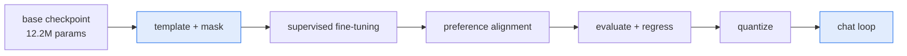

# From Base Model to Assistant

The base model from the previous build continues text. Ask it a question and it writes more question.
That is not a defect — continuation is exactly what it was trained to do, and it is what every base
model does.

A chat model answers. The difference is not intelligence and it is not scale. **It is a format the
model has been taught**, plus enough behaviour training that it uses the format instead of ignoring
it.

By the end of this build you will have:

- Designed a **conversation template** and understood why its markers are plain text here rather than
  new token ids.
- Implemented **multi-turn loss masking** — every assistant turn graded, every user turn masked.
- Written instruction data that sits **inside the base model's distribution**, and understood why
  that constraint is not optional.
- Run **supervised fine-tuning** and **preference alignment** by composing existing toolkits rather
  than writing new ones.
- Measured what it bought **and what it cost**, with a regression check.
- **Quantized** the result and talked to it.

The runnable companion is
[small-chat-model](/python/python-production-examples/small-chat-model/readme). The whole arc takes
about twenty seconds on a processor.

---

## What actually changes

| | Base model | Chat model |
|---|---|---|
| Trained on | raw text | conversations in a fixed format |
| Given a question | continues it | answers it |
| Knows when to stop | no | yes — the end marker is in the graded span |
| Scored by | perplexity | did it follow the instruction |
| Loss covers | every token | assistant tokens only |

The last row is the mechanism. Everything else follows from it.

---

## The arc, and who owns each stage



Six stages, and **only the two highlighted ones are written in this project**. The rest already exist
in this repository and are called:

| Stage | Owner |
|---|---|
| Supervised fine-tuning | [fine-tuning-toolkit](/python/python-production-examples/fine-tuning-toolkit/readme) |
| Preference alignment | [rlhf-alignment](/python/python-production-examples/rlhf-alignment/readme) |
| Quantization | [model-compression](/python/python-production-examples/model-compression/readme) |
| The base model, tokenizer, perplexity | [small-language-model](/python/python-production-examples/small-language-model/readme) |

That is a deliberate design decision and the next section is why.

---

## Why this build composes rather than implements

The obvious version of this project builds all six stages. It was scoped that way, and rescoped,
because building it would have made it **the fourth implementation of supervised fine-tuning in this
repository** and the second of both preference optimization and quantization.

Four copies of one recipe means four places for it to be wrong, and three of them will be, within a
year. The value here is not another fine-tuner — it is the **join**: what the base checkpoint hands
the template, what the template hands the trainer, what the trainer hands the aligner, and what
breaks at each seam.

What is genuinely unowned, and therefore written here:

- **Multi-turn conversation templating with loss masking.** The existing toolkit grades the *final*
  assistant turn and treats everything before it as conditioning — right for single-turn instruction
  data, and it throws away half of a dialogue.
- **The chat loop.** Rendering history in exactly the trained format, stopping at the end marker,
  dropping whole turns when the window fills.

One more piece makes it possible: an **adapter**, about thirty lines, that presents the base model
through the calling convention all three toolkits use. Chapter four covers it.

---

## The result, up front

```text
templated: 24 records (8 multi-turn), 54.6% of tokens graded
fine-tuned: 3,540,864 of 12,194,688 parameters trainable (29.0% of the model); 120 steps; final loss 0.8180
aligned: 40 steps; preference accuracy 1.00; reward margin 8.6404
format adherence: base 0% -> chat 100% over 6 held-out prompts
reply length: base 64.0 -> chat 19.8 tokens
regression check (pretraining perplexity): base 81.89 -> chat 243.84
quantized (qnnpack): 48,796,775 -> 18,663,339 bytes (61.8% smaller)
```

**Format adherence went from nothing to everything**, and mean reply length fell from the full token
budget to twenty tokens — the same fact measured twice. The model learned to answer and to stop.

**Pretraining perplexity got three times worse.** Twenty-four conversations moved three and a half
million parameters, and general language modelling paid for it. A chat evaluation that reported only
the win would have hidden that, which is why the regression check is in the same line of output.

**The replies do not mean anything.** A twelve-million-parameter model trained on twenty-four
conversations learns a format, not a subject. Chapter seven says so with numbers rather than
apologising for it.

---

## What is deliberately not claimed

- **Not helpfulness.** Nothing here measures whether an answer is useful, because nothing at this
  scale could.
- **Not safety.** No refusal training, no red-teaming, no harmful-content evaluation.
- **Not a model you should serve.** It is a build you should be able to run and reason about.

Those are all real stages of real post-training, and the Workflow Library covers them. This build is
the spine they attach to.

---

## Before you start

The base checkpoint has to exist first — this build cannot invent one:

```bash
cd python_based/python-production-examples/small-language-model
PYTHONPATH=. python -m slmkit.cli run --preset scale --device cpu     # about twelve minutes

cd ../small-chat-model
COMPOSED=".:../small-language-model:../fine-tuning-toolkit:../rlhf-alignment:../model-compression"
PYTHONPATH=$COMPOSED python -m pytest -q                              # 31 tests
PYTHONPATH=$COMPOSED python -m chatkit.cli run                        # about twenty seconds
```

## Key takeaways

- **A base model continues; a chat model answers.** The difference is a taught format, not a
  capability.
- **The loss covering assistant tokens only** is the mechanism everything else follows from.
- **Compose the stages that exist.** Four implementations of one recipe is four places to be wrong.
- **The honest measure at this scale is format adherence**, and the honest report includes what it
  cost.

## References

- The runnable project:
  [small-chat-model](/python/python-production-examples/small-chat-model/readme)
- The base model it starts from:
  [Build a Small Language Model](/ai-ml/ai-ml-learning-resources/model-building/build-a-small-language-model/why-build-a-model-from-scratch)
- Ouyang et al., *Training language models to follow instructions with human feedback* — the paper
  that established this arc: <https://arxiv.org/abs/2203.02155>
