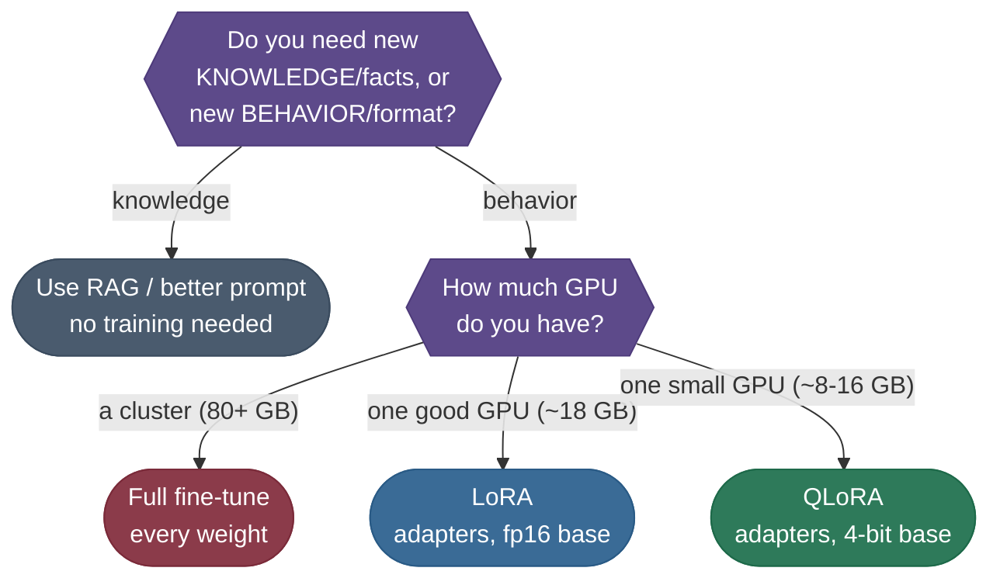

# Chapter 0 — Decide Whether to Fine-Tune

Fine-tuning is the expensive answer, so this chapter tries to talk you out of
it first — and then, if you genuinely need it, picks the cheapest method that does the job.

**Fine-tuning teaches behavior; retrieval teaches knowledge.** If what you need is facts, a
changing knowledge base, or fast iteration, a better prompt or RAG is cheaper and safer. You
fine-tune to change *how* a model answers — its format, its voice, when it stops.

By the end of this chapter you will be able to:

- Tell a **knowledge** problem from a **behavior** problem, and route each to the right tool.
- Choose between **full fine-tuning**, **LoRA**, and **QLoRA** from the GPU you actually have.
- Read the **cost table** and know, before spending anything, what a 7B run will take in VRAM,
  wall-clock, and data.

We carry one concrete task through the whole course: turning **Mistral-7B** into a customer
support **"Support Specialist"** that answers *"How do I reset my password?"* in your house
voice and stops cleanly.

---

Here's the journey as a checklist before we zoom in — you'll be doing these in order:

1. **Pick the method** — full fine-tune vs LoRA vs QLoRA vs just prompting/RAG; the choice sets your entire budget.
2. **Do the memory math** — count bytes per parameter, then quantize the frozen base to 4-bit (NF4) so a 7B model fits on a small GPU.
3. **Locate where to adapt** — the attention projections (`q_proj`/`k_proj`/`v_proj`), the matrices LoRA will touch.
4. **Attach LoRA adapters** — two skinny low-rank matrices in parallel to each frozen layer; <1% of params become trainable.
5. **Format the data** — wrap `(prompt → ideal answer)` pairs in the model's chat template, mask the prompt, always end with EOS.
6. **Train (SFT)** — dial the knobs (learning rate, gradient accumulation, warmup, weight decay) and update only the adapters.
7. **Evaluate** — ROUGE-L, BERTScore, and perplexity against a held-out set; stop at the validation-loss minimum.
8. **Save & serve** — ship the tiny adapter and hot-swap adapters on one shared base model.

**The whole journey on one map** — every box below is a section, in order:


---

## Choosing Your Fine-Tuning Approach

Before any code, pick the method — it's the decision that sets your whole budget. The very first question, though, is whether you should fine-tune *at all*: if you only need to add **knowledge** (facts, docs, a changing knowledge base), **retrieval (RAG) or a better prompt is cheaper and safer** than fine-tuning — you fine-tune to change *behavior, format, or style*, not to memorize facts. Once you've decided you genuinely need to change behavior, two questions pick the method: **how much compute do you have**, and **how deep a change do you need**.

| Approach | What actually trains | VRAM for a 7B model | Reach for it when |
|---|---|---|---|
| **Prompt / RAG** | *Nothing* — no training | ~0 (inference only) | You need **knowledge or facts**, fast iteration, or a moving target — try this *first* |
| **Full fine-tuning** | *Every* weight | ~80–90 GB (multi-GPU) | You have a cluster, lots of data, and need to change the model deeply |
| **LoRA** | Small adapters; base stays fp16 | ~18 GB | You have one good GPU and want fast, cheap task adaptation |
| **QLoRA** | Small adapters; base squeezed to 4-bit | **~8 GB** | A single consumer/Colab GPU — **the default for most fine-tuning today** |

> **Tip:** Reach for **QLoRA** by default. It fits a 7B fine-tune under a single 16 GB GPU, ships a tiny `~150 MB` adapter, and loses almost nothing versus full fine-tuning for task adaptation. Step up to **LoRA** (fp16 base) only if 4-bit hurts quality on your task, and to **full fine-tuning** only when you're changing the model deeply with a cluster's worth of compute. **Fine-tuning teaches behavior; RAG teaches knowledge** — don't fine-tune to memorize facts.

This decision flow is the whole choice in one picture — walk it top to bottom:



And a second axis — *what* you're teaching:
- **SFT (Supervised Fine-Tuning / instruction tuning)** — teach a *behavior or format* from example `(prompt → ideal answer)` pairs. This is what this guide walks through.
- **Preference tuning (DPO/RLHF)** — teach a *preference* ("answer A is better than B") to align tone and helpfulness. A later step, usually *after* SFT — see the [RLHF & Alignment (workflow)](/ai-ml/practitioner-workflows/training-and-adaptation/preference-alignment) for the full preference-tuning pipeline.

The rest of this guide takes the **QLoRA + SFT** path — the one that fits on a single GPU and covers 90% of real fine-tuning.

### Setup and what a real run costs

The runnable demos later in this guide need nothing but PyTorch and download nothing. For a real fine-tune you'll want the standard PEFT stack:

```bash
uv pip install torch transformers peft trl datasets bitsandbytes accelerate
# verified with: torch 2.12, transformers 5.10, peft 0.19, trl 1.5, datasets 5.0
# bitsandbytes (the 4-bit backend) needs a CUDA GPU; the CPU demos here skip it.
```

Before committing GPU budget, calibrate expectations. These are **order-of-magnitude ballparks** for fine-tuning a **7B** model on a few thousand instruction pairs — real numbers swing with sequence length, batch size, and how many epochs you run:

| | **QLoRA (4-bit)** | **LoRA (fp16)** | **Full fine-tune** |
|---|---|---|---|
| **VRAM** | ~8-16 GB (1× consumer GPU) | ~18-24 GB (1× 24 GB GPU) | ~80-90 GB (multi-GPU node) |
| **Wall-clock** | ~1-3 GPU-hours | ~1-3 GPU-hours | ~10-40+ GPU-hours |
| **Dataset** | a few hundred to ~10k pairs | a few hundred to ~10k pairs | tens of thousands+ |
| **Ships** | a `~150 MB` adapter | a `~150-400 MB` adapter | a full `~14 GB` checkpoint |
| **Reality** | runs on a free Colab T4 | one rented GPU | a cluster + babysitting |

> **Note:** The single biggest lever on cost is **QLoRA**: quantizing the frozen base to 4-bit and training only adapters fits a 7B run on a free Colab T4, where a full fine-tune of the same model needs an order of magnitude more VRAM. That gap is the entire reason QLoRA became the default.

---

## Production implementation

Runnable services in this estate that implement what this page teaches:

- **[fine-tuning-toolkit](/python/python-production-examples/fine-tuning-toolkit/readme)** — the end-to-end path this chapter is deciding whether to take, runnable on one GPU.

## References

- [Transfer Learning & Fine-Tuning (7.03)](/ai-ml/ai-ml-intuitions/scaling-adaptation-efficiency/transfer-learning-and-fine-tuning-intuition) — the freeze/unfreeze spectrum.
  - [Context Engineering (8.11)](/ai-ml/ai-ml-intuitions/memory-retrieval-context/context-engineering-intuition) — getting the most from the fine-tuned model at inference.
  - [Pruning & Sparsity (7.10)](/ai-ml/ai-ml-intuitions/scaling-adaptation-efficiency/pruning-and-sparsity-intuition) — complementary compression.
  - [LoRA & QLoRA Fine-tuning Explained In-Depth (Mark Hennings)](https://www.youtube.com/watch?v=t1caDsMzWBk)
  - [QLoRA — How to Fine-tune an LLM on a Single GPU, with code (Shaw Talebi)](https://www.youtube.com/watch?v=XpoKB3usmKc)
  - [Fine-tuning LLMs with PEFT and LoRA (Sam Witteveen)](https://www.youtube.com/watch?v=Us5ZFp16PaU)
  - [Efficient Fine-Tuning for Llama-2-7B on a Single GPU (DeepLearning.AI)](https://www.youtube.com/watch?v=g68qlo9Izf0)
  - [LLM Fine-Tuning Crash Course — 1-hour end-to-end (AI Anytime)](https://www.youtube.com/watch?v=mrKuDK9dGlg)
  - [Hugging Face LLM Course — Fine-tuning chapter](https://huggingface.co/learn/llm-course/chapter11/1) — hands-on with `transformers`/`trl`.
  - [*Hands-On Large Language Models* (Alammar & Grootendorst, 2024)](https://github.com/HandsOnLLM/Hands-On-Large-Language-Models) — free open code companion; fine-tuning & PEFT chapters.
  - [*AI Engineering* (Chip Huyen, 2025)](https://huyenchip.com/books/) — Chapter 7 (Finetuning).
