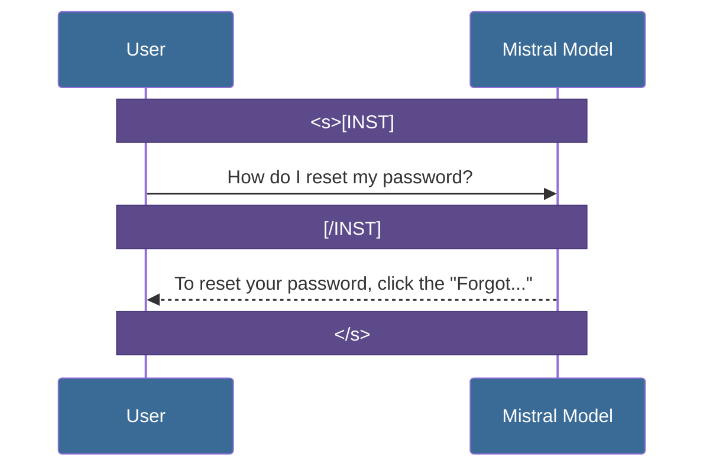
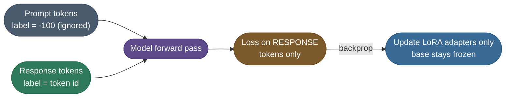

# Chapter 1 — Prepare the Instruction Data

A fine-tune is only as good as the pairs you feed it, and most failed
fine-tunes are **data bugs, not training bugs**. This chapter builds one training record
correctly, end to end.

Two rules carry most of the weight, and both are invisible until they bite:

- **Mask the prompt** — set the prompt tokens' labels to `-100` so the model learns to answer,
  not to re-predict the question.
- **Always end with EOS** — `</s>` is what teaches the model to stop; omit it and it rambles
  into invented turns.

By the end of this chapter you will be able to read a model's chat protocol, render a
`(prompt → ideal answer)` pair into it, and prove by inspection which tokens the loss is
actually grading.

---

A model's "brain" is one thing; its "behavior" is another. Mistral-7B-Instruct isn't just a language predictor; it's trained to follow a specific **Social Contract** called the Chat Protocol.

### The Anatomy of the Protocol
Mistral uses specific "control tokens" to manage the state of a dialogue. If you get these wrong, the model will treat your instruction as just "more text" to complete, rather than a command to follow.

1.  **`<s>` (BOS - Beginning of Stream)**: This is like a "Hard Reset." It clears the model's internal attention cache, signaling that a brand-new conversation is starting.
2.  **`[INST]` and `[/INST]` (Instruction Markers)**: These are the boundaries of the "Safe Zone." Everything inside is considered a command.  
3.  **`</s>` (EOS - End of Stream)**: The single most important token for support. It signals the model to **STOP**. 

#### Visualizing the Sequence

Watch one exchange flow through the control tokens — `<s>[INST]` opens the user turn, `[/INST]` closes it and hands control to the model, and `</s>` is the model signalling it is done:



The takeaway: the tokens are not decoration — they are the brackets that tell the model where your command ends and where its answer must stop. Drop the `</s>` and it never learns to stop, which is exactly the failure shown next.

#### The Hallucination Problem (The "Missing Stop" Example):
What happens if you forget the stop token in your training data?

| **Correct Behavior (with `</s>`)** | **Broken Behavior (without `</s>`)** |
| :--- | :--- |
| **User**: How do I reset my password? | **User**: How do I reset my password? |
| **Model**: Click "Forgot..." and follow the link. **[STOP]** | **Model**: Click "Forgot..." and follow the link. **User**: Thanks! **Model**: You're welcome! Let me know if you need... **User**: [hallucinated babbling continues...] |

> **Note:** Mistral was trained specifically to attend to these tokens — this is how it distinguishes **knowledge** (internal weights) from **directives** (external commands). Without the EOS token, the model thinks its job is to "keep the story going" rather than to "answer the prompt."

---

## Preparing the Training Data

Fine-tuning is only as good as its data. For instruction tuning (SFT) you need `(prompt → ideal response)` pairs, each wrapped in the model's chat template (the `<s>[INST]…[/INST]…</s>` protocol above) and then tokenized. A single example, as JSONL:

```json
{"messages": [
  {"role": "user", "content": "How do I reset my password?"},
  {"role": "assistant", "content": "Click 'Forgot password' on the login page, then follow the emailed link."}
]}
```

The trainer renders this into the model's exact chat format, then tokenizes it into ids the model consumes:

```text
<s>[INST] How do I reset my password? [/INST] Click 'Forgot password' ... </s>
        │ tokenize
        ▼
[1, 733, 16289, 28793, 1602, 511, 315, ...]      # ~30 integer token ids
```

| Part | Example | Why it matters |
|---|---|---|
| **Prompt** | the user question | The *condition* — and it's **masked out of the loss** |
| **Response** | the ideal answer | The **only** tokens the model is trained to produce |
| **Template** | `<s>[INST]…[/INST]…</s>` | Must match the base model's *exact* format |
| **EOS** | `</s>` | Teaches the model to **stop** (omit it → rambling) |

Two rules make or break SFT data: **(1) mask the prompt** — set the prompt tokens' labels to `-100` so the model learns to *answer*, not to re-predict the question; **(2) always include the EOS** so it learns to stop. And a counterintuitive truth: **a few hundred clean examples beat tens of thousands of noisy ones** — format consistency and quality dominate sheer volume. For our **Support Specialist**, that means a few hundred real, well-formatted ticket→reply pairs in *your* support voice, not a scraped pile of generic Q&A. The upstream curation, dedup, and decontamination that produce a clean set live in [Data Preparation (workflow)](/ai-ml/practitioner-workflows/data-and-inputs/data-preparation).

> **Warning:** The prompt mask is the silent killer. If you forget to set prompt-token labels to `-100`, the model is trained to *re-predict the user's question* as well as the answer — it learns to parrot prompts back and its replies degrade. Always inspect that the loss is computed on the response tokens only before you trust a run.

**Here's what one real record looks like after masking.** Take the Support Specialist's password-reset pair and walk it token by token. The trainer renders the chat template, tokenizes it, and builds a parallel `labels` array — identical to `input_ids` except every **prompt** position is overwritten with `-100` (PyTorch's "ignore" sentinel), so the cross-entropy loss simply skips it:

```text
                  ┌──────────────── PROMPT (masked, label = -100) ───────────────┐┌──── RESPONSE (trained) ────┐
 token (text)  :  <s>  [INST]  How  do  I  reset  my  password ?  [/INST]   Click  'Forgot  password' ...   </s>
 input_ids     :   1    733    1602 511 315  …      …     …        …          …      …          …             2
 labels        : -100  -100   -100 -100 -100 -100  -100  -100     -100      Click  'Forgot  password' ...   </s>
                  └── model SEES these (condition) but is NOT graded on them ──┘└─ the ONLY tokens it learns ─┘
```

Every position left of `[/INST]` carries `label = -100`, so it conditions the model (it can attend to the question) but contributes **zero** to the loss; only the answer tokens — *including the final `</s>`* — are graded. Run the byte-level stand-in below and you can see the exact split for this record: the prompt span is masked, the response span (answer + EOS) is what the loss actually sees.

```python
# Runnable masking demo: build ONE instruction-tuning record the way SFT does,
# then show which token labels are masked (-100 = ignored) vs trained on.
# Pure-Python byte tokenizer so it runs offline on CPU (no model download).

# The chat template splits into a PROMPT span (the question) and a RESPONSE span
# (the ideal answer + EOS). Mistral's real markers are <s>[INST] ... [/INST] ... </s>.
prompt   = "<s>[INST] How do I reset my password? [/INST]"
response = " Click 'Forgot password' on the login page, then follow the link.</s>"

# Tokenize each span to byte ids (a stand-in for the real BPE tokenizer's ids).
enc = lambda s: list(s.encode("utf-8"))
prompt_ids, response_ids = enc(prompt), enc(response)
input_ids = prompt_ids + response_ids

# THE ONE RULE: prompt label = -100 (ignored by the loss); response label = the id.
labels = [-100] * len(prompt_ids) + response_ids

# The loss is averaged over only the positions whose label != -100.
trained = sum(1 for x in labels if x != -100)   # answer tokens, incl. EOS
masked  = sum(1 for x in labels if x == -100)    # the whole prompt span
print(f"prompt tokens  (masked, label=-100): {masked}")
print(f"response tokens (trained on)       : {trained}")
print(f"total tokens                       : {len(input_ids)}")
print(f"fraction graded by the loss        : {100*trained/len(input_ids):.0f}%")
print(f"first 8 labels (prompt span)       : {labels[:8]}")
print(f"labels around the [/INST] boundary : {labels[len(prompt_ids)-3:len(prompt_ids)+3]}")

# Expected output:
# prompt tokens  (masked, label=-100): 45
# response tokens (trained on)       : 69
# total tokens                       : 114
# fraction graded by the loss        : 61%
# first 8 labels (prompt span)       : [-100, -100, -100, -100, -100, -100, -100, -100]
# labels around the [/INST] boundary : [-100, -100, -100, 32, 67, 108]
```

The last line is the proof: the three positions just before the `[/INST]` boundary are still `-100` (prompt), and the moment the answer begins the labels flip to real ids (`32, 67, 108` — the bytes of `" Cl"`). That flip *is* the prompt mask. (At the real BPE level this record is ~30 tokens, not 114 bytes, but the mask works identically — only the answer span is graded.)

**The training step, in one picture** — the prompt is *masked* (so the model is graded only on the answer it should produce), and only the LoRA adapters receive updates while the base stays frozen:



> **Note:** Most "the fine-tune didn't work" bugs are *data* bugs — a wrong chat template, a missing EOS, or an unmasked prompt. Inspect a few fully-rendered, tokenized examples before you ever hit "train".

---

## Production implementation

Runnable services in this estate that implement what this page teaches:

- **[fine-tuning-toolkit](/python/python-production-examples/fine-tuning-toolkit/readme)** — instruction-data formatting with the template and masking applied before a single step runs.
- **[synthetic-data-generator](/python/python-production-examples/synthetic-data-generator/readme)** — where that data comes from when you do not have enough of it.

## References

  - [Data Preparation (workflow)](/ai-ml/practitioner-workflows/data-and-inputs/data-preparation) — curating, deduping, and decontaminating the instruction data this guide trains on.
