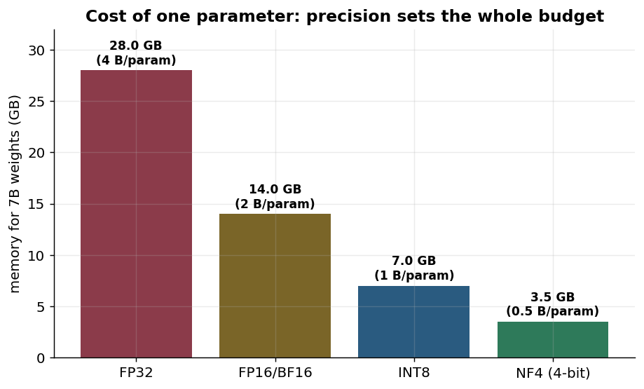
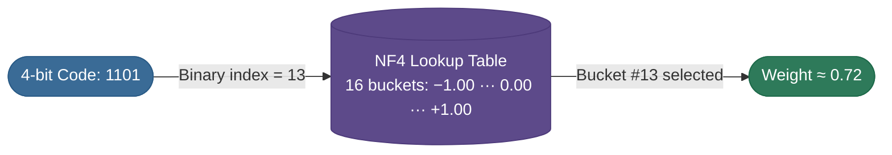
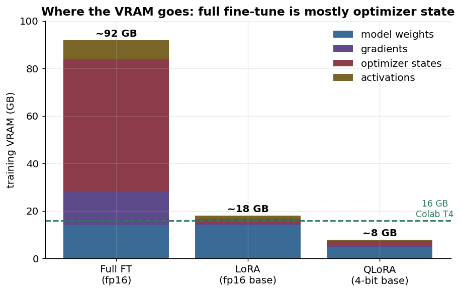
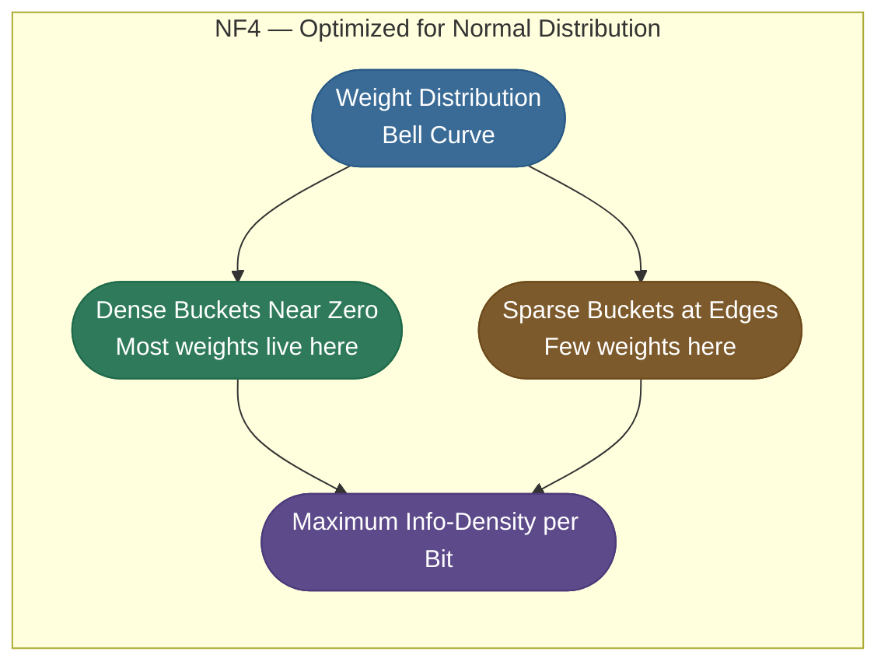
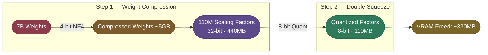
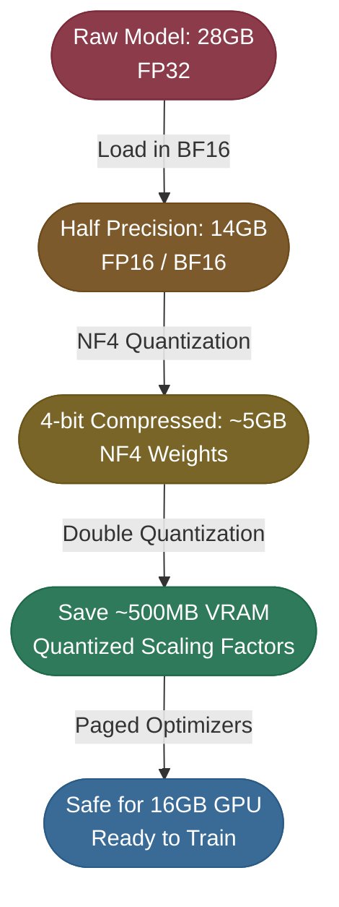
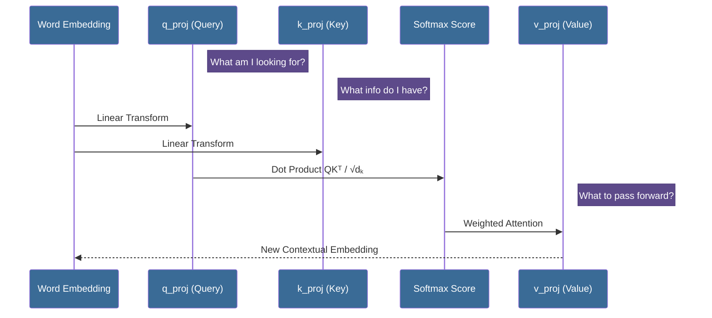

# Chapter 2 — Build the Supervised Fine-Tuning Baseline

Before adapters, understand the run you are avoiding. This chapter does the
memory arithmetic for a naive full fine-tune and finds where in seven billion parameters the
change actually needs to land.

Both answers are load-bearing for everything after them:

- **The optimizer, not the model, is what makes full fine-tuning expensive** — trace the four
  memory buckets and the total lands near 92 GB, most of it optimizer state.
- **The attention projections are where behavior lives** — `q_proj`, `k_proj`, `v_proj`, the
  three matrices the next chapter adapts.

By the end you will be able to compute a fine-tune's VRAM budget from parameter count and
precision alone, and say exactly which matrices a behavior change has to touch.

---

We picked QLoRA — but *why* is it the default, and what do NF4, double-quant, and paged optimizers actually buy us? Every answer traces back to one bottleneck. In engineering, a system is defined by its tightest constraint, and for LLMs that constraint is **Video RAM (VRAM)**. So we start exactly where every fine-tuning decision starts: the **cost of a single parameter**.

### The Math of Precision (FP32 to 4-bit)
Every one of the 7 billion parameters in Mistral is a mathematical weight. The memory it consumes depends on its **Precision**:

- **FP32 (Full Precision)**: Each weight is a 32-bit float (4 bytes).  
  *Calculation: 7 Billion × 4 bytes = **28 GB**.*
- **FP16/BF16 (Half Precision)**: Each weight is a 16-bit float (2 bytes).  
  *Calculation: 7 Billion × 2 bytes = **14 GB**.*
- **4-bit Quantization**: Each weight is compressed into just 4 bits (0.5 bytes).  
  *Calculation: 7 Billion × 0.5 bytes = **3.5 - 5 GB** (including over-head).*

The picture is stark when you plot it — each step down in precision halves the footprint of every one of the 7 billion weights:

> **Note:** Memory equals **parameter count × bytes per parameter** — nothing more for the weights themselves. A 7B model is "7B" regardless of precision; what changes is the bytes you spend on each weight. That one multiplication is the foundation under every fine-tuning budget decision below.

### Precision Comparison: Bit-Width Visualized
A single parameter's "footprint" in memory shrinks dramatically as we lower precision. This is why we can fit the 28GB model into a standard GPU.

**What’s inside those bits?**
#### FP32 (Full Precision) - 32 Bits

```mermaid
gantt
    title FP32 Bit Structure (1-8-23)
    dateFormat  X
    axisFormat  %s
    section Sign (1)
    S : 0, 1
    section Exponent (8)
    E : 1, 9
    section Mantissa (23)
    M : 9, 32
```

#### FP16 (Half Precision) - 16 Bits

```mermaid
gantt
    title FP16 Bit Structure (1-5-10)
    dateFormat  X
    axisFormat  %s
    section Sign (1)
    S : 0, 1
    section Exponent (5)
    E : 1, 6
    section Mantissa (10)
    M : 6, 16
```

#### 4-bit (NF4) - 4 Bits (The Paradigm Shift)
In **NF4 (NormalFloat 4)**, the 4 bits don't store a "Sign" or "Exponent." Instead, those 4 bits act as a **Lookup Index** into a table of 16 pre-defined values. These values are strategically placed to match the statistical "bell curve" of the model's weights.

**What are those 4 bits exactly?**
Instead of mathematical components, they represent **1 of 16 discrete states** ($2^4 = 16$):
- **0000 to 1111**: Each binary code points to one of the 16 "optimized" points on the Gaussian curve.
- **Why this works**: A 7B model is highly redundant. We don't need to know if a weight is precisely `0.723456...`; we just need to know it is "roughly in the 13th bin of importance."

*Source: Dettmers et al., 2023 — QLoRA: Efficient Finetuning of Quantized LLMs ([arXiv](https://arxiv.org/abs/2305.14314))*

**Key Takeaway**: By moving to 4-bit, we aren't just shortening the number; we are changing how information is stored, relying on a **probability distribution** instead of bit-level floating point arithmetic.

### The VRAM Hierarchy: Why 14GB isn't enough for a 16GB GPU
You might think, "If 14GB fits in 16GB, why do we need 4-bit?" The answer lies in the **Training Overhead**:
1. **Model Weights**: The 14GB "Body" of the model.
2. **Optimizer States**: The "Brain" needs memory to calculate updates (e.g., AdamW needs 8 bytes per parameter).
3. **Gradients**: The "Direction" of learning (4 bytes per parameter).
4. **Activations**: Temporary memory used during the forward pass to store intermediate results.

Let's trace the actual numbers for **full** fine-tuning of Mistral-7B in mixed precision, because the total is what shocks people — and it's *mostly not the model*:

- **Weights** (fp16): 7B × 2 bytes = **14 GB**
- **Gradients** (fp16, one per weight): 7B × 2 bytes = **14 GB**
- **AdamW optimizer states** (fp32 master copy + two moments, ~8 bytes/param when the master weights are counted): 7B × 8 bytes = **~56 GB**
- **Activations** (forward-pass intermediates, batch/sequence-dependent): **~8 GB**

That's **14 + 14 + 56 + 8 ≈ 92 GB** — and the single biggest chunk is the **optimizer**, not the model. This is exactly the leverage LoRA exploits: freeze the weights and there are no gradients or optimizer states *for them at all*. The deep dive on the data types themselves is in [Quantization (7.05)](/ai-ml/ai-ml-intuitions/scaling-adaptation-efficiency/quantization-intuition).

**The Reality**: Training Mistral-7B in FP16 the naive (full) way requires nearly **90 GB of VRAM**. On platforms like **Google Colab (T4 GPU)** or **Hugging Face Spaces**, we only have **16 GB**.

The picture below makes the gap concrete — full fine-tuning is dominated by the *optimizer states*, which is exactly what LoRA and QLoRA eliminate:

The lesson the chart makes obvious: **full fine-tuning's cost is mostly the optimizer**, not the model. Freeze the model (LoRA) and that bar collapses; quantize the frozen model too (QLoRA) and you slip under a 16 GB GPU.

### The Quantization Breakthrough: NF4 & Double Quant
To solve the "38GB model in a 16GB GPU" problem, we use the QLoRA "Holy Trinity." These aren't just simple compression tricks; they are clever exploitations of the model's statistical and hardware properties.

#### 1. Why NormalFloat 4 (NF4) is the "Smarter" Choice
In a standard **INT4 (Integer 4)** quantization, we divide the range [-1, 1] into 16 equally sized buckets. 
- **The Problem**: A well-trained LLM like Mistral has weights that form a **Normal (Gaussian) Distribution**. This means 90% of your weights are clustered around zero, while only a few "Outliers" are near -1 or 1.
- **The Inefficiency**: Equal buckets waste precious precision on the empty edges, while cramming most of the important weights into just 2 or 3 central buckets. This leads to massive information loss.

**The NF4 Solution:** 
NF4 isn't linear. It places its 16 buckets more densely around zero and more sparsely at the edges. 
- **The Analogy**: Imagine taking a photo. A standard quantization is like a cheap fixed-focus lens. NF4 is like a professional "Portrait" lens—it shifts its resolution to where the "Subject" (the most frequent weights) is, while blurring the less important background (the out-of-distribution outliers).

Read it as a budget decision: because almost every weight sits near zero, NF4 spends its 16 buckets where the weights actually are (dense near zero, sparse at the edges) — so the same 4 bits carry far more usable information than evenly-spaced INT4 buckets would.

The QLoRA authors measured this directly: across benchmarks, NF4 beats plain 4-bit float/int — see [Dettmers et al., 2023 — Figure 3 (NormalFloat vs other 4-bit types)](https://ar5iv.labs.arxiv.org/html/2305.14314/#S3.F3), CC BY 4.0.

#### 2. Double Quantization: The "Inception" of Compression
This is arguably the most "clever" part of the QLoRA paper. To understand it, we need to look at the **Metadata** of quantization.

- **The Problem**: When we compress weights into 4-bit, we can't just leave them like that. We need a **Scaling Factor** (a 32-bit float) for each block of weights (usually 64 weights) to tell the model: *"Multiply these 4-bit numbers by X to get the real value."*
- **The VRAM Leak**: In a 7-billion parameter model, you have roughly **110 million** of these scaling factors. 
  - *Calculation: 110M factors × 4 bytes (32-bit) = **~440 MB**.*
  - While 440MB sounds small, on a 16GB GPU already stuffed to the limit, this is often the "tipping point" that causes a crash.

**The Double-Quant Solution:**
We treat these 440MB of scaling factors as just another dataset and **quantize them too!** We compress these 32-bit floats into **8-bit floats**.
- *New Calculation: 110M factors × 1 byte (8-bit) = **~110 MB**.*
- **Outcome**: We just "magically" reclaimed **330 MB** of VRAM. This is why we call it "Inception"—we are quantizing the data that was created by the first round of quantization.

> **Note:** Double quantization is the final squeeze. It is often the single reason we can fit a 7B model onto a free Google Colab instance without a "Runtime Disconnected" error.

#### 3. Paged Optimizers: The Virtual Memory of GPUs
The most common cause of a training crash is the **Gradient Spike**. During certain mathematical operations, the VRAM usage can suddenly jump by 1-2GB for just a fraction of a second. If your GPU hits 100% capacity at that moment, it errors out (OOM).

- **How it works**: Paged Optimizers leverage the **NVIDIA Unified Memory** feature. When the VRAM hits the limit, the driver "pages" the **Optimizer States** (the largest non-active objects in memory) out to the CPU RAM.
- **The Result**: Instead of a crash, you get a minor "latency hiccup." The training slows down for a second, offloads the data, performs the math, and then pulls the notes back onto the GPU. This transforms a "Fatal Error" into a "Smooth Performance Penalty."

**Summary**: These three technologies—**NF4**, **Double Quantization**, and **Paged Optimizers**—work together like a precision Swiss watch to ensure that every single bit of your 16GB GPU is used to its absolute maximum potential.

Here is the whole compression journey as one chain — each arrow is one of the techniques above, and the box it lands on is the new memory footprint:

> **Note:** Quantization is a trade-off between precision and accessibility. By using NF4 we accept a negligible drop in mathematical purity to gain the ability to train on accessible hardware — the engineering of the possible.

---

---

## Where Fine-Tuning Acts: Attention (Q·K·V)

Memory: solved. The next question is *where* in those 7 billion parameters our fine-tuning actually lands — because we won't touch most of them. The answer is the **self-attention** layers, where the model decides which words matter to each other. Attention runs on three projection matrices — **Query (`q_proj`)**, **Key (`k_proj`)**, and **Value (`v_proj`)** — and these are exactly the matrices LoRA will adapt in the next section. **Adapting the attention projections is enough** to teach most task behaviors; the deep dive on how these matrices route information is in [Multi-Head Attention (4.08)](/ai-ml/ai-ml-intuitions/architectural-mechanisms/multi-head-attention-intuition).

### The Math of Context
When a word enters the model, it is multiplied by these matrices:
1.  **Query ($Q$)**: "What am I looking for?"
2.  **Key ($K$)**: "What information do I have?"
3.  **Value ($V$)**: "What information should I pass along?"

The Attention Score is calculated as:
$$\text{Attention}(Q, K, V) = \text{softmax}\left(\frac{QK^T}{\sqrt{d_k}}\right)V$$

*Source: Vaswani et al., 2017 — Attention Is All You Need ([arXiv](https://arxiv.org/abs/1706.03762))*

Trace one word through the three projections — it is multiplied by `q_proj` and `k_proj`, those scores decide *which* other words to listen to, and `v_proj` decides *what* to pass forward:

Read the loop top to bottom: every arrow into `q_proj`, `k_proj`, and `v_proj` is a matrix multiply — and those three matrices are precisely the ones LoRA will adapt next, which is why touching them is enough to change behavior.

---

## Production implementation

Runnable services in this estate that implement what this page teaches:

- **[fine-tuning-toolkit](/python/python-production-examples/fine-tuning-toolkit/readme)** — the supervised baseline and its memory profile, beside the adapter run that replaces it.

## References

  - [Multi-Head Attention (4.08)](/ai-ml/ai-ml-intuitions/architectural-mechanisms/multi-head-attention-intuition) — the q/k/v projections LoRA adapts.
  - [Quantization (7.05)](/ai-ml/ai-ml-intuitions/scaling-adaptation-efficiency/quantization-intuition) — NF4, INT4/INT8, double-quant in depth.
  - [Attention Is All You Need (Vaswani et al., 2017)](https://arxiv.org/abs/1706.03762) — scaled dot-product attention (the Q·K·V math LoRA adapts).
