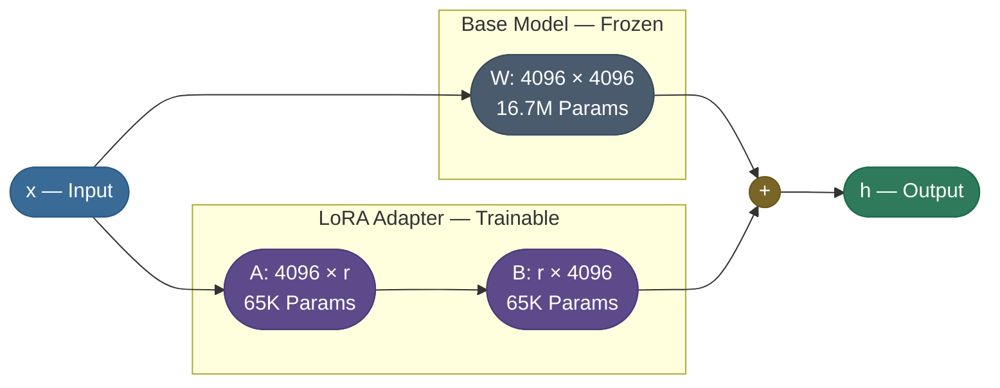
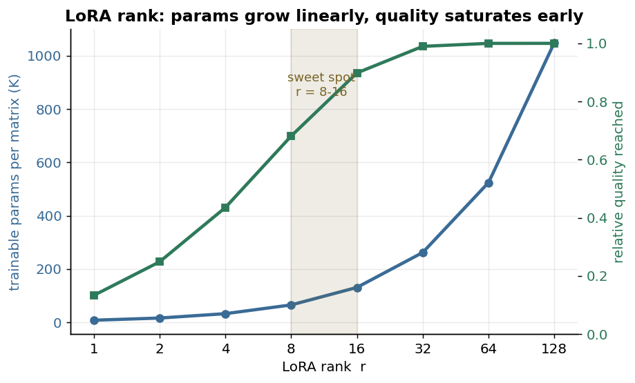
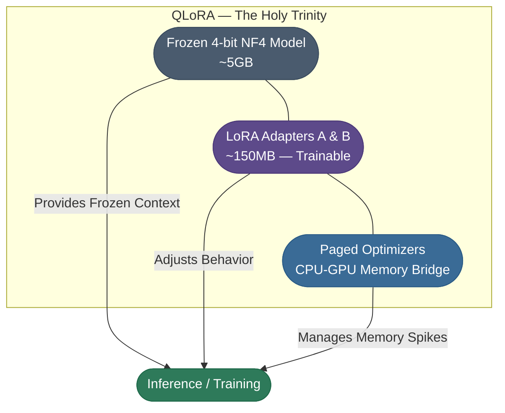

# Chapter 3 — Apply LoRA and QLoRA

This is the chapter where the 7-billion-parameter problem becomes a
131,072-parameter one.

**LoRA's move is to not update the base at all.** Freeze the model, hang two skinny low-rank
matrices beside each attention projection, and train only those — under 1% of each matrix.
**QLoRA adds the second half**: squeeze the frozen base to 4 bits so it fits on one small GPU
while the adapters train on top.

By the end of this chapter you will be able to:

- Explain **why** a low-rank update is enough, and pick a rank `r` from the quality curve
  rather than from folklore.
- Attach real `peft` adapters and read back what fraction of the model is trainable.
- Name what each of QLoRA's three pieces buys — **NF4**, **double quantization**, and **paged
  optimizers** — and which failure each one prevents.

The runnable demo at the end trains a real LoRA adapter on CPU, offline, and saves the tiny
adapter file that is the whole point.

---

We know *where* to make changes (the attention projections) and *how* to fit the model in memory (quantization). Now the heart of the matter — the **Fine-Tuning Paradox**: how do you update a 7-billion-parameter model *without* a million-dollar cluster? **LoRA (Low-Rank Adaptation)** answers it with a beautiful sleight of hand: **don't update the 7 billion at all.**

### The "Sticky Note" Analogy (Matrix Decomposition)
Imagine you are a world-class chef (The 7B Model). You already know everything about cooking. Now, a client wants you to cook specifically for a **Vegan Support Event**. 
- You don't need to relearn "How to Chop" or "How to Grill" (the base weights). 
- You just need to keep a small **"Cheat Sheet"** (The Adapter) on your apron that tells you: *"Instead of butter, use oil; instead of milk, use oat milk."*

In the model, we "Freeze" the main brain (the 7B weights). We then add two tiny, low-rank matrices—**Matrix A** and **Matrix B**—parallel to the original layers.



Read the two parallel paths: the input `x` flows through the frozen 16.7M-param `W` *and* through the skinny `A → B` adapter (65K params each), and their outputs are summed. At inference both paths run; at training only `A` and `B` receive gradients — the frozen path never changes.

The canonical version of this exact picture is **Figure 1 of the original LoRA paper** — the frozen pretrained `W` beside a low-rank `B·A` update, with `r ≪ d` — worth a look: [Hu et al., 2021 — Figure 1 (arXiv:2106.09685, p.1)](https://arxiv.org/abs/2106.09685). (Linked rather than embedded — that paper is under arXiv's default non-exclusive license, not a reuse-permitting Creative Commons one.)

### The Mathematical "Hack" (Rank Reduction)
So why is the number of parameters so much lower? It comes down to a concept called **Intrinsic Dimension** or **Rank**.

#### The "High-Res Photo" Analogy
Imagine you have a high-resolution 20-Megapixel photo (A Full-Rank Matrix).
- If the photo is of a busy city street, every pixel is unique and important to the image. This is a **High-Rank** image.
- However, if the photo is of a **clear blue sky**, almost all the pixels are the same. Even though the file is still 20-Megapixels, the actual "information" in it is very low. You could represent that entire photo with just a few numbers (the blue hex code and a gradient). This is a **Low-Rank** image.

#### Applying this to Mistral
When we fine-tune Mistral for customer support, we aren't changing its entire personality. We are only shifting its focus toward specific jargon and formatting.
- **Full-Rank Update**: Modifying all 16.7 million possible "pixels" of the weight matrix.
- **Low-Rank Update**: We assume the "delta" (the change) we need to make is like that "blue sky" photo. It only has a few "core dimensions" of information.

By setting a **Rank (`r`)** of 16, we forced the model to find the **16 most important dimensions** of change. 
- **The Result**: Instead of calculating $|4096 \times 4096|$, we only calculate two skinny matrices $|4096 \times 16|$ and $|16 \times 4096|$.
- **Total Parameters**: $(4096 \times 16) + (16 \times 4096) = \mathbf{131,072}$. (Down from 16.7 million).

*Source: Hu et al., 2021 — LoRA: Low-Rank Adaptation of Large Language Models ([arXiv](https://arxiv.org/abs/2106.09685))*

**Here's the param count on one real Mistral layer.** Take a single attention projection — `q_proj`, which is **4096 × 4096** — and run the arithmetic both ways:

```text
Full weight  W        :  4096 × 4096               = 16,777,216  params  (frozen)
LoRA down-projection A:  4096 × 16   (r = 16)       =     65,536  params  (trainable)
LoRA up-projection   B:  16   × 4096 (r = 16)       =     65,536  params  (trainable)
                                       ─────────────────────────
LoRA total (A + B)                                  =    131,072  trainable
                                       ─────────────────────────
fraction trained  =  131,072 / 16,777,216           =       0.78%   ← under 1%
```

So on this one matrix we replace a 16.7M-parameter update with a **131,072**-parameter one — exactly **0.78%** of the original — and freeze the rest. Mistral-7B has 32 layers, each with `q/k/v/o` projections, so the *whole-model* trainable share lands in the same sub-1% ballpark; that is the entire reason a 7B fine-tune fits the optimizer state of a small GPU. **We train under 1% of each matrix** and freeze everything else. (The runnable demo at the end reports **3.40%** rather than 0.78% only because it adapts a *toy* 64-dim GPT-2 where the frozen base is tiny — the *mechanic* is identical; the percentage just scales with how big the frozen base is.) The full math behind why this works is in [LoRA — Low-Rank Adaptation (7.02)](/ai-ml/ai-ml-intuitions/scaling-adaptation-efficiency/lora-intuition).

How do you pick `r`? The trade-off is direct: trainable params grow *linearly* with `r`, but the quality you recover *saturates* early — most tasks are fully served by `r` somewhere in 8-16, and pushing higher mostly buys you parameters, not skill.



> **Tip:** Start at **`r=16`, `lora_alpha=32`** (alpha ≈ 2×r is the common rule of thumb) and only raise `r` if held-out quality is still climbing. Doubling `r` doubles the adapter size and rarely doubles the gain — the curve above flattens fast. If anything, most "my LoRA underfit" problems are a learning-rate or data issue, not too-low a rank.

> **Note:** By training only ~0.8% of the model we don't just save time; we preserve its structural knowledge. The model won't forget how to speak English because its "speaking brain" is frozen — it only learns your support behavior through the adapters.

---

---

LoRA makes *training* cheap — but you still have to **load** the 28 GB model into memory before you can attach adapters to it. We already solved that half back in the Memory Wall: shrink the frozen base to ~5 GB with NF4. **QLoRA simply combines the two ideas** — LoRA adapters trained on top of a 4-bit-quantized, frozen base. That's the entire concept in one line; everything else is the three tricks that make it fit on a small GPU and not crash.

### The "Holy Trinity" of QLoRA
QLoRA isn't just one trick; it's the combination of three high-end engineering breakthroughs:

1.  **NF4 (NormalFloat 4)**: A data type that "warps" its bit-precision to match the model's bell curve. It ensures that the "Frozen Brain" remains intelligent even when shrunk by 8x.
2.  **Double Quantization**: Reclaiming the final 0.5GB of "leaking" VRAM by quantizing the quantization metadata itself.
3.  **Paged Optimizers**: A GPU-CPU "Virtual Memory" bridge that prevents training from crashing during memory spikes.



Read it as a division of labor: the frozen 4-bit base supplies the intelligence (`~5 GB`), the tiny LoRA adapters carry the new behavior (`~150 MB`, the only trainable part), and the paged optimizer keeps a memory spike from crashing the run — three pieces, one GPU.

The original paper draws the same three regimes side by side, and it makes the *optimizer-state* difference visceral: full fine-tuning keeps a fat 32-bit optimizer state per weight, LoRA shrinks the base to a frozen 16-bit Transformer with tiny adapters, and QLoRA drops the base to a 4-bit Transformer while *paging* the optimizer state out to CPU when VRAM spikes:


*Figure 1 from Dettmers et al., 2023 — QLoRA: Efficient Finetuning of Quantized LLMs ([arXiv:2305.14314](https://arxiv.org/abs/2305.14314)). Licensed [CC BY 4.0](https://creativecommons.org/licenses/by/4.0/).*

### The Benefits of the QLoRA Approach:
- **Democratization**: You can fine-tune a world-class LLM on a $20/month Google Colab account instead of a $20,000 server.
- **Portability**: Your result is a tiny **150MB file** (the adapter) that can be shared instantly on Hugging Face.
- **Multi-Tenant Serving**: You can load one 5GB base model and "hot-swap" multiple 150MB adapters for different tasks (Support, Sales, Summarization) without reloading the main model.

> **Note:** QLoRA is the high-definition version of compression. It lets us reach near full-fine-tuning quality while shedding most of the memory overhead.

---

**The same workflow, small enough to actually run** — a tiny model on CPU, real `transformers` + `peft`, so you can watch the mechanics: attach LoRA, watch only the adapters train, see the loss fall, and get a tiny adapter file out the other end. Offline, no downloads. The GPU recipe this scales up to is in the production chapter.

```python
"""Runnable LoRA fine-tune on CPU: a tiny GPT-2 from config + byte-level ids (no
downloads). Same workflow as the production recipe above; just smaller."""
import torch
from transformers import GPT2Config, GPT2LMHeadModel
from peft import LoraConfig, get_peft_model, TaskType
torch.manual_seed(0)

# 1. LOAD A BASE MODEL (tiny + from-scratch so it runs offline on CPU)
cfg = GPT2Config(vocab_size=256, n_positions=64, n_embd=64, n_layer=2, n_head=2,
                 bos_token_id=0, eos_token_id=0)
model = GPT2LMHeadModel(cfg)
base = sum(p.numel() for p in model.parameters())

# 2. ATTACH LoRA (real peft API; targets GPT-2's attention projection c_attn)
model = get_peft_model(model, LoraConfig(task_type=TaskType.CAUSAL_LM, r=8, lora_alpha=16,
                                         lora_dropout=0.0, target_modules=["c_attn"]))
trainable = sum(p.numel() for p in model.parameters() if p.requires_grad)
print(f"base params    : {base:,}")
print(f"trainable (LoRA): {trainable:,}  ->  {100*trainable/base:.2f}% of the model")

# 3. DATA (toy 'support' instructions -> byte ids; no tokenizer download)
texts = ["reset password: click forgot password then follow the email link.",
         "refund order: open orders, pick the item, and tap request refund."] * 16
enc = lambda s: [b for b in s.encode("utf-8")][:64]
ids = torch.tensor([enc(t) + [0] * (64 - len(enc(t))) for t in texts])

# 4. TRAIN (causal LM: labels = inputs; only the LoRA weights update)
opt = torch.optim.AdamW((p for p in model.parameters() if p.requires_grad), lr=1e-2)
for step in range(1, 61):
    batch = ids[torch.randint(0, len(ids), (8,))]
    out = model(input_ids=batch, labels=batch)
    out.loss.backward(); opt.step(); opt.zero_grad()
    if step in (1, 20, 40, 60):
        print(f"step {step:2d}  loss = {out.loss.item():.3f}")

# 5. SAVE JUST THE ADAPTER (the tiny file you ship + hot-swap)
import tempfile, os
d = tempfile.mkdtemp(); model.save_pretrained(d)
mb = sum(os.path.getsize(os.path.join(d, f)) for f in os.listdir(d) if f.endswith(".safetensors")) / 1e6
print(f"saved adapter only ({mb:.3f} MB) -> hot-swappable on top of the base model")

# Expected output:
# base params    : 120,576
# trainable (LoRA): 4,096  ->  3.40% of the model
# step  1  loss = 5.557
# step 20  loss = 5.193
# step 40  loss = 5.116
# step 60  loss = 5.019
# saved adapter only (0.017 MB) -> hot-swappable on top of the base model
```

Read the output top to bottom and you can see the entire idea working: step **(1)** builds a tiny GPT-2 from config so nothing downloads; **(2)** wraps it with real `peft` LoRA and prints that only **4,096 of 120,576** params (3.40%) are trainable — the sub-1% story, at toy scale; **(3)–(4)** trains *only* those adapter weights and the loss falls each checkpoint; **(5)** saves just the adapter — a **0.017 MB** file, the toy analogue of the real `~150 MB` you'd ship for Mistral. That last line is the whole serving payoff: you distribute the tiny adapter, and one shared base model can hot-swap many of them. How that hot-swap works at scale — loading one base and serving many adapters — is the [Model Serving (workflow)](/ai-ml/practitioner-workflows/inference-and-serving/model-serving).

> **Note:** The runnable demo trains a *randomly initialized* tiny model, so its loss falls slowly and the absolute numbers don't matter — the point is to watch the **mechanics**: real `peft` reporting <4% trainable params, only the adapters updating, and a kilobyte-scale adapter file dropping out at the end. Swap in `Mistral-7B` and the production recipe above and the exact same five steps run on a GPU.

---

## Production implementation

Runnable services in this estate that implement what this page teaches:

- **[fine-tuning-toolkit](/python/python-production-examples/fine-tuning-toolkit/readme)** — adapters attached to a four-bit quantized frozen base, trained alone and exported as a small hot-swappable file.

## References

  - [LoRA — Low-Rank Adaptation (7.02)](/ai-ml/ai-ml-intuitions/scaling-adaptation-efficiency/lora-intuition) — the math behind the adapters.
  - [PEFT documentation (Hugging Face)](https://huggingface.co/docs/peft/index) — the library used above.
  - [LoRA: Low-Rank Adaptation of Large Language Models (Hu et al., 2021)](https://arxiv.org/abs/2106.09685) — the original adapter method.
  - [QLoRA: Efficient Finetuning of Quantized LLMs (Dettmers et al., 2023)](https://arxiv.org/abs/2305.14314) — NF4 + double-quant + paged optimizers.
