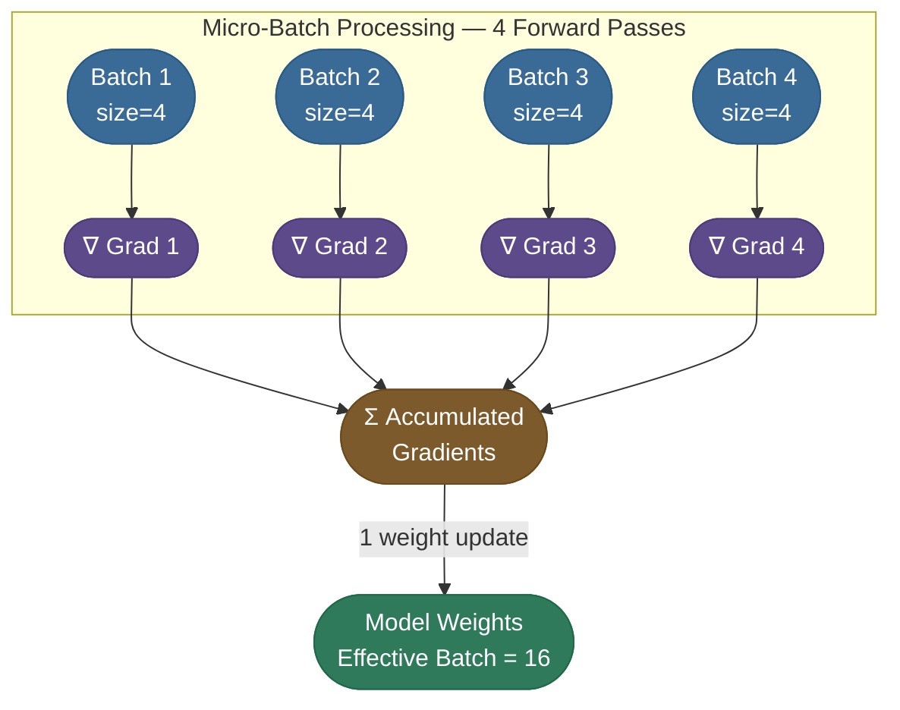
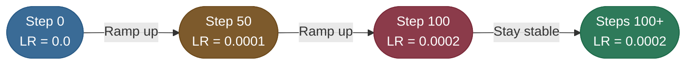
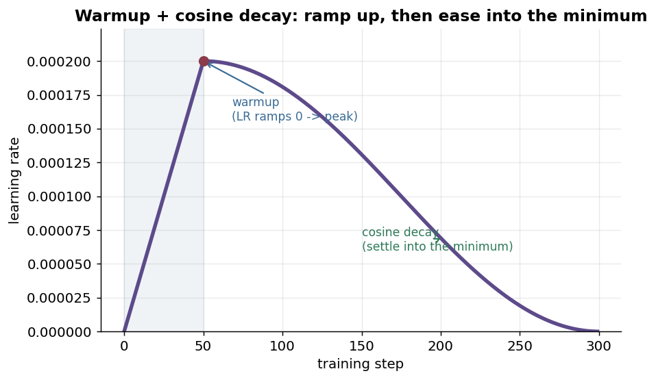
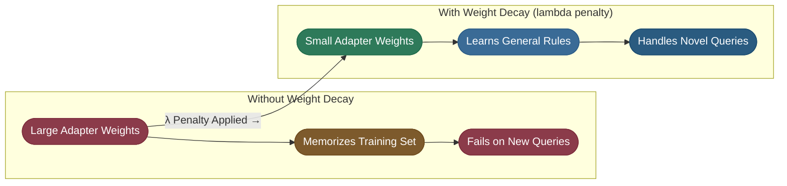

# Chapter 4 — Tune and Debug the Run

Every knob in a fine-tune exists to solve a specific failure, and this
chapter pairs each one with the failure it prevents.

The four that matter, and why LoRA's values differ from full fine-tuning's:

- **Learning rate** — adapters are tiny, so they need a much stronger tug than a full
  fine-tune's `1e-5`.
- **Gradient accumulation** — buys effective batch size with time rather than memory.
- **Warmup and cosine decay** — stops random adapters from taking a destabilizing first step,
  then settles the run into a minimum instead of bouncing around it.
- **Weight decay** — the penalty that makes a model learn the rule rather than memorize the
  ticket.

The chapter closes with the troubleshooting gallery: a symptom you can actually observe, the
cause behind it, and the one-line fix — because "the fine-tune didn't work" almost always has
a recognizable signature.

---

Why do we choose the numbers we use? Fine-tuning is less like "programming" and more like **"Dialing in a Radio Signal."**

### 1. Learning Rate (e.g., `2e-4`)
In full fine-tuning, you might use a tiny LR like `1e-5`. In LoRA, we use a much higher rate.
- **The Why**: We are only training the tiny adapters. Because we have so few parameters (131k vs 7B), we need a "stronger tug" to get them into the right shape without risking the stability of the main model.

### 2. Gradient Accumulation (The "Virtual Batch")
A T4 GPU can only process a **Batch Size of 4** without running out of memory. But a small batch size results in a "noisy" learning process—the model gets confused by every individual example.

- **The Result**: The model processes 4 examples, stores the math, does it again multiple times, and *then* updates its weights. This transforms 16 tiny, noisy updates into 1 stable, high-quality update.

The arithmetic is just multiplication: **effective batch = per-device batch × gradient-accumulation steps × number of GPUs**. On one T4 that's `4 × 4 × 1 = 16`. Want an effective batch of 32 on the same card? Leave the micro-batch at 4 and set accumulation to 8 — same memory, double the smoothing, at the cost of taking twice as many forward passes per update.

> **Note:** Gradient accumulation buys batch size with *time*, not memory — it never raises peak VRAM, because each micro-batch is processed and freed before the next. It's the standard trick for getting a stable effective batch on a small GPU; the only cost is a proportionally slower step.

### 3. Warmup Steps (The "Slow Start")
At the beginning of training, the model's adapters are random noise. If we hit them with a full learning rate immediately, we might "knock the model off balance."

- **The Function**: Warmup allows the model to "find the general direction" of your data before we start sprinting. It's like a runner stretching before a race.

In practice warmup is the *front* of a full schedule: the LR ramps from zero up to its peak over the warmup steps, then a **cosine decay** eases it back down so the model settles cleanly into a minimum rather than bouncing around it.

> **Tip:** A short warmup (~3-5% of total steps, often `warmup_steps=50` on small runs) plus cosine decay is the safe default for LoRA. Skip warmup and the random adapters can take a destabilizing first step; skip the decay and the LR stays high into the end, where it just jitters around the minimum instead of settling.

### 4. Weight Decay: The "Memorization" Penalty
When we fine-tune on a small dataset (like 500 support tickets), the model is at high risk of **Overfitting**. It might memorize the exact words of your tickets instead of the underlying strategy.

#### The "Lazy Student" Analogy
Imagine a student preparing for a math test.
- **Without Weight Decay**: The student memorizes the specific answer to every homework problem. If the test has the exact same question, they get 100%. If the test has a *modified* version of the question, they fail completely.
- **With Weight Decay**: We "punish" the student for using too much brainpower on one specific answer. We force them to keep their "logic" simple. This forces them to learn general rules that work for all problems.

#### The Mathematical "Weight"
In the training loss function, we add a tiny penalty based on the **size** of the adapter weights:

$$\text{Total Loss} = \text{Prediction Error} + (\mathbf{\lambda} \times \text{Weight Size}^2)$$

*Source: Loshchilov & Hutter, 2017 — Decoupled Weight Decay Regularization ([arXiv](https://arxiv.org/abs/1711.05101))*

By adding this $\lambda$ (Weight Decay), we are telling the model: *"You can solve the problem, but try to do it with the smallest possible weight values."*

- **The Result**: The model learns to be **robust**. It will understand how to solve a password reset ticket even if the customer uses different words than the ones in your training data.

---

## Troubleshooting Gallery

When a fine-tune comes back disappointing, the failure almost always has a recognizable *signature*, and each one points at a specific fix. Run down this list before turning random knobs:

| Symptom you see | Likely cause | One-line fix |
|---|---|---|
| **CUDA out of memory** at load or first step | base too big for the card; full-precision optimizer | use **QLoRA** (4-bit base), `optim="paged_adamw_8bit"`, drop batch size + raise gradient accumulation |
| **Model parrots the prompt** back in its answers | prompt not masked (labels not set to `-100`) | mask prompt tokens so loss is on the **response only** |
| **Replies never stop / ramble** into fake turns | missing **EOS** (`</s>`) in training examples | append the EOS token to every training answer |
| **Garbled, off-format output** after training | wrong **chat template** — doesn't match the base model | render with the model's exact template; inspect a few tokenized rows |
| **Validation loss rises** while train loss falls | overfitting (too many epochs / too-high LR) | stop at the val-loss minimum; fewer epochs; add weight decay |
| **Loss barely moves / underfits** | learning rate too low, or rank too small | raise LR (LoRA likes `~2e-4`); bump `r` to 16; train longer |
| **Loss `NaN` / explodes** early | LR too high, or fp16 overflow | lower LR; use **bf16** compute dtype; add warmup |
| **Adapter ignored at inference** | base loaded without the adapter, or template mismatch | load base, then `PeftModel.from_pretrained(...)`; reuse the *training* template |
| **Great on training tickets, bad on new ones** | data too small/narrow; memorized phrasing | add diverse examples; weight decay; lower epochs |

> **Tip:** Most "the fine-tune didn't work" reports are **data bugs, not training bugs** — a wrong template, a missing EOS, or an unmasked prompt. Before touching learning rate or rank, print three fully-rendered, tokenized training rows and confirm the prompt is masked and the answer ends in EOS. That one check resolves the majority of the rows above.

---

## Production implementation

Runnable services in this estate that implement what this page teaches:

- **[fine-tuning-toolkit](/python/python-production-examples/fine-tuning-toolkit/readme)** — the same knobs exposed as configuration, with the run reporting what each one did.
- **[ml-platform](/python/python-production-examples/ml-platform/readme)** — the tracking layer that makes two runs comparable at all.

## References

  - [Insights from Finetuning LLMs with LoRA (Sebastian Raschka)](https://www.youtube.com/watch?v=rgmJep4Sba4)
  - [Practical Tips for Finetuning LLMs with LoRA (Sebastian Raschka)](https://magazine.sebastianraschka.com/p/practical-tips-for-finetuning-llms) — what actually moves the needle.
  - [Finetuning LLMs with LoRA — insights (Lightning AI)](https://lightning.ai/pages/community/lora-insights/) — rank, alpha, target-module ablations.
  - [Decoupled Weight Decay Regularization (Loshchilov & Hutter, 2017)](https://arxiv.org/abs/1711.05101) — the weight-decay penalty and AdamW.
