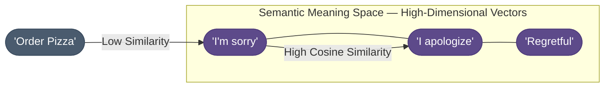
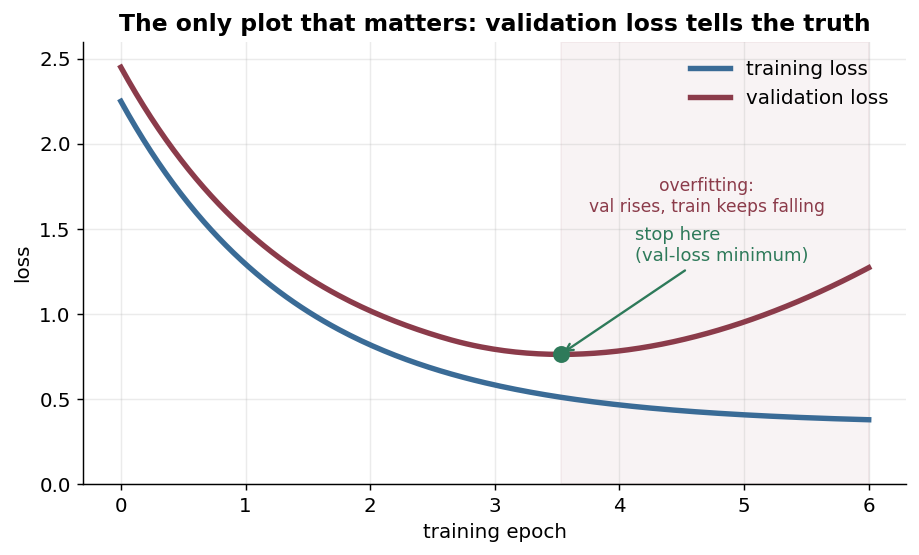

# Chapter 5 — Evaluate Capability and Regression

Chatting with the model is not evaluation. This chapter measures whether the
fine-tune worked, and — just as important — whether it broke anything that used to work.

Three metrics, each answering a different question:

- **ROUGE-L** — did it produce the literal structure you asked for? The strict test for
  formats like JSON.
- **BERTScore** — did it mean the same thing? "I'm sorry" and "I apologize" score alike.
- **Perplexity** — was it confident on data it never saw?

**Only validation loss tells the truth.** Training loss falls forever; the moment validation
loss turns up while training loss keeps dropping, you are memorizing rather than learning.
The chapter ends on the held-out ticket, base model beside fine-tuned, so you can see exactly
what the adapters bought.

---

How do we prove the model is "Better"? In LLM engineering, we don't just "chat" with the model to see if it's good; we use **Scientific Metrics** to measure its performance against a "Golden" dataset (the perfection we want).

### 1. ROUGE-L (The "Literal" Test)
**ROUGE-L** stands for **Recall-Oriented Understudy for Gisting Evaluation**. The "L" refers to the **Longest Common Subsequence**.

- **What it measures**: It looks specifically for the longest sequence of words that appear in BOTH the model's output and the reference answer, in the same order.
- **The Best Use Case**: **Structured JSON Responses**. If your support model needs to output a specific JSON format (e.g., `{"intent": "reset_password"}`), ROUGE-L will strictly penalize it if even one bracket is missing.

#### The ROUGE-L Example
| **Reference (Golden)** | **Model Output** | **ROUGE-L Result** |
| :--- | :--- | :--- |
| "Please reset your password." | "Please reset your secret password." | **High** (Common sequence: "Please reset your... password") |
| "Please reset your password." | "Reset your password please." | **Lower** (The order is broken) |

### 2. BERTScore (The "Semantic" Test)
Sometimes two sentences mean the exact same thing but use zero overlapping words. ROUGE-L would give this a score of 0. **BERTScore** solves this by using **Vector Embeddings**.

- **How it works**: It turns every word into a coordinate in a high-dimensional "Meaning Space." 
- **The Concept**: It calculates the **Cosine Similarity** (the angle) between the meaning of the model's words and the meaning of the gold standard words.
- **The Best Use Case**: **Customer Empathy**. If the model says "I'm sorry for the trouble" vs "I apologize for the inconvenience," BERTScore will recognize they are identical in value.



Read it as distance in meaning-space: "I'm sorry," "I apologize," and "regretful" cluster tightly (high cosine similarity, so BERTScore rewards them as equivalent), while "Order Pizza" sits far away (low similarity) — overlap of *meaning*, not of words, is what the metric scores.

### 3. Perplexity (The "Surprise" Test)
Perplexity is the most mathematical metric. It measures how "confident" the model is when it sees your validation data.

- **The Analogy**: Imagine a student taking an exam. 
  - **Low Perplexity**: The student sees a question and immediately knows the answer. They aren't surprised. This means they have **internalized** the logic of the subject.
  - **High Perplexity**: The student is confused and has to guess. This means they haven't learned the patterns of the data.
- **The Goal**: In fine-tuning, we watch the "Loss Curve" or "Perplexity Curve." We want it to drop steadily until it plateaus. If it starts going back *up*, we have hit **Overfitting** (The model is becoming "weirdly specific" and losing its general logic).

#### Overfitting Visualized

Here is the arc every fine-tune travels — read it left to right and the danger is the rightmost two boxes, which is exactly why we stop at the optimal zone:


In practice you watch this play out on the loss curves — the single most important plot in fine-tuning. **Training loss always falls; only validation loss tells the truth.** Stop at its lowest point:



> **Important:** Never judge a fine-tune on *training* loss — it falls forever and tells you nothing about generalization. Watch the **validation** loss and save the checkpoint at its minimum (set `load_best_model_at_end=True` with an eval/save schedule so the trainer keeps it for you). The moment validation loss turns up while training loss keeps dropping, you are memorizing, not learning.

For our **Support Specialist**, the concrete test is the held-out ticket: feed *"How do I reset my password?"* (which the model never saw in training) to the fine-tuned model and check it produces the clean, correctly-stopped reply — ROUGE-L against the golden answer for literal correctness, BERTScore for empathy phrasing, and perplexity for confidence. *Evaluation is a triangulated approach.* For the general eval toolkit — datasets, judges, statistical significance — see [Evaluation & Benchmarking (workflow)](/ai-ml/practitioner-workflows/evaluation-and-safety/evaluation-and-benchmarking/evaluation-and-benchmarking).

**Here's what the fine-tune buys you on that exact ticket.** Same prompt, same decoding settings, base Mistral-7B-Instruct vs the adapter-wrapped Support Specialist:

```text
PROMPT (held-out):  How do I reset my password?

── BASE model (Mistral-7B-Instruct, no adapter) ──────────────────────────────
There are several ways to reset a password depending on the system you are
using. For most web applications you would typically navigate to the login
screen and look for an option such as "Forgot Password". However, the exact
steps vary by provider, so I'd be happy to walk through Windows, macOS, Gmail,
or your router — which one did you mean? Also, here are some general security
tips for choosing a strong password... [keeps going, never commits, no STOP]
        ↑ generic, hedging, multi-product, rambles past the answer

── FINE-TUNED model (base + ~150 MB Support Specialist adapter) ──────────────
Click "Forgot password" on the login page, then follow the link we email you.
The link expires in 30 minutes — if it lapses, just request a new one.</s>
        ↑ on-brand, single product, exact house phrasing, stops cleanly at </s>
```

Read the two side by side and every section of this guide shows up in the output: the base model **hedges and never stops** (no learned EOS discipline, no house voice); the fine-tuned model answers in *your* support voice, in one tight paragraph, and **halts at `</s>`** — the behavior the masked instruction pairs taught it. Nothing about the model's underlying English changed (the frozen 99%+ of weights); only the **behavior** the 0.78% of LoRA adapters carry. That contrast — generic-and-rambling → focused-and-terminated — is exactly what ROUGE-L (literal overlap with the golden answer), BERTScore (empathy phrasing), and perplexity (confidence on held-out tickets) are there to quantify so you're not just eyeballing it.

---

## Production implementation

Runnable services in this estate that implement what this page teaches:

- **[fine-tuning-toolkit](/python/python-production-examples/fine-tuning-toolkit/readme)** — held-out evaluation run as part of the training path, not after it.

## References

  - [Evaluation & Benchmarking (workflow)](/ai-ml/practitioner-workflows/evaluation-and-safety/evaluation-and-benchmarking/evaluation-and-benchmarking) — the general eval toolkit behind ROUGE-L / BERTScore / perplexity.
