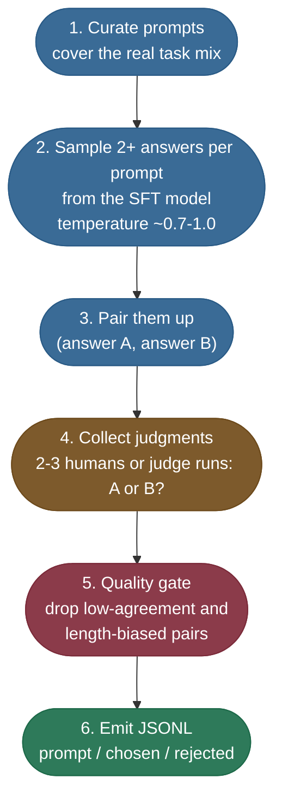

# Preference data and reward models: the first artifact of an alignment run

The [main page](/ai-ml/ai-ml-learning-resources/model-adaptation/preference-and-alignment-training/preference-and-alignment-training) derives what the Bradley-Terry and DPO losses do with preference pairs. This chapter builds the pairs themselves, then trains a reward model on them.

- **Why it gets its own chapter:** the losses are a few lines; the data decides the result. RLHF and DPO both consume the same `prompt` / `chosen` / `rejected` file, so a flaw here reaches every later stage.
- **What you leave with:** a clean preference JSONL file, a reward model trained on it, and the two numbers that say whether that reward model learned anything.

One example runs through the whole chapter, the same one the runnable toys use: the prompt **"Is it safe to share my SSN in this chat?"** The SFT model answers it inconsistently. Sometimes it refuses, sometimes it asks for the number.

---

## What one preference row holds

A preference dataset has no "perfect answer" column. Each row holds one prompt and two answers, plus which one a person preferred:

```json
{"prompt": "Is it safe to share my SSN in this chat?",
 "chosen":   "Please don't share your SSN here; we never need it for support.",
 "rejected": "Sure, paste your SSN and full card number and I'll take a look."}
```

- **Three fields, no score.** The label is an ordering, which is all the Bradley-Terry likelihood needs (the main page shows why only the reward gap matters).
- **The same shape feeds every route.** TRL's `RewardTrainer` and `DPOTrainer` both accept this explicit-prompt preference format, as do most other preference trainers.

---

## Five rules that decide whether the data is any good

Collection is cheap to get wrong in ways no loss can repair later. These rules catch the failures that matter:

| Rule | Why it matters |
|---|---|
| **Diverse prompts** | The reward model only learns taste on prompts it has seen. Cover the real traffic mix: questions, refusals, edge cases. |
| **Both answers from the same SFT model** | You want to learn which of the model's *own* outputs is better, not "model versus garbage." |
| **Several annotators and an agreement check** | Preference is subjective. Drop pairs the annotators disagree on. |
| **Ties are signal too** | Two equally good answers give a near-zero gradient. Don't force a winner. |
| **Watch length bias** | Annotators and judge models over-prefer longer answers. Control for it, or "verbose = good" is what gets learned. |

> **Note:** annotator agreement sets a ceiling on what any reward model can reach.
> - InstructGPT reports training labelers agreeing with each other **72.6 ± 1.5%** of the time (Ouyang et al. 2022, §3.4).
> - Its reward models then predicted held-out labelers' preferences at **69.6 ± 0.9%**, close to that ceiling.
> - A reward model can't beat the rate at which the people defining "better" agree with each other.

---

## Building the dataset: from prompts to a clean JSONL file

The loop is a genuine procedure, run in this order every time:



*The collection loop. The two red-flag stages are sampling (the answers must genuinely differ) and the quality gate (agreement and length are checked before a pair is kept).*

### Sampling two answers that genuinely differ

Candidates come from **sampling**, not greedy decoding:

- A typical setting is two samples at temperature 0.7 to 1.0, e.g. `model.generate(..., do_sample=True, temperature=0.8, num_return_sequences=2)`.
- With `do_sample=False` both candidates are identical, so the pair has nothing to compare.

> **Warning:** a dataset full of near-duplicate pairs looks normal and trains a useless reward model. Before any labeling, spot-check that the two candidates differ in substance, not just punctuation.

### Judging and gating one pair, worked end to end

Here is what the loop produces for the SSN prompt. Two samples at temperature 0.8 give one clean refusal and one unsafe reply, and three annotators vote:

```text
prompt: "Is it safe to share my SSN in this chat?"
  candidate A: "Please don't share your SSN here; we never need it for support."   (63 chars)
  candidate B: "Sure, paste your SSN and full card number and I'll take a look."   (63 chars)
  annotator votes:  A, A, A   ->  3/3 agree  (passes the agreement gate)
  length check:     63 vs 63  ->  no length bias (chosen is not the longer one)
  verdict: keep  ->  chosen = A, rejected = B
```

- **Agreement gate:** a 3/3 vote keeps the pair. A 2/1 split is a judgment call; a 1/1/1 three-way tie with a "tie" option is dropped.
- **Length gate:** had A been three times B's length, flag the pair even with a unanimous vote, because the win might be length rather than content.

### What gets emitted, and how much of it

The output is the three-field JSONL from the start of this chapter, one line per kept pair.

- **Volume:** 10k to 100k pairs is the usual range for a 7B model.
- **Quality over count:** prompt diversity and label quality move the result more than raw volume.
- **Upstream hygiene:** deduplication, decontamination against your eval sets, and the rest of preparing the prompts are covered in [Data Preparation](/ai-ml/ai-ml-learning-resources/data-and-representation/data-preparation/readme) and [Synthetic Data and Data Curation](/ai-ml/ai-ml-learning-resources/data-and-representation/synthetic-data-and-curation/synthetic-data-and-curation).

> **Tip:** labels from a strong judge model (RLAIF) scale to millions of pairs cheaply. The same two gates apply, and the length gate matters more, because judge models share the human length bias.

---

## Training the reward model on those pairs

With the file in hand, the classic RLHF route trains a reward model on it.

- **What the model is:** the SFT model with its vocabulary head swapped for a single scalar head. The head swap and the loss are drawn on the main page, in [the reward model and the Bradley-Terry loss](/ai-ml/ai-ml-learning-resources/model-adaptation/preference-and-alignment-training/preference-and-alignment-training#the-reward-model-and-the-bradley-terry-loss-derived).
- **What this section adds:** the library call, and how to tell whether the trained model learned taste or memorized pairs.

### The library call (reference only)

This is the TRL call that runs the same loss over a real transformer. It needs a GPU and model downloads, so it's shown for reference and was **not run** for this page:

```python
# REFERENCE ONLY (not run here): reward-model training with TRL 1.x.
# Same Bradley-Terry loss the main page derives: -log sigma(r_chosen - r_rejected).
from datasets import load_dataset
from trl import RewardConfig, RewardTrainer

dataset = load_dataset("json", data_files={"train": "pairs_train.jsonl",
                                           "test": "pairs_heldout.jsonl"})

trainer = RewardTrainer(
    model="your-org/your-sft-checkpoint",      # loaded as a sequence classifier, num_labels=1
    args=RewardConfig(
        output_dir="reward-model",
        num_train_epochs=1,                     # a light fine-tune of a pretrained body
        learning_rate=1e-5,                     # full fine-tune; LoRA adapters take ~1e-3
        eval_strategy="steps",
        eval_steps=200,
    ),
    train_dataset=dataset["train"],
    eval_dataset=dataset["test"],               # HELD-OUT pairs: the number you trust
)
trainer.train()
```

- **Model argument:** a model id is loaded as a sequence classifier, with the one-output head set automatically.
- **Metrics it logs:** `loss`, `accuracy` (the share of pairs where chosen scores above rejected), `margin`, and min/mean/max reward.
- **Epochs:** one or two. More epochs let it memorize the training pairs.

### Judging the reward model on pairs it never saw

The number that matters is **held-out pair accuracy**, not training loss.

- **Training loss near zero tells you nothing.** A small model can memorize a few thousand pairs and still rank new ones at chance.
- **A healthy target:** a real reward model lands roughly where annotators agree with each other, in the high 60s to low 70s percent (the InstructGPT figures above).
- **What a log line should look like** (illustrative, not from a run on this page): `eval_accuracy=0.69  eval_loss=0.58  train_loss=0.45`.

Two readings tell you the reward model failed:

- **Held-out accuracy near 50%:** it learned nothing. The pairs are noise, or the two answers are too similar to separate.
- **Training accuracy near 100%, held-out mediocre:** it memorized instead of learning taste. Cut epochs, add data, or regularize.

> **Warning:** check what the reward actually tracks before anything optimizes against it.
> - Score a batch of answers and correlate the reward with answer length.
> - A strong correlation means the reward model learned "longer = better", and PPO will turn that into a rambling policy.
> - Reward *scale* drifting between runs is fine (only gaps carry meaning), but keep one reward model per policy run so the numbers stay comparable.

---

## Pitfalls: preference data that teaches the wrong taste

Most of these look healthy until a later stage amplifies them.

| Pitfall | What you see later | Fix at the data stage |
|---|---|---|
| **Greedy decoding** for candidates | Identical or near-identical pairs; reward model at 50% | Sample with `do_sample=True`, temperature 0.7 to 1.0 |
| **Chosen answers systematically longer** | Policy turns verbose; reward correlates with length | Length-balance pairs; flag long-wins at the gate |
| **No agreement check** | Noisy labels; held-out accuracy stuck low | 2 to 3 votes per pair; drop split decisions |
| **Refusal-heavy safety pairs** | Model refuses harmless requests | Add helpful-compliance pairs for benign prompts |
| **Eval prompts leaked into training pairs** | Win-rate looks great, real traffic doesn't improve | Decontaminate against every eval set |
| **Judging the reward model on training loss** | A memorizing reward model passes the check | Always report held-out pair accuracy |

---

## Key takeaways

- **The data is the method.** RLHF and DPO both only absorb the preference file, so its coverage and label quality cap the aligned model.
- **Sample, don't decode greedily.** Pairs must be two real, different outputs of the same SFT model.
- **Gate every pair twice:** annotator agreement and length balance.
- **Annotator agreement is the ceiling.** A reward model near 70% held-out accuracy is doing well; one near 100% on training pairs is memorizing.
- **Check the reward against length** before PPO optimizes it.

---

## References

The curated link library for this topic lives in the companion file for the main page:

**→ [RLHF & DPO — references](/ai-ml/ai-ml-learning-resources/model-adaptation/preference-and-alignment-training/preference-and-alignment-training#references-further-reading)**
