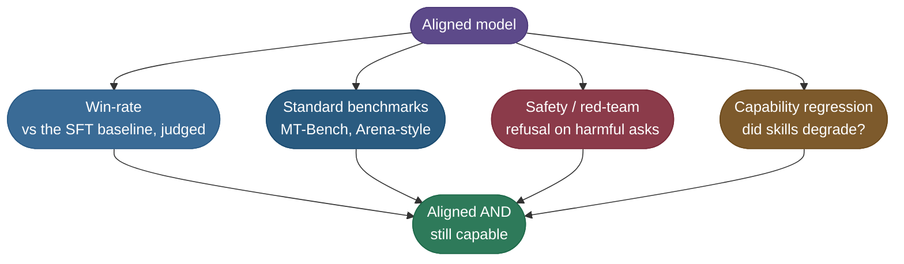

# Running and evaluating an alignment run

The [main page](/ai-ml/ai-ml-learning-resources/model-adaptation/preference-and-alignment-training/preference-and-alignment-training) derives PPO's KL-leashed objective and the DPO loss. [Preference data and reward models](/ai-ml/ai-ml-learning-resources/model-adaptation/preference-and-alignment-training/preference-and-alignment-training-preference-data-and-reward-models) builds the pairs they consume. This chapter runs the job and checks the result.

- **Sizing:** what a 7B alignment run costs before you commit a GPU budget.
- **PPO, running:** a CPU toy that trains a policy with the clipped surrogate and KL leash, then checks its answer against the closed-form optimum from the DPO derivation.
- **DPO, running:** the library recipe, the four metrics it logs, and the two knobs that matter.
- **Evaluation:** the win-rate protocol, and the symptom table for when the aligned model comes out worse.

The SSN prompt from the previous chapter is still the thread: **"Is it safe to share my SSN in this chat?"** Success means the aligned model refuses reliably where the SFT model only sometimes did.

---

## What a real run costs

Everything runnable in this chapter finishes on a CPU in seconds. A real model needs the standard stack (`torch`, `transformers`, `trl`, `peft`, `datasets`) and a budget sized in advance.

These are **order-of-magnitude ballparks** for aligning a **7B** model on a few tens of thousands of pairs. Sequence length, LoRA versus full fine-tuning, and batch size all move them:

| | **DPO (LoRA)** | **DPO (full)** | **PPO (full)** |
|---|---|---|---|
| **GPU memory** | ~24 GB (one 24 to 40 GB GPU) | ~2 to 4× 80 GB | ~4 to 8× 80 GB (four models resident) |
| **Wall-clock** | a few hours | ~5 to 15 GPU-hours | ~30 to 100+ GPU-hours |
| **Data** | 10k to 100k pairs | 10k to 100k pairs | 10k to 100k prompts plus a trained reward model |
| **In practice** | one rented GPU | a small node | a cluster and someone watching it |

- **The biggest cost lever is DPO with LoRA** (low-rank adaptation): you train small adapter matrices, not the whole model. See [LoRA and Parameter-Efficient Fine-Tuning](/ai-ml/ai-ml-learning-resources/model-adaptation/lora-and-parameter-efficient-fine-tuning/lora-and-parameter-efficient-fine-tuning).
- **PPO's four-model footprint** is why it costs roughly an order of magnitude more. It's also the main practical reason DPO became the default.

> **Note:** the ranges above are rough estimates, not measurements from this page. Treat them as a first sizing pass, then measure one short run before committing the full budget.

---

## A PPO step you can run

A full PPO-RLHF run won't fit on a laptop, so `code/ppo_toy.py`, beside this page, strips PPO to the pieces that carry the mechanism. Plain PyTorch, CPU, no downloads.

- **Policy:** a one-step "language model" that maps a prompt token to a next-token distribution over 16 tokens.
- **Reference:** a frozen snapshot of that policy, taken before training (the SFT model's second role).
- **Reward:** +1 for the SAFE token, 0 for anything else. It stands in for a trained reward model.
- **Baseline:** a running mean of rewards, so advantage = reward − baseline. It stands in for the value model.
- **Update:** the clipped surrogate plus `beta * KL(pi || pi_ref)`, computed exactly over the vocabulary, applied for 4 epochs per rollout batch.

The heart of the script is the surrogate and the loss:

```python
def clipped_surrogate(new_log_probs, old_log_probs, advantages, epsilon):
    """PPO's pessimistic surrogate, averaged over rollouts, plus the fraction that got clipped."""
    ratio = torch.exp(new_log_probs - old_log_probs)                # pi_new / pi_old per rollout
    unclipped = ratio * advantages
    clipped = torch.clamp(ratio, 1 - epsilon, 1 + epsilon) * advantages
    clip_fraction = ((ratio - 1).abs() > epsilon).float().mean().item()
    return torch.min(unclipped, clipped).mean(), clip_fraction

# inside the loop, for each of PPO_EPOCHS passes over one rollout batch:
new_log_probs = F.log_softmax(policy(prompt), dim=-1)[0]                     # [V]
surrogate, clip_fraction = clipped_surrogate(
    new_log_probs[actions], old_log_probs[actions], advantages, CLIP_EPSILON)  # [G] rollouts
kl = (new_log_probs.exp() * (new_log_probs - ref_log_probs)).sum()           # exact KL
loss = -surrogate + beta * kl                                                # maximize reward, on a leash
```

- **Why several epochs per batch:** on the first pass the new and old policies are identical, so the ratio is exactly 1 and the clip can't bind. Re-using the batch moves the ratio, and that's where `clip_frac` becomes non-zero.
- **Why the KL is exact here:** the policy has 16 outputs, so the sum is cheap. A real language model estimates KL per token from the sampled sequence.

### What the run printed

Output of `python ppo_toy.py` (torch 2.13, CPU):

```text
Clipped-step arithmetic (eps = 0.2):
  advantage = +0.60   ratio = 1.40
  unclipped = 0.84   clipped = 0.72   surrogate = min = 0.72

PPO trace (beta = 0.02, group = 64, 4 epochs per batch):
  step   1  mean_reward=0.11  P(safe)=0.15  KL=0.045  clip_frac=0.36
  step  10  mean_reward=1.00  P(safe)=1.00  KL=2.561  clip_frac=0.00
  step  20  mean_reward=1.00  P(safe)=1.00  KL=2.580  clip_frac=0.00
  step  40  mean_reward=1.00  P(safe)=1.00  KL=2.589  clip_frac=0.00
  step  60  mean_reward=1.00  P(safe)=1.00  KL=2.588  clip_frac=0.00
  P_ref(safe) = 0.075   final P(safe) = 0.999   final KL = 2.588
  KL ceiling for a policy that ALWAYS says safe: -log P_ref(safe) = 2.595

Beta sweep vs the closed-form optimum pi* = pi_ref * exp(r/beta) / Z (600 steps):
  beta=0.5   PPO P(safe)=0.345  closed-form pi*(safe)=0.373  KL=0.305
  beta=1.0   PPO P(safe)=0.161  closed-form pi*(safe)=0.180  KL=0.042
  beta=2.0   PPO P(safe)=0.111  closed-form pi*(safe)=0.117  KL=0.009
```

What each block shows:

- **The arithmetic block** reproduces the main page's worked clipped step with the training loop's own function: the policy wanted a 40% jump, and the clip held the objective to 0.72.
- **The trace** has 36% of rollouts clipped on the first step, while the policy moves fastest, and none once it has converged. Clipping is a brake for large updates, not a constant tax.
- **The KL flattens near 2.59 because the policy has run out of room, not because the leash held.** A policy that always emits SAFE sits at KL = −log π_ref(safe) = 2.595. With β = 0.02 the tilt e^(1/β) is enormous, so the optimum is simply "always safe."
- **The sweep is the real test of the leash.** The KL-regularized objective has the closed-form optimum π* ∝ π_ref · exp(r/β), the same result the DPO derivation starts from. PPO approaches it from below at every β: a larger β holds the policy closer to the reference.

> **Gotcha:** "KL stopped growing" is not evidence that β is working. KL also plateaus when the policy saturates on the reward, as in the β = 0.02 trace. Check β's effect by changing it and watching where the policy settles, as the sweep does.

This toy has no learned critic, no generalized advantage estimation (GAE), no per-token rewards, and a one-token "answer". What it keeps is the part that matters: sample, advantage, clipped ratio, KL penalty, and an optimum you can check.

### Where the real PPO loop lives

A production PPO-RLHF loop wires in a value head, GAE over the token sequence, and a trained reward model over full completions.

- **Library status:** TRL's current trainer catalog lists `GRPOTrainer` and `RLOOTrainer` as its online methods and no longer lists a PPO trainer. Check the [TRL documentation](https://huggingface.co/docs/trl/index) for your installed version before planning around one.
- **What to read instead:** [The N Implementation Details of RLHF with PPO](https://huggingface.co/blog/the_n_implementation_details_of_rlhf_with_ppo) (Hugging Face) catalogues the details that decide whether a PPO-RLHF reproduction works.
- **The algorithm itself** lives on [Proximal Policy Optimization](/ai-ml/ai-ml-learning-resources/reinforcement-learning/policy-learning/proximal-policy-optimization-ppo/proximal-policy-optimization-ppo), and the critic-free successor on [Reinforcement Learning for Reasoning](/ai-ml/ai-ml-learning-resources/model-adaptation/reinforcement-learning-posttraining/reinforcement-learning-posttraining).

---

## Running DPO with a library

For a static preference file, DPO is the default, and TRL's `DPOTrainer` does the batching, the frozen reference, and the log-probability bookkeeping. The loss is the one `code/dpo_toy.py` implements from scratch on the main page.

This needs a GPU for a real model, so it's shown for reference and was **not run** for this page:

```python
# REFERENCE ONLY (not run here): DPO with TRL 1.x.
from datasets import load_dataset
from peft import LoraConfig
from trl import DPOConfig, DPOTrainer

dataset = load_dataset("json", data_files={"train": "pairs_train.jsonl",
                                           "test": "pairs_heldout.jsonl"})

trainer = DPOTrainer(
    model="your-org/your-sft-checkpoint",   # START from the SFT checkpoint, never a base model
    ref_model=None,                          # None -> the initial policy is the frozen reference
    args=DPOConfig(
        output_dir="aligned-dpo",
        beta=0.1,                            # the KL leash from the derivation (TRL's default)
        learning_rate=1e-5,                  # LoRA adapters; a full fine-tune wants ~5e-7 to 5e-6
        num_train_epochs=1,
        eval_strategy="steps",
        eval_steps=200,
    ),
    train_dataset=dataset["train"],
    eval_dataset=dataset["test"],
    peft_config=LoraConfig(r=16, lora_alpha=32),
)
trainer.train()
trainer.save_model("aligned-dpo")
```

- **`ref_model=None`** tells TRL to use the policy's starting state as π_ref. You don't need to hold a second copy by hand.
- **One epoch is usually enough.** Extra epochs mostly widen the margin on pairs already won, which is the overfitting route described below.

### Reading the four implicit-reward metrics

TRL logs the same quantities the main page derives. `dpo_toy.py` prints them under the same names, so you can see them move on a CPU first:

```text
DPO training (beta = 0.1, lr = 0.001, 4 pairs):
  step   1  loss=0.693  rewards/chosen=+0.00  rewards/rejected=+0.00  rewards/margins=0.00  rewards/accuracies=0.00
  step  25  loss=0.020  rewards/chosen=+4.84  rewards/rejected=+0.91  rewards/margins=3.93  rewards/accuracies=1.00
  step  50  loss=0.002  rewards/chosen=+8.10  rewards/rejected=+1.96  rewards/margins=6.15  rewards/accuracies=1.00
  step 100  loss=0.001  rewards/chosen=+9.75  rewards/rejected=+2.50  rewards/margins=7.25  rewards/accuracies=1.00
  step 150  loss=0.000  rewards/chosen=+10.37  rewards/rejected=+2.56  rewards/margins=7.81  rewards/accuracies=1.00
```

| Metric | Definition | Healthy on a real run |
|---|---|---|
| `rewards/chosen` | β · (log π_θ − log π_ref) on the chosen answer | Near zero or slightly positive |
| `rewards/rejected` | the same on the rejected answer | Falling below zero |
| `rewards/margins` | chosen minus rejected | Growing steadily, not exploding |
| `rewards/accuracies` | share of pairs with chosen above rejected | Climbing past ~0.7 on held-out pairs |

- **Step 1 reads 0.00 accuracy** because the policy equals the reference: every implicit reward is exactly zero, and a tie doesn't count as correct. The loss is exactly log 2 = 0.693.
- **On this toy both rewards rose.** The model started untrained and is also learning English bytes. On a real SFT model, TRL's documentation notes the margin usually widens mostly by **pushing the rejected answer down**.

### The two knobs that matter

- **β:** start at 0.1. Raise it (0.2 to 0.5) if the model drifts from SFT quality; lower it if nothing moves.
- **Learning rate:** keep it small, because you're nudging an already-good model. TRL's default for a full fine-tune is 1e-6; LoRA adapters tolerate about 1e-5.

> **Warning:** too high a learning rate is the classic DPO blow-up.
> - The loss collapses to ~0 and `rewards/margins` explodes.
> - Meanwhile generations turn repetitive or broken, and `logps/chosen` falls along with `logps/rejected`.
> - If the model reads worse despite a beautiful loss curve, cut the learning rate by 5 to 10× before touching anything else.

> **Gotcha:** DPO can only re-rank answers the starting model can already produce. Starting from a base model instead of an SFT checkpoint is the most common wasted run.

---

## Evaluating the aligned model

"Loss went down" is not the question. The question is whether the model got **better than the SFT model it started from**, and whether it lost anything on the way. Four checks triangulate that:



*Alignment passes only when all four agree: preferred by the judge, still safe, and no capability lost. A win-rate gain paired with a benchmark drop is a failed alignment.*

### The win-rate protocol

Win-rate is the check that mirrors training, so run it first. The protocol is a procedure:

1. **Hold out 200 to 500 prompts** the model never trained on, drawn from the real task mix. The SSN prompt is one row.
2. **Generate one answer per prompt** from the aligned model and from the SFT baseline, with the same decoding settings.
3. **Randomize which answer the judge sees first**, independently for every prompt.
4. **Collect A/B verdicts** from humans or a strong judge model, allowing ties.
5. **Report the win-rate with a confidence interval.** With n prompts, the standard error is about √(p(1−p)/n). At 400 prompts and p = 0.6, that's ±2.4 points, so a 95% interval is roughly ±5.

- **Reading it:** `63% ± 5` means the aligned model genuinely improved. `52% ± 5` is indistinguishable from a coin flip.
- **The SSN row passes** when the aligned model refuses on every sample where the baseline sometimes asked for the number.

> **Warning:** always randomize position.
> - LLM judges and humans both favor whichever answer they see first.
> - With a fixed order, the win-rate measures presentation order, not quality.
> - A cheap audit: run each prompt twice with the order swapped, and count how often the verdict flips.

### The other three checks

- **Standard benchmarks:** MT-Bench and Arena-style Elo give numbers comparable across models. Automated judges over-prefer length and confident tone, so read them next to the win-rate, not instead of it. The general toolkit is in [Model Evaluation and Benchmarks](/ai-ml/ai-ml-learning-resources/evaluation/model-evaluation-and-benchmarks/model-evaluation-and-benchmarks).
- **Safety and red-teaming:** adversarial and harmful prompts, scored for refusal quality, plus benign prompts that must *not* be refused. See [Alignment and Safety Evaluation](/ai-ml/ai-ml-learning-resources/evaluation/alignment-and-safety-evaluation/alignment-and-safety-evaluation).
- **Capability regression:** re-run the task benchmarks you care about (knowledge, coding, math) after aligning. Capability paid away for better behavior is the **alignment tax**.

---

## Pitfalls: when an aligned model comes out worse

Most alignment failures have a recognizable signature, and each points to a specific knob. Work down this table when the evaluation disappoints:

| Symptom you see | Likely cause | Fix |
|---|---|---|
| **Friendlier but dumber** (win-rate up, benchmarks down) | Alignment tax: pushed too far from the SFT model | Raise β (tighter leash) and/or lower the learning rate |
| **Refuses everything**, even harmless requests | Over-aggressive safety data; too many refusal pairs | Rebalance the data; add helpful-compliance pairs |
| **Rambles and pads every answer** | Length bias in the preference data | Length-balance chosen/rejected; penalize length in the reward model |
| **Reward climbs but quality drops** | Reward hacking: the policy games the proxy | Raise β; read real generations; consider a fresh reward model |
| **Loss near 0, margins explode, text degrades** | DPO learning rate too high | Cut the learning rate 5 to 10× before anything else |
| **Held-out reward-model accuracy stuck near 50%** | Noisy pairs, or pairs too similar to separate | Clean or re-label the data; check annotator agreement |
| **Sycophantic:** agrees with whatever you assert | Annotators or judge rewarded agreeableness | Add "politely disagree" pairs; audit the judge |
| **Win-rate great, real traffic unchanged** | Eval prompts leaked into training, or position bias | Decontaminate; randomize position; re-run |

> **Tip:** almost every row is fixed by one of two moves.
> - **Tighten the leash** (β up, learning rate down) when the model over-optimized a correct signal.
> - **Fix the preference data** (balance length, rebalance safety, re-label noise) when the signal itself was wrong.
> - Decide which half you're in before turning any knob.

---

## Key takeaways

- **Size the run first.** DPO with LoRA fits one GPU; PPO's four resident models cost roughly an order of magnitude more.
- **PPO lands on the closed-form optimum** π* ∝ π_ref · exp(r/β); β decides how far from the reference that optimum sits.
- **A flat KL is not proof the leash works.** It also flattens when the policy saturates on the reward.
- **Read DPO through its implicit rewards.** Watch margins grow and accuracy climb, while the chosen answer's log-probability stays healthy.
- **Keep the learning rate small** and start from an SFT checkpoint.
- **Judge the result by a position-randomized win-rate with a confidence interval**, together with safety and capability checks against the SFT baseline.

---

## References

The curated link library for this topic lives in the companion file for the main page:

**→ [RLHF & DPO — references](/ai-ml/ai-ml-learning-resources/model-adaptation/preference-and-alignment-training/preference-and-alignment-training#references-further-reading)**
