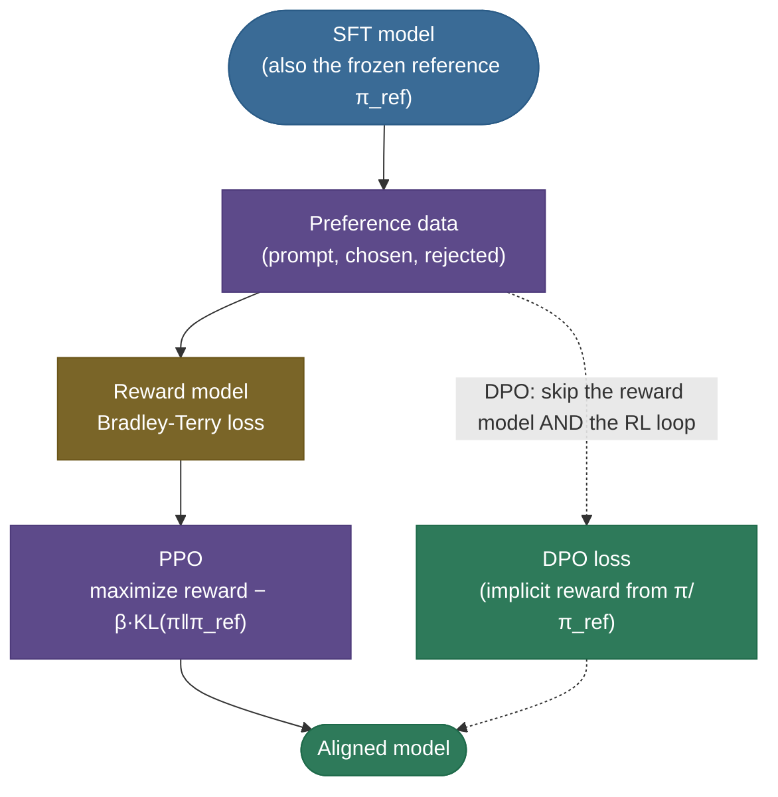
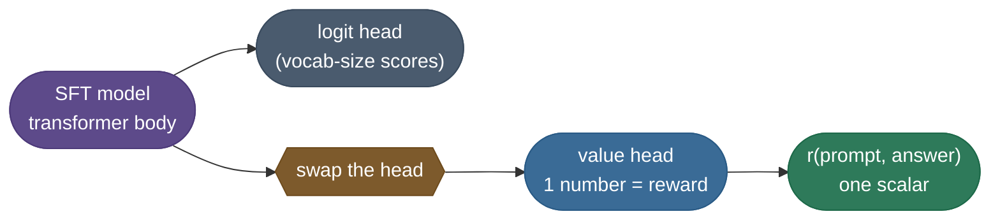
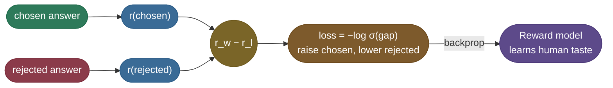
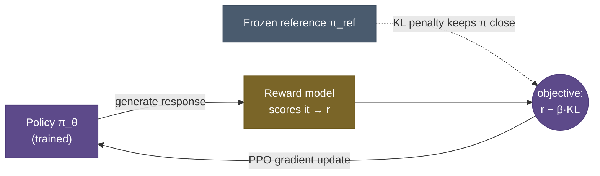
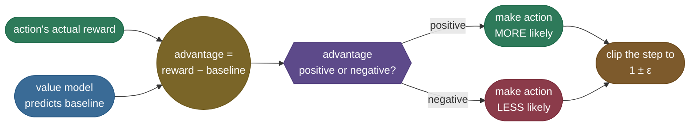
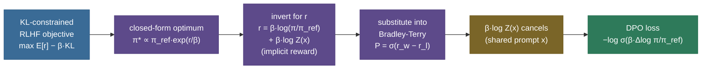
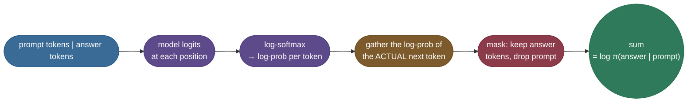
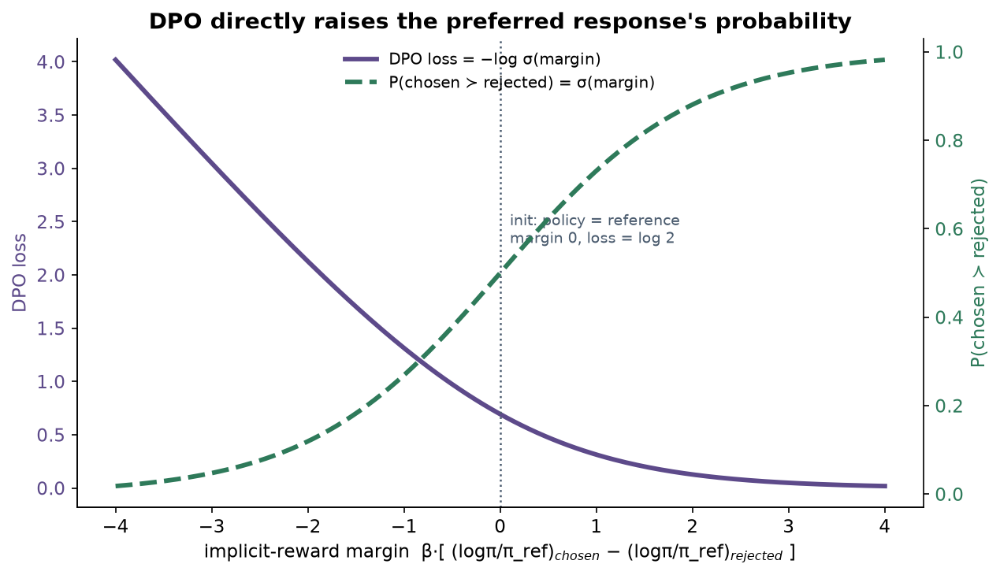
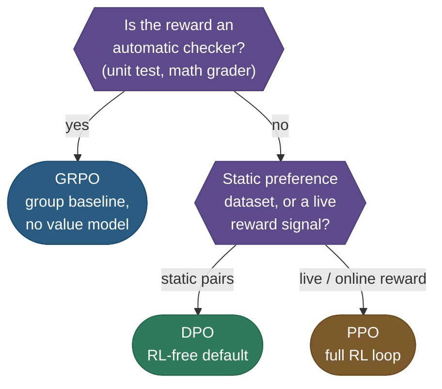
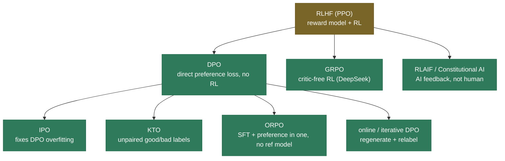

# RLHF & DPO: teaching a model what "better" means

A pretrained, even instruction-tuned, language model is like an apprentice cook who has memorized ten thousand recipes but never been told which dish tastes *good*.

- **What it was trained for:** predicting the most likely next token. "Most likely" is not "best."
- **What that produces:** asked the same question twice, a base model may give a careful answer once and a confident, plausible, wrong answer the next time.
- **What was never in the objective:** any signal about which of two fluent answers is more helpful, more honest, or less harmful.

**Preference alignment** closes that gap. Instead of single "correct" answers, the model sees **pairs**: this response is better than that one.

- **The output:** a model whose distribution is tilted toward what people prefer.
- **The constraint:** it must stay close enough to its old self that it doesn't forget how to write.

There are two routes to that goal, and this page derives both end to end:

- **RLHF** (reinforcement learning from human feedback) trains a *reward model* on the pairs. Then *PPO* (proximal policy optimization) pushes the policy toward high reward, while a *KL leash* keeps it from drifting.
- **DPO** (direct preference optimization) shows the reward model and the optimal policy are two views of one object. The pipeline collapses into a single loss with no reinforcement learning (RL).

By the end of this page you'll be able to:

- explain **why supervised fine-tuning (SFT) alone can't align a model**, and why "better" can't be written as a loss;
- draw the **three-stage RLHF pipeline** and explain why preference data is *comparisons, not ratings*;
- **derive the Bradley-Terry reward model** from maximum likelihood, and work its numbers by hand;
- **derive PPO's $r - \beta\cdot\mathrm{KL}$ objective**, and explain the value model, advantage, clipping, and **reward hacking**;
- **derive the DPO loss from scratch**: the closed-form optimum, the *implicit reward*, and the cancelling partition function, then its gradient;
- **pick between DPO, PPO and GRPO** as an engineering decision, and place the variant landscape;
- run from-scratch **Bradley-Terry and DPO code**, including the sequence log-probability helper every DPO implementation needs.

> **Note:** alignment is a **polish on top of SFT**, not a replacement.
> - You [supervised-fine-tune](/ai-ml/ai-ml-learning-resources/model-adaptation/supervised-fine-tuning/supervised-fine-tuning) (and usually [instruction-tune](/ai-ml/ai-ml-learning-resources/model-adaptation/instruction-tuning/instruction-tuning)) first, so the model already produces reasonable answers.
> - Alignment can only **re-rank** answers the model can already produce. It never adds ability the model didn't have.

---

## The problem: SFT can teach "an answer," not "the better answer"

[Supervised fine-tuning](/ai-ml/ai-ml-learning-resources/model-adaptation/supervised-fine-tuning/supervised-fine-tuning) shows the model one target per prompt and minimizes the cross-entropy of reproducing it. That's **imitation**, and imitation has a ceiling.

- **What imitation can do:** make the model match the demonstration.
- **What it can't do:** teach the model that one answer is *better* than another answer the demonstration never included.

**Real quality is comparative and fuzzy.** "Explain recursion" has a thousand good answers and a million mediocre ones.

- **Hard to write down:** "good" depends on tone, safety, length, format, and honesty.
- **Easy to recognize:** put two answers side by side and most people can say which is better.
- **The asymmetry alignment exploits:** annotators give *reliable rankings* and *unreliable absolute scores*, so we harvest the rankings.

The alignment target is usually summarized as the **HHH triad**:

- **Helpful:** answers what you meant, at the right length and format.
- **Harmless:** refuses unsafe requests without becoming uselessly evasive.
- **Honest:** says "I don't know" instead of fabricating, and calibrates its confidence.

None of these is a function you can differentiate. So instead of *specifying* the objective, we **learn it from comparisons**.

> **Gotcha:** alignment does **not** add knowledge or capability.
> - A model that can't do arithmetic won't learn it from preference pairs.
> - Alignment **redistributes probability mass** over outputs the model can already generate.
> - That's why "SFT first, align second" is non-negotiable, and why a capability-regression check matters: reshaping a distribution can lose things.

---

## What it is: two routes to the same goal

Both routes start from the SFT model and a pile of **preference pairs**, and both end at an aligned model. They differ in what happens in between.



- **RLHF, the classic path:** a **reward model** learns to score any answer; **PPO** optimizes the policy against that score, leashed by a KL penalty to the frozen SFT model. This is the recipe behind InstructGPT and the original ChatGPT.
- **DPO, the modern shortcut:** the same pairs go straight into **one loss** that adjusts the policy. No reward model, no rollouts, no RL loop. It became the default for most open-source post-training within a year of publication.

One way to hold the two in your head:

- **RLHF separates** "learn what's good" (the reward model) from "become good" (PPO).
- **DPO proves** those two stages are the same optimization, and fuses them.

### The RLHF route, stage by stage

Classic RLHF runs three stages in order, and each produces exactly what the next one consumes:

| Stage | Input | What you train | Output |
|---|---|---|---|
| **1. SFT** | `(prompt, ideal answer)` demonstrations | the base model, by imitation | an instruction-following model, which **also becomes the frozen reference** |
| **2. Reward model** | `(prompt, chosen, rejected)` preference pairs | a model mapping any answer to a **scalar reward** | a learned stand-in for human taste |
| **3. Policy optimization** | prompts, the reward model, the SFT reference | the policy (a copy of the SFT model), with **PPO** | the aligned model |

Three terms from that table recur everywhere below:

- **Policy** $\pi_\theta$: the model being trained, viewed as a decision-maker. Given a prompt (the state) it picks the next token (the action). In RLHF it starts as an exact copy of the SFT model.
- **Reference model** $\pi_{\text{ref}}$: a **frozen** copy of the SFT model, never updated. It's the "before" snapshot that drift is measured against, and the fixed end of the KL leash.
- **Scalar reward** $r$: one number summarizing how good a whole answer is. The reward model emits one per `(prompt, answer)`.

> **Note:** a third family sits beside these two: **reinforcement learning with verifiable rewards (RLVR)**, optimized with **GRPO** (group relative policy optimization).
> - An automatic checker (a unit test, a math grader) replaces the learned reward model.
> - A group-mean baseline replaces PPO's value model.
> - Its mechanism is derived on [Reinforcement Learning for Reasoning](/ai-ml/ai-ml-learning-resources/model-adaptation/reinforcement-learning-posttraining/reinforcement-learning-posttraining). The spine here is RLHF and DPO, because every variant is a perturbation of those two.

---

## Intuition: learning a chef's taste

SFT is teaching a cooking apprentice with one recipe card per dish: *"make it exactly like this."* Alignment is the **head chef tasting two plates** and saying *"this one, more like this."*

- The apprentice never gets a perfect recipe for everything.
- They get a **stream of preferences**, and slowly internalize the chef's *taste*.
- That taste is exactly what SFT can't write down.

The two routes are two ways of teaching it:

- **RLHF builds a literal taste model** (the reward model), lets the apprentice cook thousands of plates, scores each, and nudges toward higher scores, on a **leash**.
  - Without the leash, the apprentice learns to *game the scorer*: if the scorer happens to like salt, everything gets drowned in salt.
  - The leash keeps them cooking real food.
- **DPO skips the separate taste model.** It shows the pairs and says: *make the better plate more likely and the worse plate less likely.*
  - The math says this reaches **the same place** as RLHF.
  - The reward model was an intermediate the optimal solution never needed.

> **Tip:** Hugging Face's [Illustrating RLHF](https://huggingface.co/blog/rlhf) draws the three-stage pipeline, the reward model and the PPO loop with clean diagrams. Look at it first if "reward model" and "policy" still feel abstract.

---

## Preference data: the fuel for both routes

Everything runs on a dataset of comparisons. Each row is a **prompt** with two completions and a label saying which is preferred:

$$\big\{\; x \;(\text{prompt}),\quad y_w \;(\text{chosen / "winner"}),\quad y_l \;(\text{rejected / "loser"}) \;\big\}$$

- **Where the two answers come from:** sampling the SFT model twice, at a temperature high enough that they genuinely differ.
- **Who labels:** a human, or increasingly a strong model (RLAIF, reinforcement learning from AI feedback).
- **Why it matters most:** the losses below only absorb this data. Its quality and coverage cap the final model.

> **Tip:** there's **no numeric score** in that row, only an ordering, and that's deliberate.
> - People give **reliable rankings** ("A is better than B") but **unreliable ratings** ("A is a 7"). One annotator's 7 is another's 4.
> - Bradley-Terry and DPO both learn from orderings alone; they only ever need the *gap*.
> - Collect pairwise judgments; never ask for 1 to 10 ratings.

> **Gotcha:** preference data carries **biases the model will exploit**, most notoriously **length bias**.
> - Annotators and judge models tend to prefer longer answers, so the model learns "longer = better."
> - That's reward hacking **baked into the data**, before PPO or DPO runs.
> - Fix it at collection: length-balance chosen versus rejected, and flag pairs where the longer answer won.

How to collect, gate and emit that file (the sampling settings, the agreement and length gates, a worked pair with annotator votes) is the whole of [Preference data and reward models](/ai-ml/ai-ml-learning-resources/model-adaptation/preference-and-alignment-training/preference-and-alignment-training-preference-data-and-reward-models). This page focuses on what the *losses* do with the data once it's clean.

---

## The reward model and the Bradley-Terry loss (derived)

RLHF's first job is to turn orderings into a **scalar reward** $r_\phi(x, y)$: a model that reads a prompt and an answer and outputs one number.

- **The puzzle:** the data says $y_w \succ y_l$, never *by how much*.
- **The bridge:** a seventy-year-old idea from sports and chess ranking, the **Bradley-Terry model** of pairwise comparison.

### From a reward gap to a probability

Bradley-Terry says the probability a person prefers $y_w$ is the **logistic function of the reward gap**:

$$P(y_w \succ y_l \mid x) = \frac{\exp\big(r_\phi(x, y_w)\big)}{\exp\big(r_\phi(x, y_w)\big) + \exp\big(r_\phi(x, y_l)\big)} = \sigma\big(r_\phi(x, y_w) - r_\phi(x, y_l)\big)$$

The second equality is where the sigmoid comes from. Divide top and bottom by $\exp(r_w)$, writing $r_w, r_l$ for the two rewards:

$$\frac{e^{r_w}}{e^{r_w} + e^{r_l}} = \frac{1}{1 + e^{r_l - r_w}} = \frac{1}{1 + e^{-(r_w - r_l)}} = \sigma(r_w - r_l).$$

- **Only the gap $r_w - r_l$ matters.** Adding a constant to every reward changes no preference.
- **That's the chess-Elo property:** a fixed rating *gap* predicts a fixed win probability; absolute ratings are arbitrary.
- **It matches the data exactly,** because the gap is the only thing preference labels ever gave us.


### From probability to loss: maximum likelihood

We fit $r_\phi$ by **maximum likelihood**: choose the reward function that makes the observed preferences most probable. Maximizing log-likelihood is minimizing the **negative log-likelihood**:

$$\mathcal{L}_{\text{RM}}(\phi) = -\,\mathbb{E}_{(x,\, y_w,\, y_l)\sim\mathcal{D}}\Big[\log \sigma\big(r_\phi(x, y_w) - r_\phi(x, y_l)\big)\Big]$$

- **In words:** push the chosen answer's score above the rejected answer's, by as much as the data supports.
- **Mechanically:** it's **binary cross-entropy on the reward gap**. The reward model is a classifier of "is chosen better than rejected?", and the score it learns *is* the Bradley-Terry strength.
- **Architecturally:** $r_\phi$ is usually the SFT model with its vocabulary-sized head replaced by a single scalar **value head**. The body already reads language; only the head and a light fine-tune are new.



*The head swap: the SFT body is kept, the vocabulary head is replaced by a one-number head, and that number is the reward.*



*One training step: the same reward model scores both answers, only their gap enters the loss, and the gradient raises the chosen score while lowering the rejected one.*

> **Note:** sources for this section.
> - The pairwise-comparison model: [Bradley & Terry, *Rank Analysis of Incomplete Block Designs* (1952)](https://www.jstor.org/stable/2334029).
> - Learning a reward from pairwise comparisons: [Christiano et al., *Deep Reinforcement Learning from Human Preferences* (2017)](https://arxiv.org/abs/1706.03741).
> - Its use as the RLHF reward-model loss for language: [Ouyang et al., InstructGPT (2022)](https://arxiv.org/abs/2203.02155), §3.4, bridged by [Stiennon et al., *Learning to Summarize from Human Feedback* (2020)](https://arxiv.org/abs/2009.01325).

> **Note:** a trained reward model is useful even without PPO.
> - **Best-of-$n$ (rejection) sampling** generates $n$ candidates and keeps the one the reward model scores highest. No training, pure inference-time selection; Llama-2 used it alongside PPO.
> - That reusable reward model is an **asset RLHF produces and DPO does not**.

### Worked example: a single pair, by hand

Suppose the reward model assigns $r_w = 2.0$ to the chosen answer and $r_l = -1.0$ to the rejected one:

$$\text{gap} = 2.0 - (-1.0) = 3.0, \qquad P(y_w \succ y_l) = \sigma(3.0) = \frac{1}{1+e^{-3}} = 0.9526,$$

- **Ranked right and confidently:** loss $-\log(0.9526) = 0.0486$, small.
- **Ranked backwards** ($r_w = -1.0$, $r_l = 2.0$): gap $-3.0$, $P = 0.0474$, loss $3.05$, a large penalty.
- **A tie** ($r_w = r_l$): gap $0$, $P = 0.5$, loss $\log 2 = 0.6931$, the "no opinion" point.

The code section reproduces all three numbers.

### Worked example: what the gradient does

Differentiate the per-pair loss. Write $u = r_w - r_l$ and use $\tfrac{d}{du}\log\sigma(u) = 1 - \sigma(u) = \sigma(-u)$:

$$\frac{\partial \mathcal{L}_{\text{RM}}}{\partial r_w} = -\,\sigma(-u) = -\,\big(1 - P(y_w \succ y_l)\big), \qquad \frac{\partial \mathcal{L}_{\text{RM}}}{\partial r_l} = +\,\big(1 - P(y_w \succ y_l)\big).$$

- **Direction:** the update pushes $r_w$ up and $r_l$ down.
- **Size:** $(1 - P)$, how *surprised* the model is. At $P = 0.95$ the push is $0.05$; with the pair backwards at $P = 0.05$ it's $0.95$.
- **Consequence:** the gradient is spent on pairs the model currently gets wrong. DPO's gradient has exactly this shape.

---

## PPO: optimize the reward, but stay on a leash

With a reward model in hand, RLHF treats generation as an **RL problem**. The policy $\pi_\theta$ is trained, each prompt is a state, each token an action, and the frozen reward model scores the finished response.

The optimizer is **PPO**, a stable [policy-gradient](/ai-ml/ai-ml-learning-resources/reinforcement-learning/policy-learning/policy-gradients-reinforce/policy-gradients-reinforce) method. The objective is emphatically **not** "maximize reward":

$$\max_{\pi_\theta}\; \mathbb{E}_{x\sim\mathcal{D},\; y \sim \pi_\theta(\cdot\mid x)}\Big[\,r_\phi(x, y)\,\Big] \;-\; \beta\,\mathrm{KL}\big(\pi_\theta(y\mid x)\,\Vert\,\pi_{\text{ref}}(y\mid x)\big)$$

> **Note:** sources for this objective.
> - The KL-regularized RLHF objective: [Ouyang et al., InstructGPT (2022)](https://arxiv.org/abs/2203.02155), §3.5, building on [Stiennon et al. (2020)](https://arxiv.org/abs/2009.01325).
> - The clipped-surrogate optimizer: [Schulman et al., *Proximal Policy Optimization Algorithms* (2017)](https://arxiv.org/abs/1707.06347).
> - The over-optimization it guards against, measured: [Gao, Schulman & Hilton, *Scaling Laws for Reward Model Overoptimization* (2022)](https://arxiv.org/abs/2210.10760).



The **KL penalty** against the frozen reference is the most important part of RLHF, and the part students skip.

- **The reward model is a proxy.** Optimize a proxy hard enough and the policy finds text where proxy and reality diverge: repetitive, sycophantic, or nonsensical output that scores absurdly high.
- **That's reward over-optimization,** Goodhart's Law in action: *"when a measure becomes a target, it ceases to be a good measure."*
- **The KL term is the budget** that holds the policy near the region where the proxy is still trustworthy.

![Reward over-optimization (illustrative). As the policy drifts further from the reference (higher KL on the x-axis), the proxy reward from the reward model keeps rising, but the true human-judged quality peaks and then falls — the shaded reward-hacking gap. The KL penalty stops the policy at the sweet spot, before the proxy and reality come apart. The curves are schematic — the *shape* (proxy monotone up, true quality peak-then-fall) is the real, measured finding of Gao et al. 2022; the exact values are hand-chosen for clarity.](images/rlhf_overoptimization.png)


### Why the objective is exactly this, and what $\beta$ tunes

The two terms encode the two failures you're caught between:

- **Maximize reward alone:** the policy runs off the right of the figure into reward-hacked gibberish.
- **Stay at the reference** (infinite $\beta$): the policy never moves, so nothing is aligned.
- **$\beta$ sets the leash:** small $\beta$ lets the policy run toward the cliff; large $\beta$ keeps it bunched near the SFT model.

Sweeping $\beta$ traces the operating points directly:


- **The sweet spot is mid-curve,** which is why PPO runs are a tuning exercise, not fire-and-forget.
- **The same mechanism, measured:** a CPU toy in [Running and evaluating an alignment run](/ai-ml/ai-ml-learning-resources/model-adaptation/preference-and-alignment-training/preference-and-alignment-training-running-and-evaluating-alignment) sweeps $\beta$ and lands on the closed-form optimum derived in the DPO section below.

### Worked example: the objective with a concrete KL term

Take one sampled response with reward $r_\phi(x, y) = 1.2$ whose summed KL against the reference is $4.0$ nats. With $\beta = 0.1$:

$$r_\phi(x,y) - \beta\cdot\mathrm{KL} = 1.2 - 0.1\times 4.0 = 1.2 - 0.4 = 0.8.$$

- **The leash taxed 0.4** of the raw reward for drifting.
- **A rival response** with raw reward $1.4$ but KL $10$ is worth $1.4 - 0.1\times 10 = 0.4$: worse, despite scoring higher.
- **Tightening to $\beta = 0.2$** taxes the first response down to $1.2 - 0.8 = 0.4$. Same knob, turned harder.

### The machinery: four models, advantage and clipping

"PPO" is not just the objective above; it's a careful way to take each gradient step. A full PPO-RLHF setup holds **four models in memory at once**:

| Model | Role | Trained? |
|---|---|---|
| **Policy** | generates answers; the thing being aligned | yes |
| **Reference** | frozen SFT model; the KL anchor | no (frozen) |
| **Reward model** | scores each answer | no (frozen, from stage 2) |
| **Value model** (critic) | predicts expected reward, giving the baseline for the advantage | yes |

That footprint, plus a finicky on-policy RL loop, is exactly the weight DPO removes. Three quantities carry the update:

- **Advantage $A$:** how much better than expected the action was, the reward minus the value model's prediction.
  - Positive means a pleasant surprise (do more); negative means disappointment (do less).
  - Subtracting the baseline cuts the variance that would otherwise swamp the gradient. Generalized advantage estimation (GAE) is the standard recipe across a token sequence; see [Actor-Critic Methods](/ai-ml/ai-ml-learning-resources/reinforcement-learning/policy-learning/actor-critic-a2c-a3c/actor-critic-a2c-a3c).
- **Probability ratio $\rho = \pi_\theta / \pi_{\theta_{\text{old}}}$:** how much more likely the updated policy makes the action it just took. $1.0$ is no change; $1.2$ is 20% more likely.
- **Clipping:** PPO multiplies $A$ by $\rho$, also computes it with $\rho$ clipped to $[1-\epsilon, 1+\epsilon]$ (typically $\epsilon = 0.2$), and keeps the **smaller** of the two. That's a per-step trust region.

![PPO clipping for a positive advantage. The dotted line is the unclipped objective ratio·A, rising without limit. The green PPO objective follows it inside the shaded trust region [1−ε, 1+ε] around ratio 1, then goes flat past 1+ε (the red marker at 1.2): once an action has been boosted enough in one step, there is no gradient pulling it further.](images/rlhf_ppo_clip.png)

Here is one clipped step on the SSN-refusal example from the chapters. The policy sampled the safe refusal, the reward was $+1.0$, the baseline $0.40$, and the update would make that answer 40% more likely ($\epsilon = 0.2$):

```text
advantage  A      = reward - baseline        = 1.0 - 0.40  = +0.60   (good: push it up)
ratio      rho    = pi_new / pi_old          = 1.40                  (policy wants +40%)
unclipped         = rho * A                  = 1.40 * 0.60 = 0.84
clipped           = clip(1.40, 0.8, 1.2) * A = 1.20 * 0.60 = 0.72    (capped at 1 + eps)
surrogate         = min(0.84, 0.72)          = 0.72                  (PPO keeps the pessimistic one)
```

- **The clip bites:** the policy wanted a 40% jump; PPO credits only 20%.
- **The same numbers come out of code:** `ppo_toy.py`, beside this page, reproduces this arithmetic with the exact function its training loop uses.



*The sign of the advantage decides the direction of the update; the clip bounds its size either way.*

> **Note:** the SFT model plays **two roles at once** in RLHF.
> - It's the *starting point* of the policy **and** the *frozen reference* the KL penalty anchors to. Missing this is a classic interview slip.
> - The habit that saves real runs: the moment SFT finishes, snapshot the checkpoint **twice**, one copy to train and one frozen forever.

> **Gotcha:** don't trust mean reward alone during PPO. It *is* the proxy, and the proxy is what gets hacked.
> - **Watch three signals:** mean reward should climb, KL should rise *slowly*, and ten real generations should be read every few hundred steps.
> - **A healthy log looks like** (illustrative): `step 40 reward_mean=1.82 kl=6.3`, then `step 80 reward_mean=2.41 kl=9.1`.
> - **The alarm:** reward still climbing while KL spikes, say `reward_mean=4.9 kl=58`. The policy is bolting toward the cliff.
> - **The fix, in order:** raise $\beta$ first, then the clip $\epsilon$, the value-loss weight, and the sampling temperature.

---

## DPO: there's a reward model hiding in your policy

PPO works, but it's heavy: a separate reward model, online generation, a value network, and several interacting knobs. **DPO** asks: *do we need the reward model and the RL at all?*

- **The answer is no.** The derivation is three algebraic moves on the objective PPO already optimizes.
- **The payoff:** a loss you can train like SFT, offline, on the static preference file.

![Animated — from RLHF to DPO. RLHF wires four models into an RL loop: the policy generates responses, a reward model scores them, a PPO update (with a value/critic) pushes the policy, and a frozen reference holds it on a KL leash. DPO collapses all of that — the reward model folds into the policy as the implicit reward β·log(π/π_ref), the RL loop and critic fall away, and a single direct gradient on preference pairs remains. Two models instead of four, reaching the same optimal policy directly. Hand-authored animated SVG (loops).](images/rlhf_to_dpo.svg)

The whole derivation as a skeleton, each box one move:



*The DPO derivation spine: a closed-form optimum, inverted into an implicit reward, substituted into Bradley-Terry, where the intractable $\beta\log Z(x)$ cancels and leaves a supervised loss.*

### The KL-constrained objective has a closed-form optimum

Start from the objective PPO optimizes, for one prompt $x$, with the KL expanded as $\mathbb{E}_\pi[\log(\pi/\pi_{\text{ref}})]$:

$$\max_\pi\; \mathbb{E}_{y\sim\pi}\Big[\,r(x,y) - \beta\log\tfrac{\pi(y\mid x)}{\pi_{\text{ref}}(y\mid x)}\,\Big].$$

Pull out $-\beta$, and rewrite the reward as a log so it can join the log-ratio ($r/\beta = \log e^{r/\beta}$ for any number):

$$= -\beta\;\mathbb{E}_{y\sim\pi}\Big[\log\tfrac{\pi(y\mid x)}{\pi_{\text{ref}}(y\mid x)} - \tfrac{1}{\beta}r(x,y)\Big]
= -\beta\;\mathbb{E}_{y\sim\pi}\Big[\log\frac{\pi(y\mid x)}{\pi_{\text{ref}}(y\mid x)\,e^{r(x,y)/\beta}}\Big].$$

Define the **partition function** $Z(x) = \sum_{y} \pi_{\text{ref}}(y\mid x)\,e^{r(x,y)/\beta}$, a normalizer depending only on $x$. Multiply and divide inside the log by it, so the denominator becomes a proper distribution:

$$= -\beta\;\mathbb{E}_{y\sim\pi}\Big[\log\frac{\pi(y\mid x)}{\tfrac{1}{Z(x)}\pi_{\text{ref}}(y\mid x)\,e^{r(x,y)/\beta}}\Big] + \beta\log Z(x).$$

- **The first term** is exactly $-\beta\,\mathrm{KL}\big(\pi \,\Vert\, \pi^*\big)$ for $\pi^*(y\mid x) = \tfrac{1}{Z(x)}\pi_{\text{ref}}(y\mid x)\,e^{r(x,y)/\beta}$.
- **The second term** doesn't depend on $\pi$.
- **A KL is $\ge 0$ and zero only when the distributions match,** so the maximum is at $\pi = \pi^*$:

$$\boxed{\;\pi^*(y\mid x) = \frac{1}{Z(x)}\,\pi_{\text{ref}}(y\mid x)\,\exp\!\Big(\tfrac{1}{\beta}\,r(x,y)\Big)\;}$$

- **Read it:** the optimal policy is the **reference reweighted by the exponentiated reward**.
- **$\beta$ controls the tilt:** smaller $\beta$ tilts harder toward high reward; larger $\beta$ stays near the reference.
- **It's exact,** with no approximation, for whatever reward $r$ you plug in.

### Inverting the optimum: the implicit reward

The boxed result gives the policy from the reward. Run it backwards: take logs and solve for $r$.

$$\log \pi^*(y\mid x) = \log\pi_{\text{ref}}(y\mid x) + \tfrac{1}{\beta}r(x,y) - \log Z(x)
\;\;\Longrightarrow\;\;
\boxed{\; r(x, y) = \beta\,\log \frac{\pi^*(y\mid x)}{\pi_{\text{ref}}(y\mid x)} + \beta\,\log Z(x)\;}$$

- **The punchline:** the reward is $\beta$ times the log-ratio of the optimal policy to the reference, plus a prompt-only term.
- **So any policy implicitly defines a reward,** $\hat r(x,y) = \beta\log\big(\pi_\theta(y\mid x)/\pi_{\text{ref}}(y\mid x)\big)$, the **implicit reward**.
- **That's the paper's subtitle:** *"Your Language Model is Secretly a Reward Model."*

> **Note:** the awkward term is $Z(x)$, a sum over *every* possible completion and utterly intractable. The next move makes sure we never compute it.

### Substituting into Bradley-Terry: the partition function cancels

Bradley-Terry depends only on the **reward gap** for a fixed prompt. Substitute the implicit reward into that gap:

$$r(x, y_w) - r(x, y_l) = \Big[\beta\log\tfrac{\pi^*(y_w\mid x)}{\pi_{\text{ref}}(y_w\mid x)} + \cancel{\beta\log Z(x)}\Big] - \Big[\beta\log\tfrac{\pi^*(y_l\mid x)}{\pi_{\text{ref}}(y_l\mid x)} + \cancel{\beta\log Z(x)}\Big].$$

Both completions share the **same prompt**, so they share **the same $Z(x)$**, and it cancels. Plug the gap into $\sigma(\cdot)$, replace $\pi^*$ with the trainable $\pi_\theta$, and take the negative log-likelihood:

$$\boxed{\;\mathcal{L}_{\text{DPO}}(\theta) = -\,\mathbb{E}_{(x, y_w, y_l)\sim\mathcal{D}}\Big[\log \sigma\Big(\beta\log\tfrac{\pi_\theta(y_w\mid x)}{\pi_{\text{ref}}(y_w\mid x)} - \beta\log\tfrac{\pi_\theta(y_l\mid x)}{\pi_{\text{ref}}(y_l\mid x)}\Big)\Big]\;}$$

- **It's the same Bradley-Terry loss** as the reward model, with the explicit reward replaced by the implicit one.
- **What you compute per pair:** four log-probabilities, the chosen and rejected answers under the policy *and* under the frozen reference.
- **What you don't need:** a reward model, rollouts, or a value network. It trains offline like SFT.

> **Note:** sources for this derivation.
> - The closed-form optimum and the full DPO derivation: [Rafailov et al., *Direct Preference Optimization* (2023)](https://arxiv.org/abs/2305.18290), §4 (Eqs. 4–7).
> - The KL-regularized objective it inverts: [InstructGPT (Ouyang et al. 2022)](https://arxiv.org/abs/2203.02155), optimized in the classic path with [PPO (Schulman et al. 2017)](https://arxiv.org/abs/1707.06347).

### Computing log π(answer | prompt) correctly

Every term in that loss is a **sequence** log-probability, and one detail decides whether an implementation is right. It's the **sum of per-token log-probs over the answer tokens only**; the prompt is the condition, not something scored.



The helper from `dpo_toy.py` (plain PyTorch, a byte-level GRU language model, CPU) does exactly those five boxes:

```python
def response_mask_for(prompt_len: int, target_len: int) -> torch.Tensor:
    """Target position j predicts token j+1, so the answer's first token sits at prompt_len - 1."""
    mask = torch.zeros(1, target_len)
    mask[:, prompt_len - 1:] = 1.0
    return mask


def sequence_log_prob(model: nn.Module, prompt: str, reply: str) -> torch.Tensor:
    """log pi(reply | prompt) = sum over reply tokens of log p(token | everything before it)."""
    prompt_ids, reply_ids = encode(prompt + " "), encode(reply)
    token_ids = torch.tensor([prompt_ids + reply_ids])                 # [1, T]
    logits = model(token_ids[:, :-1])                                  # [1, T-1, V]
    targets = token_ids[:, 1:]                                         # [1, T-1]
    token_log_probs = F.log_softmax(logits, dim=-1).gather(-1, targets.unsqueeze(-1)).squeeze(-1)
    mask = response_mask_for(len(prompt_ids), targets.shape[1])        # [1, T-1]
    return (token_log_probs * mask).sum()
```

The DPO loss is then three lines per pair, inside the training step:

```python
        reward_chosen = BETA * (pi_c - ref_c)                          # implicit reward
        reward_rejected = BETA * (pi_r - ref_r)
        losses.append(-F.logsigmoid(reward_chosen - reward_rejected))
```

What the script printed for the shapes, the mask, and the loss at initialization:

```text
Shapes on the first pair (chosen answer):
  token_ids (1, 104)   logits (1, 103, 256)   mask (1, 103)
  prompt tokens = 41   answer tokens = 63   mask covers = 63

At init (policy == reference): loss = 0.6931 = log 2 = 0.6931
```

- **The mask covers exactly the 63 answer tokens.** Starting it at `prompt_len` instead of `prompt_len - 1` silently drops the answer's first token; starting at 0 scores the prompt too.
- **Loss is exactly $\log 2$ at init,** because a policy identical to its reference has every implicit reward equal to zero. The script asserts it.
- **Padding needs the same mask.** In batched code, padded positions must be zeroed out too, or they add log-probs of pad tokens to every answer.

The training trace with the four implicit-reward metrics, and how to read them on a real run, is in [Running and evaluating an alignment run](/ai-ml/ai-ml-learning-resources/model-adaptation/preference-and-alignment-training/preference-and-alignment-training-running-and-evaluating-alignment).

### The DPO gradient: what it actually does

The gradient is where the mechanism shows. Let the implicit-reward margin be $m = \beta\big(\log\tfrac{\pi_\theta(y_w)}{\pi_{\text{ref}}(y_w)} - \log\tfrac{\pi_\theta(y_l)}{\pi_{\text{ref}}(y_l)}\big)$. Then $\mathcal{L} = -\log\sigma(m)$, and $\tfrac{d}{dm}\big(-\log\sigma(m)\big) = -\sigma(-m)$:

$$\nabla_\theta \mathcal{L}_{\text{DPO}} = -\,\beta\,\underbrace{\sigma(-m)}_{\text{weight}}\;\Big[\,\underbrace{\nabla_\theta\log\pi_\theta(y_w\mid x)}_{\text{raise chosen}} - \underbrace{\nabla_\theta\log\pi_\theta(y_l\mid x)}_{\text{lower rejected}}\,\Big].$$

Three things to read off:

1. **Direction.** The step raises the chosen answer's log-probability and lowers the rejected one's. It falls out of the math, not a hand-tuned rule.
2. **Adaptive weight.** The step is scaled by $\sigma(-m)$, how *wrong* the implicit reward currently is.
   - Pair already right (large positive $m$): $\sigma(-m)\to 0$, a tiny step.
   - Pair backwards (negative $m$): $\sigma(-m)\to 1$, a large step. It's the Bradley-Terry gradient again, acting through the implicit reward.
3. **The reference is the anchor.** The margin is measured *relative to* the frozen $\pi_{\text{ref}}$. That builds in the "stay near the reference" pressure PPO paid for with an explicit KL term.



> **Tip:** the one-sentence DPO insight for an interview: **"the optimal KL-constrained RLHF policy already encodes the reward as $\beta\log(\pi/\pi_{\text{ref}})$; plug that into the Bradley-Terry loss, the prompt-only partition function cancels, and you optimize the policy directly. The reward model was redundant."**

---

## Worked example: the DPO loss and gradient on a preference pair

Trace one pair numerically, starting training **from the SFT model**, so policy equals reference:

- **Every log-ratio is 0,** so the margin is $m = 0$, the loss $-\log\sigma(0) = \log 2 = 0.6931$, and the preference probability $\sigma(0) = 0.5$. No opinion yet, which is correct.
- **First gradient step:** the weight is $\sigma(0) = 0.5$, so with $\beta = 0.1$ the gradient on each log-prob has magnitude $0.1\times 0.5 = 0.05$.
- **Signs:** $-0.05$ on $\log\pi(y_w)$ (the update raises it) and $+0.05$ on $\log\pi(y_l)$ (the update lowers it). The code confirms both.

As the policy separates the two answers, walk the margin. With $\beta = 0.1$ and the reference log-ratio still 0, $m = \beta\big[\Delta\log\pi(y_w) - \Delta\log\pi(y_l)\big]$:

| chosen Δlog-prob | rejected Δlog-prob | margin $m$ | DPO loss $-\log\sigma(m)$ | $P(y_w \succ y_l) = \sigma(m)$ |
|---:|---:|---:|---:|---:|
| 0 | 0 | 0.00 | 0.6931 | 0.500 |
| +1 | −1 | 0.20 | 0.5981 | 0.550 |
| +2 | −2 | 0.40 | 0.5130 | 0.599 |
| +3 | −3 | 0.60 | 0.4375 | 0.646 |
| +5 | −5 | 1.00 | 0.3133 | 0.731 |

- **The margin grows, the loss drops,** and the preference for the chosen answer climbs from a coin flip toward certainty.
- **The implicit reward grows in lockstep:** a chosen log-prob $0.8$ above the reference is an implicit reward of $0.1\times 0.8 = +0.08$.
- **The figures below measure this dynamic** from a tiny DPO optimization rather than tabulating it.


> **Gotcha:** DPO constrains only the **gap**, never the absolute log-probabilities.
> - On real models the margin usually widens mostly by **pushing the rejected answer down**, and it can widen while *both* log-probs fall.
> - When both fall, fluency degrades: the model grows sure which answer is better while getting worse at producing either.
> - It's sensitive to $\beta$ (typically 0.1 to 0.5) and overfits the preference set. IPO (below) was designed for exactly this failure, the DPO analogue of PPO's reward hacking.

---

## The reference model and the $\beta$ temperature

Both routes hinge on two shared objects, and most of the tuning lives here.

**The reference model $\pi_{\text{ref}}$** is a frozen copy of the SFT model.

- **In PPO** it anchors the explicit KL penalty. **In DPO** it's the denominator of every log-ratio.
- **Its job is the same in both:** define the "before" snapshot, so drift can be measured and limited.
- **Freeze it once, never update it.** If it tracks the policy, the leash goes slack and nothing protects fluency. (ORPO, below, removes the reference entirely.)

**$\beta$, the temperature or leash strength,** is the central knob in both methods, and it means the same thing in both.

- **In PPO** it multiplies the KL term; **in DPO** it multiplies the log-ratios inside the sigmoid.
- **Small $\beta$:** aggressive optimization, more drift, more risk of hacking or overfitting.
- **Large $\beta$:** conservative, close to SFT, possibly under-aligned.
- **The derivation makes the link exact:** the $\beta$ in the DPO loss is the $\beta$ of the KL-constrained objective whose optimum we inverted.

> **Note:** DPO needs no separate KL term even though it optimizes a KL-constrained objective, because the constraint got **absorbed**.
> - The reference sits in the denominator of the implicit reward, so drift is penalized inside the loss itself.
> - PPO pays for the KL with an extra term and a reference forward pass; DPO pays with the reference forward pass alone.

---

## Picking a method: DPO vs PPO vs GRPO

All three optimize a preference or correctness signal, but they cost very different amounts and fit different situations. One table, with models counted the same way in every column:

| | **DPO** | **PPO (RLHF)** | **GRPO** |
|---|---|---|---|
| **Reward signal** | none separate: implicit reward $\beta\log(\pi/\pi_{\text{ref}})$ | a trained reward model (Bradley-Terry) | a verifier (unit test, grader) or a reward model |
| **Baseline for the update** | none needed | a learned value model (critic) | the group's mean reward |
| **Models in memory** | **2** (policy, reference) | **4** (policy, reference, reward model, value model) | **2** plus the reward: **3** with a learned reward model, 2 with a programmatic verifier |
| **Online generation** | no: offline, on a static dataset | yes: samples from the policy during training | yes: a group of samples per prompt |
| **Compute and memory** | lowest (with LoRA, a 7B run fits one consumer GPU) | highest | middle |
| **Stability** | high: one supervised-style loss | fiddly: an RL loop with several knobs | medium |
| **Data it consumes** | a static `chosen`/`rejected` set | prompts plus a reward you can query online | tasks with an automatic correctness check |
| **Reusable artifact** | none beyond the aligned policy | a reward model (best-of-$n$, future runs) | the verifier you already had |
| **Exploration** | limited to the dataset's coverage | on-policy: can discover new high-reward behavior | on-policy |
| **Used by** | Zephyr, Tülu, many open models | InstructGPT, ChatGPT, Llama-2-chat | DeepSeek-R1 and the reasoning-model wave |

The decision, as a tree:



![Models held in memory during training: RLHF (PPO) juggles four — the trained policy, the frozen reference, the reward model, and the value/critic — while DPO needs only two, the policy and the frozen reference. DPO drops exactly the two that the derivation made unnecessary: the reward model (folded into the implicit reward $\beta\log(\pi/\pi_{\text{ref}})$) and the RL value/critic (no rollouts, so no advantage baseline to learn). That 4→2 cut, more than anything else, is why DPO + LoRA fits a 7B run on one consumer GPU.](images/rlhf_memory_footprint.png)

What those model counts mean in GPU memory, wall-clock and dataset size for a 7B run is sized in [Running and evaluating an alignment run](/ai-ml/ai-ml-learning-resources/model-adaptation/preference-and-alignment-training/preference-and-alignment-training-running-and-evaluating-alignment).

> **Note:** the honest answer interviewers want is "**DPO by default, PPO when you need online reward, exploration, or the last few points of quality, GRPO when correctness is checkable.**"
> - **DPO is offline:** it can only re-rank what the dataset covers. **Online or iterative DPO** (regenerate pairs from the current policy, relabel, repeat) claws back some exploration.
> - **A well-tuned PPO pipeline** with a strong reward model can still edge DPO out at the frontier, and leaves a reusable reward model behind.

---

## The alignment-method landscape

The variants are reactions to RLHF's cost or DPO's limitations, and each changes one piece already derived above.



- **RLAIF / Constitutional AI:** a strong model replaces the human labeler. In Constitutional AI, a model critiques and revises its own outputs against written principles, and those AI preferences train the reward model or DPO. Cheap at scale, but it inherits the judge's biases.
- **IPO** (identity preference optimization): replaces the log-sigmoid with a squared loss toward a *target* margin. The optimizer stops widening a gap it has already won, which fixes the DPO overfitting gotcha.
- **KTO** (Kahneman-Tversky optimization): learns from **unpaired** thumbs-up or thumbs-down labels, drawing on prospect theory. Practical when feedback arrives per example rather than as A-versus-B.
- **ORPO** (odds ratio preference optimization): folds alignment **into SFT** with **no reference model**. One loss imitates the chosen answer and penalizes the rejected one's relative odds.
- **GRPO:** a **critic-free** RL method that uses a group of samples per prompt and their mean reward as the baseline. Its group-relative advantage is derived on [Reinforcement Learning for Reasoning](/ai-ml/ai-ml-learning-resources/model-adaptation/reinforcement-learning-posttraining/reinforcement-learning-posttraining).
- **SimPO** (simple preference optimization): drops the reference and fixes length bias in one move. The implicit reward becomes the **length-normalized** average log-probability, plus a target margin ([Meng, Xia & Chen 2024](https://arxiv.org/abs/2405.14734)).
- **Online / iterative DPO:** run DPO, regenerate pairs from the improved policy, relabel, repeat. Each round adds on-policy exploration at a fraction of PPO's cost.

**Where this went in 2025-26.** The centre of gravity moved from *preference* rewards to **verifiable** ones.

- **The change:** instead of asking which answer a person would prefer, ask a checker whether the answer is *correct* (a test passes, a proof type-checks), and optimize that with GRPO.
- **The evidence:** [DeepSeek-R1](https://arxiv.org/abs/2501.12948) showed long reasoning chains emerging from this alone; [Tülu 3](https://arxiv.org/abs/2411.15124) published a fully open recipe combining SFT, DPO and RLVR.
- **The interview line:** **RLHF optimizes a model of taste; RLVR optimizes a fact you can check.** RLVR avoids reward-model over-optimization, but only applies where a checker exists.

> **Tip:** every variant tweaks one of four things this page derived:
> - *who labels the data* (RLAIF),
> - *the loss shape* (IPO, KTO, ORPO, SimPO),
> - *the baseline* (GRPO),
> - *whether the data is static or refreshed* (iterative DPO).

---

## Evaluating alignment

You changed the model's behavior. How do you know it got *better*, not just *different*? Most evaluation pitfalls come back to the same Goodhart problem.

- **Win-rate against the SFT baseline.** The headline metric, because it measures what you optimized: a judge compares two answers and says which is better.
  - **Hold out 200 to 500 prompts** the model never trained on, and generate from both the aligned and the SFT model.
  - **Randomize which answer the judge sees first** on every prompt. Judges and humans both favor the first position.
  - **Report a confidence interval.** At 400 prompts a 60% win-rate carries roughly ±5 points at 95%, so a 52% result is noise.
  - The full protocol and the judging pitfalls are in [Running and evaluating an alignment run](/ai-ml/ai-ml-learning-resources/model-adaptation/preference-and-alignment-training/preference-and-alignment-training-running-and-evaluating-alignment).
- **Reward or proxy score.** Watch mean reward during PPO, but **never trust it alone**. Rising reward with collapsing real quality is the signature failure.
- **Safety evaluation.** A red-team and refusal benchmark for the "harmless" leg: decline genuinely unsafe requests *without* over-refusing benign ones. See [Alignment and Safety Evaluation](/ai-ml/ai-ml-learning-resources/evaluation/alignment-and-safety-evaluation/alignment-and-safety-evaluation).
- **Capability-regression check.** Re-run your capability suite (reasoning, coding, knowledge) after aligning, to catch the **alignment tax**.

> **Gotcha:** the Goodhart caveat applies to evaluation too.
> - Picking $\beta$ and checkpoints to maximize an LLM-judge win-rate over-fits the *judge's* quirks: length, markdown, confident tone.
> - Keep a held-out judge or benchmark you never tune against, and spot-check a sample with humans.
> - The proxy problem recurs wherever "what you want" is replaced by "a measurable stand-in for it."

---

## Where it is used

- **Every major chat model.**
  - PPO-RLHF: InstructGPT and ChatGPT; Llama-2-chat used rejection sampling *and* PPO ([Touvron et al. 2023, §3.2.2](https://arxiv.org/abs/2307.09288)).
  - DPO: Zephyr, Tülu, and a large fraction of open models.
  - GRPO with verifiable rewards: DeepSeek's reasoning models.
- **Safety and refusals.** Declining dangerous requests without being uselessly evasive is largely a product of preference alignment, often with Constitutional-AI-style AI feedback at scale.
- **Reasoning.** Recent reasoning models layer GRPO-style RL on verifiable rewards, which sidesteps reward hacking because the reward is ground truth.

**Where it is not the right tool:**

- **Missing capability:** alignment can't teach a skill the SFT model lacks. Fix the data or SFT first.
- **A checkable objective:** when correctness can be verified automatically, a verifier with GRPO beats a learned preference proxy.
- **No preference data and no budget to collect it:** a well-built SFT set on better demonstrations is cheaper than a noisy preference set.

---

## Application: running alignment in practice

The whole decision playbook, as a procedure:

1. **Start from an SFT checkpoint and keep two copies:** one to train (the policy), one frozen forever (the reference).
2. **Collect and gate preference pairs** from that model's own sampled outputs. The collection loop and its gates are in [Preference data and reward models](/ai-ml/ai-ml-learning-resources/model-adaptation/preference-and-alignment-training/preference-and-alignment-training-preference-data-and-reward-models).
3. **Pick the route** with the table above: DPO by default; PPO for a reusable reward model, online exploration, or the last few quality points; GRPO when correctness is checkable.
4. **Size the job and tune the leash:** $\beta$ around 0.1 for DPO, a small learning rate, and a watch on over-optimization (PPO) or collapsing log-probs (DPO).
5. **Evaluate against the SFT baseline:** a position-randomized win-rate on held-out prompts, a safety check, and a capability-regression check.

Steps 4 and 5, with a runnable PPO toy, the DPO library recipe, its logged metrics, and the symptom table for a model that came out worse, are in [Running and evaluating an alignment run](/ai-ml/ai-ml-learning-resources/model-adaptation/preference-and-alignment-training/preference-and-alignment-training-running-and-evaluating-alignment).

---

## Code: Bradley-Terry and DPO losses from scratch

The two losses behind both routes, with the DPO gradient checked for direction and the margin table reproduced. Runs on CPU in a second, no downloads.

- **Beside this page:** `code/rlhf_dpo.py` and the notebook `code/15-RLHF-and-DPO.ipynb` go further: they train a tiny reward model with the Bradley-Terry loss and run the measured DPO optimization behind `dpo_update.png`.
- **Also beside it:** `code/dpo_toy.py` (the sequence log-probability helper above, trained end to end) and `code/ppo_toy.py` (the clipped PPO step).

```python
"""Bradley-Terry reward loss and the DPO loss + gradient direction.
Verified on Python 3.12 (torch 2.12), CPU."""
import torch, torch.nn.functional as F, math

# --- reward-model loss: -log sigma(r_chosen - r_rejected) -------------------
def bt_loss(r_chosen, r_rejected):
    return -F.logsigmoid(r_chosen - r_rejected).mean()

print("Bradley-Terry RM loss (gap -> P(chosen>rejected) -> loss):")
for rw, rl in [(2.0, -1.0), (0.0, 0.0), (-1.0, 2.0)]:
    gap = rw - rl
    p = 1 / (1 + math.exp(-gap))
    L = bt_loss(torch.tensor(rw), torch.tensor(rl)).item()
    print(f"  r_w={rw:+.1f} r_l={rl:+.1f}  gap={gap:+.1f}  P={p:.4f}  loss={L:.4f}")

# --- DPO loss from sequence log-probs (chosen=w, rejected=l) -----------------
def dpo_loss(pi_lp_w, pi_lp_l, ref_lp_w, ref_lp_l, beta=0.1):
    pi_logratios  = pi_lp_w  - pi_lp_l        # does the policy prefer chosen?
    ref_logratios = ref_lp_w - ref_lp_l       # relative to the frozen reference
    return -F.logsigmoid(beta * (pi_logratios - ref_logratios)).mean()

ref_w = ref_l = torch.tensor(-5.0)            # reference log-probs (frozen)
pi_w = torch.tensor(-5.0, requires_grad=True) # policy logprob of chosen (starts == ref)
pi_l = torch.tensor(-5.0, requires_grad=True) # policy logprob of rejected (starts == ref)
loss = dpo_loss(pi_w, pi_l, ref_w, ref_l); loss.backward()
print("\nDPO at init (policy == reference): loss =", round(loss.item(), 4), "= log 2 (no preference yet)")
print(f"  d loss / d logp(chosen)   = {pi_w.grad.item():+.4f}  -> training PUSHES chosen UP")
print(f"  d loss / d logp(rejected) = {pi_l.grad.item():+.4f}  -> training PUSHES rejected DOWN")

print("\nMargin progression (beta=0.1), matching the worked-example table:")
for dw, dl in [(0.0, 0.0), (1.0, -1.0), (2.0, -2.0), (3.0, -3.0), (5.0, -5.0)]:
    margin = 0.1 * ((dw) - (dl))              # ref log-ratio is 0 at init, so margin = beta*(dw-dl)
    L = dpo_loss(torch.tensor(-5.0 + dw), torch.tensor(-5.0 + dl), ref_w, ref_l).item()
    win = 1 / (1 + math.exp(-margin))
    print(f"  chosen{dw:+.0f}, rejected{dl:+.0f}: margin={margin:+.2f}  loss={L:.4f}  P(w>l)={win:.4f}")

# --- the implicit reward beta*log(pi/pi_ref), and the adaptive gradient weight ---
print("\nImplicit reward beta*log(pi/pi_ref) for the chosen response:")
for dlp in [0.0, 0.8, 2.0]:
    print(f"  chosen logprob {dlp:+.1f} above reference -> implicit reward = {0.1 * dlp:+.3f}")
print("\nAdaptive gradient weight beta*sigma(-margin)  (big when the model is wrong):")
for m in [-2.0, 0.0, 2.0]:
    w = 0.1 * (1 / (1 + math.exp(m)))
    print(f"  margin={m:+.1f}: weight={w:.4f}")
```

Output:

```
Bradley-Terry RM loss (gap -> P(chosen>rejected) -> loss):
  r_w=+2.0 r_l=-1.0  gap=+3.0  P=0.9526  loss=0.0486
  r_w=+0.0 r_l=+0.0  gap=+0.0  P=0.5000  loss=0.6931
  r_w=-1.0 r_l=+2.0  gap=-3.0  P=0.0474  loss=3.0486

DPO at init (policy == reference): loss = 0.6931 = log 2 (no preference yet)
  d loss / d logp(chosen)   = -0.0500  -> training PUSHES chosen UP
  d loss / d logp(rejected) = +0.0500  -> training PUSHES rejected DOWN

Margin progression (beta=0.1), matching the worked-example table:
  chosen+0, rejected+0: margin=+0.00  loss=0.6931  P(w>l)=0.5000
  chosen+1, rejected-1: margin=+0.20  loss=0.5981  P(w>l)=0.5498
  chosen+2, rejected-2: margin=+0.40  loss=0.5130  P(w>l)=0.5987
  chosen+3, rejected-3: margin=+0.60  loss=0.4375  P(w>l)=0.6457
  chosen+5, rejected-5: margin=+1.00  loss=0.3133  P(w>l)=0.7311

Implicit reward beta*log(pi/pi_ref) for the chosen response:
  chosen logprob +0.0 above reference -> implicit reward = +0.000
  chosen logprob +0.8 above reference -> implicit reward = +0.080
  chosen logprob +2.0 above reference -> implicit reward = +0.200

Adaptive gradient weight beta*sigma(-margin)  (big when the model is wrong):
  margin=-2.0: weight=0.0881
  margin=+0.0: weight=0.0500
  margin=+2.0: weight=0.0119
```

> **Note:** one Bradley-Terry sigmoid powers both routes.
> - The reward model feeds it *learned scalar rewards*; DPO feeds it the *implicit reward* $\beta\log(\pi/\pi_{\text{ref}})$.
> - The gradient signs confirm the derivation: chosen up, rejected down.
> - The `weight` column shows the step shrinking as the model gets a pair right, so the gradient is spent where the model is still wrong.

---

## Recap and rapid-fire

**If you remember nothing else:**

- Alignment teaches *taste* from **preference pairs**, because "better" can't be written as a loss.
- **RLHF** fits a reward model ($P(y_w\succ y_l)=\sigma(r_w-r_l)$), then PPO-optimizes $r - \beta\,\mathrm{KL}(\pi\Vert\pi_{\text{ref}})$. Without the leash it hacks the proxy.
- **DPO** inverts that objective's optimum into an implicit reward $\beta\log(\pi/\pi_{\text{ref}})$, substitutes it into Bradley-Terry, and trains the policy directly.

**Quick-fire, say these out loud:**

- *Why not just SFT?* SFT imitates one answer; it can't learn that one answer is *better*. People give reliable rankings, not ratings.
- *The three RLHF stages?* SFT → reward model (Bradley-Terry) → PPO (reward − β·KL).
- *Bradley-Terry loss?* $-\log\sigma(r_w - r_l)$: binary cross-entropy on the reward gap; only the gap matters.
- *Why the KL penalty?* To stop the policy hacking the proxy reward. The reference is the frozen SFT model; $\beta$ sets the leash.
- *How many models does PPO hold?* Four: policy, reference, reward model, value model. DPO holds two.
- *What does the PPO clip do?* Caps the credited ratio at $1 \pm \epsilon$, so one update can't move the policy far.
- *DPO's key insight?* The optimal RLHF policy gives $r = \beta\log(\pi/\pi_{\text{ref}}) + \beta\log Z(x)$; $Z(x)$ cancels in the Bradley-Terry gap.
- *DPO loss?* $-\log\sigma\big(\beta[\log\tfrac{\pi(y_w)}{\pi_{ref}(y_w)} - \log\tfrac{\pi(y_l)}{\pi_{ref}(y_l)}]\big)$: four log-probs, offline like SFT.
- *How is log π(answer) computed?* Sum per-token log-probs over the answer tokens only, masking the prompt and padding.
- *What does the DPO gradient do?* Raises chosen, lowers rejected, scaled by $\sigma(-m)$: big when wrong, tiny when right.
- *DPO vs PPO vs GRPO?* DPO for static pairs; PPO for online reward and a reusable reward model; GRPO for checkable correctness.
- *Variants?* RLAIF, IPO, KTO, ORPO, SimPO, GRPO, iterative DPO: each changes the labeler, the loss, the baseline, or data freshness.
- *How do you evaluate alignment?* Position-randomized win-rate vs the baseline, a safety check, and a capability-regression check, on a held-out judge.

---

## Going deeper: the chapters

The core above is complete on its own: the derivations and the *why* behind every loss. The two chapters below take it into a real run, on the SSN-refusal prompt throughout. Read them in order:

1. **[Preference data and reward models](/ai-ml/ai-ml-learning-resources/model-adaptation/preference-and-alignment-training/preference-and-alignment-training-preference-data-and-reward-models)** — the five data-quality rules, the collection loop with its agreement and length gates, a worked pair with annotator votes, and training a reward model judged on held-out pair accuracy.
2. **[Running and evaluating an alignment run](/ai-ml/ai-ml-learning-resources/model-adaptation/preference-and-alignment-training/preference-and-alignment-training-running-and-evaluating-alignment)** — sizing a 7B run, a runnable PPO step checked against the closed-form optimum, the DPO library recipe and its four metrics, the win-rate protocol, and the symptom table for a model that came out worse.

---

## References

The curated link library for this topic (videos, courses, articles, papers, documentation, books, and internal cross-links) lives in a companion file so it can be reused as a standalone reference list:

**→ [RLHF & DPO — references](/ai-ml/ai-ml-learning-resources/model-adaptation/preference-and-alignment-training/preference-and-alignment-training#references-further-reading)**
