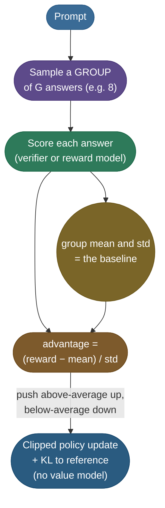

# Reinforcement Learning for Reasoning — GRPO and Verifiable Rewards

Reasoning models are trained, not prompted. The reward no longer comes from a model of human taste; it comes from a **checker** that can tell whether the answer is right.

- **The method:** reinforcement learning with verifiable rewards (**RLVR**) scores an answer with a math grader, a unit test or a compiler, and optimizes the policy against that ground truth.
- **What emerges:** long chains of thought. Nobody writes them as targets; the policy finds that thinking longer earns more reward.
- **Why it matters:** it's the largest capability shift of 2024–2026 (o1, DeepSeek-R1, o3, Qwen3, gpt-oss) and the most-asked frontier topic in interviews.

This page builds on [RLHF & DPO](/ai-ml/ai-ml-learning-resources/model-adaptation/preference-and-alignment-training/preference-and-alignment-training), which derives the PPO objective, the KL leash, the value model and the advantage that GRPO modifies.

---

## Why a verifiable reward changes the problem

RLHF optimizes a **learned** reward model, a proxy for human preference, and a proxy can be gamed. RLVR removes the proxy.

- **RLHF's reward:** a network's guess at which answer a person would prefer. Push hard and the policy finds text the network over-scores (reward hacking).
- **RLVR's reward:** whether the final answer matches, or the tests pass. There's no learned gap between measure and target to exploit, as long as the checker is sound.
- **The price:** it only applies where a checker exists: math, code, formal proofs, structured extraction with a known answer.

What interviewers probe, and the traps:

- **Outcome versus process rewards:** an outcome reward model (ORM) scores only the final answer; a process reward model (PRM) scores each reasoning step. PRMs give denser credit but need step-level labels.
- **The trap:** calling this "RLHF for math." Different reward source, different failure modes, different data pipeline.
- **The other trap:** assuming R1-Zero (pure RL, no supervised fine-tuning) is the shipped recipe. DeepSeek-R1 adds a supervised cold start because pure RL produced unreadable, language-mixed chains.

> **Warning:** a verifier removes reward-model hacking, not reward hacking.
> - A grader that only checks the final number rewards a right answer reached by wrong reasoning.
> - Unit tests that don't cover edge cases reward code that special-cases the tests.
> - Audit the checker as seriously as you would a reward model.

---

## GRPO: PPO without the value network

**GRPO** (group relative policy optimization), introduced in DeepSeekMath, is a PPO descendant with one structural change: **it deletes the value model**.

- **What PPO needed the critic for:** a baseline, so the advantage is "reward minus what was expected." Without a baseline the gradient's variance swamps the signal.
- **What it cost:** a fourth model the size of the policy, trained alongside it.
- **GRPO's replacement:** sample a **group** of answers to the *same* prompt, score them all, and use the group's own statistics as the baseline.

*The GRPO loop for one prompt: the group scores itself, the group statistics form the baseline, and the rest is PPO's clipped update with a KL penalty.*

### The group-relative advantage

For one prompt $q$, sample $G$ answers $o_1, \dots, o_G$ from the current policy and score them, $r_1, \dots, r_G$. With outcome rewards, every token of answer $i$ gets the same advantage:

$$\hat A_i = \frac{r_i - \operatorname{mean}(r_1,\dots,r_G)}{\operatorname{std}(r_1,\dots,r_G)}$$

- **The numerator is the baseline subtraction** PPO's critic used to provide, now read off the group for free.
- **The denominator normalizes the scale,** so an easy prompt (almost all correct) and a hard prompt (almost all wrong) contribute comparable gradient sizes.
- **If every answer scores the same,** the numerator is zero for all of them: the prompt teaches nothing, and practical recipes filter such prompts out.

### Worked example: four answers to one math problem

One prompt, a group of four sampled answers, a verifier reward of 1 for a correct final answer:

| Answer | Reward $r_i$ | Group mean | $r_i - \text{mean}$ | $\hat A_i$ (÷ std 0.5) | Update |
|---|---|---|---|---|---|
| A1 | 1.0 | 0.5 | **+0.5** | **+1.0** | push up |
| A2 | 1.0 | 0.5 | **+0.5** | **+1.0** | push up |
| A3 | 0.0 | 0.5 | **−0.5** | **−1.0** | push down |
| A4 | 0.0 | 0.5 | **−0.5** | **−1.0** | push down |

- **The baseline:** the group mean 0.5 is what a value network would otherwise have had to learn for this prompt.
- **The scale:** the population standard deviation of $\{1, 1, 0, 0\}$ is 0.5, so dividing turns ±0.5 into ±1.0.
- **A harder prompt,** say rewards $\{1, 0, 0, 0\}$: mean 0.25, std ≈ 0.433, so the one correct answer gets $\hat A \approx +1.73$ and each wrong one ≈ −0.58. A rare success is pushed up hard.

### What else changes relative to PPO

- **The update is PPO's clipped surrogate,** with $\hat A_i$ in place of the critic-based advantage.
- **The KL penalty moves into the loss.** GRPO adds $\beta\,\mathrm{KL}(\pi_\theta \Vert \pi_{\text{ref}})$ directly to the objective instead of subtracting it from the reward before computing advantages.
- **Models in memory:** the policy and the reference, plus a reward model only if the reward is learned. With a programmatic verifier it's two networks, against PPO's four.
- **Rollout cost goes up:** $G$ samples per prompt instead of one, so generation, not the backward pass, tends to dominate wall-clock time.

> **Note:** sources for this section.
> - GRPO's objective and group-relative advantage: [Shao et al., *DeepSeekMath* (2024)](https://arxiv.org/abs/2402.03300), §4.
> - GRPO with verifiable rewards at scale, and the cold-start fix: [DeepSeek-AI, *DeepSeek-R1* (2025)](https://arxiv.org/abs/2501.12948).
> - The PPO objective and value model being modified: [RLHF & DPO](/ai-ml/ai-ml-learning-resources/model-adaptation/preference-and-alignment-training/preference-and-alignment-training).

---

## References

The curated link library for this topic (videos, courses, articles, papers, books, resources, and internal cross-links) lives in a companion file so it can be reused as a standalone reference list:

**→ [Reinforcement Learning Post-training — references](/ai-ml/ai-ml-learning-resources/model-adaptation/reinforcement-learning-posttraining/reinforcement-learning-posttraining#references-further-reading)**
