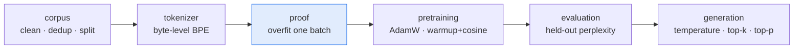

# Why Build a Model From Scratch

Fine-tuning adapts a checkpoint. Alignment nudges one. Quantization shrinks one. All three take the
base model as given — and the base model is where almost every decision that matters was already
made, by somebody else, for reasons you cannot read off the weights.

This build makes those decisions yours. By the end you will have:

- Cleaned and deduplicated an openly licensed corpus, and split it so the held-out numbers mean
  something.
- Trained a **byte-level byte-pair-encoding tokenizer** on your own text, and watched the
  compression ratio it achieves.
- Written a **decoder-only transformer** with the components current small models actually use —
  RMSNorm, rotary positions, fused causal attention, a gated feed-forward block, tied embeddings.
- Proved the gradient path works before spending a minute on training.
- Pretrained a **12.2-million-parameter model**, on a processor, in about twelve minutes.
- Measured its perplexity, read its loss curves, and generated text from it.
- Been able to say precisely what it can and cannot do.

The runnable companion is
[small-language-model](/python/python-production-examples/small-language-model/readme). Every command
in this course runs there, and every number quoted came out of it.

---

## What "from scratch" means here, and what it does not

**It means no model is downloaded.** Not the weights, not the tokenizer, not the architecture
config. The transformer is about two hundred lines of PyTorch in this project; the tokenizer is
another two hundred. Neither imports `transformers`.

**It does not mean no library.** The tensor library is PyTorch, which handles automatic
differentiation, the fused attention kernel and the optimizer. Writing those too would be a course
in numerical computing, not in language models, and the decisions you would make there are not the
ones this course exists to teach.

The line is drawn where understanding starts to matter:

| Written here | Used as given |
|---|---|
| Corpus cleaning, deduplication, splitting | Tensors and automatic differentiation |
| Tokenizer training and encoding | The fused attention kernel |
| Every layer of the transformer | AdamW's update rule |
| The training loop, schedule and checkpointing | Serialization |
| Decoding strategies | — |
| Perplexity | — |

---

## Two configurations, and why there are two

A project that only trains a real model cannot be tested: nobody runs a twelve-minute job in a test
suite. A project that only trains a toy cannot be believed: a two-layer model on a sixty-four-token
window proves nothing about the arc at scale.

So there are two presets, and both run on a processor:

| | `toy` | `scale` |
|---|---|---|
| Parameters | 139,584 | 12,194,688 |
| Context | 64 tokens | 256 tokens |
| Wall time | about 8 seconds, whole arc | 12 min 18 s |
| Held-out perplexity | 202.36 | 81.90 |
| Purpose | the end-to-end test runs the *real* pipeline | the model you actually keep |

```bash
cd python_based/python-production-examples/small-language-model
PYTHONPATH=. python -m slmkit.cli run --preset toy --device cpu
```

Eight seconds later you have been through every stage of this course once. The output is letter
soup — a hundred and forty thousand parameters cannot write English — and that is the honest,
useful result: it proves the machinery, not the model.

---

## The arc



Six stages, one chapter each after this one, plus two that are about reading results rather than
producing them. The highlighted box is the one people skip, and it is the one that saves the most
time.

---

## Where this sits beside the rest of the library

This is a **guided build**: a continuous project. The Workflow Library teaches one reusable
mechanism per workflow and is the right place to go deeper on any single stage:

- Deciding whether training is the answer at all —
  [Decide Whether to Fine-Tune](/ai-ml/ai-ml-learning-resources/model-adaptation/fine-tuning/decide-whether-to-fine-tune)
- The stage after this one, once you have a base model —
  [Build a Small Chat Model](/ai-ml/ai-ml-learning-resources/model-adaptation/build-a-small-chat-model/from-base-model-to-assistant)
- Serving a trained model —
  [Model Serving](/ai-ml/practitioner-workflows/inference-and-serving/model-serving)

Nothing in this course re-teaches those. What it adds is the connective tissue: the order the stages
go in, what each hands the next, and what goes wrong at each seam.

---

## Before you start

You need Python 3.12 and PyTorch. You do not need a graphics card, an API key, or a network
connection after the initial install — the corpus ships with the project.

```bash
cd python_based/python-production-examples/small-language-model
PYTHONPATH=. python -m pytest -q          # 65 tests, about three seconds
```

If that passes, everything in this course will run on your machine.

## Key takeaways

- **The base model is where the decisions live.** Fine-tuning, alignment and compression all inherit
  them; building one is how you get to make them.
- **From scratch means no downloaded model, not no library.** PyTorch handles autodiff and kernels;
  everything above that is written out.
- **Two configurations is what makes the project verifiable** — a toy that runs in the test suite,
  and a real model that runs in twelve minutes on a processor.
- **The overfit-one-batch proof comes before the expensive stage**, not after it.

## References

- The runnable project:
  [small-language-model](/python/python-production-examples/small-language-model/readme)
- Andrej Karpathy, *nanoGPT* — the canonical minimal implementation of this shape, MIT licensed:
  <https://github.com/karpathy/nanoGPT>
- Hugging Face, *LLM Course*, the chapter on training a language model from scratch — free and open:
  <https://huggingface.co/learn/llm-course>
