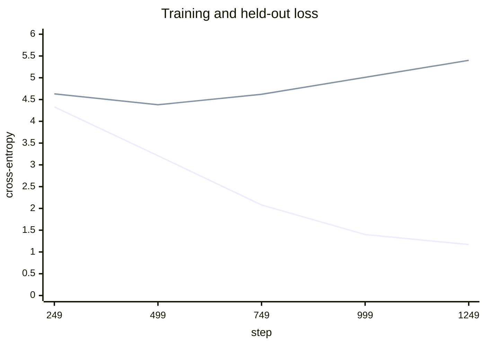

# Read the Training Curves

Here is the whole run, as two numbers at each evaluation:

| Step | 249 | 499 | 749 | 999 | 1249 |
|---|---|---|---|---|---|
| **Training loss** | 4.33 | 3.21 | 2.08 | 1.40 | 1.17 |
| **Held-out loss** | 4.6256 | **4.3772** | 4.6190 | 5.0145 | 5.4016 |



The training loss falls all the way. The held-out loss bottoms at step 499 and climbs from there.
**After step 500, every further step made the model worse at the only thing being measured.**

---

## What the divergence is

Two things are happening at once, and separating them is the skill:

- **The model is still learning.** The training loss is not flat, so gradient descent is doing its
  job on the objective it was given.
- **What it is learning stopped generalising.** From step 500 the parameters are absorbing
  particulars of the training passages — which speech follows which, which speaker says which
  phrase — that say nothing about text it has not seen.

This is memorisation, and it is the expected outcome, not a defect. The evidence is in the previous
chapter: a model of this size will memorise a batch of four sequences in two hundred steps. Given
five thousand six hundred documents and twenty-six passes over them, it will do the same thing more
slowly.

---

## Why it happened here, in one ratio

```text
training tokens   294,181
parameters        12,194,688
ratio             0.024 tokens per parameter
```

Compute-optimal work puts the useful ratio near **20 tokens per parameter**. This build is three
orders of magnitude below it. The model has far more capacity than the corpus has information, so
the surplus goes into storing the corpus.

Neither the schedule nor the architecture nor the optimizer caused this, and none of them can fix
it. **The corpus is the binding constraint.**

---

## What the code does about it

Three things, and each is a decision from the previous chapter now visible in the numbers.

**The kept checkpoint is step 500's**, not step 1,250's:

```text
loss: 8.4187 -> 1.1681 train, 4.3772 best validation
```

The final training loss is 1.1681. The checkpoint on disk is the one that scored **4.3772** on the
held-out split — the point before the divergence. Keeping the last checkpoint would have shipped a
model that is three times worse on unseen text and looks better on the training loss.

**Early stopping ended the run at 1,250** rather than 3,000. Three evaluations without improvement
— 749, 999, 1249 — and the loop breaks:

```text
early_stop  best_validation=4.3772 evaluations_without_improvement=3 step=1249
```

That saved 1,750 steps, about ten minutes, all of which would have made the model worse.

**Splitting by document content is what made the climb visible at all.** Split by token offset
instead and the held-out set would contain passages the model trained on; the held-out loss would
have tracked the training loss downward and this chapter would not exist.

---

## Reading a curve you have not seen before

| What you see | What it usually is | What to do |
|---|---|---|
| Both losses falling together | healthy training | keep going |
| Held-out flat, training falling | memorisation starting | note the step; the checkpoint policy handles it |
| Held-out **rising**, training falling | memorising in earnest | stop; more data, not more steps |
| Both flat and high | not learning | run the overfit proof — the fault is upstream |
| Loss becomes NaN | a diverged step | lower the peak learning rate, check clipping |
| Held-out **below** training | almost always a leaky split | check how the split was made |

The last row is worth a second look, because it is the one that gets celebrated. Held-out loss
comfortably below training loss usually means the held-out set is not held out.

---

## What would actually make this model better

In the order of how much they would move the number:

**More text.** The direct answer to a corpus-limited run.

```bash
SLM_CORPUS_PATH=/path/to/a/larger/open/corpus PYTHONPATH=. python -m slmkit.cli run --preset scale
```

**A smaller model, at this corpus size.** Twelve million parameters against 294,000 tokens is a
mismatch that a four-million-parameter model would suffer less from. That is a two-minute experiment
and a genuinely instructive one:

```bash
SLM_N_LAYER=4 SLM_N_EMBD=192 PYTHONPATH=. python -m slmkit.cli run --preset scale --device cpu
```

**Regularisation.** Dropout and stronger weight decay slow memorisation. They do not create
information the corpus does not contain, so they move the floor a little and not a lot.

**More steps.** Nothing. The curve says so.

---

## The thing to take away

The instinct when a run disappoints is to reach for the learning rate. The curve above is the case
where that instinct is exactly wrong, and it is a common case rather than an exotic one — most
domain-specific training runs are corpus-limited rather than tuning-limited.

**Compute the token-to-parameter ratio before changing a hyperparameter.** It answers the question
in ten seconds, and it is right more often than a sweep.

## Pitfalls

- **Tuning a corpus-limited run.** The ratio tells you first, and for free.
- **Keeping the final checkpoint.** After divergence it is reliably the worse artifact.
- **Treating a rising held-out loss as a bug.** It is a measurement working correctly.
- **Celebrating a held-out loss below the training loss.** Check the split.
- **Evaluating so rarely the divergence is invisible.** Five evaluations across a run is a floor,
  not a target.

## Key takeaways

- **Training loss falling while held-out loss rises is memorisation**, and it began at step 500 here.
- **0.024 tokens per parameter against a compute-optimal 20** is why — the corpus, not the recipe.
- **Best-checkpoint plus early stopping turned that from a wasted run into a finished one**: the
  artifact is step 500's, and 1,750 steps were never spent.
- **The honest fix is more text**, and a smaller model is the cheap second best.
- **A held-out loss below the training loss is a split bug** far more often than a good result.

## References

- Hoffmann et al., *Training Compute-Optimal Large Language Models*:
  <https://arxiv.org/abs/2203.15556>
- Kaplan et al., *Scaling Laws for Neural Language Models* — the earlier result the above corrected:
  <https://arxiv.org/abs/2001.08361>
- The run this chapter reads: `slmkit/training/loop.py` in
  [small-language-model](/python/python-production-examples/small-language-model/readme)
