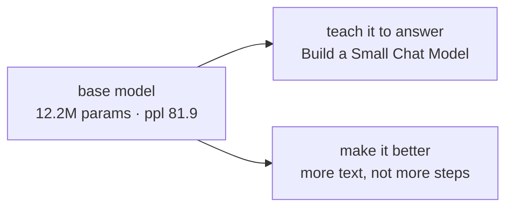

# Capabilities and Limitations

You now have a trained model, a perplexity, and some generated text. The last stage of any model
development is the one most often skipped: **writing down what it can and cannot do**, before anyone
asks.

This is not modesty. A model whose limits are stated can be deployed against the cases it fits; a
model whose limits are unknown is a liability whatever its benchmark says.

---

## What this model can do

- **Write text in the register of its corpus.** Speaker-colon-speech formatting, blank-verse line
  lengths, period vocabulary, correct-looking punctuation.
- **Produce locally grammatical English.** Subject and verb agree; clauses close.
- **Continue a prompt.** It is a base model, and continuation is the whole of what a base model does.
- **Do all of the above on a processor**, in twelve minutes of training, from a corpus you can read.

## What it cannot do

- **Mean anything.** It has no facts and no thread across sentences. *"the we might have made a
  gentleman to tell you"* is representative.
- **Follow an instruction.** It has never seen one. Ask it a question and it continues the question.
- **Stop.** No end-of-turn behaviour was trained, so it generates until the budget runs out.
- **Write anything but Elizabethan-flavoured English.** One author, one register, one language, a
  million characters.
- **Be compared to a released model.** Different corpus, different scale, different tokenizer. The
  perplexity of 81.9 belongs to this vocabulary and this test split and travels nowhere.

---

## The three numbers that bound it

| | Value | What it bounds |
|---|---|---|
| Parameters | 12,194,688 | how much it can store |
| Training tokens | 294,181 | how much there was to learn |
| Ratio | 0.024 tokens/parameter | why it memorised — compute-optimal is about 20 |

**The third row is the model's whole story.** It explains the curve in chapter seven, it explains why
early stopping fired, and it answers "how do I make this better" before anyone runs a sweep.

---

## What was actually learned here

The model is a by-product. What the build produced that transfers:

- **A corpus that is governed.** Licensed, provenance recorded, deduplicated, split so the held-out
  number is a measurement rather than a comfort.
- **A tokenizer you can reason about.** You know its compression ratio, why it was trained on the
  training split alone, and why perplexity numbers do not cross vocabularies.
- **An architecture you can derive.** Six components, each replacing something for a stated reason,
  and a parameter count you can compute from the configuration before allocating anything.
- **A proof that runs before the expensive part.** Twelve seconds that separate impossible from slow.
- **A training loop whose five decisions you can defend** — what to decay, how the rate moves, what
  the batch really is, what bounds a bad step, which checkpoint survives.
- **The habit of reading a curve** and knowing when the answer is data rather than tuning.

None of that changes at a thousand times the scale. The numbers change; the decisions are the same
decisions.

---

## Writing the model card

Every released model should ship with this, and at any scale it is the same six headings:

```markdown
## Model card — small-language-model (scale)

**What it is.** A 12.2M-parameter decoder-only transformer, pretrained from random
initialisation on 294,181 tokens of public-domain Elizabethan dramatic verse.

**Intended use.** Teaching and experimentation: understanding the pretraining arc end to
end on a processor. Not intended for any production use.

**Training data.** tiny-shakespeare (public domain text, MIT-licensed distribution),
cleaned, deduplicated and split by document content hash. Provenance in
`data/corpus/SOURCES.md`.

**Evaluation.** Held-out test perplexity 81.90 over 17,152 tokens, at this project's own
4,096-token vocabulary. Not comparable across tokenizers.

**Limitations.** No factual knowledge. No instruction following. Does not stop. Single
author, single register, single language. Memorises its corpus — held-out loss rises after
step 500.

**Ethical considerations.** Trained on public-domain literary text; no personal data, no
scraped web content. The corpus reflects the attitudes of its period, and the model will
reproduce them.
```

The last paragraph is not boilerplate. A model reproduces the distribution it was trained on,
including the parts nobody would write today, and a card that omits that has omitted something
material.

---

## The two directions from here



**Teach it to answer.**
[Build a Small Chat Model](/ai-ml/ai-ml-learning-resources/model-adaptation/build-a-small-chat-model/from-base-model-to-assistant)
takes this checkpoint and turns it into something you can talk to — conversation templating,
supervised fine-tuning, preference alignment, quantization and a chat loop. It also measures what
that costs, using this model's perplexity as the baseline.

**Make it better.** A larger openly licensed corpus, the same command:

```bash
SLM_CORPUS_PATH=/path/to/a/larger/corpus PYTHONPATH=. python -m slmkit.cli run --preset scale
```

## Pitfalls

- **Shipping a model without stating its limits.** The limits exist either way; only the surprise is
  optional.
- **Quoting perplexity across tokenizers.** It is a per-token measure.
- **Reading period text as neutral.** A model reproduces its corpus, attitudes included.
- **Treating the model as the deliverable.** The transferable output is the pipeline and the
  decisions.

## Key takeaways

- **State what the model cannot do, in writing, before anyone asks.**
- **The token-to-parameter ratio is the model's whole story** — 0.024 against a compute-optimal 20.
- **The decisions transfer; the numbers do not.** Nothing in this build changes shape at scale.
- **A model card is six headings**, and the limitations and ethics sections are the load-bearing
  ones.

## References

- Mitchell et al., *Model Cards for Model Reporting* — where the format comes from:
  <https://arxiv.org/abs/1810.03993>
- The project: [small-language-model](/python/python-production-examples/small-language-model/readme)
- The next build:
  [Build a Small Chat Model](/ai-ml/ai-ml-learning-resources/model-adaptation/build-a-small-chat-model/from-base-model-to-assistant)
